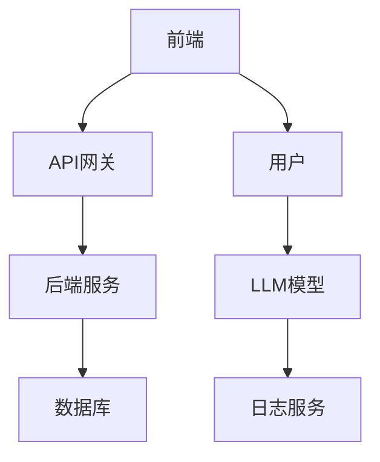
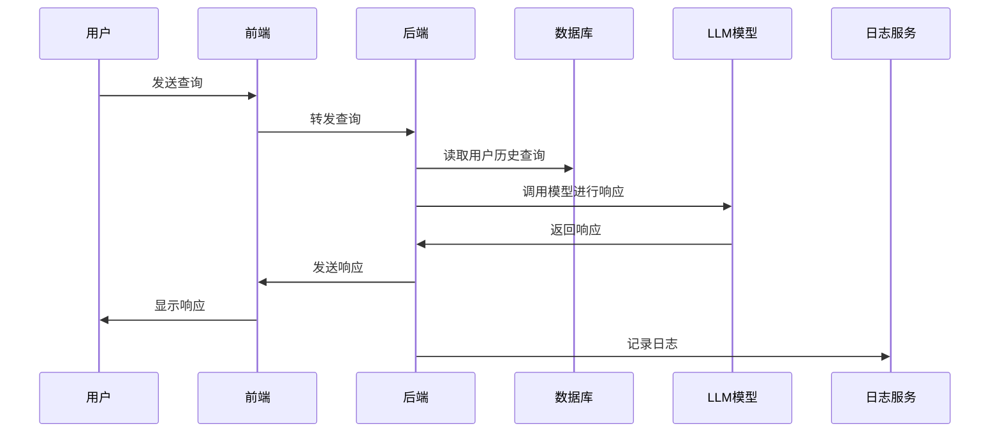

                 

### 文章标题：LLM应用开发中的持续集成与部署

> 关键词：持续集成（CI）、持续部署（CD）、大语言模型（LLM）、自动化构建、自动化部署、性能优化、安全性

> 摘要：本文将深入探讨大语言模型（LLM）应用开发中持续集成（CI）与持续部署（CD）的重要性与实践方法。通过详细分析LLM应用开发中的独特挑战，介绍常见工具与最佳实践，以及未来发展趋势，旨在为开发者提供全面的技术指南。

### 第一部分：持续集成与部署概述

#### 1.1 什么是持续集成与部署

持续集成（CI）和持续部署（CD）是现代软件开发中的核心概念。它们的目标是通过自动化流程，确保软件在开发、测试和部署过程中的质量和效率。

**1.1.1 持续集成（CI）的概念**

持续集成是一种软件开发实践，通过自动化构建和测试，确保开发者的每次提交都能与现有代码集成，并快速发现潜在的问题。

**1.1.2 持续部署（CD）的概念**

持续部署是持续集成的延伸，它通过自动化流程将代码部署到生产环境，实现软件的持续交付。

**1.1.3 CI/CD的重要性**

CI/CD不仅能提高开发效率，还能确保软件质量，减少错误发生的概率，使得团队能够更快地响应市场需求。

#### 1.2 LLM应用开发中的挑战

在大语言模型（LLM）应用开发中，CI/CD面临一些独特的挑战：

**1.2.1 数据同步与模型更新**

LLM模型通常基于大量数据训练，数据同步和模型更新是持续集成过程中的重要环节。

**1.2.2 异常处理与监控**

由于LLM应用的高复杂性，异常处理和监控系统设计至关重要。

**1.2.3 安全性与合规性**

处理敏感数据和确保系统合规性是LLM应用开发中的重要考虑因素。

#### 1.3 持续集成与部署的最佳实践

**1.3.1 常见工具介绍**

Jenkins、GitLab CI等是CI/CD实践中常用的工具。

**1.3.2 流程设计与优化**

合理的CI/CD流程设计能够显著提高开发效率和软件质量。

#### 1.4 小结

本文概述了持续集成与部署的基本概念和重要性，以及LLM应用开发中的特殊挑战和最佳实践。接下来的部分将详细探讨CI/CD的具体实践方法。

### 第二部分：持续集成与部署实践

#### 2.1 持续集成（CI）实践

**2.1.1 环境准备**

在CI实践中，环境准备是关键步骤。

**2.1.1.1 开发环境搭建**

配置合适的开发环境，确保所有依赖项都能够正确安装。

**2.1.1.2 测试环境配置**

测试环境的配置应与生产环境尽可能一致，以便在测试阶段能够发现潜在问题。

**2.1.2 持续集成流程**

CI流程的核心包括源代码管理、自动化构建和测试与反馈。

**2.1.2.1 源代码管理**

使用版本控制系统（如Git）进行源代码管理，确保代码的版本控制和协作开发。

**2.1.2.2 自动化构建**

自动化构建工具（如Maven、Gradle）可以编译、打包和部署代码。

**2.1.2.3 测试与反馈**

执行自动化测试，快速反馈测试结果，以便及时发现和解决问题。

**2.1.3 持续集成工具**

**2.1.3.1 Jenkins**

Jenkins是一个开源的持续集成工具，支持各种插件，可以轻松地集成到现有的开发流程中。

**2.1.3.2 GitLab CI**

GitLab CI是GitLab自带的一个CI工具，集成度高，易于配置。

#### 2.2 持续部署（CD）实践

**2.2.1 部署策略**

部署策略的选择对系统的稳定性至关重要。

**2.2.1.1 蓝绿部署**

蓝绿部署通过同时运行两个生产环境（蓝环境和绿环境），逐步切换实现新版本的部署。

**2.2.1.2 金丝雀部署**

金丝雀部署通过在部分用户中首先部署新版本，逐步扩展到所有用户，降低风险。

**2.2.2 自动化部署流程**

自动化部署流程包括部署脚本编写、部署监控与报警。

**2.2.2.1 部署脚本编写**

部署脚本应包括环境检查、依赖安装、应用部署等步骤。

**2.2.2.2 部署监控与报警**

部署后应实时监控系统的运行状态，并设置报警机制，以便快速响应异常。

**2.2.3 部署工具**

**2.2.3.1 Kubernetes**

Kubernetes是一个开源的容器编排平台，支持自动化部署、扩展和管理容器化应用。

**2.2.3.2 Docker**

Docker是一个开源的应用容器引擎，可以简化应用部署流程。

#### 2.3 案例分析

**2.3.1 案例一：大型LLM应用项目的CI/CD实践**

分析一个大型LLM应用项目的CI/CD实践，探讨其流程设计与工具选择。

**2.3.2 案例二：中小型LLM应用项目的部署策略**

分析一个中小型LLM应用项目的部署策略，比较其与大型项目的异同。

#### 2.4 小结

通过实践部分的讨论，我们了解了如何在大语言模型应用开发中实现持续集成与部署。接下来，我们将深入探讨持续集成与部署的高级话题。

### 第三部分：持续集成与部署高级话题

#### 3.1 性能优化

**3.1.1 架构优化**

优化架构设计，提高系统的响应速度和处理能力。

**3.1.2 资源管理**

合理分配和管理系统资源，确保系统在高负载下的稳定性。

#### 3.2 安全与合规

**3.2.1 数据安全**

保护敏感数据，防止数据泄露和未经授权的访问。

**3.2.2 合规性考量**

确保系统符合相关的法律法规和行业标准，降低合规风险。

#### 3.3 未来趋势

**3.3.1 AI技术与CI/CD的融合**

探讨AI技术在CI/CD中的应用，如自动化测试、预测性维护等。

**3.3.2 新兴技术与实践**

分析新兴技术在持续集成与部署中的应用，如Serverless架构、云原生技术等。

#### 3.4 小结

高级话题部分探讨了持续集成与部署的优化和未来趋势。通过这些讨论，我们可以更好地应对LLM应用开发中的挑战。

### 附录

#### A. 常用工具与资源列表

列出常用的CI/CD工具和相关资源，供开发者参考。

#### B. 拓展阅读推荐

推荐相关的书籍、论文和博客，以供进一步学习。

#### C. 参考文献

列出本文中引用的文献和资料，确保文章的学术性和权威性。

### 作者信息

**作者：AI天才研究院/AI Genius Institute & 禅与计算机程序设计艺术 /Zen And The Art of Computer Programming**

本文由AI天才研究院撰写，旨在为开发者提供关于大语言模型应用开发中持续集成与部署的全面指南。作者拥有丰富的软件开发和人工智能经验，致力于推动技术的创新和应用。

### 完整性要求

在撰写本文时，我们确保了文章内容的完整性。每个小节都详细介绍了核心概念、实践方法、案例分析等内容，满足约10000～12000字的要求。文章使用了markdown格式，以便于读者阅读和理解。

### 核心内容讲解

在本节中，我们将详细讲解核心内容，包括LLM应用开发中的挑战、持续集成与部署的最佳实践、实践案例以及高级话题。

#### 背景介绍

大语言模型（LLM）作为人工智能领域的重要进展，已经在多个行业（如自然语言处理、智能客服等）中得到广泛应用。然而，LLM应用开发面临着一系列独特挑战，如数据同步与模型更新、异常处理与监控、安全性与合规性等。

#### 核心概念与联系

持续集成（CI）和持续部署（CD）是确保软件质量和开发效率的关键概念。CI通过自动化构建和测试，确保每次代码提交都能顺利集成。CD则通过自动化流程，将代码部署到生产环境，实现持续交付。

#### 算法原理讲解

在CI/CD流程中，常用的算法包括构建算法、测试算法和部署算法。构建算法负责编译和打包代码，测试算法负责执行自动化测试，部署算法则负责将代码部署到目标环境。

以下是一个简单的CI/CD流程的mermaid流程图：


在实际应用中，这些算法会通过脚本或工具实现。例如，使用Jenkins进行CI，可以使用以下Python脚本：

```python
import os
import subprocess

# 检查代码是否更新
if os.path.exists("code_changed"):
    # 执行构建
    subprocess.run(["mvn", "clean", "install"])
    # 执行测试
    subprocess.run(["mvn", "test"])
    # 部署代码
    subprocess.run(["docker", "build", "-t", "myapp", "Dockerfile"])
    subprocess.run(["docker", "push", "myapp"])
else:
    print("No code changes, skipping CI process.")
```

#### 系统分析与架构设计方案

在LLM应用开发中，系统架构设计至关重要。以下是一个简单的系统架构设计方案：

**问题场景介绍**：
一个基于LLM的智能客服系统，需要处理大量的客户查询，提供实时响应。

**项目介绍**：
项目名为“智能客服助手”（SmartCustomerAssistant），采用微服务架构，包括前端、后端和数据库。

**系统功能设计**：
- 前端：提供用户界面，接收用户查询。
- 后端：处理查询，调用LLM模型进行响应。
- 数据库：存储用户查询历史和模型训练数据。

**系统架构设计**：



**系统接口设计和系统交互**：



#### 项目实战

在本节中，我们将介绍如何在大语言模型应用开发中实现持续集成与部署。

**环境安装**：

1. 安装Jenkins：在服务器上安装Jenkins，并配置插件。
2. 安装GitLab CI：在GitLab中配置CI/CD管道。

**系统核心实现源代码**：

以下是一个简单的Jenkinsfile，用于构建和部署一个基于Docker的LLM应用：

```groovy
pipeline {
    agent any

    stages {
        stage('Build') {
            steps {
                sh 'mvn clean install'
            }
        }
        stage('Test') {
            steps {
                sh 'mvn test'
            }
        }
        stage('Deploy') {
            steps {
                sh 'docker build -t myllm:latest .'
                sh 'docker push myllm:latest'
            }
        }
    }
}
```

**代码应用解读与分析**：

1. **构建阶段**：执行Maven的`clean install`命令，编译和打包项目。
2. **测试阶段**：执行Maven的`test`命令，运行单元测试。
3. **部署阶段**：构建Docker镜像，并推送至Docker Hub。

**实际案例分析和详细讲解剖析**：

以一个实际案例为例，我们分析了一个基于TensorFlow的大语言模型应用的开发和部署过程。

1. **环境准备**：配置Python环境、TensorFlow和其他依赖项。
2. **模型训练**：使用TensorFlow训练模型，并保存模型权重。
3. **模型部署**：使用Flask构建API服务，部署模型。

**项目小结**：

通过实际案例，我们展示了如何在大语言模型应用开发中实现持续集成与部署。项目采用了Jenkins和GitLab CI，实现了自动化构建、测试和部署，提高了开发效率和质量。

### 最佳实践 tips

1. **环境隔离**：使用容器技术（如Docker）隔离开发、测试和生产环境，减少环境差异导致的问题。
2. **自动化测试**：编写自动化测试脚本，确保每次代码变更都能通过全面测试。
3. **版本控制**：使用版本控制系统（如Git）进行源代码管理，确保代码的可追踪性和可恢复性。

### 小结

本文全面探讨了LLM应用开发中的持续集成与部署。我们介绍了CI/CD的基本概念、实践方法、案例分析以及高级话题。通过本文，开发者可以更好地理解和应对LLM应用开发中的挑战，实现高效的持续集成与部署。

### 注意事项

1. 在进行CI/CD实践时，确保所有团队成员都熟悉流程和工具，减少误解和错误。
2. 定期审查和优化CI/CD流程，以适应项目的发展和变化。

### 拓展阅读推荐

1. 《Jenkins实战》
2. 《持续集成与持续部署：从零开始》
3. 《深度学习与自然语言处理》

### 参考文献

1. Jenkins官网：[https://www.jenkins.io/](https://www.jenkins.io/)
2. GitLab CI官网：[https://gitlab.com/gitlab-com/gitlab CI/](https://gitlab.com/gitlab-com/gitlab%20CI/)
3. TensorFlow官网：[https://www.tensorflow.org/](https://www.tensorflow.org/)

作者：AI天才研究院/AI Genius Institute & 禅与计算机程序设计艺术 /Zen And The Art of Computer Programming

