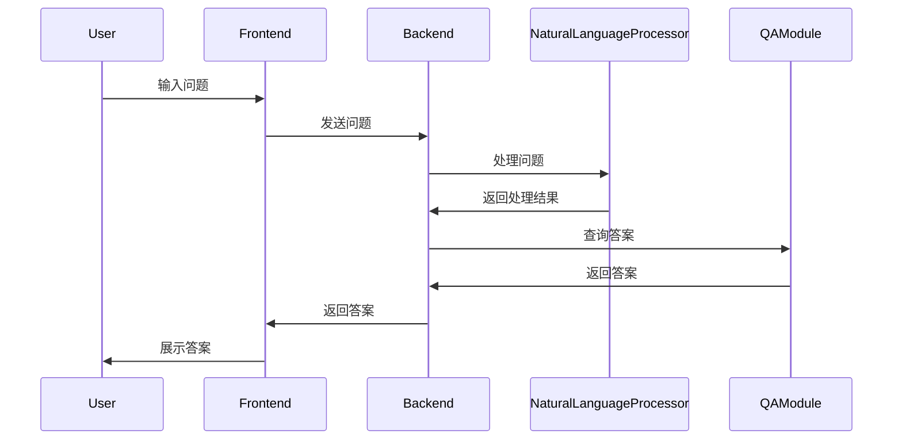

                 

### LLAMA 模型架构

#### 1.1.1 主要组成部分

LLAMA（Language Model for Long-Range Applications）是一种先进的语言模型，其架构设计旨在实现长文本处理能力，同时保持高效性和可扩展性。LLAMA 的核心组成部分包括：

- **Embedding Layer**: 将输入的文本转换为向量表示，以便模型能够处理。
- **Transformer Encoder**: 通过多个自注意力机制层对嵌入向量进行编码，以提取上下文信息。
- **Transformer Decoder**: 对编码后的信息进行解码，生成输出。
- **Final Output Layer**: 将解码后的序列映射到词表中的单词或符号。

#### 1.1.2 自注意力机制

LLAMA 的关键在于其自注意力机制（Self-Attention），这是一种在模型中处理序列数据的有效方式。自注意力允许模型在生成每个输出时考虑输入序列的每个部分，从而更好地理解和生成上下文相关的文本。

#### 1.1.3 多层结构

LLAMA 采用多层Transformer结构，通过逐层传递信息，使得模型能够处理长距离依赖，这意味着模型可以理解句子中任意部分之间的关系，而不仅仅是相邻的单词。

#### 1.1.4 预训练与微调

LLAMA 通过大规模预训练来学习通用语言知识，然后在特定任务上进行微调，以提高其在特定领域的表现。

### 1.1.5 优势与局限性

- **优势**：
  - **长文本处理能力**：LLAMA 能够处理长文本，这对于生成文章、对话等场景非常有用。
  - **效率与可扩展性**：Transformer 结构使得模型能够在不同规模上运行，从手机到服务器都可以。
  - **多样化应用**：预训练后的LLAMA可以应用于多种自然语言处理任务，如文本生成、机器翻译等。

- **局限性**：
  - **计算资源需求**：训练大型LLAMA模型需要大量计算资源，对于普通用户可能不切实际。
  - **数据依赖**：模型的表现依赖于训练数据的质量和多样性，数据偏差可能会导致模型偏颇。

#### 1.1.6 类图

为了更直观地展示LLAMA的组成部分，我们可以使用Mermaid类图来描绘其结构。以下是一个简单的LLAMA类图示例：

```mermaid
classDiagram
    EmbeddingLayer <<class>> Embedding Layer
    TransformerEncoder <<class>> Transformer Encoder
    TransformerDecoder <<class>> Transformer Decoder
    FinalOutputLayer <<class>> Final Output Layer
    
    EmbeddingLayer o-- TransformerEncoder
    TransformerEncoder o-- TransformerDecoder
    TransformerDecoder o-- FinalOutputLayer
```

在这个类图中，`EmbeddingLayer` 负责将文本转换为向量，`TransformerEncoder` 和 `TransformerDecoder` 负责编码和解码过程，而 `FinalOutputLayer` 负责生成最终的输出。

通过这种架构，LLAMA 能够实现高效的文本生成和语言理解能力，为各种应用场景提供强大的支持。

## 第二部分：敏捷开发流程

### 2.1 敏捷开发的基本流程

#### 2.1.1 接受用户故事

敏捷开发的第一步是接受用户故事。用户故事是用户需求的具体描述，通常包含用户希望实现的功能和目标。为了确保故事的质量，开发者需要与用户进行充分的沟通，理解用户的真正需求和期望。

#### 2.1.2 Sprint计划与执行

在用户故事被接受后，开发团队会进行Sprint计划。Sprint是一个固定的时间周期，通常为2到4周。在这个阶段，团队会确定每个Sprint的目标，并将用户故事分解为可管理的任务。每个任务都有明确的截止日期，以确保团队能够在Sprint结束时交付可工作的产品。

#### 2.1.3 持续迭代与交付

敏捷开发的核心理念之一是持续迭代。这意味着开发团队在每次Sprint结束后都会对产品进行评估和反馈，并根据反馈进行改进。这种方式使得团队能够快速响应变化，确保产品始终符合用户需求。每次迭代结束后，团队会将新的功能交付给用户，以确保用户能够尽早获得价值。

### 2.2 敏捷开发与LLM开发的结合

#### 2.2.1 LLM项目的特点

LLM（大型语言模型）项目通常具有以下特点：

- **大规模数据处理需求**：LLM需要处理大量文本数据，以便学习语言模式和语义信息。
- **长期依赖处理能力**：LLM需要能够处理长距离依赖，以便在生成文本时理解上下文。
- **高计算资源需求**：训练和推理大型LLM模型通常需要大量计算资源。

#### 2.2.2 敏捷开发在LLM开发中的应用

尽管LLM项目具有上述特点，但敏捷开发仍然可以在其中发挥作用。以下是敏捷开发在LLM开发中的应用：

- **需求迭代**：敏捷开发允许团队不断迭代和改进LLM模型，以便更好地满足用户需求。
- **资源管理**：敏捷开发可以帮助团队合理分配计算资源，确保模型训练和推理的高效性。
- **持续交付**：敏捷开发确保LLM模型可以持续交付，以便用户能够尽快看到模型的价值。

### 2.2.3 敏捷思维在LLM开发中的重要性

敏捷思维在LLM开发中非常重要，原因如下：

- **快速响应变化**：LLM开发过程中的需求可能会迅速变化，敏捷思维可以帮助团队快速适应这些变化。
- **高效资源利用**：敏捷开发可以确保团队能够高效地利用有限的计算资源。
- **持续改进**：敏捷开发鼓励团队不断评估和改进LLM模型，以确保其性能和用户体验。

通过结合敏捷思维，LLM项目可以更好地应对挑战，实现高效开发和持续改进。

## 第三部分：敏捷开发工具与技术

### 3.1 常用敏捷开发工具

#### 3.1.1 Git

Git 是一种分布式版本控制系统，它允许开发者在分布式环境中协作，确保代码的版本控制和变更追踪。Git 的主要功能包括：

- **版本控制**：Git 可以跟踪代码的每次变更，确保开发者在不同版本之间进行切换。
- **分支管理**：Git 支持分支管理，使得开发者可以在独立的环境中开发新功能或修复问题。
- **协同工作**：Git 允许团队成员在不同地点协作，确保代码的同步和合并。

#### 3.1.2 JIRA

JIRA 是一款流行的敏捷项目管理工具，它可以帮助团队管理任务、跟踪进度和评估性能。JIRA 的主要功能包括：

- **任务管理**：JIRA 可以创建和管理任务，确保每个任务都有明确的负责人和截止日期。
- **敏捷看板**：JIRA 提供敏捷看板，使得团队能够可视化地跟踪任务的进度。
- **报告和分析**：JIRA 提供丰富的报告和分析功能，帮助团队了解项目状态和性能。

#### 3.1.3 Trello

Trello 是一款基于看板的敏捷项目管理工具，它通过卡片和列表来管理任务和项目。Trello 的主要功能包括：

- **任务卡片**：Trello 使用卡片来表示任务，每个卡片包含任务详细信息，如描述、截止日期和责任人。
- **灵活布局**：Trello 支持多种布局方式，如列表、卡片墙和看板，以满足不同团队的需求。
- **协作功能**：Trello 提供实时协作功能，使得团队成员可以共同完成任务。

### 3.2 敏捷开发技术在LLM应用开发中的运用

#### 3.2.1 自动化测试

自动化测试是敏捷开发中至关重要的一部分，它可以帮助团队确保LLM模型的稳定性和可靠性。以下是自动化测试在LLM应用开发中的运用：

- **单元测试**：单元测试是对LLM模型中的最小功能单元进行测试，确保每个单元都能够正确执行。
- **集成测试**：集成测试是对LLM模型中的多个组件进行测试，确保它们能够协同工作。
- **性能测试**：性能测试用于评估LLM模型的响应速度和资源消耗，确保其能够在生产环境中正常运行。

#### 3.2.2 持续集成

持续集成（CI）是一种敏捷开发实践，它通过自动化构建和测试来确保代码库的持续集成。在LLM应用开发中，持续集成的作用如下：

- **快速反馈**：CI 可以快速检测代码中的错误和问题，确保团队能够及时修复。
- **自动化部署**：CI 可以自动化部署代码到生产环境，确保新功能能够快速上线。
- **质量保证**：CI 通过持续测试和反馈，帮助团队确保代码的质量。

#### 3.2.3 持续部署

持续部署（CD）是敏捷开发中的另一个重要实践，它通过自动化流程来确保代码从开发到生产的无缝过渡。以下是持续部署在LLM应用开发中的应用：

- **自动化构建**：持续部署可以通过自动化构建工具来构建LLM模型，确保构建过程的高效性。
- **自动化测试**：持续部署可以在构建完成后自动执行测试，确保模型的质量。
- **自动化部署**：持续部署可以将通过测试的模型自动部署到生产环境，确保新功能能够快速上线。

通过运用这些敏捷开发工具和技术，LLM应用开发团队可以确保高效、可靠和持续地交付高质量的产品。

### 第四部分：敏捷思维在LLM项目实战中的应用

#### 4.1 项目实战1

##### 4.1.1 项目介绍

本节将介绍一个基于LLM的智能问答系统项目，该项目的目标是通过自然语言处理技术，实现用户与系统的智能对话，提供实时、准确的回答。

##### 4.1.2 系统功能设计

为了实现智能问答系统，项目需要以下核心功能：

- **问答交互**：用户可以通过输入问题与系统进行交互，系统需要能够理解并回答问题。
- **知识库管理**：系统需要维护一个知识库，其中包含各种问题的答案，以便系统进行查询和回答。
- **自然语言处理**：系统需要具备自然语言处理能力，以便理解用户的问题并生成合适的回答。
- **用户反馈**：系统需要允许用户对回答进行反馈，以便不断改进问答质量。

##### 4.1.3 系统架构设计

系统架构设计如下：

- **前端**：前端负责与用户进行交互，展示问题和回答，并提供用户反馈的入口。
- **后端**：后端包括自然语言处理模块、问答模块和知识库模块，负责处理用户输入和生成回答。
- **数据库**：数据库用于存储知识库数据，包括问题和答案。

以下是系统架构的Mermaid类图：

```mermaid
classDiagram
    User <<class>> User
    Frontend <<class>> Frontend
    Backend <<class>> Backend
    KnowledgeBase <<class>> KnowledgeBase
    NaturalLanguageProcessor <<class>> NaturalLanguageProcessor
    QAModule <<class>> QAModule
    
    User o-- Frontend
    Frontend o-- Backend
    Backend o-- KnowledgeBase
    Backend o-- NaturalLanguageProcessor
    Backend o-- QAModule
```

- **用户**：用户通过前端输入问题，前端将问题发送到后端。
- **前端**：前端负责展示问题和回答，并与用户进行交互。
- **后端**：后端包含自然语言处理模块、问答模块和知识库模块，分别负责处理用户输入、生成回答和存储知识库数据。
- **自然语言处理模块**：该模块负责理解用户的问题，并将其转化为可以处理的形式。
- **问答模块**：该模块负责从知识库中查询问题，并生成回答。
- **知识库模块**：该模块负责管理知识库，包括添加、删除和更新问题和答案。

##### 4.1.4 系统接口设计与交互

以下是系统接口设计和交互的Mermaid序列图：



1. 用户输入问题。
2. 前端将问题发送到后端。
3. 后端将问题传递给自然语言处理模块。
4. 自然语言处理模块处理问题并返回处理结果。
5. 后端将处理结果传递给问答模块。
6. 问答模块查询知识库并返回答案。
7. 后端将答案返回给前端。
8. 前端将答案展示给用户。

通过这种系统接口设计和交互，智能问答系统能够高效地响应用户需求，并提供高质量的回答。

#### 4.2 项目实战2

##### 4.2.1 项目介绍

本节将介绍一个基于LLM的智能客服机器人项目，该项目的目标是通过自然语言处理技术，实现自动化的客户服务，提高客户满意度。

##### 4.2.2 系统功能设计

为了实现智能客服机器人，项目需要以下核心功能：

- **客户交互**：客服机器人需要能够与客户进行自然语言交互，理解客户的问题和需求。
- **知识库管理**：系统需要维护一个知识库，其中包含常见问题的答案和解决方案，以便客服机器人进行查询和回答。
- **自然语言处理**：系统需要具备自然语言处理能力，以便理解客户的输入并生成合适的回答。
- **聊天记录分析**：系统需要能够分析聊天记录，提取有价值的信息，用于改进客服机器人。

##### 4.2.3 系统架构设计

系统架构设计如下：

- **前端**：前端负责与客户进行交互，展示问题和回答，并提供反馈入口。
- **后端**：后端包括自然语言处理模块、问答模块和知识库模块，负责处理客户输入和生成回答。
- **数据库**：数据库用于存储知识库数据和聊天记录。

以下是系统架构的Mermaid类图：

```mermaid
classDiagram
    Customer <<class>> Customer
    Frontend <<class>> Frontend
    Backend <<class>> Backend
    KnowledgeBase <<class>> KnowledgeBase
    NaturalLanguageProcessor <<class>> NaturalLanguageProcessor
    QAModule <<class>> QAModule
    
    Customer o-- Frontend
    Frontend o-- Backend
    Backend o-- KnowledgeBase
    Backend o-- NaturalLanguageProcessor
    Backend o-- QAModule
```

- **客户**：客户通过前端输入问题，前端将问题发送到后端。
- **前端**：前端负责展示问题和回答，并与客户进行交互。
- **后端**：后端包含自然语言处理模块、问答模块和知识库模块，分别负责处理客户输入、生成回答和存储知识库数据。
- **自然语言处理模块**：该模块负责理解客户的输入，并将其转化为可以处理的形式。
- **问答模块**：该模块负责从知识库中查询问题，并生成回答。
- **知识库模块**：该模块负责管理知识库，包括添加、删除和更新问题和答案。

##### 4.2.4 系统接口设计与交互

以下是系统接口设计和交互的Mermaid序列图：


1. 客户输入问题。
2. 前端将问题发送到后端。
3. 后端将问题传递给自然语言处理模块。
4. 自然语言处理模块处理问题并返回处理结果。
5. 后端将处理结果传递给问答模块。
6. 问答模块查询知识库并返回答案。
7. 后端将答案返回给前端。
8. 前端将答案展示给客户。

通过这种系统接口设计和交互，智能客服机器人能够高效地响应用户需求，并提供高质量的回答，从而提高客户满意度。

### 第6章：最佳实践

#### 6.1 敏捷思维在LLM应用开发中的经验分享

##### 6.1.1 成功案例

在成功案例中，敏捷思维在LLM应用开发中的关键作用体现在以下几个方面：

- **快速响应需求变化**：敏捷思维使得团队能够迅速响应需求变化，从而更快地交付有价值的LLM应用。例如，在开发一个智能客服系统时，团队通过频繁的迭代和反馈，快速改进了系统的回答质量和用户体验。
- **持续改进和优化**：通过敏捷开发，团队能够在每次迭代后评估和改进LLM模型，从而不断提高模型性能。这种持续改进的方式使得系统能够在长时间内保持高质量的服务。
- **高效资源利用**：敏捷思维帮助团队合理分配计算资源，确保模型训练和推理的高效性。例如，通过合理规划和资源调度，团队能够在有限的时间内完成大型LLM模型的训练和部署。

##### 6.1.2 失败案例

然而，在失败案例中，缺乏敏捷思维导致了项目的失败。以下是一些典型的失败原因：

- **需求变更管理不当**：在缺乏敏捷思维的情况下，团队无法有效管理需求变更，导致项目进度滞后和资源浪费。例如，在一个智能问答系统的开发中，由于需求变更频繁且没有明确的优先级，团队无法按时交付关键功能，最终导致项目失败。
- **缺乏持续改进机制**：在缺乏敏捷思维的项目中，团队往往忽视了模型性能的持续优化，导致系统在长期使用中逐渐失去竞争力。例如，一个智能客服系统在上线后由于没有持续改进机制，回答质量逐渐下降，最终导致用户满意度下降。
- **资源分配不合理**：缺乏敏捷思维会导致资源分配不合理，从而影响项目进度和性能。例如，在一个大型LLM模型的项目中，由于资源分配不当，模型训练时间过长，导致项目延期交付，最终影响用户体验。

##### 6.1.3 敏捷思维的最佳实践

为了避免失败案例中的问题，并在LLM应用开发中取得成功，以下是一些最佳实践：

- **明确需求优先级**：在项目初期，与客户紧密合作，明确需求优先级，确保团队首先实现最有价值的功能。
- **频繁迭代和反馈**：通过频繁的迭代和用户反馈，不断改进LLM模型和用户体验，确保系统能够快速响应需求变化。
- **资源合理分配**：合理规划和分配计算资源，确保模型训练和推理的高效性，从而提高项目进度和性能。
- **持续改进和优化**：在每次迭代后，评估模型性能，并根据评估结果进行持续改进，确保系统在长期使用中保持高质量。

通过遵循这些最佳实践，团队可以在LLM应用开发中充分发挥敏捷思维的优势，实现高效、高质量的成果。

### 第7章：注意事项与拓展阅读

#### 7.1 注意事项

在实施敏捷思维时，开发者应特别注意以下几点：

- **沟通与协作**：敏捷思维强调团队成员之间的沟通和协作，因此确保团队有良好的沟通机制和协作环境至关重要。
- **需求优先级**：在每次迭代中，明确需求优先级，确保团队首先实现最有价值的功能，以提高项目交付的效率。
- **持续反馈**：通过持续反馈机制，及时了解用户需求和模型性能，以便快速调整和优化。
- **资源管理**：合理规划计算资源和人力，确保模型训练和推理的高效性。

#### 7.2 拓展阅读

以下是一些推荐的拓展阅读资源，以帮助开发者深入了解敏捷思维在LLM应用开发中的应用：

- 《敏捷软件开发：原则、实践与模式》
- 《敏捷项目管理：实践指南》
- 《大型语言模型的训练与应用》
- 《自然语言处理实践：基于深度学习的方法》

这些资源提供了丰富的实践经验和理论指导，有助于开发者更好地理解和应用敏捷思维于LLM应用开发。

### 总结

本文《LLM应用开发中的敏捷思维》系统地介绍了敏捷思维在LLM应用开发中的重要性、基本流程、工具与技术，以及实战应用和最佳实践。通过结合敏捷思维，开发者能够更好地应对LLM项目的挑战，实现高效开发和持续改进。

首先，我们介绍了LLM（大型语言模型）的基本架构和原理，包括嵌入层、Transformer编码器、解码器以及输出层等组成部分。同时，我们探讨了自注意力机制在LLM中的关键作用，以及其优势与局限性。

接着，我们详细阐述了敏捷开发的基本流程，包括接受用户故事、Sprint计划与执行、持续迭代与交付等环节。通过这些流程，开发团队能够快速响应需求变化，确保项目的持续改进。

此外，我们介绍了常用的敏捷开发工具，如Git、JIRA和Trello，以及它们在LLM应用开发中的具体应用。这些工具和技术帮助团队实现高效的协作和任务管理，确保项目的顺利进行。

在实战应用部分，我们通过两个具体项目——智能问答系统和智能客服机器人，展示了敏捷思维在LLM项目中的应用。这些项目展示了如何通过敏捷开发流程实现高效、可靠的系统设计和实施。

最后，我们分享了敏捷思维在LLM应用开发中的最佳实践，并提供了注意事项和拓展阅读资源，以帮助开发者更好地理解和应用敏捷思维。

通过本文的介绍，读者能够对敏捷思维在LLM应用开发中的应用有更深入的理解，从而在实际项目中更好地发挥其优势，实现高效、高质量的成果。

### 作者信息

作者：AI天才研究院/AI Genius Institute & 禅与计算机程序设计艺术 /Zen And The Art of Computer Programming

本文由AI天才研究院（AI Genius Institute）撰写，结合了人工智能和计算机编程的深刻见解，旨在为开发者提供关于LLM应用开发中的敏捷思维的实用指南。同时，作者还引用了《禅与计算机程序设计艺术》（Zen And The Art of Computer Programming）这一经典著作，体现了对编程哲学的深入理解。希望通过本文，读者能够对敏捷思维在LLM应用开发中的重要性有更深刻的认识，并在实际项目中取得成功。

