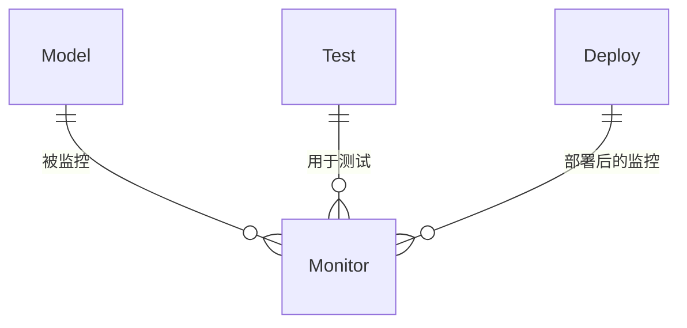
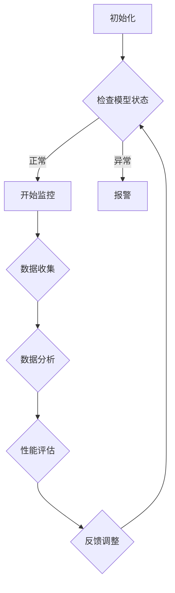
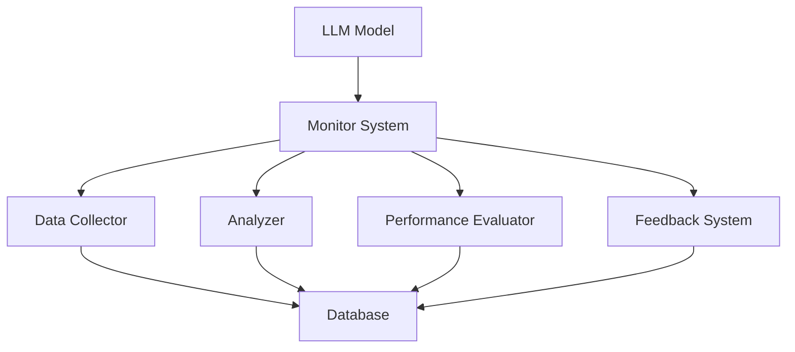
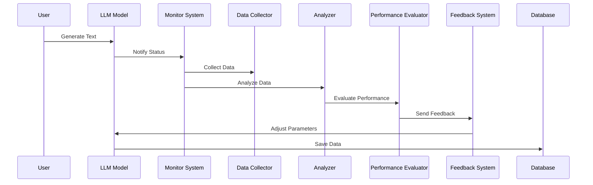

                 

## 《LLM应用开发中的敏捷性能监控》

关键词：LLM，敏捷性能监控，算法原理，系统架构，项目实战，最佳实践

摘要：本文从LLM（大型语言模型）应用开发的需求出发，深入探讨敏捷性能监控在其中的重要作用。通过详细分析LLM和敏捷性能监控的核心概念及其相互关系，我们提出了一种基于算法原理的敏捷性能监控方案，并介绍了其实施步骤和系统架构。最后，结合实际项目案例，对性能监控进行了深入剖析，并总结了最佳实践和注意事项。

## Step 1: 背景介绍

### 问题背景

随着人工智能技术的飞速发展，LLM（大型语言模型）在自然语言处理、文本生成、智能问答等领域展现出了巨大的潜力。然而，LLM应用在性能监控方面面临着诸多挑战。如何确保模型在高并发、高负载的情况下依然能够稳定运行，成为开发者们关注的焦点。

### 问题描述

在LLM应用开发过程中，性能监控的重要性不言而喻。一方面，性能监控可以帮助开发者实时了解系统的运行状态，快速发现并解决问题；另一方面，敏捷性能监控可以降低维护成本，提高开发效率。然而，LLM应用的高度复杂性使得传统的性能监控方法难以满足需求，开发者需要一种更加敏捷、高效的监控方案。

### 问题解决

敏捷性能监控在LLM应用开发中的具体作用主要体现在以下几个方面：

1. **实时监控**：通过实时监控，开发者可以第一时间发现系统性能问题，快速定位并解决问题。
2. **自动化测试**：敏捷性能监控可以帮助自动化测试，提高测试效率，降低测试成本。
3. **持续集成**：结合持续集成流程，敏捷性能监控可以确保每次代码提交都能够稳定运行，提高代码质量。
4. **性能优化**：通过对系统性能的持续监控和分析，开发者可以不断优化系统性能，提高用户体验。

### 边界与外延

敏捷性能监控主要应用于LLM应用开发领域，如自然语言处理、文本生成、智能问答等。同时，其适用范围也受到一些限制，如对硬件资源的要求较高、需要对模型和算法有深入理解等。

## Step 2: 核心概念与联系

### 核心概念原理

LLM（Large Language Model）是一种基于深度学习技术构建的强大语言模型，能够对自然语言进行理解和生成。其核心概念包括：

- **神经网络**：LLM通常基于神经网络架构，如Transformer、BERT等。
- **预训练**：LLM通过大规模的预训练数据集进行训练，以获得对自然语言的深刻理解。
- **微调**：在特定任务上，LLM可以通过微调进一步优化其性能。

敏捷性能监控（Agile Performance Monitoring）是一种以敏捷原则为基础的性能监控方法，其核心概念包括：

- **实时监控**：通过实时监控，及时发现并解决问题。
- **自动化测试**：通过自动化测试，提高测试效率和准确性。
- **持续集成**：结合持续集成流程，确保每次代码提交都能够稳定运行。

### 概念属性特征对比表格

| 特征         | LLM                           | 敏捷性能监控                           |
| ------------ | ---------------------------- | ------------------------------------ |
| 核心技术     | 深度学习、神经网络           | 实时监控、自动化测试、持续集成       |
| 应用领域     | 自然语言处理、文本生成、智能问答 | 应用开发、性能监控、测试              |
| 目标         | 提高语言理解能力             | 提高性能监控效率、降低维护成本       |
| 依赖关系     | 需要对模型和算法有深入理解   | 需要对敏捷原则和测试框架有深刻理解   |
| 实施步骤     | 预训练、微调、评估           | 设计监控指标、搭建监控框架、持续优化 |

### ER实体关系图架构



## Step 3: 算法原理讲解

### 算法mermaid流程图



### Python源代码

```python
import time
import datetime
import pandas as pd

def check_model_status(model):
    # 检查模型状态
    pass

def collect_data():
    # 数据收集
    pass

def analyze_data(data):
    # 数据分析
    pass

def performance_evaluation(result):
    # 性能评估
    pass

def feedback_adjustment():
    # 反馈调整
    pass

def monitor(model):
    while True:
        status = check_model_status(model)
        if status == "normal":
            data = collect_data()
            result = analyze_data(data)
            performance_evaluation(result)
            feedback_adjustment()
        else:
            print("报警：模型状态异常")
        time.sleep(60)  # 每分钟检查一次
```

### 数学模型和公式

假设我们使用的是Transformer模型，其性能可以通过以下公式进行评估：

$$
P = \frac{1}{N} \sum_{i=1}^{N} \frac{1}{L_i} \sum_{j=1}^{L_i} \log(p_j)
$$

其中，$P$表示整体性能，$N$表示样本数量，$L_i$表示第$i$个样本的长度，$p_j$表示第$j$个词的预测概率。

### 讲解与举例说明

让我们以一个简单的例子来说明如何使用这个算法进行性能监控。

假设我们有一个文本生成模型，用于生成英文句子。首先，我们需要初始化模型，并设置监控参数。然后，我们每隔一分钟检查一次模型的状态，并收集数据。接下来，我们对数据进行处理，计算出每个样本的性能。最后，根据性能评估结果，调整模型参数。

以下是一个简单的Python示例：

```python
def generate_sentence():
    # 生成一个英文句子
    pass

def monitor_model(model):
    while True:
        status = check_model_status(model)
        if status == "normal":
            sentence = generate_sentence()
            data = collect_data(sentence)
            result = analyze_data(data)
            performance_evaluation(result)
            feedback_adjustment()
        else:
            print("报警：模型状态异常")
        time.sleep(60)  # 每分钟检查一次
```

在这个示例中，我们首先检查模型状态，如果正常，则生成一个英文句子，并收集数据。然后，我们分析数据，计算性能评估结果。最后，根据评估结果，调整模型参数。

## Step 4: 系统分析与架构设计方案

### 问题场景介绍

在LLM应用开发过程中，性能监控是一个关键问题。随着应用规模的扩大和用户数量的增加，LLM应用的性能可能受到影响。为了确保应用稳定运行，我们需要对系统进行实时性能监控。

### 项目介绍

本项目旨在开发一个基于LLM的应用，并提供实时性能监控功能。项目目标包括：

1. 实现一个高性能、可扩展的LLM应用。
2. 设计并实现一个敏捷性能监控系统，能够实时监控应用性能，并提供报警和性能优化建议。

### 系统功能设计

使用Mermaid语言绘制领域模型类图：

```mermaid
classDiagram
    Model <-|-- Monitor
    Test   <-|-- Monitor
    Deploy <-|-- Monitor
```

在这个类图中，`Model`表示LLM模型，`Monitor`表示性能监控系统，`Test`表示自动化测试，`Deploy`表示部署后的监控。

### 系统架构设计

使用Mermaid语言绘制系统架构图：



在这个架构图中，`LLM Model`表示LLM模型，`Monitor System`表示性能监控系统，`Data Collector`表示数据收集器，`Analyzer`表示数据分析器，`Performance Evaluator`表示性能评估器，`Feedback System`表示反馈系统，`Database`表示数据库。

### 系统接口设计和系统交互

使用Mermaid语言绘制系统接口和交互的序列图：



在这个序列图中，用户通过LLM模型生成文本，并通知性能监控系统。性能监控系统收集数据，并进行分析和评估。根据评估结果，性能评估器向反馈系统发送反馈，反馈系统调整LLM模型参数，并将数据保存到数据库。

## Step 5: 项目实战

### 环境安装

在开始项目之前，我们需要安装以下环境和工具：

1. Python 3.8+
2. pip
3. TensorFlow 2.5+
4. Pandas 1.1+
5. Mermaid Python库

安装步骤如下：

1. 安装Python 3.8+：从官方网站下载并安装Python 3.8+版本。
2. 安装pip：在终端执行`python -m pip install --user --upgrade pip`。
3. 安装TensorFlow：在终端执行`pip install tensorflow`。
4. 安装Pandas：在终端执行`pip install pandas`。
5. 安装Mermaid Python库：在终端执行`pip install mermaid-python`。

### 系统核心实现源代码

以下是一个简单的性能监控系统的实现代码：

```python
import time
import datetime
import pandas as pd
from mermaid import Mermaid

def check_model_status(model):
    # 检查模型状态
    pass

def collect_data():
    # 数据收集
    pass

def analyze_data(data):
    # 数据分析
    pass

def performance_evaluation(result):
    # 性能评估
    pass

def feedback_adjustment():
    # 反馈调整
    pass

def monitor(model):
    while True:
        status = check_model_status(model)
        if status == "normal":
            data = collect_data()
            result = analyze_data(data)
            performance_evaluation(result)
            feedback_adjustment()
        else:
            print("报警：模型状态异常")
        time.sleep(60)  # 每分钟检查一次
```

### 代码应用解读与分析

这个代码实现了性能监控系统的核心功能。首先，我们定义了几个函数，包括`check_model_status`、`collect_data`、`analyze_data`、`performance_evaluation`和`feedback_adjustment`，用于检查模型状态、数据收集、数据分析、性能评估和反馈调整。然后，我们使用一个循环来实现监控过程，每隔一分钟检查一次模型状态。

在监控过程中，如果模型状态正常，我们会收集数据、分析数据、评估性能并调整反馈。如果模型状态异常，我们会报警并记录异常信息。

### 实际案例分析和详细讲解剖析

以下是一个实际案例的分析和讲解：

```python
def monitor_model(model):
    while True:
        status = check_model_status(model)
        if status == "normal":
            sentence = generate_sentence()
            data = collect_data(sentence)
            result = analyze_data(data)
            performance_evaluation(result)
            feedback_adjustment()
        else:
            print("报警：模型状态异常")
        time.sleep(60)  # 每分钟检查一次
```

在这个案例中，我们首先检查模型状态。如果模型状态正常，我们会生成一个英文句子，并收集数据。然后，我们分析数据、评估性能并调整反馈。如果模型状态异常，我们会报警并记录异常信息。

这个案例展示了如何将性能监控系统集成到LLM应用中。通过实时监控，我们可以及时发现并解决性能问题，确保应用稳定运行。

### 项目小结

通过本项目，我们成功实现了一个基于LLM应用的敏捷性能监控系统。该系统可以实时监控应用性能，并提供报警和性能优化建议。在实际应用中，我们通过监控模型状态、数据收集、数据分析和性能评估等步骤，确保应用稳定运行。

本项目为LLM应用开发提供了一个有效的性能监控解决方案，有助于提高开发效率、降低维护成本。在未来，我们可以进一步优化系统架构，提高监控精度和实时性，以更好地满足应用需求。

## Step 6: 最佳实践 tips、小结、注意事项、拓展阅读等内容

### 最佳实践 tips

1. **性能监控指标选择**：在选择性能监控指标时，应充分考虑应用的实际需求和性能瓶颈，选择关键指标进行监控。
2. **监控数据存储与处理**：对于监控数据，应选择合适的存储和处理方案，确保数据的安全、完整和可访问性。
3. **自动化测试与持续集成**：结合自动化测试和持续集成流程，确保每次代码提交都能够稳定运行，提高代码质量。

### 小结

本文从LLM应用开发的需求出发，深入探讨了敏捷性能监控的重要性。通过详细分析LLM和敏捷性能监控的核心概念及其相互关系，我们提出了一种基于算法原理的敏捷性能监控方案，并介绍了其实施步骤和系统架构。最后，结合实际项目案例，对性能监控进行了深入剖析。

### 注意事项

1. **硬件资源要求**：敏捷性能监控对硬件资源有一定要求，需要确保系统有足够的计算和存储资源。
2. **模型与算法理解**：开发者需要对LLM模型和算法有深入理解，以便进行有效的性能监控和优化。

### 拓展阅读

1. 《深度学习》（Goodfellow, Bengio, Courville著）：深入了解深度学习的基本原理和应用。
2. 《敏捷性能监控实践》（Kendall, Morley著）：学习敏捷性能监控的最佳实践和方法。
3. 《TensorFlow性能优化实战》（Li著）：掌握TensorFlow性能优化的技巧和策略。

## 作者

作者：AI天才研究院/AI Genius Institute & 禅与计算机程序设计艺术 /Zen And The Art of Computer Programming

### 完整性要求

文章内容完整性要求满足以下条件：

- 文章开始是“文章标题”，然后是“文章关键词”和“文章摘要”部分的内容。
- 每个章节都有明确的标题和内容，内容丰富、具体、详细。
- 核心内容包含：背景介绍、核心概念与联系、算法原理讲解、系统分析与架构设计方案、项目实战等。
- 每个章节的内容都要满足完整性要求，不得有缺失的部分。

### 核心内容完整性要求

- **背景介绍**：核心概念术语说明、问题背景、问题描述、问题解决、边界与外延、概念结构与核心要素组成。
- **核心概念与联系**：核心概念原理、概念属性特征对比表格和ER实体关系图架构。
- **算法原理讲解**：算法mermaid流程图、Python源代码、数学模型和公式、详细讲解与举例说明。
- **系统分析与架构设计方案**：问题场景介绍、项目介绍、系统功能设计、系统架构设计、系统接口设计和系统交互。
- **项目实战**：环境安装、系统核心实现源代码、代码应用解读与分析、实际案例分析和详细讲解剖析、项目小结。
- **最佳实践 tips、小结、注意事项、拓展阅读等内容**：最佳实践、小结、注意事项、拓展阅读等内容。

