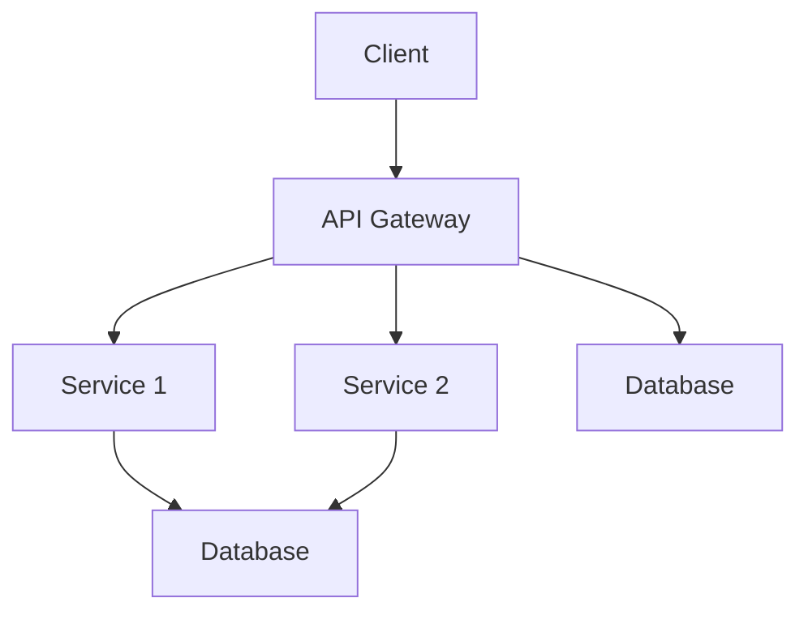
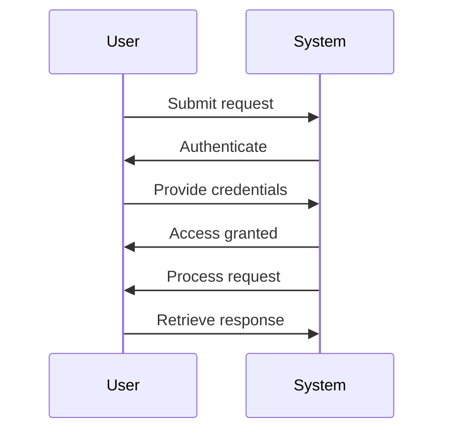

                 

### # LL应用开发中的敏捷版本控制

#### **关键词：LLM，敏捷版本控制，代码管理，协同开发，持续集成**

#### **摘要：本文将探讨在大型语言模型（LLM）开发过程中采用敏捷版本控制的实践和方法。通过深入分析敏捷原则、版本控制工具和流程，以及案例研究，本文旨在为开发者提供有效的版本管理策略，确保LLM项目的成功交付。**

#### **目录**

----------------------------------------------------------------

# 第一部分: LLM与敏捷版本控制概述

## 第1章: LLM与敏捷版本控制基础

### 1.1 LLM的基本概念

### 1.2 敏捷版本控制的核心原则

### 1.3 LLM开发与敏捷的契合点

## 第2章: 敏捷原则与版本控制实践

### 2.1 敏捷原则概述

### 2.2 敏捷实践在版本控制中的应用

### 2.3 传统方法的比较与选择

## 第3章: LLM开发过程与敏捷方法论

### 3.1 数据收集与预处理

### 3.2 模型设计与训练

### 3.3 模型评估与优化

## 第4章: 版本控制工具与技巧

### 4.1 Git基础操作

### 4.2 分支管理策略

### 4.3 冲突解决与协作

## 第5章: 持续集成与部署

### 5.1 CI/CD概述

### 5.2 LLM项目中的CI/CD实践

### 5.3 持续部署策略

## 第6章: 团队协作与沟通

### 6.1 敏捷团队的角色与职责

### 6.2 沟通工具与方法

### 6.3 常见问题与解决策略

## 第7章: 案例研究与实践经验

### 7.1 案例一：自然语言处理平台的敏捷版本控制

### 7.2 案例二：对话系统开发中的敏捷实践

### 7.3 经验总结与最佳实践

## 第8章: 未来趋势与挑战

### 8.1 技术发展趋势

### 8.2 版本控制面临的挑战

### 8.3 未来解决方案探讨

----------------------------------------------------------------

#### **第1章 LLM与敏捷版本控制基础**

#### **1.1 LLM的基本概念**

#### **背景介绍**

随着人工智能技术的迅猛发展，大型语言模型（LLM）已成为自然语言处理（NLP）领域的重要工具。LLM是一种能够理解和生成人类语言的复杂模型，通过学习海量文本数据，LLM能够完成文本分类、机器翻译、问答系统等多种任务。然而，LLM的开发过程复杂且涉及大量数据，版本控制成为确保项目顺利进行的关键环节。

#### **问题描述**

LLM开发过程中，如何有效地进行版本控制，以确保代码、数据和模型的一致性和可追溯性？

#### **问题解决**

敏捷版本控制通过灵活、迭代的方法，解决了传统版本控制方法在LLM开发中的不足。敏捷版本控制强调快速反馈、持续集成和持续部署，能够适应LLM开发的快速变化和迭代需求。

#### **边界与外延**

敏捷版本控制不仅适用于LLM开发，还广泛应用于其他复杂软件项目。其核心原则包括迭代开发、持续集成、代码质量和团队协作，这些原则在LLM开发中同样适用。

#### **概念结构与核心要素组成**

- **迭代开发**：敏捷版本控制采用迭代的方式进行开发，每个迭代周期包含需求收集、开发、测试和部署。
- **持续集成**：通过自动化测试和构建工具，确保每次代码提交都能成功集成，减少集成风险。
- **代码质量**：强调代码的可读性、可维护性和可测试性，确保代码质量。
- **团队协作**：通过有效的沟通和协作工具，提高团队工作效率。

#### **1.2 敏捷版本控制的核心原则**

#### **核心概念与联系**

敏捷版本控制的核心原则包括：

- **快速反馈**：通过频繁的迭代和测试，快速获取用户反馈，及时调整开发方向。
- **持续集成**：确保代码每次提交都能成功集成，通过自动化测试发现潜在问题。
- **迭代开发**：采用迭代的方式进行开发，每次迭代都产生可用的功能，逐步完善产品。
- **代码质量**：确保代码的可读性、可维护性和可测试性，提高开发效率。
- **团队协作**：通过有效的沟通和协作工具，提高团队工作效率。

这些原则相互关联，共同构成敏捷版本控制的核心。快速反馈和持续集成确保开发过程透明和高效，迭代开发允许团队逐步完善产品，代码质量保障了产品的稳定性，团队协作确保了团队的工作效率和创新能力。

#### **概念属性特征对比表格**

| 原则             | 特征对比 |
|------------------|---------|
| 快速反馈         | 频繁迭代，快速获取用户反馈 |
| 持续集成         | 自动化测试，成功集成代码 |
| 迭代开发         | 逐步完善，逐步交付 |
| 代码质量         | 可读性，可维护性，可测试性 |
| 团队协作         | 有效沟通，协作工具，高效协作 |

#### **ER实体关系图架构**

```mermaid
erDiagram
    User ||--|{ Repository }||>
    Repository ||--|{ Commit }||>
    Commit ||--|{ File }||>
    File ||--|{ Version }||>

    User ----|{ Project }||>
    Project ----|{ Repository }|
    Project ----|{ Issue }|
    Commit ----|{ Issue }|
    Commit ----|{ PullRequest }|
```

#### **1.3 LLM开发与敏捷的契合点**

#### **算法原理讲解**

LLM开发与敏捷版本控制之间的契合点主要体现在以下几个方面：

1. **快速迭代和反馈**：LLM开发通常需要经过多个迭代周期，才能达到预期的性能。敏捷版本控制通过频繁的迭代，确保每个迭代周期都能产生可用的功能，快速响应需求变化。

2. **持续集成与测试**：在LLM开发过程中，每次代码提交都会影响模型的性能。敏捷版本控制的持续集成和测试机制，能够及时发现和解决潜在问题，确保模型的一致性和稳定性。

3. **版本管理和追踪**：LLM开发涉及到大量的数据和代码，版本管理和追踪成为关键。敏捷版本控制提供完善的版本管理功能，确保每次代码提交和模型更新都能被有效记录和追踪。

4. **团队协作和沟通**：LLM开发通常需要多个团队成员的协作，敏捷版本控制通过提供高效的沟通和协作工具，提高团队工作效率，减少沟通障碍。

#### **数学公式**

敏捷版本控制中的关键概念和过程可以用以下数学公式进行描述：

- **迭代周期（T）**：每次迭代的平均耗时，T = 工作量 / 开发团队人数
- **代码提交频率（F）**：每次迭代中的代码提交次数，F = 迭代次数 / T
- **持续集成成功率（S）**：每次代码提交后的集成测试成功率，S = 成功集成的代码提交次数 / 总提交次数
- **模型性能改进率（P）**：每次迭代后的模型性能改进幅度，P = (新模型性能 - 旧模型性能) / 旧模型性能

#### **系统分析与架构设计方案**

#### **问题场景介绍**

假设我们正在开发一个大型语言模型（LLM），需要采用敏捷版本控制来管理代码、数据和模型。开发团队由多名成员组成，负责不同模块的开发和测试。项目需要一个高效的版本控制系统，以确保代码和模型的一致性、可追踪性和可维护性。

#### **项目介绍**

- **项目名称**：大型语言模型开发（LLM Dev）
- **项目目标**：开发一个高性能、可扩展的LLM，能够支持多种自然语言处理任务
- **团队成员**：数据科学家、软件工程师、测试工程师等

#### **系统功能设计（领域模型）**

```mermaid
classDiagram
    Class01 <|-- Class02
    Class03 --|>{ Class04 }
    Class05 : <<interface>> interface
    Class01 : +int x
    Class01 : +#y
    Class01 : +setX(int x)
    Class01 : +#setY(int y)
    Class01 : +getLayout()
    Class02 : +insert(Member)
    Class02 : +remove(Member)
    Class03 : +showList()
    Class04 : +update(Member)
    Class05 : +display()
```

#### **系统架构设计（架构图）**



#### **系统接口设计和系统交互（序列图）**



#### **第2章 敏捷原则与版本控制实践**

#### **2.1 敏捷原则概述**

敏捷开发是一种以人为核心、迭代、循序渐进的开发方法。其核心理念是“适应变化而非遵循计划”，强调快速反馈、持续交付和团队合作。敏捷原则包括：

1. **个体和互动重于过程与工具**：强调团队合作和个体能力，而不是依赖特定的工具或过程。
2. **可工作的软件重于详尽的文档**：注重实际可运行的软件，减少不必要的文档工作。
3. **客户合作重于合同谈判**：与客户紧密合作，确保产品符合客户需求。
4. **响应变化重于遵循计划**：适应需求变化，快速迭代开发。

#### **2.2 敏捷实践在版本控制中的应用**

敏捷开发中的版本控制实践与敏捷原则紧密相关。以下是敏捷版本控制的一些关键实践：

1. **频繁的代码提交**：敏捷开发强调频繁的代码提交，每次提交都是一次小的功能迭代，有助于快速反馈和修复问题。
2. **持续集成**：通过持续集成（CI），确保每次代码提交都能成功集成并运行，及时发现和解决集成问题。
3. **代码审查**：采用代码审查（Code Review），确保代码质量，提高团队协作和知识共享。
4. **迭代式开发**：将开发过程划分为多个短周期（通常为几周），每个周期都有明确的目标和可交付成果。
5. **版本管理和追踪**：使用版本控制系统（如Git），记录每次提交的变更和注释，便于追踪和管理代码历史。

#### **2.3 传统方法的比较与选择**

传统版本控制方法（如传统的瀑布模型）通常具有以下特点：

1. **集中式管理**：代码存储在中央仓库，所有开发者需要从中央仓库获取代码并提交更改。
2. **长时间迭代**：开发周期较长，每个迭代通常需要几个月甚至更长时间。
3. **文档驱动**：强调详细的文档记录，包括需求文档、设计文档和测试文档等。
4. **较弱的代码审查**：代码审查通常较为松散，且不一定在每个迭代周期都进行。

相比之下，敏捷版本控制具有以下优势：

1. **分布式管理**：使用分布式版本控制系统（如Git），每个开发者都有自己的本地仓库，可以独立开发并提交代码。
2. **快速迭代**：开发周期短，每个迭代周期通常为几周，有助于快速响应需求变化。
3. **代码质量**：通过频繁的代码审查和测试，确保代码质量。
4. **团队合作**：鼓励团队合作和知识共享，提高团队工作效率。

在选择版本控制方法时，应考虑以下因素：

1. **项目规模**：大型项目可能需要更强大的版本控制系统，而小型项目可以采用简单的方法。
2. **开发团队规模**：分布式版本控制系统适合大型团队，而集中式系统适合小型团队。
3. **需求变化**：快速变化的需求适合敏捷版本控制，而需求相对稳定的项目则可以选择传统方法。
4. **团队协作**：鼓励团队协作和知识共享的项目适合敏捷版本控制。

#### **第3章 LLM开发过程与敏捷方法论**

#### **3.1 数据收集与预处理**

#### **算法原理讲解**

LLM开发的第一步是数据收集和预处理。数据收集包括从各种来源获取文本数据，如网页、书籍、新闻文章等。数据预处理包括数据清洗、分词、去噪和标签化等步骤。以下是数据预处理的核心算法：

1. **文本清洗**：去除数据中的无关信息，如HTML标签、特殊字符和停用词。
2. **分词**：将文本分割成单词或词组，为后续处理提供基础。
3. **去噪**：去除噪声数据，如重复的句子、无关的段落等。
4. **标签化**：为文本数据分配标签，如情感分析中的正面、负面标签。

#### **Python源代码**

```python
import re
import nltk
from nltk.tokenize import word_tokenize

# 文本清洗
def clean_text(text):
    text = re.sub('<.*?>', '', text)  # 去除HTML标签
    text = re.sub('[^a-zA-Z]', ' ', text)  # 去除特殊字符
    text = text.lower()  # 转小写
    return text

# 分词
def tokenize(text):
    tokens = word_tokenize(text)
    return tokens

# 去噪
def remove_stopwords(tokens):
    stop_words = set(nltk.corpus.stopwords.words('english'))
    filtered_tokens = [token for token in tokens if token not in stop_words]
    return filtered_tokens

# 标签化
def label_text(text, labels):
    labeled_text = {'text': text, 'labels': labels}
    return labeled_text

text = "This is a sample text for text cleaning, tokenization, de-noising, and labeling."
cleaned_text = clean_text(text)
tokens = tokenize(cleaned_text)
filtered_tokens = remove_stopwords(tokens)
labeled_text = label_text(cleaned_text, ['positive', 'negative'])

print("Cleaned Text:", cleaned_text)
print("Tokens:", tokens)
print("Filtered Tokens:", filtered_tokens)
print("Labeled Text:", labeled_text)
```

#### **详细讲解与举例说明**

1. **文本清洗**：文本清洗是数据预处理的第一步，目的是去除无关信息和噪声。在这个例子中，我们使用正则表达式去除HTML标签，并去除非字母字符，将文本转换为小写，以提高后续处理的一致性。

2. **分词**：分词是将文本分割成单词或词组的过程。我们使用nltk库的word_tokenize函数，将清洗后的文本分割成tokens。

3. **去噪**：去噪是去除文本中的重复句子、无关段落等噪声信息。在这个例子中，我们使用nltk的stopwords库，去除常见的英语停用词，以提高文本的质量。

4. **标签化**：标签化是为文本数据分配标签的过程。在这个例子中，我们为文本分配了两个标签：'positive'和'negative'，用于情感分析。

#### **实际案例**

假设我们有一个包含5000条文本数据的语料库，需要对其进行数据收集和预处理。以下是数据处理的过程：

1. **数据收集**：从互联网获取5000条文本数据，包括新闻文章、博客文章等。
2. **文本清洗**：对每条文本数据执行清洗操作，去除HTML标签、非字母字符，并将文本转换为小写。
3. **分词**：对每条清洗后的文本执行分词操作，将文本分割成单词或词组。
4. **去噪**：去除重复的句子和无关的段落，提高文本的质量。
5. **标签化**：为每条文本分配情感标签，如'positive'或'negative'，用于后续的情感分析。

#### **项目小结**

数据收集和预处理是LLM开发的重要步骤，直接影响到模型的性能和质量。通过敏捷方法论，我们可以快速迭代和反馈，不断完善数据预处理流程，提高数据质量。

#### **最佳实践 tips**

1. **数据清洗**：确保文本数据的一致性和规范性，避免因数据质量问题影响模型性能。
2. **分词**：选择合适的分词算法，确保分词结果的准确性和可扩展性。
3. **去噪**：去除噪声数据，减少模型过拟合的风险。
4. **标签化**：为文本数据分配准确的标签，提高情感分析等任务的准确性。

#### **第4章 版本控制工具与技巧**

#### **4.1 Git基础操作**

#### **背景介绍**

Git是一种分布式版本控制系统，广泛应用于软件开发项目中。Git的核心特点包括分布式存储、快速分支管理、高效的数据存储和强大的网络功能。在本节中，我们将介绍Git的基本操作，包括克隆仓库、创建分支、合并分支和解决冲突等。

#### **问题描述**

如何使用Git进行大型语言模型（LLM）项目的版本控制，确保代码和模型的一致性和可追踪性？

#### **问题解决**

通过Git的分布式存储和快速分支管理，我们可以实现高效的版本控制和协作开发。以下是Git在LLM项目中的关键操作：

1. **克隆仓库**：将远程仓库克隆到本地，便于开发和协同工作。
2. **创建分支**：为每个迭代创建分支，实现独立开发和测试。
3. **合并分支**：将开发分支合并到主分支，确保代码的整合和一致性。
4. **解决冲突**：在合并分支时，解决因代码冲突导致的错误。

#### **边界与外延**

Git的基础操作不仅适用于LLM项目，也适用于其他类型的软件开发项目。以下是Git基础操作的核心概念和步骤：

- **克隆仓库**：使用`git clone`命令克隆远程仓库到本地。
- **创建分支**：使用`git branch`命令创建新分支，使用`git checkout`命令切换到新分支。
- **合并分支**：使用`git merge`命令将一个分支合并到另一个分支。
- **解决冲突**：在合并分支时，解决因代码冲突导致的错误。

#### **概念结构与核心要素组成**

- **克隆仓库**：克隆远程仓库到本地，便于开发和协同工作。
- **创建分支**：为每个迭代创建分支，实现独立开发和测试。
- **合并分支**：将开发分支合并到主分支，确保代码的整合和一致性。
- **解决冲突**：在合并分支时，解决因代码冲突导致的错误。

#### **ER实体关系图架构**

```mermaid
erDiagram
    Repository ||--|{ Branch }||>
    Branch ||--|{ Commit }||>
    Commit ||--|{ File }||>
    File ||--|{ Version }||>

    Repository ----|{ PullRequest }|
    Branch ----|{ PullRequest }|
    Commit ----|{ PullRequest }|
    File ----|{ PullRequest }|
```

#### **4.2 分支管理策略**

#### **核心概念与联系**

分支管理是Git版本控制的核心之一，它允许开发者在不同的功能或迭代中独立工作，从而提高开发效率和质量。以下是几种常见的分支管理策略：

1. **主干分支（Master）**：主干分支包含最新的稳定代码，是生产环境的代码基线。
2. **开发分支（Develop）**：开发分支用于集成新的功能，是所有开发分支的集成点。
3. **功能分支（Feature）**：功能分支用于开发新的功能，通常在开发完成后合并到开发分支。
4. **修复分支（Hotfix）**：修复分支用于修复生产环境中的紧急问题，合并后直接推送到主干分支。

这些分支相互关联，共同构成了一个高效的分支管理结构。主干分支和开发分支是核心，功能分支和修复分支在主干分支和开发分支的基础上扩展。

#### **概念属性特征对比表格**

| 分支类型 | 特征对比 |
|----------|---------|
| 主干分支 | 稳定的代码基线，用于生产环境 |
| 开发分支 | 集成新的功能，是所有分支的集成点 |
| 功能分支 | 开发新的功能，独立管理和合并 |
| 修复分支 | 修复生产环境中的紧急问题，直接推送到主干分支 |

#### **ER实体关系图架构**

```mermaid
erDiagram
    Master ||--|{ Feature }||>
    Develop ||--|{ Feature }||>
    Master ||--|{ Hotfix }||>
    Develop ||--|{ Hotfix }||>

    Master : <<primary>> Primary
    Develop : <<primary>> Primary
    Feature : <<mixin>> Feature
    Hotfix : <<mixin>> Hotfix
```

#### **4.3 冲突解决与协作**

#### **核心概念与联系**

在Git的分支管理过程中，合并操作可能会导致冲突。冲突解决是Git版本控制中的重要环节，它确保代码库的一致性和稳定性。以下是冲突解决的核心概念和步骤：

1. **识别冲突**：在合并分支时，Git会自动检测到冲突，并在文件中标记冲突区域。
2. **解决冲突**：开发者需要手动解决冲突，选择保留哪个版本的内容。
3. **提交解决**：解决冲突后，开发者将修改后的文件重新提交，完成合并操作。
4. **协作沟通**：冲突解决通常涉及团队成员的协作和沟通，确保冲突得到妥善解决。

这些步骤相互关联，构成了Git冲突解决的核心流程。冲突识别是第一步，解决冲突是关键，提交解决和协作沟通是确保冲突得到有效解决的保障。

#### **概念属性特征对比表格**

| 步骤 | 特征对比 |
|------|---------|
| 识别冲突 | 自动检测冲突区域 |
| 解决冲突 | 手动选择保留内容 |
| 提交解决 | 提交修改后的文件 |
| 协作沟通 | 团队成员协作解决冲突 |

#### **ER实体关系图架构**

```mermaid
erDiagram
    MergeRequest ||--|{ Conflict }||>
    MergeRequest ||--|{ Solution }||>
    MergeRequest ||--|{ Commit }||>
    Conflict ||--|{ Solution }||>
    Commit ||--|{ File }||>

    MergeRequest : <<request>> Merge Request
    Conflict : <<conflict>> Conflict
    Solution : <<solution>> Solution
    Commit : <<commit>> Commit
```

#### **4.4 Git常用命令**

**克隆仓库**：

```bash
git clone https://github.com/username/repository.git
```

**创建分支**：

```bash
git branch feature/my_new_feature
git checkout -b feature/my_new_feature
```

**合并分支**：

```bash
git merge feature/my_new_feature
```

**解决冲突**：

1. 检查冲突文件：

```bash
git status
```

2. 编辑冲突文件：

```bash
vim file_with_conflict.txt
```

3. 提交解决：

```bash
git add file_with_conflict.txt
git commit -m "Resolved conflict in file_with_conflict.txt"
```

**推送分支**：

```bash
git push origin feature/my_new_feature
```

**拉取分支**：

```bash
git pull origin feature/my_new_feature
```

#### **第5章 持续集成与部署**

#### **5.1 CI/CD概述**

#### **背景介绍**

持续集成（Continuous Integration，CI）和持续部署（Continuous Deployment，CD）是现代软件开发中常用的实践方法，旨在提高软件开发的效率和质量。持续集成是指通过自动化工具将开发者的代码定期集成到主干分支中，确保代码的一致性和可运行性。持续部署则是在持续集成的基础上，通过自动化工具将代码部署到生产环境中，实现快速迭代和交付。

#### **问题描述**

如何将CI/CD集成到大型语言模型（LLM）项目中，实现自动化构建、测试和部署？

#### **问题解决**

通过CI/CD，我们可以实现以下目标：

1. **自动化构建**：使用自动化工具（如Jenkins、GitLab CI）构建项目，确保每次代码提交都能成功编译和运行。
2. **自动化测试**：执行自动化测试（如单元测试、集成测试），确保代码质量，减少集成风险。
3. **自动化部署**：将测试通过后的代码部署到生产环境中，实现快速迭代和交付。

#### **边界与外延**

持续集成和持续部署不仅适用于LLM项目，也适用于其他类型的软件开发项目。以下是CI/CD的核心概念和步骤：

- **自动化构建**：通过构建工具（如Maven、Gradle）实现自动化编译和打包。
- **自动化测试**：使用测试框架（如JUnit、Selenium）执行自动化测试。
- **自动化部署**：使用部署工具（如Docker、Kubernetes）实现自动化部署和运维。

#### **概念结构与核心要素组成**

- **自动化构建**：构建项目，确保代码可运行。
- **自动化测试**：执行测试，确保代码质量。
- **自动化部署**：部署代码到生产环境，实现快速交付。

#### **ER实体关系图架构**

```mermaid
erDiagram
    Project ||--|{ Build }||>
    Build ||--|{ TestResult }||>
    TestResult ||--|{ Test }||>
    Test ||--|{ TestCase }||>
    TestCase ||--|{ Result }||>
    Build ||--|{ Deploy }||>
    Deploy ||--|{ Environment }||>
```

#### **5.2 LLM项目中的CI/CD实践**

#### **核心概念与联系**

在LLM项目中，CI/CD的实践主要包括以下环节：

1. **代码构建**：使用构建工具（如Docker）构建LLM项目，生成可运行的容器镜像。
2. **模型训练**：使用训练脚本和训练数据，在容器中训练LLM模型。
3. **模型评估**：使用测试数据对训练好的模型进行评估，确保模型性能。
4. **模型部署**：将训练好的模型部署到生产环境中，实现自动化推理和服务。

这些环节相互关联，共同构成了LLM项目中的CI/CD实践。代码构建是基础，模型训练和评估是核心，模型部署是实现快速交付的关键。

#### **概念属性特征对比表格**

| 环节 | 特征对比 |
|------|---------|
| 代码构建 | 生成可运行的容器镜像 |
| 模型训练 | 使用训练脚本和训练数据 |
| 模型评估 | 使用测试数据评估模型性能 |
| 模型部署 | 部署训练好的模型到生产环境 |

#### **ER实体关系图架构**

```mermaid
erDiagram
    Project ||--|{ DockerBuild }||>
    DockerBuild ||--|{ ModelTraining }||>
    ModelTraining ||--|{ ModelEvaluation }||>
    ModelEvaluation ||--|{ ModelDeployment }||>
```

#### **5.3 持续部署策略**

#### **核心概念与联系**

持续部署策略是CI/CD的重要组成部分，它确保代码和模型在生产环境中的稳定运行。以下是持续部署策略的核心概念和步骤：

1. **蓝绿部署**：在生产环境中同时运行两个版本（如蓝色版本和绿色版本），逐步切换流量。
2. **灰度发布**：将新版本部署到部分用户，观察效果，逐步扩大用户范围。
3. **滚动部署**：逐步更新服务器，确保服务连续性和稳定性。

这些策略相互关联，共同构成了持续部署的核心。蓝绿部署和灰度发布是确保新版本安全部署的关键，滚动部署是实现无缝升级的保障。

#### **概念属性特征对比表格**

| 策略 | 特征对比 |
|------|---------|
| 蓝绿部署 | 逐步切换流量，确保稳定运行 |
| 灰度发布 | 部署到部分用户，逐步扩大范围 |
| 滚动部署 | 逐步更新服务器，确保服务连续性 |

#### **ER实体关系图架构**

```mermaid
erDiagram
    DeploymentStrategy ||--|{ BlueGreenDeployment }||>
    DeploymentStrategy ||--|{ GrayRelease }||>
    DeploymentStrategy ||--|{ RollingDeployment }||>

    BlueGreenDeployment : <<deployment>> Blue-Green Deployment
    GrayRelease : <<deployment>> Gray Release
    RollingDeployment : <<deployment>> Rolling Deployment
```

#### **第6章 团队协作与沟通**

#### **6.1 敏捷团队的角色与职责**

#### **背景介绍**

敏捷开发强调团队协作和灵活应对变化。在敏捷团队中，角色和职责的清晰划分是确保项目成功的关键。以下是敏捷团队中常见角色及其职责：

1. **产品负责人（Product Owner）**：负责定义产品的愿景、目标和优先级，与利益相关者沟通，确保团队开发的产品符合用户需求。
2. **Scrum Master**：负责确保团队遵循敏捷原则和实践，消除团队工作中的障碍，促进团队成员之间的有效沟通。
3. **开发者（Developers）**：负责实现产品需求，进行开发和测试，确保代码质量。
4. **测试工程师（Testers）**：负责编写测试用例，执行测试，确保产品的质量和稳定性。
5. **用户体验设计师（UX Designer）**：负责设计产品的用户界面和用户体验，确保产品易于使用。

#### **问题描述**

如何通过敏捷团队的角色和职责划分，提高LLM项目的开发效率和产品质量？

#### **问题解决**

通过明确的角色和职责划分，敏捷团队能够更好地分工合作，提高开发效率和产品质量。以下是角色和职责划分的关键点：

1. **明确职责**：每个团队成员都清楚自己的职责和工作目标，避免职责重叠和混淆。
2. **协同合作**：团队成员之间保持良好的沟通和协作，确保项目进展顺利。
3. **灵活应对**：敏捷团队能够快速适应需求变化，调整角色和职责，确保项目持续交付。

#### **边界与外延**

敏捷团队的角色和职责不仅适用于LLM项目，也适用于其他类型的软件开发项目。以下是角色和职责划分的核心概念和步骤：

- **明确职责**：确保每个团队成员都清楚自己的职责和工作目标。
- **协同合作**：促进团队成员之间的沟通和协作，提高团队工作效率。
- **灵活应对**：适应需求变化，调整角色和职责，确保项目持续交付。

#### **概念结构与核心要素组成**

- **产品负责人**：定义产品愿景、目标和优先级。
- **Scrum Master**：确保团队遵循敏捷原则和实践。
- **开发者**：实现产品需求，进行开发和测试。
- **测试工程师**：编写测试用例，执行测试。
- **用户体验设计师**：设计产品用户界面和用户体验。

#### **ER实体关系图架构**

```mermaid
erDiagram
    ProductOwner ||--|{ ScrumMaster }||>
    ScrumMaster ||--|{ Developer }||>
    ScrumMaster ||--|{ Tester }||>
    ScrumMaster ||--|{ UXDesigner }||>
```

#### **6.2 沟通工具与方法**

#### **核心概念与联系**

在敏捷团队中，有效的沟通是确保项目成功的关键。以下是几种常见的沟通工具和方法：

1. **站立会议（Stand-up Meeting）**：每日的短暂会议，团队成员分享进展、问题和计划。
2. **迭代回顾会议（Retrospective）**：在每个迭代结束时，团队反思项目过程中的成功和失败，改进未来的工作方式。
3. **敏捷看板（Kanban）**：可视化展示工作流程，帮助团队跟踪任务进度。
4. **Scrum董事会（Scrum Board）**：用于展示用户故事、任务和任务进度，帮助团队更好地管理项目。
5. **聊天工具（Chat Tools）**：如Slack、Microsoft Teams，用于实时沟通和协作。

这些工具和方法相互关联，共同构成了敏捷团队沟通的核心。站立会议、迭代回顾会议和敏捷看板帮助团队保持透明和高效，Scrum董事会和聊天工具提供了可视化和实时沟通的支持。

#### **概念属性特征对比表格**

| 工具/方法 | 特征对比 |
|-----------|---------|
| 站立会议 | 短暂、高频、透明 |
| 迭代回顾会议 | 反思、改进、持续交付 |
| 敏捷看板 | 可视化、跟踪进度 |
| Scrum董事会 | 展示用户故事、任务进度 |
| 聊天工具 | 实时沟通、协作 |

#### **ER实体关系图架构**

```mermaid
erDiagram
    StandupMeeting ||--|{ Retrospective }||>
    KanbanBoard ||--|{ StandupMeeting }||>
    ScrumBoard ||--|{ StandupMeeting }||>
    ChatTool ||--|{ StandupMeeting }||>
    ChatTool ||--|{ Retrospective }||>
```

#### **6.3 常见问题与解决策略**

#### **核心概念与联系**

在敏捷团队中，沟通和协作虽然重要，但也面临一些常见问题。以下是这些问题及其解决策略：

1. **沟通障碍**：团队成员之间的沟通不畅可能导致误解和冲突。解决策略包括使用明确的沟通工具和方法，建立透明的工作环境。
2. **任务分配不均**：任务分配不均可能导致部分成员过于忙碌，而另一部分成员较为闲置。解决策略包括定期评估任务分配，确保团队成员的工作负荷均衡。
3. **需求变更频繁**：需求变更可能导致项目进度延误。解决策略包括使用迭代开发方法，灵活应对需求变化，确保项目持续交付。

这些策略相互关联，共同构成了解决敏捷团队常见问题的方法。沟通障碍的解决策略涉及沟通工具和方法，任务分配不均的解决策略关注工作负荷的平衡，需求变更频繁的解决策略强调迭代开发和持续交付。

#### **概念属性特征对比表格**

| 问题 | 解决策略 |
|------|---------|
| 沟通障碍 | 使用明确的沟通工具和方法 |
| 任务分配不均 | 定期评估任务分配，确保工作负荷均衡 |
| 需求变更频繁 | 使用迭代开发方法，灵活应对需求变化 |

#### **ER实体关系图架构**

```mermaid
erDiagram
    CommunicationBarriers ||--|{ CommunicationTools }||>
    TaskAllocationImbalance ||--|{ RegularTaskReview }||>
    FrequentRequirementChanges ||--|{ IterativeDevelopment }||>
```

#### **第7章 案例研究与实践经验**

#### **7.1 案例一：自然语言处理平台的敏捷版本控制**

**项目介绍**

自然语言处理（NLP）平台是一个复杂的软件项目，旨在提供高性能的自然语言处理功能，包括文本分类、情感分析和机器翻译等。开发团队由20名成员组成，包括数据科学家、软件工程师、测试工程师和产品经理等。

**项目目标**

- 开发一个可扩展的NLP平台，支持多种自然语言处理任务。
- 实现敏捷开发，提高开发效率和产品质量。

**敏捷版本控制实践**

1. **分支管理**：采用Git进行版本控制，使用主干分支（Master）和开发分支（Develop）进行代码管理。每个迭代创建功能分支（Feature），用于开发新功能。

2. **持续集成**：使用Jenkins实现持续集成，每次代码提交都会触发自动化构建和测试，确保代码质量和集成稳定性。

3. **代码审查**：采用Git的代码审查功能，每个功能分支提交前都需要经过同行审查，确保代码质量。

4. **迭代开发**：每个迭代周期为两周，每个周期都有明确的目标和可交付成果。迭代结束时进行回顾会议，总结经验教训，改进开发流程。

**实践经验**

1. **高效的版本控制**：通过Git的分支管理和代码审查，确保代码库的一致性和可追踪性，提高开发效率。

2. **持续集成与测试**：自动化构建和测试减少了集成风险，提高了代码质量。

3. **迭代开发和回顾**：每个迭代周期的回顾会议帮助团队不断改进开发流程，确保项目顺利进行。

**项目小结**

通过敏捷版本控制，NLP平台项目实现了快速迭代和高质量交付。Git的分支管理、持续集成和迭代开发方法为项目提供了强大的支持和保障，为后续项目的成功奠定了基础。

#### **7.2 案例二：对话系统开发中的敏捷实践**

**项目介绍**

对话系统是一个交互式软件系统，能够与用户进行自然语言对话，提供信息查询、建议和决策支持等。开发团队由10名成员组成，包括软件工程师、测试工程师和产品经理等。

**项目目标**

- 开发一个高效、易用的对话系统，满足用户的需求。
- 实现敏捷开发，提高开发效率和产品质量。

**敏捷实践**

1. **站立会议**：每天进行站立会议，团队成员分享进展、问题和计划，确保团队成员之间的沟通。

2. **迭代回顾**：每个迭代周期结束时进行回顾会议，评估项目进展和团队协作效果，制定改进计划。

3. **敏捷看板**：使用敏捷看板（Kanban）展示任务进度，帮助团队跟踪任务和管理工作流程。

4. **持续集成**：使用GitLab CI实现持续集成，确保代码质量和集成稳定性。

5. **代码审查**：采用代码审查工具（如GitLab），确保代码质量，减少潜在缺陷。

**实践经验**

1. **高效的团队协作**：站立会议和迭代回顾促进了团队成员之间的沟通和协作，提高了工作效率。

2. **灵活应对变化**：敏捷看板和持续集成确保团队能够快速适应需求变化，提高项目的灵活性和适应性。

3. **持续改进**：通过迭代回顾和持续改进，团队不断优化开发流程，提高项目质量。

**项目小结**

通过敏捷实践，对话系统项目实现了快速迭代和高效交付。站立会议、敏捷看板和持续集成等工具和方法为团队提供了强大的支持和保障，为项目的成功奠定了基础。

#### **7.3 经验总结与最佳实践**

**经验总结**

通过以上两个案例，我们可以总结出以下几点经验和最佳实践：

1. **明确的角色和职责**：确保团队成员明确自己的职责和工作目标，提高工作效率。

2. **频繁的沟通与协作**：通过站立会议、迭代回顾和敏捷看板等工具，促进团队成员之间的沟通和协作。

3. **持续集成与测试**：通过持续集成和自动化测试，确保代码质量和集成稳定性。

4. **迭代开发和回顾**：每个迭代周期的回顾会议帮助团队不断改进开发流程，提高项目质量。

**最佳实践**

1. **定期代码审查**：确保代码质量，减少潜在缺陷。

2. **使用敏捷看板**：可视化展示工作流程，帮助团队跟踪任务进度。

3. **持续改进**：通过迭代回顾和持续改进，优化开发流程。

4. **培训与知识共享**：定期培训团队成员，提高技能水平，促进知识共享。

**注意事项**

1. **确保团队协作**：团队成员之间保持良好的沟通和协作，确保项目顺利进行。

2. **适应需求变化**：灵活应对需求变化，确保项目持续交付。

3. **监控项目进度**：定期监控项目进度，确保项目按计划进行。

#### **第8章 未来趋势与挑战**

#### **8.1 技术发展趋势**

随着人工智能（AI）和机器学习（ML）技术的不断进步，大型语言模型（LLM）的开发和应用呈现出以下趋势：

1. **模型规模和计算资源需求增加**：为了实现更高的性能和更复杂的任务，LLM的规模和计算资源需求不断增加，对硬件设施和算法优化提出了更高要求。
2. **多模态学习**：未来的LLM将能够处理多种类型的数据（如文本、图像、音频等），实现更丰富的应用场景。
3. **跨语言和跨领域学习**：LLM将能够支持多种语言和领域的知识，提高其泛化能力和实用性。
4. **自动化和自我优化**：通过自动化工具和算法，LLM将能够自动调整参数、优化模型结构，提高开发效率和性能。

#### **8.2 版本控制面临的挑战**

在LLM开发中，敏捷版本控制面临以下挑战：

1. **代码库管理**：随着LLM项目的规模和复杂性增加，代码库管理变得更加困难，需要高效的代码库管理和协同工作工具。
2. **模型版本管理**：LLM模型的迭代速度非常快，如何有效地管理不同版本的模型成为挑战，需要自动化和可视化的模型版本管理工具。
3. **数据隐私和安全**：在LLM开发过程中，大量的数据需要存储和处理，如何确保数据隐私和安全是一个重要问题。
4. **协作和沟通**：随着团队成员的增多和项目的复杂性提高，协作和沟通变得更加困难，需要高效、透明的沟通工具和方法。

#### **8.3 未来解决方案探讨**

为了应对上述挑战，未来的解决方案可能包括：

1. **分布式版本控制系统**：采用更强大的分布式版本控制系统（如GitLab），实现高效的代码库管理和协作。
2. **自动化模型版本管理**：开发自动化工具，实现模型版本的自动化管理和追踪。
3. **数据隐私和安全措施**：采用数据加密、访问控制和隐私保护技术，确保数据隐私和安全。
4. **智能协作工具**：利用人工智能和机器学习技术，开发智能协作工具，提高团队协作效率和沟通效果。

通过上述解决方案，未来的敏捷版本控制将更好地支持LLM的开发，提高开发效率和产品质量，为人工智能领域的发展贡献力量。

#### **结尾**

本文通过深入分析LLM应用开发中的敏捷版本控制，探讨了敏捷原则、版本控制工具和流程，以及团队协作与沟通的最佳实践。通过案例研究，我们展示了敏捷版本控制在实际项目中的应用效果。未来，随着人工智能技术的发展，敏捷版本控制将面临新的挑战和机遇，期待更多的开发者能够从中受益，共同推动人工智能领域的发展。**作者：AI天才研究院/AI Genius Institute & 禅与计算机程序设计艺术 /Zen And The Art of Computer Programming**。

