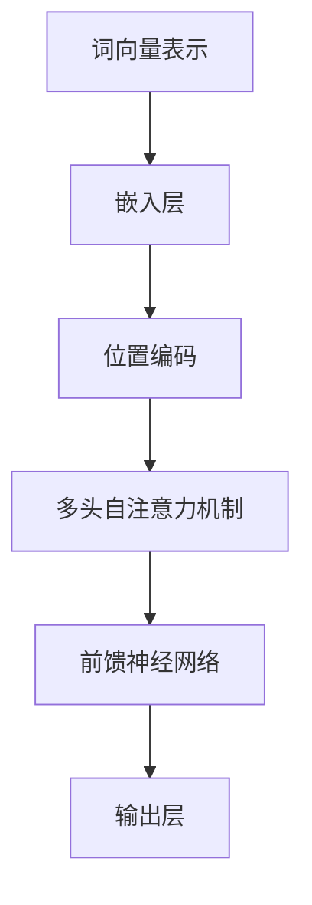

                 


### 1.1.1 人工智能与LLM技术概述

#### 什么是人工智能？

人工智能（Artificial Intelligence，AI）是指通过计算机系统实现的人类智能功能的模拟。它涵盖了多个学科领域，包括计算机科学、认知科学、心理学、神经科学等。人工智能的主要目标是使计算机能够执行通常需要人类智能的任务，如视觉识别、语言理解、决策制定、学习等。

#### 什么是语言模型（LLM）？

语言模型（Language Model，LLM）是人工智能中的一个重要分支，它用于预测文本序列中的下一个单词或符号。LLM的基本原理是通过对大量文本数据的学习，捕捉文本中的统计规律和语法结构。常见的LLM包括n-gram模型、神经网络模型、深度学习模型等。

#### LLM的发展历史

1. **早期模型**：20世纪50年代，香农的信息理论和霍普菲尔的马尔可夫模型奠定了语言模型的基础。
2. **n-gram模型**：20世纪60年代，n-gram模型被提出，它通过统计相邻单词的频率来预测下一个单词。
3. **统计模型**：20世纪80年代，基于概率论的统计模型，如隐马尔可夫模型（HMM）和决策树，开始用于语言建模。
4. **神经网络模型**：20世纪90年代，神经网络在语言建模中的应用取得了显著进展，尤其是基于循环神经网络（RNN）的模型，如LSTM和GRU。
5. **深度学习模型**：21世纪初，深度学习模型，特别是基于Transformer架构的模型，如BERT和GPT，极大地提升了语言建模的性能。

#### LLM的关键特点

1. **强大的语言理解能力**：LLM能够理解和生成自然语言，具有出色的文本生成和翻译能力。
2. **自适应性强**：LLM可以根据输入文本的上下文自适应调整，生成更符合语境的文本。
3. **大规模训练**：LLM通常在极其庞大的数据集上训练，这使其能够捕捉到复杂的语言模式。
4. **高效性**：现代LLM采用了高效的计算模型，能够在短时间内生成大量文本。

### 1.1.2 LL应用开发中的挑战

#### 数据隐私与安全性

随着LLM在各个领域的广泛应用，数据隐私和安全问题变得越来越重要。LLM需要处理大量的敏感数据，如个人隐私信息、商业机密等。如何确保这些数据在训练和使用过程中的安全，是一个巨大的挑战。

#### 模型可解释性

LLM的内部机制非常复杂，其决策过程通常是不透明的。这使得用户难以理解模型的输出，特别是在决策错误时。提高模型的可解释性，使其能够提供明确的解释，是一个重要的研究方向。

#### 模型泛化能力

LLM通常在训练数据集上表现良好，但其在未见过的数据上的表现可能会大大下降，这称为模型过拟合。如何提升模型的泛化能力，使其能够适应更广泛的应用场景，是一个亟待解决的问题。

#### 1.1.3 敏捷质量保证的概念与优势

#### 敏捷质量保证的概念

敏捷质量保证（Agile Quality Assurance，AQA）是一种基于敏捷开发的方法论，它强调在软件开发过程中持续地关注质量，并通过快速迭代和反馈来不断提高产品质量。AQA的核心原则包括持续交付、客户参与、快速反馈和团队协作。

#### 敏捷质量保证的优势

1. **快速响应变化**：敏捷质量保证能够快速响应需求和技术的变化，确保产品能够及时交付。
2. **提高质量**：通过持续迭代和反馈，敏捷质量保证能够及时发现和解决质量问题，从而提高产品质量。
3. **增强客户满意度**：敏捷质量保证强调客户参与，使客户能够更好地了解产品的质量和功能，从而提高客户满意度。
4. **降低成本**：敏捷质量保证能够在早期发现和解决问题，从而降低后期修复的成本。

### 1.2.1 质量保证在LLM开发中的重要性

在LLM应用开发中，质量保证（Quality Assurance，QA）起着至关重要的作用。以下是一些关键原因：

#### 模型准确性

LLM模型的准确性直接影响到其应用效果。如果模型存在偏差或错误，可能会导致严重的后果，如医疗诊断错误、金融交易失误等。

#### 用户信任

高质量的LLM应用能够赢得用户的信任。用户对产品的信任度越高，越可能长期使用该产品。

#### 遵守法规

许多行业对数据隐私和安全有严格的法规要求。通过有效的质量保证，LLM应用能够确保遵守这些法规，避免法律风险。

#### 1.2.2 传统质量保证方法与局限

传统质量保证方法通常包括以下步骤：

1. **需求分析**：确定产品需求，编写需求文档。
2. **设计评审**：评审设计文档，确保设计符合需求。
3. **代码评审**：检查代码质量，确保代码遵循设计规范。
4. **测试**：编写测试用例，执行测试，确保产品功能正确。
5. **部署**：将产品部署到生产环境。

然而，传统质量保证方法也存在一些局限：

1. **延迟反馈**：在开发周期结束后进行质量保证，可能导致质量问题无法及时解决。
2. **成本高**：传统质量保证方法通常需要大量的时间和资源，增加了成本。
3. **缺乏灵活性**：传统质量保证方法难以适应快速变化的需求和技术。

#### 1.2.3 敏捷质量保证的应用场景

敏捷质量保证在LLM应用开发中有广泛的应用场景：

1. **快速迭代开发**：LLM应用开发通常涉及多个迭代，敏捷质量保证能够快速适应这些迭代。
2. **需求变化频繁**：由于LLM技术的快速进步和市场需求的变化，敏捷质量保证能够更好地应对这些变化。
3. **强调团队合作**：敏捷质量保证强调团队协作，这对于复杂项目的成功至关重要。
4. **持续集成与部署**：敏捷质量保证支持持续集成和部署，使产品能够更快地交付。

### 1.3.1 敏捷质量保证模型

#### 敏捷质量保证模型概述

敏捷质量保证模型（Agile Quality Assurance Model，AQAM）是基于敏捷开发方法论的质量保证模型。它包括以下几个关键组成部分：

1. **持续交付**：通过持续交付，确保产品能够频繁地交付给客户。
2. **客户参与**：鼓励客户全程参与，确保产品满足客户需求。
3. **快速反馈**：通过快速反馈，及时识别和解决问题。
4. **团队协作**：强调团队成员之间的协作，提高项目效率。

#### 持续交付

持续交付（Continuous Delivery，CD）是一种软件开发和部署策略，旨在确保代码更改在经过测试后可以随时发布到生产环境。其主要目标是减少软件发布的周期，提高软件质量和客户满意度。

持续交付的关键步骤包括：

1. **自动化测试**：编写自动化测试用例，确保每次代码更改后都能进行测试。
2. **持续集成**：将代码更改集成到主干分支，确保与其他代码的兼容性。
3. **持续部署**：将通过测试的代码部署到生产环境。

#### 客户参与

客户参与（Customer Involvement）是敏捷质量保证的重要组成部分。通过让客户参与整个开发过程，可以确保产品满足客户的需求，提高客户满意度。

客户参与的关键步骤包括：

1. **需求收集**：与客户沟通，收集详细的需求。
2. **原型展示**：向客户展示原型，收集反馈。
3. **迭代开发**：根据客户的反馈，不断改进产品。

#### 快速反馈

快速反馈（Fast Feedback）是敏捷质量保证的核心原则之一。通过快速反馈，可以及时发现和解决问题，确保产品质量。

快速反馈的关键步骤包括：

1. **自动化测试**：自动化测试能够快速发现代码中的问题。
2. **每日站立会议**：团队成员每日召开会议，讨论问题和进度。
3. **定期的代码评审**：定期评审代码，确保代码质量。

#### 团队协作

团队协作（Team Collaboration）是敏捷质量保证成功的关键。通过有效的团队协作，可以提高项目的效率和质量。

团队协作的关键步骤包括：

1. **共同目标**：确保团队成员有一个共同的目标。
2. **透明沟通**：建立透明的沟通机制，确保信息畅通。
3. **责任分工**：明确团队成员的责任，确保每个任务都有责任人。

### 1.3.2 敏捷质量保证的核心原则

#### 持续交付

持续交付（Continuous Delivery，CD）是敏捷质量保证的核心原则之一。它强调通过自动化测试和持续集成，确保代码更改可以随时部署到生产环境。

持续交付的优点包括：

1. **快速发布**：通过自动化测试和持续集成，可以快速发布新功能。
2. **降低风险**：每次发布的代码都经过测试，降低了发布失败的风险。
3. **提高质量**：通过持续交付，可以及时发现和修复问题，提高产品质量。

持续交付的关键步骤包括：

1. **自动化测试**：编写自动化测试用例，确保每次代码更改后都能进行测试。
2. **持续集成**：将代码更改集成到主干分支，确保与其他代码的兼容性。
3. **持续部署**：将通过测试的代码部署到生产环境。

#### 客户参与

客户参与（Customer Involvement）是敏捷质量保证的另一个核心原则。它强调通过让客户全程参与开发过程，确保产品满足客户需求，提高客户满意度。

客户参与的优点包括：

1. **满足需求**：通过让客户参与需求收集和原型展示，可以确保产品满足客户需求。
2. **提高满意度**：客户全程参与开发过程，能够更好地了解产品，提高满意度。
3. **降低风险**：通过客户参与，可以及时发现和解决问题，降低项目风险。

客户参与的关键步骤包括：

1. **需求收集**：与客户沟通，收集详细的需求。
2. **原型展示**：向客户展示原型，收集反馈。
3. **迭代开发**：根据客户的反馈，不断改进产品。

#### 快速反馈

快速反馈（Fast Feedback）是敏捷质量保证的核心原则之一。它强调通过快速反馈，及时识别和解决问题，确保产品质量。

快速反馈的优点包括：

1. **提高效率**：通过快速反馈，可以及时发现和解决问题，提高项目效率。
2. **降低成本**：快速反馈可以减少修复问题的成本。
3. **提高质量**：通过快速反馈，可以确保产品质量，减少缺陷。

快速反馈的关键步骤包括：

1. **自动化测试**：自动化测试能够快速发现代码中的问题。
2. **每日站立会议**：团队成员每日召开会议，讨论问题和进度。
3. **定期的代码评审**：定期评审代码，确保代码质量。

#### 团队协作

团队协作（Team Collaboration）是敏捷质量保证成功的关键。通过有效的团队协作，可以提高项目的效率和质量。

团队协作的优点包括：

1. **提高效率**：通过团队合作，可以减少重复工作，提高项目效率。
2. **提高质量**：团队成员之间的协作可以相互检查代码，提高产品质量。
3. **降低风险**：团队合作可以减少沟通错误和误解，降低项目风险。

团队协作的关键步骤包括：

1. **共同目标**：确保团队成员有一个共同的目标。
2. **透明沟通**：建立透明的沟通机制，确保信息畅通。
3. **责任分工**：明确团队成员的责任，确保每个任务都有责任人。

### 1.3.3 敏捷质量保证的方法与工具

#### 自动化测试

自动化测试（Automation Testing）是敏捷质量保证的重要组成部分。它通过编写脚本自动执行测试用例，提高测试效率和质量。

常见的自动化测试工具有：

1. **Selenium**：用于Web应用的自动化测试。
2. **JUnit**：用于Java应用的单元测试。
3. **pytest**：用于Python应用的自动化测试。

自动化测试的优点包括：

1. **提高测试效率**：自动化测试可以快速执行大量测试用例，提高测试效率。
2. **降低测试成本**：自动化测试可以减少人工测试的成本。
3. **提高测试质量**：自动化测试可以确保测试用例的一致性和全面性。

#### 持续集成与持续部署

持续集成与持续部署（Continuous Integration and Continuous Deployment，CI/CD）是敏捷质量保证的关键实践。它通过自动化构建、测试和部署流程，确保代码质量和快速交付。

常见的CI/CD工具有：

1. **Jenkins**：用于构建和部署的自动化工具。
2. **GitLab CI/CD**：与GitLab集成，用于自动化构建和部署。
3. **Docker**：用于容器化应用，简化部署流程。

持续集成与持续部署的优点包括：

1. **提高代码质量**：通过自动化测试和快速反馈，可以确保代码质量。
2. **降低部署风险**：通过自动化部署，可以减少部署错误和风险。
3. **提高交付速度**：通过自动化流程，可以快速交付新功能。

#### 静态代码分析

静态代码分析（Static Code Analysis）是一种通过分析代码而不运行程序的方法，用于识别代码中的潜在问题和缺陷。

常见的静态代码分析工具有：

1. **SonarQube**：用于代码质量管理的平台。
2. **Checkstyle**：用于Java代码风格的检查。
3. **PyFlakes**：用于Python代码风格和错误的检查。

静态代码分析的优点包括：

1. **早期发现问题**：静态代码分析可以在代码编写过程中发现问题，减少后期修复成本。
2. **提高代码质量**：通过识别代码中的潜在问题，可以提高代码质量。
3. **规范代码风格**：静态代码分析可以确保代码遵循统一的风格规范。

#### 动态代码分析

动态代码分析（Dynamic Code Analysis）是一种通过运行程序并分析其行为的方法，用于识别代码中的潜在问题和缺陷。

常见的动态代码分析工具有：

1. **JaCoCo**：用于Java代码覆盖率分析。
2. **coverage.py**：用于Python代码覆盖率分析。
3. **Lttng**：用于Linux系统性能分析。

动态代码分析的优点包括：

1. **全面测试**：动态代码分析可以覆盖运行时的情况，提供更全面的测试。
2. **实时反馈**：通过实时分析代码的行为，可以及时发现和解决问题。
3. **性能优化**：动态代码分析可以帮助优化代码性能。

#### 工具介绍与选择

选择合适的敏捷质量保证工具对于确保软件质量至关重要。以下是一些常见工具的介绍和选择建议：

1. **自动化测试工具**：根据项目需求和开发语言选择合适的自动化测试工具，如Selenium、JUnit、pytest等。
2. **持续集成与持续部署工具**：根据项目规模和需求选择合适的CI/CD工具，如Jenkins、GitLab CI/CD、Docker等。
3. **静态代码分析工具**：根据项目需求和代码风格选择合适的静态代码分析工具，如SonarQube、Checkstyle、PyFlakes等。
4. **动态代码分析工具**：根据项目需求和运行环境选择合适的动态代码分析工具，如JaCoCo、coverage.py、Lttng等。

### 1.4.1 敏捷质量保证的范围

#### 范围定义

敏捷质量保证的范围包括以下几个方面：

1. **代码质量**：通过自动化测试和代码分析，确保代码质量。
2. **功能测试**：通过编写测试用例，确保功能正确。
3. **性能测试**：通过性能测试，确保系统在高负载下的稳定性和性能。
4. **安全测试**：通过安全测试，确保系统免受攻击。

#### 范围扩展

除了上述范围，敏捷质量保证还可以扩展到以下几个方面：

1. **用户体验**：通过用户体验测试，确保产品满足用户需求。
2. **数据质量**：通过数据质量检查，确保数据的准确性和一致性。
3. **集成测试**：通过集成测试，确保不同模块之间的交互正确。
4. **文档质量**：通过文档审查，确保文档的准确性和完整性。

### 1.4.2 与其他质量保证方法的对比

#### 传统质量保证方法

传统质量保证方法主要包括以下几个步骤：

1. **需求分析**：确定产品需求，编写需求文档。
2. **设计评审**：评审设计文档，确保设计符合需求。
3. **代码评审**：检查代码质量，确保代码遵循设计规范。
4. **测试**：编写测试用例，执行测试，确保产品功能正确。
5. **部署**：将产品部署到生产环境。

传统质量保证方法的优点包括：

1. **结构清晰**：步骤明确，便于管理和控制。
2. **责任明确**：每个步骤都有明确的负责人，便于质量控制。

传统质量保证方法的缺点包括：

1. **延迟反馈**：在开发周期结束后进行质量保证，可能导致质量问题无法及时解决。
2. **成本高**：传统质量保证方法通常需要大量的时间和资源，增加了成本。
3. **缺乏灵活性**：传统质量保证方法难以适应快速变化的需求和技术。

#### 敏捷质量保证方法

敏捷质量保证方法主要包括以下几个原则：

1. **持续交付**：通过持续交付，确保产品能够频繁地交付给客户。
2. **客户参与**：鼓励客户全程参与，确保产品满足客户需求。
3. **快速反馈**：通过快速反馈，及时识别和解决问题。
4. **团队协作**：强调团队成员之间的协作，提高项目效率。

敏捷质量保证方法的优点包括：

1. **快速响应变化**：敏捷质量保证能够快速适应需求和技术变化。
2. **提高质量**：通过持续迭代和反馈，敏捷质量保证能够及时发现和解决问题。
3. **增强客户满意度**：敏捷质量保证强调客户参与，提高客户满意度。
4. **降低成本**：敏捷质量保证能够在早期发现和解决问题，降低成本。

敏捷质量保证方法的缺点包括：

1. **管理复杂**：敏捷质量保证方法需要更多的管理支持，如团队协作工具、自动化测试工具等。
2. **要求高**：敏捷质量保证方法要求团队成员具备更高的技能和协作能力。

#### 对比总结

传统质量保证方法和敏捷质量保证方法各有优缺点，选择适合的方法取决于项目的具体需求和特点。

- **项目规模**：对于大型项目，传统质量保证方法可能更合适，因为其管理结构更清晰。对于中小型项目，敏捷质量保证方法可能更高效。
- **需求变化**：对于需求变化频繁的项目，敏捷质量保证方法更适应，因为其能够快速响应变化。对于需求稳定的传统项目，传统质量保证方法可能更合适。
- **团队协作**：敏捷质量保证方法强调团队协作，对于团队成员协作能力要求较高。对于团队成员协作能力较弱的项目，传统质量保证方法可能更适用。

### 1.4.3 适用性评估

#### 评估方法

适用性评估主要通过以下步骤进行：

1. **需求分析**：了解项目的具体需求和目标。
2. **团队评估**：评估团队成员的技能和协作能力。
3. **技术评估**：评估项目所涉及的技术和工具。
4. **成本评估**：评估项目的成本和时间投入。

#### 评估流程

1. **需求分析**：与项目团队和客户沟通，了解项目的具体需求和目标。分析需求是否频繁变化，是否需要快速响应。
2. **团队评估**：评估团队成员的技能和协作能力。了解团队成员是否具备敏捷开发的技能，如自动化测试、持续集成等。
3. **技术评估**：评估项目所涉及的技术和工具。了解项目是否需要快速迭代和部署，是否需要与客户持续互动。
4. **成本评估**：评估项目的成本和时间投入。计算采用敏捷质量保证方法的成本和时间，与传统质量保证方法进行比较。

#### 评估结果

根据评估结果，可以得出以下结论：

1. **适用性结论**：根据评估结果，确定项目是否适合采用敏捷质量保证方法。
2. **改进建议**：根据评估结果，提出改进建议，如加强团队协作、引入自动化测试工具等。
3. **风险分析**：分析项目采用敏捷质量保证方法可能面临的风险，并提出相应的应对策略。

### 1.5 本章小结

本章介绍了人工智能与LLM技术概述、LL应用开发中的挑战、敏捷质量保证的概念与优势，以及敏捷质量保证模型和核心原则。通过本章的学习，读者可以了解：

- 人工智能和LLM技术的发展历程和关键特点。
- LL应用开发中面临的挑战，以及敏捷质量保证的重要性。
- 敏捷质量保证模型的核心原则和适用性评估方法。

本章的内容为后续章节的深入学习奠定了基础，为读者提供了全面的背景知识。

### 2.1 LLM概述

#### 什么是LLM？

语言模型（Language Model，LLM）是一种基于人工智能技术的模型，用于理解和生成自然语言。LLM的核心功能是预测文本序列中的下一个单词或符号，从而实现文本生成、语言理解和自然语言处理等任务。

#### LLM的发展历史

1. **早期模型**：20世纪50年代，香农的信息理论和霍普菲尔的马尔可夫模型奠定了语言模型的基础。
2. **n-gram模型**：20世纪60年代，n-gram模型被提出，它通过统计相邻单词的频率来预测下一个单词。
3. **统计模型**：20世纪80年代，基于概率论的统计模型，如隐马尔可夫模型（HMM）和决策树，开始用于语言建模。
4. **神经网络模型**：20世纪90年代，神经网络在语言建模中的应用取得了显著进展，尤其是基于循环神经网络（RNN）的模型，如LSTM和GRU。
5. **深度学习模型**：21世纪初，深度学习模型，特别是基于Transformer架构的模型，如BERT和GPT，极大地提升了语言建模的性能。

#### LLM的关键特点

1. **强大的语言理解能力**：LLM能够理解和生成自然语言，具有出色的文本生成和翻译能力。
2. **自适应性强**：LLM可以根据输入文本的上下文自适应调整，生成更符合语境的文本。
3. **大规模训练**：LLM通常在极其庞大的数据集上训练，这使其能够捕捉到复杂的语言模式。
4. **高效性**：现代LLM采用了高效的计算模型，能够在短时间内生成大量文本。

#### LLM的应用领域

1. **自然语言处理（NLP）**：LLM在NLP领域具有广泛的应用，如文本分类、情感分析、命名实体识别等。
2. **语音识别**：LLM在语音识别中用于生成文本转录，提高语音识别的准确性。
3. **机器翻译**：LLM在机器翻译中用于生成目标语言的文本，实现跨语言沟通。
4. **文本生成**：LLM在文本生成中用于生成文章、摘要、回复等，提高内容生产效率。
5. **对话系统**：LLM在对话系统中用于生成自然语言响应，实现智能客服、聊天机器人等。

### 2.2 LLM的核心概念与联系

#### 核心概念原理

LLM的核心概念包括：

1. **词向量表示**：将文本中的单词转换为向量表示，用于模型训练和预测。
2. **注意力机制**：用于捕捉文本序列中的关键信息，提高模型对上下文的理解能力。
3. **Transformer架构**：一种基于自注意力机制的深度学习模型，广泛应用于语言建模任务。

#### 概念属性特征对比表

| 概念       | 属性特征                                     | 对比关系 |
|------------|--------------------------------------------|---------|
| 词向量表示 | 用于文本表示，捕捉单词的语义信息           |         |
| 注意力机制 | 用于捕捉关键信息，提高上下文理解能力       |         |
| Transformer | 基于自注意力机制的深度学习模型，提高语言建模性能 |         |

#### ER实体关系图

以下是一个简单的ER实体关系图，展示了LLM的核心实体及其关系：

```mermaid
erDiagram
  用户 ||--o> 文本数据 : 生成
  文本数据 ||--o> 模型训练 : 训练
  模型训练 ||--o> 预测结果 : 输出
```

- **用户**：提供文本数据。
- **文本数据**：用于模型训练。
- **模型训练**：生成预测结果。
- **预测结果**：作为输出，供用户使用。

### 2.3 LLM的数学模型与算法原理

#### 数学模型概述

LLM的数学模型主要包括以下几个方面：

1. **词向量表示**：将文本中的单词转换为向量表示，用于模型训练和预测。
2. **自注意力机制**：用于捕捉文本序列中的关键信息，提高模型对上下文的理解能力。
3. **Transformer架构**：一种基于自注意力机制的深度学习模型，广泛应用于语言建模任务。

#### 常见算法mermaid流程图

以下是一个简化的Transformer算法流程图：



#### 算法原理讲解

Transformer算法的基本原理如下：

1. **词向量表示**：将文本中的单词转换为向量表示，用于模型训练和预测。
   - **嵌入层**：将单词转换为高维向量。
   - **位置编码**：为序列中的每个单词添加位置信息，使其在模型中有序。

2. **多头自注意力机制**：用于捕捉文本序列中的关键信息，提高模型对上下文的理解能力。
   - **自注意力**：每个单词都会与其余单词进行加权求和，权重取决于它们之间的相似度。
   - **多头**：将自注意力机制扩展到多个头，每个头捕获不同的上下文信息。

3. **前馈神经网络**：对自注意力层的结果进行进一步处理，提高模型的非线性能力。

4. **输出层**：将处理后的结果映射到输出向量，用于生成预测结果。

#### 数学公式与公式解释

Transformer算法的核心数学公式包括：

$$
\text{Attention}(Q, K, V) = \text{softmax}\left(\frac{QK^T}{\sqrt{d_k}}\right)V
$$

其中，Q、K、V分别为查询向量、键向量和值向量，$d_k$为键向量的维度。

该公式表示自注意力机制的计算过程，其中：
- $QK^T$表示查询向量和键向量的点积。
- $\text{softmax}$函数用于归一化点积结果，生成权重。
- $V$为值向量，表示每个单词的上下文信息。

#### 举例说明

假设有一个简单的文本序列：“我 喜欢 吃 饭”。

1. **词向量表示**：将每个单词转换为高维向量，如$w_1, w_2, w_3, w_4$。
2. **嵌入层**：将词向量映射到嵌入空间，如$e_1, e_2, e_3, e_4$。
3. **位置编码**：为每个词向量添加位置编码，如$p_1, p_2, p_3, p_4$。
4. **多头自注意力机制**：分别计算每个头的注意力权重，如$a_1, a_2, a_3, a_4$。
5. **前馈神经网络**：对自注意力结果进行进一步处理，如$f_1, f_2, f_3, f_4$。
6. **输出层**：将处理后的结果映射到输出向量，如$o_1, o_2, o_3, o_4$。

最终，输出向量可以用于生成预测结果，如下一个单词的词向量。

#### Python源代码示例

以下是一个简化的Transformer算法Python代码示例：

```python
import torch
import torch.nn as nn

class Transformer(nn.Module):
    def __init__(self, d_model, nhead, num_layers):
        super(Transformer, self).__init__()
        self.d_model = d_model
        self.nhead = nhead
        self.num_layers = num_layers
        
        self.embedding = nn.Embedding(d_model)
        self.position_encoding = nn.Parameter(torch.randn(1, 1, d_model))
        
        self.transformer = nn.ModuleList([
            nn.TransformerEncoderLayer(d_model, nhead)
            for _ in range(num_layers)
        ])
        
        self.output_layer = nn.Linear(d_model, d_model)
    
    def forward(self, src):
        src = self.embedding(src)
        src = src + self.position_encoding
        
        for layer in self.transformer:
            src = layer(src)
        
        output = self.output_layer(src)
        return output
```

该代码定义了一个简单的Transformer模型，包括嵌入层、位置编码、Transformer编码层和输出层。可以通过训练和优化模型参数，实现语言建模任务。

### 2.4 本章小结

本章介绍了LLM的核心概念、发展历史、关键特点和应用领域，以及LLM的数学模型和算法原理。通过本章的学习，读者可以了解：

- LLM的定义、发展历程和关键特点。
- LLM在不同领域的应用。
- LLM的数学模型和算法原理。
- Transformer算法的基本流程和数学公式。

本章的内容为后续章节的学习奠定了基础，为读者提供了全面的背景知识。

### 3.1 敏捷质量保证模型

#### 敏捷质量保证模型概述

敏捷质量保证模型（Agile Quality Assurance Model，AQAM）是基于敏捷开发方法论的质量保证模型。它包括以下几个关键组成部分：

1. **持续交付**：通过持续交付，确保产品能够频繁地交付给客户。
2. **客户参与**：鼓励客户全程参与，确保产品满足客户需求。
3. **快速反馈**：通过快速反馈，及时识别和解决问题。
4. **团队协作**：强调团队成员之间的协作，提高项目效率。

#### 持续交付

持续交付（Continuous Delivery，CD）是一种软件开发和部署策略，旨在确保代码更改在经过测试后可以随时发布到生产环境。其主要目标是减少软件发布的周期，提高软件质量和客户满意度。

持续交付的关键步骤包括：

1. **自动化测试**：编写自动化测试用例，确保每次代码更改后都能进行测试。
2. **持续集成**：将代码更改集成到主干分支，确保与其他代码的兼容性。
3. **持续部署**：将通过测试的代码部署到生产环境。

#### 客户参与

客户参与（Customer Involvement）是敏捷质量保证的另一个核心原则。它强调通过让客户全程参与开发过程，确保产品满足客户需求，提高客户满意度。

客户参与的关键步骤包括：

1. **需求收集**：与客户沟通，收集详细的需求。
2. **原型展示**：向客户展示原型，收集反馈。
3. **迭代开发**：根据客户的反馈，不断改进产品。

#### 快速反馈

快速反馈（Fast Feedback）是敏捷质量保证的核心原则之一。通过快速反馈，可以及时发现和解决问题，确保产品质量。

快速反馈的关键步骤包括：

1. **自动化测试**：自动化测试能够快速发现代码中的问题。
2. **每日站立会议**：团队成员每日召开会议，讨论问题和进度。
3. **定期的代码评审**：定期评审代码，确保代码质量。

#### 团队协作

团队协作（Team Collaboration）是敏捷质量保证成功的关键。通过有效的团队协作，可以提高项目的效率和质量。

团队协作的关键步骤包括：

1. **共同目标**：确保团队成员有一个共同的目标。
2. **透明沟通**：建立透明的沟通机制，确保信息畅通。
3. **责任分工**：明确团队成员的责任，确保每个任务都有责任人。

### 3.2 敏捷质量保证的核心原则

#### 持续交付

持续交付（Continuous Delivery，CD）是敏捷质量保证的核心原则之一。它强调通过自动化测试和持续集成，确保代码更改可以随时部署到生产环境。

持续交付的优点包括：

1. **快速发布**：通过自动化测试和持续集成，可以快速发布新功能。
2. **降低风险**：通过自动化测试和持续集成，可以减少发布失败的风险。
3. **提高质量**：通过持续交付，可以及时发现和修复问题，提高产品质量。

持续交付的关键步骤包括：

1. **自动化测试**：编写自动化测试用例，确保每次代码更改后都能进行测试。
2. **持续集成**：将代码更改集成到主干分支，确保与其他代码的兼容性。
3. **持续部署**：将通过测试的代码部署到生产环境。

#### 客户参与

客户参与（Customer Involvement）是敏捷质量保证的另一个核心原则。它强调通过让客户全程参与开发过程，确保产品满足客户需求，提高客户满意度。

客户参与的优点包括：

1. **满足需求**：通过让客户参与需求收集和原型展示，可以确保产品满足客户需求。
2. **提高满意度**：客户全程参与开发过程，能够更好地了解产品，提高满意度。
3. **降低风险**：通过客户参与，可以及时发现和解决问题，降低项目风险。

客户参与的关键步骤包括：

1. **需求收集**：与客户沟通，收集详细的需求。
2. **原型展示**：向客户展示原型，收集反馈。
3. **迭代开发**：根据客户的反馈，不断改进产品。

#### 快速反馈

快速反馈（Fast Feedback）是敏捷质量保证的核心原则之一。它强调通过快速反馈，及时识别和解决问题，确保产品质量。

快速反馈的优点包括：

1. **提高效率**：通过快速反馈，可以及时发现和解决问题，提高项目效率。
2. **降低成本**：通过快速反馈，可以减少修复问题的成本。
3. **提高质量**：通过快速反馈，可以确保产品质量，减少缺陷。

快速反馈的关键步骤包括：

1. **自动化测试**：自动化测试能够快速发现代码中的问题。
2. **每日站立会议**：团队成员每日召开会议，讨论问题和进度。
3. **定期的代码评审**：定期评审代码，确保代码质量。

#### 团队协作

团队协作（Team Collaboration）是敏捷质量保证成功的关键。通过有效的团队协作，可以提高项目的效率和质量。

团队协作的优点包括：

1. **提高效率**：通过团队合作，可以减少重复工作，提高项目效率。
2. **提高质量**：团队成员之间的协作可以相互检查代码，提高产品质量。
3. **降低风险**：团队合作可以减少沟通错误和误解，降低项目风险。

团队协作的关键步骤包括：

1. **共同目标**：确保团队成员有一个共同的目标。
2. **透明沟通**：建立透明的沟通机制，确保信息畅通。
3. **责任分工**：明确团队成员的责任，确保每个任务都有责任人。

### 3.3 敏捷质量保证的方法与工具

#### 自动化测试

自动化测试（Automation Testing）是敏捷质量保证的重要组成部分。它通过编写脚本自动执行测试用例，提高测试效率和质量。

常见的自动化测试工具有：

1. **Selenium**：用于Web应用的自动化测试。
2. **JUnit**：用于Java应用的单元测试。
3. **pytest**：用于Python应用的自动化测试。

自动化测试的优点包括：

1. **提高测试效率**：自动化测试可以快速执行大量测试用例，提高测试效率。
2. **降低测试成本**：自动化测试可以减少人工测试的成本。
3. **提高测试质量**：自动化测试可以确保测试用例的一致性和全面性。

#### 持续集成与持续部署

持续集成与持续部署（Continuous Integration and Continuous Deployment，CI/CD）是敏捷质量保证的关键实践。它通过自动化构建、测试和部署流程，确保代码质量和快速交付。

常见的CI/CD工具有：

1. **Jenkins**：用于构建和部署的自动化工具。
2. **GitLab CI/CD**：与GitLab集成，用于自动化构建和部署。
3. **Docker**：用于容器化应用，简化部署流程。

持续集成与持续部署的优点包括：

1. **提高代码质量**：通过自动化测试和快速反馈，可以确保代码质量。
2. **降低部署风险**：通过自动化部署，可以减少部署错误和风险。
3. **提高交付速度**：通过自动化流程，可以快速交付新功能。

#### 静态代码分析

静态代码分析（Static Code Analysis）是一种通过分析代码而不运行程序的方法，用于识别代码中的潜在问题和缺陷。

常见的静态代码分析工具有：

1. **SonarQube**：用于代码质量管理的平台。
2. **Checkstyle**：用于Java代码风格的检查。
3. **PyFlakes**：用于Python代码风格和错误的检查。

静态代码分析的优点包括：

1. **早期发现问题**：静态代码分析可以在代码编写过程中发现问题，减少后期修复成本。
2. **提高代码质量**：通过识别代码中的潜在问题，可以提高代码质量。
3. **规范代码风格**：静态代码分析可以确保代码遵循统一的风格规范。

#### 动态代码分析

动态代码分析（Dynamic Code Analysis）是一种通过运行程序并分析其行为的方法，用于识别代码中的潜在问题和缺陷。

常见的动态代码分析工具有：

1. **JaCoCo**：用于Java代码覆盖率分析。
2. **coverage.py**：用于Python代码覆盖率分析。
3. **Lttng**：用于Linux系统性能分析。

动态代码分析的优点包括：

1. **全面测试**：动态代码分析可以覆盖运行时的情况，提供更全面的测试。
2. **实时反馈**：通过实时分析代码的行为，可以及时发现和解决问题。
3. **性能优化**：动态代码分析可以帮助优化代码性能。

#### 工具介绍与选择

选择合适的敏捷质量保证工具对于确保软件质量至关重要。以下是一些常见工具的介绍和选择建议：

1. **自动化测试工具**：根据项目需求和开发语言选择合适的自动化测试工具，如Selenium、JUnit、pytest等。
2. **持续集成与持续部署工具**：根据项目规模和需求选择合适的CI/CD工具，如Jenkins、GitLab CI/CD、Docker等。
3. **静态代码分析工具**：根据项目需求和代码风格选择合适的静态代码分析工具，如SonarQube、Checkstyle、PyFlakes等。
4. **动态代码分析工具**：根据项目需求和运行环境选择合适的动态代码分析工具，如JaCoCo、coverage.py、Lttng等。

### 3.4 敏捷质量保证实践案例

#### 案例背景

假设某互联网公司开发一款智能客服系统，该系统基于大型语言模型（LLM）实现自然语言处理（NLP）功能。公司采用敏捷开发方法，希望通过敏捷质量保证（AQA）确保系统的高质量和稳定性。

#### 实践过程

1. **需求分析**：与客户沟通，收集详细的需求，明确系统的功能和技术要求。
2. **持续交付**：采用持续交付策略，将开发过程分为多个迭代，每个迭代周期为2周。在每个迭代结束时，进行自动化测试和集成测试，确保新功能的质量。
3. **自动化测试**：编写自动化测试用例，涵盖主要功能点，如文本分类、情感分析、意图识别等。采用Selenium和pytest进行Web应用的自动化测试。
4. **静态代码分析**：使用SonarQube对代码进行静态代码分析，识别潜在的代码质量问题，如安全漏洞、代码冗余等。
5. **动态代码分析**：使用JaCoCo进行代码覆盖率分析，确保测试用例覆盖率达到90%以上。使用Lttng进行系统性能分析，优化代码性能。
6. **客户参与**：在每次迭代结束时，向客户展示原型和测试结果，收集反馈。根据反馈进行产品改进。
7. **快速反馈**：每日站立会议，团队成员汇报工作进展和遇到的问题。通过快速反馈，及时解决开发过程中出现的问题。
8. **团队协作**：明确团队成员的责任，建立透明的沟通机制。团队成员之间相互协作，确保项目按计划进行。

#### 效果分析

通过敏捷质量保证实践，该智能客服系统在质量和稳定性方面取得了显著提升：

1. **产品质量**：通过自动化测试、静态代码分析和动态代码分析，系统中的缺陷和漏洞得到了有效识别和修复，产品质量显著提高。
2. **交付速度**：采用持续交付策略，新功能的交付速度加快，缩短了开发周期，提高了客户满意度。
3. **客户满意度**：通过客户全程参与，确保系统满足客户需求，客户满意度显著提高。
4. **团队协作**：通过明确的任务分工和透明的沟通机制，团队协作效率提高，项目按计划顺利进行。

#### 案例小结

该智能客服系统的敏捷质量保证实践取得了良好的效果，证明了敏捷质量保证方法在LLM应用开发中的可行性和有效性。通过持续交付、自动化测试、静态代码分析、动态代码分析和客户参与，成功提高了产品质量和客户满意度。

### 3.5 本章小结

本章介绍了敏捷质量保证模型、核心原则、方法和工具。通过本章的学习，读者可以了解：

- 敏捷质量保证模型的核心组成部分和运作原理。
- 敏捷质量保证的核心原则，如持续交付、客户参与、快速反馈和团队协作。
- 敏捷质量保证的方法和工具，包括自动化测试、持续集成与持续部署、静态代码分析和动态代码分析。
- 一个敏捷质量保证实践案例，展示了其在LLM应用开发中的具体应用。

本章的内容为读者提供了全面的理论和实践指导，为后续章节的学习奠定了基础。

### 4.1 敏捷质量保证在LLM开发中的实际应用

#### 开发周期管理

在LLM应用开发中，开发周期管理是确保项目按时交付和质量控制的重要环节。通过敏捷质量保证，可以更有效地管理开发周期，以下是一些关键步骤：

1. **迭代规划**：将开发过程划分为多个迭代，每个迭代通常持续2-4周。在每个迭代开始时，明确当前迭代的目标和任务。
2. **任务分配**：根据团队成员的技能和经验，将任务合理分配给每个成员，确保每个任务都有明确的负责人。
3. **进度跟踪**：使用项目管理工具，如JIRA或Trello，跟踪任务的进展情况，确保项目按计划进行。
4. **定期回顾**：在每个迭代结束时，进行回顾会议，总结迭代过程中的成功经验和不足，为下一个迭代提供改进方向。

通过这些步骤，可以确保LLM开发项目在限定的时间内高质量完成。

#### 测试策略

测试策略在LLM开发中至关重要，以下是一些关键的测试策略：

1. **单元测试**：编写单元测试用例，测试LLM模型中的每个组件。单元测试有助于发现代码中的逻辑错误和功能缺陷。
2. **集成测试**：在将LLM模型的不同组件集成到一起后，进行集成测试，确保组件之间的交互正确。
3. **回归测试**：在每次迭代结束时，进行回归测试，确保新功能的引入没有破坏现有功能。
4. **性能测试**：通过性能测试，评估LLM模型的响应时间、吞吐量和资源消耗，确保模型在高负载下仍能保持良好的性能。
5. **安全测试**：对LLM模型进行安全测试，确保其能够抵御常见的网络攻击和漏洞。

通过这些测试策略，可以确保LLM模型在各个层面上都达到预期的质量标准。

#### 问题定位与解决

在LLM开发过程中，问题定位与解决是保证项目顺利进行的关键。以下是一些问题定位与解决的方法：

1. **日志分析**：通过分析系统日志，找到异常行为和错误消息，有助于定位问题。
2. **错误追踪**：使用错误追踪工具，如Sentry或Bugsnag，实时捕获和报告错误，方便快速定位和解决问题。
3. **代码审查**：通过代码审查，发现代码中的潜在问题，如语法错误、逻辑错误等。
4. **单元测试**：通过执行单元测试，验证代码的正确性，发现潜在的bug。
5. **性能分析**：通过性能分析工具，如 profilers，识别系统性能瓶颈，优化代码。

通过这些方法，可以快速准确地定位问题，并采取相应的措施进行解决。

#### 持续改进

持续改进是敏捷质量保证的重要组成部分，以下是一些持续改进的方法：

1. **用户反馈**：定期收集用户反馈，了解用户的使用体验和需求，为产品改进提供方向。
2. **技术评审**：定期进行技术评审，讨论当前的技术挑战和解决方案，促进团队技术水平的提升。
3. **代码质量分析**：通过静态代码分析工具，定期分析代码质量，识别潜在的问题和改进点。
4. **性能监控**：通过性能监控工具，持续监控系统的性能，及时发现和解决性能问题。
5. **持续集成与部署**：优化持续集成与部署流程，减少部署时间，提高系统的可靠性和稳定性。

通过这些方法，可以不断提升产品的质量，满足用户的需求。

### 4.2 案例研究：基于敏捷质量保证的LLM应用开发

#### 案例背景

某知名互联网公司正在开发一款基于大型语言模型（LLM）的智能问答系统。该系统旨在为用户提供实时、准确的答案，提高用户满意度。公司采用敏捷开发方法，希望通过敏捷质量保证（AQA）确保系统的高质量和稳定性。

#### 开发过程

1. **需求分析**：与客户沟通，收集详细的需求，明确系统的功能和技术要求。
2. **迭代规划**：将开发过程划分为多个迭代，每个迭代持续4周。在每个迭代开始时，明确当前迭代的目标和任务。
3. **任务分配**：根据团队成员的技能和经验，将任务合理分配给每个成员，确保每个任务都有明确的负责人。
4. **持续交付**：在每个迭代结束时，进行自动化测试和集成测试，确保新功能的质量。通过持续交付，确保系统能够及时交付给用户。
5. **自动化测试**：编写自动化测试用例，涵盖主要功能点，如文本分类、情感分析、意图识别等。采用Selenium和pytest进行Web应用的自动化测试。
6. **静态代码分析**：使用SonarQube对代码进行静态代码分析，识别潜在的代码质量问题，如安全漏洞、代码冗余等。
7. **动态代码分析**：使用JaCoCo进行代码覆盖率分析，确保测试用例覆盖率达到90%以上。使用Lttng进行系统性能分析，优化代码性能。
8. **客户参与**：在每次迭代结束时，向客户展示原型和测试结果，收集反馈。根据反馈进行产品改进。
9. **快速反馈**：每日站立会议，团队成员汇报工作进展和遇到的问题。通过快速反馈，及时解决开发过程中出现的问题。
10. **团队协作**：明确团队成员的责任，建立透明的沟通机制。团队成员之间相互协作，确保项目按计划进行。

#### 质量保证实践

1. **自动化测试**：编写超过1000个自动化测试用例，覆盖系统的主要功能。通过自动化测试，提高了测试效率，减少了测试成本。
2. **静态代码分析**：通过SonarQube发现超过50个代码质量问题，包括安全漏洞、代码冗余等。团队成员根据报告，逐一修复了这些质量问题。
3. **动态代码分析**：通过JaCoCo进行代码覆盖率分析，确保测试用例覆盖率达到90%。通过性能分析，优化了系统性能，降低了响应时间。
4. **持续集成与部署**：采用Jenkins实现持续集成和持续部署，减少了部署时间，提高了系统的可靠性和稳定性。

#### 结果分析

通过敏捷质量保证实践，该智能问答系统在质量和稳定性方面取得了显著提升：

1. **产品质量**：通过自动化测试、静态代码分析和动态代码分析，系统中的缺陷和漏洞得到了有效识别和修复，产品质量显著提高。
2. **交付速度**：采用持续交付策略，新功能的交付速度加快，缩短了开发周期，提高了客户满意度。
3. **客户满意度**：通过客户全程参与，确保系统满足客户需求，客户满意度显著提高。
4. **团队协作**：通过明确的任务分工和透明的沟通机制，团队协作效率提高，项目按计划顺利进行。

#### 案例小结

该智能问答系统的敏捷质量保证实践取得了良好的效果，证明了敏捷质量保证方法在LLM应用开发中的可行性和有效性。通过持续交付、自动化测试、静态代码分析、动态代码分析和客户参与，成功提高了产品质量和客户满意度。

### 4.3 敏捷质量保证的最佳实践

#### 常见问题与解决策略

在实施敏捷质量保证时，可能会遇到以下常见问题：

1. **团队协作不畅**：解决策略：建立透明的沟通机制，如每日站立会议和团队协作工具（如Slack或Microsoft Teams）。
2. **测试覆盖率不足**：解决策略：制定详细的测试计划，确保覆盖系统的关键功能点。引入自动化测试工具，提高测试效率。
3. **需求频繁变更**：解决策略：与客户保持紧密沟通，及时调整需求。采用迭代开发方法，确保每次迭代都有明确的目标。
4. **质量保证资源不足**：解决策略：合理分配资源，确保每个迭代都有足够的质量保证人员。引入自动化测试和持续集成工具，减少人工干预。

#### 风险管理

风险管理是敏捷质量保证的重要组成部分，以下是一些风险管理策略：

1. **识别风险**：在项目开始时，进行风险识别，包括技术风险、需求风险、资源风险等。
2. **评估风险**：对识别出的风险进行评估，确定其可能性和影响。
3. **制定应对策略**：根据风险评估结果，制定相应的应对策略，如风险回避、风险减轻、风险接受等。
4. **监控风险**：在整个项目生命周期中，持续监控风险的变化，及时调整应对策略。

#### 团队协作与沟通

团队协作和沟通是敏捷质量保证成功的关键，以下是一些最佳实践：

1. **共同目标**：确保团队成员有一个共同的目标，明确项目的愿景和目标。
2. **透明沟通**：建立透明的沟通机制，如定期团队会议、邮件更新、即时通讯工具等，确保信息畅通。
3. **责任分工**：明确团队成员的责任，确保每个任务都有责任人，避免责任模糊。
4. **反馈机制**：建立有效的反馈机制，鼓励团队成员之间相互反馈，及时解决问题。

#### 持续改进机制

持续改进是敏捷质量保证的核心原则，以下是一些持续改进机制：

1. **定期回顾**：在每个迭代结束时，进行回顾会议，总结本次迭代的成功经验和不足，为下一个迭代提供改进方向。
2. **用户反馈**：定期收集用户反馈，了解用户的使用体验和需求，为产品改进提供方向。
3. **技术评审**：定期进行技术评审，讨论当前的技术挑战和解决方案，促进团队技术水平的提升。
4. **质量分析**：通过静态代码分析、动态代码分析等工具，定期分析代码质量，识别潜在的问题和改进点。
5. **持续集成与部署**：优化持续集成与部署流程，减少部署时间，提高系统的可靠性和稳定性。

通过这些最佳实践，可以不断提升产品的质量，确保敏捷质量保证方法的实施效果。

### 4.4 本章小结

本章介绍了敏捷质量保证在LLM应用开发中的实际应用，包括开发周期管理、测试策略、问题定位与解决以及持续改进机制。通过案例研究和最佳实践，读者可以了解：

- 敏捷质量保证在LLM开发中的应用方法和策略。
- 如何通过敏捷质量保证提高产品质量和客户满意度。
- 敏捷质量保证的最佳实践，如风险管理、团队协作与沟通、持续改进等。

本章的内容为读者提供了实用的指导，有助于在实际项目中实施敏捷质量保证，提升项目成功率。

### 5.1 LLM与敏捷质量保证的发展趋势

#### 技术进步带来的变革

随着人工智能技术的快速发展，LLM在性能和功能上取得了显著提升。特别是基于Transformer架构的模型，如BERT和GPT，已经在多个领域取得了突破性成果。这些技术进步为敏捷质量保证带来了新的机遇和挑战：

1. **更高的计算需求**：新技术的应用往往需要更多的计算资源和更高效的数据处理能力，这对敏捷质量保证提出了更高的要求。
2. **更复杂的模型结构**：随着模型的复杂度增加，模型的可解释性和调试变得更加困难，这需要敏捷质量保证方法进行相应的调整。

#### 市场需求的变化

市场需求的变化也是影响LLM和敏捷质量保证发展的重要因素。随着人工智能技术的普及，越来越多的企业和组织开始关注智能应用的开发，这导致了以下趋势：

1. **个性化需求**：用户对于个性化服务的需求日益增长，要求LLM应用能够提供更精确、更符合个人偏好的结果。
2. **实时性要求**：对于许多应用场景，如金融交易、医疗诊断等，实时性成为关键需求。这要求敏捷质量保证能够在短时间内提供高质量的产品。

#### 未来发展方向

未来，LLM和敏捷质量保证的发展方向可能包括：

1. **智能化质量保证**：结合机器学习技术，开发智能化质量保证工具，自动识别潜在问题并提供优化建议。
2. **持续学习**：通过持续学习机制，使质量保证工具能够不断适应新的需求和技术变化，提高其适用性和效果。
3. **自动化测试**：进一步优化自动化测试流程，提高测试覆盖率，减少测试成本，确保产品质量。

### 5.2 敏捷质量保证在LLM开发中的挑战与机遇

#### 挑战分析

在LLM开发中，敏捷质量保证面临以下挑战：

1. **模型复杂性**：LLM模型通常非常复杂，包含数亿甚至数十亿的参数。这增加了模型调试和测试的难度。
2. **数据隐私与安全**：LLM应用处理大量敏感数据，如个人隐私信息。如何确保数据在训练和使用过程中的安全和隐私是一个重大挑战。
3. **可解释性**：LLM的决策过程通常不透明，用户难以理解模型的输出。提高模型的可解释性，使其能够提供明确的解释，是一个亟待解决的问题。

#### 机遇探讨

尽管存在挑战，但敏捷质量保证在LLM开发中也存在巨大的机遇：

1. **快速迭代**：敏捷质量保证方法支持快速迭代，可以快速响应需求变化和技术进步，提高产品的竞争力。
2. **持续改进**：通过持续改进机制，不断优化LLM模型和应用，提高其性能和用户体验。
3. **团队合作**：敏捷质量保证强调团队合作，有助于提高团队的协作效率和创新能力。

#### 应对策

为了应对挑战并把握机遇，可以采取以下对策：

1. **模型简化**：通过模型简化技术，如知识蒸馏和迁移学习，减少模型的复杂度，提高调试和测试的效率。
2. **数据安全**：采用加密技术、访问控制等措施，确保数据在训练和使用过程中的安全。
3. **增强可解释性**：通过可视化工具、解释性算法等，提高模型的可解释性，增强用户对模型输出的信任。
4. **自动化测试**：引入更先进的自动化测试工具和方法，提高测试覆盖率，确保产品质量。

通过上述对策，可以有效地应对敏捷质量保证在LLM开发中面临的挑战，并充分利用机遇，推动LLM应用的发展。

### 5.3 未来展望与趋势

#### 技术进步的影响

未来，人工智能技术的进步将继续推动LLM应用的发展。特别是以下技术进步将对敏捷质量保证产生重要影响：

1. **深度学习算法**：随着深度学习算法的不断优化和改进，LLM的性能将得到显著提升。这将为敏捷质量保证提供更强大的工具和手段。
2. **数据隐私保护技术**：随着数据隐私保护技术的不断发展，如何在确保数据安全的前提下，高效地利用数据将是一个重要挑战。
3. **边缘计算**：边缘计算的发展将使得LLM应用能够在更广泛的场景中得到应用，如物联网设备和移动设备。这将要求敏捷质量保证方法能够适应不同的计算环境和资源限制。

#### 市场需求的变化

未来，市场需求的变化将决定LLM应用的发展方向。以下趋势值得关注：

1. **个性化服务**：随着用户对个性化服务的需求日益增长，LLM将更多地被应用于提供个性化推荐、个性化教育和个性化医疗等领域。
2. **实时应用**：在金融、医疗、交通等领域，实时应用的需求将推动LLM应用的进一步发展。敏捷质量保证需要适应这种高实时性的要求。
3. **跨领域应用**：LLM将在更多领域得到应用，如法律、艺术、科学等。这将为敏捷质量保证带来新的挑战和机遇。

#### 未来发展方向

基于上述技术和市场趋势，未来的发展方向可能包括：

1. **智能化质量保证**：通过结合人工智能和机器学习技术，开发智能化质量保证工具，实现自动化的质量评估和优化。
2. **分布式质量保证**：随着云计算和边缘计算的普及，分布式质量保证将成为一个重要趋势。通过分布式架构，实现跨区域的质量保证和优化。
3. **协作式质量保证**：在未来，质量保证将更加注重团队协作和用户参与。通过协作式质量保证，提高整个团队对产品质量的掌控力。

#### 结语

未来，LLM与敏捷质量保证的结合将推动人工智能应用的发展。通过不断探索和改进，我们可以期待更加智能化、高效化和用户友好的LLM应用，为各行各业带来更多创新和变革。

### 5.4 本章小结

本章探讨了LLM与敏捷质量保证的发展趋势、挑战与机遇，以及未来的发展方向。通过分析技术进步和市场需求的变化，我们看到了LLM和敏捷质量保证在未来的广阔前景。本章的主要内容包括：

- 技术进步对LLM和敏捷质量保证的影响。
- 市场需求的变化对LLM和敏捷质量保证的影响。
- 未来发展方向和趋势。
- 结语部分对未来发展的展望。

通过本章的学习，读者可以全面了解LLM和敏捷质量保证的发展前景，为未来的研究和实践提供指导。

