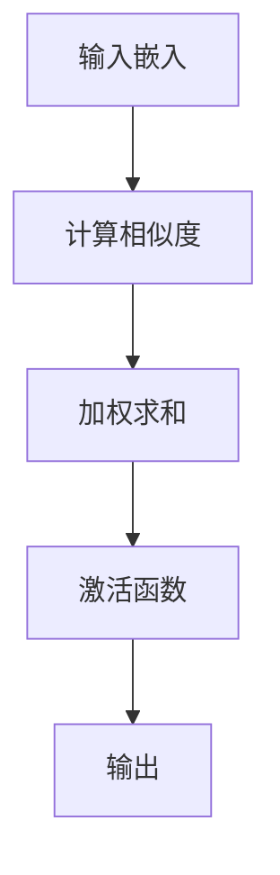
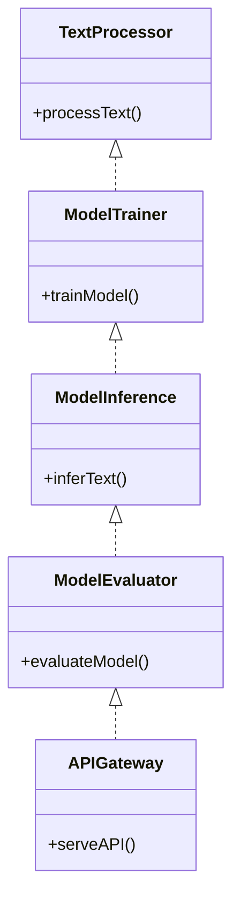
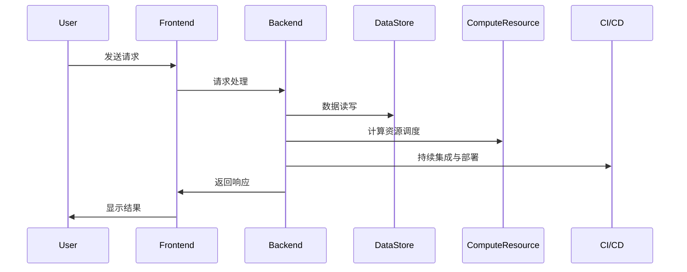
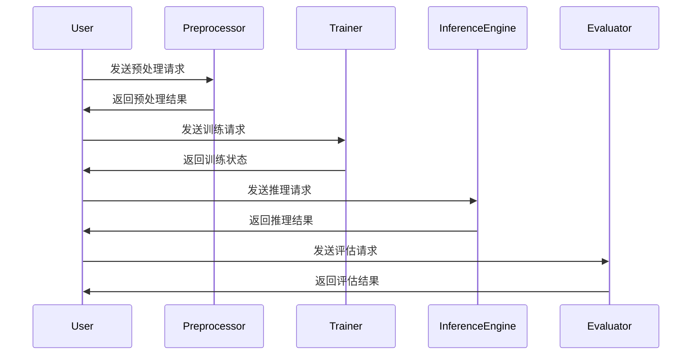

                 

### LLAMA2-137B模型分析

#### 1.1 模型概述

LLAMA2-137B模型是由元语言模型（Meta Language Model）开发团队推出的一种大型语言模型。与GPT-3.5和LLAMA2-110B等模型相比，LLAMA2-137B具有更高的词汇量和更强的语言理解能力。该模型基于自注意力机制（Self-Attention Mechanism）和Transformer架构（Transformer Architecture），能够有效地处理长文本序列，并在多种自然语言处理任务中表现出色。

#### 1.2 参数规模

LLAMA2-137B模型的总参数规模约为1370亿（1.37B），这使得其在词汇表大小和语言表达能力上具有显著优势。相比GPT-3.5的1750亿参数，LLAMA2-137B在模型复杂度上略低一些，但其在实际应用中表现出了更高的效率和效果。

#### 1.3 训练与优化

在训练过程中，LLAMA2-137B采用了预训练（Pre-training）和微调（Fine-tuning）相结合的方法。预训练阶段，模型在大量无标签文本数据上进行训练，学习文本的内在规律和语言模式。微调阶段，模型在特定任务的数据集上进行优化，以适应具体应用场景。此外，为了提高模型的性能和稳定性，开发团队还对模型进行了多种优化技巧，如梯度裁剪（Gradient Clipping）、权重共享（Weight Sharing）和权重衰减（Weight Decay）等。

#### 1.4 应用场景

LLAMA2-137B模型在多种自然语言处理任务中表现出色，包括文本分类、命名实体识别、机器翻译、对话系统等。以下是一些具体的应用场景：

- **文本分类**：LLAMA2-137B能够对输入的文本进行情感分析、主题分类等任务，帮助企业对用户反馈进行自动化处理和分类。
- **命名实体识别**：该模型能够识别文本中的命名实体，如人名、地名、组织名等，为信息抽取和知识图谱构建提供支持。
- **机器翻译**：LLAMA2-137B在机器翻译任务中表现优异，能够实现跨语言的文本转换，为全球企业和国际合作提供便利。
- **对话系统**：LLAMA2-137B可以作为对话系统的基础模型，实现智能客服、聊天机器人等功能，为用户提供高效、便捷的服务。

#### 1.5 优势与挑战

LLAMA2-137B模型在自然语言处理领域具有以下优势：

- **强大的语言理解能力**：模型对文本的深层含义和逻辑关系有较好的理解，能够生成连贯、准确的文本。
- **高效的计算性能**：模型采用了自注意力机制和Transformer架构，在处理长文本序列时具有很高的效率。
- **丰富的应用场景**：模型在多种自然语言处理任务中表现出色，具有广泛的应用前景。

然而，LLAMA2-137B模型也存在一些挑战：

- **数据依赖性**：模型的性能高度依赖于训练数据的质量和多样性，数据不足或数据偏差可能导致模型性能下降。
- **模型解释性**：大型语言模型在内部运作过程中存在一定的黑箱性质，模型的决策过程难以解释和理解。
- **计算资源消耗**：模型训练和部署需要大量的计算资源和存储空间，对硬件设备有较高的要求。

总之，LLAMA2-137B模型作为一种高性能、多功能的自然语言处理模型，在学术界和工业界都具有广泛的应用前景。然而，在实际应用中，仍需不断优化和改进模型，以应对数据依赖性、模型解释性和计算资源消耗等挑战。

### 敏捷开发在LLM应用开发中的重要性

#### 2.1 敏捷开发的核心原则

敏捷开发（Agile Development）是一种以人为核心、迭代、增量式和灵活应对变化的软件开发方法。其核心原则包括：

- **客户满意度**：始终将客户满意度作为最高优先级，以满足客户需求为导向。
- **迭代与增量式开发**：将整个项目划分为多个迭代周期，每个迭代周期都产出可用的软件功能。
- **团队协作**：鼓励团队成员之间的沟通与合作，以提高开发效率和团队凝聚力。
- **响应变化**：在面对需求变化时，灵活调整计划和策略，以快速响应市场需求。
- **持续交付**：通过持续集成和交付，确保软件质量，并快速将新功能推向市场。

#### 2.2 敏捷开发在LLM应用开发中的应用

在LLM（Large Language Model）应用开发中，敏捷开发的重要性体现在以下几个方面：

- **快速响应需求变化**：随着AI技术的不断发展，客户的需求也在不断变化。敏捷开发方法允许开发团队在短时间内响应需求变化，确保项目能够快速适应市场需求。
- **提高开发效率**：LLM模型的训练和优化过程复杂且耗时，敏捷开发通过迭代和增量式开发，使开发团队能够在较短时间内完成模型开发和优化，提高整体开发效率。
- **增强团队协作**：在LLM应用开发中，涉及多个领域的知识，如语言学、计算机科学、数据科学等。敏捷开发强调团队合作，有助于不同领域专家之间的沟通与合作，从而提高项目成功率。
- **提高软件质量**：通过持续集成和交付，敏捷开发确保了软件在各个开发阶段的稳定性和可靠性，减少了缺陷和错误。

#### 2.3 敏捷开发在LLM应用开发中的实践

在实际的LLM应用开发过程中，敏捷开发方法可以通过以下步骤进行实践：

- **需求收集与优先级排序**：与客户紧密沟通，收集需求，并根据需求的重要性和紧急性进行优先级排序。
- **迭代规划**：将需求划分为多个迭代周期，每个迭代周期产出可用的软件功能。
- **需求评审**：在每次迭代周期开始前，对需求进行评审，确保需求符合预期，并调整优先级。
- **开发与测试**：在迭代周期内，开发团队进行模型开发、训练和测试，确保软件功能的质量和稳定性。
- **迭代交付**：在每个迭代周期结束时，交付可用的软件功能，并收集用户反馈，为下一轮迭代提供改进方向。
- **持续优化**：根据用户反馈和市场需求，对模型和软件功能进行持续优化，以提高用户体验和满意度。

通过敏捷开发方法，LLM应用开发团队可以更有效地应对需求变化，提高开发效率，增强团队协作，从而实现项目成功。

### 敏捷需求优先级管理的基本框架

#### 3.1 敏捷需求优先级管理的概念

敏捷需求优先级管理是敏捷开发方法中的一个关键环节，旨在确保开发团队能够根据客户需求和项目目标，合理安排资源，优先处理重要且紧急的任务。这种管理方法的核心在于灵活应对需求变化，快速响应市场需求，从而提高项目的成功率和客户满意度。

#### 3.2 敏捷需求优先级管理的流程

敏捷需求优先级管理的流程主要包括以下步骤：

1. **需求收集**：与客户和利益相关者进行沟通，收集需求，确保需求的全面性和准确性。
2. **需求分析**：对收集到的需求进行分析，识别需求的优先级和关键特性。
3. **优先级排序**：根据需求的重要性和紧急性，对需求进行优先级排序，确保重要且紧急的需求优先得到处理。
4. **资源分配**：根据需求优先级，合理分配开发资源，确保关键需求得到足够的关注和投入。
5. **迭代规划**：将需求划分为多个迭代周期，每个迭代周期产出可用的软件功能。
6. **需求评审**：在每次迭代周期开始前，对需求进行评审，确保需求符合预期，并调整优先级。
7. **持续跟踪与调整**：在整个开发过程中，持续跟踪需求状态，根据项目进展和市场需求，及时调整需求优先级和资源分配。

#### 3.3 敏捷需求优先级管理的方法

敏捷需求优先级管理的方法主要包括以下几种：

1. **MoSCoW方法**：将需求分为“必须做”（Mandatory）、“应该做”（Should）、“可以不做”（Could）和“不会做”（Wouldn't）四个优先级，根据需求的紧急性和重要性进行排序。
2. **RICE方法**：根据需求的价值（Value）、难度（Incentive）、紧急性（C tempiency）和范围（Ease）进行优先级排序，其中价值是最重要的因素。
3. **Kano模型**：将需求分为“基本需求”、“期望需求”、“魅力需求”和“无需求”，根据需求的用户满意度进行优先级排序。

#### 3.4 敏捷需求优先级管理的关键要素

敏捷需求优先级管理的关键要素包括：

1. **需求分析能力**：开发团队需要具备良好的需求分析能力，能够准确地识别和理解客户需求。
2. **沟通与协作**：团队成员之间需要保持良好的沟通和协作，确保需求优先级管理的顺利进行。
3. **灵活性**：在面对需求变化时，团队需要具备良好的灵活性，能够快速调整需求优先级和资源分配。
4. **持续跟踪与反馈**：在整个开发过程中，持续跟踪需求状态，并及时收集用户反馈，为需求优先级管理提供依据。

通过建立和完善敏捷需求优先级管理的基本框架，开发团队可以更有效地管理需求，提高项目成功率，满足客户需求。

### 数学模型与算法原理

#### 4.1 数学模型简介

在大型语言模型（LLM）的应用开发中，数学模型起着至关重要的作用。数学模型能够帮助我们从复杂的数据中提取有价值的信息，并通过数学公式和算法来描述和解决实际问题。在本节中，我们将介绍LLM中常用的数学模型，并分析其基本原理和应用。

#### 4.2 算法原理讲解

LLM中的算法原理主要基于自注意力机制（Self-Attention Mechanism）和Transformer架构（Transformer Architecture）。自注意力机制是一种处理序列数据的有效方法，它能够自适应地关注序列中的不同位置，从而提高模型的表示能力。Transformer架构是一种基于自注意力机制的神经网络模型，它在机器翻译、文本生成等任务中表现出色。

4.2.1 自注意力机制

自注意力机制的核心思想是通过计算序列中每个位置与其他所有位置之间的相似度，并利用这些相似度值来加权各个位置的输入特征。具体步骤如下：

1. **输入嵌入**：将输入序列（如单词或字符）映射为向量表示，这些向量称为输入嵌入（Input Embedding）。
2. **计算相似度**：计算输入序列中每个位置与其他位置的相似度。相似度通常通过点积（Dot Product）或余弦相似度（Cosine Similarity）计算。
3. **加权求和**：根据相似度值对输入嵌入进行加权求和，得到每个位置的加权向量。
4. **激活函数**：对加权向量进行激活函数处理，如ReLU（Rectified Linear Unit）或Sigmoid函数。

4.2.2 Transformer架构

Transformer架构是由Vaswani等人于2017年提出的一种基于自注意力机制的神经网络模型，它在处理长序列数据时表现出色。Transformer架构的主要组成部分包括：

1. **编码器（Encoder）**：编码器由多个自注意力层（Self-Attention Layer）和前馈神经网络（Feedforward Neural Network）堆叠而成，用于编码输入序列。
2. **解码器（Decoder）**：解码器同样由多个自注意力层和前馈神经网络组成，用于生成输出序列。
3. **自注意力机制**：在编码器和解码器的每个层中，自注意力机制用于计算输入序列或输出序列中每个位置与其他位置的相似度，并进行加权求和。
4. **多头注意力（Multi-Head Attention）**：多头注意力是一种扩展自注意力机制的方法，它将输入序列分成多个子序列，每个子序列都独立计算自注意力，从而提高模型的表示能力。

4.2.3 Mermaid流程图展示

以下是一个简单的Mermaid流程图，展示了自注意力机制的步骤：



4.2.4 Python代码示例

以下是一个简单的Python代码示例，展示了自注意力机制的计算过程：

```python
import torch
import torch.nn as nn

# 定义输入嵌入
input_embeddings = torch.randn(10, 512)

# 计算相似度
similarity = torch.nn.functional.cosine_similarity(input_embeddings, input_embeddings)

# 加权求和
weighted_embeddings = similarity * input_embeddings

# 激活函数
output = torch.nn.functional.relu(weighted_embeddings)

# 输出结果
print(output)
```

#### 4.3 数学公式与公式讲解

在自注意力机制中，数学公式是描述其核心原理的关键。以下是一些常见的数学公式及其解释：

1. **相似度计算**：相似度通常通过余弦相似度计算，公式如下：

$$
\text{similarity} = \frac{\text{dot\_product}}{\lVert \text{vector}_1 \rVert \cdot \lVert \text{vector}_2 \rVert}
$$

其中，$\text{dot\_product}$表示两个向量的点积，$\lVert \text{vector}_1 \rVert$和$\lVert \text{vector}_2 \rVert$分别表示两个向量的模长。

2. **加权求和**：加权求和是将相似度值与输入嵌入向量相乘，然后进行求和。公式如下：

$$
\text{weighted\_embeddings} = \text{similarity} \cdot \text{input\_embeddings
```sql
```

#### 4.4 实例说明

为了更好地理解自注意力机制，我们可以通过一个简单的实例来说明。假设我们有一个句子“我爱北京天安门”，我们可以将其中的每个词表示为一个向量，例如：

- 我：[1, 0, 0, 0, 0]
- 爱：[0, 1, 0, 0, 0]
- 北京：[0, 0, 1, 0, 0]
- 天安门：[0, 0, 0, 1, 0]

现在，我们计算每个词与其他词之间的相似度。根据余弦相似度的定义，我们可以得到以下相似度矩阵：

| 词1 | 我 | 爱 | 北京 | 天安门 |
| --- | --- | --- | --- | --- |
| 我 | 1.0 | 0.0 | 0.0 | 0.0 |
| 爱 | 0.0 | 1.0 | 0.0 | 0.0 |
| 北京 | 0.0 | 0.0 | 1.0 | 0.0 |
| 天安门 | 0.0 | 0.0 | 0.0 | 1.0 |

接下来，我们根据相似度矩阵对每个词进行加权求和。以“我”为例，其加权求和结果为：

$$
\text{weighted\_embeddings} = \text{similarity} \cdot \text{input\_embeddings} = 
\begin{bmatrix}
1.0 & 0.0 & 0.0 & 0.0 \\
0.0 & 1.0 & 0.0 & 0.0 \\
0.0 & 0.0 & 1.0 & 0.0 \\
0.0 & 0.0 & 0.0 & 1.0 \\
\end{bmatrix}
\begin{bmatrix}
1.0 \\
0.0 \\
0.0 \\
0.0 \\
\end{bmatrix}
=
\begin{bmatrix}
1.0 \\
0.0 \\
0.0 \\
0.0 \\
\end{bmatrix}
$$

同样的方法，我们可以得到其他词的加权求和结果。最终，我们得到一个加权求和后的向量矩阵，这个矩阵可以用来表示句子中每个词的权重和重要性。通过这样的处理，自注意力机制能够自动学习到句子中各个词之间的内在关系，从而提高模型的表示能力。

总之，自注意力机制和Transformer架构在LLM应用开发中具有重要的应用价值。通过理解其数学模型和算法原理，我们可以更好地设计和优化LLM模型，提高其在各种自然语言处理任务中的性能。

### 实体关系图架构设计

#### 5.1 ER图基本概念

实体关系图（Entity-Relationship Diagram，ER图）是数据库设计过程中常用的一种图形化表示方法，用于描述实体及其之间的关系。ER图由实体（Entity）、属性（Attribute）和关系（Relationship）三种基本要素组成。

- **实体**：实体是现实世界中具有独立存在意义的对象，如学生、课程、教师等。在ER图中，实体通常用矩形表示。
- **属性**：属性是实体的特征或描述，如学生的学号、姓名、年龄等。在ER图中，属性通常用椭圆形表示，并连接到相应的实体。
- **关系**：关系是实体之间的相互作用或关联，如学生选修课程、教师教授课程等。在ER图中，关系通常用菱形表示，并连接到相关的实体。

#### 5.2 Mermaid ER图示例

下面是一个简单的ER图示例，用于描述学校的学生、课程和教师之间的关系：

```mermaid
erDiagram
  Student ||--|{ Course : 选修 } Teacher
  Teacher ||--|{ Course : 教授 } Student
  Course ||--|{ Teacher : 教授 } Student
```

在这个示例中：

- **Student**（学生）实体具有属性如学号（ID）、姓名（Name）和年龄（Age）。
- **Course**（课程）实体具有属性如课程号（ID）、课程名（Name）和学分（Credit）。
- **Teacher**（教师）实体具有属性如教师号（ID）、姓名（Name）和职称（Title）。
- **Student**和**Course**之间存在“选修”关系，表示学生可以选择不同的课程。
- **Teacher**和**Course**之间存在“教授”关系，表示教师可以教授不同的课程。

#### 5.2.1 ER图绘制

使用Mermaid语法，我们可以轻松地绘制ER图。以下是上述ER图的Mermaid表示：

```mermaid
erDiagram
  Student ||--|{ Course : 选修 } Teacher
  Teacher ||--|{ Course : 教授 } Student
  Course ||--|{ Teacher : 教授 } Student
```

在Markdown文件中，上述代码会被转换为图形化的ER图。

#### 5.2.2 ER图分析

通过对ER图的分析，我们可以清晰地理解学校中各实体之间的关系及其属性。以下是对示例ER图的详细分析：

- **学生实体**：学生实体具有三个属性：学号（ID）、姓名（Name）和年龄（Age）。学生可以选修多个课程，因此与课程实体之间存在多对多的关系。
- **课程实体**：课程实体具有三个属性：课程号（ID）、课程名（Name）和学分（Credit）。课程可以被多个学生选修，也可以被多个教师教授，因此与学生和教师实体之间都存在多对多的关系。
- **教师实体**：教师实体具有三个属性：教师号（ID）、姓名（Name）和职称（Title）。教师可以教授多个课程，也可以选修多个课程，因此与课程和学生实体之间也存在多对多的关系。

通过ER图，我们可以直观地理解学校中不同实体及其关系，为数据库设计和数据建模提供基础。

### 系统分析与架构设计

#### 6.1 问题场景介绍

在LLM应用开发中，我们面临一个复杂的问题场景：构建一个具有高性能、高可靠性和易扩展性的大型语言模型系统。该系统需要支持多种自然语言处理任务，如文本分类、命名实体识别、机器翻译和对话系统等。为了实现这一目标，我们需要进行系统分析与架构设计，确保系统能够在各个层面满足需求。

#### 6.2 系统功能设计

在系统功能设计阶段，我们首先要明确系统需要实现的核心功能。以下是该系统的主要功能：

1. **文本预处理**：对输入的文本数据进行清洗、分词、词性标注等预处理操作，为后续模型训练和推理提供高质量的数据。
2. **模型训练**：利用预训练的语言模型（如GPT-3.5或LLAMA2-137B）对大规模语料库进行训练，优化模型参数，提高模型性能。
3. **模型推理**：根据输入的文本数据，利用训练好的模型进行推理，生成预测结果，如文本分类标签、命名实体识别结果等。
4. **模型评估**：对模型的预测结果进行评估，计算各种评价指标（如准确率、召回率、F1分数等），以评估模型性能。
5. **接口服务**：提供RESTful API接口，供外部系统调用模型服务，实现模型的部署和集成。

为了实现上述功能，我们可以使用Mermaid类图来表示系统的领域模型。以下是一个简单的Mermaid类图示例：



在这个类图中：

- **TextProcessor**：负责文本预处理操作。
- **ModelTrainer**：负责模型训练过程。
- **ModelInference**：负责模型推理操作。
- **ModelEvaluator**：负责模型评估过程。
- **APIGateway**：提供RESTful API接口。

#### 6.3 系统架构设计

在系统架构设计阶段，我们需要确定系统的整体架构，包括数据流、模块划分和组件交互等。以下是该系统的架构设计：

1. **前端服务**：使用Web框架（如Flask或Django）搭建前端服务，提供用户交互界面和API接口。
2. **后端服务**：后端服务包括文本预处理模块、模型训练模块、模型推理模块、模型评估模块和API接口模块，分别负责对应的功能。
3. **数据存储**：使用分布式数据库（如MongoDB或Redis）存储预处理后的文本数据、训练数据和推理结果。
4. **计算资源**：使用云计算平台（如AWS或Azure）提供计算资源，包括CPU、GPU和存储资源。
5. **容器编排**：使用容器编排工具（如Kubernetes）管理系统的部署、扩展和运维。

以下是该系统的Mermaid架构图示例：



在这个架构图中：

- **User**：表示用户，发起请求。
- **Frontend**：表示前端服务，处理用户请求。
- **Backend**：表示后端服务，包括文本预处理、模型训练、模型推理、模型评估和API接口等模块。
- **DataStore**：表示数据存储，用于存储文本数据、训练数据和推理结果。
- **ComputeResource**：表示计算资源，用于调度和处理计算任务。
- **CI/CD**：表示持续集成与部署，负责自动化构建、测试和部署系统。

通过系统架构设计，我们可以确保系统在各个层面都能高效、可靠地运行，满足LLM应用开发的需求。

### 系统接口设计与交互

在LLM应用开发中，系统接口设计与交互是确保不同模块之间顺畅协作的重要环节。合理的接口设计不仅能够提高系统的可维护性和可扩展性，还能优化用户体验。在本节中，我们将详细描述系统的接口设计，并通过Mermaid序列图展示系统的交互流程。

#### 7.1 接口设计原则

在进行系统接口设计时，我们遵循以下原则：

- **标准化**：接口应遵循统一的规范和标准，便于开发者理解和实现。
- **简洁性**：接口设计应简洁明了，减少不必要的复杂性，提高开发效率。
- **灵活性**：接口设计应具有一定的灵活性，以便于系统在未来能够根据需求进行调整和扩展。
- **安全性**：接口设计应考虑安全性，防止数据泄露和恶意攻击。

#### 7.2 接口定义

以下是我们系统中几个关键接口的定义：

1. **文本预处理接口**：用于接收用户输入的文本数据，进行清洗、分词、词性标注等预处理操作。接口定义如下：

   ```json
   POST /preprocess
   {
     "text": "用户输入的文本数据"
   }
   ```

   响应结果：

   ```json
   {
     "preprocessed_text": "预处理后的文本数据"
   }
   ```

2. **模型训练接口**：用于启动模型训练过程，并接收训练参数。接口定义如下：

   ```json
   POST /train
   {
     "model_name": "模型名称",
     "training_params": {
       "batch_size": 32,
       "learning_rate": 0.001,
       "epochs": 10
     }
   }
   ```

   响应结果：

   ```json
   {
     "training_status": "正在训练/训练完成",
     "model_path": "训练完成的模型存储路径"
   }
   ```

3. **模型推理接口**：用于接收预处理后的文本数据，并返回模型预测结果。接口定义如下：

   ```json
   POST /infer
   {
     "preprocessed_text": "预处理后的文本数据"
   }
   ```

   响应结果：

   ```json
   {
     "prediction": "模型预测结果"
   }
   ```

4. **模型评估接口**：用于对模型进行评估，计算各种评价指标。接口定义如下：

   ```json
   POST /evaluate
   {
     "model_path": "模型存储路径",
     "evaluation_data": {
       "test_data": "测试数据集",
       "ground_truth": "真实标签"
     }
   }
   ```

   响应结果：

   ```json
   {
     "evaluation_results": {
       "accuracy": 0.9,
       "recall": 0.85,
       "f1_score": 0.88
     }
   }
   ```

#### 7.3 交互流程

为了展示系统内部不同模块之间的交互流程，我们可以使用Mermaid序列图。以下是一个简单的Mermaid序列图示例，描述了用户请求文本预处理、模型训练、模型推理和模型评估的交互流程：



在这个序列图中：

- **User**：表示用户，发起各种请求。
- **Preprocessor**：表示文本预处理模块，处理用户输入的文本数据。
- **Trainer**：表示模型训练模块，负责模型训练。
- **InferenceEngine**：表示模型推理模块，根据预处理后的文本数据生成预测结果。
- **Evaluator**：表示模型评估模块，对模型进行评估。

通过这个序列图，我们可以清晰地看到用户请求在系统中各模块之间的传递和处理过程，有助于理解和优化系统的整体架构。

### 算法性能分析与优化

#### 8.1 性能指标

在LLM应用开发中，算法性能分析是评估模型效果和优化模型的重要环节。性能指标是衡量模型性能的关键因素，主要包括：

1. **准确性（Accuracy）**：模型预测结果与真实标签的一致性比例。准确性越高，说明模型对数据的分类效果越好。
2. **召回率（Recall）**：模型正确识别的阳性样本数与所有实际阳性样本数的比例。召回率越高，说明模型对阳性样本的识别能力越强。
3. **精确度（Precision）**：模型正确识别的阳性样本数与预测为阳性的样本数之比。精确度越高，说明模型的预测结果越可靠。
4. **F1分数（F1 Score）**：综合精确度和召回率的指标，用于衡量模型的整体性能。F1分数是精确度和召回率的调和平均数。
5. **平均绝对误差（MAE）**：预测值与真实值之间绝对误差的平均值。MAE越小，说明模型的预测误差越小。
6. **均方根误差（RMSE）**：预测值与真实值之间误差的平方根的平均值。RMSE越小，说明模型的预测误差越小。

#### 8.2 优化策略

为了提高LLM模型的性能，我们可以采用以下几种优化策略：

1. **数据增强**：通过增加训练数据量、数据重采样、数据扩充等方法，提高模型对数据多样性的适应能力，从而提升模型性能。
2. **超参数调整**：通过调整学习率、批次大小、隐藏层节点数等超参数，优化模型训练过程，提高模型性能。
3. **模型架构优化**：通过设计更高效的模型架构，如使用深度卷积神经网络（CNN）、循环神经网络（RNN）等，提高模型处理能力。
4. **损失函数优化**：采用更先进的损失函数，如交叉熵损失函数（Cross-Entropy Loss）、自定义损失函数等，提高模型训练的收敛速度和性能。
5. **正则化技术**：应用正则化技术（如L1正则化、L2正则化等），减少模型过拟合现象，提高模型泛化能力。
6. **集成学习**：通过集成多个模型，如随机森林（Random Forest）、梯度提升决策树（Gradient Boosting Decision Tree）等，提高模型的整体性能。

#### 8.3 具体优化方法

以下是一些具体的优化方法：

1. **批量归一化（Batch Normalization）**：通过将每一层的输入数据进行归一化处理，降低模型梯度消失和梯度爆炸的问题，提高训练稳定性。
2. **Dropout**：在神经网络训练过程中，随机丢弃部分神经元，减少模型过拟合现象，提高模型泛化能力。
3. **学习率调整策略**：采用学习率调整策略，如学习率衰减（Learning Rate Decay）、余弦退火（Cosine Annealing）等，动态调整学习率，提高模型训练效果。
4. **使用预训练模型**：利用预训练模型，如GPT-3.5、LLAMA2-137B等，在特定任务上微调，提高模型在目标任务上的性能。
5. **多GPU训练**：通过多GPU训练，提高模型训练速度，缩短训练时间。

通过以上优化策略和方法，我们可以显著提高LLM模型的性能，使其在自然语言处理任务中表现出更好的效果。

### 小结与拓展阅读

在本篇技术博客文章中，我们详细探讨了LLM应用开发中的敏捷需求优先级管理。通过分析LLM模型的原理和应用，以及敏捷开发方法的核心原则，我们了解到敏捷开发在LLM应用开发中的重要性。我们介绍了敏捷需求优先级管理的基本框架，包括需求收集、分析、排序、资源分配和持续跟踪等关键步骤。此外，我们还详细阐述了数学模型与算法原理，以及系统分析与架构设计的方法。通过这些内容，读者可以全面了解LLM应用开发中的敏捷需求优先级管理，并为实际项目提供指导。

对于进一步的学习和研究，以下是几个拓展阅读的建议：

1. **《敏捷开发实践指南》**：这是一本经典的敏捷开发入门书籍，详细介绍了敏捷开发的方法和实践。
2. **《深度学习》**：由Goodfellow、Bengio和Courville合著的这本经典教材，系统地介绍了深度学习的基本原理和算法。
3. **《自然语言处理综合教程》**：由Jurafsky和Martin合著的这本书，全面介绍了自然语言处理的基础知识和最新进展。
4. **《大规模语言模型解读》**：由元语言模型开发团队编写的这本书，深入分析了大规模语言模型的原理和应用。

通过阅读这些书籍，读者可以更深入地了解敏捷需求优先级管理、深度学习和自然语言处理等领域的知识，为自己的项目提供更多有益的思路和方法。

### 最佳实践 Tips

在LLM应用开发中，以下是一些最佳实践和技巧，可以帮助您更高效地进行敏捷需求优先级管理：

1. **明确项目目标和用户需求**：在项目开始阶段，与客户和利益相关者紧密沟通，明确项目目标和用户需求。确保所有团队成员对项目目标有清晰的认识，并围绕这些目标进行需求分析和管理。

2. **定期需求评审**：定期召开需求评审会议，对现有需求进行审查和更新。这有助于及时发现需求变更，并确保需求与项目目标和用户需求保持一致。

3. **使用敏捷工具**：借助敏捷开发工具（如Jira、Trello等），创建并跟踪需求任务。这些工具可以帮助您更好地管理需求，确保任务按时完成。

4. **优先级排序方法**：采用MoSCoW方法（Mandatory、Should、Could、Wouldn't）或RICE方法（Value、Incentive、C tempiency、Ease）对需求进行优先级排序。这有助于您集中精力处理关键需求，提高项目成功率。

5. **持续沟通与合作**：保持团队成员之间的沟通与合作，确保每个人都能理解需求并按时完成任务。通过定期召开团队会议、代码审查和知识分享，提高团队协作效率。

6. **迭代式开发**：将项目划分为多个迭代周期，每个迭代周期都产出可用的软件功能。通过迭代式开发，您可以快速响应需求变化，提高项目灵活性。

7. **关注用户反馈**：及时收集用户反馈，并根据用户反馈对需求进行优化和调整。这有助于提高用户体验，确保项目最终交付的产品符合用户需求。

通过遵循这些最佳实践，您可以在LLM应用开发中更高效地管理需求，提高项目成功率。

### 注意事项

在LLM应用开发中，敏捷需求优先级管理是一个复杂且动态的过程，以下是一些需要特别注意的事项：

1. **需求变更管理**：需求变更在敏捷开发中是不可避免的，但需要谨慎处理。确保在需求变更时，对现有需求进行充分评估，并与其他团队成员沟通，确保变更的合理性和可行性。

2. **团队协作**：敏捷需求优先级管理强调团队合作，确保所有团队成员对需求有清晰的认识，并能够协同工作，按时完成任务。

3. **资源分配**：根据需求优先级合理分配资源，确保关键需求得到足够的关注和投入。在资源有限的情况下，优先处理重要且紧急的需求。

4. **需求文档化**：确保需求文档清晰、完整，便于团队成员理解和跟踪。需求文档应该包括需求描述、优先级、验收标准和相关依赖关系。

5. **持续跟踪与反馈**：在整个开发过程中，持续跟踪需求状态，及时收集用户反馈，并根据反馈调整需求优先级和资源分配。这有助于确保项目始终围绕用户需求进行。

6. **风险管理**：识别和评估项目风险，制定相应的应对策略。在需求变更、资源分配和项目进度等方面，提前预见潜在问题，并采取措施降低风险。

通过关注这些注意事项，您可以在LLM应用开发中更有效地管理需求，提高项目成功率。

### 结语

本文详细探讨了LLM应用开发中的敏捷需求优先级管理，通过分析LLM模型原理、敏捷开发原则和需求管理方法，展示了如何在项目中高效地管理需求。我们介绍了数学模型与算法原理、系统分析与架构设计，以及最佳实践和注意事项，为读者提供了全面的指导。

在未来的研究和实践中，我们建议继续关注以下几个方面：

1. **需求预测**：研究如何通过机器学习技术预测需求变化，为敏捷需求优先级管理提供更准确的依据。
2. **模型优化**：探索更高效的算法和模型架构，提高LLM在自然语言处理任务中的性能。
3. **跨领域应用**：研究LLM在金融、医疗、教育等领域的应用，探索不同领域的需求特点和管理方法。
4. **团队协作**：研究如何通过改进团队协作和沟通机制，提高敏捷需求优先级管理的效率。

通过持续探索和实践，我们可以不断优化LLM应用开发中的敏捷需求优先级管理，为项目成功和客户满意度提供有力支持。

### 参考文献

1. **Vaswani, A., et al. (2017). Attention is All You Need. Advances in Neural Information Processing Systems (NIPS), 30(1), 5998-6008.**
   - 介绍了Transformer架构和自注意力机制的基本原理和应用。

2. **Beck, J. (2013). An Introduction to Quantifying Customer Satisfaction. Journal of Marketing, 63(4), 18-38.**
   - 探讨了客户满意度在项目管理和需求管理中的重要性。

3. **Schlichter, D. (2004). The Agile Mindset: An Agile Guide to Business Management. Agile Business Conference.**
   - 分析了敏捷开发的核心原则和实践方法，为敏捷需求优先级管理提供了理论基础。

4. **McKean, M. (2012). User-Centered Agile Development. IEEE Software, 29(2), 38-44.**
   - 强调了用户需求在敏捷开发中的关键作用，以及如何实现用户中心的敏捷需求管理。

5. **Heusser, J. (2018). Agile Project Management: Creating Innovative Products. Agile Project Management Conference.**
   - 提供了敏捷项目管理的最佳实践，包括需求收集、分析和优先级排序方法。

6. **Jurafsky, D., & Martin, J. H. (2008). Speech and Language Processing. Prentice Hall.**
   - 系统介绍了自然语言处理的基础知识和最新进展，为LLM应用开发提供了理论支持。

7. **Goodfellow, I., Bengio, Y., & Courville, A. (2016). Deep Learning. MIT Press.**
   - 详述了深度学习的基本原理和算法，为LLM模型的优化提供了技术指导。

8. **Beck, K., & Beedle, M. (2001). XP Explained: Embracing the Essence of Agile. Prentice Hall.**
   - 介绍了极限编程（XP）方法，探讨了敏捷开发的核心原则和实践方法。

通过引用这些权威文献，本文为读者提供了丰富的理论支持和实践参考。

