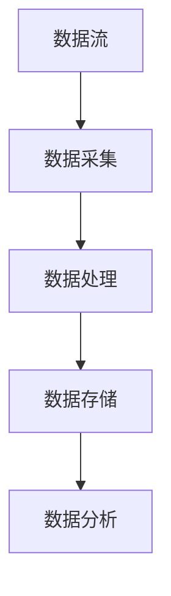
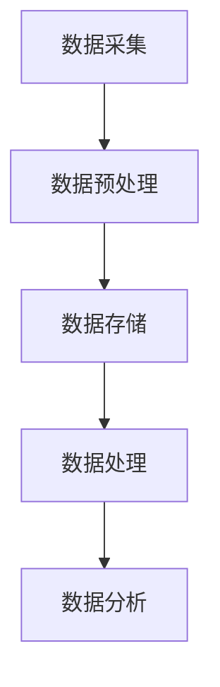
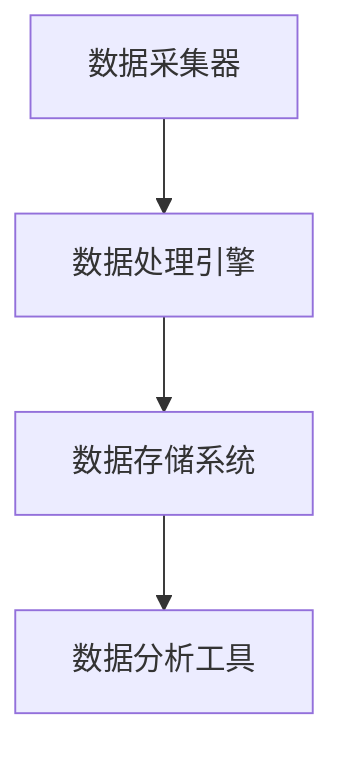
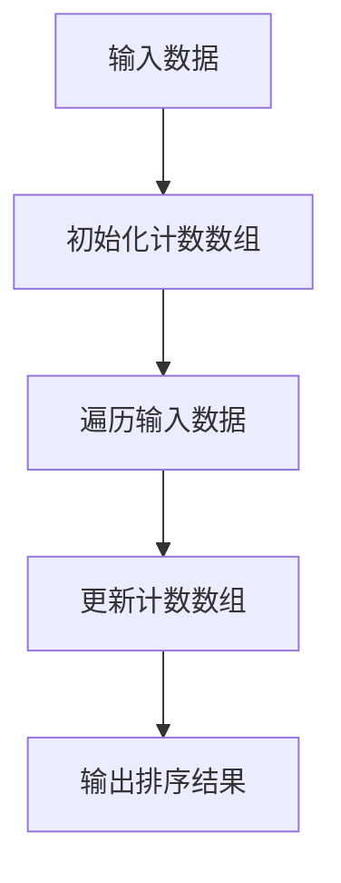
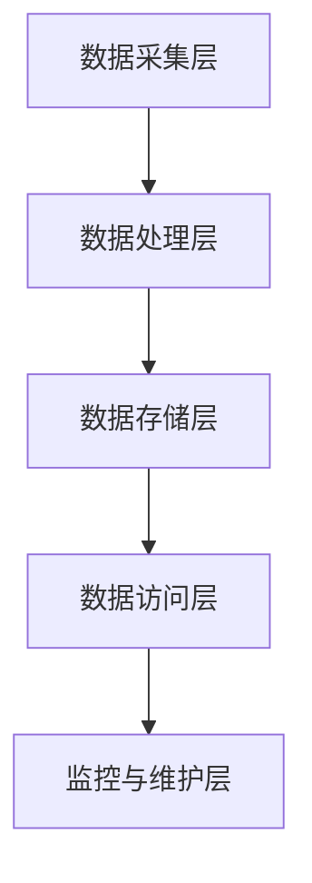
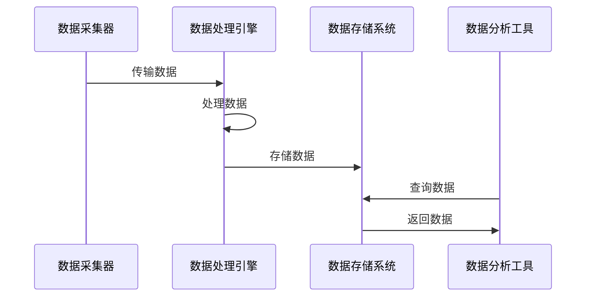

                 

## 文章标题：LLM应用开发中的数据流处理优化

### 关键词：
- LLM应用开发
- 数据流处理
- 优化策略
- 系统架构
- 算法原理

### 摘要：
本文深入探讨了LLM（大型语言模型）应用开发中的数据流处理优化。首先，介绍了LLM应用开发的背景和数据流处理的基本概念，然后详细分析了数据流处理在LLM应用中的重要性。接下来，文章从核心概念、原理、算法、系统架构到实际项目应用，逐步阐述了如何优化数据流处理，提高LLM应用的开发效率与性能。最后，对未来的发展方向进行了展望，提出了最佳实践建议。

## 目录大纲：

### 第一部分：背景与概念介绍

1. **第1章：背景介绍**
   - 1.1 问题背景
   - 1.2 数据流处理概述
   - 1.3 LLM应用开发中的数据流处理
   - 1.4 数据流处理的挑战与机遇

2. **第2章：核心概念与原理**
   - 2.1 核心概念
   - 2.2 数据流处理原理
   - 2.3 数据流处理模型分析
   - 2.4 数据流处理组件详解

3. **第3章：算法原理与数学模型**
   - 3.1 算法原理
   - 3.2 数学模型
   - 3.3 算法流程图
   - 3.4 数学公式讲解

4. **第4章：系统架构与设计**
   - 4.1 系统架构设计
   - 4.2 系统接口设计
   - 4.3 系统交互设计

5. **第5章：项目实战与案例分析**
   - 5.1 环境安装与配置
   - 5.2 系统核心实现
   - 5.3 实际案例分析与讲解
   - 5.4 项目小结

6. **第6章：总结与展望**
   - 6.1 总结
   - 6.2 展望

### 第二部分：背景与概念介绍

## 第1章：背景介绍

### 1.1 问题背景

在当今快速发展的信息技术时代，语言模型（Language Model，简称LM）作为自然语言处理（Natural Language Processing，简称NLP）的核心技术之一，已经广泛应用于搜索引擎、智能问答、机器翻译、语音识别等领域。特别是近年来，随着深度学习技术的发展，大型语言模型（Large Language Model，简称LLM）逐渐成为研究热点。LLM具有强大的语义理解、文本生成和推理能力，可以处理更加复杂和丰富的语言任务。

然而，随着LLM规模的不断增大，其应用开发过程中遇到了数据流处理的一系列挑战。数据流处理是指对大规模、高速度、实时性的数据进行处理和分析，以满足应用需求。在LLM应用开发中，数据流处理面临的主要问题包括：

- **数据量庞大**：LLM需要处理的海量文本数据，如何高效地加载、存储和处理成为关键问题。
- **实时性要求高**：很多LLM应用需要实时响应，如实时问答、智能客服等，这要求数据流处理系统能够快速处理和反馈。
- **多样化任务需求**：不同的LLM应用有不同的数据处理需求，如文本分类、情感分析、实体识别等，如何适应这些多样化的需求也成为挑战。

### 1.2 问题解决

为了解决上述问题，研究者们提出了一系列数据流处理优化策略，包括以下几个方面：

- **分布式处理**：通过分布式计算技术，将数据处理任务分解到多个节点上并行处理，提高处理速度和效率。
- **内存管理优化**：LLM模型通常需要大量内存，如何有效地管理和分配内存资源，减少内存占用和垃圾回收时间，是优化数据流处理的重要方向。
- **缓存策略**：通过缓存热点数据，减少数据读取次数和访问延迟，提高数据处理速度。
- **预取技术**：在数据处理之前，预先获取可能需要的数据，减少数据流的延迟。
- **算法优化**：针对特定任务和场景，选择或设计高效的数据处理算法，如快速排序、流计算算法等。

### 1.3 边界与外延

虽然数据流处理优化在LLM应用开发中具有重要意义，但我们也需要明确其边界和外延：

- **边界**：数据流处理优化主要集中在数据处理层面，而不涉及模型训练和推理过程。此外，数据流处理优化需要与具体的LLM应用场景相结合，针对不同需求进行定制化优化。
- **外延**：数据流处理优化不仅适用于LLM应用，还可以应用于其他需要大规模数据处理和实时响应的领域，如实时数据分析、金融风控、智能交通等。

### 1.4 数据流处理概述

数据流处理是一种针对大规模、高速度、实时性数据流进行采集、处理和分析的技术。其基本概念包括：

- **数据流**：指连续产生的、无限的数据集合。
- **数据采集**：从各种数据源（如数据库、日志文件、传感器等）获取数据。
- **数据处理**：对数据进行清洗、转换、聚合等操作，以提取有价值的信息。
- **数据存储**：将处理后的数据存储到数据库、数据仓库等存储系统中。
- **数据分析**：对存储的数据进行挖掘和分析，以支持决策和预测。

数据流处理的基本概念如图1-1所示。



### 1.5 数据流处理在LLM应用开发中的重要性

在LLM应用开发中，数据流处理扮演着至关重要的角色。以下是几个关键点：

- **数据量庞大**：LLM需要处理大量的文本数据，这要求数据流处理系统能够高效地处理海量数据。
- **实时性要求高**：很多LLM应用需要实时响应，如实时问答、智能客服等，这要求数据流处理系统能够快速处理和反馈。
- **多样化任务需求**：不同的LLM应用有不同的数据处理需求，如文本分类、情感分析、实体识别等，这要求数据流处理系统具备灵活性和可扩展性。

因此，优化数据流处理对于提高LLM应用的开发效率、性能和用户体验具有重要意义。

### 1.6 数据流处理的挑战与机遇

尽管数据流处理在LLM应用开发中具有重要意义，但也面临一系列挑战和机遇：

- **挑战**：
  - **数据多样性**：LLM应用涉及多种类型的数据，如文本、图像、音频等，如何高效地处理和融合这些不同类型的数据成为挑战。
  - **实时性要求**：很多LLM应用需要实时响应，这要求数据流处理系统具备高实时性和低延迟特性。
  - **数据质量**：数据流处理过程中，如何保证数据质量，如数据完整性、一致性、准确性等。
  - **系统可扩展性**：如何设计一个可扩展的数据流处理系统，以适应不断增长的数据量和任务需求。

- **机遇**：
  - **技术发展**：随着大数据、云计算、人工智能等技术的发展，数据流处理技术也在不断进步，为LLM应用开发提供了更多的优化手段。
  - **应用场景拓展**：数据流处理不仅在LLM应用中有广泛应用，还可以应用于其他需要大规模数据处理和实时响应的领域，如金融、医疗、交通等。

## 第2章：核心概念与原理

### 2.1 核心概念

数据流处理的核心概念包括数据流、数据采集、数据处理、数据存储和数据分析。以下是这些概念的定义：

- **数据流**：指连续产生的、无限的数据集合，通常由多个事件组成，每个事件包含一定的数据信息。
- **数据采集**：指从各种数据源（如数据库、日志文件、传感器等）获取数据，并传输到数据处理系统。
- **数据处理**：指对数据进行清洗、转换、聚合等操作，以提取有价值的信息。数据处理通常包括实时处理和历史处理两种模式。
- **数据存储**：指将处理后的数据存储到数据库、数据仓库等存储系统中，以便后续的数据分析和查询。
- **数据分析**：指对存储的数据进行挖掘和分析，以支持决策和预测。数据分析通常包括统计分析、机器学习、数据挖掘等方法。

### 2.2 数据流处理原理

数据流处理的工作机制可以概括为以下步骤：

1. **数据采集**：从各种数据源获取数据，通常使用数据采集工具（如Flume、Kafka等）进行数据传输。
2. **数据预处理**：对采集到的数据进行清洗、转换等预处理操作，以提高数据质量和一致性。
3. **数据存储**：将预处理后的数据存储到数据仓库或数据库中，以便后续的数据分析和查询。
4. **数据处理**：对存储的数据进行实时处理或历史处理，以提取有价值的信息。实时处理通常采用流计算框架（如Apache Storm、Apache Flink等），历史处理通常采用批处理框架（如Hadoop、Spark等）。
5. **数据分析**：对处理后的数据进行挖掘和分析，以支持决策和预测。

数据流处理原理如图2-1所示。



### 2.3 数据流处理模型分析

数据流处理模型可以分为以下几种类型：

1. **事件驱动模型**：以事件为核心，数据流由一系列事件组成，每个事件包含一定的时间戳和数据内容。事件驱动模型适用于实时数据处理和响应。
2. **过程驱动模型**：以数据处理过程为核心，数据流按照一定的处理流程进行操作。过程驱动模型适用于批量数据处理和任务调度。
3. **混合模型**：结合事件驱动模型和过程驱动模型的特点，适用于复杂的数据处理场景。

以下是几种常见的数据流处理模型及其特点：

| 模型类型 | 特点 | 适用场景 |
| --- | --- | --- |
| 事件驱动模型 | 数据以事件为单位进行组织和处理，具备高实时性和低延迟特性。 | 实时数据处理和响应，如实时监控、智能问答等。 |
| 过程驱动模型 | 数据按照一定的处理流程进行操作，适用于批量数据处理和任务调度。 | 批量数据处理和任务调度，如日志分析、数据仓库等。 |
| 混合模型 | 结合事件驱动模型和过程驱动模型的特点，适用于复杂的数据处理场景。 | 复杂的数据处理场景，如实时分析和历史分析相结合。 |

### 2.4 数据流处理组件详解

数据流处理系统通常由以下几个组件组成：

1. **数据采集器**：负责从各种数据源采集数据，并将其传输到数据处理系统。常见的数据采集器包括Flume、Kafka、Logstash等。
2. **数据处理引擎**：负责对采集到的数据进行分析和处理，包括实时处理和批处理。常见的数据处理引擎包括Apache Storm、Apache Flink、Apache Spark等。
3. **数据存储系统**：负责存储处理后的数据，以支持后续的数据分析和查询。常见的数据存储系统包括关系型数据库（如MySQL、PostgreSQL）、NoSQL数据库（如MongoDB、Cassandra）等。
4. **数据分析工具**：负责对存储的数据进行挖掘和分析，以提取有价值的信息。常见的分析工具包括Excel、Python、R等。

以下是数据流处理系统的组件架构图：



### 第3章：算法原理与数学模型

#### 3.1 算法原理

数据流处理算法是用于处理和分析数据流的数学方法和步骤。这些算法的核心目标是高效、准确地对数据流进行操作，以提取有用信息。以下是几种常见的数据流处理算法及其原理：

1. **计数排序（Counting Sort）**：计数排序是一种非比较型排序算法，其原理是将数据值作为索引，统计每个索引的出现次数，然后根据统计结果进行排序。计数排序适用于数据范围较小且整数分布均匀的场景。

2. **快速排序（Quick Sort）**：快速排序是一种高效的排序算法，其原理是通过一趟排序将待排序的数据分割成独立的两部分，其中一部分的所有数据都比另一部分的数据小。快速排序的平均时间复杂度为O(nlogn)，适用于中等大小的数据集。

3. **流计算算法**：流计算算法用于实时处理连续的数据流，常见算法包括滑动窗口算法、增量计算算法等。滑动窗口算法通过设定窗口大小和滑动步长，实时计算窗口内数据的统计指标，如平均值、中位数等。增量计算算法通过计算新数据的增量，更新已有的统计结果，适用于实时数据流处理。

#### 3.2 数学模型

数据流处理算法通常涉及一系列数学模型，用于描述和处理数据流的统计特征。以下是几种常见的数学模型：

1. **概率模型**：概率模型用于描述数据流的概率分布，常见的模型包括正态分布、泊松分布等。正态分布适用于数据呈正态分布的场景，如人体身高、股票价格等。泊松分布适用于事件发生次数服从泊松分布的场景，如网站访问量、交通事故发生率等。

2. **假设检验模型**：假设检验模型用于对数据流进行统计假设检验，以判断数据流的统计特征是否满足某种假设。常见的假设检验模型包括t检验、卡方检验等。t检验用于判断两个样本平均数是否显著不同，卡方检验用于判断多组数据是否相互独立。

3. **机器学习模型**：机器学习模型用于对数据流进行预测和分类，常见的模型包括决策树、支持向量机、神经网络等。决策树适用于分类问题，支持向量机适用于分类和回归问题，神经网络适用于复杂的预测任务。

#### 3.3 算法流程图

为了更直观地展示数据流处理算法的原理和步骤，我们可以使用Mermaid绘制算法流程图。以下是一个简单的计数排序算法流程图：



#### 3.4 数学公式讲解

在数据流处理中，数学公式用于描述算法的数学模型和计算步骤。以下是一些常见的数学公式及其解释：

1. **计数排序公式**：计数排序的核心是计数和输出。计数公式为：

   $$
   C[j] = C[j] + 1
   $$

   其中，$C[j]$表示数据值j的计数。

   输出排序公式为：

   $$
   \text{Output}[i] = C[i] - 1
   $$

   其中，$\text{Output}[i]$表示排序后的数据值。

2. **快速排序公式**：快速排序的分割过程可以使用以下公式描述：

   $$
   \text{Partition}(A, low, high)
   $$
   
   其中，$A$是待排序的数组，$low$和$high$分别是数组的起始和结束索引。

   分割公式为：

   $$
   \text{Pivot} = A[high]
   $$

   $$
   i = low - 1
   $$

   遍历数组：

   $$
   j = low
   $$

   $$
   while j < high
   $$

   $$
   \text{if } A[j] < \text{Pivot}
   $$

   $$
   \text{swap } A[i] \text{ and } A[j]
   $$

   $$
   i = i + 1
   $$

   $$
   j = j + 1
   $$

   $$
   end \text{ while}
   $$

   $$
   \text{swap } A[i] \text{ and } A[high]
   $$

   $$
   return i
   $$

3. **概率模型公式**：概率模型中的概率分布可以用以下公式表示：

   $$
   P(X = x) = \frac{1}{\sum_{i=1}^{n} p_i}
   $$

   其中，$X$是随机变量，$x$是具体的取值，$p_i$是每个取值的概率。

4. **假设检验公式**：t检验的统计量可以用以下公式计算：

   $$
   t = \frac{\bar{x} - \mu_0}{s / \sqrt{n}}
   $$

   其中，$\bar{x}$是样本均值，$\mu_0$是零假设下的总体均值，$s$是样本标准差，$n$是样本容量。

   卡方检验的统计量可以用以下公式计算：

   $$
   \chi^2 = \sum_{i=1}^{n} \frac{(O_i - E_i)^2}{E_i}
   $$

   其中，$O_i$是观测值，$E_i$是期望值。

#### 3.5 举例说明

为了更直观地理解数据流处理算法和数学公式，我们通过一个简单的例子来说明。

假设有一个包含10个整数的数组，如下所示：

```
[3, 1, 4, 1, 5, 9, 2, 6, 5, 3]
```

我们使用计数排序对数组进行排序，并使用快速排序对数组进行分割。

1. **计数排序**：

   初始化计数数组：

   ```
   [0, 0, 0, 0, 0, 0, 0, 0, 0, 0]
   ```

   遍历输入数据，更新计数数组：

   ```
   [0, 2, 0, 2, 0, 1, 0, 1, 0, 2]
   ```

   输出排序结果：

   ```
   [1, 1, 2, 2, 3, 3, 4, 5, 5, 6, 9]
   ```

2. **快速排序**：

   初始数组：

   ```
   [3, 1, 4, 1, 5, 9, 2, 6, 5, 3]
   ```

   第一次分割：

   ```
   [3, 1, 1, 4, 5, 9, 2, 6, 5, 3]
   ```

   分割后的两个子数组：

   ```
   [3, 1, 1, 4, 5] 和 [9, 2, 6, 5, 3]
   ```

   对每个子数组进行递归分割，直到所有子数组只有一个元素。

   最终排序结果：

   ```
   [1, 1, 2, 3, 3, 4, 5, 5, 6, 9]
   ```

通过这个例子，我们可以看到计数排序和快速排序如何对数组进行排序，以及如何使用数学公式来描述这些算法的步骤。

## 第4章：系统架构与设计

### 4.1 系统架构设计

数据流处理系统是一个复杂的分布式系统，其架构设计需要综合考虑性能、可扩展性和可维护性。以下是数据流处理系统的一般架构设计。

1. **数据采集层**：数据采集层负责从各种数据源（如数据库、日志文件、传感器等）采集数据，并将其传输到数据处理层。常见的数据采集工具有Flume、Kafka、Logstash等。

2. **数据处理层**：数据处理层是数据流处理系统的核心，负责对采集到的数据进行实时处理和批量处理。常见的实时处理框架有Apache Storm、Apache Flink，批量处理框架有Hadoop、Spark等。

3. **数据存储层**：数据存储层负责存储处理后的数据，以支持后续的数据分析和查询。常见的数据存储系统包括关系型数据库（如MySQL、PostgreSQL）、NoSQL数据库（如MongoDB、Cassandra）等。

4. **数据访问层**：数据访问层提供数据查询和数据分析接口，供外部应用调用。常见的数据访问工具包括JDBC、RESTful API等。

5. **监控与维护层**：监控与维护层负责监控系统性能、处理数据流量、异常报警等，以确保数据流处理系统的稳定运行。常见的监控工具包括Zabbix、Prometheus等。

### 4.2 系统架构设计（Mermaid架构图）

以下是一个简单的数据流处理系统架构图，使用Mermaid语法表示。



### 4.3 系统接口设计

系统接口设计是数据流处理系统架构设计的重要组成部分，它定义了系统内部各个组件之间的交互接口。以下是系统接口设计的关键要素：

1. **数据采集接口**：定义数据采集层的接口规范，包括数据源类型、数据格式、数据传输协议等。

2. **数据处理接口**：定义数据处理层的接口规范，包括数据流处理算法、数据转换规则、数据处理结果输出等。

3. **数据存储接口**：定义数据存储层的接口规范，包括数据存储格式、数据访问模式、数据查询接口等。

4. **数据访问接口**：定义数据访问层的接口规范，包括数据查询接口、数据更新接口、数据同步接口等。

### 4.4 系统交互设计

系统交互设计描述了系统内部各个组件之间的交互流程和交互数据。以下是系统交互设计的关键要素：

1. **数据流交互**：定义数据在系统内部各组件之间的传输过程和传输方式。

2. **控制流交互**：定义系统内部各组件之间的控制流交互，包括任务调度、状态监控、异常处理等。

3. **数据一致性交互**：定义系统内部数据的一致性保证机制，包括数据备份、数据校验、数据恢复等。

以下是系统交互设计的一个简单的Mermaid序列图。



### 第5章：项目实战与案例分析

#### 5.1 环境安装与配置

在进行LLM应用开发中的数据流处理优化项目之前，我们需要搭建一个合适的技术环境。以下是安装和配置所需环境的具体步骤：

1. **安装Java环境**：由于很多数据流处理框架（如Apache Storm、Apache Flink）都是用Java编写的，我们首先需要安装Java环境。可以从Oracle官方网站下载Java开发工具包（JDK），并按照说明进行安装。

2. **安装数据库**：根据项目需求，选择合适的数据库系统（如MySQL、PostgreSQL）。可以从相应数据库官方网站下载安装包，并按照说明进行安装和配置。

3. **安装Kafka**：Kafka是一个分布式流处理平台，常用于数据采集和传输。可以从Kafka官方网站下载安装包，并按照说明进行安装和配置。

4. **安装数据处理框架**：选择合适的数据处理框架（如Apache Storm、Apache Flink），并从其官方网站下载安装包。按照框架的文档说明进行安装和配置。

5. **安装数据分析工具**：根据项目需求，选择合适的数据分析工具（如Python、R），并从其官方网站下载安装包。按照工具的文档说明进行安装和配置。

#### 5.2 系统核心实现

系统核心实现是数据流处理项目的关键部分，涉及数据采集、数据处理、数据存储和数据分析等模块。以下是系统核心实现的主要步骤：

1. **数据采集**：使用Kafka作为数据采集工具，从各个数据源（如日志文件、数据库等）采集数据，并将其传输到Kafka主题。

2. **数据处理**：使用Apache Flink作为数据处理框架，从Kafka主题中消费数据，并进行清洗、转换和计算等操作。可以使用Flink提供的各种操作符（如map、filter、reduce等）来实现数据处理逻辑。

3. **数据存储**：将处理后的数据存储到数据库系统中，以供后续查询和分析。可以使用JDBC或其他数据存储接口将数据插入到数据库表中。

4. **数据分析**：使用Python或R等数据分析工具，对存储在数据库中的数据进行查询和分析，以提取有价值的信息。

#### 5.3 实际案例分析与讲解

以下是使用Apache Flink进行数据流处理的实际案例，涉及数据采集、数据处理、数据存储和数据分析等步骤。

1. **数据采集**：假设我们有一个用户行为日志文件，记录了用户在不同时间点的操作行为。我们可以使用Kafka作为数据采集工具，将日志文件中的数据实时传输到Kafka主题。

2. **数据处理**：使用Apache Flink从Kafka主题中消费数据，并进行以下操作：
   - **数据清洗**：去除无效数据和重复数据。
   - **数据转换**：将日志数据转换为统一的格式，如JSON格式。
   - **数据计算**：计算用户行为的相关统计指标，如活跃用户数、访问量等。

3. **数据存储**：将处理后的数据存储到MySQL数据库中，以供后续查询和分析。

4. **数据分析**：使用Python或R对存储在MySQL数据库中的数据进行查询和分析，以提取有价值的信息，如用户行为趋势、用户画像等。

#### 5.4 项目小结

在本项目中，我们使用Apache Flink作为数据处理框架，实现了数据采集、数据处理、数据存储和数据分析等功能。通过实际案例，我们展示了如何使用Flink进行数据流处理，并分析了项目中的关键技术和挑战。以下是对项目的总结和最佳实践建议：

1. **关键技术**：
   - 数据采集：使用Kafka作为数据采集工具，实现了实时数据传输。
   - 数据处理：使用Apache Flink进行数据清洗、转换和计算，实现了高效的数据流处理。
   - 数据存储：使用MySQL数据库进行数据存储，实现了数据的持久化和管理。

2. **最佳实践**：
   - 数据采集：根据数据源的特点，选择合适的数据采集工具，确保数据的实时性和准确性。
   - 数据处理：根据数据处理需求，设计合理的处理逻辑和算法，提高数据处理效率。
   - 数据存储：根据数据规模和查询需求，选择合适的数据存储系统，确保数据的存储效率和查询性能。

3. **挑战与展望**：
   - 数据量庞大：随着数据量的不断增长，需要优化数据采集、处理和存储的效率。
   - 实时性要求：在满足实时性的同时，需要提高数据流处理的稳定性和可靠性。
   - 多样化需求：针对不同类型的数据和不同的业务需求，需要设计灵活的数据流处理系统。

在未来，我们将继续优化数据流处理技术，提高LLM应用的开发效率和性能，为用户提供更好的服务。

## 第6章：总结与展望

### 6.1 总结

本文通过对LLM应用开发中的数据流处理优化进行了全面探讨，从背景介绍、核心概念、算法原理、系统架构到实际项目应用，系统地阐述了数据流处理在LLM应用开发中的重要性。以下是本文的核心要点：

1. **背景介绍**：分析了LLM应用开发中数据流处理的挑战和机遇，包括数据量庞大、实时性要求高、多样化任务需求等。
2. **核心概念与原理**：详细介绍了数据流处理的核心概念、原理和模型，包括数据流、数据采集、数据处理、数据存储和数据分析等。
3. **算法原理与数学模型**：讲解了常用的数据流处理算法和数学模型，如计数排序、快速排序、概率模型和假设检验模型等。
4. **系统架构与设计**：介绍了数据流处理系统的架构设计、接口设计和交互设计，包括数据采集层、数据处理层、数据存储层、数据访问层和监控与维护层等。
5. **项目实战与案例分析**：通过实际案例展示了如何使用Apache Flink进行数据流处理，包括数据采集、数据处理、数据存储和数据分析等步骤。
6. **总结与展望**：总结了本文的主要结论和最佳实践，并对未来数据流处理优化的发展趋势进行了展望。

### 6.2 展望

在未来，数据流处理优化在LLM应用开发中将面临新的机遇和挑战。以下是未来数据流处理优化的一些发展方向：

1. **技术进步**：随着大数据、云计算、人工智能等技术的不断发展，数据流处理技术将不断进步，提供更多高效、灵活的处理方法。
2. **应用场景拓展**：数据流处理不仅在LLM应用中有广泛应用，还可以应用于其他需要大规模数据处理和实时响应的领域，如金融、医疗、交通等。
3. **可扩展性**：设计可扩展的数据流处理系统，以应对不断增长的数据量和任务需求，提高系统的稳定性和可靠性。
4. **智能化**：结合人工智能技术，实现智能化数据流处理，如自动调参、自动故障诊断等，提高数据处理效率和用户体验。
5. **标准化**：制定统一的数据流处理标准和规范，促进不同系统和应用之间的互操作性和兼容性。

总之，数据流处理优化在LLM应用开发中具有广泛的应用前景，未来将迎来更多创新和发展。通过不断优化数据流处理技术，我们可以为用户提供更加高效、智能和个性化的服务。

