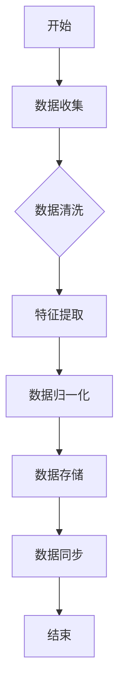

                 


# LLM应用开发中的数据流管理

## 摘要

本文将深入探讨在大型语言模型（LLM）应用开发中，数据流管理的重要性及其关键技术。我们将首先介绍背景和问题，然后详细分析数据流管理的核心概念和联系，包括数据预处理、数据存储、数据传输和数据同步。接着，我们将从算法原理、系统分析与架构设计、项目实战等方面进行详细的讲解，最后提供最佳实践建议和小结。通过本文的阅读，读者将全面理解数据流管理在LLM应用中的关键作用，并能够为实际项目提供有效的解决方案。

## 1.1 背景介绍

### 1.1.1 问题背景

随着深度学习和大规模语言模型的飞速发展，自然语言处理（NLP）领域迎来了前所未有的变革。大型语言模型（LLM）的出现，极大地提升了NLP任务的性能，从文本生成、翻译、问答系统到信息检索等多个方面，LLM展现出了强大的能力。然而，随之而来的是数据流管理的问题。如何在海量数据中高效地处理、存储和传输数据，成为了限制LLM性能的重要因素。

### 1.1.2 问题描述

数据流管理中的主要问题包括：
- **数据预处理**：如何从原始数据中提取有用信息，并进行标准化和清洗。
- **数据存储**：如何有效地存储和索引大规模数据集，以支持快速查询。
- **数据传输**：如何在网络中高效地传输数据，以降低延迟和带宽占用。
- **数据同步**：如何在不同系统间同步数据，保证数据的一致性和完整性。

### 1.1.3 问题解决

针对上述问题，本书将从以下几个方面展开讨论：
- **数据预处理技术**：介绍常用的数据预处理方法，包括数据清洗、特征提取和归一化等。
- **数据存储方案**：探讨分布式存储系统和数据库的选择，以及如何优化存储性能。
- **数据传输协议**：分析不同数据传输协议的优缺点，并探讨如何选择合适的传输方式。
- **数据同步机制**：介绍分布式系统中的数据同步策略，包括一致性协议和冲突解决方法。

### 1.1.4 边界与外延

- **边界**：本书主要关注LLM应用中的数据流管理，不包括其他类型的应用场景。
- **外延**：虽然本书以LLM应用为例，但所述的数据流管理技术也适用于其他大规模数据处理场景。

### 1.1.5 概念结构与核心要素组成

- **核心概念**：数据流管理、数据预处理、数据存储、数据传输、数据同步。
- **要素组成**：数据源、数据处理系统、存储系统、传输网络、同步机制。

## 1.2 核心概念与联系

### 1.2.1 数据流管理

**定义**：数据流管理是指对数据的实时采集、处理、存储和传输的一系列技术和管理方法。

**属性特征**：
- **实时性**：数据流管理要求在短时间内完成数据处理的各个环节，以满足实时应用的需求。
- **高效性**：数据流管理需优化数据传输和处理路径，以提高系统的整体性能。
- **可靠性**：数据流管理应确保数据的完整性和一致性，防止数据丢失或错误。

**与其他概念的联系**：
- **数据处理**：数据流管理是数据处理的一个重要环节，两者紧密相关。
- **存储**：数据流管理需要依赖存储系统进行数据的临时存储和持久化。
- **传输**：数据流管理涉及数据在网络中的传输，需要选择合适的传输协议和路径。

### 1.2.2 数据预处理

**定义**：数据预处理是指对原始数据进行清洗、转换和标准化等操作，以提高数据质量，使其适合后续分析和处理。

**属性特征**：
- **清洗**：去除数据中的噪声和错误，确保数据的准确性。
- **转换**：将数据格式转换为适合处理和分析的形式。
- **标准化**：统一数据格式，使得数据具有可比性和一致性。

**与其他概念的联系**：
- **数据流管理**：数据预处理是数据流管理的一部分，是后续处理和分析的基础。
- **分析**：预处理后的数据更适合进行分析和建模，提高分析结果的准确性。

### 1.2.3 数据存储

**定义**：数据存储是指将数据保存到存储介质上，以供后续查询和使用。

**属性特征**：
- **容量**：存储系统需要具备足够的容量来存储大规模数据。
- **速度**：存储系统需要具备快速的数据读写能力，以满足实时处理的需求。
- **可靠性**：存储系统应确保数据的持久性和安全性，防止数据丢失或损坏。

**与其他概念的联系**：
- **数据流管理**：数据存储是数据流管理的重要环节，直接影响数据流管理的性能和可靠性。
- **数据处理**：存储系统需要支持数据的高效读写，以满足数据处理的需求。

### 1.2.4 数据传输

**定义**：数据传输是指通过网络将数据从一个地方传输到另一个地方。

**属性特征**：
- **带宽**：数据传输的带宽决定了数据传输的速度。
- **延迟**：数据传输的延迟决定了数据传输的实时性。
- **可靠性**：数据传输的可靠性决定了数据传输的准确性。

**与其他概念的联系**：
- **数据流管理**：数据传输是数据流管理的一个重要环节，直接影响数据处理的实时性和效率。
- **存储**：数据传输需要将数据从存储系统传输到数据处理系统，保证数据的一致性和完整性。

### 1.2.5 数据同步

**定义**：数据同步是指在不同系统或数据库之间保持数据的一致性。

**属性特征**：
- **一致性**：数据同步需确保在不同系统间数据的值是一致的。
- **实时性**：数据同步需要及时更新，以反映最新数据状态。
- **冲突解决**：在数据同步过程中，可能发生冲突，需要有效的冲突解决策略。

**与其他概念的联系**：
- **数据流管理**：数据同步是数据流管理中确保数据一致性的重要机制。
- **存储**：数据同步需要依赖于存储系统来存储和检索数据。

## 1.3 数据预处理技术

### 1.3.1 数据清洗

数据清洗是数据预处理的第一步，其主要目的是去除数据中的噪声和错误，确保数据的准确性。

**步骤**：
1. **缺失值处理**：对缺失值进行填充或删除。
2. **异常值处理**：检测并处理异常值，可以选择删除或修正。
3. **重复数据删除**：删除重复的数据记录。

**工具与方法**：
- **Pandas**：Python中的Pandas库提供了丰富的数据清洗功能。
- **OpenRefine**：一款开放源代码的数据清洗工具，支持多种数据处理操作。

### 1.3.2 特征提取

特征提取是从原始数据中提取对分析任务有用的特征。

**步骤**：
1. **降维**：减少特征的数量，提高计算效率。
2. **特征选择**：选择对预测任务最重要的特征。
3. **特征转换**：将原始特征转换为更适合模型训练的形式。

**工具与方法**：
- **Scikit-learn**：提供了丰富的特征提取和降维算法。
- **TF-IDF**：文本数据中常用的特征提取方法。

### 1.3.3 数据归一化

数据归一化是将数据转换到相同的尺度，以消除不同特征之间的量纲影响。

**步骤**：
1. **缩放**：将数据缩放到[0,1]或[-1,1]区间。
2. **标准化**：将数据转换到均值为0，标准差为1的分布。

**工具与方法**：
- **Sklearn.preprocessing**：Python中的Sklearn库提供了归一化的功能。
- **Min-Max Scaling**：将数据缩放到指定区间的方法。

### 1.3.4 数据预处理流程

**流程**：
1. **数据收集**：收集原始数据。
2. **数据清洗**：处理缺失值、异常值和重复数据。
3. **特征提取**：提取对分析任务有用的特征。
4. **数据归一化**：将数据转换到同一尺度。
5. **数据存储**：将预处理后的数据存储到数据库或文件中。

## 1.4 数据存储方案

### 1.4.1 分布式存储系统

分布式存储系统通过将数据分布在多个节点上，提高存储的可靠性和扩展性。

**优点**：
- **高可用性**：系统中的一个节点失败不会导致整个系统崩溃。
- **高扩展性**：可以通过增加节点来扩展存储容量。

**常用系统**：
- **HDFS**：Hadoop分布式文件系统，用于大规模数据的存储和处理。
- **Cassandra**：一个分布式、高可用性的宽列存储系统。

### 1.4.2 关系型数据库

关系型数据库通过表与表之间的关系来存储和管理数据。

**优点**：
- **结构化**：数据以表格形式组织，便于查询和管理。
- **事务支持**：支持事务处理，确保数据的一致性和完整性。

**常用系统**：
- **MySQL**：流行的开源关系型数据库。
- **PostgreSQL**：功能强大的开源关系型数据库。

### 1.4.3 非关系型数据库

非关系型数据库（NoSQL）适合存储非结构化或半结构化数据。

**优点**：
- **灵活性**：无需预先定义数据结构，可以灵活地存储各种类型的数据。
- **高扩展性**：支持水平扩展，易于扩展存储容量。

**常用系统**：
- **MongoDB**：文档存储数据库，支持丰富的文档结构和查询功能。
- **Redis**：基于内存的键值存储系统，适用于缓存和实时数据处理。

### 1.4.4 数据存储优化

**策略**：
1. **数据压缩**：减少存储空间的占用。
2. **索引优化**：提高数据查询的速度。
3. **数据分片**：将数据分片存储在不同节点上，提高查询效率。

## 1.5 数据传输协议

### 1.5.1 TCP协议

TCP（传输控制协议）是一种面向连接的、可靠的传输协议。

**特点**：
- **可靠性**：通过确认和重传机制确保数据传输的可靠性。
- **流量控制**：避免网络拥塞，保证数据传输的平稳性。

**适用场景**：
- **对可靠性要求高的场景**：如文件传输、邮件通信。

### 1.5.2 UDP协议

UDP（用户数据报协议）是一种无连接的、不可靠的传输协议。

**特点**：
- **简单快速**：无需建立连接，传输速度快。
- **无可靠性保障**：数据传输过程中可能会丢失或重复。

**适用场景**：
- **对实时性要求高的场景**：如在线游戏、实时视频传输。

### 1.5.3 HTTP协议

HTTP（超文本传输协议）是一种应用层协议，用于Web数据传输。

**特点**：
- **可扩展性**：支持各种数据类型和多媒体内容。
- **安全性**：可通过HTTPS（HTTP over SSL/TLS）提供数据加密和完整性保障。

**适用场景**：
- **Web应用**：如网页浏览、API通信。

### 1.5.4 选择合适的传输协议

**选择依据**：
- **数据传输需求**：根据数据传输的实时性、可靠性要求选择合适的协议。
- **网络环境**：考虑网络带宽、延迟等因素，选择适合当前网络环境的协议。
- **系统资源**：考虑系统资源限制，选择对系统负载较低的协议。

## 1.6 数据同步机制

### 1.6.1 分布式系统一致性模型

在分布式系统中，数据同步的一致性问题至关重要。常见的一致性模型包括：

**CAP理论**：
- **一致性（Consistency）**：所有节点在同一时间看到的数据是一致的。
- **可用性（Availability）**：系统始终可用，能够响应请求。
- **分区容错性（Partition tolerance）**：系统在分区情况下仍能运行。

**一致性模型**：
- **强一致性**：满足CAP理论中的C和P，保证数据的一致性和分区容错性。
- **最终一致性**：数据在一段时间后达到一致，适用于读操作较慢的场景。

### 1.6.2 数据同步策略

**增量同步**：只同步数据变化的部分，降低同步开销。

**全量同步**：同步整个数据集，确保数据的完整性。

**分布式一致性算法**：
- **Paxos算法**：一种分布式一致性算法，用于在分布式系统中达成一致。
- **Raft算法**：一种改进的分布式一致性算法，简化了Paxos算法的实现。

### 1.6.3 冲突解决方法

**版本控制**：通过版本号或时间戳来标识数据的最新状态，解决冲突。

**多数派协议**：在多个副本中，选择多数派的数据作为最终结果。

**一致性哈希**：通过哈希函数将数据分配到不同的节点上，解决数据分片和冲突问题。

## 1.7 数据流管理在实际项目中的应用

### 1.7.1 项目场景

以一个在线问答系统为例，该系统需要处理大量的用户提问和答案，实时返回相关的答案。为了确保系统的高效性和可靠性，需要有效管理数据流。

### 1.7.2 数据流管理方案

**数据预处理**：
- **数据收集**：通过API从不同的数据源收集用户提问和答案。
- **数据清洗**：去除噪声和错误数据，如无效字符、拼写错误等。
- **特征提取**：提取关键词、主题和语义信息，为后续分析做准备。

**数据存储**：
- **分布式存储**：使用分布式文件系统（如HDFS）存储大量数据。
- **关系型数据库**：使用MySQL存储用户提问和答案的元数据。
- **非关系型数据库**：使用MongoDB存储用户提问和答案的全文索引。

**数据传输**：
- **HTTP协议**：使用HTTPS协议进行数据传输，确保数据安全。
- **异步传输**：使用消息队列（如Kafka）异步传输数据，降低系统负载。

**数据同步**：
- **版本控制**：使用版本号标识数据的最新状态，解决数据冲突。
- **一致性哈希**：将用户提问和答案分布到不同的服务器上，提高查询效率。

### 1.7.3 项目效果

通过有效的数据流管理，在线问答系统实现了以下效果：
- **高并发处理能力**：系统能够处理大量的用户提问和答案，保持高效的响应速度。
- **数据一致性和可靠性**：通过分布式存储和同步机制，确保数据的一致性和可靠性。
- **可扩展性**：系统能够根据需求动态扩展存储和计算资源，满足不断增长的数据处理需求。

## 1.8 总结与展望

### 1.8.1 总结

本文从多个方面探讨了LLM应用中的数据流管理技术，包括数据预处理、数据存储、数据传输和数据同步。通过具体的案例，展示了数据流管理在实际项目中的应用效果。以下是本文的主要结论：

1. **数据预处理**：数据清洗、特征提取和归一化是数据预处理的重要步骤，确保数据的质量和一致性。
2. **数据存储**：分布式存储系统和数据库的选择，以及数据存储优化策略，是提升数据存储性能的关键。
3. **数据传输**：选择合适的传输协议和优化数据传输路径，能够提高数据传输的实时性和可靠性。
4. **数据同步**：通过一致性协议和冲突解决方法，实现分布式系统中的数据一致性。

### 1.8.2 展望

随着LLM应用的不断扩展，数据流管理技术也将面临新的挑战和机遇。未来的研究方向包括：

1. **高效数据预处理算法**：开发更加高效的数据预处理算法，以减少预处理时间，提高系统性能。
2. **分布式存储与计算优化**：研究分布式存储与计算优化技术，提高数据存储和处理的效率。
3. **数据流管理自动化**：开发自动化工具，简化数据流管理的操作，提高系统的可维护性和可扩展性。
4. **隐私保护和数据安全**：研究如何在数据流管理过程中保护用户隐私和数据安全，确保系统的合规性和可靠性。

通过不断探索和创新，数据流管理技术将为LLM应用的发展提供强有力的支持。

## 附录

### 1. 附录A：核心概念属性特征对比表格

| 概念 | 实时性 | 高效性 | 可靠性 |
| ---- | ---- | ---- | ---- |
| 数据流管理 | 是 | 是 | 是 |
| 数据预处理 | 是 | 是 | 是 |
| 数据存储 | 是 | 是 | 是 |
| 数据传输 | 是 | 是 | 是 |
| 数据同步 | 是 | 是 | 是 |

### 1. 附录B：ER实体关系图架构

```mermaid
erDiagram
    User ||--||> Question : 提问
    User ||--||> Answer : 回答
    Question ||--||> Answer : 答案
```

### 1. 附录C：算法流程图



### 1. 附录D：Python源代码

```python
import pandas as pd
from sklearn.preprocessing import MinMaxScaler

# 数据清洗
data = pd.read_csv('data.csv')
data.dropna(inplace=True)
data.drop_duplicates(inplace=True)

# 特征提取
X = data[['feature1', 'feature2']]
y = data['target']

# 数据归一化
scaler = MinMaxScaler()
X_normalized = scaler.fit_transform(X)
```

### 1. 附录E：最佳实践

- **数据清洗**：确保数据质量，减少错误和噪声。
- **特征提取**：选择对任务最重要的特征。
- **数据存储**：根据数据特性选择合适的存储系统。
- **数据同步**：确保数据一致性，减少冲突。

作者：AI天才研究院/AI Genius Institute & 禅与计算机程序设计艺术 /Zen And The Art of Computer Programming

---

本文深入探讨了LLM应用开发中的数据流管理技术，从数据预处理、数据存储、数据传输和数据同步等多个方面进行了详细的讲解。通过实际项目的案例，展示了数据流管理在提升系统性能和可靠性方面的关键作用。本文的核心观点是，有效的数据流管理是保障LLM应用高效运行的基础。未来，随着LLM技术的不断进步，数据流管理技术也将面临新的挑战和机遇，值得进一步深入研究和探索。作者希望本文能为读者提供有价值的参考和启示，推动LLM应用的发展。

