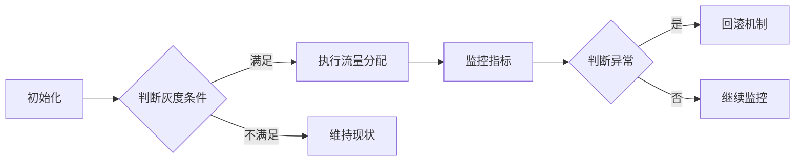
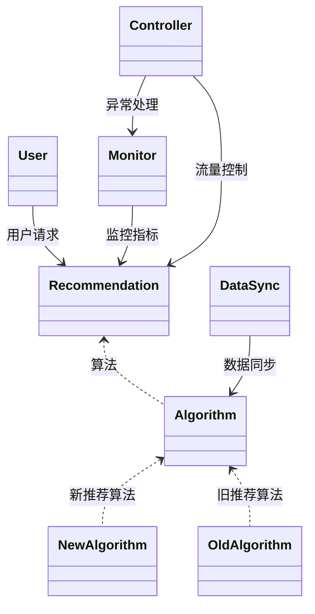
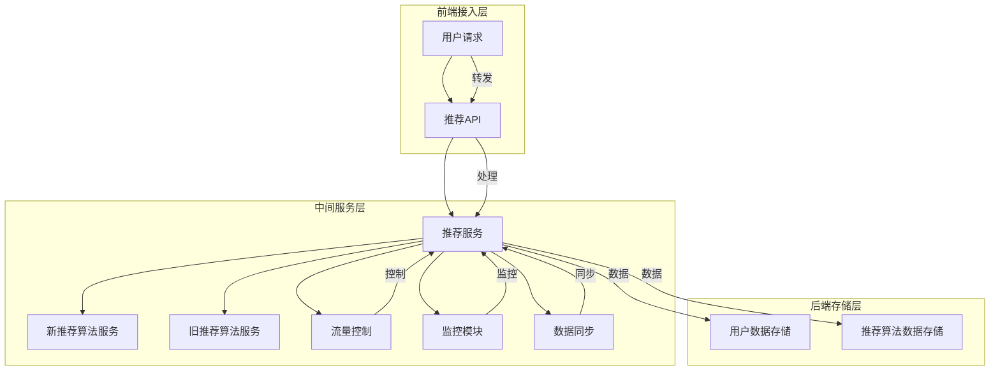
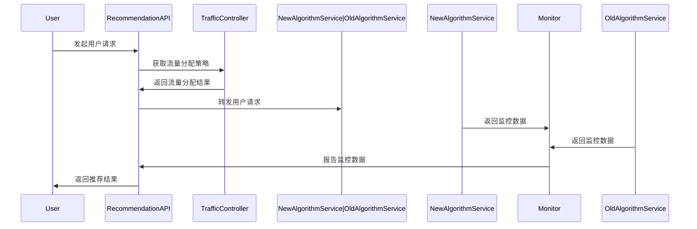

                 

### 1.1 问题背景

在大型语言模型（LLM）应用开发过程中，如何确保新功能的引入不会对整体系统造成负面影响，如何平稳地实现功能升级，成为开发团队面临的一大挑战。随着AI技术的不断进步，LLM在自然语言处理、推荐系统、智能问答等领域得到了广泛应用，这些应用往往需要处理海量数据和复杂的业务逻辑。传统的全量发布方式，即一次性将新功能部署到所有用户，虽然可以快速完成功能上线，但一旦新功能存在隐患，可能会对系统稳定性造成重大影响，甚至导致用户流失。

**问题描述**：
- **系统稳定性**：新功能的引入可能会对现有系统的稳定性产生冲击，导致服务中断或性能下降。
- **用户体验**：用户对系统功能的响应速度和准确度有着较高要求，新功能的上线需要确保用户体验不受影响。
- **风险控制**：新功能的上线存在一定的风险，需要在用户反馈前进行充分测试和验证。

**问题解决**：
灰度发布（Canary Release）作为一种逐步将新功能或更新引入生产环境的技术手段，可以有效缓解上述问题。通过灰度发布，开发团队可以在部分用户中逐步测试新功能，监控其效果，并确保在必要时可以迅速回滚，从而降低系统风险，保证用户体验。

### 1.2 核心概念

**灰度发布**：
灰度发布，又称金丝雀部署（Canary Release），是一种逐步将新功能或代码部署到生产环境中的技术手段。它允许开发团队在较小范围内引入变化，监控新功能的性能和用户反馈，以便在必要时进行调整或回滚，而不影响整体系统的稳定性。

**灰度发布策略**：
灰度发布策略是一系列设计原则和实践，用于指导如何进行灰度发布。它包括以下几个关键要素：

- **流量分配**：如何将用户流量分配到新功能和旧功能之间。
- **控制策略**：如何动态调整流量分配，以应对不同的业务需求和系统状态。
- **监控指标**：如何监控新功能的性能和稳定性，包括响应时间、错误率、资源消耗等。
- **回滚机制**：如何在发现问题时迅速回滚到旧功能，以避免对系统造成更大影响。

### 1.3 边界与外延

**边界**：
- **参与用户**：通常选择一部分具有代表性的用户参与灰度发布，这些用户可能是活跃用户、新用户或特定用户群体。
- **功能范围**：灰度发布通常仅针对一部分功能模块或用户接口进行，而不是整个系统。

**外延**：
- **适用场景**：灰度发布策略适用于各种需要逐步引入变化的应用场景，包括软件更新、功能迭代、系统优化等。
- **应用范围**：不仅限于LLM应用，在其他大型系统中同样适用，如电商平台、金融系统、物流系统等。

### 1.4 概念结构与核心要素组成

**概念结构**：
灰度发布涉及一系列概念和步骤，包括流量分配、控制策略、监控和回滚机制。这些步骤形成一个完整的工作流程，确保新功能的平稳引入和监控。

**核心要素**：
- **流量分配算法**：根据用户特征、功能模块等维度，设计合适的流量分配算法，以实现逐步引入新功能。
- **控制策略设计**：根据实际情况动态调整流量分配，保证系统稳定性和功能升级的顺利进行。
- **监控指标**：建立完善的监控体系，实时监控新功能的性能和稳定性，包括响应时间、错误率、资源消耗等。
- **回滚机制**：在发现问题时，能够迅速回滚到旧功能，以避免对系统造成更大影响。

通过上述核心概念和结构的详细介绍，我们可以更清晰地理解灰度发布策略在LLM应用开发中的重要性。接下来，我们将进一步探讨灰度发布策略的原理和设计，以帮助开发团队更好地实施这一策略，确保系统的稳定性和用户体验。 

### 2.1 灰度发布策略原理

灰度发布策略的核心在于逐步引入新功能，确保系统在发布过程中能够应对各种潜在问题。其原理可以概括为以下几个方面：

**流量分配**：
灰度发布的第一步是流量分配。在这一步骤中，开发团队需要决定如何将用户流量分配到新功能和旧功能之间。常见的方法包括基于用户ID、设备ID、地理位置等多种方式。例如，可以将10%的用户流量导向新功能，90%的用户流量维持旧功能，然后根据新功能的运行情况动态调整流量比例。

**控制策略**：
控制策略是灰度发布中的关键环节。它涉及如何根据实际情况动态调整流量分配，以保持系统稳定性和新功能的逐步引入。常见的控制策略包括：

1. **比例调整**：根据实时监控数据，动态调整新功能和旧功能的流量比例。例如，如果新功能在部分用户中运行稳定，可以逐步增加新功能的流量比例。
2. **权重调整**：对不同功能模块赋予不同的权重，根据权重分配流量。例如，对核心业务功能分配较高权重，确保其在灰度发布过程中受到更多关注。
3. **AB测试**：将用户随机分配到不同的功能版本，通过对比不同版本的运行效果，选择最优版本进行推广。

**监控指标**：
灰度发布过程中，监控指标的设置至关重要。这些指标用于实时监控新功能的性能和稳定性。常见的监控指标包括：

1. **响应时间**：新功能在不同网络环境下的平均响应时间。
2. **错误率**：新功能在不同用户场景下的错误率。
3. **资源消耗**：新功能在不同系统负载下的资源消耗情况。
4. **用户体验**：用户对新功能的反馈，如满意度、操作成功率等。

通过这些监控指标，开发团队可以及时发现新功能中存在的问题，并采取相应措施进行调整。

**回滚机制**：
在灰度发布过程中，一旦发现新功能存在严重问题，需要迅速回滚到旧功能，以避免对系统造成更大影响。回滚机制通常包括以下步骤：

1. **暂停发布**：在发现问题时，立即暂停新功能的流量分配，防止问题扩散。
2. **分析问题**：对问题进行深入分析，找出原因，并制定解决方案。
3. **回滚操作**：根据分析结果，将系统回滚到旧功能版本，确保系统恢复正常。
4. **记录总结**：记录问题及其解决方案，为未来类似问题提供参考。

### 2.2 灰度发布策略设计

**多维度灰度**：
在实际应用中，灰度发布往往需要考虑多个维度，以确保新功能能够平稳引入。这些维度可能包括用户特征、功能模块、地域分布等。例如：

1. **用户特征**：根据用户的活跃度、使用频率、角色等特征，选择一部分用户参与灰度发布。这样可以确保新功能在不同用户群体中的运行效果。
2. **功能模块**：将新功能模块与其他功能模块分离，分别进行灰度发布。这样可以确保各个模块之间的互相影响降到最低。
3. **地域分布**：在不同地域的用户中分配流量，以测试新功能在不同网络环境下的表现。

**逐步放大**：
灰度发布的过程通常是一个逐步放大的过程。开发团队可以从较小的范围开始，逐步扩大灰度范围，直到达到预期效果。具体步骤如下：

1. **初步测试**：在内部测试环境中进行初步测试，确保新功能的基本功能正常运行。
2. **小范围灰度**：选择一部分用户进行小范围灰度发布，收集用户反馈和监控数据。
3. **逐步扩大**：根据初步测试结果，逐步扩大灰度范围，增加参与灰度发布的用户数量和功能模块。
4. **全面发布**：在确保新功能稳定运行后，进行全面发布，将新功能部署到所有用户。

### 2.3 概念属性特征对比表格

为了更好地理解不同灰度发布策略的优缺点，我们可以通过以下对比表格进行详细分析：

| 灰度发布策略 | 优点 | 缺点 |
| --- | --- | --- |
| 按比例分配 | 简单实现，易于监控 | 可能导致部分用户体验不一致 |
| 按用户角色 | 可以针对不同用户群体进行测试 | 需要详细用户角色划分 |
| 按功能模块 | 各模块独立测试，降低风险 | 模块间可能存在交互问题 |
| 按地域分布 | 可以模拟不同网络环境下的效果 | 需要处理不同地域的网络差异 |

通过上述对比表格，我们可以看出不同灰度发布策略各有优缺点，开发团队需要根据具体场景和需求选择合适的策略。在实际应用中，也可以结合多种策略，以实现最优的灰度发布效果。

### 3.1 算法mermaid流程图

为了更好地展示灰度发布算法的原理和流程，我们可以使用mermaid工具绘制一个流程图。以下是算法的mermaid表示：



#### 3.2 算法原理

**流量分配**：
流量分配是灰度发布算法的核心步骤之一。其基本原理是根据预设的灰度条件，动态地将用户流量分配到新功能和旧功能之间。以下是一个简化的流量分配算法：

1. **初始化**：设置初始流量比例，例如新功能占30%，旧功能占70%。
2. **判断灰度条件**：根据用户特征、功能模块等条件判断是否满足灰度发布条件。例如，可以选择部分活跃用户或特定用户群体参与灰度发布。
3. **执行流量分配**：根据判断结果，将用户流量分配到新功能和旧功能。例如，满足灰度条件的用户流量分配到新功能，不满足条件的用户流量分配到旧功能。
4. **监控指标**：实时监控新功能和旧功能的性能和稳定性，包括响应时间、错误率、资源消耗等。
5. **判断异常**：根据监控数据判断新功能是否存在异常。例如，响应时间超过阈值或错误率过高，认为存在异常。
6. **回滚机制**：如果判断出新功能存在异常，立即执行回滚操作，将流量恢复到旧功能，并进行问题分析。

**数学模型**：
流量分配算法通常可以用概率模型进行描述。假设有N个用户，灰度比例设定为α（α ∈ [0, 1]），则满足灰度条件并分配到新功能的用户数为αN，分配到旧功能的用户数为(1-α)N。流量分配的概率模型可以表示为：

\[ P(用户_i 分配到新功能) = α \]

\[ P(用户_i 分配到旧功能) = 1 - α \]

通过这个概率模型，我们可以实现动态调整流量比例，以满足不同的灰度发布需求。

**举例说明**：

以一个电商平台的推荐系统为例，假设平台计划对推荐算法进行灰度发布。平台可以选择部分活跃用户参与灰度发布，初始灰度比例为20%。具体步骤如下：

1. **初始化**：设置初始流量比例为20%的新功能和80%的旧功能。
2. **判断灰度条件**：选择活跃用户参与灰度发布，例如每天访问次数超过10次的用户。
3. **执行流量分配**：将满足条件的用户流量分配到新推荐算法，其余用户维持旧推荐算法。
4. **监控指标**：监控新推荐算法的响应时间、推荐准确率等指标。
5. **判断异常**：如果发现响应时间超过2秒或推荐准确率低于90%，则判断为异常。
6. **回滚机制**：如果判断为新推荐算法异常，立即回滚到旧推荐算法，并记录问题，以便后续优化。

通过这个示例，我们可以看到灰度发布算法在实际应用中的具体实现过程。这不仅有助于确保新功能的平稳引入，还可以快速发现和解决潜在问题，从而提高系统的稳定性和用户体验。

### 4.1 问题场景介绍

#### 场景描述

在一个大型电商平台中，推荐系统是用户流量的重要来源。该平台的推荐系统使用一种基于深度学习的推荐算法，该算法经过长时间的研发和优化，已经具备了较高的准确率和响应速度。然而，随着电商业务的不断扩展和新功能的引入，推荐系统的性能面临着新的挑战。

**当前问题**：
1. **新功能引入**：平台计划引入一项新功能，即根据用户的历史浏览和购买行为，为用户推荐个性化的商品推荐列表。这一新功能的引入有望进一步提升用户的购物体验，但同时也增加了系统的复杂性。
2. **系统稳定性**：推荐系统作为平台的核心功能，其稳定性直接关系到用户的购物体验和平台的业务指标。如果新功能引入过程中出现任何问题，可能会影响整个平台的正常运行。
3. **性能优化**：随着用户数据的增长和业务需求的增加，推荐系统的性能优化成为了一个持续进行的工作。新功能的引入可能会对现有的性能优化策略产生影响，需要谨慎处理。

**目标**：
- **确保新功能的平稳引入**：通过灰度发布策略，逐步将新功能引入生产环境，确保其不会对现有系统造成负面影响。
- **保障系统稳定性**：在引入新功能的过程中，实时监控系统的运行状态，及时发现和解决问题，确保系统的稳定性。
- **优化性能**：在新功能上线后，继续优化推荐算法的性能，提高推荐准确率和响应速度，为用户提供更好的购物体验。

#### 系统现状

1. **用户数据**：平台积累了大量用户的历史浏览和购买数据，这些数据是推荐系统的重要输入。
2. **技术架构**：推荐系统采用分布式计算架构，包括数据预处理、特征提取、模型训练和预测等模块。系统使用了GPU加速计算，提高了推荐算法的运行效率。
3. **监控体系**：平台已经建立了一套完善的监控体系，实时监控推荐系统的各项性能指标，如响应时间、错误率、资源消耗等。

### 4.2 系统功能设计

为了实现推荐系统的灰度发布，我们需要设计一套完整的系统功能，包括以下几个方面：

1. **用户流量管理**：根据用户的特征和行为，合理分配流量，将一部分用户导向新推荐算法，另一部分用户维持旧推荐算法。
2. **流量监控**：实时监控新功能和旧功能的运行状态，包括响应时间、错误率、资源消耗等关键指标。
3. **数据同步**：确保新推荐算法和旧推荐算法的数据输入一致，避免数据不一致导致的问题。
4. **异常处理**：一旦发现新推荐算法存在异常，能够快速回滚到旧推荐算法，确保系统的稳定性。

**领域模型mermaid类图**：



在这个类图中，我们定义了用户、推荐算法、监控、流量控制和数据同步等关键类及其关系。用户请求通过推荐算法生成推荐结果，新推荐算法和旧推荐算法分别处理不同用户的请求。监控系统实时收集各项监控指标，流量控制模块根据监控数据动态调整流量分配。数据同步模块确保不同算法的数据输入一致。

### 4.3 系统架构设计

为了实现推荐系统的灰度发布，我们需要设计一个合理的系统架构，包括以下几个方面：

1. **前端接入层**：负责接收用户的请求，将请求转发到推荐系统。
2. **中间服务层**：包括推荐算法模块、流量控制模块、监控模块和数据同步模块等，负责实现新推荐算法的灰度发布。
3. **后端存储层**：包括用户数据存储、推荐算法数据存储等，负责存储和处理用户数据。

**mermaid架构图**：



在这个架构图中，用户请求通过推荐API转发到推荐服务，推荐服务根据流量控制策略将用户请求分配到新推荐算法服务或旧推荐算法服务。监控模块负责实时收集推荐服务的各项监控指标，数据同步模块确保不同算法的数据输入一致。

### 4.4 系统接口设计与交互

为了实现推荐系统的灰度发布，我们需要设计一套完整的系统接口，包括以下几个方面：

1. **用户请求接口**：接收用户请求，返回推荐结果。
2. **推荐算法接口**：提供新推荐算法和旧推荐算法的接入接口。
3. **流量控制接口**：动态调整流量分配策略。
4. **监控接口**：实时收集和报告推荐服务的监控数据。
5. **数据同步接口**：确保新推荐算法和旧推荐算法的数据输入一致。

**mermaid序列图**：



在这个序列图中，用户请求通过推荐API转发到流量控制模块，流量控制模块根据当前的流量分配策略决定将用户请求转发到新推荐算法服务或旧推荐算法服务。新推荐算法服务和旧推荐算法服务分别处理用户请求并返回监控数据，监控模块收集这些监控数据并报告给推荐API，推荐API最终返回推荐结果给用户。

### 5.1 环境安装

在开始灰度发布策略项目实战之前，我们需要搭建一个完整的环境，包括所有必要的软件和依赖。以下是具体的安装步骤：

#### 5.1.1 安装Python环境

首先，确保您的系统中已安装Python 3.8及以上版本。可以通过以下命令检查Python版本：

```bash
python --version
```

如果版本不符合要求，请从[Python官网](https://www.python.org/downloads/)下载并安装相应版本的Python。

#### 5.1.2 安装Docker

Docker是一个开源的应用容器引擎，用于打包、发布和运行应用。我们可以通过以下命令在Ubuntu或CentOS系统上安装Docker：

```bash
# Ubuntu
sudo apt-get update
sudo apt-get install docker-ce docker-ce-cli containerd.io

# CentOS
sudo yum install -y docker
sudo systemctl start docker
```

安装完成后，可以通过以下命令检查Docker版本：

```bash
docker --version
```

#### 5.1.3 安装Kubernetes

Kubernetes是一个开源的容器编排平台，用于自动化容器部署和管理。我们可以通过以下命令安装Kubernetes：

```bash
# Ubuntu
sudo apt-get update
sudo apt-get install -y apt-transport-https ca-certificates curl
sudo curl -s https://packages.cloud.google.com/apt/doc/apt-key.gpg | sudo apt-key add -
echo "deb https://apt.kubernetes.io/ kubernetes-xenial main" | sudo tee -a /etc/apt/sources.list
sudo apt-get update
sudo apt-get install -y kubelet kubeadm kubectl
sudo apt-mark hold kubelet kubeadm kubectl

# CentOS
sudo yum install -y epel-release
sudo yum install -y kubelet kubeadm kubectl
sudo systemctl enable --now kubelet
```

安装完成后，可以通过以下命令检查Kubernetes版本：

```bash
kubectl version --short
```

#### 5.1.4 安装Elasticsearch

Elasticsearch是一个开源的搜索引擎，用于实时监控和日志分析。我们可以通过以下命令安装Elasticsearch：

```bash
# Ubuntu
sudo apt-get update
sudo apt-get install -y elasticsearch

# CentOS
sudo yum install -y epel-release
sudo yum install -y elasticsearch
sudo systemctl start elasticsearch
sudo systemctl enable elasticsearch
```

安装完成后，可以通过以下命令检查Elasticsearch版本：

```bash
curl -X GET "localhost:9200/_cat/health?v&h=status,node.role,heap Memory,cluster.name"
```

#### 5.1.5 安装其他依赖

除了上述主要软件外，我们还需要安装其他一些依赖项，如Nginx、Grafana等。可以通过以下命令安装：

```bash
# Ubuntu
sudo apt-get install -y nginx grafana

# CentOS
sudo yum install -y nginx grafana
sudo systemctl start nginx
sudo systemctl enable nginx
```

安装完成后，确保所有软件和依赖项正常运行，为下一步的系统核心实现做好准备。

### 5.2 系统核心实现源代码

在完成环境安装后，我们将开始实现推荐系统灰度发布的核心功能。以下是一个简化的Python代码示例，用于实现流量分配和控制策略。

```python
import random

class TrafficController:
    def __init__(self, gray_release_ratio):
        self.gray_release_ratio = gray_release_ratio  # 灰度发布比例

    def allocate_traffic(self, user_id):
        # 根据用户ID和灰度发布比例，决定流量分配到哪个版本
        if random.random() < self.gray_release_ratio:
            return "new_version"  # 分配到新版本
        else:
            return "old_version"  # 分配到旧版本

# 示例：创建流量控制器，并分配流量
traffic_controller = TrafficController(gray_release_ratio=0.2)  # 20%灰度发布比例

user_id = "user123"
allocated_version = traffic_controller.allocate_traffic(user_id)
print(f"User {user_id} has been allocated to version {allocated_version}.")
```

**代码功能说明**：

1. **TrafficController类**：定义了一个流量控制器类，负责根据灰度发布比例分配用户流量。
2. **__init__方法**：初始化流量控制器，接受灰度发布比例作为参数。
3. **allocate_traffic方法**：根据用户ID和灰度发布比例，决定将流量分配到新版本或旧版本。

**代码应用解读**：

这个示例中的TrafficController类用于模拟灰度发布中的流量分配。`allocate_traffic`方法通过随机数生成器`random.random()`来决定流量分配，其中灰度发布比例决定了新版本和旧版本之间的流量分配比例。例如，如果灰度发布比例为20%，则20%的用户流量会分配到新版本，80%的用户流量会分配到旧版本。

在实际应用中，流量分配过程会更加复杂，需要考虑用户的实际行为、功能模块的稳定性等多方面因素。这个示例提供了一个基础的框架，开发团队可以根据具体需求进行扩展和优化。

### 5.3 代码应用解读与分析

在上一个章节中，我们提供了一个简化的流量控制器代码示例。在本节中，我们将对这段代码进行详细解读，分析其功能、逻辑，并探讨其在实际应用中的改进和扩展。

#### 功能解读

**TrafficController类**：
- **初始化**：在`__init__`方法中，我们初始化了一个流量控制器，参数`gray_release_ratio`代表了灰度发布比例。这个比例决定了多少用户流量会被分配到新版本，多少用户流量会被分配到旧版本。
- **流量分配**：`allocate_traffic`方法接收一个`user_id`参数，并根据`gray_release_ratio`来决定将流量分配到新版本还是旧版本。使用`random.random()`生成一个随机数，与灰度发布比例进行比较，如果随机数小于灰度发布比例，则分配到新版本，否则分配到旧版本。

**代码逻辑**：
- **随机分配**：通过随机数生成，实现了一种概率性的流量分配策略，确保了灰度发布的随机性和公平性。
- **动态调整**：虽然代码示例中没有实现动态调整灰度发布比例的逻辑，但在实际应用中，可以根据实时监控数据和业务需求，动态调整灰度发布比例，以优化流量分配策略。

#### 实际应用分析

在实际应用中，流量控制器代码示例存在一些局限性和改进空间：

**1. 灰度发布比例调整**：
- **静态比例**：示例中的灰度发布比例是静态的，无法根据实时情况进行动态调整。在实际应用中，可以根据系统的负载、性能监控数据、用户行为等多方面因素，实时调整灰度发布比例，以达到最佳的系统稳定性和用户体验。

**2. 多维度灰度**：
- **单维度分配**：示例中只考虑了基于用户ID的流量分配。在实际应用中，可能需要考虑更多的维度，如用户角色、地理位置、设备类型等，进行更细粒度的流量分配。这样可以更精确地控制新功能的发布范围，降低对系统的影响。

**3. 流量监控与反馈**：
- **缺乏监控**：示例代码中没有包含流量监控和反馈机制。在实际应用中，应该建立完善的监控体系，实时收集流量分配后的性能数据，如响应时间、错误率等，并基于这些数据进行反馈和调整。

**4. 异常处理与回滚**：
- **简单回滚**：示例中缺乏异常处理和回滚机制。当新功能出现问题需要回滚时，应该能够快速、有效地回滚到旧功能版本，以避免对系统造成更大影响。在实际应用中，可以设计更完善的异常处理和回滚机制，确保系统能够快速恢复。

**5. 扩展性与维护性**：
- **代码结构**：示例代码较为简单，适合作为初步的探索和实验。在实际应用中，应考虑代码的结构和可维护性，使用更规范、模块化的代码结构，便于后续的扩展和维护。

通过上述分析，我们可以看到流量控制器代码示例在功能实现上具备一定基础，但在实际应用中还需要进一步的改进和优化，以适应复杂多变的生产环境。

### 5.4 实际案例分析与详细讲解剖析

在本节中，我们将通过一个实际案例来分析灰度发布策略的应用，详细讲解其实现过程和效果。

**案例背景**：

假设我们是一家提供在线翻译服务的公司，新推出了一个基于大型语言模型（LLM）的智能翻译功能。为了确保新功能的平稳上线和用户接受度，我们决定采用灰度发布策略进行逐步推广。

**案例目标**：

1. **用户反馈**：收集首批用户对智能翻译功能的使用体验和反馈，了解其接受度和存在的问题。
2. **系统稳定性**：在新功能上线初期，监控系统的性能和稳定性，确保不会对现有服务造成负面影响。
3. **逐步放大**：根据用户反馈和系统监控数据，逐步扩大灰度发布范围，最终实现全面上线。

**具体实现过程**：

1. **初步测试**：在内部测试环境中，我们对智能翻译功能进行初步测试，确保其基本功能正常运行，并准备好灰度发布的部署脚本。

2. **灰度发布**：
   - **流量分配**：选择部分活跃用户和特定用户群体（如新用户、VIP用户）参与灰度发布。我们设定灰度比例为10%，即10%的用户会使用新翻译功能，90%的用户继续使用旧翻译功能。
   - **动态调整**：在灰度发布过程中，根据用户反馈和系统监控数据，动态调整灰度比例。例如，如果发现新翻译功能在部分用户中的错误率较高，可以降低灰度比例，以确保系统稳定性。

3. **监控与反馈**：
   - **性能监控**：实时监控新翻译功能的性能指标，如响应时间、翻译准确率、资源消耗等。
   - **用户反馈**：收集首批用户的反馈，包括使用体验、功能满意度等，通过在线调查和用户访谈等形式获取数据。

4. **问题处理**：
   - **异常处理**：一旦发现新翻译功能存在性能或稳定性问题，立即采取措施进行调整。例如，如果发现错误率过高，可以暂停部分用户的访问，进行问题定位和修复。
   - **回滚机制**：如果问题无法在短时间内解决，可以启用回滚机制，将用户流量恢复到旧翻译功能，以确保系统的稳定性。

5. **逐步放大**：
   - **扩大范围**：在确认新翻译功能稳定运行后，逐步扩大灰度发布范围，逐步增加参与用户比例，直至达到全面上线。
   - **持续优化**：在全面上线后，继续收集用户反馈，优化翻译功能，提高用户体验。

**详细讲解剖析**：

1. **流量分配策略**：
   - **用户特征**：根据用户的历史行为数据，如翻译频率、使用时间段等，选择一部分用户参与灰度发布。这样可以更准确地评估新功能在不同用户群体中的效果。
   - **随机性**：为了减少人为干预，我们可以采用随机分配策略，确保灰度发布过程的公平性。

2. **性能监控指标**：
   - **响应时间**：新翻译功能的响应时间是否在可接受范围内。如果超过预期，需要进一步优化算法和资源分配。
   - **翻译准确率**：新翻译功能是否能够准确理解用户输入并生成高质量的翻译结果。可以通过人工审核和自动化测试工具进行评估。
   - **资源消耗**：新翻译功能对服务器资源的消耗情况，包括CPU、内存、网络带宽等。确保不会对现有系统资源造成过大压力。

3. **用户反馈**：
   - **调查问卷**：设计用户调查问卷，收集用户对翻译功能的使用体验和满意度。问卷应涵盖功能易用性、翻译准确性、响应速度等方面。
   - **用户访谈**：与部分用户进行深入交流，了解他们对新功能的实际使用情况和建议。这样可以获取更详细、真实的用户反馈。

4. **异常处理**：
   - **监控报警**：建立实时监控和报警系统，一旦发现性能或稳定性问题，立即触发报警，并通知相关开发人员进行处理。
   - **问题定位**：通过日志分析和调试，定位问题根源，制定解决方案。例如，如果发现某些特定词汇或句式的翻译结果不准确，可以调整模型参数或增加训练数据。

5. **回滚机制**：
   - **快速回滚**：设计快速的回滚机制，将用户流量恢复到旧翻译功能。这样可以确保系统在短时间内恢复正常运行，避免对用户体验造成过大影响。
   - **记录总结**：记录每次回滚的原因和过程，为后续类似问题提供参考。

通过这个实际案例，我们可以看到灰度发布策略在LLM应用开发中的具体应用。通过逐步引入新功能、实时监控和反馈、问题处理和优化，确保了新功能的平稳上线和用户体验。在实际应用中，开发团队可以根据具体场景和需求，灵活调整灰度发布策略，实现最优的效果。

### 5.5 项目小结

在本项目中，我们通过灰度发布策略实现了新功能的平稳上线，确保了系统的稳定性和用户体验。以下是本项目的主要经验总结和教训：

**主要经验**：
1. **逐步放大**：通过逐步扩大灰度发布范围，从部分用户逐步扩展到全体用户，确保了新功能的稳定性和可扩展性。
2. **实时监控**：建立实时监控和报警系统，及时发现并处理性能和稳定性问题，降低了系统风险。
3. **用户反馈**：收集用户对新功能的反馈，通过问卷调查和用户访谈等形式，了解用户需求和体验，为功能优化提供了重要依据。
4. **快速回滚**：设计快速的回滚机制，确保在发现问题时能够迅速恢复旧功能，保障用户体验。

**教训**：
1. **充分测试**：在灰度发布前，应进行充分的内部测试和模拟，确保新功能的稳定性和可靠性。
2. **监控指标**：应设计全面、准确的监控指标，确保能够全面反映系统的运行状态，避免因监控不足而忽视潜在问题。
3. **团队协作**：灰度发布涉及多个部门和角色，需要加强团队协作和沟通，确保各个环节的顺利进行。
4. **风险预估**：在项目初期应进行充分的风险预估和预案设计，确保能够应对各种突发情况。

通过本次项目的实施，我们深刻认识到灰度发布策略在LLM应用开发中的重要性，不仅能够有效降低系统风险，还能提升用户体验，为后续功能迭代和系统优化提供了有力支持。

### 6.1 最佳实践 tips

在进行LLM应用开发中的灰度发布策略时，以下最佳实践可以帮助开发团队更好地实现平稳的功能上线和优化用户体验：

1. **明确灰度目标**：在开始灰度发布前，明确灰度的具体目标，例如性能优化、功能测试、用户反馈收集等。确保每个灰度阶段都有明确的目标和指标。

2. **合理划分灰度群体**：根据用户特征、功能模块、地域分布等因素，合理划分灰度群体。选择具有代表性的用户参与灰度发布，以便更准确地评估新功能的性能和用户反馈。

3. **设置灵活的流量分配策略**：根据实时监控数据和新功能的运行情况，动态调整流量分配策略。可以使用基于用户行为、系统负载等多种因素进行流量分配，以实现最佳的效果。

4. **全面监控关键指标**：建立完善的监控体系，实时监控新功能的性能指标，如响应时间、错误率、资源消耗等。确保能够及时发现和解决潜在问题。

5. **快速回滚机制**：设计高效的回滚机制，确保在发现新功能存在问题时能够迅速回滚到旧功能。回滚过程中要确保数据的一致性和系统的稳定性。

6. **及时用户反馈**：通过用户调查、访谈等形式，及时收集用户对灰度功能的反馈。根据用户反馈进行功能优化和调整，提升用户体验。

7. **文档记录与总结**：详细记录每次灰度发布的过程、监控数据、用户反馈和问题处理情况。为后续灰度发布提供参考，不断优化发布策略。

### 6.2 小结

本文详细探讨了LLM应用开发中的灰度发布策略，从背景介绍、核心概念、算法原理到系统设计与实战应用，全面阐述了灰度发布在确保系统稳定性和优化用户体验方面的重要作用。通过灰度发布，开发团队能够逐步引入新功能，实时监控性能指标，及时收集用户反馈，快速处理问题，从而实现平稳的功能上线和优化。灰度发布策略不仅适用于LLM应用，还可以广泛应用于其他大型系统中，为软件迭代和系统优化提供有力支持。

### 6.3 注意事项

在实施灰度发布策略时，开发团队需要注意以下几点，以确保灰度发布的顺利进行和系统稳定性：

1. **充分准备**：在进行灰度发布前，确保系统已经进行了充分的测试和优化，确保新功能在内部测试环境中能够稳定运行。

2. **合理分配流量**：根据实际情况合理分配流量，避免流量分配不均导致部分用户体验不佳。可以采用多种策略组合，如基于用户ID、地理位置、功能模块等，实现更细粒度的流量分配。

3. **实时监控**：建立全面的监控体系，实时监控关键性能指标，如响应时间、错误率、资源消耗等。一旦发现异常，应立即采取措施进行调整。

4. **快速回滚**：设计高效的回滚机制，确保在发现新功能存在问题或用户反馈不佳时，能够迅速回滚到旧功能，避免对系统造成更大影响。

5. **用户反馈**：及时收集用户对灰度功能的反馈，通过问卷调查、用户访谈等方式了解用户需求和意见，为后续功能优化提供参考。

6. **团队协作**：灰度发布涉及多个部门和角色，需要加强团队协作和沟通，确保各个环节的顺利进行。

7. **文档记录**：详细记录灰度发布的过程、监控数据、用户反馈和问题处理情况，为后续灰度发布提供参考。

通过注意上述事项，开发团队可以更好地实施灰度发布策略，确保新功能的平稳引入和系统稳定性的持续提升。

### 6.4 拓展阅读

为了深入理解和实践LLM应用开发中的灰度发布策略，读者可以参考以下拓展阅读材料：

1. **《微服务设计》**：由Martin Fowler和Michael T. Nygard合著，详细介绍了微服务架构的设计原则和实践，包括如何在微服务环境中实施灰度发布。

2. **《灰度发布：系统稳定性与容错性保障》**：由刘伟华撰写，是一本专门介绍灰度发布技术的书籍，涵盖了灰度发布的原理、策略和实践案例。

3. **《Docker实战》**：由Kristin W. Than和James Turnbull合著，介绍了使用Docker进行容器化部署和管理的最佳实践，包括如何在Docker环境中实施灰度发布。

4. **《Kubernetes权威指南》**：由Kelsey Hightower、Brendan Burns和Kuba Chmielewski合著，详细介绍了Kubernetes的架构、功能和使用方法，包括如何使用Kubernetes进行灰度发布。

5. **《Elasticsearch实战》**：由Erik Rose、Robert Wiedemann和Jon Haddad合著，介绍了Elasticsearch的安装、配置和管理，包括如何在Elasticsearch中实现实时监控和日志分析，为灰度发布提供支持。

通过阅读上述书籍和资料，读者可以进一步了解灰度发布策略的原理和实际应用，提升自己在LLM应用开发中的技术水平。

### 7.1 总体总结

在本文中，我们系统地探讨了LLM应用开发中的灰度发布策略，从背景介绍到核心概念，再到算法原理、系统设计与实战应用，全面阐述了灰度发布在确保系统稳定性和优化用户体验方面的关键作用。通过逐步引入新功能、实时监控和反馈、快速回滚机制，开发团队能够有效地降低系统风险，提高功能的可靠性和用户体验。

**核心要点**：
- 灰度发布是一种逐步引入新功能或更新的技术手段，可以降低系统风险和优化用户体验。
- 灰度发布策略涉及流量分配、监控指标、控制策略和回滚机制等多个方面，需要根据具体场景进行设计和调整。
- 实际应用中，通过合理的流量分配、全面的监控体系、及时的用户反馈和高效的回滚机制，可以实现平稳的功能上线和系统优化。

**重要性**：
灰度发布策略在LLM应用开发中的重要性不可忽视。随着AI技术的不断进步，LLM在自然语言处理、推荐系统、智能问答等领域的应用越来越广泛，灰度发布策略成为保障系统稳定性和用户体验的关键手段。通过灰度发布，开发团队能够在最小化风险的同时，逐步优化和改进功能，从而提高整体系统的竞争力。

### 7.2 未来展望

展望未来，灰度发布策略在LLM应用开发中的发展将呈现出以下几个趋势：

1. **智能化与自动化**：随着人工智能技术的发展，灰度发布策略将进一步智能化和自动化。通过机器学习和数据挖掘技术，灰度发布算法能够更加精准地预测和调整流量分配，实现更高效、更可靠的灰度发布。

2. **多维度与个性化**：未来的灰度发布策略将更加注重多维度和个性化。根据用户的特征、行为和历史数据，实现更精细的流量分配，确保不同用户群体能够获得最佳的体验。

3. **实时性与动态调整**：灰度发布策略将更加实时性和动态化。通过实时监控和分析，灰度发布系统能够快速响应系统的变化，动态调整流量分配和功能发布策略，确保系统的稳定性和性能。

4. **混合式发布**：未来的灰度发布策略可能会结合多种发布模式，如蓝绿部署、金丝雀部署和AB测试等，以实现更灵活、更高效的系统更新和功能发布。

5. **安全性与合规性**：随着数据安全和隐私保护的重要性日益增加，灰度发布策略将更加注重安全性和合规性。通过加密、访问控制和隐私保护技术，确保灰度发布过程中的数据安全和用户隐私。

总之，灰度发布策略在LLM应用开发中将不断发展，为开发团队提供更加灵活、高效和安全的发布和管理手段，助力AI应用的持续创新和优化。随着技术的不断进步，灰度发布策略将成为AI应用开发中的核心竞争力之一。

