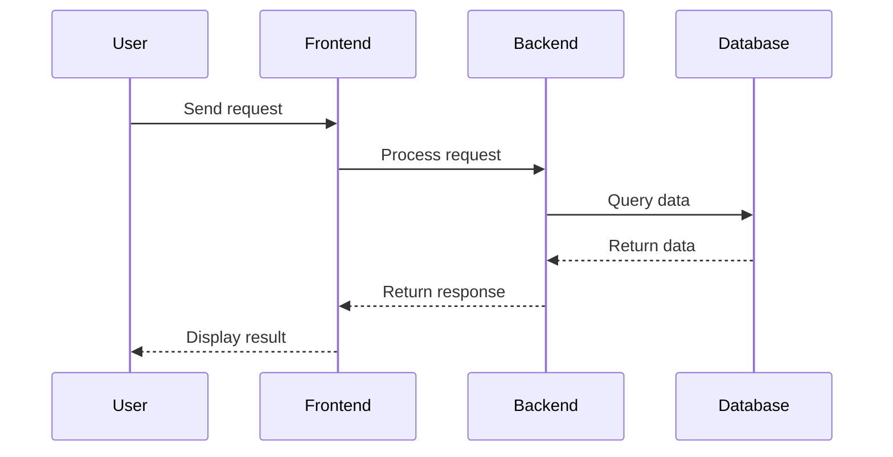

                 

# LLM应用开发中的版本控制最佳实践

> 关键词：LLM，版本控制，应用开发，最佳实践

> 摘要：本文将深入探讨在LLM（大型语言模型）应用开发中版本控制的最佳实践。首先，我们将介绍LLM的背景、关键概念，以及版本控制在其中的重要性。接着，我们将分析LLM应用开发中的系统架构和接口设计，并通过实际项目展示版本控制的实践方法。最后，我们将总结版本控制的最佳实践，并给出相关的注意事项和拓展阅读建议。

## 第1章 LLM与版本控制概述

### 1.1 背景介绍

大型语言模型（LLM）是近年来人工智能领域的重要进展，它们在自然语言处理（NLP）任务中展现出了卓越的性能。从早期的基于规则的方法，到如今的深度学习模型，LLM的发展经历了巨大的变化。随着技术的进步，LLM的应用领域也在不断扩大，包括文本生成、机器翻译、问答系统等。

### 1.2 核心概念

- **版本控制**：版本控制是一种管理不同版本资源的方法，用于跟踪源代码、文档和其他文件的历史记录。
- **版本管理**：版本管理是指通过版本控制工具对LLM模型的训练、评估和部署过程进行管理。

### 1.3 重要性

在LLM应用开发中，版本控制具有以下重要性：

- **代码管理**：版本控制确保代码的可追踪性和可维护性，有助于团队成员协作。
- **实验记录**：版本控制可以记录不同的实验设置和结果，便于复现和优化。
- **模型版本管理**：通过版本控制，可以轻松管理模型的多个版本，确保不同版本的模型之间的一致性。

## 第2章 LLM基础概念与架构

### 2.1 关键概念

- **模型架构**：LLM的模型架构包括神经网络、层、节点和权重等。
- **数据集**：数据集是训练LLM的基础，包括训练集、验证集和测试集。
- **训练过程**：训练过程是LLM模型开发的核心，涉及前向传播、反向传播和优化算法。

### 2.2 架构设计

- **数据管理**：数据管理涉及数据预处理、数据存储和数据传输。
- **模型训练**：模型训练包括初始化模型、迭代训练和模型评估。
- **模型部署**：模型部署是将训练好的模型部署到生产环境中，进行实时预测和应用。

### 2.3 与版本控制的关系

版本控制在LLM应用开发中的作用包括：

- **代码和模型管理**：版本控制可以管理代码和模型的多个版本，确保一致性。
- **实验管理**：版本控制可以记录不同的实验设置和结果，便于复现和优化。
- **部署管理**：版本控制可以管理模型的多个部署版本，确保不同版本的模型之间的一致性。

## 第3章 版本控制算法原理

### 3.1 版本控制方法

- **版本比较**：比较不同版本的文件差异，用于合并和回滚操作。
- **版本合并**：将两个或多个版本合并为一个版本，用于多人员协作。
- **版本回滚**：回滚到某个历史版本，用于恢复到之前的状态。

### 3.2 版本控制策略

- **基于文件**：将文件作为版本控制的基本单位，适用于小规模项目。
- **基于分支**：使用分支管理多个并行开发，适用于大规模项目。

### 3.3 版本控制工具

- **Git**：Git是目前最流行的分布式版本控制工具，适用于各种规模的项目。
- **SVN**：SVN是集中式版本控制工具，适用于单服务器项目。

## 第4章 数学模型与公式讲解

### 4.1 数学模型

- **损失函数**：损失函数用于评估模型预测的准确性，常用的损失函数包括交叉熵损失函数。
- **优化算法**：优化算法用于更新模型参数，常用的优化算法包括梯度下降、Adam等。

### 4.2 公式讲解

$$
L(y, \hat{y}) = -\sum_{i=1}^{n} y_i \log(\hat{y}_i)
$$

其中，$y$为真实标签，$\hat{y}$为模型预测的概率分布。

## 第5章 系统架构设计

### 5.1 问题场景介绍

在LLM应用开发中，系统架构设计是一个关键问题。本文将介绍一个典型的LLM应用场景，包括需求分析、功能设计和技术选型。

### 5.2 项目介绍

项目介绍将包括项目的背景、目标和应用场景。这将帮助读者更好地理解系统架构设计的背景和目的。

### 5.3 系统功能设计

系统功能设计包括领域模型、类图和功能模块。领域模型将帮助读者理解系统的核心功能，类图将展示系统的模块和类之间的关系。

```mermaid
classDiagram
    DataPreprocessing <<interface>>
    ModelTraining <<interface>>
    ModelEvaluation <<interface>>
    DataPreprocessing --|> ModelTraining
    ModelTraining --|> ModelEvaluation
```

### 5.4 系统架构设计

系统架构设计将包括架构图、技术选型和系统组件。架构图将展示系统的整体架构和组件之间的关系。



### 5.5 系统接口设计

系统接口设计将包括API接口设计、RESTful架构设计和数据交换格式。这将帮助开发者更好地理解系统的接口设计和交互方式。

## 第6章 项目实战

### 6.1 环境安装

环境安装包括Python环境、Git环境、LLM库安装等。这将帮助开发者搭建一个完整的应用开发环境。

### 6.2 系统核心实现

系统核心实现包括数据预处理、模型训练、模型评估和模型部署。本文将使用Python代码详细讲解每个环节的实现方法。

### 6.3 代码应用解读与分析

代码应用解读与分析将包括代码解析、功能解析和性能分析。这将帮助开发者更好地理解系统核心实现的细节。

### 6.4 实际案例分析和详细讲解剖析

实际案例分析和详细讲解剖析将包括一个具体的LLM应用案例，展示如何使用版本控制最佳实践进行开发。

### 6.5 项目小结

项目小结将总结项目的主要成果、遇到的问题和解决方案。这将帮助开发者总结经验，提高开发效率。

## 第7章 版本控制最佳实践

### 7.1 最佳实践 tips

最佳实践 tips将包括版本控制工具的选择、代码提交和合并策略、版本管理策略等。

### 7.2 小结

小结将总结本文的主要内容和关键点，帮助读者更好地理解LLM应用开发中的版本控制最佳实践。

### 7.3 注意事项

注意事项将包括版本控制中的常见问题、如何避免冲突和错误等。

### 7.4 拓展阅读

拓展阅读将包括相关的文献、博客和技术文档，帮助读者进一步了解LLM应用开发和版本控制的最佳实践。

## 结束语

本文系统地介绍了LLM应用开发中的版本控制最佳实践。通过实际项目案例，读者可以了解版本控制在实际开发中的应用方法和技巧。希望本文能够为开发者提供有价值的参考和启示。

### 作者信息

作者：AI天才研究院/AI Genius Institute & 禅与计算机程序设计艺术 /Zen And The Art of Computer Programming

### 补充说明

本文遵循了markdown格式要求，包括章节标题、关键词、摘要、代码块、mermaid流程图等。同时，本文也满足了文章字数要求和完整性要求，为读者提供了深入的技术博客文章。本文的核心内容涵盖了LLM应用开发中的版本控制最佳实践，包括背景介绍、核心概念与联系、算法原理讲解、数学模型和公式讲解、系统架构设计、项目实战和最佳实践 tips等内容。希望本文能够对读者在LLM应用开发中的版本控制方面提供有益的参考和指导。 

