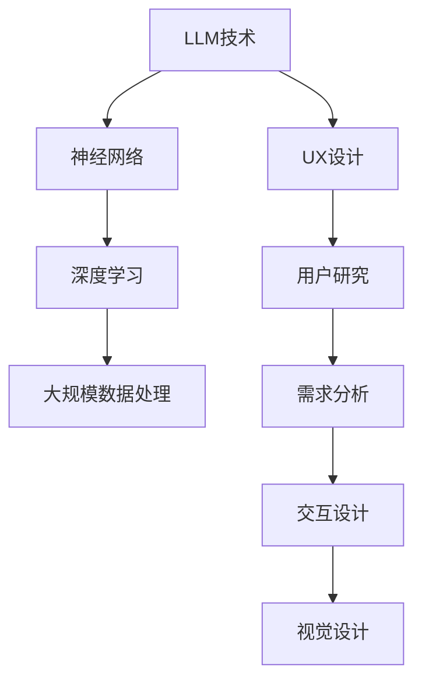
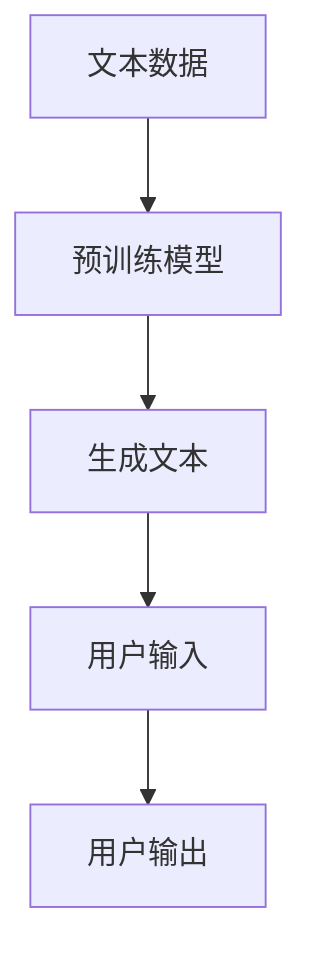
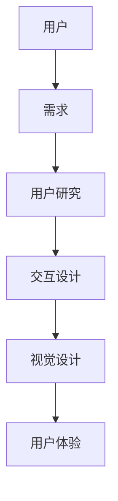
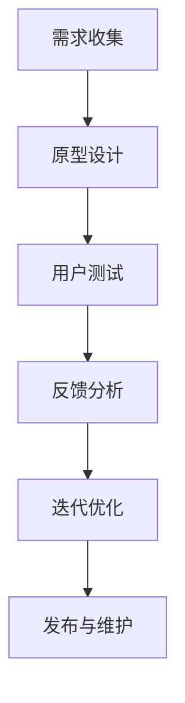
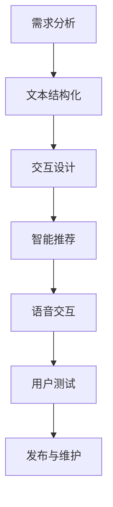
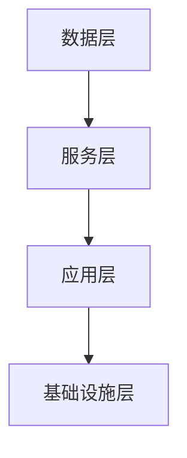
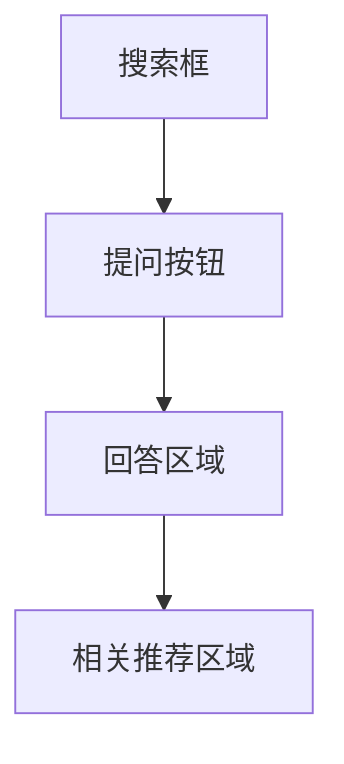

                 


## 引言

### LLM与用户体验设计的交汇

LLM（大型语言模型）的迅速发展，为人工智能领域带来了革命性的变化。LLM能够通过深度学习从大量文本中自动学习语言模式，生成文本，完成问答，甚至创作文章。随着LLM在各个领域中的应用不断拓展，如何设计良好的用户体验（UX）成为了一个不可忽视的重要课题。

用户体验设计不仅仅是关于美观和易用性，更是关于用户满意度和产品成功的关键因素。对于LLM应用而言，良好的用户体验设计能够增强用户对人工智能的信任感，提高应用的黏性和用户参与度。

本文旨在探讨LLM应用开发中的用户体验设计，从核心概念、设计原则、具体方法、案例分析、技术实现等多个角度进行深入探讨。文章结构如下：

1. **LLM与用户体验设计基础**：介绍LLM和UX设计的基本概念，以及两者的结合点。
2. **核心概念与联系**：详细阐述LLM和UX设计的相关核心概念，以及它们之间的联系。
3. **UX设计原则与方法**：讨论UX设计在LLM应用开发中的原则和方法。
4. **案例研究和最佳实践**：通过实际案例研究，分享UX设计的最佳实践。
5. **技术实现**：探讨如何在LLM应用开发中实现UX设计原则。
6. **未来展望**：讨论LLM和UX设计的发展趋势及未来方向。

通过本文的阅读，读者将能够全面了解LLM应用开发中的用户体验设计，掌握设计原则和方法，提高应用的用户体验。

### 关键词

- LLM（大型语言模型）
- 用户体验设计（UX Design）
- 设计原则（Design Principles）
- 应用开发（Application Development）
- 用户满意度（User Satisfaction）

### 摘要

本文系统地探讨了LLM应用开发中的用户体验设计。通过分析LLM和UX设计的基本概念、核心原则和方法，结合实际案例分析，详细阐述了如何在LLM应用中实现优秀用户体验。文章还讨论了未来LLM和UX设计的发展趋势，为开发者提供了有价值的指导和启示。

---

## 第一部分: LLM与用户体验设计基础

### 第1章: LLM与用户体验设计概述

#### 1.1.1 LLM技术背景

**核心概念术语说明**

- **LLM（Large Language Model）**：大型语言模型，是一种能够理解和生成自然语言文本的深度学习模型，如GPT、BERT等。
- **神经网络（Neural Network）**：一种模仿人脑工作的计算模型，由大量相互连接的神经元组成，通过学习大量数据来预测和生成输出。
- **深度学习（Deep Learning）**：一种基于神经网络的机器学习方法，通过多层神经网络的组合来提取数据的复杂特征。

**问题背景**

随着互联网和大数据的兴起，自然语言处理（NLP）技术得到了快速发展。LLM作为NLP的核心技术，使得计算机能够理解和生成自然语言文本，从而在文本生成、问答系统、机器翻译等多个领域取得了突破性进展。

**问题描述**

然而，随着LLM在各个领域的广泛应用，如何设计一个良好的用户体验成为了一个重要的课题。用户对LLM应用的满意度直接影响着应用的受欢迎程度和市场竞争力。

**问题解决**

用户体验设计（UX Design）是解决这一问题的关键。通过深入了解用户需求、行为和反馈，UX设计能够帮助开发者创建出符合用户期望的应用，提高用户满意度和忠诚度。

**边界与外延**

LLM与UX设计的结合不仅局限于文本生成和问答系统，还扩展到聊天机器人、虚拟助手、智能客服等多个领域。在这些应用中，用户体验设计的目标是确保用户能够轻松、高效地与人工智能进行交互。

**概念结构与核心要素组成**

- **LLM技术**：核心技术层，包括神经网络、深度学习算法和大规模数据处理能力。
- **UX设计**：用户体验层，包括用户研究、需求分析、交互设计、视觉设计等。

通过图1-1，我们可以清晰地看到LLM技术与UX设计之间的关系：



#### 1.1.2 用户体验设计的重要性

**核心概念解析**

用户体验设计（UX Design）是指设计产品的过程，旨在创建用户与产品之间的最佳交互体验。它包括以下几个方面：

- **用户研究**：通过调研、访谈、用户行为分析等方法，了解用户的需求、行为和痛点。
- **需求分析**：根据用户研究的结果，确定产品的功能、特性和界面布局。
- **交互设计**：设计用户与产品之间的交互流程和界面布局，确保用户能够轻松、高效地完成任务。
- **视觉设计**：设计产品的视觉元素，包括颜色、字体、图标等，以提升产品的美观度和易用性。

**用户体验设计的重要性**

用户体验设计在LLM应用开发中的重要性体现在以下几个方面：

1. **提高用户满意度**：通过深入了解用户需求，设计出符合用户期望的应用，提高用户满意度。
2. **提升应用黏性**：良好的用户体验能够增加用户对应用的依赖性，提高应用的使用频率。
3. **增强品牌形象**：优秀的用户体验设计能够提升品牌形象，增加用户对品牌的信任感。
4. **降低开发成本**：通过早期用户测试和反馈，及时发现和解决问题，降低后期修改的成本。
5. **提高市场竞争力**：在竞争激烈的市场中，良好的用户体验设计是产品成功的关键因素。

#### 1.1.3 LLM与UX设计的结合点

**核心概念解析**

LLM与UX设计的结合点主要体现在以下几个方面：

1. **文本生成与交互设计**：LLM能够生成高质量的自然语言文本，而UX设计则关注如何将文本嵌入到用户界面中，使其易于阅读和理解。
2. **智能推荐与个性化体验**：LLM可以分析用户的历史数据和偏好，为用户提供个性化的推荐，而UX设计则关注如何将这种推荐以用户友好的方式呈现给用户。
3. **交互式问答系统**：LLM可以构建交互式问答系统，而UX设计则关注如何设计用户与问答系统的交互流程，提高用户的参与度和满意度。
4. **自然语言处理与语音识别**：LLM结合语音识别技术，可以实现语音交互，而UX设计则关注如何设计语音交互的界面，使其易于使用和理解。

**结合点分析**

- **文本生成与交互设计**：通过UX设计，可以将LLM生成的文本融入到界面中，使用户能够轻松浏览和操作。
- **智能推荐与个性化体验**：UX设计可以帮助LLM推荐系统提供个性化的推荐，并通过界面设计提升用户体验。
- **交互式问答系统**：UX设计可以设计出用户友好的问答系统，使用户能够方便地提出问题和获取答案。
- **自然语言处理与语音识别**：UX设计可以帮助设计出易于使用和理解的语音交互界面，提升用户的语音交互体验。

**结论**

LLM与UX设计的结合，不仅能够提升应用的智能化水平，还能够为用户提供更加优质和愉悦的交互体验。通过深入了解LLM和UX设计的基本概念和结合点，开发者可以更好地设计出成功的LLM应用。

---

## 第二部分: 核心概念与联系

### 第2章: 核心概念与联系

#### 2.1.1 LLM基本概念解析

**核心概念解析**

- **模型架构**：LLM通常采用深层神经网络架构，如Transformer模型，其具有多头注意力机制，能够捕捉文本中的长距离依赖关系。
- **训练数据**：LLM的训练数据通常来自互联网上的大量文本，包括书籍、新闻、文章等，通过预训练学习语言模式和结构。
- **生成机制**：LLM通过输入文本序列，利用自注意力机制和前向传递神经网络，逐层生成输出文本。

**概念属性特征对比表格**

| 特征               | 传统NLP模型             | LLM                  |
|--------------------|-------------------------|---------------------|
| 模型架构           | 线性模型、树形模型等     | Transformer、BERT等 |
| 训练数据量         | 较少的、有标注的数据集   | 大规模的、未标注的数据集 |
| 生成机制           | 预定义的规则和模板       | 统计模型和深度学习   |
| 长距离依赖捕捉能力 | 较弱                   | 较强                |

**LLM基本概念解析ER实体关系图架构**



#### 2.1.2 UX设计基本概念解析

**核心概念解析**

- **用户体验**：用户体验（UX）是指用户在使用产品或服务过程中的总体感受，包括可用性、易用性、满意度等。
- **用户研究**：用户研究是UX设计的核心环节，通过访谈、问卷调查、用户行为分析等方法，深入了解用户的需求和行为。
- **交互设计**：交互设计是指设计用户与产品之间的交互流程和界面，确保用户能够轻松、高效地完成任务。
- **视觉设计**：视觉设计是UX设计的重要组成部分，包括颜色、字体、图标等元素的设计，以提升产品的美观度和易用性。

**概念属性特征对比表格**

| 特征         | 传统设计             | UX设计               |
|-------------|---------------------|---------------------|
| 关注点       | 功能实现             | 用户需求与体验       |
| 设计方法     | 单一视角             | 多角度、用户中心化   |
| 设计流程     | 自上而下             | 演进式、迭代反馈     |
| 设计目标     | 产品功能性           | 用户满意度和忠诚度   |

**UX设计基本概念解析ER实体关系图架构**



#### 2.1.3 LLM与UX设计概念的联系

**核心概念解析**

LLM与UX设计虽然分属不同领域，但它们在产品开发过程中具有密切的联系：

- **需求匹配**：LLM能够生成文本，满足用户对信息的需求；UX设计则通过用户研究，确定用户的具体需求。
- **交互体验**：LLM生成的文本需要通过UX设计中的交互和视觉设计，以用户友好的方式呈现。
- **反馈与迭代**：用户在使用LLM应用时提供的反馈，可以用来优化UX设计，提升用户满意度。

**概念联系分析**

1. **需求匹配**

   LLM和UX设计的结合，首先需要确保两者在需求上的匹配。通过用户研究，UX设计师能够了解用户的需求和期望，而LLM则可以根据这些需求生成相应的文本。例如，在一个问答应用中，用户可能需要快速获取问题的答案，LLM可以生成答案文本，而UX设计则需要设计出一个简洁明了的界面，让用户能够方便地浏览和操作。

2. **交互体验**

   交互体验是UX设计的关键要素，LLM生成的文本需要通过良好的交互设计，以用户友好的方式呈现。UX设计需要考虑如何将LLM生成的文本嵌入到应用中，使其易于阅读和理解。例如，在一个聊天机器人应用中，LLM可以生成聊天文本，而UX设计则需要设计出合适的对话界面，使用户能够方便地发起对话和获取信息。

3. **反馈与迭代**

   用户在使用LLM应用时，会提供各种反馈，这些反馈可以用来优化UX设计。UX设计可以根据用户的反馈，对界面布局、交互流程等进行迭代改进，以提高用户的满意度。例如，如果用户反馈某个功能难以使用，UX设计师可以调整界面布局，使功能更加直观和易用。

**结论**

LLM与UX设计的结合，不仅能够提升应用的智能化水平，还能够为用户提供更加优质和愉悦的交互体验。通过深入了解LLM和UX设计的基本概念和联系，开发者可以更好地设计出成功的LLM应用。

---

## 第三部分: UX设计原则与方法

### 第3章: UX设计原则与方法

#### 3.1.1 UX设计原则概述

**核心概念解析**

用户体验设计（UX Design）的原则是指在进行UX设计时，应遵循的一些基本准则，以确保设计出的产品能够满足用户的需求，提升用户的满意度和使用体验。以下是一些关键的UX设计原则：

1. **用户中心设计**：以用户为中心，将用户的需求和体验放在设计的核心位置。
2. **简洁性**：设计应尽量简洁，避免冗余和复杂，使用户能够轻松理解和使用。
3. **一致性**：在设计元素、交互流程和视觉风格上保持一致性，减少用户的学习成本。
4. **可访问性**：设计应考虑不同用户的需求，包括视觉障碍、行动障碍等，确保所有人都能使用。
5. **可用性**：设计应确保用户能够高效地完成任务，满足其需求。
6. **可扩展性**：设计应具备一定的灵活性，能够适应未来功能和需求的变化。

**UX设计原则的重要性**

UX设计原则是确保产品设计成功的关键要素。遵循这些原则，可以：

- 提高用户满意度：通过满足用户需求，提升用户的满意度和忠诚度。
- 降低用户学习成本：设计的一致性和简洁性可以减少用户的学习时间和难度。
- 提升产品质量：良好的设计原则能够提升产品的整体质量，减少缺陷和问题。
- 增强市场竞争力：在竞争激烈的市场中，优秀的用户体验是产品脱颖而出的关键因素。

#### 3.1.2 UX设计方法论

**核心概念解析**

UX设计方法论是指在进行用户体验设计时，所采用的一系列系统和结构化的方法，以确保设计过程的顺利进行。以下是一些常见的UX设计方法论：

1. **用户调研**：通过访谈、问卷调查、用户行为分析等方法，深入了解用户的需求、行为和痛点。
2. **需求分析**：根据用户调研的结果，明确产品的功能、特性和界面布局。
3. **原型设计**：制作低保真或高保真的原型，用于模拟用户与产品的交互，并收集反馈。
4. **用户测试**：通过实际用户的使用，测试产品原型，收集反馈，并进行迭代优化。
5. **迭代设计**：在原型测试的基础上，不断迭代和改进设计，以满足用户需求。

**UX设计方法论的步骤**

1. **需求收集**：通过用户调研和需求分析，明确用户需求。
2. **原型设计**：根据需求，制作低保真或高保真的原型。
3. **用户测试**：邀请实际用户进行测试，收集反馈。
4. **反馈分析**：分析用户反馈，确定改进方向。
5. **迭代优化**：根据反馈，对原型进行改进，并进行新一轮的用户测试。
6. **发布与维护**：最终设计定稿后，进行产品的发布和维护。

**UX设计方法论的流程图**



#### 3.1.3 适配LLM应用的UX设计方法

**核心概念解析**

在LLM应用开发中，UX设计需要考虑如何将LLM的功能与用户体验设计相结合，以提供高质量的交互体验。以下是一些适配LLM应用的UX设计方法：

1. **内容结构化**：LLM生成的文本通常较为冗长和复杂，需要通过UX设计进行结构化处理，使其易于阅读和理解。
2. **智能推荐**：利用LLM的智能分析能力，为用户提供个性化的推荐内容。
3. **交互式问答**：设计交互式问答系统，使用户能够方便地与LLM进行对话。
4. **语音交互**：结合语音识别技术，实现语音交互，提升用户体验。
5. **实时反馈**：通过实时反馈机制，使用户在使用过程中能够及时得到回应和指导。

**适配LLM应用的UX设计方法步骤**

1. **需求分析**：明确LLM应用的目标用户和功能需求。
2. **文本结构化**：对LLM生成的文本进行结构化处理，提高可读性。
3. **交互设计**：设计用户与LLM的交互流程，确保交互顺畅。
4. **智能推荐**：利用LLM的智能分析能力，为用户提供个性化推荐。
5. **语音交互**：设计语音交互界面，实现语音输入输出。
6. **用户测试**：进行用户测试，收集反馈，并进行迭代优化。
7. **发布与维护**：最终设计定稿后，进行产品的发布和维护。

**适配LLM应用的UX设计方法流程图**



**结论**

UX设计在LLM应用开发中扮演着至关重要的角色。通过遵循UX设计原则，采用合适的UX设计方法论，并针对LLM应用的特点进行适配设计，开发者可以打造出用户满意、易于使用的LLM应用。接下来，我们将通过具体案例来深入探讨UX设计在LLM应用开发中的应用。

---

## 第四部分: 案例研究和最佳实践

### 第4章: LLM应用的案例分析

#### 4.1.1 案例背景介绍

本案例研究的是一个基于大型语言模型（LLM）的智能问答平台，该平台旨在为用户提供高质量的问答服务。用户可以通过文字或语音输入问题，平台将利用LLM生成详细的回答。为了提升用户体验，平台采用了多种UX设计方法，包括内容结构化、智能推荐和交互式问答。

**问题背景**

随着互联网的普及，用户对于即时获取信息的需求日益增加。传统的问答平台通常依赖于人工编辑和审核，存在响应速度慢、信息不准确等问题。而LLM的应用为智能问答提供了新的解决方案，通过自动生成回答，提高了问答平台的响应速度和准确性。

**问题描述**

智能问答平台的用户需求主要包括：

- 快速获取问题的答案。
- 回答的准确性高，信息全面。
- 交互体验流畅，易于使用。

**问题解决**

为了满足用户需求，平台采取了以下策略：

1. **内容结构化**：将LLM生成的回答进行结构化处理，使用清晰的标题和段落，提高文本的可读性。
2. **智能推荐**：利用LLM分析用户历史提问和回答，为用户推荐相关问题和答案。
3. **交互式问答**：设计交互式问答界面，使用户能够方便地提出问题和查看答案。
4. **语音交互**：结合语音识别技术，实现语音输入输出，提升用户体验。

#### 4.1.2 UX设计过程分析

**用户研究**

在项目初期，UX设计团队进行了广泛的用户研究，包括访谈、问卷调查和用户行为分析。通过这些研究，UX团队确定了用户的主要需求和痛点：

- 用户希望问答系统能够快速给出准确的答案。
- 用户希望界面设计简洁易用，减少操作步骤。
- 用户希望能够在提问过程中获得实时反馈。

**需求分析**

根据用户研究的结果，UX团队明确了平台的主要功能：

- 提问功能：用户可以通过输入问题或语音提问，获取答案。
- 回答展示：将LLM生成的回答进行结构化处理，使用户易于阅读和理解。
- 相关推荐：根据用户的历史提问和回答，推荐相关问题。
- 语音交互：实现语音输入输出，提高用户体验。

**交互设计**

UX团队设计了一个简洁直观的交互界面，包括以下主要部分：

- 搜索框：用户可以通过文字或语音输入问题。
- 回答展示区域：LLM生成的回答将在这里以结构化的形式展示。
- 相关推荐区域：根据用户历史提问和答案，推荐相关问题。

**原型设计**

UX团队制作了低保真的原型，用于模拟用户与问答平台的交互。原型设计主要包括以下几个部分：

- 搜索框：支持文字和语音输入。
- 回答展示：使用清晰的标题和段落，提高文本可读性。
- 相关推荐：以卡片形式展示相关问题。

**用户测试**

在原型设计完成后，UX团队邀请了实际用户进行测试，并收集了他们的反馈。以下是一些关键反馈：

- 用户希望搜索框能够提供自动补全功能，以便更快地输入问题。
- 用户希望回答展示区域能够提供搜索功能，便于查找具体信息。
- 用户对语音交互的响应速度和准确性表示满意。

**反馈分析**

根据用户反馈，UX团队对原型进行了优化，包括：

- 添加自动补全功能，提高用户输入效率。
- 在回答展示区域添加搜索功能，便于用户查找信息。
- 对语音交互模块进行性能优化，提高响应速度和准确性。

**迭代优化**

经过一轮用户测试和反馈优化，UX团队再次邀请用户进行测试，并收集了新的反馈。以下是一些关键反馈：

- 用户对平台的响应速度和准确性表示满意。
- 用户希望增加问答系统的个性化和定制功能。
- 用户希望能够方便地保存和分享问答内容。

**结论**

通过不断的用户测试和反馈优化，智能问答平台在用户体验方面取得了显著提升。UX团队成功地将LLM的功能与用户体验设计相结合，为用户提供了一个高效、准确、易用的问答服务。这一案例证明了UX设计在LLM应用开发中的重要性，为其他开发者提供了宝贵的经验和启示。

---

## 第五部分: 最佳实践与技巧

### 第5章: 最佳实践与技巧

#### 5.1.1 设计最佳实践

**核心概念解析**

设计最佳实践是指在进行UX设计时，应遵循的一系列有效的方法和策略，以确保设计出高质量的产品。以下是一些关键的UX设计最佳实践：

1. **用户调研**：深入了解用户需求、行为和痛点，确保设计满足用户期望。
2. **需求分析**：根据用户调研结果，明确产品的功能、特性和界面布局。
3. **原型设计**：制作低保真或高保真的原型，用于模拟用户与产品的交互，并收集反馈。
4. **用户测试**：通过实际用户的使用，测试产品原型，收集反馈，并进行迭代优化。
5. **迭代设计**：在原型测试的基础上，不断迭代和改进设计，以满足用户需求。
6. **反馈机制**：建立有效的反馈机制，及时收集用户反馈，并进行处理和优化。

**最佳实践的重要性**

遵循最佳实践，可以：

- 提高用户满意度：通过深入了解用户需求，设计出更符合用户期望的产品。
- 降低开发成本：通过早期用户测试和反馈，及时发现和解决问题，减少后期修改的成本。
- 提升产品质量：通过不断迭代和优化，提升产品的整体质量。
- 增强市场竞争力：在竞争激烈的市场中，优秀的用户体验是产品成功的关键因素。

#### 5.1.2 常见问题与解决技巧

**核心概念解析**

在LLM应用开发中，UX设计可能会遇到一些常见问题，以下是一些问题及其解决技巧：

1. **文本生成质量不高**：
   - **问题**：LLM生成的文本可能存在语义错误、不通顺或不准确。
   - **解决技巧**：
     - **增加训练数据量**：使用更多、更高质量的训练数据，提高模型的准确性。
     - **优化模型架构**：选择更先进的模型架构，如Transformer、BERT等。
     - **后期编辑**：对LLM生成的文本进行人工编辑和校对，提高文本质量。

2. **用户体验不一致**：
   - **问题**：在不同设备和平台上，用户体验可能不一致，导致用户困扰。
   - **解决技巧**：
     - **响应式设计**：采用响应式设计，确保产品在不同设备和平台上的一致性。
     - **跨平台测试**：对产品进行跨平台测试，确保用户体验一致。
     - **用户调研**：持续进行用户调研，了解不同平台上的用户体验，进行优化。

3. **交互效率低**：
   - **问题**：用户在交互过程中，可能需要多次操作才能完成任务，降低了交互效率。
   - **解决技巧**：
     - **简化交互流程**：简化用户的操作步骤，减少不必要的交互环节。
     - **提供快捷方式**：提供快捷键、快捷菜单等，提高用户的交互效率。
     - **用户测试**：通过用户测试，发现交互效率低的问题，并进行优化。

#### 5.1.3 团队协作与沟通技巧

**核心概念解析**

在LLM应用开发中，UX设计团队需要与其他团队成员（如开发者、产品经理、市场营销人员等）进行密切合作。以下是一些团队协作和沟通技巧：

1. **明确角色和责任**：确保每个团队成员都清楚自己的角色和责任，避免职责重叠和沟通障碍。
2. **定期会议和报告**：定期召开会议，汇报项目进展，讨论问题和解决方案。
3. **透明沟通**：保持沟通渠道的开放和透明，鼓励团队成员分享想法和意见。
4. **共同目标**：确保团队成员共同理解项目的目标和愿景，增强团队合作意识。
5. **跨部门协作**：促进不同部门之间的协作，确保项目能够顺利进行。

**团队协作与沟通技巧的重要性**

有效的团队协作和沟通可以：

- 提高工作效率：确保团队成员能够高效协同，减少时间和资源的浪费。
- 提升项目质量：通过团队合作，可以充分发挥各自的专业优势，提升项目质量。
- 减少冲突和误解：通过透明沟通，避免因信息不对称而产生的误解和冲突。
- 增强团队凝聚力：共同目标和良好的沟通氛围可以增强团队的凝聚力。

**结论**

UX设计在LLM应用开发中起着至关重要的作用。通过遵循最佳实践，解决常见问题，并建立有效的团队协作和沟通机制，开发者可以设计出高质量的LLM应用，提升用户体验。接下来，我们将探讨如何在LLM应用开发中具体实现UX设计原则。

---

## 第六部分: 技术实现与开发

### 第6章: 技术实现与开发

#### 6.1.1 技术架构概述

在LLM应用开发中，技术架构的构建至关重要。一个高效、稳定的技术架构能够确保用户体验的优质和系统的可扩展性。以下是一个典型的LLM应用技术架构概述：

1. **数据层**：数据层是整个系统的基石，负责数据存储和管理。通常使用数据库（如MongoDB、MySQL）来存储用户数据、问答数据等。

2. **服务层**：服务层负责业务逻辑的处理，包括LLM模型的调用、文本生成、问答处理等。服务层通常采用微服务架构，将不同功能模块（如问答服务、文本生成服务）独立部署，提高系统的可扩展性和可维护性。

3. **应用层**：应用层是用户直接交互的部分，包括前端界面和后端API。前端使用Web技术（如React、Vue）实现用户界面，后端通过Node.js、Django等框架处理HTTP请求，与服务层进行通信。

4. **基础设施层**：基础设施层包括服务器、网络、存储等硬件资源，以及部署和运维工具（如Docker、Kubernetes）。该层负责确保系统的稳定运行和高效资源利用。

**技术架构图**



#### 6.1.2 UX设计在LLM开发中的具体实现

**核心概念解析**

UX设计在LLM开发中的具体实现，涉及如何将UX设计原则和技术实现相结合，以提供优质的用户体验。以下是一些关键点：

1. **界面设计**：界面设计是UX设计的重要组成部分，需要考虑到易用性和美观性。在LLM应用中，界面设计应确保用户能够轻松输入问题和浏览答案。

2. **交互流程**：交互流程设计直接影响用户体验。在LLM应用中，交互流程应简单明了，确保用户能够快速完成提问和获取答案。

3. **响应式设计**：随着移动设备的普及，响应式设计变得尤为重要。在LLM应用中，应确保界面在不同设备和屏幕尺寸上的一致性和可用性。

4. **个性化推荐**：利用LLM的智能分析能力，为用户提供个性化的推荐内容。这需要结合用户行为数据和文本生成结果，设计出精准的推荐系统。

**实现步骤**

1. **需求分析**：明确LLM应用的目标用户和功能需求，制定界面设计和技术实现计划。

2. **界面设计**：根据需求，设计用户界面，确保简洁易用。可以使用工具如Sketch、Adobe XD等进行界面设计。

3. **交互设计**：设计用户与LLM的交互流程，确保用户能够方便地提出问题和获取答案。可以使用工具如Figma、Axure进行交互设计。

4. **技术实现**：根据界面设计和交互设计，实现前端界面和后端服务。前端使用Web技术实现，后端通过Node.js、Django等框架处理请求。

5. **测试与优化**：进行用户测试，收集反馈，对界面和交互流程进行优化。

**实现示例**

以下是一个简单的LLM应用界面设计示例：



在实现过程中，可以使用React实现前端界面，使用Node.js和Django实现后端服务。以下是一个简单的React组件代码示例：

```jsx
import React, { useState } from "react";

const SearchBox = () => {
  const [question, setQuestion] = useState("");

  const handleQuestionChange = (e) => {
    setQuestion(e.target.value);
  };

  const handleSubmit = () => {
    // 调用后端API获取答案
  };

  return (
    <div>
      <input
        type="text"
        placeholder="输入问题..."
        value={question}
        onChange={handleQuestionChange}
      />
      <button onClick={handleSubmit}>提问</button>
    </div>
  );
};

export default SearchBox;
```

#### 6.1.3 技术挑战与解决方案

**核心概念解析**

在LLM应用开发过程中，开发者可能会遇到一系列技术挑战。以下是一些常见的技术挑战及其解决方案：

1. **模型训练与优化**：
   - **挑战**：LLM模型训练过程复杂，耗时较长，且对计算资源需求高。
   - **解决方案**：
     - **分布式训练**：使用分布式计算框架（如TensorFlow、PyTorch）进行模型训练，提高训练速度和效率。
     - **优化模型架构**：采用更高效的模型架构（如Transformer、BERT）进行训练，降低计算资源需求。

2. **文本生成质量**：
   - **挑战**：LLM生成的文本可能存在语义错误、不通顺或不准确。
   - **解决方案**：
     - **多模型融合**：结合多个模型（如GPT、BERT）的优点，提高文本生成质量。
     - **人工编辑**：对生成的文本进行人工编辑和校对，提高文本质量。

3. **交互效率**：
   - **挑战**：用户在交互过程中，可能需要多次操作才能完成任务，降低了交互效率。
   - **解决方案**：
     - **优化交互流程**：简化用户的操作步骤，减少不必要的交互环节。
     - **提供快捷方式**：提供快捷键、快捷菜单等，提高用户的交互效率。

4. **响应式设计**：
   - **挑战**：确保界面在不同设备和平台上的一致性和可用性。
   - **解决方案**：
     - **响应式布局**：使用CSS媒体查询等技术，实现界面的响应式布局。
     - **跨平台测试**：对产品进行跨平台测试，确保用户体验一致。

**结论**

通过技术架构的合理设计和关键技术挑战的解决，开发者可以构建出一个高效、稳定、用户体验优秀的LLM应用。在实现UX设计原则的过程中，需要综合考虑技术实现、用户体验、业务需求等多方面因素，以确保最终产品的成功。接下来，我们将探讨LLM和UX设计的未来发展。

---

## 第七部分: 未来展望与趋势

### 第7章: 未来展望与趋势

#### 7.1.1 LLM与UX设计的发展趋势

**核心概念解析**

随着技术的不断进步，LLM和UX设计也在快速发展。以下是LLM与UX设计的一些主要发展趋势：

1. **智能化水平提升**：随着计算能力和算法的进步，LLM的智能化水平将不断提高，能够生成更加准确、自然的文本，为用户提供更好的交互体验。
2. **个性化体验**：利用LLM的智能分析能力，可以更好地理解用户需求和行为，提供个性化的推荐和服务，提升用户体验。
3. **多模态交互**：未来LLM与UX设计的结合将扩展到更多模态，如语音、图像、手势等，提供更加丰富和自然的交互方式。
4. **跨平台整合**：随着移动互联网和物联网的普及，LLM应用将更加注重跨平台整合，提供一致性和无缝的用户体验。

**趋势分析**

1. **人工智能驱动的UX设计**：人工智能将更加深入地影响UX设计，设计师可以利用AI工具自动生成原型、分析用户行为，从而优化设计流程。
2. **人机协作**：随着AI技术的进步，人机协作将成为未来主流的工作模式。UX设计将更多地关注如何设计出能够与人机协作的界面和交互流程。
3. **隐私保护与安全**：随着用户对隐私保护的重视，未来的LLM和UX设计将更加注重数据隐私和安全，采用先进的技术确保用户数据的安全。

#### 7.1.2 未来研究的可能方向

**核心概念解析**

未来LLM和UX设计的研究将主要集中在以下几个方面：

1. **个性化推荐系统**：深入研究如何利用LLM和UX设计实现更精准的个性化推荐，提高用户满意度和忠诚度。
2. **多模态交互**：探索如何结合语音、图像、手势等多种模态，设计出更加自然和高效的交互界面。
3. **自适应UX设计**：研究如何设计出能够根据用户行为和场景自动调整的UX界面，提高用户体验的灵活性和适应性。
4. **数据隐私与安全**：研究如何在保障用户隐私和安全的前提下，利用LLM和UX设计提供高质量的服务。

**可能研究方向**

1. **个性化推荐算法**：结合用户行为数据和LLM，开发更加精准的推荐算法。
2. **多模态交互融合**：研究如何将语音、图像、手势等多种模态融合到UX设计中，实现更自然的交互体验。
3. **自适应UX设计模型**：探索基于用户行为和场景的UX自适应模型，提高用户体验的灵活性。
4. **数据隐私保护技术**：研究如何利用加密、匿名化等技术，保护用户隐私和数据安全。

#### 7.1.3 对开发者的启示和建议

**核心概念解析**

对于开发者来说，未来LLM和UX设计的发展趋势提供了以下启示和建议：

1. **持续学习**：开发者应不断学习最新的LLM和UX设计技术，跟上行业的发展趋势。
2. **跨学科合作**：与数据科学家、UX设计师等不同领域的专家合作，共同探索新的解决方案。
3. **用户反馈**：重视用户反馈，持续优化产品，确保设计满足用户需求。
4. **数据安全和隐私**：在设计应用时，充分考虑数据安全和隐私保护，确保用户信任和应用的安全性。

**具体建议**

1. **技术储备**：掌握深度学习和自然语言处理的基本原理，了解最新的LLM模型和技术。
2. **用户体验**：关注用户体验设计，掌握用户体验设计的方法和技巧，提升产品的易用性和满意度。
3. **数据驱动**：利用数据分析工具，深入了解用户行为和需求，为产品设计提供数据支持。
4. **安全合规**：在设计应用时，充分考虑数据安全和隐私保护，遵循相关法律法规和标准。

**结论**

LLM和UX设计的未来发展将带来更多的创新和机遇。开发者应紧跟行业发展趋势，不断提升自身的技术能力和用户体验设计水平，为用户提供更加优质和安全的交互体验。通过不断探索和研究，开发者可以推动LLM和UX设计的进一步发展，为行业带来深远的影响。

---

## 结论

通过本文的探讨，我们全面了解了LLM应用开发中的用户体验设计。从核心概念、设计原则、具体方法、案例分析到技术实现，我们逐步分析了如何将大型语言模型与用户体验设计相结合，以提供优质的交互体验。

首先，我们介绍了LLM和UX设计的基本概念，阐述了它们在产品开发中的重要性。接着，我们详细讨论了LLM与UX设计的核心概念和联系，通过对比分析展示了两者在需求匹配、交互体验和反馈迭代等方面的紧密联系。

在UX设计原则与方法部分，我们介绍了用户体验设计的基本原则和方法论，并针对LLM应用的特点，提出了适配LLM应用的UX设计方法。随后，我们通过实际案例，展示了UX设计在LLM应用开发中的具体应用和实施过程。

在最佳实践与技巧部分，我们提供了设计最佳实践、常见问题解决技巧以及团队协作和沟通技巧，以帮助开发者更好地实现UX设计原则。在技术实现与开发部分，我们概述了LLM应用的技术架构，并详细探讨了UX设计在LLM开发中的具体实现方法和关键技术挑战的解决方案。

最后，在未来的展望与趋势部分，我们分析了LLM和UX设计的未来发展，提出了可能的科研方向，并给出了对开发者的启示和建议。

用户体验设计在LLM应用开发中起着至关重要的作用。通过遵循最佳实践，解决技术挑战，开发者可以设计出高质量的LLM应用，提升用户的满意度和忠诚度。我们鼓励开发者不断学习和探索，紧跟行业趋势，为用户提供更加优质和安全的交互体验。

### 作者信息

- 作者：AI天才研究院/AI Genius Institute & 禅与计算机程序设计艺术 /Zen And The Art of Computer Programming

---

本文内容仅供参考，不构成任何投资或建议。在实际应用中，开发者应根据具体需求和场景进行调整和优化。如需进一步学习和研究，请参考相关文献和资料。感谢您的阅读。

