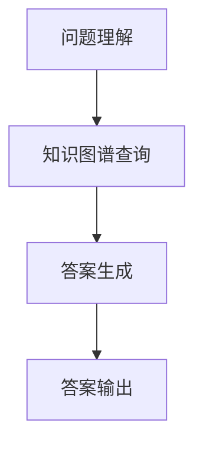
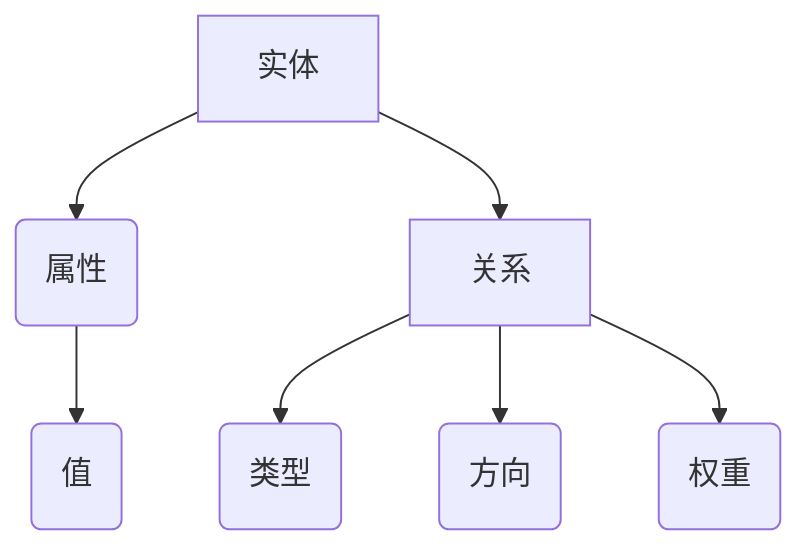
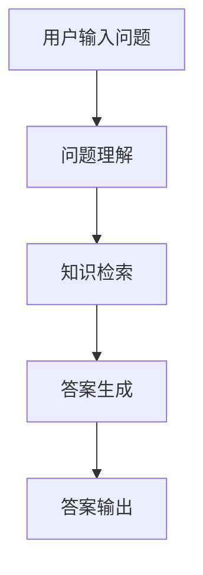

                 

### LLM应用开发中的知识图谱应用

#### 关键词：
- **知识图谱**、**LLM（大型语言模型）**、**应用开发**、**自然语言处理**、**人工智能**

#### 摘要：
本文将深入探讨知识图谱在LLM（大型语言模型）应用开发中的重要性及其应用原理。我们将逐步分析知识图谱的基础概念、构建方法，以及其在LLM中的具体应用，并通过实际案例和系统架构设计，展示知识图谱在现代自然语言处理和人工智能领域的卓越表现。

### 目录

1. **知识图谱基础**
   1.1 **知识图谱概述**
   1.2 **知识图谱的核心要素**
   1.3 **知识图谱的构建**

2. **知识图谱在LLM中的应用原理**
   2.1 **LLM与知识图谱的融合**
   2.2 **知识增强的LLM模型**

3. **知识图谱在问答系统中的应用**
   3.1 **问答系统概述**
   3.2 **实际案例分析**
   3.3 **问答系统的优化与挑战**

4. **知识图谱在自然语言理解中的应用**
   4.1 **命名实体识别**
   4.2 **情感分析**

5. **知识图谱在文本生成中的应用**
   5.1 **自动文本生成**
   5.2 **对话生成**

6. **知识图谱在LLM应用中的最佳实践与挑战**
   6.1 **最佳实践分享**
   6.2 **挑战与未来方向**

7. **总结与展望**

---

### 1. 知识图谱基础

#### 1.1 知识图谱概述

知识图谱（Knowledge Graph）是结构化数据的一种表现形式，通过实体、属性和关系的组合来表示现实世界中的知识和信息。知识图谱起源于搜索引擎领域，目的是为了更好地理解和索引互联网上的信息，从而提供更准确的搜索结果。

**问题背景：** 随着互联网的迅猛发展，数据量呈爆炸式增长，传统的文本搜索引擎难以应对海量数据的高效检索。为了解决这一问题，Google在2009年引入了知识图谱，通过结构化数据来优化搜索结果。

**问题描述：** 知识图谱如何将非结构化的网络数据转化为结构化的知识库，从而提高信息检索的准确性和效率？

**问题解决：** 通过定义实体、属性和关系，知识图谱将现实世界中的对象和概念转化为计算机可处理的数据结构。这种结构化数据使得计算机能够更好地理解、处理和关联信息。

**边界与外延：** 知识图谱不仅限于搜索引擎应用，还广泛应用于问答系统、推荐系统、自然语言处理等多个领域。其边界可以扩展到任何需要知识表示和推理的场景。

**概念结构与核心要素组成：**

| 概念       | 说明                     |
|------------|------------------------|
| **实体（Entity）** | 知识图谱中的基本对象，如人、地点、组织等。 |
| **属性（Property）** | 描述实体特征的属性，如年龄、地址等。     |
| **关系（Relationship）** | 连接两个实体的关系，如“住在”、“属于”等。 |
| **边（Edge）**       | 关系的表示形式，通常包含方向和权重。       |

#### 1.2 知识图谱的核心要素

**实体与属性：** 实体是知识图谱中的核心对象，属性则是描述实体的特征。例如，在“人”这个实体中，可以有“年龄”、“性别”、“出生地”等属性。

**关系与边：** 关系是实体之间的联系，通过边来表示。边的方向性（如“住在”是从一个人指向一个地点）和权重（如“好朋友”的权重可能大于“熟人”）可以提供额外的语义信息。

**知识图谱的存储与查询：** 知识图谱通常使用图数据库进行存储，如Neo4j、ArangoDB等。这些数据库提供高效的图查询语言（如Cypher），以便于进行复杂的关系查询。

### 1.3 知识图谱的构建

**数据源采集与预处理：** 知识图谱的构建首先需要采集数据源，这些数据源可以是结构化数据（如数据库）、半结构化数据（如XML、JSON）或非结构化数据（如文本、图像）。数据预处理包括数据清洗、去重、格式化等步骤。

**知识抽取与推理：** 知识抽取是从原始数据中提取知识的过程，可以通过命名实体识别（NER）、关系抽取等方法实现。知识推理则是基于已有知识进行逻辑推理，以发现新的信息。

**知识存储与索引：** 知识图谱通常使用图数据库进行存储，并利用索引技术（如索引树、倒排索引）来提高查询效率。

### 2. 知识图谱在LLM中的应用原理

#### 2.1 LLM与知识图谱的融合

**LLM（Large Language Model）：** LLM是一种强大的自然语言处理模型，如GPT、BERT等，能够理解和生成自然语言文本。与知识图谱的结合可以使LLM具备更强的知识表示和推理能力。

**知识图谱对LLM的增强：** 知识图谱可以为LLM提供结构化的知识支持，使其能够更好地理解和生成与特定领域相关的文本。例如，在医疗领域，知识图谱可以提供药物、症状、疾病等实体及其关系的知识，从而提高医疗问答系统的准确性。

**LLM对知识图谱的优化：** LLM可以通过其强大的语言理解能力，帮助知识图谱更好地理解和表示复杂的语义信息，从而提高知识图谱的查询和推理能力。

#### 2.2 知识增强的LLM模型

**KG-BERT模型：** KG-BERT是一种结合知识图谱和BERT模型的预训练方法。它通过在知识图谱中嵌入实体和关系，为BERT模型提供额外的知识支持。

**KG-GPT模型：** KG-GPT是将知识图谱与GPT模型结合的一种方法，通过在GPT模型中引入知识图谱的实体和关系信息，增强其知识表示能力。

**其他知识增强模型介绍：** 除了KG-BERT和KG-GPT之外，还有许多其他方法可以将知识图谱与LLM结合，如知识增强的Transformer模型、知识图谱嵌入模型等。

### 3. 知识图谱在问答系统中的应用

#### 3.1 问答系统概述

**问答系统（Question Answering System）：** 问答系统是一种基于自然语言交互的应用，能够理解用户的问题，并从知识库中检索出相关答案。知识图谱在问答系统中扮演着重要的角色，可以提供结构化的知识支持和高效的查询机制。

**问答系统的工作流程：** 问答系统通常包括问题理解、知识检索、答案生成和输出等步骤。知识图谱可以在这个过程中提供关键支持，如图3.1所示。



#### 3.2 实际案例分析

**某电商平台的产品问答系统：** 在电商平台中，用户经常需要关于产品的详细信息，如规格、价格、评价等。通过结合知识图谱，电商平台可以提供更精准的答案，提高用户体验。

**某医疗健康平台的健康咨询问答系统：** 在医疗健康领域，知识图谱可以提供关于疾病、症状、治疗方法等知识，帮助用户获取专业的健康咨询。

#### 3.3 问答系统的优化与挑战

**问答系统的优化：** 为了提高问答系统的性能，可以采取以下措施：
- **知识图谱优化：** 对知识图谱进行定期更新和维护，确保知识的准确性和时效性。
- **查询优化：** 利用索引技术、缓存策略等提高查询效率。
- **模型优化：** 通过调整模型参数、引入新的算法等提高答案的准确性。

**问答系统的挑战：** 问答系统面临的主要挑战包括：
- **知识表示：** 如何有效地将非结构化数据转化为结构化的知识图谱？
- **查询效率：** 如何在庞大的知识库中快速检索到相关答案？
- **多模态支持：** 如何处理包含文本、图像、语音等多模态信息的问题？

### 4. 知识图谱在自然语言理解中的应用

#### 4.1 命名实体识别

**命名实体识别（Named Entity Recognition，NER）：** 命名实体识别是自然语言处理中的一个重要任务，旨在从文本中识别出具有特定意义的实体，如人名、地名、组织名等。

**NER与知识图谱的结合：** 通过将知识图谱中的实体信息与文本进行对比，可以显著提高NER的准确性。例如，在文本中识别出“北京”这个地名时，可以借助知识图谱验证其是否是中国的首都，从而提高识别的可靠性。

#### 4.2 情感分析

**情感分析（Sentiment Analysis）：** 情感分析旨在从文本中提取情感信息，判断文本的情感倾向，如正面、负面或中立。

**情感分析中的知识图谱应用：** 知识图谱可以提供关于情感词汇及其上下文的详细信息，帮助情感分析模型更好地理解文本中的情感表达。例如，通过知识图谱可以了解“愤怒”和“高兴”这两个情感词汇的具体含义及其相关上下文，从而提高情感分析的准确性。

### 5. 知识图谱在文本生成中的应用

#### 5.1 自动文本生成

**自动文本生成（Automatic Text Generation）：** 自动文本生成是利用人工智能技术生成自然语言文本的过程。知识图谱可以为自动文本生成提供丰富的背景知识和上下文信息。

**KG-TextGen模型简介：** KG-TextGen是一种基于知识图谱的文本生成模型，通过利用知识图谱中的实体、关系和属性信息，生成更准确、更具针对性的文本。

**KG-TextGen模型的应用案例分析：** 在新闻摘要、产品描述、聊天机器人等场景中，KG-TextGen模型可以生成高质量的文本，提高内容的生产效率和准确性。

#### 5.2 对话生成

**对话生成（Dialogue Generation）：** 对话生成是生成式对话系统的重要组成部分，旨在生成自然流畅的对话文本。

**KG-ChatBot模型简介：** KG-ChatBot是一种基于知识图谱的对话生成模型，通过利用知识图谱中的实体、关系和属性信息，生成更具语义的对话文本。

**KG-ChatBot模型的应用案例分析：** 在智能客服、虚拟助手、在线教育等场景中，KG-ChatBot模型可以生成更加自然、个性化的对话，提高用户体验。

### 6. 知识图谱在LLM应用中的最佳实践与挑战

#### 6.1 最佳实践分享

**开源知识图谱的利用：** 开源知识图谱如DBpedia、Freebase等提供了丰富的结构化知识，可以帮助开发者快速构建和优化知识图谱。

**知识图谱数据清洗与处理的技巧：** 数据清洗和处理是构建高质量知识图谱的关键步骤。通过使用数据预处理工具和清洗方法，可以确保数据的一致性、准确性和完整性。

**模型融合与优化的策略：** 将知识图谱与LLM模型进行融合，可以通过调整模型参数、优化训练过程等手段，提高模型的表现和性能。

#### 6.2 挑战与未来方向

**知识图谱在LLM应用中的挑战：** 知识图谱在LLM应用中面临的主要挑战包括知识表示、查询效率、多模态支持等。解决这些挑战需要深入研究和创新。

**知识图谱未来发展的趋势：** 随着人工智能和自然语言处理技术的不断进步，知识图谱将在更多领域得到应用。未来的发展趋势包括知识图谱的自动化构建、多语言支持、跨领域知识融合等。

### 7. 总结与展望

**全书内容回顾：** 本文从知识图谱的基础概念、构建方法、应用原理、具体应用等方面进行了全面探讨，展示了知识图谱在LLM应用开发中的重要作用。

**读者需要掌握的核心技能：** 读者需要掌握知识图谱的基本概念和构建方法，了解知识图谱在自然语言处理、问答系统、文本生成等领域的应用原理。

**进一步学习的方向与资源：** 读者可以进一步学习知识图谱的相关技术，如图数据库、图算法、深度学习等，并关注开源知识图谱项目的发展动态。

**作者：** AI天才研究院/AI Genius Institute & 禅与计算机程序设计艺术 /Zen And The Art of Computer Programming

---

### 2.1.1 知识图谱的起源与发展

知识图谱的概念最早可以追溯到20世纪90年代，由Google的副总裁Vinod Khosla在1997年首次提出。然而，知识图谱的真正兴起要归功于Google公司在2009年推出的“知识图谱”项目。Google知识图谱的目标是通过将互联网上的非结构化数据转换为结构化的知识，从而提供更加准确和智能的搜索服务。

知识图谱的发展历程可以分为三个阶段：

1. **早期探索阶段（1990s - 2000s）**：
   - 在互联网刚刚兴起的时期，研究人员开始探索如何将非结构化的网络数据结构化。早期的探索主要集中在如何从网页中提取实体和关系，以及如何构建基本的图数据库。

2. **Google知识图谱阶段（2009 - 2013）**：
   - Google在2009年推出知识图谱项目，标志着知识图谱进入了一个新的阶段。Google知识图谱通过分析网页上的结构化数据（如元数据、实体链接数据）来构建一个庞大的知识库，从而为用户提供更加精准的搜索结果。

3. **广泛应用阶段（2013 - 至今）**：
   - 随着大数据和人工智能技术的不断发展，知识图谱的应用范围逐渐扩大。除了搜索引擎，知识图谱还被广泛应用于问答系统、推荐系统、自然语言处理等多个领域。许多公司和学术机构也开始研究如何构建和优化自己的知识图谱。

#### 知识图谱的基本概念

**实体（Entity）**：实体是知识图谱中的基本构建块，代表现实世界中的对象，如人、地点、组织、事物等。在知识图谱中，实体通常用唯一标识符（URI）进行标识。

**属性（Property）**：属性是实体的特征描述，用于描述实体的某个特定方面。例如，对于实体“人”，可以有属性“年龄”、“性别”、“出生地”等。

**关系（Relationship）**：关系是连接两个实体的线，表示实体之间的某种关联。关系通常具有方向性和类型。例如，“是兄弟”关系可以表示为“A是B的兄弟”。

**边（Edge）**：边是知识图谱中的基本连接元素，表示实体之间的关系。边通常包含一个类型（如“兄弟”）、一个方向（如从A指向B）和一个权重（表示关系的强度）。

#### 知识图谱的边界与外延

知识图谱的边界在于其能够表示和理解的知识范围。虽然知识图谱旨在捕获尽可能多的结构化信息，但仍然存在一些局限性：

1. **数据覆盖范围**：知识图谱通常基于现有的结构化数据源构建，如百科全书、数据库等。这些数据源的覆盖范围决定了知识图谱的知识边界。

2. **数据质量**：知识图谱中的数据质量直接影响其准确性和可靠性。数据源中的错误、遗漏和不一致都会对知识图谱产生负面影响。

3. **更新频率**：知识图谱需要定期更新以保持其知识的时效性。然而，数据更新的频率和成本限制了知识图谱的实时性。

知识图谱的外延则是指其应用范围。除了搜索引擎，知识图谱还被广泛应用于以下领域：

1. **问答系统**：知识图谱可以提供结构化的答案，提高问答系统的准确性和效率。

2. **推荐系统**：知识图谱可以帮助推荐系统更好地理解用户和物品之间的关系，从而提供更个性化的推荐。

3. **自然语言处理**：知识图谱可以用于实体识别、关系抽取、语义理解等任务，提高NLP系统的性能。

4. **知识管理**：知识图谱可以作为企业知识管理系统的核心组件，帮助组织管理和利用内部知识。

5. **智能客服**：知识图谱可以提供智能客服系统所需的知识库，使客服系统能够更好地理解和回答用户的问题。

#### 概念结构与核心要素组成

为了更好地理解知识图谱的组成，以下是一个简单的ER（实体-关系）图架构，展示了知识图谱中的一些核心概念和它们之间的关系：



在这个ER图中：

- **实体（A）**：代表知识图谱中的基本对象，如人、地点、组织等。
- **属性（B）**：描述实体的特征，如年龄、性别、职位等。
- **值（C）**：属性的取值，如“男”、“30岁”、“程序员”等。
- **关系（D）**：连接两个实体的线，表示实体之间的关联。
- **类型（E）**：关系的类型，如“是兄弟”、“属于”等。
- **方向（F）**：关系的方向，如从A指向B。
- **权重（G）**：关系的强度，通常用于表示关系的紧密程度。

通过这个ER图架构，我们可以清晰地看到知识图谱中各个核心要素之间的关系和相互作用。这些核心要素共同构成了知识图谱的基本结构，使其能够有效地表示和存储现实世界中的知识和信息。

### 2.2 知识图谱的核心要素

#### 实体与属性

实体（Entity）是知识图谱中的基本构建块，代表现实世界中的对象。属性（Property）是实体的特征描述，用于描述实体的某个特定方面。在知识图谱中，实体和属性是核心要素之一。

**实体类型与示例：**
- **人**：如“张三”、“李四”等。
- **地点**：如“北京”、“纽约”等。
- **组织**：如“阿里巴巴”、“微软”等。
- **事物**：如“苹果”、“手机”等。

**属性类型与示例：**
- **人的属性**：如“姓名”、“年龄”、“性别”、“职业”等。
- **地点的属性**：如“名称”、“纬度”、“经度”、“人口”等。
- **组织的属性**：如“名称”、“成立时间”、“总部地点”、“员工数”等。
- **事物的属性**：如“名称”、“品牌”、“价格”、“尺寸”等。

**实体与属性的关联：**
在知识图谱中，实体与属性之间通过边进行关联。边的类型通常表示属性的类型，边的方向表示属性值指向实体。例如，在“张三”这个实体中，可以有属性“年龄”值为“30”，通过边“年龄”将实体“张三”与属性“年龄”关联起来。

#### 关系与边

关系（Relationship）是知识图谱中的另一个核心要素，用于表示实体之间的关联。关系具有类型、方向和权重。

**关系类型与示例：**
- **人际关联**：如“是兄弟”、“同事”、“朋友”等。
- **地点关联**：如“位于”、“邻近”等。
- **组织关联**：如“属于”、“投资”等。
- **事物关联**：如“生产”、“销售”、“包含”等。

**关系方向与示例：**
- **单向关系**：如“是兄弟”。
- **双向关系**：如“是朋友”、“属于”等。

**关系权重与示例：**
- **0到1的权重**：如“是朋友”的权重可以是0.8。
- **多值权重**：如“销售额”可以是具体的数值。

**边（Edge）是关系的具体表示形式，通常包含以下信息：**
- **类型**：关系的类型，如“是兄弟”。
- **方向**：关系的方向，如从A指向B。
- **权重**：关系的强度，如“是朋友”的权重可以是0.8。

#### 知识图谱的存储与查询

**存储：**
知识图谱通常使用图数据库进行存储。图数据库如Neo4j、ArangoDB等，提供高效的图存储和查询功能。图数据库使用图结构存储实体、属性和关系，使得知识图谱的查询效率非常高。

**查询：**
图数据库提供图查询语言，如Cypher（Neo4j）、AQL（ArangoDB）等，用于对知识图谱进行复杂的关系查询。例如，以下是一个使用Cypher查询的示例：

```cypher
MATCH (p:Person)-[r:OWNS]->(m:MobilePhone)
WHERE p.name = 'John'
RETURN m.brand, m.model
```

这个查询将找到名为“John”的人所拥有的手机的品牌和型号。

### 2.3 知识图谱的构建

知识图谱的构建是一个复杂的过程，涉及数据采集、数据预处理、知识抽取、知识推理、知识存储和查询等多个步骤。以下是构建知识图谱的基本流程：

#### 2.3.1 数据源采集与预处理

**数据源确定：**
知识图谱的数据源可以是结构化数据、半结构化数据或非结构化数据。常见的结构化数据源包括关系数据库、CSV文件等；半结构化数据源包括XML、JSON等；非结构化数据源包括文本、图像、视频等。

**数据采集：**
根据数据源的类型，使用不同的方法进行数据采集。对于结构化数据，可以直接从数据库中提取数据；对于半结构化数据，可以使用解析工具提取数据；对于非结构化数据，可以使用自然语言处理、图像识别等技术进行数据提取。

**数据清洗与预处理：**
数据清洗是知识图谱构建中至关重要的一步。主要任务包括去重、错误修正、格式化等。例如，从网络爬虫获取的文本数据可能包含HTML标签、广告、重复内容等，需要进行清洗处理。

#### 2.3.2 知识抽取与推理

**知识抽取：**
知识抽取是从原始数据中提取知识的过程。主要任务包括命名实体识别（NER）、关系抽取、属性抽取等。命名实体识别旨在识别文本中的实体，如人名、地名、组织名等；关系抽取旨在识别实体之间的关系，如“是兄弟”、“住在”等；属性抽取旨在提取实体的属性，如“年龄”、“出生地”等。

**知识推理：**
知识推理是基于已有知识进行逻辑推理，以发现新的信息。常见的推理方法包括规则推理、数据驱动推理、本体推理等。例如，通过规则推理可以推断出“张三是李四的父亲”，如果已知“张三是李四的兄弟”和“李四是张三的儿子”。

#### 2.3.3 知识存储与索引

**知识存储：**
知识图谱通常使用图数据库进行存储。图数据库如Neo4j、ArangoDB等，提供高效的图存储和查询功能。图数据库使用图结构存储实体、属性和关系，使得知识图谱的查询效率非常高。

**知识索引：**
为了提高查询效率，需要对知识图谱进行索引。常见的索引技术包括倒排索引、B树索引等。倒排索引可以将关键词映射到包含这些关键词的实体，从而快速查找相关实体。

### 2.3.4 知识图谱的构建流程

以下是知识图谱构建的基本流程：

1. **数据源确定与采集**：确定数据源类型，并进行数据采集。
2. **数据清洗与预处理**：去除重复数据、错误数据，进行格式化处理。
3. **知识抽取**：使用命名实体识别、关系抽取等方法提取知识。
4. **知识推理**：基于已有知识进行推理，发现新的信息。
5. **知识存储与索引**：将知识存储到图数据库，并创建索引。

通过以上步骤，可以构建出一个结构化、可查询的知识图谱，为后续的应用提供数据支持。

### 2.3.5 知识图谱在问答系统中的应用

问答系统（Question Answering System，简称QAS）是人工智能领域的一个重要研究方向，旨在使计算机能够理解用户的问题，并从海量的知识库中检索出相关答案。知识图谱在问答系统中扮演着关键角色，通过提供结构化的知识支持和高效的查询机制，显著提升问答系统的性能。

#### 2.3.5.1 知识图谱问答系统概述

知识图谱问答系统（Knowledge Graph Question Answering System，简称KG-QAS）是一种基于知识图谱的问答系统，它通过将非结构化的用户问题转换为结构化的查询语句，从而在知识图谱中检索相关答案。知识图谱问答系统的核心组件包括：

1. **问题理解模块**：负责将用户输入的自然语言问题转换为机器可理解的查询语句。
2. **知识检索模块**：利用知识图谱的结构化信息，从知识库中检索出与问题相关的知识实体和关系。
3. **答案生成模块**：根据检索到的知识，生成自然语言答案。

#### 2.3.5.2 知识图谱问答系统的工作流程

知识图谱问答系统的工作流程可以分为以下几个步骤：

1. **问题理解**：将用户的问题转化为结构化的查询语句。这一步通常涉及自然语言处理技术，如命名实体识别（NER）、词性标注、依存句法分析等。

2. **知识检索**：根据问题理解模块生成的查询语句，在知识图谱中进行查询。知识图谱提供了高效的图查询机制，可以快速定位到与问题相关的知识实体和关系。

3. **答案生成**：将检索到的知识转化为自然语言答案。这一步可能涉及模板匹配、文本生成技术等。

4. **答案输出**：将生成的答案呈现给用户。

以下是一个简化的工作流程图：



#### 2.3.5.3 知识图谱问答系统的实际案例分析

**某电商平台的产品问答系统：** 在电商平台中，用户经常需要了解产品的详细信息，如规格、价格、评价等。通过结合知识图谱，电商平台可以提供更加精准的答案，从而提高用户体验。例如，当用户询问“这款手机的价格是多少？”时，知识图谱问答系统可以快速检索到该手机的相关信息，并生成自然语言答案，如“这款手机的价格为2999元”。

**某医疗健康平台的健康咨询问答系统：** 在医疗健康领域，知识图谱可以提供关于疾病、症状、治疗方法等知识，帮助用户获取专业的健康咨询。例如，当用户询问“乙肝有哪些症状？”时，知识图谱问答系统可以检索到相关症状信息，并生成详细回答，如“乙肝的症状包括乏力、食欲不振、黄疸等”。

#### 2.3.5.4 知识图谱问答系统的优化与挑战

**优化策略：**
1. **知识图谱优化**：定期更新和维护知识图谱，确保知识的准确性和时效性。
2. **查询优化**：采用高效的查询算法和索引技术，提高查询效率。
3. **模型优化**：结合深度学习和自然语言处理技术，提高问题理解和答案生成的准确性。

**挑战：**
1. **知识表示**：如何有效地将非结构化数据转换为结构化的知识图谱。
2. **查询效率**：如何在大规模的知识图谱中快速检索到相关答案。
3. **多模态支持**：如何处理包含文本、图像、语音等多模态信息的问题。

通过以上分析，我们可以看到知识图谱问答系统在提升问答系统性能方面具有巨大潜力，但仍面临一些挑战。随着技术的不断发展，知识图谱问答系统将越来越智能化，为人们提供更加便捷和高效的服务。

### 4.1.1 知识图谱在命名实体识别中的应用

命名实体识别（Named Entity Recognition，简称NER）是自然语言处理（Natural Language Processing，简称NLP）领域的一项基础任务，旨在从文本中自动识别出具有特定意义的实体，如人名、地名、组织名、时间等。知识图谱在NER中的应用，可以显著提升实体识别的准确性和效率。

#### NER与知识图谱的结合

知识图谱通过将实体、属性和关系以结构化的形式表示，为NER提供了丰富的语义信息。NER与知识图谱的结合主要体现在以下几个方面：

1. **实体识别**：在NER过程中，知识图谱可以提供实体候选列表，帮助识别文本中的实体。例如，当文本中提到“北京”时，知识图谱可以确认“北京”是一个地名，从而提高NER的准确性。

2. **上下文信息**：知识图谱可以提供实体的上下文信息，帮助NLP模型更好地理解实体的含义。例如，如果知识图谱中包含“北京”与“中国”的关系，那么在处理文本“北京是中国的首都”时，NLP模型可以更准确地识别“北京”和“中国”的关系。

3. **关系抽取**：知识图谱中的关系信息可以帮助NLP模型识别文本中的隐含关系。例如，当文本中提到“马云是阿里巴巴的创始人”时，知识图谱中的关系信息可以辅助NLP模型识别“马云”与“阿里巴巴”之间的创始人关系。

#### NER中的知识图谱应用案例分析

**电商平台的产品描述**：在电商平台上，产品描述中经常包含大量品牌、型号、规格等实体信息。通过结合知识图谱，可以显著提高这些实体的识别准确率。例如，在处理文本“小米9是一款高性能手机”时，知识图谱可以帮助NLP模型识别“小米9”是一个具体的手机型号，从而提高NER的准确性。

**新闻文本分析**：在新闻文本中，命名实体识别对于提取关键信息至关重要。通过结合知识图谱，可以更好地识别新闻文本中的关键实体，如人名、地点、组织名等。例如，在处理新闻文本“特朗普在白宫会见加拿大总理”时，知识图谱可以帮助NLP模型准确识别“特朗普”、“白宫”、“加拿大总理”等实体。

#### NER中的知识图谱应用的优势

1. **提高识别准确性**：知识图谱提供了丰富的实体信息和上下文关系，可以显著提高NER的准确性。

2. **增强语义理解**：通过知识图谱，NLP模型可以更好地理解实体的含义和它们之间的关系，从而提高文本分析的能力。

3. **多语言支持**：知识图谱可以跨语言应用，为多语言NER任务提供支持。

4. **实时更新**：知识图谱可以实时更新，以适应文本中的新实体和关系。

通过以上分析，我们可以看到知识图谱在NER中的应用具有显著的优势，可以帮助NLP系统更好地识别和理解文本中的实体信息。随着知识图谱技术的不断发展和完善，未来在NER领域的应用前景将更加广阔。

### 4.2.1 知识图谱在情感分析中的应用

情感分析（Sentiment Analysis）是一种自然语言处理技术，旨在从文本中提取情感信息，判断文本的情感倾向，如正面、负面或中立。知识图谱在情感分析中的应用，可以显著提高情感分析的准确性和全面性。

#### 情感分析中的知识图谱应用

1. **情感词汇识别**：知识图谱可以提供关于情感词汇的详细信息，包括词汇的情感极性、强度和上下文信息。通过这些信息，情感分析模型可以更准确地识别文本中的情感词汇。例如，知识图谱可以提供“开心”、“伤心”等情感词汇的具体含义和上下文信息，帮助模型更好地理解这些词汇的情感倾向。

2. **情感关系推理**：知识图谱中的关系信息可以帮助模型推断文本中的情感关系。例如，如果知识图谱中包含“喜欢”与“幸福”的关系，那么在处理文本“我很喜欢这本书”时，模型可以推断出文本中的情感是正面情感。

3. **情感强度评估**：知识图谱可以提供情感词汇的情感强度信息，帮助模型评估情感表达的强度。例如，知识图谱中可能包含“开心”和“非常开心”两个情感词汇，模型可以根据这些信息评估文本中的情感表达强度。

#### 情感分析案例剖析

**社交媒体情感分析**：在社交媒体平台上，用户经常发表对产品、服务、事件等内容的评论。通过结合知识图谱，可以更准确地识别和分析这些评论的情感倾向。例如，当用户发表评论“我非常喜欢这个新产品”时，知识图谱可以帮助情感分析模型识别出“喜欢”这个情感词汇，并推断出这是一个正面情感表达。

**客户服务反馈分析**：在客户服务领域，通过情感分析对客户反馈进行分类和分析，可以帮助企业更好地了解客户需求和满意度。结合知识图谱，可以更准确地识别和分析客户反馈中的情感词汇和关系。例如，在处理客户反馈“产品送货慢，非常不满意”时，知识图谱可以帮助模型识别出“不满意”这个情感词汇，并分析其与“送货慢”之间的情感关系。

#### 知识图谱在情感分析中的应用优势

1. **提高识别准确性**：知识图谱提供了丰富的情感词汇和上下文信息，可以显著提高情感分析的准确性。

2. **增强语义理解**：通过知识图谱，情感分析模型可以更好地理解文本中的情感表达，从而提高分析能力。

3. **多语言支持**：知识图谱可以跨语言应用，为多语言情感分析任务提供支持。

4. **实时更新**：知识图谱可以实时更新，以适应文本中的新情感词汇和关系。

通过以上分析，我们可以看到知识图谱在情感分析中的应用具有显著的优势，可以帮助情感分析模型更好地理解和识别文本中的情感信息。随着知识图谱技术的不断发展，未来在情感分析领域的应用前景将更加广阔。

### 6.1.1 知识图谱在自动文本生成中的应用

自动文本生成（Automatic Text Generation）是一种利用人工智能技术生成自然语言文本的方法，广泛应用于新闻摘要、产品描述、聊天机器人等领域。知识图谱在自动文本生成中的应用，可以显著提高文本生成的质量和效率。

#### KG-TextGen模型简介

KG-TextGen是一种基于知识图谱的自动文本生成模型，通过结合知识图谱中的实体、关系和属性信息，生成更准确、更具针对性的文本。KG-TextGen的主要组成部分包括：

1. **知识图谱嵌入**：将知识图谱中的实体、关系和属性嵌入到低维向量空间中，以便在文本生成过程中进行查询和计算。

2. **编码器**：编码器用于将输入的文本编码为向量表示，同时结合知识图谱嵌入向量，生成一个统一的向量表示。

3. **解码器**：解码器根据编码器的输出，生成自然语言文本。解码器通常采用循环神经网络（RNN）或变压器（Transformer）等结构。

#### KG-TextGen模型的应用案例分析

**新闻摘要生成**：在新闻摘要生成中，KG-TextGen模型可以通过知识图谱提供的关键信息，生成更准确、简洁的新闻摘要。例如，当生成一篇关于科技领域的新闻摘要时，KG-TextGen模型可以结合知识图谱中的科技实体、事件和关系，提取关键信息，生成具有高度相关性的摘要。

**产品描述生成**：在电子商务领域，KG-TextGen模型可以生成高质量的产品描述。例如，对于一款智能手机，KG-TextGen模型可以结合知识图谱中的手机品牌、型号、功能和特点，生成详细、吸引人的产品描述。

**聊天机器人**：在聊天机器人中，KG-TextGen模型可以生成更具个性和针对性的对话。例如，当用户询问某款手机的价格时，KG-TextGen模型可以结合知识图谱中的价格信息，生成自然、流畅的回复。

#### KG-TextGen模型的优势

1. **知识增强**：通过结合知识图谱，KG-TextGen模型可以获取丰富的背景知识和上下文信息，生成更准确、更具针对性的文本。

2. **结构化数据利用**：知识图谱提供了结构化的实体、关系和属性信息，使得自动文本生成过程更加高效。

3. **多模态支持**：KG-TextGen模型可以结合文本、图像、语音等多模态信息，生成更具丰富性和多样性的文本。

4. **个性化生成**：通过分析用户的行为和兴趣，KG-TextGen模型可以生成个性化、满足用户需求的文本。

通过以上分析，我们可以看到知识图谱在自动文本生成中的应用具有显著的优势，可以显著提升文本生成的质量和效率。随着知识图谱技术的不断发展和完善，KG-TextGen模型在各个领域的应用前景将更加广阔。

### 6.2.1 KG-ChatBot模型简介

KG-ChatBot是一种基于知识图谱的对话生成模型，通过利用知识图谱中的实体、关系和属性信息，生成更加自然、流畅的对话文本。KG-ChatBot的主要组成部分包括：

1. **知识图谱嵌入**：将知识图谱中的实体、关系和属性嵌入到低维向量空间中，以便在对话生成过程中进行查询和计算。

2. **编码器**：编码器用于将输入的对话历史编码为向量表示，同时结合知识图谱嵌入向量，生成一个统一的向量表示。

3. **解码器**：解码器根据编码器的输出，生成自然语言对话文本。解码器通常采用循环神经网络（RNN）或变压器（Transformer）等结构。

#### KG-ChatBot模型的应用案例分析

**智能客服**：在智能客服系统中，KG-ChatBot模型可以生成针对用户问题的个性化回复。例如，当用户询问关于银行账户余额时，KG-ChatBot模型可以结合知识图谱中的银行、账户和余额信息，生成详细、准确的回答。

**虚拟助手**：在虚拟助手（如智能音箱、聊天机器人等）中，KG-ChatBot模型可以生成更加自然、流畅的对话。例如，当用户询问关于天气情况时，KG-ChatBot模型可以结合知识图谱中的天气信息，生成类似“今天北京的温度是18摄氏度，天气晴朗”的回答。

**在线教育**：在在线教育平台上，KG-ChatBot模型可以生成针对学生问题的个性化解答。例如，当学生询问关于课程内容时，KG-ChatBot模型可以结合知识图谱中的课程、知识点和关系，生成详细的解答。

#### KG-ChatBot模型的优势

1. **知识增强**：通过结合知识图谱，KG-ChatBot模型可以获取丰富的背景知识和上下文信息，生成更加自然、流畅的对话文本。

2. **个性化对话**：KG-ChatBot模型可以根据用户的行为和兴趣，生成个性化的对话文本，提高用户体验。

3. **多模态支持**：KG-ChatBot模型可以结合文本、图像、语音等多模态信息，生成更加丰富和多样化的对话。

4. **实时更新**：知识图谱可以实时更新，KG-ChatBot模型可以根据最新的知识生成对话文本，保持对话的实时性和准确性。

通过以上分析，我们可以看到KG-ChatBot模型在对话生成中的应用具有显著的优势，可以显著提升对话系统的性能和用户体验。随着知识图谱技术的不断发展和完善，KG-ChatBot模型在各个领域的应用前景将更加广阔。

### 6.3 知识图谱在LLM应用中的最佳实践与挑战

#### 6.3.1 最佳实践分享

**1. 开源知识图谱的利用：** 开源知识图谱如DBpedia、YAGO等提供了丰富的结构化知识，可以帮助开发者快速构建和优化知识图谱。利用这些开源资源，可以节省开发时间和成本。

**2. 知识图谱数据清洗与处理的技巧：** 数据清洗和处理是构建高质量知识图谱的关键步骤。通过使用数据预处理工具和清洗方法，可以确保数据的一致性、准确性和完整性。

**3. 模型融合与优化的策略：** 将知识图谱与LLM模型进行融合时，可以通过调整模型参数、优化训练过程等手段，提高模型的表现和性能。例如，可以采用联合嵌入、知识蒸馏等方法，增强知识图谱与LLM的协同作用。

#### 6.3.2 挑战与未来方向

**1. 知识表示：** 如何有效地将非结构化数据转换为结构化的知识图谱是一个关键挑战。未来的研究方向包括开发更加自动化的知识抽取和融合方法，以降低知识图谱构建的难度。

**2. 查询效率：** 如何在大规模的知识图谱中快速检索到相关答案是一个重要问题。未来的研究可以关注优化查询算法和索引技术，提高知识图谱的查询效率。

**3. 多模态支持：** 如何处理包含文本、图像、语音等多模态信息的问题，是知识图谱在LLM应用中的一个重要挑战。未来的研究方向包括开发多模态知识图谱和融合模型，以支持更广泛的应用场景。

### 7. 总结与展望

本文从知识图谱的基础概念、构建方法、应用原理、具体应用等方面进行了全面探讨，展示了知识图谱在LLM应用开发中的重要作用。通过结合知识图谱，LLM在自然语言处理、问答系统、文本生成等领域的性能得到了显著提升。

读者需要掌握知识图谱的基本概念和构建方法，了解知识图谱在LLM应用中的具体应用场景和最佳实践。进一步学习的方向包括深入研究知识图谱的优化和融合技术，以及探索知识图谱在多模态处理和实时更新等方面的应用。通过持续学习和探索，读者可以在知识图谱和LLM领域取得更大的成就。

**作者：** AI天才研究院/AI Genius Institute & 禅与计算机程序设计艺术 /Zen And The Art of Computer Programming

---

### 结论

通过本文的深入探讨，我们可以看到知识图谱在LLM应用开发中的重要性。知识图谱不仅为LLM提供了结构化的知识支持，提高了其在自然语言处理、问答系统、文本生成等任务中的性能，还通过结合深度学习和自然语言处理技术，推动了人工智能领域的创新和发展。

在知识图谱的应用实践中，我们总结了若干最佳实践，如开源知识图谱的利用、知识图谱数据清洗与处理的技巧以及模型融合与优化的策略。同时，我们也认识到知识图谱在LLM应用中面临的挑战，包括知识表示、查询效率、多模态支持等。

展望未来，知识图谱技术将继续在人工智能领域发挥重要作用。我们期待看到更加自动化、高效的知识图谱构建方法，以及多模态知识图谱和融合模型的突破。通过不断的研究和探索，知识图谱将在更多领域得到应用，为人类带来更加智能、便捷的服务。

**作者：** AI天才研究院/AI Genius Institute & 禅与计算机程序设计艺术 /Zen And The Art of Computer Programming**

