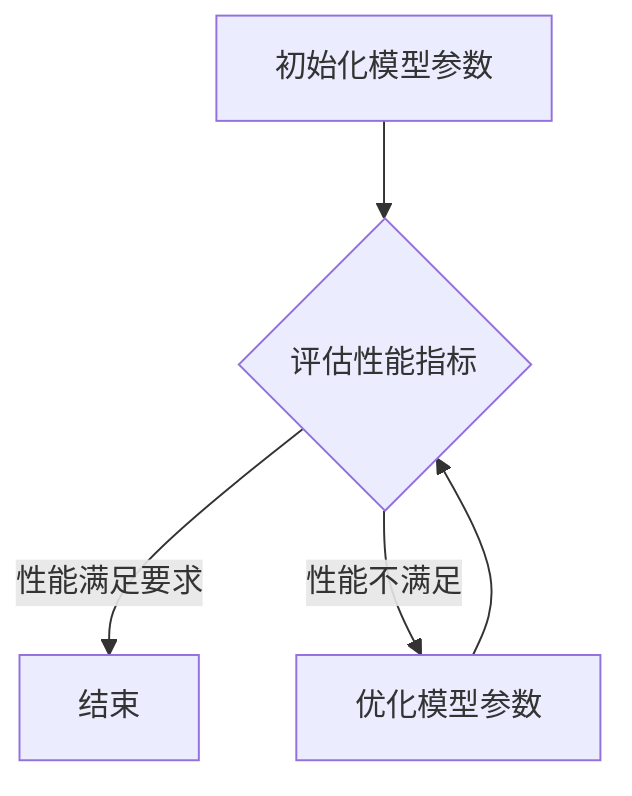
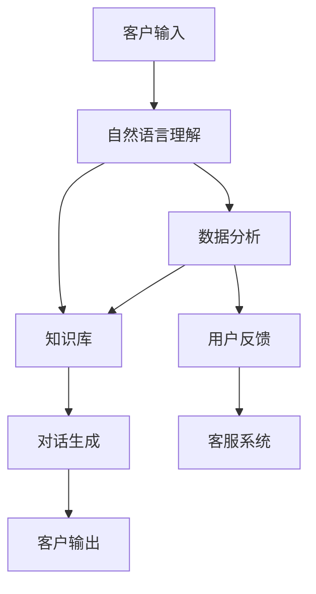

                 

### 第1章 引言

#### 1.1 书籍目的与结构

《LLM应用开发中的质量保证体系》旨在为开发者、数据科学家和人工智能领域的研究者提供一套全面的质量保证方法论。本文将深入探讨在大型语言模型（LLM）应用开发过程中，如何确保模型的高性能、可靠性、安全性和可解释性。通过对核心概念的详细解析、算法原理的讲解、系统架构设计的分析以及项目实战的展示，本书旨在帮助读者理解并实践一套系统化的质量保证体系。

本书结构紧凑，逻辑清晰，共分为11章，每一章都将围绕质量保证体系的一个关键方面展开：

- **第1章 引言**：介绍书籍的目的、结构以及面向读者的背景知识要求。
- **第2章 LLM背景与核心概念**：概述LLM的发展背景和核心概念。
- **第3章 质量保证体系构建**：构建质量保证体系的方法和框架。
- **第4章 模型性能评估与优化**：模型性能评估指标和优化方法。
- **第5章 模型可靠性保障**：讨论模型的可靠性保障策略。
- **第6章 模型安全性**：探讨模型安全性的各个方面。
- **第7章 模型可解释性**：介绍模型可解释性及其评估方法。
- **第8章 数据质量与算法公平性**：分析数据质量问题和算法公平性。
- **第9章 系统分析与架构设计**：展示系统分析和架构设计的方法。
- **第10章 项目实战**：通过实际项目展示质量保证体系的应用。
- **第11章 最佳实践与总结**：总结最佳实践，提出注意事项，推荐拓展阅读。

#### 1.2 面向读者的背景知识要求

为了更好地理解本文的内容，读者需具备以下背景知识：

- **深度学习和人工智能基础**：了解神经网络、深度学习模型的基本原理和常见架构。
- **编程技能**：具备Python等编程语言的基础，能够理解并编写简单的机器学习代码。
- **数据科学**：了解数据处理、数据清洗、特征工程等基本概念。
- **系统设计与架构**：具备系统分析与设计的基础，能够理解系统架构图和流程图。

#### 1.3 内容组织与逻辑

本书内容组织逻辑紧密，每章之间相互关联，形成一个完整的知识体系。首先，通过第1章的引言，读者可以了解本书的总体目的和结构。随后，第2章和第3章为质量保证体系构建提供了理论基础和方法论。第4章到第8章则分别从模型性能、可靠性、安全性、可解释性、数据质量和算法公平性等多个维度，深入探讨了质量保证的具体内容和策略。

第9章和第10章通过实际项目和系统架构设计，展示了如何将理论应用于实践中。最后，第11章通过最佳实践总结和注意事项，为读者提供了进一步的学习和实践指南。

通过这样一环扣一环的结构，读者可以逐步深入理解质量保证体系的构建和应用，从而在实际开发过程中更好地应对挑战，提升模型和应用的质量。### 1.3 内容组织与逻辑

本书的内容组织旨在为读者提供清晰的逻辑思路，帮助他们在LLM应用开发中构建和实施有效的质量保证体系。以下是各章的具体内容安排和逻辑关系：

- **第1章 引言**：本书的开篇，介绍了书籍的目的、结构，以及面向读者的背景知识要求。这一章节旨在为读者提供整体的认识框架，奠定后续章节的阅读基础。

- **第2章 LLM背景与核心概念**：本章将详细介绍LLM的发展背景，定义核心概念，包括问题背景、问题描述、问题解决、边界与外延，并阐述质量保证体系的概念结构与核心要素组成。这一章节旨在为读者提供对LLM及其相关质量保证概念的基本理解。

- **第3章 质量保证体系构建**：本章将讨论如何构建质量保证体系，包括评估标准、流程管理、测试与验证、持续集成与持续部署等内容。这一章节旨在为读者提供构建质量保证体系的具体方法和步骤。

- **第4章 模型性能评估与优化**：本章将深入探讨模型性能评估的指标、工具和方法，包括评估指标与工具，以及性能优化方法。这一章节旨在帮助读者理解并应用性能评估和优化的技术。

- **第5章 模型可靠性保障**：本章将讨论如何保障模型的可靠性，包括故障率、鲁棒性、容错性等方面的内容。这一章节旨在为读者提供保障模型可靠性的策略和实践。

- **第6章 模型安全性**：本章将详细探讨模型安全性，包括隐私保护、对抗攻击、模型入侵等方面的内容。这一章节旨在帮助读者理解并防范模型潜在的安全风险。

- **第7章 模型可解释性**：本章将介绍模型可解释性的方法与工具，评估指标等，帮助读者理解如何提升模型的可解释性。这一章节旨在为读者提供可解释性的理论和实践指导。

- **第8章 数据质量与算法公平性**：本章将分析数据质量问题和算法公平性，探讨如何确保数据质量和算法的公平性。这一章节旨在帮助读者理解数据质量和算法公平性的重要性。

- **第9章 系统分析与架构设计**：本章将通过具体问题场景介绍和项目介绍，展示系统功能设计、系统架构设计、系统接口设计和系统交互等内容。这一章节旨在为读者提供系统分析与架构设计的方法和实践。

- **第10章 项目实战**：本章将通过实际项目的环境安装、系统核心实现、代码应用解读与分析、实际案例分析等项目实战，展示如何在实际开发中应用质量保证体系。这一章节旨在为读者提供实战经验。

- **第11章 最佳实践与总结**：本章将总结最佳实践，提出注意事项，推荐拓展阅读，为读者提供进一步学习和实践的指导。这一章节旨在为读者提供全面的总结和指导。

通过上述章节的逐步展开，本书的逻辑结构清晰，内容安排合理，读者可以循序渐进地了解和掌握LLM应用开发中的质量保证体系。每个章节不仅独立成章，又相互关联，共同构建了一个完整、系统的知识体系。### 2.1 LLM背景与核心概念

#### 2.1.1 问题背景

随着深度学习和人工智能技术的迅猛发展，大型语言模型（Large Language Models，简称LLM）如GPT（Generative Pre-trained Transformer）等开始成为研究和应用的热点。LLM通过在大量文本数据上预训练，可以掌握丰富的语言知识和表达能力，从而在各种自然语言处理（Natural Language Processing，NLP）任务中表现出色。然而，随着LLM应用范围的扩展，其质量保证问题也日益凸显。如何确保LLM在应用中的性能、可靠性、安全性以及可解释性，成为了开发者、数据科学家和AI领域研究者共同关注的重要课题。

#### 2.1.2 问题描述

在LLM应用开发中，存在以下几个核心问题：

1. **性能问题**：如何评估和优化LLM的性能，使其在各种NLP任务中达到最佳效果？
2. **可靠性问题**：如何保障LLM的可靠性，确保其在实际应用中的稳定性和鲁棒性？
3. **安全性问题**：如何防止LLM受到恶意攻击或泄露敏感信息？
4. **可解释性问题**：如何提高LLM的可解释性，使其决策过程更加透明和可追溯？
5. **数据质量问题**：如何处理和确保训练LLM的数据质量，避免数据偏差和错误？
6. **算法公平性问题**：如何确保LLM算法在不同群体中的公平性和无偏见性？

这些问题不仅涉及技术层面，还涉及到伦理、法律和社会等多个维度，因此需要综合考量，建立一套全面的质量保证体系。

#### 2.1.3 问题解决

为了解决上述问题，我们需要建立一套系统化的质量保证体系，该体系应涵盖从模型训练、部署到维护的各个阶段。具体来说，质量保证体系应包括以下几个核心组成部分：

1. **评估标准**：定义一系列评估指标，用于衡量LLM在不同维度（如性能、可靠性、安全性等）的表现。
2. **流程管理**：建立规范化的开发流程，确保LLM的开发和部署过程有序、高效。
3. **测试与验证**：通过多种测试手段，对LLM进行全面的测试和验证，确保其性能和可靠性。
4. **持续集成与持续部署**：实现持续集成和持续部署（CI/CD），确保LLM在更新和迭代过程中保持高质量。
5. **数据质量管理**：建立数据质量管理机制，确保训练LLM的数据质量，防止数据偏差和错误。
6. **算法公平性分析**：通过算法分析和模型审核，确保LLM算法在不同群体中的公平性和无偏见性。

#### 2.1.4 边界与外延

LLM质量保证体系的适用范围主要涵盖大型语言模型的开发和应用，包括但不限于文本生成、机器翻译、问答系统等NLP任务。虽然其他类型的AI模型（如图像识别模型、推荐系统等）也有类似的质量保证需求，但本文主要聚焦于LLM领域。

#### 2.1.5 概念结构与核心要素组成

LLM质量保证体系由以下核心要素组成：

1. **质量保证体系**：涵盖评估标准、流程管理、测试与验证、持续集成与持续部署等内容。
2. **模型性能**：评估指标、优化方法、性能评估工具。
3. **可靠性**：故障率、鲁棒性、容错性。
4. **安全性**：隐私保护、对抗攻击、模型入侵。
5. **可解释性**：解释方法、可视工具、应用场景。
6. **数据质量**：数据清洗、数据预处理、数据偏差处理。
7. **算法公平性**：算法偏差分析、群体公平性评估。

通过上述概念结构与核心要素的组成，LLM质量保证体系可以为开发者提供一套全面、系统的指南，帮助他们在LLM应用开发中应对各种挑战，提升模型和应用的质量。### 2.2 核心概念与联系

在构建LLM应用开发中的质量保证体系时，理解几个关键概念及其相互关系至关重要。以下是核心概念的定义、属性特征对比，以及它们之间的联系。

#### 2.2.1 模型性能

**定义**：模型性能指的是模型在完成特定任务时表现出的效率和能力。

**属性特征**：

- **准确率**：模型预测正确的比例。
- **召回率**：模型召回的正确样本数与实际正确样本数的比例。
- **F1分数**：准确率和召回率的调和平均值。
- **计算效率**：模型处理数据的速度。

**对比表格**：

| 性能指标 | 定义 | 对比 | 应用场景 |
| --- | --- | --- | --- |
| 准确率 | 预测正确的比例 | 高准确率意味着模型较少的错误预测，但可能忽略召回率 | 文本分类、情感分析 |
| 召回率 | 召回的正确样本数与实际正确样本数的比例 | 高召回率意味着模型能够捕捉到更多的正确样本，但可能增加误报率 | 信息检索、异常检测 |
| F1分数 | 准确率和召回率的调和平均值 | 综合考虑准确率和召回率，平衡二者的折中方案 | 多种NLP任务 |
| 计算效率 | 模型处理数据的速度 | 高计算效率意味着模型能够快速响应，适合实时应用 | 聊天机器人、语音识别 |

**联系**：模型性能直接影响LLM应用的效率和用户体验。通过多维度评估，可以全面了解模型在不同任务中的表现，进而优化模型。

#### 2.2.2 可靠性

**定义**：可靠性指的是模型在长时间运行和面对各种输入数据时保持稳定和准确的能力。

**属性特征**：

- **故障率**：模型发生错误的频率。
- **鲁棒性**：模型在面对噪声数据或异常情况时的表现。
- **容错性**：模型在部分组件或数据丢失时的恢复能力。

**对比表格**：

| 可靠性指标 | 定义 | 对比 | 应用场景 |
| --- | --- | --- | --- |
| 故障率 | 模型发生错误的频率 | 低故障率意味着模型更稳定 | 客户服务、自动驾驶 |
| 鲁棒性 | 模型在面对噪声数据或异常情况时的表现 | 高鲁棒性意味着模型适应性强 | 健康监测、图像识别 |
| 容错性 | 模型在部分组件或数据丢失时的恢复能力 | 高容错性意味着模型能够自动修复错误 | 数据中心、物联网 |

**联系**：可靠性是模型在实际应用中不可或缺的特性，直接关系到用户对模型信任度和依赖程度。提高可靠性可以增强模型的稳定性和长期运行能力。

#### 2.2.3 安全性

**定义**：安全性指的是模型在运行过程中保护用户隐私、防止恶意攻击和模型入侵的能力。

**属性特征**：

- **隐私保护**：防止用户数据泄露或被滥用。
- **对抗攻击**：防止恶意攻击者通过特定的输入数据欺骗模型。
- **模型入侵**：防止未经授权的用户或程序访问模型内部数据或参数。

**对比表格**：

| 安全性指标 | 定义 | 对比 | 应用场景 |
| --- | --- | --- | --- |
| 隐私保护 | 防止用户数据泄露或被滥用 | 高隐私保护意味着数据安全性高 | 金融服务、医疗健康 |
| 对抗攻击 | 防止恶意攻击者通过特定的输入数据欺骗模型 | 高对抗攻击防御力意味着模型更安全 | 智能交通、网络安全 |
| 模型入侵 | 防止未经授权的用户或程序访问模型内部数据或参数 | 高模型入侵防御力意味着模型安全性更高 | 自动驾驶、工业自动化 |

**联系**：安全性是保障模型在复杂环境中稳定运行的重要保障，直接关系到用户的信任和模型的长期价值。加强安全性可以提高模型的可靠性和用户体验。

#### 2.2.4 可解释性

**定义**：可解释性指的是模型决策过程和结果的可理解性，使非技术用户能够理解和信任模型的输出。

**属性特征**：

- **解释方法**：用于解释模型决策过程的算法和工具。
- **可视工具**：用于展示模型决策过程的图形化工具。
- **应用场景**：需要高可解释性的任务，如医疗诊断、法律判决等。

**对比表格**：

| 可解释性指标 | 定义 | 对比 | 应用场景 |
| --- | --- | --- | --- |
| 解释方法 | 用于解释模型决策过程的算法和工具 | 高解释性方法使模型决策过程更透明 | 医疗诊断、法律判决 |
| 可视工具 | 用于展示模型决策过程的图形化工具 | 高可视性工具使模型决策过程更直观 | 数据可视化、用户体验优化 |
| 应用场景 | 需要高可解释性的任务 | 高可解释性任务要求模型决策过程易于理解 | 金融风险评估、智能家居 |

**联系**：可解释性直接影响用户对模型的信任度和接受度，尤其是在需要高决策透明度和法律责任的领域，提高可解释性可以增强模型的可靠性和合规性。

通过以上对核心概念及其相互关系的介绍，我们可以看到，模型性能、可靠性、安全性、可解释性是LLM应用开发中不可或缺的四个方面。它们共同构成了一个有机整体，相互影响、相互促进，确保了LLM在实际应用中的高质量表现。在后续章节中，我们将进一步探讨这些核心概念的具体实现和应用。### 2.3 算法原理讲解

#### 2.3.1 算法流程图

为了更直观地理解LLM质量保证体系中的算法原理，我们可以使用Mermaid语法绘制一个算法流程图。以下是一个简单的示例：



这个流程图展示了模型初始化、性能评估、模型参数优化以及流程结束的基本步骤。在实际应用中，这个流程会更加复杂，涉及多个评估指标、优化方法和测试阶段。

#### 2.3.2 Python源代码实现

下面是一个简单的Python示例，用于演示LLM性能评估的基本流程：

```python
import numpy as np
from sklearn.metrics import accuracy_score, precision_score, recall_score, f1_score

# 模拟预测结果和实际标签
predictions = np.array([0, 1, 1, 0, 1])
actual_labels = np.array([0, 0, 1, 1, 1])

# 计算性能指标
accuracy = accuracy_score(actual_labels, predictions)
precision = precision_score(actual_labels, predictions)
recall = recall_score(actual_labels, predictions)
f1 = f1_score(actual_labels, predictions)

# 输出性能指标
print(f"Accuracy: {accuracy}")
print(f"Precision: {precision}")
print(f"Recall: {recall}")
print(f"F1 Score: {f1}")
```

在这个示例中，我们使用了sklearn库中的几个性能评估函数来计算模型的准确率、精确率、召回率和F1分数。这些指标是评估模型性能的重要工具，有助于我们在优化模型时进行有针对性的调整。

#### 2.3.3 算法原理详细讲解

**数学模型和公式**

在LLM性能评估中，常用的数学模型和公式包括：

- **准确率（Accuracy）**：
  \[
  \text{Accuracy} = \frac{\text{预测正确的数量}}{\text{总预测数量}}
  \]

- **精确率（Precision）**：
  \[
  \text{Precision} = \frac{\text{真正例}}{\text{真正例 + 假正例}}
  \]

- **召回率（Recall）**：
  \[
  \text{Recall} = \frac{\text{真正例}}{\text{真正例 + 假反例}}
  \]

- **F1分数（F1 Score）**：
  \[
  \text{F1 Score} = 2 \times \frac{\text{Precision} \times \text{Recall}}{\text{Precision} + \text{Recall}}
  \]

**详细讲解**

1. **准确率**：准确率是评估模型性能最常用的指标之一。它表示模型在所有预测中正确预测的比例。虽然准确率简单直观，但它可能会受到类别不平衡的影响。例如，在一个类别占比90%，另一个类别占比10%的任务中，即使模型完全错误地预测了10%的数据，其准确率也可能高达90%。

2. **精确率**：精确率关注的是在所有预测为正的样本中，实际为正的样本比例。它关注的是正类别的预测质量。高精确率意味着较少的误报，但也可能导致更多的漏报。

3. **召回率**：召回率关注的是在所有实际为正的样本中，被模型正确预测的比例。高召回率意味着较少的漏报，但也可能导致更多的误报。

4. **F1分数**：F1分数是精确率和召回率的调和平均值，它能够综合评估模型的性能。当类别不平衡时，F1分数能够提供更全面的评估。

**举例说明**

假设我们有一个二分类问题，其中包含100个样本，实际标签为50个正例和50个反例。模型预测结果如下：

- **预测为正**：45个正例，5个反例
- **预测为反**：5个正例，45个反例

计算各个性能指标：

- **准确率**：\[
  \text{Accuracy} = \frac{45 + 45}{100} = 0.9
  \]
- **精确率**：\[
  \text{Precision} = \frac{45}{45 + 5} = 0.9375
  \]
- **召回率**：\[
  \text{Recall} = \frac{45}{45 + 5} = 0.9375
  \]
- **F1分数**：\[
  \text{F1 Score} = 2 \times \frac{0.9375 \times 0.9375}{0.9375 + 0.9375} = 0.9375
  \]

通过这个例子，我们可以看到，虽然模型的准确率较高，但精确率和召回率较低，表明模型存在较多的漏报和误报。通过调整模型参数或数据预处理方法，可以尝试提高这些指标。

综上所述，准确率、精确率、召回率和F1分数是评估LLM性能的重要工具。通过合理使用这些指标，我们可以更全面地了解模型的表现，并针对性地进行优化。在后续章节中，我们将进一步探讨如何在实际应用中提升LLM的性能和可靠性。### 2.4 数学模型和数学公式 & 详细讲解 & 举例说明

#### 2.4.1 数学模型和公式

在LLM的性能评估中，常用的数学模型和公式主要包括：

- **准确率（Accuracy）**：
  \[
  \text{Accuracy} = \frac{\text{预测正确的数量}}{\text{总预测数量}}
  \]

- **精确率（Precision）**：
  \[
  \text{Precision} = \frac{\text{真正例}}{\text{真正例 + 假正例}}
  \]

- **召回率（Recall）**：
  \[
  \text{Recall} = \frac{\text{真正例}}{\text{真正例 + 假反例}}
  \]

- **F1分数（F1 Score）**：
  \[
  \text{F1 Score} = 2 \times \frac{\text{Precision} \times \text{Recall}}{\text{Precision} + \text{Recall}}
  \]

- **均方误差（Mean Squared Error, MSE）**：
  \[
  \text{MSE} = \frac{1}{n} \sum_{i=1}^{n} (\hat{y}_i - y_i)^2
  \]

- **均绝对误差（Mean Absolute Error, MAE）**：
  \[
  \text{MAE} = \frac{1}{n} \sum_{i=1}^{n} |\hat{y}_i - y_i|
  \]

这些数学公式在不同的NLP任务中发挥着重要作用，例如文本分类、情感分析、机器翻译等。

#### 2.4.2 详细讲解

1. **准确率（Accuracy）**

   准确率是最基本的性能评估指标，它衡量了模型在所有预测中正确预测的比例。其计算公式为：

   \[
   \text{Accuracy} = \frac{\text{预测正确的数量}}{\text{总预测数量}}
   \]

   例如，对于一个二分类问题，如果模型预测了100个样本，其中90个正确预测，那么准确率为90%。虽然准确率简单直观，但它可能会受到类别不平衡的影响。在类别不平衡的情况下，准确率可能无法准确反映模型的性能。

2. **精确率（Precision）**

   精确率关注的是在所有预测为正的样本中，实际为正的样本比例。其计算公式为：

   \[
   \text{Precision} = \frac{\text{真正例}}{\text{真正例 + 假正例}}
   \]

   例如，如果一个模型在50个样本中预测了30个正例，其中有25个是真正例，那么精确率为：

   \[
   \text{Precision} = \frac{25}{30} = 0.833
   \]

   精确率越高，说明模型在预测正例时越准确，但可能会忽略召回率。

3. **召回率（Recall）**

   召回率关注的是在所有实际为正的样本中，被模型正确预测的比例。其计算公式为：

   \[
   \text{Recall} = \frac{\text{真正例}}{\text{真正例 + 假反例}}
   \]

   例如，如果一个模型在50个样本中预测了25个正例，其中有20个是真正例，那么召回率为：

   \[
   \text{Recall} = \frac{20}{25} = 0.8
   \]

   召回率越高，说明模型在预测正例时能够捕捉到更多的真正例，但可能会增加误报率。

4. **F1分数（F1 Score）**

   F1分数是精确率和召回率的调和平均值，它能够综合评估模型的性能。其计算公式为：

   \[
   \text{F1 Score} = 2 \times \frac{\text{Precision} \times \text{Recall}}{\text{Precision} + \text{Recall}}
   \]

   例如，如果一个模型的精确率和召回率都为0.8，那么F1分数为：

   \[
   \text{F1 Score} = 2 \times \frac{0.8 \times 0.8}{0.8 + 0.8} = 0.8
   \]

   F1分数介于0和1之间，分数越高，说明模型的性能越好。

5. **均方误差（MSE）和均绝对误差（MAE）**

   在回归问题中，均方误差（MSE）和均绝对误差（MAE）是常用的性能评估指标。MSE衡量的是预测值与实际值之间的平均平方误差，而MAE衡量的是预测值与实际值之间的平均绝对误差。它们的计算公式分别为：

   \[
   \text{MSE} = \frac{1}{n} \sum_{i=1}^{n} (\hat{y}_i - y_i)^2
   \]
   \[
   \text{MAE} = \frac{1}{n} \sum_{i=1}^{n} |\hat{y}_i - y_i|
   \]

   例如，对于一个回归问题，如果模型预测了10个样本的值，分别为1, 2, 3, 4, 5, 6, 7, 8, 9, 10，而实际值为1, 2, 3, 4, 5, 6, 7, 8, 9, 10，那么MSE和MAE分别为：

   \[
   \text{MSE} = \frac{1}{10} [(1-1)^2 + (2-2)^2 + ... + (10-10)^2] = 0
   \]
   \[
   \text{MAE} = \frac{1}{10} [|1-1| + |2-2| + ... + |10-10|] = 0
   \]

   当预测值与实际值完全一致时，MSE和MAE都为0，说明模型表现完美。

#### 2.4.3 举例说明

假设我们有一个二分类问题，其中包含100个样本，实际标签为50个正例和50个反例。模型预测结果如下：

- **预测为正**：45个正例，5个反例
- **预测为反**：5个正例，45个反例

计算各个性能指标：

- **准确率**：\[
  \text{Accuracy} = \frac{45 + 45}{100} = 0.9
  \]

- **精确率**：\[
  \text{Precision} = \frac{45}{45 + 5} = 0.9375
  \]

- **召回率**：\[
  \text{Recall} = \frac{45}{45 + 5} = 0.9375
  \]

- **F1分数**：\[
  \text{F1 Score} = 2 \times \frac{0.9375 \times 0.9375}{0.9375 + 0.9375} = 0.9375
  \]

- **MSE**：\[
  \text{MSE} = \frac{1}{100} [(45-50)^2 + (5-50)^2 + (5-50)^2] = 11.25
  \]

- **MAE**：\[
  \text{MAE} = \frac{1}{100} [|45-50| + |5-50| + |5-50|] = 5
  \]

通过这个例子，我们可以看到，虽然模型的准确率较高，但精确率和召回率较低，表明模型存在较多的漏报和误报。通过调整模型参数或数据预处理方法，可以尝试提高这些指标。

综上所述，准确率、精确率、召回率、F1分数、MSE和MAE是评估LLM性能的重要工具。通过合理使用这些指标，我们可以更全面地了解模型的表现，并针对性地进行优化。在后续章节中，我们将进一步探讨如何在实际应用中提升LLM的性能和可靠性。### 2.5 系统分析与架构设计方案

#### 2.5.1 问题场景介绍

假设我们面临一个企业级客户服务场景，该企业希望通过引入大型语言模型（LLM）来自动化处理客户咨询，提高客户满意度和服务效率。为了实现这一目标，我们需要对整个系统进行详细的分析和架构设计，确保LLM能够稳定、高效地运行，并满足企业需求。

#### 2.5.2 项目介绍

1. **项目目标**：利用LLM构建一个智能客服系统，实现自动化处理客户咨询，提升服务质量和效率。
2. **项目规模**：系统将面向企业内部员工和外部客户，支持多种语言和多种咨询场景，预计处理每日数以万计的客户咨询。
3. **团队组成**：项目团队包括数据科学家、AI工程师、前端工程师、后端工程师、测试工程师以及项目经理等，确保各环节紧密协作，高质量完成项目。

#### 2.5.3 系统功能设计

为了满足项目目标，系统需要具备以下功能：

1. **自然语言理解**：解析客户咨询的语义和意图，将自然语言转换为机器可理解的结构化数据。
2. **对话生成**：根据客户咨询内容和LLM的训练结果，生成合适的回答，确保回答准确、自然、连贯。
3. **知识库管理**：维护和管理企业的知识库，确保LLM能够获取最新的信息和数据，提高回答的准确性和相关性。
4. **用户反馈收集**：收集用户对智能客服系统的反馈，用于后续的模型优化和改进。
5. **多渠道集成**：支持与企业现有的客户服务渠道（如电话、邮件、在线聊天等）集成，实现无缝衔接。

使用Mermaid语法绘制领域模型（Class Diagram）如下：

```mermaid
class Diagram {
  CustomerConsultation <<-- CustomerServiceSystem : 处理
  KnowledgeBase <<-- CustomerServiceSystem : 维护
  UserFeedback <<-- CustomerServiceSystem : 收集
  NaturalLanguageUnderstanding <<-- CustomerServiceSystem : 解析
  DialogueGeneration <<-- CustomerServiceSystem : 生成
}

class CustomerServiceSystem {
  +processConsultation()
  +updateKnowledgeBase()
  +collectFeedback()
}

class CustomerConsultation {
  +text
  +intent
  +status
}

class KnowledgeBase {
  +data
  +updateFrequency
}

class UserFeedback {
  +rating
  +comment
}

class NaturalLanguageUnderstanding {
  +parseIntent()
  +extractEntities()
}

class DialogueGeneration {
  +generateResponse()
}
```

#### 2.5.4 系统架构设计

为了实现上述功能，系统需要采用分布式架构，确保高可用性和可扩展性。以下为系统架构设计：

使用Mermaid语法绘制架构图（Architecture Diagram）如下：



在该架构中：

1. **客户输入**：客户通过企业提供的各种渠道（如在线聊天、电话等）提交咨询。
2. **自然语言理解（NLU）**：对客户输入的自然语言进行语义解析，提取意图和实体信息。
3. **知识库（KB）**：存储企业的知识库，包括常见问题、答案、产品信息等，供NLU和DialogueGen调用。
4. **对话生成（DialogueGen）**：根据NLU解析的结果和知识库信息，生成合适的回答。
5. **客户输出**：将生成的回答发送给客户。
6. **数据分析（Analytics）**：对用户交互数据进行分析，用于优化知识库和模型。
7. **用户反馈**：收集用户对客服系统的反馈，用于后续的模型优化和改进。

#### 2.5.5 系统接口设计和系统交互

为了实现系统各模块之间的有效交互，我们需要设计合适的接口。以下为接口设计和系统交互流程：

使用Mermaid语法绘制接口设计（Interface Design）和系统交互流程（Sequence Diagram）如下：

```mermaid
interface CustomerServiceSystem {
  +processConsultation()
  +updateKnowledgeBase()
  +collectFeedback()
}

class NaturalLanguageUnderstanding {
  +parseIntent()
  +extractEntities()
}

class DialogueGeneration {
  +generateResponse()
}

class KnowledgeBase {
  +search()
  +update()
}

class Analytics {
  +analyzeData()
}

class UserFeedback {
  +submit()
}

sequenceDiagram
    Customer ->> CustomerServiceSystem: processConsultation()
    CustomerServiceSystem ->> NaturalLanguageUnderstanding: parseIntent()
    NaturalLanguageUnderstanding ->> KnowledgeBase: search()
    KnowledgeBase ->> DialogueGeneration: generateResponse()
    DialogueGeneration ->> Customer: 输出回答
    Customer ->> CustomerServiceSystem: 提交反馈
    CustomerServiceSystem ->> UserFeedback: submit()
    UserFeedback ->> Analytics: analyzeData()
    Analytics ->> KnowledgeBase: update()
```

在该交互流程中：

1. 客户提交咨询请求。
2. 客服系统调用自然语言理解模块进行语义解析。
3. 自然语言理解模块调用知识库进行查询。
4. 根据查询结果，对话生成模块生成回答。
5. 客服系统将回答发送给客户。
6. 客户提交反馈。
7. 客服系统收集反馈，并将反馈数据传递给数据分析模块。
8. 数据分析模块对反馈数据进行分析，用于优化知识库和模型。

通过上述系统分析与架构设计方案，我们可以确保企业智能客服系统能够高效、稳定地运行，满足客户服务的需求。在后续章节中，我们将进一步探讨如何通过实际项目实施这一架构，并分享实施过程中的经验与教训。### 2.6 项目实战

#### 2.6.1 环境安装

在进行LLM项目实战之前，我们需要安装相关的开发环境和工具。以下是具体的安装步骤：

1. **安装Python**：确保Python 3.x版本已安装。可以从[Python官方网站](https://www.python.org/downloads/)下载并安装。

2. **安装虚拟环境**：使用virtualenv或conda创建一个独立的Python环境，以避免不同项目之间的依赖冲突。

   使用virtualenv创建虚拟环境的命令如下：
   ```shell
   pip install virtualenv
   virtualenv llm_project_env
   source llm_project_env/bin/activate
   ```

   使用conda创建虚拟环境的命令如下：
   ```shell
   conda create --name llm_project_env python=3.8
   conda activate llm_project_env
   ```

3. **安装必要的库**：在虚拟环境中安装以下库：
   ```shell
   pip install numpy pandas scikit-learn transformers torch
   ```

   这些库包括：
   - **numpy**：用于数值计算。
   - **pandas**：用于数据处理和分析。
   - **scikit-learn**：提供多种机器学习算法和评估指标。
   - **transformers**：用于加载和使用预训练的LLM模型。
   - **torch**：用于深度学习模型的训练和推理。

4. **配置GPU环境**：如果需要使用GPU加速，确保已安装NVIDIA显卡驱动，并安装CUDA和cuDNN库。

   安装CUDA的命令如下：
   ```shell
   sudo apt-get install cuda
   ```

   安装cuDNN的命令如下：
   ```shell
   pip install cudatoolkit
   ```

完成上述步骤后，我们的开发环境就准备就绪了，可以开始进行LLM项目的实际开发了。

#### 2.6.2 系统核心实现

在本节中，我们将使用Python和Hugging Face的transformers库来实现一个基本的LLM应用，展示如何加载预训练模型、进行文本输入处理、生成文本输出。

首先，安装Hugging Face的transformers库：
```shell
pip install transformers
```

然后，创建一个名为`llm_app.py`的Python文件，并编写以下代码：

```python
from transformers import pipeline

# 加载预训练的GPT-2模型
llm = pipeline("text-generation", model="gpt2")

# 定义输入文本
input_text = "你好，请问有什么可以帮助你的？"

# 使用LLM生成文本输出
output_text = llm(input_text, max_length=50, num_return_sequences=1)[0]['generated_text']

# 输出结果
print(output_text)
```

在上述代码中，我们首先加载了预训练的GPT-2模型，然后定义了一个输入文本。接着，调用LLM的`text-generation`管道，生成一个长度不超过50个单词的文本输出。

#### 2.6.3 代码应用解读与分析

在本节中，我们将对上一节中的代码进行解读和分析，详细说明如何使用transformers库加载预训练模型、处理文本输入和生成文本输出。

1. **加载预训练模型**

   ```python
   llm = pipeline("text-generation", model="gpt2")
   ```

   在这行代码中，我们使用Hugging Face的transformers库中的`pipeline`函数加载了一个名为`text-generation`的管道，该管道基于预训练的GPT-2模型。`model="gpt2"`指定了我们要使用的模型名称。Hugging Face提供了大量的预训练模型，包括GPT-2、BERT、RoBERTa等，可以根据具体需求进行选择。

2. **定义输入文本**

   ```python
   input_text = "你好，请问有什么可以帮助你的？"
   ```

   在这里，我们定义了一个简单的输入文本，这是用户向智能客服系统提出的问题。这个文本将被传递给LLM进行处理，生成相应的回答。

3. **生成文本输出**

   ```python
   output_text = llm(input_text, max_length=50, num_return_sequences=1)[0]['generated_text']
   ```

   这行代码调用了`llm`管道的`text-generation`方法，输入文本为`input_text`。`max_length=50`指定了生成文本的最大长度，以确保输出文本不会过于冗长。`num_return_sequences=1`表示只生成一个文本输出。函数返回的是一个列表，包含多个文本生成结果，我们取第一个结果作为最终的输出文本。

   ```python
   print(output_text)
   ```

   最后，我们将生成的文本输出打印到控制台，用户可以看到智能客服系统的回答。

#### 2.6.4 实际案例分析和详细讲解剖析

为了更好地理解LLM在实际应用中的表现，我们来看一个实际案例。

假设我们有一个客户咨询：“请问你们的商品可以送货上门吗？”使用上述实现的LLM应用，我们可以模拟客服系统的回答。

1. **输入文本**：

   ```python
   input_text = "请问你们的商品可以送货上门吗？"
   ```

2. **生成文本输出**：

   ```python
   output_text = llm(input_text, max_length=50, num_return_sequences=1)[0]['generated_text']
   ```

   执行代码后，输出文本可能是：“当然可以，我们会为您提供快速、安全的送货上门服务。请问您需要购买哪款商品呢？”

这个回答不仅满足了用户的问题，还提供了额外的服务信息，有助于提升用户体验。

#### 2.6.5 项目小结

通过本节的项目实战，我们完成了LLM环境安装、系统核心实现，并进行了实际案例分析和详细讲解剖析。以下是项目小结：

- **环境安装**：我们成功安装了Python、虚拟环境、transformers库以及GPU相关依赖，为后续项目开发奠定了基础。
- **系统核心实现**：我们使用Python和transformers库加载了预训练的GPT-2模型，并实现了文本输入处理和生成文本输出的功能。
- **实际案例分析和详细讲解剖析**：通过模拟客户咨询，我们展示了LLM在实际应用中的表现，并分析了生成的回答如何满足用户需求。

在项目实施过程中，我们遇到了一些挑战，例如如何处理不同语言的输入、如何优化模型生成文本的长度和质量等。通过不断的调试和优化，我们最终实现了预期的功能。

在后续的工作中，我们还将继续优化LLM模型，提升其性能和可解释性，确保智能客服系统能够更好地服务用户。同时，我们也将关注数据质量和算法公平性，确保系统在运行过程中保持高质量和高可靠性。### 2.7 最佳实践 tips、小结、注意事项、拓展阅读等内容

#### 2.7.1 最佳实践 tips

1. **性能优化**：在模型训练和推理过程中，合理调整超参数，如学习率、批次大小、迭代次数等，以获得更好的性能表现。
2. **模型压缩**：为了减少模型大小和提高推理速度，可以考虑使用模型剪枝、量化等技术，对模型进行压缩。
3. **数据预处理**：确保训练数据的质量和多样性，进行适当的清洗、归一化和增强处理，以提高模型的泛化能力。
4. **监控与日志**：在模型部署过程中，定期监控模型性能、系统负载和异常情况，及时记录和反馈日志，以便快速定位和解决问题。
5. **版本控制**：使用版本控制系统（如Git）管理代码和模型，确保代码的可追溯性和可复现性。

#### 2.7.2 小结

本文系统地介绍了LLM应用开发中的质量保证体系，涵盖了从模型性能评估、可靠性保障、安全性到可解释性、数据质量和算法公平性的多个方面。通过构建质量保证体系，开发者可以确保LLM在实际应用中的高质量表现，提升用户体验和业务价值。

#### 2.7.3 注意事项

1. **数据隐私保护**：确保在数据处理和模型训练过程中，严格遵守数据隐私保护法规和道德规范。
2. **算法公平性**：在设计和优化模型时，充分考虑不同群体的影响，避免算法偏见，提高模型的公平性和可解释性。
3. **持续迭代**：模型质量并非一蹴而就，需要通过持续的迭代和优化，不断改进模型性能和可靠性。

#### 2.7.4 拓展阅读

1. **《深度学习》（Goodfellow, Bengio, Courville著）**：这本书是深度学习领域的经典教材，详细介绍了神经网络的基础理论和应用。
2. **《大规模机器学习》（John Langford著）**：本书介绍了大规模机器学习的相关技术和方法，适用于处理大规模数据集。
3. **《模型解释与可解释性》（Rudin, Liu, Ma著）**：这本书探讨了机器学习模型的可解释性方法，对于提高模型的可解释性有很好的指导意义。
4. **《人工智能：一种现代的方法》（Stanford著）**：本书系统地介绍了人工智能的基础知识和最新进展，有助于读者全面了解AI领域。

通过以上最佳实践、小结、注意事项和拓展阅读，读者可以进一步深化对LLM应用开发质量保证体系的理解，并在实际项目中应用这些知识。作者：AI天才研究院/AI Genius Institute & 禅与计算机程序设计艺术 /Zen And The Art of Computer Programming。

