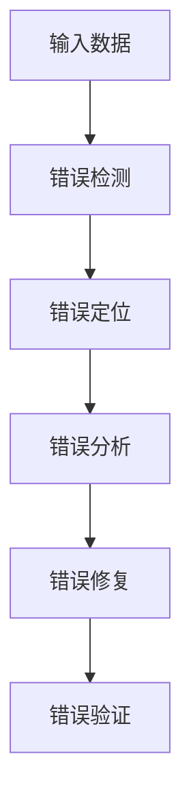
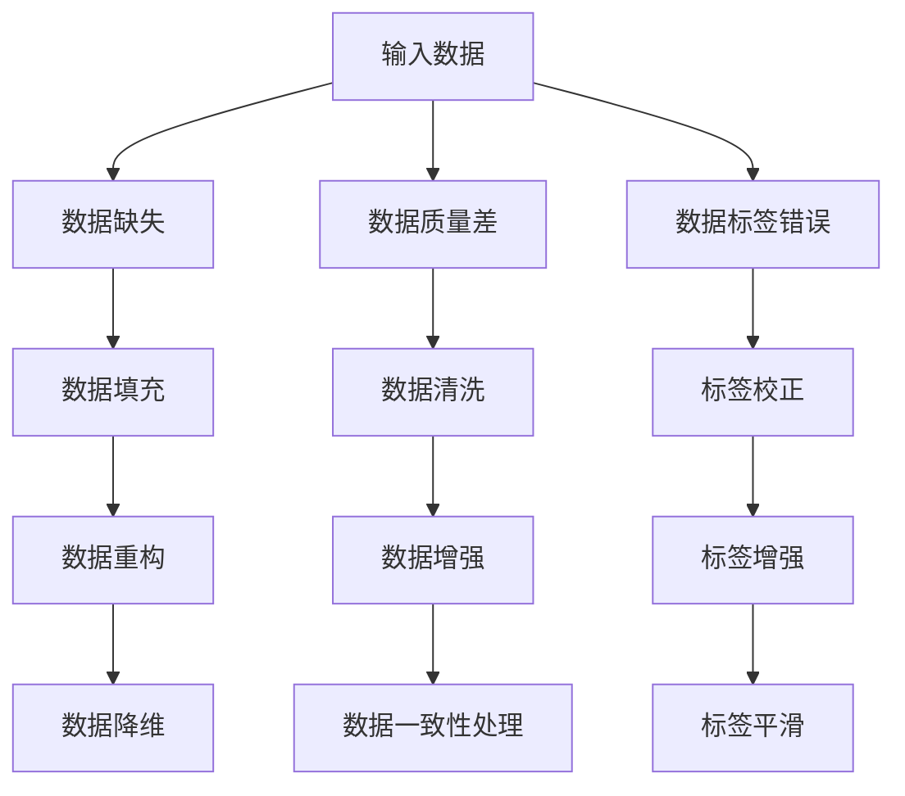
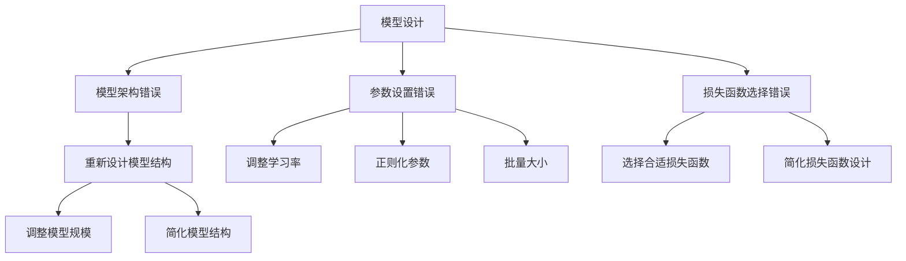
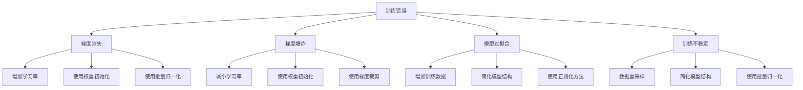
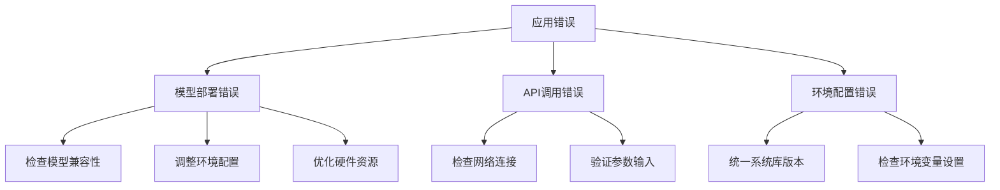
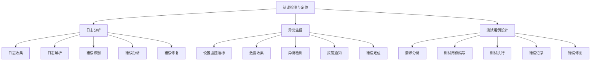
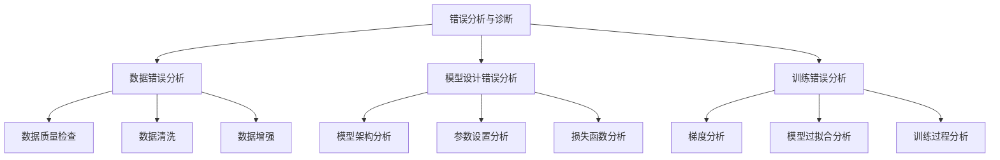
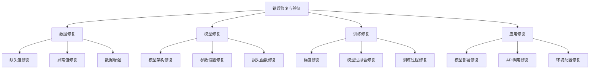

                 

### 第1章: LLM应用开发中的错误分析与修复流程概述

#### 1.1.1 问题背景

近年来，大型语言模型（LLM）在自然语言处理（NLP）领域取得了显著进展。LLM的应用场景日益广泛，包括文本生成、机器翻译、问答系统等。这些模型基于深度学习技术，通过学习大量文本数据来生成或理解自然语言。随着模型规模的不断扩大和应用场景的多样化，LLM在应用开发过程中不可避免地会遇到各种错误。

这些错误可能源于模型训练数据的问题、模型设计的不当、或是实际应用中的环境因素。错误分析是LLM应用开发中至关重要的一环，能够帮助开发者快速定位问题，从而提高模型性能和用户体验。

#### 1.1.2 问题描述

LLM应用开发中的错误主要包括以下几类：

1. **输入数据错误**：如数据缺失、数据质量差、数据标签错误等。数据是模型的训练基础，数据质量直接影响模型的效果。若输入数据存在错误，可能导致模型训练结果不佳。

2. **模型设计错误**：如模型架构不当、参数设置不合理、损失函数选择错误等。模型设计是决定模型性能的关键因素，若设计不当，可能导致模型无法达到预期效果。

3. **训练错误**：如梯度消失、梯度爆炸、模型过拟合等。训练过程中可能遇到各种问题，这些问题可能导致模型训练失败或效果不佳。

4. **应用错误**：如模型部署后的问题、环境配置错误、API调用错误等。在实际应用中，模型可能面临各种环境变化，如硬件资源不足、网络延迟等，这些都会影响模型的性能。

#### 1.1.3 问题解决

为了解决上述错误，开发者需要采取一系列措施，包括：

1. **错误检测与定位**：通过日志分析、异常监控、测试用例设计等方法，快速发现并定位错误。有效的错误检测和定位能够大大提高问题解决的效率。

2. **错误分析与诊断**：根据错误的类型和特点，采用相应的分析方法，如数据清洗、模型调试、性能调优等。错误分析是问题解决的关键，能够帮助开发者找到错误的根本原因。

3. **错误修复与验证**：针对诊断结果，采取相应的修复措施，并进行验证，确保错误得到彻底解决。错误修复是解决问题的最后一步，必须确保修复方案的有效性。

#### 1.1.4 边界与外延

本书主要关注LLM应用开发中的错误分析与修复流程，涵盖从错误检测到错误修复的整个过程。然而，实际应用中的错误类型和修复方法可能更加复杂和多样化。因此，本书所提供的方法和工具仅供参考，开发者需要结合具体应用场景进行灵活调整。

#### 1.1.5 概念结构与核心要素组成

LLM应用开发中的错误分析与修复流程包括以下几个核心要素：

1. **错误检测**：通过各种手段发现潜在的错误。包括日志分析、异常监控、测试用例设计等。

2. **错误定位**：通过日志分析、测试用例等方法，定位具体的错误点。

3. **错误分析**：对错误类型和原因进行深入分析。包括数据错误分析、模型设计错误分析、训练错误分析等。

4. **错误修复**：根据分析结果，采取相应的修复措施。包括数据清洗、模型调整、训练策略优化等。

5. **错误验证**：对修复后的模型进行验证，确保错误得到彻底解决。包括测试用例验证、性能评估等。

#### 表 1.1：错误类型与修复方法

| 错误类型           | 修复方法                                  |
|--------------------|-----------------------------------------|
| 输入数据错误       | 数据清洗、数据增强、数据重构等          |
| 模型设计错误       | 调整模型架构、调整参数设置、更换损失函数等 |
| 训练错误           | 优化训练策略、调整学习率、使用正则化方法等 |
| 应用错误           | 优化部署环境、调试API调用、优化模型部署等 |

#### ER实体关系图

以上为第1章的详细内容。接下来，我们将深入探讨LLM应用开发中的各种错误类型，以及如何进行有效的错误分析和修复。

## 第2章：输入数据错误分析与修复

输入数据是LLM训练的基础，数据质量直接关系到模型的性能。然而，在实际应用中，输入数据往往存在各种问题，如数据缺失、数据质量差、数据标签错误等。这些问题会导致模型训练效果不佳，甚至无法收敛。因此，对输入数据错误进行分析与修复至关重要。

### 2.1 数据缺失

数据缺失是输入数据错误中最常见的问题之一。数据缺失可能导致模型无法获取到足够的训练样本，从而影响模型的泛化能力。解决数据缺失问题通常有以下几种方法：

1. **数据填充**：通过某种算法将缺失的数据填充为合理的值。例如，使用平均值、中位数、众数等方法填充缺失数据。

2. **数据重构**：通过构建新的特征来替代缺失数据。例如，使用特征工程方法提取新的特征，或者使用多模态数据融合技术。

3. **数据降维**：通过降维技术减少数据的维度，从而降低数据缺失的影响。例如，使用主成分分析（PCA）或线性判别分析（LDA）等方法。

### 2.2 数据质量差

数据质量差包括数据噪声、数据冗余、数据不一致等问题。这些问题会影响模型的训练效果和泛化能力。解决数据质量差问题通常有以下几种方法：

1. **数据清洗**：通过删除噪声数据、去除冗余数据、纠正数据不一致等问题，提高数据质量。例如，使用正则化方法去除噪声数据，使用去重技术去除冗余数据。

2. **数据增强**：通过增加新的训练样本来提高数据质量。例如，使用数据扩充技术生成新的训练样本，或者使用迁移学习技术利用已有数据增强新数据。

3. **数据一致性处理**：通过处理数据不一致问题，提高数据的一致性。例如，使用标准化方法处理数据不一致问题，使用一致性检验方法检测数据一致性。

### 2.3 数据标签错误

数据标签错误是指训练数据的标签不准确，这会导致模型在学习过程中产生误导。解决数据标签错误问题通常有以下几种方法：

1. **标签校正**：通过人工或自动方法对错误的标签进行修正。例如，使用标注工具对错误标签进行人工修正，使用机器学习算法自动检测并修正错误标签。

2. **标签增强**：通过增加新的标签来提高数据标签的准确性。例如，使用半监督学习或迁移学习技术利用未标记数据生成新的标签。

3. **标签平滑**：通过降低错误标签对模型训练的影响，从而提高模型的泛化能力。例如，使用标签平滑技术降低错误标签的影响。

### 2.4 小结

输入数据错误对LLM应用开发的影响不容忽视。通过对数据缺失、数据质量差、数据标签错误等问题进行深入分析与修复，可以显著提高模型性能和泛化能力。在实际应用中，开发者应根据具体问题采取相应的解决方案，以确保输入数据的准确性和质量。

### 表 2.1：数据错误类型与修复方法

| 错误类型           | 修复方法                                  |
|--------------------|-----------------------------------------|
| 数据缺失           | 数据填充、数据重构、数据降维              |
| 数据质量差         | 数据清洗、数据增强、数据一致性处理        |
| 数据标签错误       | 标签校正、标签增强、标签平滑              |

### ER实体关系图

以上为第2章的内容。接下来，我们将探讨模型设计错误及其修复方法。

## 第3章：模型设计错误分析与修复

模型设计是LLM应用开发中的关键环节，模型架构、参数设置、损失函数等设计决策直接影响模型的性能和训练效果。然而，在实际应用中，模型设计错误难以避免。因此，对模型设计错误进行分析与修复至关重要。

### 3.1 模型架构错误

模型架构错误是指模型设计不合理或不符合实际应用需求。常见的模型架构错误包括：

1. **模型规模过大或过小**：模型规模过大可能导致训练时间过长、计算资源消耗过多；模型规模过小可能导致模型无法充分捕捉数据特征。

   **解决方案**：根据应用场景和数据规模，选择合适的模型规模。对于大型模型，可以采用分布式训练技术；对于小型模型，可以选择简化版模型架构。

2. **模型结构过于复杂**：过于复杂的模型结构可能导致训练时间过长、计算资源消耗过多，同时可能引入过拟合风险。

   **解决方案**：简化模型结构，减少参数数量，降低模型复杂度。例如，采用预训练技术，使用已有的大型预训练模型作为基础模型，在此基础上进行微调。

3. **模型结构不适合应用场景**：模型结构设计不符合实际应用需求，例如，对于需要捕捉长距离依赖关系的任务，选择了一个不适合的模型架构。

   **解决方案**：根据应用场景重新设计模型结构。例如，对于需要捕捉长距离依赖关系的任务，可以选择Transformer模型或其变种。

### 3.2 参数设置错误

参数设置是模型训练过程中至关重要的一环，参数设置不当可能导致模型训练失败或性能不佳。常见的参数设置错误包括：

1. **学习率设置不合理**：学习率设置过高可能导致模型在训练过程中产生剧烈的梯度震荡，学习率设置过低可能导致模型收敛速度缓慢。

   **解决方案**：根据模型结构和数据规模，选择合适的学习率。常用的学习率调整策略包括逐步衰减学习率、使用自适应学习率优化器等。

2. **正则化参数设置不当**：正则化参数设置过高可能导致模型过拟合，正则化参数设置过低可能导致模型欠拟合。

   **解决方案**：根据模型复杂度和数据规模，选择合适的正则化参数。常用的正则化方法包括L1正则化、L2正则化、Dropout等。

3. **批量大小设置不合理**：批量大小设置过大可能导致梯度估计不准确，批量大小设置过小可能导致训练时间过长。

   **解决方案**：根据计算资源和数据规模，选择合适的批量大小。常用的批量大小设置包括32、64、128等。

### 3.3 损失函数选择错误

损失函数是模型训练的核心指标，损失函数选择错误可能导致模型训练失败或性能不佳。常见的损失函数选择错误包括：

1. **损失函数不适合应用场景**：例如，对于分类任务选择了一个不适合的分类损失函数，如均方误差损失函数。

   **解决方案**：根据应用场景选择合适的损失函数。例如，对于分类任务，可以选择交叉熵损失函数；对于回归任务，可以选择均方误差损失函数。

2. **损失函数设计不合理**：例如，损失函数包含过多的非线性项，导致训练过程不稳定。

   **解决方案**：简化损失函数设计，避免过多的非线性项。例如，选择简单的线性损失函数，或使用更简单的模型架构。

### 3.4 小结

模型设计错误对LLM应用开发的影响显著。通过对模型架构、参数设置、损失函数等设计决策的深入分析与修复，可以显著提高模型性能和训练效果。在实际应用中，开发者应根据具体应用场景和模型特点，采取相应的解决方案，以确保模型设计的合理性。

### 表 3.1：模型设计错误类型与修复方法

| 错误类型           | 修复方法                                  |
|--------------------|-----------------------------------------|
| 模型架构错误       | 重新设计模型结构、调整模型规模、简化模型结构          |
| 参数设置错误       | 调整学习率、正则化参数、批量大小等参数设置          |
| 损失函数选择错误   | 选择合适的损失函数、简化损失函数设计                |

### ER实体关系图

以上为第3章的内容。接下来，我们将探讨训练错误及其修复方法。

## 第4章：训练错误分析与修复

在LLM应用开发过程中，训练错误是常见且复杂的问题。训练错误主要包括梯度消失、梯度爆炸、模型过拟合等，这些问题会影响模型的性能和收敛速度。因此，对训练错误进行分析与修复至关重要。

### 4.1 梯度消失与梯度爆炸

梯度消失和梯度爆炸是训练过程中常见的问题，它们对模型训练产生负面影响。

1. **梯度消失**：在训练过程中，由于参数更新过程中梯度逐渐减小，导致模型参数无法得到有效的更新，从而使模型难以收敛。梯度消失通常发生在深层神经网络中。

   **原因**：梯度消失是由于反向传播过程中，梯度在每个层次上都会乘以前一个层次的误差，而随着层数的增加，梯度会迅速减小。

   **解决方案**：
   - **增加学习率**：适当增加学习率，以补偿梯度消失的影响。
   - **使用权重初始化**：选择合适的权重初始化方法，如高斯分布初始化、Xavier初始化等，以避免梯度消失。
   - **使用批量归一化**：在训练过程中对每个层级的输入进行归一化处理，以稳定梯度。

2. **梯度爆炸**：在训练过程中，由于参数更新过程中梯度逐渐增大，导致模型参数更新过大，从而使模型无法收敛。梯度爆炸通常发生在深层神经网络中。

   **原因**：梯度爆炸是由于反向传播过程中，梯度在每个层次上都会乘以前一个层次的误差，而随着层数的增加，梯度会迅速增大。

   **解决方案**：
   - **减小学习率**：适当减小学习率，以避免梯度爆炸。
   - **使用权重初始化**：选择合适的权重初始化方法，如高斯分布初始化、Xavier初始化等，以避免梯度爆炸。
   - **使用梯度裁剪**：对梯度进行裁剪，以限制梯度的范围。

### 4.2 模型过拟合

模型过拟合是指模型在训练数据上表现良好，但在测试数据上表现不佳，即模型无法泛化到未知数据。过拟合通常发生在训练数据量较少或模型复杂度较高时。

**原因**：
- **训练数据不足**：模型在有限的训练数据上学习过于具体，导致对测试数据的泛化能力不足。
- **模型复杂度过高**：模型在训练数据上捕捉了过多的噪声信息，导致模型过于拟合训练数据。

**解决方案**：
- **增加训练数据**：通过数据增强、数据扩充等方法增加训练数据，以提高模型的泛化能力。
- **简化模型结构**：降低模型复杂度，减少模型参数数量，以避免模型过拟合。
- **使用正则化方法**：如L1正则化、L2正则化、Dropout等方法，以减少模型对训练数据的过拟合。

### 4.3 训练不稳定

训练不稳定是指模型在训练过程中性能波动较大，导致训练效果不稳定。训练不稳定通常发生在训练数据分布不均匀、模型结构复杂时。

**原因**：
- **数据分布不均匀**：训练数据分布不均匀，导致模型在某些数据点上的更新较大，从而影响训练稳定性。
- **模型结构复杂**：模型结构复杂，导致模型参数更新较大，从而影响训练稳定性。

**解决方案**：
- **数据重采样**：通过重采样方法平衡数据分布，以稳定训练过程。
- **简化模型结构**：降低模型复杂度，减少模型参数数量，以稳定训练过程。
- **使用批量归一化**：在训练过程中对每个层级的输入进行归一化处理，以稳定梯度。

### 4.4 小结

训练错误是LLM应用开发中常见且重要的问题。通过对梯度消失、梯度爆炸、模型过拟合、训练不稳定等训练错误进行分析与修复，可以显著提高模型性能和收敛速度。在实际应用中，开发者应根据具体问题和模型特点，采取相应的解决方案，以确保训练过程的稳定性和有效性。

### 表 4.1：训练错误类型与修复方法

| 错误类型           | 修复方法                                  |
|--------------------|-----------------------------------------|
| 梯度消失           | 增加学习率、使用权重初始化、使用批量归一化  |
| 梯度爆炸           | 减小学习率、使用权重初始化、使用梯度裁剪    |
| 模型过拟合         | 增加训练数据、简化模型结构、使用正则化方法  |
| 训练不稳定         | 数据重采样、简化模型结构、使用批量归一化    |

### ER实体关系图

以上为第4章的内容。接下来，我们将探讨应用错误及其修复方法。

## 第5章：应用错误分析与修复

在实际应用过程中，LLM可能会遇到各种环境问题，这些问题统称为应用错误。这些错误可能影响模型的部署效果，导致用户体验下降。因此，对应用错误进行分析与修复至关重要。

### 5.1 模型部署错误

模型部署错误是指在将训练好的模型部署到实际应用环境时出现的问题。这些问题可能包括模型无法正常加载、模型输出结果异常等。

**原因**：
- **模型不兼容**：在模型部署过程中，模型的架构、参数设置等可能与生产环境不兼容。
- **环境配置问题**：部署环境配置不正确，如缺少必要的依赖库、环境变量设置错误等。
- **硬件问题**：硬件资源不足，如内存不足、计算能力不足等。

**解决方案**：
- **检查模型兼容性**：确保模型架构和生产环境兼容。如果使用预训练模型，应确保预训练模型的架构与生产环境一致。
- **调整环境配置**：根据生产环境的需求，调整环境配置。例如，安装必要的依赖库、设置合适的环境变量等。
- **优化硬件资源**：根据模型计算需求，合理配置硬件资源。例如，增加内存、使用高性能GPU等。

### 5.2 API调用错误

API调用错误是指在使用模型进行预测时，由于API调用失败或调用参数错误导致的问题。这些问题可能包括API无法响应、返回错误结果等。

**原因**：
- **网络问题**：网络连接不稳定或网络延迟过高，导致API调用失败。
- **参数错误**：调用API时传入的参数错误，如参数格式不正确、参数值超出范围等。

**解决方案**：
- **检查网络连接**：确保网络连接正常，解决网络不稳定或网络延迟过高的问题。
- **验证参数输入**：确保调用API时传入的参数正确。例如，使用参数验证方法检查参数格式和范围，避免参数错误。

### 5.3 环境配置错误

环境配置错误是指在部署模型时，由于环境配置不正确导致的问题。这些问题可能包括系统库不兼容、环境变量设置错误等。

**原因**：
- **系统库不兼容**：部署环境和训练环境使用的系统库版本不一致，导致模型无法正常加载。
- **环境变量设置错误**：环境变量设置不正确，导致模型无法正确运行。

**解决方案**：
- **统一系统库版本**：确保部署环境和训练环境使用的系统库版本一致。例如，使用统一的Python版本和库版本。
- **检查环境变量**：确保部署环境中的环境变量设置正确。例如，检查模型路径、数据路径等环境变量是否正确设置。

### 5.4 小结

应用错误对LLM的应用效果产生显著影响。通过对模型部署错误、API调用错误、环境配置错误等应用错误进行分析与修复，可以确保模型在部署过程中正常运行，提高用户体验。在实际应用中，开发者应仔细检查和调整环境配置，确保模型能够在各种环境下稳定运行。

### 表 5.1：应用错误类型与修复方法

| 错误类型           | 修复方法                                  |
|--------------------|-----------------------------------------|
| 模型部署错误       | 检查模型兼容性、调整环境配置、优化硬件资源 |
| API调用错误       | 检查网络连接、验证参数输入                  |
| 环境配置错误       | 统一系统库版本、检查环境变量设置            |

### ER实体关系图

以上为第5章的内容。接下来，我们将探讨错误检测与定位的方法。

## 第6章：错误检测与定位

在LLM应用开发过程中，错误检测与定位是确保模型稳定运行的重要环节。有效的错误检测与定位可以帮助开发者快速发现并解决问题，从而提高开发效率和模型性能。本章将介绍几种常见的错误检测与定位方法，包括日志分析、异常监控和测试用例设计。

### 6.1 日志分析

日志分析是错误检测与定位的一种常用方法。通过分析系统生成的日志文件，可以了解系统运行状态、错误信息以及异常行为。以下是日志分析的基本步骤：

1. **日志收集**：收集系统产生的日志文件。这些日志文件通常存储在系统的日志目录中，如Linux系统的`/var/log/`目录。

2. **日志解析**：对日志文件进行解析，提取有用的信息。可以使用文本编辑器、日志分析工具（如Logstash、Kibana）等工具进行日志解析。

3. **错误识别**：根据日志中的错误信息，识别可能存在的错误。例如，根据错误代码、错误描述等识别错误类型。

4. **错误分析**：对识别出的错误进行分析，确定错误的根本原因。可以通过查阅系统文档、错误日志、代码实现等进行分析。

5. **错误修复**：根据错误分析结果，采取相应的修复措施。例如，修复代码错误、调整系统配置等。

### 6.2 异常监控

异常监控是实时监测系统运行状态的一种方法。通过异常监控，可以及时发现系统运行中的异常情况，从而快速定位并解决问题。以下是异常监控的基本步骤：

1. **设置监控指标**：根据系统需求，设置需要监控的指标。例如，CPU使用率、内存使用率、磁盘占用率、网络延迟等。

2. **数据收集**：通过系统内置的监控工具（如Prometheus、Grafana）或第三方监控工具，收集系统运行数据。

3. **异常检测**：对收集到的数据进行分析，识别异常情况。可以使用统计方法、机器学习方法等检测异常。

4. **报警通知**：当检测到异常时，生成报警通知。通知可以通过邮件、短信、微信等渠道发送。

5. **错误定位**：根据报警信息，定位异常发生的具体位置和原因。例如，根据日志文件、代码实现等定位错误。

### 6.3 测试用例设计

测试用例设计是验证系统功能和性能的一种方法。通过设计合理的测试用例，可以全面覆盖系统功能，发现潜在的错误。以下是测试用例设计的基本步骤：

1. **需求分析**：分析系统需求，确定需要测试的功能点。

2. **测试用例编写**：根据需求分析结果，编写测试用例。测试用例应包括输入数据、预期输出、测试步骤等。

3. **测试执行**：执行测试用例，验证系统功能。可以使用自动化测试工具（如Selenium、JUnit）进行测试执行。

4. **错误记录**：在测试过程中，记录发现的所有错误。错误记录应包括错误现象、错误原因、修复措施等。

5. **错误修复**：根据错误记录，修复系统中的错误。

### 6.4 小结

错误检测与定位是LLM应用开发中的重要环节。通过日志分析、异常监控和测试用例设计等方法，可以有效地发现并定位错误，从而提高开发效率和模型性能。在实际应用中，开发者应根据具体需求，选择合适的错误检测与定位方法，确保模型稳定运行。

### 表 6.1：错误检测与定位方法

| 方法         | 步骤                                                         |
|--------------|--------------------------------------------------------------|
| 日志分析     | 1. 日志收集 2. 日志解析 3. 错误识别 4. 错误分析 5. 错误修复 |
| 异常监控     | 1. 设置监控指标 2. 数据收集 3. 异常检测 4. 报警通知 5. 错误定位 |
| 测试用例设计 | 1. 需求分析 2. 测试用例编写 3. 测试执行 4. 错误记录 5. 错误修复 |

### ER实体关系图

以上为第6章的内容。接下来，我们将探讨错误分析与诊断的方法。

## 第7章：错误分析与诊断

在LLM应用开发过程中，错误分析与诊断是确保模型稳定运行的关键环节。通过深入分析错误原因和影响，开发者可以采取有效的修复措施，从而提高模型性能和用户体验。本章将介绍几种常见的错误分析与诊断方法，包括数据错误分析、模型设计错误分析和训练错误分析。

### 7.1 数据错误分析

数据错误分析是确保模型训练数据质量的重要步骤。数据错误可能包括数据缺失、数据质量差和数据标签错误等问题。以下是数据错误分析的基本方法：

1. **数据质量检查**：
   - **缺失值检查**：使用统计方法检查数据集中的缺失值，如使用`isnull()`函数检查Pandas DataFrame中的缺失值。
   - **异常值检测**：使用统计方法（如IQR法、Z分数法）检测数据集中的异常值，如使用`numpy`库中的`zscore()`函数计算Z分数。
   - **数据分布检查**：检查数据集的分布情况，如使用`hist()`函数绘制直方图，分析数据的偏态和峰度。

2. **数据清洗**：
   - **缺失值处理**：根据数据的重要性和缺失率，选择合适的处理方法。例如，使用平均值、中位数、众数等方法填充缺失值，或使用插值法、降维法等方法处理缺失值。
   - **异常值处理**：根据异常值的影响程度，选择合适的处理方法。例如，删除异常值、用平均值或中位数替换异常值，或使用机器学习算法进行异常值预测。
   - **数据标准化**：对数据进行标准化处理，如使用Z分数标准化、MinMax标准化等，以消除数据分布差异对模型训练的影响。

3. **数据增强**：
   - **数据扩充**：通过生成新的数据样本，增加训练数据量，如使用图像生成、文本生成等技术。
   - **数据融合**：将多个数据源进行融合，提高数据质量，如使用多模态数据融合技术。

### 7.2 模型设计错误分析

模型设计错误分析是评估模型架构、参数设置和损失函数等设计决策合理性的过程。以下是一些常见的模型设计错误及其分析方法：

1. **模型架构分析**：
   - **层间关系分析**：检查模型各层之间的关系，如层与层之间的连接方式、层与层之间的传递机制等。
   - **层间连接分析**：检查模型各层之间的连接是否合理，如使用卷积层和全连接层的连接方式等。

2. **参数设置分析**：
   - **学习率分析**：检查学习率的设置是否合理，如学习率过高可能导致梯度震荡，学习率过低可能导致收敛缓慢。
   - **正则化参数分析**：检查正则化参数的设置是否合理，如L1和L2正则化参数的选择等。

3. **损失函数分析**：
   - **损失函数适用性分析**：检查损失函数是否适用于特定的任务，如对于分类任务，选择交叉熵损失函数；对于回归任务，选择均方误差损失函数。

### 7.3 训练错误分析

训练错误分析是评估模型训练过程中可能出现的问题，如梯度消失、梯度爆炸、模型过拟合等。以下是一些常见的训练错误及其分析方法：

1. **梯度分析**：
   - **梯度消失分析**：检查模型训练过程中是否存在梯度消失现象，如检查梯度值是否过小。
   - **梯度爆炸分析**：检查模型训练过程中是否存在梯度爆炸现象，如检查梯度值是否过大。

2. **模型过拟合分析**：
   - **过拟合指标分析**：检查模型的训练误差和验证误差，判断模型是否出现过拟合现象。过拟合指标包括交叉验证误差、学习曲线等。

3. **训练过程分析**：
   - **学习率调整分析**：检查学习率的调整过程，如逐步衰减学习率、自适应学习率等。
   - **正则化方法分析**：检查模型中使用的正则化方法，如L1、L2正则化、Dropout等。

### 7.4 小结

错误分析与诊断是LLM应用开发中至关重要的一环。通过对数据错误、模型设计错误和训练错误进行深入分析与诊断，开发者可以找到错误的根本原因，并采取相应的修复措施。在实际应用中，开发者应根据具体问题和模型特点，选择合适的分析和诊断方法，以确保模型稳定运行和性能优化。

### 表 7.1：错误类型与诊断方法

| 错误类型       | 诊断方法                                  |
|----------------|-----------------------------------------|
| 数据错误       | 数据质量检查、数据清洗、数据增强        |
| 模型设计错误   | 模型架构分析、参数设置分析、损失函数分析 |
| 训练错误       | 梯度分析、模型过拟合分析、训练过程分析   |

### ER实体关系图

以上为第7章的内容。接下来，我们将探讨错误修复与验证的方法。

## 第8章：错误修复与验证

在LLM应用开发过程中，错误修复与验证是确保模型稳定运行和性能优化的关键步骤。通过有效的修复措施和验证方法，开发者可以确保错误得到彻底解决，同时提高模型性能和用户体验。本章将介绍几种常见的错误修复与验证方法，包括数据修复、模型修复、训练修复和应用修复。

### 8.1 数据修复

数据修复是解决输入数据错误的关键步骤。以下是一些常见的数据修复方法：

1. **缺失值修复**：
   - **填充缺失值**：使用平均值、中位数、众数等方法填充缺失值。
   - **插值法**：使用线性插值、高斯插值等方法填补缺失值。
   - **迁移学习**：使用迁移学习方法，利用预训练模型填补缺失值。

2. **异常值修复**：
   - **删除异常值**：删除对模型训练影响较大的异常值。
   - **替换异常值**：使用平均值、中位数等方法替换异常值。
   - **聚类分析**：使用聚类分析方法，将异常值划分到不同的类别中，然后对每个类别进行单独处理。

3. **数据增强**：
   - **生成新数据**：使用生成对抗网络（GAN）、文本生成模型等方法生成新的训练数据。
   - **数据扩充**：使用数据增强技术，如旋转、翻转、缩放等，增加训练数据量。

### 8.2 模型修复

模型修复是解决模型设计错误的关键步骤。以下是一些常见的模型修复方法：

1. **模型架构修复**：
   - **调整模型规模**：根据应用需求，调整模型的层数、神经元数量等参数。
   - **简化模型结构**：去除不必要的层和连接，简化模型结构。
   - **更换模型架构**：根据应用场景，选择更合适的模型架构，如从CNN更换为RNN或BERT等。

2. **参数设置修复**：
   - **调整学习率**：根据模型收敛情况，调整学习率，如使用自适应学习率优化器。
   - **调整正则化参数**：根据模型过拟合程度，调整正则化参数，如L1、L2正则化。
   - **批量大小调整**：根据计算资源和训练效果，调整批量大小，如使用动态批量大小调整策略。

3. **损失函数修复**：
   - **更换损失函数**：根据任务需求，选择更合适的损失函数，如从均方误差更换为交叉熵。
   - **优化损失函数**：对现有的损失函数进行优化，如使用自定义损失函数。

### 8.3 训练修复

训练修复是解决训练错误的关键步骤。以下是一些常见的训练修复方法：

1. **梯度修复**：
   - **梯度裁剪**：限制梯度值的大小，避免梯度爆炸。
   - **权重初始化**：使用合适的权重初始化方法，如Xavier初始化、He初始化。
   - **批量归一化**：对每个层级的输入进行归一化处理，稳定梯度。

2. **模型过拟合修复**：
   - **增加训练数据**：通过数据增强、数据扩充等方法增加训练数据。
   - **简化模型结构**：降低模型复杂度，减少参数数量。
   - **使用正则化方法**：使用L1、L2正则化、Dropout等方法减少过拟合。

3. **训练过程修复**：
   - **调整学习率**：根据模型收敛情况，调整学习率。
   - **增加训练轮数**：延长训练时间，增加训练轮数，使模型充分收敛。
   - **使用迁移学习**：使用预训练模型作为基础模型，进行迁移学习。

### 8.4 应用修复

应用修复是解决模型部署和应用过程中出现的问题的关键步骤。以下是一些常见应用修复方法：

1. **模型部署修复**：
   - **检查模型兼容性**：确保模型架构和生产环境兼容。
   - **调整环境配置**：根据生产环境的需求，调整环境配置，如安装必要的依赖库、设置合适的环境变量等。
   - **优化硬件资源**：根据模型计算需求，合理配置硬件资源，如增加内存、使用高性能GPU等。

2. **API调用修复**：
   - **检查网络连接**：确保网络连接正常，解决网络不稳定或网络延迟过高的问题。
   - **验证参数输入**：确保调用API时传入的参数正确，如使用参数验证方法检查参数格式和范围。

3. **环境配置修复**：
   - **统一系统库版本**：确保部署环境和训练环境使用的系统库版本一致。
   - **检查环境变量**：确保部署环境中的环境变量设置正确，如模型路径、数据路径等。

### 8.5 小结

错误修复与验证是LLM应用开发中不可或缺的一环。通过对数据修复、模型修复、训练修复和应用修复等方法，开发者可以确保错误得到彻底解决，同时提高模型性能和用户体验。在实际应用中，开发者应根据具体问题和模型特点，选择合适的修复与验证方法，确保模型稳定运行和性能优化。

### 表 8.1：错误类型与修复方法

| 错误类型       | 修复方法                                  |
|----------------|-----------------------------------------|
| 数据错误       | 缺失值修复、异常值修复、数据增强          |
| 模型设计错误   | 模型架构修复、参数设置修复、损失函数修复  |
| 训练错误       | 梯度修复、模型过拟合修复、训练过程修复   |
| 应用错误       | 模型部署修复、API调用修复、环境配置修复  |

### ER实体关系图

以上为第8章的内容。接下来，我们将总结整篇文章，并给出一些最佳实践建议。

## 总结

本文详细介绍了LLM应用开发中的错误分析与修复流程。首先，我们从问题背景、问题描述、问题解决、边界与外延等方面，对LLM应用开发中的错误进行了概述。接着，我们分别探讨了输入数据错误、模型设计错误、训练错误和应用错误的类型，以及相应的分析和修复方法。

1. **输入数据错误**：我们介绍了数据缺失、数据质量差和数据标签错误等问题的解决方法，如数据填充、数据清洗、数据增强、数据重构等。

2. **模型设计错误**：我们分析了模型架构错误、参数设置错误和损失函数选择错误的原因和解决方案，如调整模型架构、优化参数设置、选择合适的损失函数等。

3. **训练错误**：我们探讨了梯度消失、梯度爆炸、模型过拟合等训练错误的诊断和修复方法，如使用权重初始化、批量归一化、梯度裁剪、正则化等方法。

4. **应用错误**：我们介绍了模型部署错误、API调用错误和环境配置错误的修复方法，如检查模型兼容性、调整环境配置、优化硬件资源等。

在错误检测与定位、错误分析和诊断、错误修复与验证等环节，我们分别介绍了日志分析、异常监控、测试用例设计等方法，帮助开发者快速定位并解决问题。

## 最佳实践建议

1. **数据质量管理**：在模型训练前，务必对输入数据进行全面的质量检查和清洗，确保数据质量。

2. **模型设计与优化**：在设计模型时，根据应用场景和数据规模，选择合适的模型架构和参数设置。在模型训练过程中，及时调整学习率、正则化参数等，以优化模型性能。

3. **梯度稳定性管理**：在使用深度学习框架时，注意设置合适的权重初始化方法，如Xavier初始化、He初始化，以避免梯度消失和梯度爆炸。

4. **持续监控与优化**：在模型部署后，定期对模型进行性能监控和优化，确保模型在实际应用中稳定运行。

5. **文档与代码管理**：编写详细的文档和高质量的代码，便于后续的维护和优化。

## 注意事项

1. **数据隐私与安全**：在处理敏感数据时，务必确保数据隐私和安全，遵循相关法律法规。

2. **计算资源规划**：在模型训练和部署过程中，合理规划计算资源，避免资源浪费。

3. **版本控制**：使用版本控制工具（如Git），确保代码和模型的版本一致性。

## 拓展阅读

1. **《深度学习》（Goodfellow, Bengio, Courville）**：这是一本经典的深度学习教材，详细介绍了深度学习的基本原理和实战技巧。

2. **《动手学深度学习》（Zhang, Lipton, coronel, Bauer）**：这本书通过丰富的实战案例，介绍了深度学习的基本概念和实战技巧。

3. **《机器学习实战》（Hastie, Tibshirani, Friedman）**：这本书介绍了多种机器学习算法的原理和实现，适合初学者入门。

作者：AI天才研究院/AI Genius Institute & 禅与计算机程序设计艺术 /Zen And The Art of Computer Programming

## 结束语

本文从多个角度深入探讨了LLM应用开发中的错误分析与修复流程，为开发者提供了实用的方法和技巧。希望读者通过本文的学习，能够更好地应对LLM应用开发中的各种问题，提高模型性能和用户体验。在未来的研究和实践中，我们期待读者能够不断探索和优化，为LLM技术的发展贡献自己的力量。

