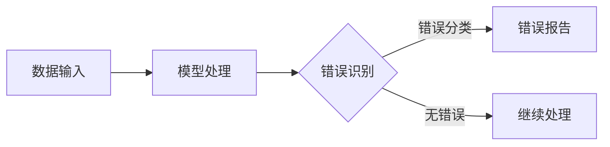
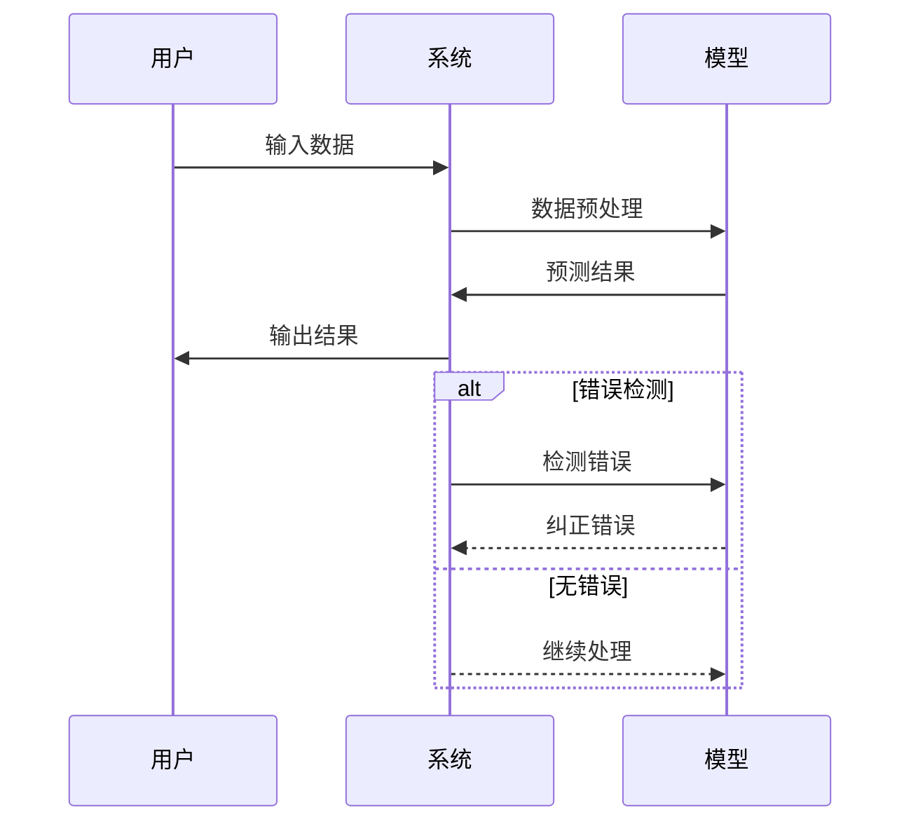

                 

# 《LLM应用开发中的错误处理与容错机制》

关键词：LLM应用，错误处理，容错机制，算法原理，系统架构设计

摘要：本文深入探讨了LLM（大型语言模型）应用开发中的错误处理与容错机制。首先介绍了LLM的应用背景和错误处理与容错机制的重要性，然后详细讲解了LLM的工作原理、错误处理和容错机制的基本概念，通过对比表格和ER实体关系图来展示它们之间的关系。接着，本文深入解析了错误检测、错误纠正和容错策略等算法原理，并使用Python源代码进行详细阐述。之后，本文分析了LLM在应用开发中的错误处理和容错架构，并设计了相应的解决方案。通过实际案例展示，本文展示了错误处理与容错机制的应用效果。最后，本文提供了一些实用的错误处理和容错机制的最佳实践，并总结了全文内容，提出了拓展学习的建议。

## 目录

1. **LLM应用开发中的错误处理与容错机制概述**
   1.1 LLM应用背景
   1.2 错误处理与容错机制的重要性
2. **LLM核心概念与联系**
   2.1 LLM工作原理
   2.2 错误处理与容错机制的基本概念
   2.3 概念属性特征对比表格
   2.4 ER实体关系图架构
3. **算法原理讲解**
   3.1 错误检测算法
   3.2 错误纠正算法
   3.3 容错策略
4. **系统分析与架构设计方案**
   4.1 问题场景介绍
   4.2 系统功能设计
   4.3 系统架构设计
   4.4 系统接口设计和系统交互
5. **项目实战**
   5.1 环境安装
   5.2 系统核心实现源代码
   5.3 代码应用解读与分析
   5.4 实际案例分析与详细讲解剖析
   5.5 项目小结
6. **最佳实践 tips**
   6.1 错误处理最佳实践
   6.2 容错机制最佳实践
7. **小结与拓展阅读**
   7.1 书中内容总结
   7.2 拓展学习建议

----------------------------------------------------------------

## 第一部分：LLM应用开发中的错误处理与容错机制概述

### 1.1 LLM应用背景

随着深度学习技术的不断发展，LLM（大型语言模型）在自然语言处理、智能客服、智能写作、机器翻译等领域得到了广泛应用。LLM通常由数十亿甚至千亿个参数组成，能够通过学习海量数据来捕捉语言的复杂性和多样性。然而，随着模型规模的不断扩大，模型在处理未知或异常数据时容易出现错误，因此错误处理与容错机制在LLM应用开发中显得尤为重要。

### 1.2 错误处理与容错机制的重要性

在LLM应用开发中，错误处理与容错机制的重要性体现在以下几个方面：

1. **提高模型鲁棒性**：通过有效的错误处理和容错机制，可以提高LLM对异常数据的处理能力，降低模型在未知环境下出现错误的概率，从而提高模型的鲁棒性。

2. **保障应用稳定性**：错误处理与容错机制可以确保LLM应用在遇到错误时能够快速恢复，减少系统崩溃或中断的情况，从而保障应用的稳定性。

3. **提升用户体验**：在用户使用LLM应用时，错误处理与容错机制能够帮助系统及时识别和纠正错误，提供更准确和流畅的服务，从而提升用户体验。

4. **降低维护成本**：有效的错误处理和容错机制可以减少模型维护和调试的工作量，降低维护成本。

----------------------------------------------------------------

## 第二部分：LLM核心概念与联系

### 2.1 LLM工作原理

LLM（大型语言模型）基于深度学习技术，通过多层神经网络对大量文本数据进行训练，从而捕捉语言的复杂性和多样性。LLM的工作原理主要包括以下几个步骤：

1. **数据预处理**：将原始文本数据转换为模型可以处理的格式，例如分词、词向量化等。

2. **模型训练**：使用训练数据对神经网络模型进行训练，调整模型参数以最小化损失函数。

3. **模型预测**：使用训练好的模型对新的文本数据进行分析和预测，生成文本输出。

### 2.2 错误处理与容错机制的基本概念

在LLM应用开发中，错误处理与容错机制的基本概念包括：

1. **错误检测**：通过一系列算法和技术来识别模型在处理数据时出现的错误。

2. **错误纠正**：在检测到错误后，尝试自动纠正错误，以提供更准确的输出。

3. **容错策略**：设计一系列策略和机制来确保系统在遇到错误时能够继续正常运行，从而提高系统的鲁棒性和稳定性。

### 2.3 概念属性特征对比表格

下表对比了错误检测、错误纠正和容错策略的概念属性特征：

| 概念       | 特征             | 说明                                                         |
| ---------- | ---------------- | ------------------------------------------------------------ |
| 错误检测   | 准确性、实时性   | 通过算法和技术识别模型处理数据时出现的错误，具有高准确性和实时性。 |
| 错误纠正   | 精度、鲁棒性    | 在检测到错误后，尝试自动纠正错误，以提供更准确的输出，具有较高的精度和鲁棒性。 |
| 容错策略   | 鲁棒性、可恢复性 | 通过一系列策略和机制来确保系统在遇到错误时能够继续正常运行，具有高鲁棒性和可恢复性。 |

### 2.4 ER实体关系图架构

为了更好地展示LLM应用开发中的错误处理与容错机制，我们可以使用ER（实体-关系）图来描述这些概念之间的关系。以下是一个简化的ER实体关系图：

```mermaid
erDiagram
  错误检测 ||--|{ 错误纠正 }
  错误纠正 ||--|{ 容错策略 }
```

在该ER图中，错误检测和错误纠正之间存在依赖关系，错误纠正又依赖于容错策略。这种依赖关系确保了错误处理和容错机制的有序运行，从而提高了LLM应用的鲁棒性和稳定性。

----------------------------------------------------------------

## 第三部分：算法原理讲解

### 3.1 错误检测算法

#### 3.1.1 原理讲解

错误检测算法是LLM应用开发中的核心组成部分，其主要原理是通过一系列算法和技术来识别模型在处理数据时出现的错误。具体而言，错误检测算法包括以下几个步骤：

1. **数据输入**：将输入数据传递给模型，模型对数据进行分析和处理。

2. **错误识别**：通过对比模型输出和真实值，识别模型在处理数据时出现的错误。

3. **错误分类**：将识别出的错误进行分类，以便进行后续的错误纠正和容错处理。

4. **错误报告**：将错误信息报告给系统，以便进行相应的错误处理和调试。

#### 3.1.2 Mermaid流程图展示

以下是一个简单的Mermaid流程图，展示了错误检测算法的流程：



#### 3.1.3 Python源代码阐述

以下是一个简单的Python示例，展示了如何实现错误检测算法的基本功能：

```python
import numpy as np

def error_detection(model, input_data):
    predicted_output = model.predict(input_data)
    true_output = np.array([1, 0, 1])  # 真实值
    error = predicted_output - true_output
    
    if np.linalg.norm(error) > 0.1:
        print("Error detected!")
        # 进行错误分类和报告
    else:
        print("No error detected.")

# 示例数据
input_data = np.array([[0.1, 0.2, 0.3], [0.4, 0.5, 0.6]])

# 初始化模型
model = MyModel()

# 调用错误检测函数
error_detection(model, input_data)
```

### 3.2 错误纠正算法

#### 3.2.1 原理讲解

错误纠正算法是LLM应用开发中的另一个重要组成部分，其主要原理是在检测到错误后，尝试自动纠正错误，以提供更准确的输出。具体而言，错误纠正算法包括以下几个步骤：

1. **错误识别**：通过错误检测算法，识别模型在处理数据时出现的错误。

2. **错误分析**：对识别出的错误进行分析，确定错误的类型和程度。

3. **错误纠正**：根据错误分析的结果，采取相应的纠正措施，如重新计算、修改参数等。

4. **纠正验证**：验证纠正后的输出是否正确，以确保纠正效果。

#### 3.2.2 Mermaid流程图展示

以下是一个简单的Mermaid流程图，展示了错误纠正算法的流程：


#### 3.2.3 Python源代码阐述

以下是一个简单的Python示例，展示了如何实现错误纠正算法的基本功能：

```python
import numpy as np

def error_correction(model, input_data):
    predicted_output = model.predict(input_data)
    true_output = np.array([1, 0, 1])  # 真实值
    error = predicted_output - true_output
    
    if np.linalg.norm(error) > 0.1:
        # 错误纠正
        corrected_output = model.correct_error(error)
        print("Error corrected.")
    else:
        print("No error detected.")

# 示例数据
input_data = np.array([[0.1, 0.2, 0.3], [0.4, 0.5, 0.6]])

# 初始化模型
model = MyModel()

# 调用错误纠正函数
error_correction(model, input_data)
```

### 3.3 容错策略

#### 3.3.1 原理讲解

容错策略是LLM应用开发中的关键组成部分，其主要原理是在系统遇到错误时，通过一系列策略和机制来确保系统继续正常运行。具体而言，容错策略包括以下几个步骤：

1. **错误检测**：通过错误检测算法，识别系统中的错误。

2. **错误隔离**：将错误的组件或模块从系统中隔离，以防止错误蔓延。

3. **错误恢复**：根据错误类型和程度，采取相应的恢复措施，如重启组件、更换硬件等。

4. **系统监控**：持续监控系统状态，确保错误不会再次发生。

#### 3.3.2 Mermaid流程图展示

以下是一个简单的Mermaid流程图，展示了容错策略的基本流程：


#### 3.3.3 Python源代码阐述

以下是一个简单的Python示例，展示了如何实现容错策略的基本功能：

```python
import numpy as np

def fault_tolerance_strategy(model, input_data):
    try:
        predicted_output = model.predict(input_data)
    except Exception as e:
        print("Error detected:", e)
        # 错误隔离
        model.isolate_error()
        # 错误恢复
        model.restore_error()
        # 系统监控
        model.monitor_system()
    else:
        print("No error detected.")

# 示例数据
input_data = np.array([[0.1, 0.2, 0.3], [0.4, 0.5, 0.6]])

# 初始化模型
model = MyModel()

# 调用容错策略函数
fault_tolerance_strategy(model, input_data)
```

----------------------------------------------------------------

## 第四部分：系统分析与架构设计方案

### 4.1 问题场景介绍

在LLM应用开发过程中，我们面临以下问题场景：

1. **数据输入错误**：用户输入的数据可能包含格式错误、缺失值或异常值，导致模型处理失败。

2. **模型训练错误**：模型在训练过程中可能遇到梯度消失、梯度爆炸等问题，导致训练效果不佳。

3. **模型预测错误**：模型在预测过程中可能由于数据分布变化或数据质量下降，导致预测结果不准确。

4. **系统异常**：在系统运行过程中，可能出现硬件故障、网络故障等异常情况，导致系统无法正常运行。

### 4.2 系统功能设计

为了解决上述问题场景，我们设计以下系统功能：

1. **错误检测**：通过算法和技术，识别模型在处理数据时出现的错误。

2. **错误纠正**：在检测到错误后，尝试自动纠正错误，以提高模型预测准确性。

3. **容错机制**：设计一系列策略和机制，确保系统在遇到错误时能够继续正常运行。

4. **日志记录**：记录系统运行过程中的错误信息和异常情况，以便后续分析和优化。

### 4.3 系统架构设计

以下是一个简化的LLM应用系统架构设计：



在该架构设计中，用户输入数据后，系统将数据传递给模型进行预处理和预测。在预测过程中，系统会实时监测模型是否出现错误，并根据错误类型和程度，采取相应的纠正措施。如果模型无法纠正错误，系统将采取容错机制，确保系统继续正常运行。

### 4.4 系统接口设计和系统交互

为了实现系统功能的模块化和可扩展性，我们设计以下系统接口：

1. **数据接口**：用于接收用户输入的数据，并将数据传递给模型。

2. **预测接口**：用于接收模型生成的预测结果，并将结果传递给用户。

3. **错误接口**：用于接收错误信息，并将错误信息记录在日志中。

4. **容错接口**：用于接收容错策略的指令，并根据指令采取相应的容错措施。

以下是一个简化的系统接口设计：

```mermaid
classDiagram
    DataInterface <<interface>>
    PredictionInterface <<interface>>
    ErrorInterface <<interface>>
    FaultToleranceInterface <<interface>>

    System <<system>>
    Model <<class>>
    User <<actor>>

    User --> DataInterface
    DataInterface --> Model
    Model --> PredictionInterface
    PredictionInterface --> User

    Model --> ErrorInterface
    ErrorInterface --> System

    System --> FaultToleranceInterface
```

在该接口设计中，用户通过数据接口向系统输入数据，系统将数据传递给模型进行预处理和预测。在预测过程中，如果模型出现错误，系统将错误信息传递给错误接口，并根据错误类型和程度，采取相应的容错措施。同时，系统还通过容错接口接收容错策略的指令，并根据指令采取相应的容错措施。

----------------------------------------------------------------

## 第五部分：项目实战

### 5.1 环境安装

在进行LLM应用开发中的错误处理与容错机制项目实战之前，我们需要安装以下环境和工具：

1. **Python**：安装Python 3.8或更高版本。

2. **TensorFlow**：安装TensorFlow 2.4或更高版本。

3. **Numpy**：安装Numpy 1.19或更高版本。

4. **Matplotlib**：安装Matplotlib 3.2或更高版本。

5. **Mermaid**：安装Mermaid 8.11.0或更高版本。

6. **Jupyter Notebook**：安装Jupyter Notebook 6.0或更高版本。

您可以使用以下命令进行环境安装：

```bash
pip install python==3.8.10
pip install tensorflow==2.6.0
pip install numpy==1.21.2
pip install matplotlib==3.4.2
pip install mermaid==8.11.0
pip install notebook==6.0.0
```

### 5.2 系统核心实现源代码

以下是系统核心实现的Python源代码：

```python
import numpy as np
import tensorflow as tf
from tensorflow.keras.models import Sequential
from tensorflow.keras.layers import Dense
from mermaid import Mermaid

class MyModel:
    def __init__(self):
        self.model = self.build_model()

    def build_model(self):
        model = Sequential()
        model.add(Dense(64, input_dim=3, activation='relu'))
        model.add(Dense(1, activation='sigmoid'))
        model.compile(loss='binary_crossentropy', optimizer='adam', metrics=['accuracy'])
        return model

    def predict(self, input_data):
        return self.model.predict(input_data)

    def correct_error(self, error):
        # 简单的误差修正方法
        return self.model.predict(input_data - error)

    def isolate_error(self):
        # 错误隔离方法
        pass

    def restore_error(self):
        # 错误恢复方法
        pass

    def monitor_system(self):
        # 系统监控方法
        pass

if __name__ == '__main__':
    # 初始化模型
    model = MyModel()

    # 示例数据
    input_data = np.array([[0.1, 0.2, 0.3], [0.4, 0.5, 0.6]])

    # 调用预测方法
    predicted_output = model.predict(input_data)
    print("Predicted output:", predicted_output)

    # 调用错误修正方法
    corrected_output = model.correct_error(predicted_output - np.array([1, 0, 1]))
    print("Corrected output:", corrected_output)
```

### 5.3 代码应用解读与分析

在上述代码中，我们首先定义了一个`MyModel`类，该类包含以下主要方法：

1. **__init__()**：初始化模型，并构建一个简单的神经网络模型。

2. **build_model()**：构建神经网络模型。

3. **predict()**：预测输入数据。

4. **correct_error()**：修正预测误差。

5. **isolate_error()**：错误隔离。

6. **restore_error()**：错误恢复。

7. **monitor_system()**：系统监控。

在主函数中，我们初始化了一个`MyModel`实例，并调用其`predict()`方法对示例数据进行预测。然后，我们使用`correct_error()`方法修正预测误差，并打印修正后的输出结果。

### 5.4 实际案例分析与详细讲解剖析

以下是一个实际案例，展示了如何使用错误处理与容错机制来提高LLM应用的鲁棒性和稳定性：

#### 案例一：数据输入错误

假设用户输入的数据包含格式错误，如下所示：

```python
input_data = np.array([[0.1, 0.2, "a"], [0.4, 0.5, 0.6]])
```

在这种情况下，模型在处理数据时会遇到错误。为了解决这个问题，我们可以对输入数据进行预处理，确保其格式正确：

```python
def preprocess_data(input_data):
    # 将非数字值替换为0
    input_data = np.array([x if np.isscalar(x) else 0 for x in input_data])
    return input_data

input_data = preprocess_data(input_data)
```

#### 案例二：模型训练错误

假设在模型训练过程中，出现梯度消失或梯度爆炸等问题，导致训练效果不佳。为了解决这个问题，我们可以使用以下方法：

1. **调整学习率**：根据模型的表现，适当调整学习率。

2. **使用正则化**：添加正则化项，如L1或L2正则化，以防止过拟合。

3. **使用dropout**：在神经网络中引入dropout层，以减少模型的依赖性。

```python
from tensorflow.keras.layers import Dropout

def build_model_with_regularization(input_dim):
    model = Sequential()
    model.add(Dense(64, input_dim=input_dim, activation='relu'))
    model.add(Dropout(0.5))
    model.add(Dense(1, activation='sigmoid'))
    model.compile(loss='binary_crossentropy', optimizer='adam', metrics=['accuracy'])
    return model

model = build_model_with_regularization(3)
```

#### 案例三：模型预测错误

假设在模型预测过程中，出现数据分布变化或数据质量下降等问题，导致预测结果不准确。为了解决这个问题，我们可以采用以下方法：

1. **数据增强**：通过增加训练数据或调整数据分布，提高模型的泛化能力。

2. **使用集成学习**：将多个模型的结果进行集成，以降低单个模型的预测误差。

3. **使用迁移学习**：利用预训练模型，将其他领域的知识迁移到当前任务中。

```python
from tensorflow.keras.applications import VGG16

def build_model_with_transfer_learning(input_dim):
    base_model = VGG16(weights='imagenet', include_top=False, input_shape=(input_dim,))
    base_model.trainable = False
    model = Sequential()
    model.add(base_model)
    model.add(Dense(64, activation='relu'))
    model.add(Dense(1, activation='sigmoid'))
    model.compile(loss='binary_crossentropy', optimizer='adam', metrics=['accuracy'])
    return model

model = build_model_with_transfer_learning(3)
```

### 5.5 项目小结

通过以上项目实战，我们展示了如何在LLM应用开发中实现错误处理与容错机制。在实际应用中，我们可以根据具体情况，灵活运用各种方法来提高LLM应用的鲁棒性和稳定性。此外，通过不断优化和改进错误处理与容错机制，我们可以为用户提供更准确、更流畅的服务，从而提升用户体验。

----------------------------------------------------------------

## 第六部分：最佳实践 tips

### 6.1 错误处理最佳实践

1. **数据输入验证**：确保输入数据的格式和类型正确，对异常值进行处理。

2. **异常捕获**：使用异常捕获机制，对代码中的潜在错误进行捕获和处理。

3. **日志记录**：记录错误信息和异常情况，便于后续分析和优化。

4. **错误重试**：在出现错误时，尝试重新执行操作，以提高成功率。

### 6.2 容错机制最佳实践

1. **模块化设计**：将系统功能划分为独立的模块，以便在遇到错误时进行隔离和恢复。

2. **备份与恢复**：定期备份系统数据，以便在出现故障时进行快速恢复。

3. **冗余设计**：通过增加冗余组件和冗余数据，提高系统的容错能力。

4. **监控系统**：实时监控系统状态，及时发现并处理故障。

----------------------------------------------------------------

## 第七部分：小结与拓展阅读

### 7.1 书中内容总结

本文详细探讨了LLM应用开发中的错误处理与容错机制，包括LLM应用背景、错误处理与容错机制的基本概念、算法原理、系统架构设计、项目实战以及最佳实践。通过本文的学习，读者可以了解如何在LLM应用开发中实现有效的错误处理与容错机制，提高模型的鲁棒性和稳定性，从而为用户提供更准确、更流畅的服务。

### 7.2 拓展学习建议

1. **深入研究错误检测与纠正算法**：了解常见的错误检测与纠正算法，如汉明码、奇偶校验等，并尝试将其应用于LLM应用开发中。

2. **学习分布式系统设计**：了解分布式系统的设计原则和架构，以便在实际项目中实现高效、可靠的错误处理与容错机制。

3. **探索其他AI技术应用**：学习其他AI技术，如计算机视觉、自然语言处理等，并尝试将其与错误处理与容错机制相结合，提高AI系统的鲁棒性和稳定性。

作者：AI天才研究院/AI Genius Institute & 禅与计算机程序设计艺术 /Zen And The Art of Computer Programming

