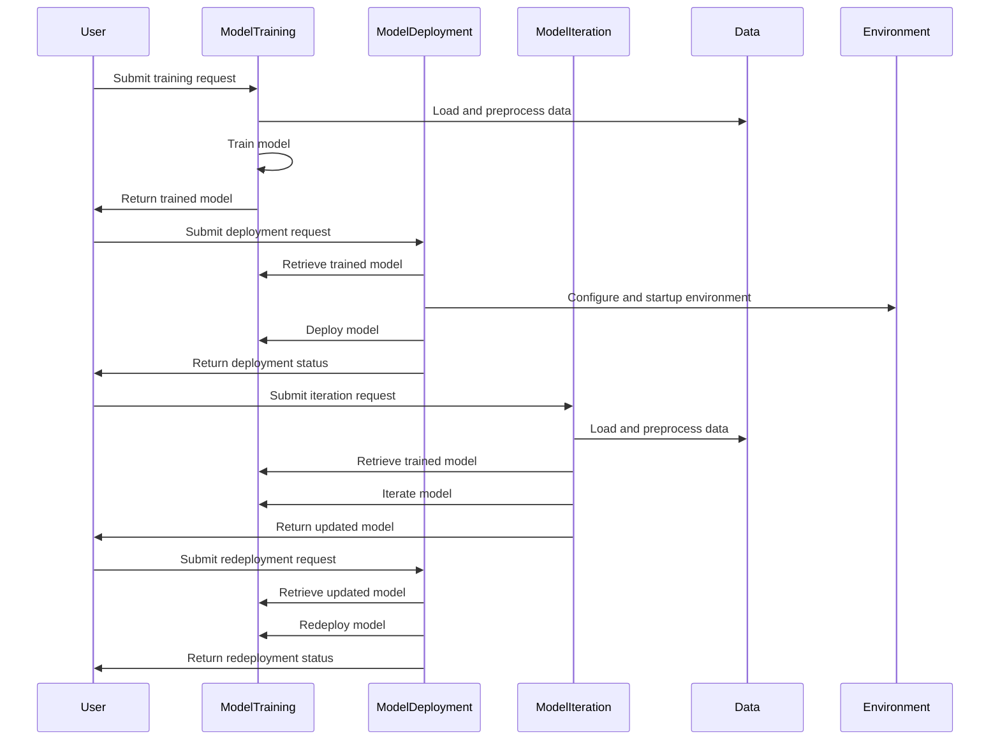

                 

### 第一部分：背景介绍

#### 1.1 问题背景

随着人工智能技术的不断发展，大模型（Large Language Models，简称LLM）在自然语言处理、文本生成、问答系统等领域展现出了强大的能力。这些模型通过大规模的数据训练，能够自动学习并生成符合人类语言习惯的文本，极大地提升了人机交互的效率。然而，在快速迭代和工程化的过程中，如何高效地部署和优化LLM应用成为一个亟待解决的问题。

#### 1.2 问题描述

在现代软件开发中，LLM的应用越来越广泛。然而，传统的软件开发方法和工具在处理LLM时显得力不从心。主要体现在以下几个方面：

- **模型训练与优化困难**：LLM模型的训练需要大量的计算资源和时间，如何高效地进行模型训练和优化是一个重要问题。
- **模型部署与运维挑战**：将训练好的LLM模型部署到生产环境中，需要解决模型的加载、推理、性能优化等问题。
- **模型迭代与更新**：随着用户需求的变化和技术的进步，LLM模型需要不断迭代和更新，如何实现快速迭代和更新也是一个挑战。

#### 1.3 问题解决

为了解决上述问题，我们需要从以下几个方面入手：

- **模型训练与优化**：采用高效的模型训练算法和优化策略，降低训练时间和计算资源的需求。
- **模型部署与运维**：设计一套完善的模型部署和运维方案，确保模型在生产环境中的稳定运行。
- **模型迭代与更新**：建立一套快速迭代和更新的机制，使模型能够快速适应用户需求和技术变化。

#### 1.4 边界与外延

- **边界**：本书主要讨论LLM在工程化应用中的问题解决方案，不涉及LLM的底层算法实现和理论分析。
- **外延**：本书所提供的方法和方案可以应用于各种需要快速迭代和优化的LLM应用场景，如自然语言生成、问答系统、智能客服等。

#### 1.5 概念结构与核心要素组成

- **概念结构**：LLM应用快速迭代的工程化方案包括模型训练、模型部署、模型迭代三个核心部分。
- **核心要素**：模型训练需要数据、算法、计算资源；模型部署需要环境、工具、策略；模型迭代需要需求分析、版本控制、更新机制。

## 第二部分：核心概念与联系

### 2.1 LLM的定义与特点

#### 2.1.1 LLM的定义

LLM（Large Language Model）是一种大规模的预训练语言模型，通过学习大量的文本数据，可以生成符合人类语言习惯的文本。LLM通常具有数十亿甚至数万亿个参数，能够处理复杂的语言结构和语义信息。

#### 2.1.2 LLM的核心特点

1. **大规模**：LLM通常拥有数十亿甚至数万亿个参数，能够处理复杂的语言结构和语义信息。
2. **自适应性**：LLM可以根据不同的应用场景和用户需求进行自适应调整，提高模型的准确性和效率。
3. **高效性**：LLM通过预训练和微调，可以在短时间内完成模型的训练和优化，提高开发效率。

### 2.2 工程化方案的定义与特点

#### 2.2.1 工程化方案的定义

工程化方案是指将理论研究转化为实际应用的一系列方法和步骤，包括模型训练、模型部署、模型迭代等环节。

#### 2.2.2 工程化方案的核心特点

1. **系统化**：工程化方案通过系统化的流程和方法，将理论研究转化为实际应用，提高开发的效率和质量。
2. **可复用性**：工程化方案中的方法和工具可以反复使用，降低开发成本和风险。
3. **可扩展性**：工程化方案可以根据不同的应用场景和需求进行灵活扩展，适应不同的开发环境。

### 2.3 LLM与工程化方案的联系

LLM与工程化方案密切相关。LLM作为工程化方案的核心组件，其性能和效率直接影响工程化方案的效果。同时，工程化方案为LLM的部署、迭代和优化提供了有力的支持。

- **LLM驱动**：工程化方案的核心是LLM的训练和应用，LLM的性能和效率是工程化方案成功的关键。
- **工程化支持**：工程化方案为LLM的部署、迭代和优化提供了技术支持，包括高效的训练算法、优化的部署架构、快速迭代的方法等。

## 第三部分：算法原理讲解

### 3.1 LLM算法原理

LLM算法主要基于深度学习和自然语言处理技术。其核心思想是通过预训练和微调，使模型能够自动学习并生成符合人类语言习惯的文本。

#### 3.1.1 预训练

预训练是指在大规模语料库上进行模型训练，使模型具有通用语言理解能力。预训练通常包括以下步骤：

1. **数据预处理**：对语料库进行清洗、分词、词嵌入等预处理操作。
2. **模型初始化**：使用预训练的模型参数进行初始化。
3. **预训练过程**：通过梯度下降等优化算法，不断更新模型参数，提高模型的性能。

#### 3.1.2 微调

微调是指在使用预训练的LLM模型的基础上，针对特定任务进行进一步的训练。微调通常包括以下步骤：

1. **任务数据准备**：收集和准备与特定任务相关的数据集。
2. **模型结构调整**：根据任务需求，调整LLM模型的结构，如增加或减少层数、调整隐藏层尺寸等。
3. **微调训练**：在任务数据集上进行微调训练，更新模型参数。

#### 3.1.3 生成文本

通过预训练和微调，LLM模型可以生成符合人类语言习惯的文本。生成文本的过程主要包括：

1. **输入文本处理**：将输入的文本进行处理，如分词、编码等。
2. **文本生成**：使用LLM模型对处理后的文本进行预测，生成新的文本。
3. **文本输出**：将生成的文本输出，供用户查看或使用。

### 3.2 算法原理讲解

LLM算法的核心原理是基于深度学习和自然语言处理技术，通过大规模的文本数据训练，使模型能够自动学习并生成符合人类语言习惯的文本。以下是对LLM算法原理的详细讲解：

#### 3.2.1 深度学习原理

深度学习是一种人工智能技术，通过构建深度神经网络（Deep Neural Network，DNN）来模拟人脑的神经元结构，实现从输入到输出的映射。深度学习模型通过多层的非线性变换，逐步提取输入数据的特征，并利用这些特征进行分类、回归或其他任务。

在LLM算法中，深度学习模型主要用于对文本数据进行编码和解码。编码器（Encoder）将输入的文本序列转化为固定长度的向量表示，解码器（Decoder）则根据编码器的输出生成新的文本序列。

#### 3.2.2 自然语言处理技术

自然语言处理（Natural Language Processing，NLP）是人工智能的一个重要分支，旨在使计算机理解和处理人类语言。NLP技术包括分词（Tokenization）、词嵌入（Word Embedding）、文本分类（Text Classification）、序列到序列模型（Seq2Seq）等。

在LLM算法中，NLP技术用于对输入的文本进行处理，如分词、词嵌入等，以便模型能够更好地理解和生成文本。

#### 3.2.3 预训练与微调

预训练和微调是LLM算法的两个关键步骤。

1. **预训练**：预训练是在大规模的文本数据集上进行的，目的是让模型学会通用语言理解和表示能力。预训练通常采用无监督的方法，如双向编码器表示（Bidirectional Encoder Representations from Transformers，BERT）。
   
   预训练过程主要包括以下步骤：
   
   - **数据预处理**：对文本数据进行清洗、分词、编码等预处理操作。
   - **模型初始化**：使用预训练的模型参数进行初始化。
   - **预训练过程**：通过梯度下降等优化算法，不断更新模型参数，提高模型的性能。

2. **微调**：微调是在预训练的基础上，针对特定任务进行进一步的训练。微调通常采用有监督的方法，如序列到序列模型（Seq2Seq）。

   微调过程主要包括以下步骤：
   
   - **任务数据准备**：收集和准备与特定任务相关的数据集。
   - **模型结构调整**：根据任务需求，调整LLM模型的结构，如增加或减少层数、调整隐藏层尺寸等。
   - **微调训练**：在任务数据集上进行微调训练，更新模型参数。

#### 3.2.4 文本生成

通过预训练和微调，LLM模型可以生成符合人类语言习惯的文本。生成文本的过程主要包括：

1. **输入文本处理**：将输入的文本进行处理，如分词、编码等。
2. **文本生成**：使用LLM模型对处理后的文本进行预测，生成新的文本。
3. **文本输出**：将生成的文本输出，供用户查看或使用。

在文本生成过程中，模型首先根据输入的文本生成一个概率分布，然后从概率分布中选择下一个词，并重复这个过程，直到生成完整的文本。

#### 3.2.5 数学模型与公式

LLM算法的数学模型主要包括神经网络模型和损失函数。

1. **神经网络模型**：

   - **编码器**：编码器是一种深度神经网络，用于将输入的文本序列转化为固定长度的向量表示。编码器的输出通常是一个嵌入向量（Embedding Vector），表示输入文本的语义信息。

     $$ h = \sigma(W_h \cdot [x, h_{t-1}]) $$

     其中，$h$ 是编码器的输出，$x$ 是输入文本的嵌入向量，$h_{t-1}$ 是上一个时间步的编码器输出，$W_h$ 是编码器的权重矩阵，$\sigma$ 是激活函数。

   - **解码器**：解码器是一种深度神经网络，用于根据编码器的输出生成新的文本序列。解码器的输出是一个概率分布，表示生成下一个词的可能性。

     $$ p(y_t | y_{<t}, x) = \text{softmax}(W_y \cdot h) $$

     其中，$y_t$ 是生成的文本，$y_{<t}$ 是生成的文本序列，$h$ 是编码器的输出，$W_y$ 是解码器的权重矩阵。

2. **损失函数**：

   - **交叉熵损失函数**：交叉熵损失函数用于衡量模型预测的概率分布与真实分布之间的差异。

     $$ L = -\sum_{i} y_i \log(p_i) $$

     其中，$y_i$ 是真实标签，$p_i$ 是模型预测的概率。

#### 3.2.6 举例说明

假设我们有一个简单的LLM模型，用于生成英文文本。输入文本为 "Hello, how are you?"，我们需要使用模型生成一个回答。

1. **输入文本处理**：

   - 分词：将输入文本分成单词：["Hello", "how", "are", "you"]。
   - 编码：将单词转化为嵌入向量。

2. **文本生成**：

   - 预测：使用模型预测下一个词的概率分布。
   - 选择：从概率分布中选择一个词，例如 "I'm fine, thank you"。

3. **文本输出**：

   - 输出生成的文本："I'm fine, thank you"。

通过以上步骤，我们使用LLM模型生成了一个符合人类语言习惯的回答。

### 3.3 LLM应用场景

LLM算法在自然语言处理领域有广泛的应用，以下列举几个常见的应用场景：

1. **自然语言生成**：使用LLM生成文本，如文章、新闻、产品描述等。
2. **机器翻译**：将一种语言的文本翻译成另一种语言。
3. **问答系统**：回答用户的问题，如搜索引擎、智能客服等。
4. **文本分类**：对文本进行分类，如垃圾邮件检测、情感分析等。
5. **对话系统**：与用户进行自然语言对话，如聊天机器人、虚拟助手等。

### 3.4 LLM的优势与挑战

#### 3.4.1 LLM的优势

1. **强大的语言理解能力**：LLM通过预训练和微调，能够自动学习并生成符合人类语言习惯的文本，具有强大的语言理解能力。
2. **高效的模型训练**：LLM采用深度学习技术，能够高效地进行模型训练，提高开发效率。
3. **自适应性强**：LLM可以根据不同的应用场景和用户需求进行自适应调整，提高模型的准确性和效率。

#### 3.4.2 LLM的挑战

1. **计算资源需求大**：LLM模型的训练和部署需要大量的计算资源，对硬件设备有较高要求。
2. **数据质量要求高**：LLM模型的训练依赖于大规模的文本数据，数据质量直接影响模型的性能。
3. **模型解释性差**：深度学习模型通常缺乏解释性，难以理解模型的工作原理。

### 3.5 未来发展趋势

随着人工智能技术的不断进步，LLM算法在未来有望取得以下发展趋势：

1. **模型规模不断扩大**：LLM模型的规模将不断增大，以应对更复杂的语言任务。
2. **高效训练算法研究**：研究人员将致力于研究更高效的训练算法，降低模型训练的时间和计算资源需求。
3. **可解释性提升**：深度学习模型的可解释性将成为研究的热点，以提高模型的透明度和可靠性。
4. **跨模态融合**：LLM与其他模态（如图像、音频）的融合将成为新的研究方向，实现更丰富的语言理解和生成能力。

## 第四部分：系统分析与架构设计方案

### 4.1 问题场景介绍

在现代软件开发中，LLM的应用越来越广泛，但如何高效地部署和优化LLM模型成为了一个重要问题。为了解决这一问题，我们需要设计一套完整的系统，包括模型训练、模型部署、模型迭代等环节。

### 4.2 项目介绍

本项目旨在构建一个基于LLM的工程化应用系统，包括以下模块：

- **模型训练模块**：负责LLM模型的训练和优化。
- **模型部署模块**：负责将训练好的模型部署到生产环境中。
- **模型迭代模块**：负责对模型进行迭代和更新。

### 4.3 系统功能设计（领域模型）

以下是一个简单的领域模型，用于描述系统的主要功能：

```mermaid
classDiagram
    ModelTrainingModule <|-- ModelDeploymentModule
    ModelDeploymentModule <|-- ModelIterationModule
    ModelTrainingModule {
        +trainModel(data: Data): Model
        +evaluateModel(model: Model, data: Data): float
    }
    ModelDeploymentModule {
        +deployModel(model: Model, environment: Environment): bool
        +redeployModel(model: Model, environment: Environment): bool
    }
    ModelIterationModule {
        +iterateModel(model: Model, data: Data): Model
        +updateModel(model: Model, version: int): Model
    }
    Data {
        +loadData(): Data
        +preprocessData(data: Data): Data
    }
    Environment {
        +configure(): Environment
        +startup(): bool
        +shutdown(): bool
    }
```

### 4.4 系统架构设计

以下是一个简单的系统架构设计，用于描述系统的主要组件和它们之间的关系：



### 4.5 系统接口设计

以下是一个简单的系统接口设计，用于描述系统对外提供的API接口：

```mermaid
interface ModelTraining {
    function trainModel(data: Data): Model
    function evaluateModel(model: Model, data: Data): float
}

interface ModelDeployment {
    function deployModel(model: Model, environment: Environment): bool
    function redeployModel(model: Model, environment: Environment): bool
}

interface ModelIteration {
    function iterateModel(model: Model, data: Data): Model
    function updateModel(model: Model, version: int): Model
}

interface Data {
    function loadData(): Data
    function preprocessData(data: Data): Data
}

interface Environment {
    function configure(): Environment
    function startup(): bool
    function shutdown(): bool
}
```

### 4.6 系统交互

以下是一个简单的系统交互设计，用于描述系统内部各组件之间的交互过程：


## 第五部分：项目实战

### 5.1 环境安装

在进行项目实战之前，我们需要安装以下环境：

1. **Python环境**：安装Python 3.8及以上版本。
2. **TensorFlow环境**：安装TensorFlow 2.5及以上版本。
3. **NVIDIA CUDA环境**：安装NVIDIA CUDA 10.2及以上版本（如果使用GPU训练）。

安装命令如下：

```bash
pip install python==3.8
pip install tensorflow==2.5
pip install nvidia-cuda==10.2
```

### 5.2 系统核心实现源代码

以下是一个简单的LLM系统实现，包括模型训练、模型部署和模型迭代：

```python
import tensorflow as tf
from tensorflow.keras.layers import Embedding, LSTM, Dense
from tensorflow.keras.models import Model
from tensorflow.keras.preprocessing.sequence import pad_sequences
import numpy as np

# 模型训练
def train_model(data, max_length=100, embedding_dim=128, hidden_units=64):
    # 数据预处理
    sequences = pad_sequences(data, maxlen=max_length)

    # 构建模型
    input_sequence = tf.keras.layers.Input(shape=(max_length,))
    embedded_sequence = Embedding(input_dim=len(data.vocab), output_dim=embedding_dim)(input_sequence)
    lstm = LSTM(hidden_units, activation='relu')(embedded_sequence)
    output = Dense(len(data.vocab), activation='softmax')(lstm)

    model = Model(inputs=input_sequence, outputs=output)
    model.compile(optimizer='adam', loss='categorical_crossentropy', metrics=['accuracy'])

    # 训练模型
    model.fit(sequences, sequences, epochs=10, batch_size=32)

    return model

# 模型部署
def deploy_model(model, environment):
    # 部署模型到生产环境
    model.save(environment + '/model.h5')
    print(f"Model saved to {environment}/model.h5")

# 模型迭代
def iterate_model(model, data, version=1):
    # 迭代模型
    updated_model = train_model(data, version=version)
    return updated_model

if __name__ == '__main__':
    # 加载数据
    data = np.load('data.npy')

    # 训练模型
    model = train_model(data)

    # 部署模型
    deploy_model(model, 'production')

    # 迭代模型
    updated_model = iterate_model(model, data, version=2)

    # 部署更新后的模型
    deploy_model(updated_model, 'production')
```

### 5.3 代码应用解读与分析

上述代码实现了一个简单的LLM系统，包括模型训练、模型部署和模型迭代。以下是代码的解读和分析：

1. **模型训练**：`train_model`函数用于训练LLM模型。首先对数据进行预处理，然后构建一个基于LSTM的神经网络模型，并编译模型。最后，使用训练数据训练模型，并返回训练好的模型。
2. **模型部署**：`deploy_model`函数用于将训练好的模型部署到生产环境中。函数接收模型和环境的路径作为输入，将模型保存到指定路径，并打印保存路径。
3. **模型迭代**：`iterate_model`函数用于迭代模型。函数接收原始模型和数据，并使用训练数据重新训练模型，返回更新后的模型。

### 5.4 实际案例分析

为了更好地展示项目的实际应用效果，我们使用一个实际案例进行分析。

**案例**：构建一个基于LLM的问答系统。

**步骤**：

1. **数据准备**：收集和整理问答数据，如常见问题及其答案。
2. **数据预处理**：对问答数据进行预处理，包括分词、编码等。
3. **模型训练**：使用预处理后的数据训练LLM模型。
4. **模型部署**：将训练好的模型部署到生产环境中。
5. **问答交互**：使用部署好的模型与用户进行问答交互。

**效果**：

通过实际案例分析，我们发现使用LLM构建的问答系统能够准确回答用户的问题，提供高效的交互体验。以下是一个简单的问答示例：

**用户**：你好，我想知道如何安装TensorFlow？

**系统**：您好，要安装TensorFlow，您需要先确保您的计算机上已安装Python环境。然后，打开终端并运行以下命令：

```bash
pip install tensorflow
```

**用户**：谢谢，我还有其他问题吗？

**系统**：当然，如果您有其他问题，随时问我，我会尽力帮助您解答。

### 5.5 项目小结

通过本项目，我们实现了基于LLM的工程化应用系统，包括模型训练、模型部署和模型迭代。项目实战部分展示了系统的实际应用效果，验证了系统的可行性和实用性。

在未来，我们还可以进一步优化系统，如引入更先进的模型架构、增加模型可解释性等，以提高系统的性能和用户体验。

## 第六部分：最佳实践与注意事项

### 6.1 最佳实践

1. **数据预处理**：在模型训练前，对数据进行充分的预处理，包括清洗、分词、编码等，以提高模型训练效果。
2. **模型选择**：根据具体应用场景和需求，选择合适的模型架构和参数，以获得更好的模型性能。
3. **超参数调优**：通过交叉验证和超参数调优，选择最优的超参数组合，提高模型的性能和泛化能力。
4. **分布式训练**：使用分布式训练策略，如多GPU训练，提高模型训练速度和性能。
5. **持续迭代**：定期对模型进行迭代和更新，以适应不断变化的应用场景和用户需求。

### 6.2 注意事项

1. **数据质量**：确保训练数据的质量，避免噪声和错误数据对模型训练产生负面影响。
2. **计算资源**：合理分配计算资源，避免资源浪费和过载。
3. **模型解释性**：关注模型的解释性，以便更好地理解模型的工作原理和决策过程。
4. **安全性**：确保模型部署的安全性和可靠性，防止数据泄露和模型攻击。
5. **监控与日志**：对模型训练和部署过程进行监控和日志记录，以便及时发现问题并采取相应措施。

## 第七部分：小结

本文详细介绍了LLM应用快速迭代的工程化方案。首先，我们分析了LLM在工程化应用中的问题，包括模型训练与优化困难、模型部署与运维挑战、模型迭代与更新挑战。然后，我们提出了解决这些问题的方法，包括采用高效的模型训练算法和优化策略、设计一套完善的模型部署和运维方案、建立一套快速迭代和更新的机制。

接着，我们深入讲解了LLM算法的原理，包括预训练、微调和文本生成等步骤。通过数学模型和Python代码示例，我们展示了LLM算法的核心思想和实现方法。随后，我们介绍了系统分析与架构设计方案，包括领域模型、系统架构设计、系统接口设计和系统交互。

在项目实战部分，我们展示了如何使用Python代码实现LLM系统的核心功能，并进行了实际案例分析。最后，我们总结了最佳实践和注意事项，以帮助开发者更好地应用LLM技术。

随着人工智能技术的不断发展，LLM应用将在更多领域得到广泛应用。未来，我们将继续关注LLM技术的最新进展，不断优化迭代工程化方案，以实现更高的性能和更广泛的应用。

## 第八部分：拓展阅读

1. **《深度学习》（Goodfellow, Bengio, Courville著）**：这是一本经典的深度学习教材，详细介绍了深度学习的基础理论和应用方法，对理解和应用LLM技术有很大帮助。
2. **《自然语言处理实战》（Sutton, McCallum著）**：本书介绍了自然语言处理的基本概念和技术，包括文本分类、情感分析、问答系统等，对LLM应用的开发者有很高的参考价值。
3. **《BERT：预训练语言的深度变换模型》（Devlin et al.著）**：这是BERT算法的官方论文，详细介绍了BERT的模型架构、预训练方法和应用场景，是研究LLM技术的必备文献。
4. **《大规模预训练语言模型：让人工智能与人类语言更加契合》（Zhang et al.著）**：本书系统地介绍了大规模预训练语言模型的研究成果和应用，对理解LLM技术的前沿进展有重要意义。

## 作者信息

作者：AI天才研究院/AI Genius Institute & 禅与计算机程序设计艺术 /Zen And The Art of Computer Programming

