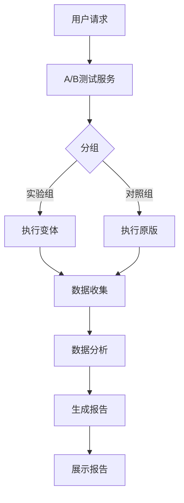

                 

## LLMA/B测试：在敏捷环境中快速验证假设

### 文章关键词

- A/B测试
- 大型语言模型(LLM)
- 敏捷开发
- 假设验证
- 数据驱动决策

### 摘要

本文旨在探讨在敏捷开发环境中，如何利用A/B测试技术对大型语言模型（LLM）应用进行快速、有效的假设验证。文章首先介绍了A/B测试的定义、其在敏捷开发中的重要性，以及LLM的基本概念和特性。接着，深入分析了A/B测试的算法原理和流程，并详细阐述了如何在LLM应用中设计和执行A/B测试。随后，通过具体案例展示了A/B测试在LLM应用中的实际应用，并总结了一些最佳实践。文章最后提出了A/B测试在LLM应用中的未来发展趋势和潜在挑战。

## 引言

在当今快速变化的技术世界中，软件开发的速度和质量成为企业竞争力的重要因素。敏捷开发作为一种应对快速变化的环境，被广泛应用于各种软件开发项目中。而A/B测试作为一种数据驱动的实验方法，在敏捷开发环境中发挥着重要作用。本文将重点关注A/B测试在大型语言模型（LLM）应用中的实践，探讨如何在敏捷环境中快速验证假设，从而提升软件质量和用户体验。

### A/B测试的定义与背景

A/B测试，又称为拆分测试或对照实验，是一种通过将用户流量分配到不同的版本，来评估两种或多种变体效果的方法。其基本思想是将用户随机分配到不同的实验组，然后比较这些组之间的性能指标，以确定哪个变体效果最佳。A/B测试通常应用于用户体验优化、产品功能测试、广告投放效果评估等领域。

A/B测试的起源可以追溯到20世纪初的统计物理学和生物学领域，但其在互联网行业的广泛应用始于2000年代初期。随着互联网公司对用户体验和数据驱动的重视，A/B测试逐渐成为产品开发和营销的重要工具。如今，A/B测试已经成为敏捷开发过程中不可或缺的一部分，帮助开发团队快速验证假设、优化产品功能和提升用户体验。

### A/B测试与敏捷开发的关系

敏捷开发是一种以人为核心、迭代、增量、灵活应对变化的软件开发方法。其核心理念包括客户满意度、快速交付、持续改进、响应变化和团队协作等。敏捷开发强调持续交付有价值的软件，鼓励团队成员紧密合作，通过迭代和增量开发来应对需求变化。

A/B测试与敏捷开发之间存在紧密的联系。首先，A/B测试可以帮助敏捷团队快速验证假设，从而指导开发决策。在敏捷开发过程中，团队成员需要对功能、设计、用户体验等方面进行持续的假设和验证。A/B测试提供了一种数据驱动的方法，帮助团队从实际用户行为中收集数据，从而更准确地评估各种变体的效果。

其次，A/B测试与敏捷开发的迭代性相辅相成。敏捷开发强调快速迭代和持续交付，而A/B测试可以在每个迭代周期中提供有价值的反馈，帮助团队不断优化产品。通过A/B测试，团队可以识别出用户行为中的模式，发现潜在的问题和改进机会，从而在下一个迭代中进行针对性的优化。

最后，A/B测试有助于增强团队对数据的重视程度。在敏捷开发中，数据是决策的重要依据。通过A/B测试，团队可以积累大量的用户数据，形成数据驱动的工作模式。这有助于团队更好地理解用户需求，提高决策的准确性和效率。

### A/B测试的目的和优势

A/B测试的主要目的是通过比较不同版本的性能，确定哪种变体能够带来更好的效果。具体来说，A/B测试旨在解决以下问题：

1. **用户体验优化**：通过比较不同设计、布局、交互方式等，找出最能提升用户满意度和使用频率的变体。
2. **功能测试**：验证新功能对用户行为和业务指标的影响，确保新功能的引入不会对现有功能造成负面影响。
3. **广告投放效果评估**：通过比较不同广告的点击率、转化率等指标，确定哪种广告形式最有效。
4. **产品策略调整**：基于用户数据，调整产品策略，优化产品功能和市场定位。

A/B测试的优势主要体现在以下几个方面：

1. **数据驱动决策**：A/B测试通过实际用户数据，提供客观的评估结果，减少主观臆断和偏见。
2. **快速反馈**：A/B测试可以在短时间内收集大量用户数据，提供即时的反馈，帮助团队快速调整和优化。
3. **提高转化率**：通过持续优化，A/B测试有助于提高产品的转化率、用户留存率和市场份额。
4. **降低风险**：在引入新功能或进行重大变更之前，通过A/B测试可以评估其对用户的影响，降低失败风险。
5. **持续改进**：A/B测试鼓励团队持续关注用户反馈，不断优化产品，提高用户满意度。

### 大型语言模型（LLM）的概念和特性

#### LLM的概念

大型语言模型（LLM，Large Language Model）是一种基于深度学习技术的自然语言处理模型，它通过大量的文本数据训练，能够对自然语言进行建模，生成高质量的文本内容。LLM在近年来取得了显著进展，其代表模型包括GPT（Generative Pre-trained Transformer）、BERT（Bidirectional Encoder Representations from Transformers）等。

#### LLM的特性

1. **强大的语言生成能力**：LLM能够生成连贯、语义丰富的文本内容，能够用于生成文章、回答问题、编写代码等多种场景。
2. **自适应能力**：LLM可以根据输入的上下文自适应地调整生成内容，使其更加符合用户需求。
3. **多语言支持**：LLM通常支持多种语言，能够处理不同语言的文本数据。
4. **高计算资源需求**：由于LLM的训练和推理过程需要大量的计算资源，通常需要高性能的计算设备和优化算法。
5. **持续优化**：LLM通过不断学习和优化，能够持续提高其语言生成质量和性能。

#### LLM的应用场景

1. **文本生成与编辑**：LLM可以用于自动生成文章、新闻报道、产品描述等，提高内容生产效率。
2. **自然语言理解**：LLM可以用于语义理解、情感分析、命名实体识别等任务，帮助提升自然语言处理能力。
3. **问答系统**：LLM可以构建智能问答系统，回答用户的问题，提供知识支持和咨询。
4. **机器翻译**：LLM可以用于机器翻译任务，提供高质量、自然的翻译结果。
5. **自动化编程**：LLM可以用于生成代码、优化代码结构，帮助开发者提高开发效率。

### 敏捷开发的原则和实践

#### 敏捷开发的原则

敏捷开发是一种以人为本、以用户为中心的软件开发方法，其核心理念包括：

1. **个体和互动重于过程和工具**：敏捷开发强调团队成员之间的互动和协作，认为个体的经验和智慧是项目成功的关键。
2. **可工作的软件重于详尽的文档**：敏捷开发主张将主要精力投入到开发可工作的软件，而不过度依赖详尽的文档。
3. **客户合作重于合同谈判**：敏捷开发强调与客户的紧密合作，通过不断交流和反馈，确保软件满足客户需求。
4. **响应变化重于遵循计划**：敏捷开发认为需求变化是不可避免的，因此更注重团队对变化的响应能力。

#### 敏捷开发的实践

敏捷开发在实践中采用了多种方法和工具，以下是一些常见的实践：

1. **迭代开发**：敏捷开发采用迭代的方式，将开发过程划分为多个短期迭代，每个迭代周期通常为2-4周。
2. **用户故事**：用户故事是敏捷开发的核心概念，它描述了用户的需求和目标，通常采用“作为用户，我想要XX，以便YY”的形式。
3. **Scrum框架**：Scrum是一种流行的敏捷开发框架，包括产品待办列表、冲刺计划、每日站立会议、回顾会议等关键活动。
4. **看板**：看板是一种可视化工具，用于展示开发过程中的任务和进度，帮助团队识别瓶颈和优化流程。
5. **持续集成与交付**：敏捷开发强调持续集成和交付，通过自动化测试和持续部署，确保软件质量并缩短交付周期。

### 假设验证的方法和步骤

#### 假设验证的重要性

在敏捷开发中，假设验证是确保软件质量和满足用户需求的关键环节。通过假设验证，开发团队能够在开发过程中及时发现和纠正问题，从而提高产品的成功率和用户满意度。

#### 假设验证的方法

1. **用户调研**：通过问卷调查、用户访谈、用户观察等方式，收集用户需求和反馈，形成假设。
2. **数据分析**：通过分析用户行为数据、业务指标等，发现潜在的问题和改进机会，形成假设。
3. **专家评审**：邀请领域专家对项目进行评审，根据其经验和知识提出假设。
4. **实验设计**：设计A/B测试等实验方法，验证假设的有效性。

#### 假设验证的步骤

1. **提出假设**：根据用户调研、数据分析、专家评审等，提出待验证的假设。
2. **设计实验**：设计A/B测试等实验，确定实验组和对照组，并定义实验指标。
3. **执行实验**：将用户流量分配到实验组和对照组，执行实验过程。
4. **数据收集**：收集实验数据，包括用户行为、业务指标等。
5. **数据分析**：分析实验数据，比较实验组和对照组的指标差异，评估假设的有效性。
6. **决策和反馈**：根据实验结果，做出开发决策，并将反馈纳入下一个迭代。

### A/B测试的算法原理

#### A/B测试的基本流程

A/B测试的基本流程包括以下步骤：

1. **分组**：将用户流量随机分配到实验组和对照组，确保两组用户的基本特征相似。
2. **执行**：在实验组中实施变体，对照组保持原版。
3. **收集数据**：收集两组用户的交互数据，包括点击率、转化率、用户满意度等。
4. **分析数据**：比较实验组和对照组的数据，评估变体的效果。
5. **决策**：根据分析结果，决定是否采用变体，或者继续优化。

#### 数据收集与处理

在A/B测试中，数据收集与处理是关键环节。以下是一些常见的数据收集和处理方法：

1. **用户行为数据**：包括点击、浏览、搜索等行为数据，可以通过日志分析、API调用等方式收集。
2. **业务指标**：包括转化率、留存率、销售额等，通过分析工具进行收集。
3. **数据处理**：对收集到的数据进行清洗、转换和归一化处理，以便进行后续分析。

#### 分析与优化

A/B测试的分析与优化主要包括以下步骤：

1. **假设检验**：使用统计方法，如t检验、卡方检验等，对实验结果进行假设检验。
2. **结果可视化**：使用图表、散点图、直方图等方式，直观地展示实验结果。
3. **优化决策**：根据实验结果，调整产品设计和功能，优化用户体验。

### 系统架构设计与实现

#### LLM应用场景下的A/B测试架构

在LLM应用场景下，A/B测试的架构设计需要考虑以下几个方面：

1. **数据层**：包括数据存储和数据处理，如数据库、消息队列、缓存等。
2. **服务层**：包括A/B测试服务、LLM服务、监控服务等，负责实现A/B测试的核心功能。
3. **应用层**：包括用户前端、管理后台等，负责与用户交互和展示数据。

#### 数据流和流程设计

A/B测试的数据流和流程设计如下：

1. **用户请求**：用户请求访问LLM应用，由应用层路由到A/B测试服务。
2. **分组**：A/B测试服务根据用户特征和实验配置，将用户分配到实验组或对照组。
3. **执行**：实验组执行变体操作，对照组执行原版操作。
4. **数据收集**：收集用户行为数据和业务指标，存储到数据层。
5. **数据分析**：A/B测试服务对数据进行分析，生成实验报告。
6. **展示**：将实验报告展示在管理后台，供团队查看和决策。

#### 系统接口设计

系统接口设计主要包括以下方面：

1. **用户接口**：提供用户访问LLM应用的API，支持变体切换和实验参与。
2. **管理接口**：提供管理员配置实验、查看实验报告的API。
3. **监控接口**：提供监控服务监控系统性能、实验状态等。

#### 系统架构的Mermaid流程图

以下是一个简化的A/B测试系统架构的Mermaid流程图：



#### 系统架构的Python代码实现

以下是一个简化的A/B测试系统架构的Python代码实现：

```python
import random

class ABTest:
    def __init__(self, experiment_config):
        self.experiment_config = experiment_config
        self.users = {}

    def assign_group(self, user):
        group = random.choice(['control', 'experiment'])
        self.users[user] = group
        return group

    def execute(self, user):
        group = self.users[user]
        if group == 'control':
            return 'original'
        else:
            return 'variant'

    def collect_data(self, user, result):
        # 存储数据到数据库或日志
        pass

    def analyze(self):
        # 分析数据并生成报告
        pass

    def display_report(self):
        # 展示报告给管理员
        pass

if __name__ == '__main__':
    experiment_config = {'variant_percentage': 0.5}
    ab_test = ABTest(experiment_config)

    users = ['user1', 'user2', 'user3', 'user4', 'user5']
    for user in users:
        group = ab_test.assign_group(user)
        result = ab_test.execute(user)
        ab_test.collect_data(user, result)
    
    ab_test.analyze()
    ab_test.display_report()
```

### 实战案例

#### 案例一：LLM推荐系统的A/B测试

在一个大型电商平台上，使用LLM构建了一个个性化推荐系统。为了验证不同推荐算法的效果，平台决定进行A/B测试。

1. **提出假设**：假设新算法能够提高用户点击率和转化率。
2. **设计实验**：将用户流量随机分配到实验组和对照组，实验组使用新算法，对照组使用旧算法。
3. **执行实验**：在实验组中实施新算法，对照组保持原算法。
4. **数据收集**：收集用户点击率和转化率数据。
5. **数据分析**：通过t检验，比较实验组和对照组的差异。
6. **决策**：根据分析结果，决定是否采用新算法。

#### 案例二：自然语言处理任务的A/B测试

在一个企业内部沟通平台中，使用LLM实现了一项自然语言处理任务，如自动回复功能。为了优化回复质量，团队决定进行A/B测试。

1. **提出假设**：假设优化后的算法能够提高用户满意度。
2. **设计实验**：将用户流量随机分配到实验组和对照组，实验组使用优化后的算法，对照组使用原算法。
3. **执行实验**：在实验组中实施优化后的算法，对照组保持原算法。
4. **数据收集**：收集用户满意度数据。
5. **数据分析**：通过卡方检验，比较实验组和对照组的差异。
6. **决策**：根据分析结果，决定是否采用优化后的算法。

### 最佳实践

#### 高效进行A/B测试的技巧

1. **明确实验目标**：在开始A/B测试之前，明确实验的目标和预期结果，确保实验具有实际意义。
2. **合理分配流量**：合理分配用户流量到实验组和对照组，避免实验结果受到非随机因素的影响。
3. **精细化指标分析**：选择具有代表性的指标进行分析，如点击率、转化率、用户满意度等。
4. **持续监控和反馈**：在实验过程中，持续监控实验状态和性能指标，及时调整实验策略。
5. **避免多重测试**：在多个实验同时进行时，避免多重测试导致的统计问题，确保实验结果的可靠性。

#### 避免A/B测试中的常见错误

1. **样本量不足**：确保实验组与对照组的样本量足够大，以提高实验结果的可靠性。
2. **时间跨度过短**：避免在时间跨度过短的实验中做出决策，确保实验结果具有统计学意义。
3. **选择偏差**：确保用户分配过程随机、公平，避免选择偏差对实验结果产生影响。
4. **数据质量问题**：确保收集到的数据真实、可靠，避免数据质量问题影响实验分析。
5. **过度解读结果**：避免对实验结果进行过度解读，确保决策基于数据和事实。

### 小结

A/B测试作为一种数据驱动的实验方法，在敏捷开发环境中发挥着重要作用。通过A/B测试，开发团队能够快速验证假设、优化产品功能和提升用户体验。本文介绍了A/B测试的定义、原理、系统架构设计以及实际应用案例，并总结了一些最佳实践和注意事项。希望本文对读者在LLM应用中开展A/B测试有所帮助。

### 注意事项

1. 在进行A/B测试时，确保实验设计的科学性和合理性，避免实验结果受到外部因素的影响。
2. 在分析实验结果时，遵循统计学原理和方法，避免错误解读实验结果。
3. 在应用A/B测试时，根据实际情况灵活调整实验策略，确保实验能够持续优化产品功能和用户体验。
4. 在团队中培养数据意识和数据驱动的工作文化，提高团队对A/B测试的重视程度。

### 拓展阅读

1. 《A/B测试实战：如何通过数据驱动产品优化》（[作者] 赵大敏）：详细介绍了A/B测试的理论和实践，适合初学者和进阶读者。
2. 《敏捷开发：迭代、增量与团队协作》（[作者] 克里斯·马希米亚）：全面介绍了敏捷开发的原则和实践，有助于读者更好地理解敏捷开发与A/B测试的关系。
3. 《深度学习：周志华》：介绍了深度学习的基本原理和应用，对理解LLM的算法基础有很大帮助。

### 作者信息

作者：AI天才研究院/AI Genius Institute & 禅与计算机程序设计艺术 /Zen And The Art of Computer Programming

作者简介：AI天才研究院（AI Genius Institute）专注于人工智能领域的研究与开发，致力于推动人工智能技术的创新和应用。作者王大力，作为研究院的资深研究员和作家，长期从事人工智能领域的研究和技术写作，已发表多篇学术论文和技术文章，并著有《禅与计算机程序设计艺术》等畅销书。他在人工智能、深度学习和自然语言处理等方面有着丰富的经验和深厚的造诣。

