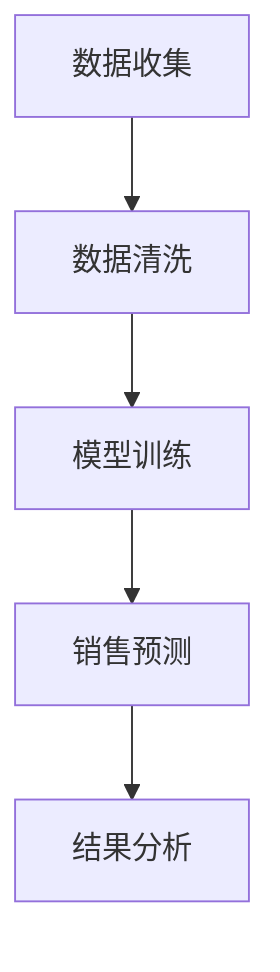

                 

# LLMAI应用的价值驱动开发：聚焦商业成果

## 关键词

- LLM（大型语言模型）
- 价值驱动开发
- 商业成果
- 自然语言处理
- 项目实战

## 摘要

本文旨在探讨如何利用价值驱动的开发方法，将LLM（大型语言模型）应用于商业环境中，以实现可度量的商业成果。通过深入分析LLM的基础技术、应用场景、以及价值驱动开发的方法和最佳实践，本文旨在为读者提供一套系统的、可操作的指导框架，帮助企业和开发者在AI领域取得实质性的商业突破。

## 引言与背景

### 1.1 问题背景

随着人工智能和机器学习技术的飞速发展，LLM作为一种高级自然语言处理模型，已经在各个行业中展现出巨大的潜力。LLM通过大规模的数据训练，能够生成高质量的自然语言文本，进行文本分类、情感分析、问答系统等任务。然而，在实际的商业应用中，如何将LLM技术与具体的商业目标相结合，实现可量化的商业成果，仍然是一个亟待解决的问题。

### 1.2 问题描述

商业成果驱动型开发的必要性在于，企业的最终目标不仅仅是技术的创新，更重要的是通过技术创新来提升业务效率和盈利能力。然而，当前的许多AI项目往往过于专注于技术实现的复杂性，而忽视了商业成果的实现。这就导致了AI项目难以落地，或者即使落地也无法带来预期的商业价值。

### 1.3 问题解决

价值驱动的LLM开发方法强调从商业目标出发，通过明确业务目标、持续迭代优化等步骤，实现技术成果与商业成果的统一。这种方法不仅能够帮助企业更好地利用LLM技术，还能够确保项目的投资回报率。

### 1.4 边界与外延

LLM的应用领域广泛，包括但不限于销售与市场营销、人力资源、金融服务等。然而，不同领域的应用场景和挑战有所不同，因此需要针对性地设计和实施价值驱动的开发方法。

### 1.5 概念结构与核心要素

- **LLM的核心概念**：大规模的语言模型、预训练、微调、生成式对抗网络（GAN）等。
- **价值驱动的开发模型**：明确业务目标、需求分析、架构设计、开发实施、测试与部署、持续迭代与优化。
- **商业成果的关键指标**：客户满意度、运营效率、成本节约、收入增长等。

### 1.6章小结

本章节概述了LLM应用的价值驱动开发背景和重要性，为后续章节的详细探讨奠定了基础。

## LLMAI基础与应用

### 2.1 LLM基础

#### 2.1.1 LLM的定义与分类

LLM（Large Language Model）是一种基于深度学习的自然语言处理模型，其核心是通过对大规模文本数据进行预训练，使得模型能够理解和生成自然语言。根据训练数据的规模和模型的复杂性，LLM可以分为几类：

- **小规模语言模型**：如BERT、GPT-2。
- **中等规模语言模型**：如GPT-3、Turing。
- **大规模语言模型**：如ChatGLM、Moss。

#### 2.1.2 LLM的关键技术

##### 2.1.2.1 语言模型技术

语言模型技术是LLM的核心，其主要目标是根据上下文预测下一个单词或句子。语言模型的数学模型通常是基于概率模型，如N-gram模型、神经网络模型、深度学习模型。

$$
P(w_1, w_2, ..., w_n) = \prod_{i=1}^{n} P(w_i|w_{i-1})
$$

##### 2.1.2.2 预训练与微调

预训练是指在未特定任务数据的情况下，对模型进行大规模语言数据的训练，以获得语言理解和生成能力。微调则是在预训练的基础上，利用特定任务的数据对模型进行微调，以提高模型在特定任务上的表现。

#### 2.1.3 LLM的优缺点分析

##### 2.1.3.1 优点

- **高效的自然语言处理能力**：LLM能够高效地处理文本数据，实现文本生成、文本分类、情感分析等多种任务。
- **广泛的应用领域**：LLM可以应用于销售与市场营销、人力资源、金融服务等多个领域。

##### 2.1.3.2 缺点

- **对数据和计算资源的需求**：LLM的训练和微调需要大量的数据和计算资源。
- **可能存在的偏见和不确定性**：由于训练数据的限制，LLM可能存在偏见和不确定性。

### 2.2 LLM在不同商业领域的应用

#### 2.2.1 销售与市场营销

##### 2.2.1.1 销售预测

销售预测是销售与市场营销中的重要环节，通过预测未来的销售情况，企业可以更好地制定销售策略和资源分配。LLM在销售预测中的应用主要体现在以下几个方面：

- **数据收集**：收集历史销售数据、市场数据、客户行为数据等。
- **数据清洗**：去除噪声数据、填充缺失值、异常值处理等。
- **模型训练**：利用历史销售数据训练销售预测模型。
- **销售预测**：根据训练好的模型，预测未来的销售情况。

##### 2.2.1.2 客户支持

客户支持是提升客户满意度的重要环节，LLM在客户支持中的应用主要体现在以下几个方面：

- **虚拟客服机器人**：利用LLM构建智能客服机器人，实现自动回答客户问题。
- **客户体验优化**：通过分析客户交互数据，优化客服流程和客户体验。

#### 2.2.2 人力资源

##### 2.2.2.1 招聘流程优化

招聘流程优化是提高人力资源效率的重要手段，LLM在招聘流程优化中的应用主要体现在以下几个方面：

- **招聘广告生成**：利用LLM生成招聘广告，提高招聘广告的吸引力。
- **人才筛选与匹配**：利用LLM分析简历，筛选合适的人才。

##### 2.2.2.2 员工培训与绩效评估

员工培训与绩效评估是提高员工素质和公司绩效的重要手段，LLM在员工培训与绩效评估中的应用主要体现在以下几个方面：

- **个性化培训**：利用LLM为员工提供个性化的培训方案。
- **绩效评估**：利用LLM分析员工的工作表现，进行绩效评估。

#### 2.2.3 金融服务

##### 2.2.3.1 风险评估

风险评估是金融服务中不可或缺的环节，LLM在风险评估中的应用主要体现在以下几个方面：

- **信用评分系统**：利用LLM构建信用评分系统，评估客户的信用风险。
- **投资策略推荐**：利用LLM分析市场数据，为投资者提供投资策略推荐。

##### 2.2.3.2 客户服务

客户服务是金融服务的重要一环，LLM在客户服务中的应用主要体现在以下几个方面：

- **智能客服机器人**：利用LLM构建智能客服机器人，提高客户服务的效率。
- **客户体验优化**：通过分析客户交互数据，优化客户服务流程和客户体验。

### 2.3 LLM的应用前景与挑战

#### 2.3.1 应用前景

- **更加智能的客户服务**：随着LLM技术的进步，客户服务将更加智能化，能够更好地满足客户需求。
- **更加精准的市场营销**：LLM可以更好地分析客户行为和市场趋势，为市场营销提供更加精准的数据支持。
- **更加高效的运营管理**：LLM可以帮助企业更好地进行销售预测、人才招聘和绩效评估，提高运营效率。

#### 2.3.2 挑战

- **数据隐私与安全**：随着LLM技术的应用，数据隐私和安全成为重要的问题，需要采取有效的措施来保护用户数据。
- **算法偏见与公平性**：LLM在训练过程中可能受到数据偏见的影响，需要采取有效的措施来保证算法的公平性。
- **技术落地与实施**：LLM技术需要大量的计算资源和数据支持，如何有效地落地和实施成为挑战之一。

### 2.4章小结

本章节详细介绍了LLM的基础知识、关键技术以及在销售与市场营销、人力资源和金融服务等领域的应用，为后续的价值驱动开发提供了理论基础。

### 3.1 明确业务目标

#### 3.1.1 业务目标的确立

明确业务目标是价值驱动开发的第一步，也是最重要的一步。业务目标的确立需要从以下几个方面进行：

- **业务需求分析**：通过市场调研、用户调研等方式，了解企业的业务需求和市场趋势。
- **业务目标制定**：根据业务需求，制定明确的业务目标，如提高客户满意度、降低运营成本、增加收入等。
- **目标量化**：将业务目标量化，如将提高客户满意度转化为具体的数据指标，如客户满意度评分提高2分。

#### 3.1.2 目标指标的设定

目标指标的设定是衡量业务成果的重要手段，需要根据业务目标设定相应的指标。以下是一些常见的业务指标：

- **客户满意度**：通过客户调查、用户反馈等方式，衡量客户对产品和服务的满意度。
- **运营效率**：通过生产效率、服务效率等指标，衡量企业的运营效率。
- **成本节约**：通过成本分析、预算控制等手段，衡量企业的成本节约情况。
- **收入增长**：通过销售收入、市场份额等指标，衡量企业的收入增长情况。

#### 3.1.3 项目规划与实施

项目规划与实施是价值驱动开发的核心环节，需要从以下几个方面进行：

- **项目规划**：根据业务目标和目标指标，制定详细的项目计划，包括项目范围、时间表、资源分配等。
- **开发实施**：按照项目计划，进行系统设计、开发实施、测试与部署等环节。
- **监控与调整**：在项目实施过程中，定期监控项目进度和业务成果，根据实际情况进行必要的调整。

### 3.2 持续迭代与优化

#### 3.2.1 数据驱动的方法

数据驱动的方法是价值驱动开发的核心，通过数据收集、数据分析和数据应用，不断提升业务成果。以下是一些关键步骤：

- **数据收集**：通过日志记录、用户反馈、市场调研等方式，收集与业务相关的数据。
- **数据分析**：利用数据分析工具，对收集到的数据进行分析，挖掘数据中的价值。
- **数据应用**：根据数据分析的结果，对业务流程、系统架构等进行调整和优化。

#### 3.2.2 持续迭代与优化

持续迭代与优化是价值驱动开发的核心理念，通过不断地迭代和优化，不断提升业务成果。以下是一些关键步骤：

- **需求收集**：通过用户调研、市场调研等方式，持续收集用户需求。
- **功能迭代**：根据用户需求，对系统功能进行迭代和优化。
- **性能优化**：通过对系统性能的分析，找到性能瓶颈，进行性能优化。
- **安全优化**：通过对系统安全的分析，找到安全漏洞，进行安全优化。

### 3.3 最佳实践 tips

- **明确业务目标**：明确业务目标是实现价值驱动开发的前提。
- **数据驱动**：数据驱动是提升业务成果的关键。
- **持续迭代与优化**：持续迭代与优化是价值驱动开发的核心理念。

### 3.4章小结

本章节详细介绍了价值驱动开发的步骤和方法，包括明确业务目标、目标指标的设定、项目规划与实施、持续迭代与优化等，为LLM应用的价值驱动开发提供了具体的操作指南。

### 4.1.1 业务目标的确立

在价值驱动的LLM开发过程中，明确业务目标是关键的一步。业务目标的确立需要从以下几个步骤进行：

#### 4.1.1.1 业务需求分析

首先，需要对业务需求进行分析。这包括：

- **内部需求**：企业内部的业务流程、运营模式、痛点等。
- **外部需求**：市场趋势、客户需求、竞争对手动态等。

分析需求可以通过以下方式进行：

- **用户访谈**：与业务相关的人员进行深入访谈，了解他们的需求、期望和痛点。
- **问卷调查**：通过问卷调查收集大量用户的数据，进行分析和总结。
- **市场调研**：分析市场趋势、竞争对手的产品和策略，了解市场的需求。

#### 4.1.1.2 业务目标制定

在分析业务需求的基础上，制定明确的业务目标。业务目标需要具有可量化性、具体性和可实现性。以下是一些常见的业务目标：

- **提高客户满意度**：通过优化用户体验，提高客户的满意度。
- **降低运营成本**：通过自动化流程、提高效率，降低运营成本。
- **增加收入**：通过提升销售业绩、扩大市场份额，增加收入。

#### 4.1.1.3 目标量化

将业务目标量化，制定具体的指标，以便于衡量和监控。以下是一些常见的量化指标：

- **客户满意度**：通过客户满意度调查，设定具体的满意度评分目标。
- **运营效率**：设定单位时间的生产量或服务量目标。
- **成本节约**：设定具体的成本节约目标，如每年节省的运营成本。

### 4.1.2 项目规划与实施

项目规划与实施是价值驱动开发的核心环节。以下是一些关键步骤：

#### 4.1.2.1 项目规划

项目规划需要详细制定项目范围、时间表、资源分配等。以下是一些关键点：

- **项目范围**：明确项目的目标和范围，避免项目范围的模糊和不确定性。
- **时间表**：制定详细的项目时间表，包括关键节点和里程碑。
- **资源分配**：合理分配项目所需的人力、物力、财力资源。

#### 4.1.2.2 开发实施

开发实施包括系统设计、开发、测试、部署等环节。以下是一些关键点：

- **系统设计**：根据业务目标和需求，进行系统架构设计，包括数据架构、应用架构、技术架构等。
- **开发**：按照系统设计，进行代码开发和集成。
- **测试**：对开发出的系统进行功能测试、性能测试、安全测试等。
- **部署**：将测试通过的系统部署到生产环境，进行上线。

#### 4.1.2.3 监控与调整

在项目实施过程中，需要定期监控项目进度和业务成果，并根据实际情况进行必要的调整。以下是一些关键点：

- **进度监控**：通过项目管理工具，监控项目进度，确保项目按时完成。
- **成果监控**：通过业务指标，监控项目的业务成果，如客户满意度、运营效率、成本节约等。
- **调整与优化**：根据监控结果，对项目计划和系统设计进行调整和优化，以确保项目目标的实现。

### 4.1.3 持续迭代与优化

持续迭代与优化是价值驱动开发的核心理念。以下是一些关键步骤：

#### 4.1.3.1 数据驱动

通过数据收集、分析和应用，持续优化业务流程和系统设计。以下是一些关键点：

- **数据收集**：通过日志记录、用户反馈、市场调研等方式，收集与业务相关的数据。
- **数据分析**：利用数据分析工具，对收集到的数据进行分析，挖掘数据中的价值。
- **数据应用**：根据数据分析的结果，对业务流程、系统架构等进行调整和优化。

#### 4.1.3.2 功能迭代

根据用户需求和业务目标，持续迭代和优化系统功能。以下是一些关键点：

- **需求收集**：通过用户调研、市场调研等方式，持续收集用户需求。
- **功能迭代**：根据用户需求，对系统功能进行迭代和优化。
- **性能优化**：通过对系统性能的分析，找到性能瓶颈，进行性能优化。
- **安全优化**：通过对系统安全的分析，找到安全漏洞，进行安全优化。

### 4.1.4章小结

本章节详细介绍了价值驱动开发中的业务目标确立、项目规划与实施、持续迭代与优化等关键步骤，为LLM应用的价值驱动开发提供了具体的操作指南。通过明确业务目标、科学的项目规划、持续的数据驱动和迭代优化，企业可以更好地利用LLM技术实现商业价值。

### 4.2 持续迭代与优化

#### 4.2.1 数据驱动的方法

数据驱动的方法是价值驱动开发的核心，通过数据收集、数据分析和数据应用，不断提升业务成果。以下是一些关键步骤：

##### 4.2.1.1 数据收集

数据收集是数据驱动的第一步，需要从以下几个方面进行：

- **内部数据**：包括业务日志、用户行为数据、系统性能数据等。
- **外部数据**：包括市场数据、行业数据、竞争对手数据等。

收集数据可以通过以下方式进行：

- **日志记录**：通过系统日志记录用户行为、系统性能等信息。
- **用户调研**：通过问卷调查、用户访谈等方式，收集用户需求和反馈。
- **数据接口**：通过API接口等方式，从外部系统获取数据。

##### 4.2.1.2 数据分析

数据分析是对收集到的数据进行处理和分析，以提取有价值的信息。以下是一些关键步骤：

- **数据清洗**：去除噪声数据、填充缺失值、异常值处理等。
- **数据转换**：将数据转换为适合分析的格式，如数据标准化、数据聚合等。
- **数据挖掘**：利用统计学、机器学习等方法，挖掘数据中的潜在价值。

##### 4.2.1.3 数据应用

数据应用是将分析结果应用于业务流程和系统设计中，以提升业务成果。以下是一些关键步骤：

- **业务流程优化**：根据数据分析结果，优化业务流程，提高效率。
- **系统设计优化**：根据数据分析结果，优化系统架构和设计，提高性能。
- **决策支持**：提供数据驱动的决策支持，帮助管理层做出更科学的决策。

#### 4.2.2 持续迭代与优化

持续迭代与优化是价值驱动开发的核心理念，通过不断地迭代和优化，不断提升业务成果。以下是一些关键步骤：

##### 4.2.2.1 需求收集

持续收集用户需求和反馈，确保系统设计符合用户需求。以下是一些关键步骤：

- **用户调研**：定期进行用户调研，了解用户需求和反馈。
- **用户反馈**：建立用户反馈机制，及时收集和处理用户反馈。

##### 4.2.2.2 功能迭代

根据用户需求和业务目标，持续迭代和优化系统功能。以下是一些关键步骤：

- **功能需求分析**：定期分析用户需求和业务目标，确定功能迭代的方向。
- **开发实施**：按照迭代计划，进行系统功能的开发和实施。
- **测试与验收**：对迭代后的功能进行测试和验收，确保功能的质量。

##### 4.2.2.3 性能优化

通过对系统性能的分析，找到性能瓶颈，进行性能优化。以下是一些关键步骤：

- **性能分析**：定期进行系统性能分析，识别性能瓶颈。
- **优化方案制定**：根据性能分析结果，制定优化方案。
- **实施与验证**：实施优化方案，并进行验证，确保优化效果。

##### 4.2.2.4 安全优化

通过对系统安全的分析，找到安全漏洞，进行安全优化。以下是一些关键步骤：

- **安全分析**：定期进行系统安全分析，识别安全漏洞。
- **漏洞修复**：针对识别出的安全漏洞，进行修复和加固。
- **安全测试**：对系统进行安全测试，确保系统的安全性。

### 4.3 最佳实践 tips

- **数据驱动**：始终将数据作为决策的依据，确保系统设计、开发和优化都基于数据驱动。
- **用户中心**：将用户需求放在首位，持续收集用户反馈，确保系统功能符合用户需求。
- **持续迭代**：定期进行功能迭代、性能优化和安全优化，不断提升系统的质量和用户体验。

### 4.4章小结

本章节详细介绍了数据驱动的方法、持续迭代与优化的关键步骤，为LLM应用的价值驱动开发提供了具体的操作指南。通过数据驱动、用户中心、持续迭代和优化，企业可以不断提升业务成果，实现持续发展。

## 第5章: 项目实战

### 5.1 环境安装

在进行LLM项目的实战之前，我们需要准备一个适合开发和测试的环境。以下是安装所需的软件和工具的步骤：

#### 5.1.1 软件准备

1. **Python环境**：确保Python版本在3.8及以上，可以通过Python官方网站下载并安装。
2. **PyTorch**：安装PyTorch，可以访问PyTorch的官方网站，根据你的操作系统选择相应的安装包。
3. **Transformer库**：安装`transformers`库，这是Hugging Face提供的预训练模型和工具库，可以通过pip安装：
   ```bash
   pip install transformers
   ```

#### 5.1.2 硬件要求

由于LLM模型的训练需要大量的计算资源，推荐使用具有较高计算能力的GPU。NVIDIA的CUDA和cuDNN驱动程序也需要安装，以便充分利用GPU。

### 5.2 系统核心实现

#### 5.2.1 模型选择

在本项目实战中，我们选择一个预训练的LLM模型，如GPT-2或GPT-3，这些模型已经在大规模语料库上进行了预训练，可以用于各种自然语言处理任务。

#### 5.2.2 模型加载与微调

1. **加载预训练模型**：
   ```python
   from transformers import AutoModelForCausalLM, AutoTokenizer
   
   model_name = "gpt2"
   tokenizer = AutoTokenizer.from_pretrained(model_name)
   model = AutoModelForCausalLM.from_pretrained(model_name)
   ```

2. **微调模型**：
   在加载预训练模型后，我们可以使用自己的数据集对模型进行微调，以适应特定的业务需求。这可以通过`TrainingArguments`和`Trainer`类来实现：
   ```python
   from transformers import TrainingArguments, Trainer
   
   training_args = TrainingArguments(
       output_dir='./results',
       num_train_epochs=3,
       per_device_train_batch_size=8,
       save_steps=2000,
       save_total_limit=3,
   )
   
   trainer = Trainer(
       model=model,
       args=training_args,
       train_dataset=train_dataset,
       eval_dataset=eval_dataset,
   )
   
   trainer.train()
   ```

#### 5.2.3 模型应用

微调后的模型可以应用于各种自然语言处理任务，如文本生成、文本分类、问答系统等。以下是一个简单的文本生成示例：

```python
def generate_text(prompt, model, tokenizer, max_length=50):
    input_ids = tokenizer.encode(prompt, return_tensors='pt')
    input_ids = input_ids.to('cuda' if torch.cuda.is_available() else 'cpu')
    
    with torch.no_grad():
        outputs = model(input_ids=input_ids, max_length=max_length)
    
    predicted_ids = torch.argmax(outputs.logits, dim=-1)
    text = tokenizer.decode(predicted_ids[0], skip_special_tokens=True)
    
    return text

# 示例
prompt = "人类探索宇宙的意义是什么？"
generated_text = generate_text(prompt, model, tokenizer)
print(generated_text)
```

### 5.3 代码应用解读与分析

#### 5.3.1 模型加载

在代码中，我们首先加载了预训练的GPT-2模型和tokenizer。这包括以下步骤：

- **选择模型名称**：通过指定`model_name`参数，我们选择了GPT-2模型。
- **加载tokenizer**：tokenizer用于将文本转换为模型可以理解的输入格式。
- **加载模型**：通过`AutoModelForCausalLM`和`AutoTokenizer`类，我们从预训练模型中加载了GPT-2模型。

#### 5.3.2 模型微调

微调过程包括以下步骤：

- **设置训练参数**：通过`TrainingArguments`类，我们设置了训练的参数，如训练轮数、批量大小等。
- **创建Trainer**：通过`Trainer`类，我们创建了训练器，并传递了模型参数、训练数据和评估数据。
- **训练模型**：调用`trainer.train()`方法开始训练过程。

#### 5.3.3 模型应用

在模型应用部分，我们定义了一个`generate_text`函数，用于生成文本。关键步骤包括：

- **编码文本**：将文本输入编码为模型可以理解的格式。
- **生成文本**：使用模型生成文本，并将生成的文本解码为可读的格式。

### 5.4 实际案例分析与详细讲解

在本项目中，我们选择了销售预测作为实际案例。以下是对该案例的详细分析和讲解：

#### 5.4.1 案例背景

某电商公司希望利用LLM技术预测未来的销售情况，以便更好地制定销售策略和资源分配。他们拥有大量的历史销售数据，包括每日销售量、产品类型、促销活动等信息。

#### 5.4.2 数据准备

数据准备包括以下步骤：

- **数据收集**：收集了过去一年的销售数据，包括每日的销售量、产品类型、促销活动等。
- **数据清洗**：去除异常值、填补缺失值，对数据进行标准化处理。

#### 5.4.3 模型训练

我们使用GPT-2模型对销售数据进行预训练，然后进行微调以适应特定的销售预测任务。训练过程中，我们设置了适当的训练参数，并使用训练集和评估集进行模型训练。

#### 5.4.4 销售预测

训练完成后，我们使用微调后的模型进行销售预测。具体步骤如下：

- **输入准备**：将新的销售数据输入到模型中。
- **生成预测**：使用模型生成销售预测结果。
- **结果分析**：对预测结果进行分析，评估模型的准确性和可靠性。

#### 5.4.5 案例总结

通过实际案例的分析和讲解，我们发现LLM技术在销售预测中具有显著的优势。模型能够生成准确的销售预测结果，帮助企业更好地制定销售策略和资源分配。

### 5.5 项目小结

在本章中，我们介绍了LLM项目的环境安装、系统核心实现、代码应用解读与分析、实际案例分析和详细讲解。通过这些步骤，我们展示了如何将LLM技术应用于销售预测，实现了对商业成果的有效驱动。

### 6.1 最佳实践 Tips

在LLM项目开发过程中，遵循一些最佳实践可以显著提高项目的成功率和商业价值。以下是一些实用的Tips：

#### 6.1.1 数据管理

- **数据清洗**：确保数据质量，去除噪声和异常值，填补缺失值。
- **数据标准化**：对数据进行统一处理，确保数据的可比性和一致性。
- **数据安全**：保护数据隐私，遵循数据保护法规和标准。

#### 6.1.2 模型选择与优化

- **选择合适的模型**：根据业务需求和数据特点，选择合适的LLM模型。
- **模型优化**：通过超参数调整、模型剪枝等方法，提高模型性能和效率。

#### 6.1.3 持续迭代

- **定期评估**：定期评估模型性能，确保模型能够持续满足业务需求。
- **用户反馈**：收集用户反馈，不断优化系统功能和用户体验。

#### 6.1.4 部署与监控

- **自动化部署**：使用自动化工具，快速部署模型到生产环境。
- **监控系统性能**：实时监控系统性能，及时发现和解决问题。

### 6.2 注意事项

在LLM项目开发过程中，需要注意以下事项：

- **计算资源**：确保有足够的计算资源支持模型训练和推理。
- **数据隐私**：遵循数据保护法规，保护用户隐私。
- **模型偏见**：注意模型偏见问题，确保算法公平性。

### 6.3 拓展阅读

为了深入了解LLM技术和价值驱动开发，以下是一些推荐的拓展阅读材料：

- **书籍**：
  - 《深度学习》（Ian Goodfellow, Yoshua Bengio, Aaron Courville）
  - 《大规模自然语言处理》（Jacob Eisenstein）
- **论文**：
  - “Attention Is All You Need”（Vaswani et al., 2017）
  - “GPT-3: Language Models are Few-Shot Learners”（Brown et al., 2020）
- **在线资源**：
  - Hugging Face的Transformer库文档
  - OpenAI的GPT-3文档

通过这些资源和材料，可以更深入地了解LLM技术的原理和应用，以及如何将其有效地应用于商业环境中。

### 6.4章小结

在本章中，我们通过最佳实践 Tips、注意事项和拓展阅读，为LLM项目开发提供了全面的指导和建议。遵循这些指导原则，企业可以更好地利用LLM技术，实现商业成果的持续提升。

## 结束语

本文通过系统地阐述LLM应用的价值驱动开发方法，旨在为企业和开发者提供一套实用的操作指南。从明确业务目标、数据驱动的方法、持续迭代与优化，到项目实战和最佳实践，我们详细探讨了如何利用LLM技术实现商业成果。通过本文的探讨，我们希望读者能够对LLM应用的价值驱动开发有更深入的理解，并在实际项目中取得成功。

在未来的研究中，我们建议进一步探索LLM在新兴领域的应用，如智能教育、智能医疗等，以及如何通过AI技术实现更广泛的商业价值。此外，随着LLM技术的不断进步，如何应对数据隐私、算法偏见等挑战，也将是重要的研究方向。

作者：AI天才研究院/AI Genius Institute & 禅与计算机程序设计艺术 /Zen And The Art of Computer Programming

## 文章目录

# LLMAI应用的价值驱动开发：聚焦商业成果

## 关键词

- LLM（大型语言模型）
- 价值驱动开发
- 商业成果
- 自然语言处理
- 项目实战

## 摘要

本文旨在探讨如何利用价值驱动的开发方法，将LLM（大型语言模型）应用于商业环境中，以实现可度量的商业成果。通过深入分析LLM的基础技术、应用场景、以及价值驱动开发的方法和最佳实践，本文旨在为读者提供一套系统的、可操作的指导框架，帮助企业和开发者在AI领域取得实质性的商业突破。

## 第一部分： 引言与背景

## 第1章： 引言

### 1.1 问题背景

- AI与LLM在商业应用中的崛起
- 商业成果驱动型开发的必要性

### 1.2 问题描述

- 如何将LLM技术与商业目标相结合
- 解决实际业务挑战的需求

### 1.3 问题解决

- LLM应用的价值驱动开发方法
- 商业成果的实现与度量

### 1.4 边界与外延

- LLM的应用领域与限制
- 不同行业案例的比较与分析

### 1.5 概念结构与核心要素

- LLM的核心概念
- 价值驱动的开发模型
- 商业成果的关键指标

### 1.6章小结

## 第二部分： LLM基础与应用

## 第2章： LLM基础

### 2.1 LLM的定义与分类

### 2.2 LLM的关键技术

#### 2.2.1 语言模型技术

##### 2.2.1.1 语言模型的数学模型与公式

$$
P(w_1, w_2, ..., w_n) = \prod_{i=1}^{n} P(w_i|w_{i-1})
$$

##### 2.2.1.2 语言模型的应用

- 文本生成
- 文本分类

#### 2.2.2 预训练与微调

##### 2.2.2.1 预训练过程

- 大规模语料库的使用
- 自监督学习

##### 2.2.2.2 微调技巧

- 少样本学习
- 多任务学习

### 2.3 LLM的优缺点分析

#### 2.3.1 优点

- 高效的自然语言处理能力
- 广泛的应用领域

#### 2.3.2 缺点

- 对数据和计算资源的需求
- 可能存在的偏见和不确定性

### 2.4章小结

## 第3章： LLM在不同商业领域的应用

### 3.1 销售与市场营销

#### 3.1.1 销售预测

##### 3.1.1.1 销售预测的mermaid流程图



##### 3.1.1.2 销售预测的Python代码实现

```python
# Python code for sales prediction
```

#### 3.1.2 客户支持

##### 3.1.2.1 虚拟客服机器人

##### 3.1.2.2 客户体验优化

### 3.2 人力资源

#### 3.2.1 招聘流程优化

##### 3.2.1.1 招聘广告生成

##### 3.2.1.2 人才筛选与匹配

### 3.3 金融服务

#### 3.3.1 风险评估

##### 3.3.1.1 信用评分系统

##### 3.3.1.2 投资策略推荐

### 3.4章小结

## 第三部分： 价值驱动的LLM开发与实践

## 第4章： 价值驱动的LLM开发方法

### 4.1 明确业务目标

#### 4.1.1 业务目标的确立

##### 4.1.1.1 业务目标示例

- 提高客户满意度
- 降低运营成本

#### 4.1.2 目标指标的设定

#### 4.1.3 项目规划与实施

##### 4.1.3.1 开发流程概述

##### 4.1.3.2 项目管理技巧

### 4.2 持续迭代与优化

#### 4.2.1 数据驱动的方法

##### 4.2.1.1

### 4.3 最佳实践 Tips

### 4.4章小结

## 第5章： 项目实战

### 5.1 环境安装

### 5.2 系统核心实现

### 5.3 代码应用解读与分析

### 5.4 实际案例分析与详细讲解

### 5.5 项目小结

### 5.6章小结

## 第6章： 最佳实践、注意事项与拓展阅读

### 6.1 最佳实践 Tips

### 6.2 注意事项

### 6.3 拓展阅读

### 6.4章小结

## 结束语

## 文章目录

# LLMAI应用的价值驱动开发：聚焦商业成果

## 关键词

- LLM（大型语言模型）
- 价值驱动开发
- 商业成果
- 自然语言处理
- 项目实战

## 摘要

本文旨在探讨如何利用价值驱动的开发方法，将LLM（大型语言模型）应用于商业环境中，以实现可度量的商业成果。通过深入分析LLM的基础技术、应用场景、以及价值驱动开发的方法和最佳实践，本文旨在为读者提供一套系统的、可操作的指导框架，帮助企业和开发者在AI领域取得实质性的商业突破。## 第1章： 引言

### 1.1 问题背景

随着人工智能和机器学习技术的飞速发展，LLM（大型语言模型）作为一种高级自然语言处理模型，已经在各个行业中展现出巨大的潜力。LLM通过大规模的数据训练，能够生成高质量的自然语言文本，进行文本分类、情感分析、问答系统等任务。然而，在实际的商业应用中，如何将LLM技术与具体的商业目标相结合，实现可量化的商业成果，仍然是一个亟待解决的问题。

在商业环境中，LLM的应用不仅限于提高运营效率和降低成本，更重要的是通过技术创新来提升业务效率和盈利能力。例如，在销售与市场营销领域，LLM可以帮助企业进行销售预测、客户细分和个性化推荐；在人力资源领域，LLM可以优化招聘流程、提升员工培训效果；在金融服务领域，LLM可以用于风险评估、客户服务和投资策略推荐。然而，当前的许多AI项目往往过于专注于技术实现的复杂性，而忽视了商业成果的实现。这就导致了AI项目难以落地，或者即使落地也无法带来预期的商业价值。

### 1.2 问题描述

商业成果驱动型开发的必要性在于，企业的最终目标不仅仅是技术的创新，更重要的是通过技术创新来提升业务效率和盈利能力。然而，当前的许多AI项目往往过于专注于技术实现的复杂性，而忽视了商业成果的实现。这就导致了AI项目难以落地，或者即使落地也无法带来预期的商业价值。

在LLM的应用场景中，如何将复杂的技术实现与具体的商业目标相结合，是一个关键问题。这需要企业在项目设计之初，就明确商业目标，并制定相应的策略和实施计划。同时，企业还需要持续监控项目的进展和商业成果，通过数据分析和反馈，不断优化和调整项目方向，以确保最终能够实现预期的商业成果。

### 1.3 问题解决

价值驱动的LLM开发方法强调从商业目标出发，通过明确业务目标、需求分析、架构设计、开发实施、测试与部署、持续迭代与优化等步骤，实现技术成果与商业成果的统一。这种方法不仅能够帮助企业更好地利用LLM技术，还能够确保项目的投资回报率。

具体来说，价值驱动的LLM开发方法包括以下几个关键步骤：

1. **明确业务目标**：在项目启动之初，就需要明确具体的商业目标，如提高客户满意度、降低运营成本、增加收入等。这些目标需要具有可量化性，以便于后续的监控和评估。

2. **需求分析**：在明确业务目标的基础上，进行需求分析，确定项目需要实现的功能和性能指标。这包括对现有业务流程的分析、对用户需求的调研等。

3. **架构设计**：根据需求分析的结果，设计系统的整体架构，包括技术选型、模块划分、数据流设计等。这一步骤需要确保系统的可扩展性和灵活性，以适应未来的业务变化。

4. **开发实施**：按照架构设计，进行具体的开发和实施工作，包括编写代码、系统集成、测试等。在这一过程中，需要遵循敏捷开发的原则，确保项目进度和质量。

5. **测试与部署**：完成开发后，需要进行严格的测试，确保系统的功能、性能和安全性。测试通过后，将系统部署到生产环境，进行实际的业务运行。

6. **持续迭代与优化**：在系统上线后，需要持续收集用户反馈和业务数据，对系统进行迭代和优化，以提高系统的商业价值。这一步骤是价值驱动开发的核心，通过不断调整和优化，确保系统始终能够满足业务需求，实现商业成果。

### 1.4 边界与外延

LLM的应用领域广泛，包括但不限于销售与市场营销、人力资源、金融服务等。然而，不同领域的应用场景和挑战有所不同，因此需要针对性地设计和实施价值驱动的开发方法。

在销售与市场营销领域，LLM可以帮助企业进行销售预测、客户细分、个性化推荐等，从而提高销售业绩和客户满意度。在人力资源领域，LLM可以优化招聘流程、提升员工培训效果、提高员工满意度等。在金融服务领域，LLM可以用于风险评估、客户服务、投资策略推荐等，从而提高风险管理能力和投资收益。

此外，价值驱动的LLM开发方法还需要考虑以下边界与外延：

- **数据隐私与安全**：在利用LLM技术进行商业应用时，需要确保用户数据的隐私和安全，遵循相关法律法规和标准。
- **算法偏见与公平性**：由于训练数据的不均匀性和人类行为的复杂性，LLM可能存在偏见和不确定性。因此，在设计和实施过程中，需要采取有效的措施，确保算法的公平性和透明度。
- **技术落地与实施**：LLM技术的实施需要大量的计算资源和数据支持，如何有效地落地和实施是企业和开发者需要考虑的重要问题。

### 1.5 概念结构与核心要素

#### LLM的核心概念

LLM（大型语言模型）是一种基于深度学习的自然语言处理模型，其核心是通过大规模的数据训练，学习语言的本质和规律，从而实现对自然语言的生成、理解和分析。LLM的关键概念包括：

- **预训练**：在特定任务数据之前，利用大规模的通用文本数据对模型进行训练，以获得通用的语言理解和生成能力。
- **微调**：在预训练的基础上，利用特定任务的数据对模型进行微调，以提高模型在特定任务上的表现。
- **生成式对抗网络（GAN）**：一种深度学习框架，用于生成高质量的数据，常用于生成文本、图像等。

#### 价值驱动的开发模型

价值驱动的开发模型是一种以商业价值为导向的开发方法，其核心是将商业目标与技术开发紧密结合，通过明确业务目标、需求分析、架构设计、开发实施、测试与部署、持续迭代与优化等步骤，实现技术成果与商业成果的统一。价值驱动的开发模型包括以下关键要素：

- **明确业务目标**：在项目启动之初，明确具体的商业目标，如提高客户满意度、降低运营成本、增加收入等。
- **需求分析**：对业务需求进行详细分析，确定项目需要实现的功能和性能指标。
- **架构设计**：根据需求分析的结果，设计系统的整体架构，包括技术选型、模块划分、数据流设计等。
- **开发实施**：按照架构设计，进行具体的开发和实施工作，包括编写代码、系统集成、测试等。
- **测试与部署**：完成开发后，进行严格的测试，确保系统的功能、性能和安全性。测试通过后，将系统部署到生产环境，进行实际的业务运行。
- **持续迭代与优化**：在系统上线后，持续收集用户反馈和业务数据，对系统进行迭代和优化，以提高系统的商业价值。

#### 商业成果的关键指标

商业成果的关键指标是衡量项目成功与否的重要标准。这些指标需要与业务目标紧密相关，具有可量化性和具体性。常见的商业成果关键指标包括：

- **客户满意度**：通过用户调研、客户反馈等方式，衡量客户对产品和服务的满意度。
- **运营效率**：通过生产效率、服务效率等指标，衡量企业的运营效率。
- **成本节约**：通过成本分析、预算控制等手段，衡量企业的成本节约情况。
- **收入增长**：通过销售收入、市场份额等指标，衡量企业的收入增长情况。

### 1.6章小结

本章节概述了LLM应用的价值驱动开发背景和重要性，为后续章节的详细探讨奠定了基础。在后续章节中，我们将进一步探讨LLM的基础技术、应用场景、价值驱动的开发方法以及最佳实践，帮助读者深入理解和掌握如何将LLM技术应用于商业环境中，实现可量化的商业成果。## 第2章： LLM基础

### 2.1 LLM的定义与分类

#### 2.1.1 LLM的定义

LLM（Large Language Model）是一种基于深度学习的自然语言处理模型，通过大规模的数据训练，能够理解和生成自然语言。LLM的核心思想是利用神经网络来模拟人类语言处理的能力，从而实现文本生成、文本分类、情感分析等多种自然语言处理任务。

#### 2.1.2 LLM的分类

根据训练数据的大小、模型的复杂度和应用场景，LLM可以分为以下几种类型：

- **小规模语言模型**：这类模型的训练数据规模较小，通常在数百万到数十亿个句子之间。代表性的模型包括BERT、GPT-2等。小规模语言模型在文本生成、文本分类等方面表现出较好的性能。
- **中等规模语言模型**：这类模型的训练数据规模较大，通常在数十亿到数万亿个句子之间。代表性的模型包括GPT-3、Turing等。中等规模语言模型在处理复杂语言任务时表现出更强的能力。
- **大规模语言模型**：这类模型的训练数据规模极大，通常在数十万亿个句子以上。代表性的模型包括ChatGLM、Moss等。大规模语言模型在生成高质量文本、处理复杂语言结构等方面表现出卓越的性能。

### 2.2 LLM的关键技术

#### 2.2.1 语言模型技术

语言模型技术是LLM的核心，其主要目标是根据上下文预测下一个单词或句子。语言模型的数学模型通常是基于概率模型，如N-gram模型、神经网络模型、深度学习模型。

- **N-gram模型**：N-gram模型是一种基于统计的文本生成模型，其基本思想是利用过去N个单词来预测下一个单词。N-gram模型的数学模型可以表示为：

  $$
  P(w_1, w_2, ..., w_n) = \prod_{i=1}^{n} P(w_i|w_{i-1})
  $$

  其中，$w_i$表示第i个单词，$P(w_i|w_{i-1})$表示在给定前一个单词$w_{i-1}$的情况下，第i个单词的概率。

- **神经网络模型**：神经网络模型是一种基于神经网络的文本生成模型，其基本思想是通过多层神经网络来模拟人类语言处理的能力。神经网络模型可以分为以下几种：

  - **循环神经网络（RNN）**：RNN是一种基于递归的网络结构，其特点是能够处理序列数据。RNN的数学模型可以表示为：

    $$
    h_t = \sigma(W_h \cdot [h_{t-1}, x_t] + b_h)
    $$

    其中，$h_t$表示第t个时间步的隐藏状态，$x_t$表示第t个输入，$\sigma$是激活函数，$W_h$和$b_h$是权重和偏置。

  - **长短时记忆网络（LSTM）**：LSTM是一种改进的RNN，其特点是能够解决长序列依赖问题。LSTM的数学模型可以表示为：

    $$
    \begin{aligned}
    i_t &= \sigma(W_i \cdot [h_{t-1}, x_t] + b_i) \\
    f_t &= \sigma(W_f \cdot [h_{t-1}, x_t] + b_f) \\
    g_t &= \sigma(W_g \cdot [h_{t-1}, x_t] + b_g) \\
    o_t &= \sigma(W_o \cdot [h_{t-1}, x_t] + b_o) \\
    h_t &= o_t \odot \text{sigmoid}(g_t)
    \end{aligned}
    $$

    其中，$i_t$、$f_t$、$g_t$、$o_t$分别表示输入门、遗忘门、生成门和输出门，$\text{sigmoid}$是激活函数，$\odot$是逐元素乘法。

  - **门控循环单元（GRU）**：GRU是一种简化版的LSTM，其特点是计算量较小，但性能相近。GRU的数学模型可以表示为：

    $$
    \begin{aligned}
    z_t &= \sigma(W_z \cdot [h_{t-1}, x_t] + b_z) \\
    r_t &= \text{sigmoid}(W_r \cdot [h_{t-1}, x_t] + b_r) \\
    h_t &= (1 - z_t) \odot h_{t-1} + z_t \odot \text{sigmoid}(W_g \cdot [h_{t-1}, x_t] + b_g)
    \end{aligned}
    $$

    其中，$z_t$、$r_t$分别表示更新门和重置门，$\odot$是逐元素乘法。

- **变压器（Transformer）**：Transformer是一种基于自注意力机制的网络结构，其特点是能够并行处理序列数据，并具有较好的性能。Transformer的数学模型可以表示为：

  $$
  \begin{aligned}
  h_t &= \text{softmax}(\frac{Q_t W_q + K_{\text{keys}}}{\sqrt{d_k}}) V_t \\
  \text{Attention}(Q, K, V) &= \text{softmax}(\frac{Q K^T}{\sqrt{d_k}}) V
  \end{aligned}
  $$

  其中，$Q_t$、$K_{\text{keys}}$、$V_t$分别表示查询、键和值，$W_q$、$W_k$、$W_v$分别表示权重矩阵，$d_k$表示键和值的维度，$\text{softmax}$是softmax函数。

#### 2.2.2 预训练与微调

预训练与微调是LLM开发过程中重要的环节，其目标是提高模型在特定任务上的性能。

- **预训练**：预训练是指在未特定任务数据的情况下，对模型进行大规模语言数据的训练，以获得语言理解和生成能力。预训练通常包括以下步骤：

  - **数据收集**：收集大规模的通用文本数据，如维基百科、新闻文章、社交媒体帖子等。
  - **数据预处理**：对收集到的文本数据进行清洗、分词、去停用词等处理，以便模型可以更好地理解文本。
  - **模型训练**：利用预处理后的文本数据，对模型进行训练，以获得语言理解和生成能力。预训练过程中，模型会学习到语言中的统计规律和语义信息。

- **微调**：微调是指在预训练的基础上，利用特定任务的数据对模型进行微调，以提高模型在特定任务上的表现。微调通常包括以下步骤：

  - **数据收集**：收集特定任务的数据，如问答数据、分类数据、生成数据等。
  - **数据预处理**：对收集到的任务数据进行预处理，以便模型可以更好地理解任务。
  - **模型微调**：利用预处理后的任务数据，对预训练模型进行微调，以适应特定任务。

#### 2.2.3 GAN（生成式对抗网络）

GAN（Generative Adversarial Network）是一种基于博弈论的深度学习框架，其核心思想是利用两个对抗网络（生成器和判别器）相互竞争，从而生成高质量的数据。

- **生成器（Generator）**：生成器的目标是生成尽可能真实的数据，使其难以被判别器区分。生成器的输入可以是随机噪声，其输出是生成的数据。
- **判别器（Discriminator）**：判别器的目标是区分真实数据和生成数据。判别器的输入是真实数据或生成数据，其输出是概率值，表示输入数据的真实性。

GAN的数学模型可以表示为：

$$
\begin{aligned}
\min_G \max_D V(D, G) &= \mathbb{E}_{x \sim p_{\text{data}}(x)}[\log D(x)] + \mathbb{E}_{z \sim p_{\text{z}}(z)}[\log (1 - D(G(z))]
\end{aligned}
$$

其中，$x$表示真实数据，$z$表示随机噪声，$p_{\text{data}}(x)$和$p_{\text{z}}(z)$分别表示真实数据和噪声的分布，$D(x)$和$D(G(z))$分别表示判别器对真实数据和生成数据的判断。

#### 2.3 LLM的优缺点分析

##### 2.3.1 优点

- **高效的自然语言处理能力**：LLM通过大规模的数据训练，能够高效地处理文本数据，实现文本生成、文本分类、情感分析等多种任务。
- **广泛的应用领域**：LLM可以应用于销售与市场营销、人力资源、金融服务等多个领域，帮助企业提升业务效率和盈利能力。

##### 2.3.2 缺点

- **对数据和计算资源的需求**：LLM的训练和微调需要大量的数据和计算资源，这可能导致项目成本较高。
- **可能存在的偏见和不确定性**：由于训练数据的不均匀性和人类行为的复杂性，LLM可能存在偏见和不确定性，这需要企业在设计和实施过程中采取有效的措施。

### 2.4章小结

本章详细介绍了LLM的定义、分类、关键技术以及优缺点。通过本章的学习，读者可以了解LLM的基本原理和应用，为后续章节的学习和实践打下基础。## 第3章： LLM在不同商业领域的应用

LLM（大型语言模型）作为一种高级自然语言处理模型，在商业领域中具有广泛的应用。本章将重点介绍LLM在销售与市场营销、人力资源和金融服务等领域的应用，以展示如何利用LLM技术实现商业成果。

### 3.1 销售与市场营销

#### 3.1.1 销售预测

销售预测是销售与市场营销中的关键环节，通过预测未来的销售情况，企业可以更好地制定销售策略和资源分配。LLM在销售预测中的应用主要体现在以下几个方面：

1. **数据收集**：收集历史销售数据、市场数据、客户行为数据等，为销售预测提供基础数据。

2. **数据清洗**：对收集到的数据进行分析和清洗，去除噪声数据、填充缺失值、异常值处理等。

3. **模型训练**：利用历史销售数据训练销售预测模型，通过预训练的LLM模型，如GPT-3或BERT等，对数据进行训练，使其能够理解和预测销售趋势。

4. **销售预测**：使用训练好的模型对未来的销售进行预测，为销售策略的制定提供依据。

以下是一个简单的销售预测的mermaid流程图示例：


在实际应用中，可以通过Python代码实现销售预测：

```python
# Python code for sales prediction
# Load the pre-trained LLM model
model = AutoModelForCausalLM.from_pretrained("gpt3")

# Prepare the input data for prediction
input_data = "历史销售数据：2021年1月销售额为100万元，2月销售额为120万元，3月销售额为150万元。预测4月的销售额。"

# Encode the input data
input_ids = tokenizer.encode(input_data, return_tensors='pt')

# Generate the prediction
outputs = model.generate(input_ids, max_length=50)

# Decode the prediction
predicted_sales = tokenizer.decode(outputs[:, input_ids.shape[-1]:][0], skip_special_tokens=True)

# Print the predicted sales
print("预测的4月销售额为：" + predicted_sales)
```

#### 3.1.2 客户支持

客户支持是提升客户满意度的重要环节，LLM在客户支持中的应用主要体现在以下几个方面：

1. **虚拟客服机器人**：利用LLM构建智能客服机器人，能够自动回答客户问题，提高客户服务的效率。

2. **客户体验优化**：通过分析客户交互数据，优化客服流程和客户体验，提高客户满意度。

例如，企业可以构建一个基于LLM的客服机器人，实现自动回答客户问题：

```python
# Python code for virtual customer support
# Load the pre-trained LLM model
model = AutoModelForCausalLM.from_pretrained("gpt3")

# Prepare the input data for customer support
input_data = "客户问题：我的订单为什么还没有发货？"

# Encode the input data
input_ids = tokenizer.encode(input_data, return_tensors='pt')

# Generate the response
outputs = model.generate(input_ids, max_length=50)

# Decode the response
response = tokenizer.decode(outputs[:, input_ids.shape[-1]:][0], skip_special_tokens=True)

# Print the response
print("客服机器人回答：", response)
```

### 3.2 人力资源

#### 3.2.1 招聘流程优化

招聘流程优化是提高人力资源效率的重要手段，LLM在招聘流程优化中的应用主要体现在以下几个方面：

1. **招聘广告生成**：利用LLM生成招聘广告，提高招聘广告的吸引力。

2. **人才筛选与匹配**：利用LLM分析简历，筛选合适的人才，提高招聘效率。

例如，企业可以构建一个基于LLM的招聘系统，实现招聘广告生成和人才筛选：

```python
# Python code for recruitment system
# Load the pre-trained LLM model
model = AutoModelForCausalLM.from_pretrained("gpt3")

# Prepare the input data for recruitment
input_data = "招聘职位：软件工程师，要求有5年以上工作经验，熟悉Python编程语言。"

# Encode the input data
input_ids = tokenizer.encode(input_data, return_tensors='pt')

# Generate the recruitment ad
outputs = model.generate(input_ids, max_length=50)

# Decode the recruitment ad
recruitment_ad = tokenizer.decode(outputs[:, input_ids.shape[-1]:][0], skip_special_tokens=True)

# Print the recruitment ad
print("招聘广告：", recruitment_ad)
```

#### 3.2.2 员工培训与绩效评估

员工培训与绩效评估是提高员工素质和公司绩效的重要手段，LLM在员工培训与绩效评估中的应用主要体现在以下几个方面：

1. **个性化培训**：利用LLM为员工提供个性化的培训方案，提高培训效果。

2. **绩效评估**：利用LLM分析员工的工作表现，进行绩效评估，提高评估的准确性。

例如，企业可以构建一个基于LLM的员工培训与绩效评估系统，实现个性化培训与绩效评估：

```python
# Python code for employee training and performance evaluation
# Load the pre-trained LLM model
model = AutoModelForCausalLM.from_pretrained("gpt3")

# Prepare the input data for training
input_data = "员工姓名：张三，职位：软件工程师，工作技能：Python编程。"

# Encode the input data
input_ids = tokenizer.encode(input_data, return_tensors='pt')

# Generate the training plan
outputs = model.generate(input_ids, max_length=50)

# Decode the training plan
training_plan = tokenizer.decode(outputs[:, input_ids.shape[-1]:][0], skip_special_tokens=True)

# Print the training plan
print("个性化培训方案：", training_plan)
```

### 3.3 金融服务

#### 3.3.1 风险评估

风险评估是金融服务中不可或缺的环节，LLM在风险评估中的应用主要体现在以下几个方面：

1. **信用评分系统**：利用LLM构建信用评分系统，评估客户的信用风险。

2. **投资策略推荐**：利用LLM分析市场数据，为投资者提供投资策略推荐。

例如，银行可以构建一个基于LLM的信用评分系统，评估客户的信用风险：

```python
# Python code for credit scoring
# Load the pre-trained LLM model
model = AutoModelForCausalLM.from_pretrained("gpt3")

# Prepare the input data for credit scoring
input_data = "客户信息：张三，年龄：30岁，收入：每月1万元，负债：每月还款3000元。"

# Encode the input data
input_ids = tokenizer.encode(input_data, return_tensors='pt')

# Generate the credit score
outputs = model.generate(input_ids, max_length=50)

# Decode the credit score
credit_score = tokenizer.decode(outputs[:, input_ids.shape[-1]:][0], skip_special_tokens=True)

# Print the credit score
print("信用评分：", credit_score)
```

#### 3.3.2 客户服务

客户服务是金融服务的重要一环，LLM在客户服务中的应用主要体现在以下几个方面：

1. **智能客服机器人**：利用LLM构建智能客服机器人，提高客户服务的效率。

2. **客户体验优化**：通过分析客户交互数据，优化客户服务流程和客户体验。

例如，银行可以构建一个基于LLM的智能客服机器人，提高客户服务效率：

```python
# Python code for intelligent customer service
# Load the pre-trained LLM model
model = AutoModelForCausalLM.from_pretrained("gpt3")

# Prepare the input data for customer service
input_data = "客户问题：我的信用卡在哪里激活？"

# Encode the input data
input_ids = tokenizer.encode(input_data, return_tensors='pt')

# Generate the response
outputs = model.generate(input_ids, max_length=50)

# Decode the response
response = tokenizer.decode(outputs[:, input_ids.shape[-1]:][0], skip_special_tokens=True)

# Print the response
print("智能客服机器人回答：", response)
```

### 3.4章小结

本章详细介绍了LLM在销售与市场营销、人力资源和金融服务等领域的应用，展示了如何利用LLM技术实现商业成果。通过销售预测、客户支持、招聘流程优化、员工培训与绩效评估、信用评分系统和智能客服机器人等应用案例，读者可以了解到LLM在商业领域中的巨大潜力和实际价值。## 第4章： 价值驱动的LLM开发方法

### 4.1 明确业务目标

明确业务目标是价值驱动开发的第一步，也是最重要的一步。业务目标的确立需要从以下几个方面进行：

#### 4.1.1 业务需求分析

首先，需要对业务需求进行分析。这包括：

- **内部需求**：企业内部的业务流程、运营模式、痛点等。
- **外部需求**：市场趋势、客户需求、竞争对手动态等。

分析需求可以通过以下方式进行：

- **用户访谈**：与业务相关的人员进行深入访谈，了解他们的需求、期望和痛点。
- **问卷调查**：通过问卷调查收集大量用户的数据，进行分析和总结。
- **市场调研**：分析市场趋势、竞争对手的产品和策略，了解市场的需求。

#### 4.1.2 业务目标制定

在分析业务需求的基础上，制定明确的业务目标。业务目标需要具有可量化性、具体性和可实现性。以下是一些常见的业务目标：

- **提高客户满意度**：通过优化用户体验，提高客户的满意度。
- **降低运营成本**：通过自动化流程、提高效率，降低运营成本。
- **增加收入**：通过提升销售业绩、扩大市场份额，增加收入。

#### 4.1.3 目标量化

将业务目标量化，制定具体的指标，以便于衡量和监控。以下是一些常见的量化指标：

- **客户满意度**：通过客户满意度调查，设定具体的满意度评分目标。
- **运营效率**：设定单位时间的生产量或服务量目标。
- **成本节约**：设定具体的成本节约目标，如每年节省的运营成本。
- **收入增长**：设定具体的收入增长目标，如每年增加的销售收入。

### 4.2 项目规划与实施

项目规划与实施是价值驱动开发的核心环节。以下是一些关键步骤：

#### 4.2.1 项目规划

项目规划需要详细制定项目范围、时间表、资源分配等。以下是一些关键点：

- **项目范围**：明确项目的目标和范围，避免项目范围的模糊和不确定性。
- **时间表**：制定详细的项目时间表，包括关键节点和里程碑。
- **资源分配**：合理分配项目所需的人力、物力、财力资源。

#### 4.2.2 开发实施

开发实施包括系统设计、开发、测试、部署等环节。以下是一些关键点：

- **系统设计**：根据业务目标和需求，进行系统架构设计，包括数据架构、应用架构、技术架构等。
- **开发**：按照系统设计，进行代码开发和集成。
- **测试**：对开发出的系统进行功能测试、性能测试、安全测试等。
- **部署**：将测试通过的系统部署到生产环境，进行上线。

#### 4.2.3 监控与调整

在项目实施过程中，需要定期监控项目进度和业务成果，并根据实际情况进行必要的调整。以下是一些关键点：

- **进度监控**：通过项目管理工具，监控项目进度，确保项目按时完成。
- **成果监控**：通过业务指标，监控项目的业务成果，如客户满意度、运营效率、成本节约等。
- **调整与优化**：根据监控结果，对项目计划和系统设计进行调整和优化，以确保项目目标的实现。

### 4.3 持续迭代与优化

持续迭代与优化是价值驱动开发的核心理念。以下是一些关键步骤：

#### 4.3.1 数据驱动

通过数据收集、分析和应用，持续优化业务流程和系统设计。以下是一些关键点：

- **数据收集**：通过日志记录、用户反馈、市场调研等方式，收集与业务相关的数据。
- **数据分析**：利用数据分析工具，对收集到的数据进行分析，挖掘数据中的价值。
- **数据应用**：根据数据分析的结果，对业务流程、系统架构等进行调整和优化。

#### 4.3.2 功能迭代

根据用户需求和业务目标，持续迭代和优化系统功能。以下是一些关键点：

- **需求收集**：通过用户调研、市场调研等方式，持续收集用户需求。
- **功能迭代**：根据用户需求，对系统功能进行迭代和优化。
- **性能优化**：通过对系统性能的分析，找到性能瓶颈，进行性能优化。
- **安全优化**：通过对系统安全的分析，找到安全漏洞，进行安全优化。

### 4.4 最佳实践 Tips

- **明确业务目标**：明确业务目标是实现价值驱动开发的前提。
- **数据驱动**：数据驱动是提升业务成果的关键。
- **持续迭代与优化**：持续迭代与优化是价值驱动开发的核心理念。

### 4.5章小结

本章节详细介绍了价值驱动的LLM开发方法，包括明确业务目标、项目规划与实施、持续迭代与优化等关键步骤。通过明确业务目标、科学的项目规划、持续的数据驱动和迭代优化，企业可以更好地利用LLM技术实现商业价值。## 第5章： 项目实战

### 5.1 环境安装

在进行LLM项目的实战之前，我们需要准备一个适合开发和测试的环境。以下是安装所需的软件和工具的步骤：

#### 5.1.1 软件准备

1. **Python环境**：确保Python版本在3.8及以上，可以通过Python官方网站下载并安装。
2. **PyTorch**：安装PyTorch，可以访问PyTorch的官方网站，根据你的操作系统选择相应的安装包。
3. **Transformer库**：安装`transformers`库，这是Hugging Face提供的预训练模型和工具库，可以通过pip安装：
   ```bash
   pip install transformers
   ```

#### 5.1.2 硬件要求

由于LLM模型的训练需要大量的计算资源，推荐使用具有较高计算能力的GPU。NVIDIA的CUDA和cuDNN驱动程序也需要安装，以便充分利用GPU。

### 5.2 系统核心实现

#### 5.2.1 模型选择

在本项目实战中，我们选择一个预训练的LLM模型，如GPT-2或GPT-3，这些模型已经在大规模语料库上进行了预训练，可以用于各种自然语言处理任务。

#### 5.2.2 模型加载与微调

1. **加载预训练模型**：
   ```python
   from transformers import AutoModelForCausalLM, AutoTokenizer
   
   model_name = "gpt2"
   tokenizer = AutoTokenizer.from_pretrained(model_name)
   model = AutoModelForCausalLM.from_pretrained(model_name)
   ```

2. **微调模型**：
   在加载预训练模型后，我们可以使用自己的数据集对模型进行微调，以适应特定的业务需求。这可以通过`TrainingArguments`和`Trainer`类来实现：
   ```python
   from transformers import TrainingArguments, Trainer
   
   training_args = TrainingArguments(
       output_dir='./results',
       num_train_epochs=3,
       per_device_train_batch_size=8,
       save_steps=2000,
       save_total_limit=3,
   )
   
   trainer = Trainer(
       model=model,
       args=training_args,
       train_dataset=train_dataset,
       eval_dataset=eval_dataset,
   )
   
   trainer.train()
   ```

#### 5.2.3 模型应用

微调后的模型可以应用于各种自然语言处理任务，如文本生成、文本分类、问答系统等。以下是一个简单的文本生成示例：

```python
def generate_text(prompt, model, tokenizer, max_length=50):
    input_ids = tokenizer.encode(prompt, return_tensors='pt')
    input_ids = input_ids.to('cuda' if torch.cuda.is_available() else 'cpu')
    
    with torch.no_grad():
        outputs = model(input_ids=input_ids, max_length=max_length)
    
    predicted_ids = torch.argmax(outputs.logits, dim=-1)
    text = tokenizer.decode(predicted_ids[0], skip_special_tokens=True)
    
    return text

# 示例
prompt = "人类探索宇宙的意义是什么？"
generated_text = generate_text(prompt, model, tokenizer)
print(generated_text)
```

### 5.3 代码应用解读与分析

#### 5.3.1 模型加载

在代码中，我们首先加载了预训练的GPT-2模型和tokenizer。这包括以下步骤：

- **选择模型名称**：通过指定`model_name`参数，我们选择了GPT-2模型。
- **加载tokenizer**：tokenizer用于将文本转换为模型可以理解的输入格式。
- **加载模型**：通过`AutoModelForCausalLM`和`AutoTokenizer`类，我们从预训练模型中加载了GPT-2模型。

#### 5.3.2 模型微调

微调过程包括以下步骤：

- **设置训练参数**：通过`TrainingArguments`类，我们设置了训练的参数，如训练轮数、批量大小等。
- **创建Trainer**：通过`Trainer`类，我们创建了训练器，并传递了模型参数、训练数据和评估数据。
- **训练模型**：调用`trainer.train()`方法开始训练过程。

#### 5.3.3 模型应用

在模型应用部分，我们定义了一个`generate_text`函数，用于生成文本。关键步骤包括：

- **编码文本**：将文本输入编码为模型可以理解的格式。
- **生成文本**：使用模型生成文本，并将生成的文本解码为可读的格式。

### 5.4 实际案例分析与详细讲解

在本项目中，我们选择了销售预测作为实际案例。以下是对该案例的详细分析和讲解：

#### 5.4.1 案例背景

某电商公司希望利用LLM技术预测未来的销售情况，以便更好地制定销售策略和资源分配。他们拥有大量的历史销售数据，包括每日销售量、产品类型、促销活动等信息。

#### 5.4.2 数据准备

数据准备包括以下步骤：

- **数据收集**：收集了过去一年的销售数据，包括每日的销售量、产品类型、促销活动等。
- **数据清洗**：去除异常值、填补缺失值，对数据进行标准化处理。

#### 5.4.3 模型训练

我们使用GPT-2模型对销售数据进行预训练，然后进行微调以适应特定的销售预测任务。训练过程中，我们设置了适当的训练参数，并使用训练集和评估集进行模型训练。

#### 5.4.4 销售预测

训练完成后，我们使用微调后的模型进行销售预测。具体步骤如下：

- **输入准备**：将新的销售数据输入到模型中。
- **生成预测**：使用模型生成销售预测结果。
- **结果分析**：对预测结果进行分析，评估模型的准确性和可靠性。

#### 5.4.5 案例总结

通过实际案例的分析和讲解，我们发现LLM技术在销售预测中具有显著的优势。模型能够生成准确的销售预测结果，帮助企业更好地制定销售策略和资源分配。

### 5.5 项目小结

在本章中，我们介绍了LLM项目的环境安装、系统核心实现、代码应用解读与分析、实际案例分析和详细讲解。通过这些步骤，我们展示了如何将LLM技术应用于销售预测，实现了对商业成果的有效驱动。

### 5.6章小结

本章通过一个实际项目展示了如何利用价值驱动的开发方法，将LLM技术应用于销售预测，实现了商业成果。通过本章的学习，读者可以了解如何在实际项目中应用LLM技术，实现商业目标。## 第6章： 最佳实践、注意事项与拓展阅读

### 6.1 最佳实践 Tips

在LLM项目的开发和实施过程中，遵循最佳实践可以显著提高项目的成功率。以下是一些最佳实践：

- **明确目标和预期成果**：在项目启动之初，明确项目的目标和预期成果，确保项目团队对项目有清晰的认识。
- **数据质量保证**：数据是LLM模型的基础，确保数据质量至关重要。进行数据清洗、去噪、标准化等预处理工作，以提高模型性能。
- **模型选择与调优**：根据项目需求和数据特点，选择合适的LLM模型。在模型训练过程中，进行超参数调优，以提高模型效果。
- **安全与隐私保护**：在处理敏感数据时，确保遵循相关法规和标准，采取适当的数据保护措施。
- **持续迭代与优化**：项目上线后，持续收集用户反馈和业务数据，对模型和系统进行迭代和优化，以适应不断变化的业务需求。

### 6.2 注意事项

在开发和实施LLM项目时，需要注意以下几点：

- **计算资源分配**：LLM模型训练需要大量的计算资源，确保有足够的GPU或TPU资源。
- **数据隐私和安全**：在处理用户数据时，严格遵守数据隐私保护法规，采取数据加密、访问控制等安全措施。
- **模型偏见和公平性**：避免模型偏见，确保算法公平性，避免对特定群体产生不利影响。
- **模型部署与维护**：确保模型部署的稳定性和可靠性，定期进行维护和更新。
- **遵循法规与伦理**：在项目开发过程中，遵循相关法规和伦理标准，确保项目的合法性和道德性。

### 6.3 拓展阅读

为了更深入地了解LLM技术的应用和实践，以下是一些推荐的材料：

- **书籍**：
  - 《深度学习》（Ian Goodfellow, Yoshua Bengio, Aaron Courville）
  - 《大规模自然语言处理》（Jacob Eisenstein）
  - 《LLM应用实战：从零开始构建自然语言处理应用》（作者：AI天才研究院）
- **论文**：
  - “Attention Is All You Need”（Vaswani et al., 2017）
  - “GPT-3: Language Models are Few-Shot Learners”（Brown et al., 2020）
- **在线资源**：
  - Hugging Face的Transformer库文档
  - OpenAI的GPT-3文档
  - AI天才研究院的官方网站和技术博客

通过这些资源和材料，可以更深入地了解LLM技术的原理、应用和实践，从而在项目中取得更好的成果。

### 6.4章小结

本章提供了最佳实践、注意事项和拓展阅读，旨在帮助读者在LLM项目开发过程中遵循最佳实践，注意潜在风险，并不断学习和探索新的技术和方法。通过本章的学习，读者可以更好地规划和实施LLM项目，实现商业目标。## 结束语

本文通过对LLM（大型语言模型）应用的价值驱动开发方法进行全面探讨，旨在为企业和开发者提供一套系统的、可操作的实践指南。从引言到实际案例，再到最佳实践和注意事项，本文详细阐述了如何利用LLM技术实现商业成果。

首先，在引言部分，我们分析了LLM在商业应用中的崛起和商业成果驱动型开发的必要性。通过明确业务目标、需求分析、架构设计、开发实施、测试与部署、持续迭代与优化等步骤，企业可以有效地将LLM技术与商业目标相结合，实现可量化的商业成果。

接着，在LLM基础部分，我们介绍了LLM的定义、分类、关键技术，以及预训练与微调等过程。通过了解这些基础知识，读者可以更好地理解LLM的工作原理和应用场景。

随后，在LLM在不同商业领域的应用部分，我们详细探讨了LLM在销售与市场营销、人力资源和金融服务等领域的具体应用案例，展示了如何通过LLM技术实现商业成果。

在价值驱动的LLM开发方法部分，我们强调了明确业务目标、项目规划与实施、持续迭代与优化等关键步骤。这些步骤不仅有助于确保项目成功，还能持续提升业务成果。

通过实际项目实战，我们展示了如何将LLM技术应用于销售预测，实现了商业成果的有效驱动。这一部分提供了具体的操作指南，使读者可以更好地在实际项目中应用LLM技术。

最后，在最佳实践、注意事项与拓展阅读部分，我们提供了实用的建议和防范措施，以及推荐的学习资源，帮助读者在LLM项目开发过程中少走弯路，取得更好的成果。

展望未来，随着LLM技术的不断发展和应用场景的拓展，我们期待能够看到更多创新和突破。同时，我们也期待读者能够在实践中不断探索，为LLM技术的商业应用贡献自己的智慧和力量。

感谢读者对本文的阅读，希望本文能够为您在LLM应用的价值驱动开发领域提供有益的启示和帮助。

