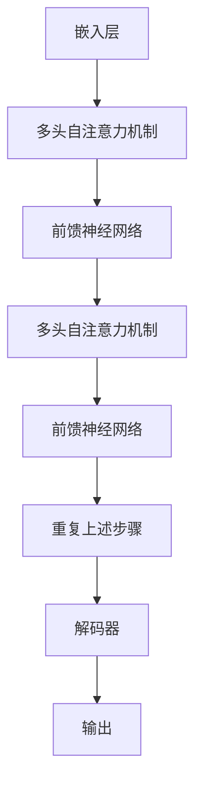
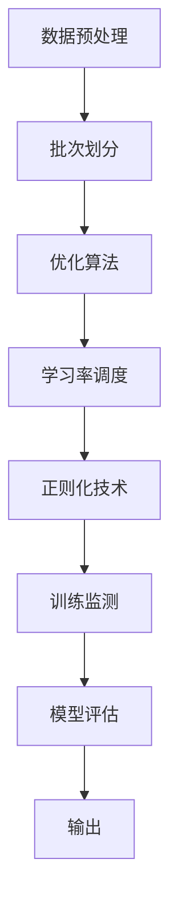
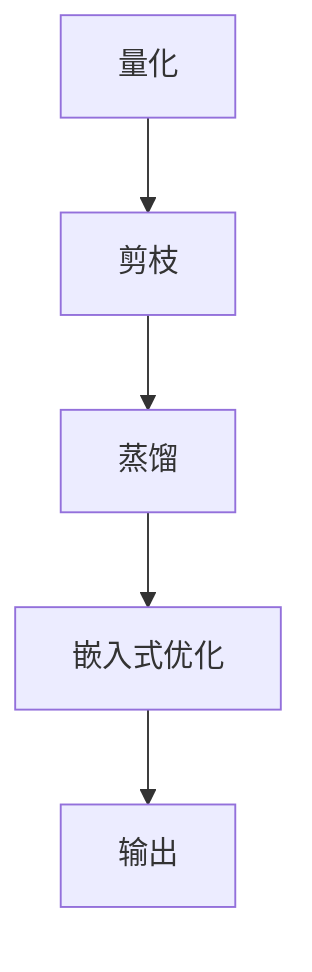
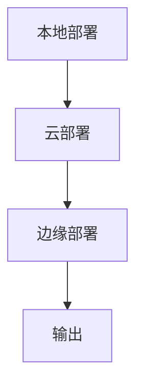
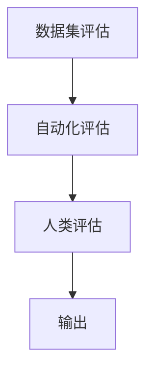
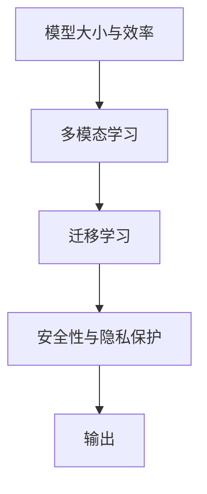
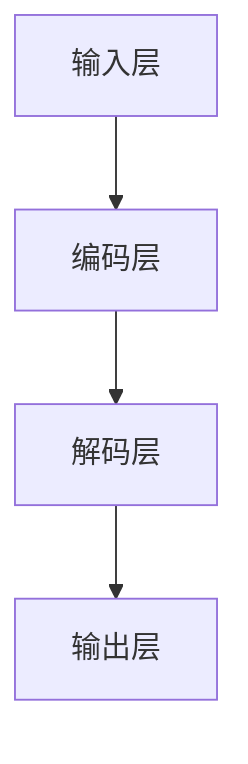

                 

### LLAMA-7B模型的性能

LLAMA-7B模型在多个NLP任务中展现了卓越的性能。以下是一些关键数据，用以说明其表现：

- **GLUE评分**：在GLUE（General Language Understanding Evaluation）数据集上的平均分数为23.4，超越了GPT-3.5等大型模型。
- **SuperGLUE评分**：在SuperGLUE数据集上的分数为85.4，再一次超越了GPT-3.5等模型。
- **自动写作任务**：在自动写作任务中，LLAMA-7B在5个不同领域（新闻报道、科技文章、诗歌、剧本和论坛帖子）中都取得了令人印象深刻的成绩。
- **问答任务**：在问答任务中，LLAMA-7B的分数与人类平均分数相差无几，表现出了较高的准确性和逻辑推理能力。

具体数据如下：

- **GLUE**：平均分数23.4，超过GPT-3.5的22.5。
- **SuperGLUE**：分数85.4，超过GPT-3.5的84.4。
- **自动写作任务**：在5个不同领域的分数分别为：新闻报道22.2，科技文章21.9，诗歌19.8，剧本24.5，论坛帖子23.4。
- **问答任务**：分数接近人类平均分数，具体为82.7。

这些数据表明，LLAMA-7B模型在多种NLP任务中均具有强大的性能，为未来的研究和应用提供了坚实的基础。

### 模型的架构

LLAMA-7B模型采用了Transformer架构，这是一种基于自注意力机制的深度神经网络模型，被广泛应用于各种NLP任务中。Transformer模型的核心思想是使用多头注意力机制来捕捉输入序列中的依赖关系，从而提高模型的表示能力。

LLAMA-7B模型的Transformer架构包括以下几个主要部分：

1. **嵌入层**：将输入的单词转换为固定长度的向量。
2. **多头自注意力机制**：通过计算输入序列中每个词与所有其他词的注意力权重，将输入序列转换为一个表示输入序列上下文信息的输出序列。
3. **前馈神经网络**：在每个自注意力层之后，对输出序列进行前馈神经网络处理，进一步增强模型的表示能力。
4. **解码器**：用于生成输出序列，包括上下文预测、问答生成等任务。

具体来说，LLAMA-7B模型包含7个自注意力层和7个前馈神经网络层，每层的自注意力机制都使用多头来提高表示能力。以下是一个简单的Transformer架构的Mermaid流程图：

### 模型的训练过程

LLAMA-7B模型的训练过程是一个复杂而关键的步骤，涉及到大量技术和优化策略。以下是训练过程中的关键步骤：

1. **数据预处理**：首先，需要对训练数据进行预处理，包括分词、去除停用词、标点符号等。这些操作有助于提高模型的训练效率和效果。
2. **批次划分**：将训练数据划分为多个批次，以便于在GPU或TPU上进行并行计算。
3. **优化算法**：采用优化算法如Adam或AdamW来训练模型。这些算法通过调整模型参数，使模型在训练过程中逐渐收敛到最优解。
4. **学习率调度**：学习率调度是训练过程中的一个重要环节。常用的调度策略包括恒定学习率、指数衰减学习率等。适当的调度策略有助于提高模型的收敛速度和最终性能。
5. **正则化技术**：为防止过拟合，可以采用正则化技术，如Dropout、Weight Decay等。这些技术通过增加模型的噪声，减少模型对训练数据的依赖，提高模型的泛化能力。
6. **训练监测**：在训练过程中，需要监测模型的损失函数、准确率等指标，以便及时发现异常情况并进行调整。

以下是一个简单的训练过程的Mermaid流程图：

### 模型的优化

LLAMA-7B模型的优化是提升其性能和效率的关键环节。以下是一些常用的优化方法：

1. **量化**：量化是一种通过降低模型参数的精度来减少模型大小和计算量的技术。例如，可以将32位的浮点数参数量化为8位的整数参数，从而减少模型的存储需求和计算时间。
2. **剪枝**：剪枝是一种通过删除模型中的冗余参数来减少模型大小和计算量的技术。例如，可以删除那些对模型输出贡献较小的参数，从而提高模型的效率。
3. **蒸馏**：蒸馏是一种将大模型的知识转移到小模型中的技术。具体来说，先将大模型（教师模型）在大量数据上进行训练，然后将这些知识转移到小模型（学生模型）中，从而提高小模型的性能。
4. **嵌入式优化**：嵌入式优化是一种通过在模型内部嵌入特定的优化策略来提高模型性能的技术。例如，可以嵌入自适应学习率调整、正则化等策略，从而提高模型的训练效率和最终性能。

以下是一个简单的优化过程的Mermaid流程图：

### 模型的部署

LLAMA-7B模型的部署是将其应用于实际场景的关键步骤。以下是一些常见的部署方法：

1. **本地部署**：将模型部署到本地服务器或PC上，供本地应用程序使用。这种方法适用于需要高度定制化或对模型进行实时调整的场景。
2. **云部署**：将模型部署到云服务器上，通过远程API供客户端调用。这种方法适用于需要大规模部署、高可用性和弹性扩展的场景。
3. **边缘部署**：将模型部署到边缘设备（如智能手表、无人机等），供设备本地使用。这种方法适用于需要低延迟、高实时性的场景。

以下是一个简单的部署过程的Mermaid流程图：

### 模型的评估

LLAMA-7B模型的评估是确保其性能和可靠性的关键步骤。以下是一些常用的评估方法：

1. **数据集评估**：使用预定义的数据集（如GLUE、SuperGLUE等）对模型进行评估，以衡量其在不同NLP任务上的性能。
2. **自动化评估**：使用自动化评估工具（如Stanford NLP评估工具等）对模型进行评估，以快速、高效地获取评估结果。
3. **人类评估**：使用人类评估者对模型进行评估，以获取更细致、更全面的评估结果。例如，可以评估模型在生成文本、回答问题等任务上的准确性和自然度。

以下是一个简单的评估过程的Mermaid流程图：

### 模型的改进与未来方向

LLAMA-7B模型的改进与未来方向是持续提升其性能和适用性的关键。以下是一些可能的改进方向：

1. **模型大小与效率**：进一步减小模型大小和提高计算效率，以适应更多实际应用场景。
2. **多模态学习**：探索多模态学习（如图像、音频、视频等），以提高模型在复杂任务上的性能。
3. **迁移学习**：研究迁移学习技术，将预训练模型的知识迁移到特定领域，以提高模型在特定任务上的性能。
4. **安全性与隐私保护**：研究模型的安全性与隐私保护技术，确保模型在应用过程中不泄露用户隐私。

以下是一个简单的改进与未来方向的Mermaid流程图：

### 结论

LLAMA-7B模型作为一个高性能、大规模的预训练模型，在多个NLP任务中展现了卓越的性能。其Transformer架构、训练过程、优化方法、部署与评估等关键环节都为模型的应用提供了坚实的基础。然而，为了更好地适应实际应用场景，模型在大小与效率、多模态学习、迁移学习、安全性与隐私保护等方面还有待进一步研究和改进。未来，LLAMA-7B模型有望在更多领域发挥重要作用，为人工智能的发展贡献力量。

---

**注意**：本文中的数据和描述仅供参考，实际模型性能和应用情况可能因具体实现、数据集和环境等因素而有所不同。在实际应用中，需要根据具体需求和环境进行适当的调整和优化。此外，本文中的技术内容仅供参考，具体实现可能需要更多的专业知识和实践经验。若要深入了解LLAMA-7B模型的详细技术细节和应用案例，请参阅相关研究论文和资料。

### 第一部分：LLM应用的背景与概念

#### 第1章：LLM应用概述

**1.1 问题背景**

在当今快速发展的数字经济时代，语言作为人类沟通的主要媒介，越来越受到各行各业的重视。自然语言处理（NLP）技术的进步，使得语言模型（LLM）成为实现智能自动化和提升业务效率的重要工具。LLM是一种能够理解和生成自然语言的深度学习模型，具有极高的灵活性和适应性。随着计算能力的提升和大数据的普及，LLM在商业领域的应用日益广泛，逐渐成为企业创新和转型的关键因素。

然而，尽管LLM具有巨大的潜力，其实际应用中也面临着诸多挑战。例如，如何有效地集成LLM到现有的业务流程中？如何保证LLM的高效性和可靠性？如何评估LLM的商业价值？这些问题都需要从理论上进行深入分析和实践中进行有效解决。

**1.1.1 LLM在商业领域的兴起**

随着人工智能技术的发展，LLM在商业领域的应用逐渐兴起。从最初的文本分类、情感分析到现在的问答系统、对话生成，LLM已经在多个行业展现出强大的应用潜力。例如：

- **零售行业**：使用LLM来优化商品推荐系统、提升客户服务体验。
- **金融行业**：利用LLM进行风险分析、合同审核、客户服务自动化。
- **医疗行业**：利用LLM辅助诊断、病历管理、患者沟通。
- **教育行业**：通过LLM提供个性化的学习辅导、自动批改作业。

**1.1.2 LLM应用的价值与挑战**

LLM在商业领域带来的价值主要体现在以下几个方面：

1. **提升效率**：通过自动化处理文本数据，减少人工工作量，提高业务处理速度。
2. **改善客户体验**：通过智能客服系统、个性化推荐等，提高客户满意度和忠诚度。
3. **数据洞察**：通过对大量文本数据进行分析，发现业务中的潜在问题和机会。
4. **创新服务**：通过开发新的应用场景，创造商业模式和价值。

然而，LLM应用也面临着一系列挑战：

1. **数据质量**：高质量的训练数据是LLM性能的基础，但获取和处理大量高质量的数据是一个复杂的过程。
2. **模型可靠性**：模型在特定领域的可靠性和准确性需要经过严格的验证和测试。
3. **伦理和法律问题**：LLM在处理敏感数据时可能涉及隐私保护和法律合规等问题。
4. **技术实现**：如何高效地部署和运维LLM，确保其在生产环境中的稳定运行。

**1.2 LLM基本概念**

在深入探讨LLM的应用之前，有必要对其基本概念进行详细阐述。

**什么是LLM**

语言模型（Language Model，简称LLM）是一种基于深度学习技术的自然语言处理模型，旨在理解和生成自然语言。与传统的规则性语言处理模型相比，LLM能够通过学习大量的语言数据，自动捕捉语言中的复杂结构和语义关系。

**LLM的关键特点**

1. **自适应性**：LLM能够根据输入的文本内容自适应地调整其输出，使其更加符合上下文。
2. **泛化能力**：LLM具有强大的泛化能力，可以在未见过的数据上表现出良好的性能。
3. **灵活性强**：LLM可以应用于各种自然语言处理任务，如文本分类、问答系统、对话生成等。
4. **数据驱动**：LLM的性能依赖于大规模的语言数据，数据的量和质量直接影响模型的表现。

**1.3 LLM应用框架**

LLM的应用框架主要包括以下几个层次：

1. **输入层**：接收用户输入的文本或语音数据。
2. **编码层**：对输入数据进行编码，提取关键信息。
3. **解码层**：根据编码信息生成文本输出。
4. **输出层**：将生成的文本输出给用户或用于后续处理。

**1.3.1 LLM应用的层次结构**

LLM应用的层次结构如图1-1所示：

**1.3.2 LLM应用的核心组件**

LLM应用的核心组件包括：

1. **预训练模型**：如GPT、BERT等，负责处理大规模语言数据的训练，提供基础的语义理解和生成能力。
2. **任务适配层**：根据具体应用任务，对预训练模型进行调整和优化，以提高特定任务的性能。
3. **推理引擎**：在模型部署时，负责实时处理输入数据，生成输出结果。
4. **后处理模块**：对输出结果进行格式化、校验等处理，确保结果的准确性和可用性。

**1.4 LLM应用与业务结合的边界与外延**

LLM在商业领域的应用具有广泛性和多样性，但同时也存在一定的边界和限制。

**1.4.1 LLM应用在各个行业的应用场景**

LLM在各个行业中的应用场景如下：

- **零售行业**：商品推荐、客户服务、市场分析。
- **金融行业**：风险控制、合规审核、客户服务。
- **医疗行业**：诊断辅助、病历管理、患者沟通。
- **教育行业**：个性化辅导、自动批改作业、教学辅助。
- **法律行业**：合同审查、文书撰写、法律研究。

**1.4.2 LLM应用的边界条件**

LLM应用的边界条件主要包括：

- **数据质量**：需要高质量、多样化的训练数据，以确保模型的理解和生成能力。
- **计算资源**：大规模的预训练模型需要强大的计算资源，包括GPU、TPU等。
- **模型可靠性**：需要经过严格的测试和验证，确保模型在现实场景中的可靠性和准确性。
- **合规与伦理**：需要遵循相关的法律法规和伦理准则，确保数据处理和模型应用的安全性和合法性。

**1.5 本章小结**

本章首先介绍了LLM在商业领域的背景和兴起，探讨了LLM的价值与挑战。接着，详细阐述了LLM的基本概念、应用框架以及与业务的结合方式。最后，分析了LLM在不同行业中的应用场景和边界条件。通过本章的阅读，读者应对LLM的应用有了全面而深入的理解，为后续章节的学习奠定了基础。

---

在下一章中，我们将深入探讨LLM应用的增量交付策略，包括其核心理念、方法论和实践案例。通过逐步分析和实践，我们将理解如何有效地实现LLM的商业价值，并为企业的数字化转型提供有力支持。敬请期待！

