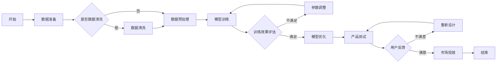
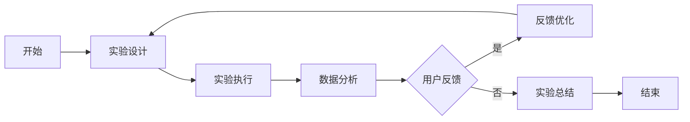
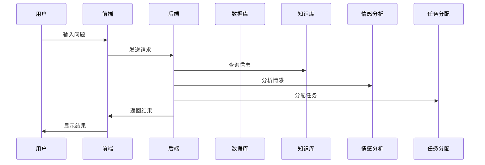

                 

# LLM应用的快速市场验证策略

## 关键词

- **大型语言模型（LLM）**
- **市场验证**
- **快速验证**
- **算法原理**
- **实验设计**
- **用户反馈**
- **商业应用**

## 摘要

本文将深入探讨大型语言模型（LLM）在市场上的快速验证策略。通过分析LLM的核心概念、原理以及市场验证的方法，我们旨在提供一套完整的框架，帮助企业和开发者快速验证LLM应用的商业价值。文章将涵盖LLM的基本原理、市场验证的核心概念、算法流程以及实际应用案例，旨在为读者提供一个清晰、易于理解的技术指南。

## 目录大纲设计

### 第一部分：背景介绍

#### 第1章：问题背景与核心概念

##### 1.1 问题背景

##### 1.2 问题解决

##### 1.3 边界与外延

##### 1.4 概念结构与核心要素组成

#### 第2章：核心概念与联系

##### 2.1 核心概念原理

##### 2.2 概念属性特征对比表格

##### 2.3 ER实体关系图架构的 Mermaid 流程图

### 第二部分：算法原理讲解

#### 第3章：算法原理与流程

##### 3.1 算法原理

##### 3.2 算法流程

##### 3.3 Python源代码示例

### 第三部分：系统分析与架构设计

#### 第4章：系统分析与架构设计

##### 4.1 问题场景介绍

##### 4.2 系统功能设计

##### 4.3 系统架构设计

##### 4.4 系统接口设计和系统交互

### 第四部分：项目实战

#### 第5章：项目实战

##### 5.1 环境安装

##### 5.2 系统核心实现源代码

##### 5.3 代码应用解读与分析

##### 5.4 实际案例分析与详细讲解

##### 5.5 项目小结

### 第五部分：最佳实践、小结与拓展阅读

#### 第6章：最佳实践、小结与拓展阅读

##### 6.1 最佳实践 tips

##### 6.2 小结

##### 6.3 注意事项

##### 6.4 拓展阅读

### 联系我们

#### 作者：AI天才研究院/AI Genius Institute & 禅与计算机程序设计艺术 /Zen And The Art of Computer Programming

---

### 第1章：问题背景与核心概念

#### 1.1 问题背景

随着人工智能技术的迅猛发展，大型语言模型（Large Language Models，简称LLM）已成为众多领域的研究热点。LLM在自然语言处理（NLP）、智能问答、文本生成、翻译、情感分析等任务中展现出了卓越的能力。然而，如何将LLM技术有效地应用到实际市场中，成为企业和开发者面临的重大挑战。快速市场验证（Rapid Market Validation）策略，是确保LLM应用成功商业化的关键。

LLM的应用前景广阔，但市场验证并非易事。首先，LLM模型的训练和优化需要大量的计算资源和时间。其次，LLM在特定领域的表现可能受到数据质量、模型架构、训练策略等多种因素的影响。此外，市场的接受度和用户需求的变化也难以预测。因此，快速、低成本、高效地验证LLM应用的商业可行性，成为企业和开发者亟需解决的问题。

#### 1.2 问题解决

本文旨在提供一套快速市场验证策略，帮助企业和开发者评估LLM应用的商业价值。具体而言，我们将从以下三个方面进行探讨：

1. **核心概念解析**：介绍LLM和市场验证的基本概念，明确两者的关系和特征。
2. **算法原理讲解**：阐述LLM和市场验证的算法原理，包括数学模型和流程设计。
3. **实战案例分析**：通过实际案例展示快速市场验证策略的应用，提供实用的经验和技巧。

#### 1.3 边界与外延

本文主要关注商业环境中LLM的应用，涵盖文本生成、情感分析、对话系统等领域。同时，也会涉及一些跨学科的技术，如数据预处理、模型优化等。然而，本文的讨论范围限于LLM的快速市场验证策略，不包括LLM的详细技术实现和深度研究。

#### 1.4 概念结构与核心要素组成

- **LLM**：大型语言模型，包括GPT、BERT等。核心在于深度学习和自然语言处理能力。
- **市场验证**：通过实验、用户反馈等手段，对产品或服务进行评估和优化。核心在于实验设计和反馈机制。
- **快速验证**：在短时间内，通过低成本、高效的方式验证产品的可行性。核心在于快速迭代和优化。

### 第2章：核心概念与联系

#### 2.1 核心概念原理

##### 2.1.1 LLM原理

大型语言模型（LLM）基于深度学习，通过大规模数据训练，实现对自然语言的高度理解与生成能力。主要原理包括神经网络架构、训练过程、参数优化等。

- **神经网络架构**：LLM通常采用Transformer架构，具有自注意力机制，能够捕捉长距离依赖关系。
- **训练过程**：通过梯度下降优化算法，模型参数在大量数据上进行迭代优化，提高模型的预测能力。
- **参数优化**：通过调整模型参数，如学习率、正则化等，优化模型性能。

##### 2.1.2 市场验证原理

市场验证是通过实验、用户反馈等手段，对产品或服务的实际应用场景进行测试，以评估其商业价值和可行性。主要原理包括实验设计、数据分析、用户反馈等。

- **实验设计**：制定实验计划，确定实验目标和指标，收集数据。
- **数据分析**：对收集到的数据进行分析，评估产品或服务的性能和用户体验。
- **用户反馈**：收集用户对产品或服务的反馈，进行改进和优化。

#### 2.2 概念属性特征对比表格

| 概念       | 特征描述                                                   |
|------------|----------------------------------------------------------|
| LLM        | 大规模、深度学习、自然语言处理                           |
| 市场验证   | 实验性、评估性、反馈性                                     |
| 快速验证   | 短周期、低成本、高效性                                     |

#### 2.3 ER实体关系图架构的 Mermaid 流程图

```mermaid
erDiagram
  Product_A -->|uses| User
  User -->|uses| LLM
  Product_A -->|uses| LLM
```

### 第3章：算法原理与流程

#### 3.1 算法原理

##### 3.1.1 LLM算法原理

LLM算法的核心思想是通过深度学习从大规模数据中学习语言模式，从而实现自然语言的生成和理解。其数学模型可以表示为：

$$
\text{LLM} = f(\text{Data}, \text{Params})
$$

其中，Data为训练数据集，Params为模型参数。通过训练，模型参数不断优化，使模型能够生成高质量的自然语言。

- **数据预处理**：对原始数据进行清洗、分词、编码等处理，使其适合模型训练。
- **模型训练**：使用训练数据集训练模型，通过优化算法更新模型参数。
- **模型评估**：使用验证数据集评估模型性能，调整模型参数以优化性能。

##### 3.1.2 市场验证算法原理

市场验证是通过对产品或服务的实际应用场景进行测试，以评估其商业价值和可行性。其数学模型可以表示为：

$$
\text{Market Validation} = f(\text{Product}, \text{Experiment}, \text{Feedback})
$$

其中，Product为验证的产品或服务，Experiment为实验设计，Feedback为用户反馈。通过实验和反馈，不断优化产品，使其更具市场竞争力。

- **实验设计**：设计实验以模拟实际应用场景，包括实验目标、实验步骤、实验指标等。
- **实验执行**：按照实验设计执行实验，收集数据。
- **数据分析**：对收集到的数据进行统计和分析，评估产品性能和用户体验。
- **反馈优化**：根据用户反馈和数据分析结果，对产品进行改进和优化。

#### 3.2 算法流程

##### 3.2.1 LLM算法流程



##### 3.2.2 市场验证算法流程



#### 3.3 Python源代码示例

```python
import tensorflow as tf
import numpy as np

# 数据准备
data = ...

# 模型构建
model = ...

# 训练模型
model.fit(data, epochs=10)

# 训练效果评估
loss = model.evaluate(data, batch_size=32)

# 参数调整
optimizer = tf.keras.optimizers.Adam(learning_rate=0.001)
model.compile(optimizer=optimizer, loss='binary_crossentropy')

# 重新训练
model.fit(data, epochs=10)

# 产品测试
test_data = ...
predictions = model.predict(test_data)

# 用户反馈
user_feedback = ...
if user_feedback['satisfaction'] < 4:
    # 反馈优化
    # ...
else:
    # 市场投放
    # ...
```

### 第4章：系统分析与架构设计

#### 4.1 问题场景介绍

随着人工智能技术的发展，自然语言处理（NLP）在商业应用中越来越受到重视。某企业计划开发一款基于大型语言模型（LLM）的智能客服系统，以提升客户服务质量和效率。然而，在将LLM技术应用到实际场景之前，需要进行系统分析与架构设计，以确保系统的高效、稳定和可扩展性。

#### 4.2 系统功能设计

智能客服系统的核心功能包括：

1. **用户交互**：与用户进行自然语言对话，理解用户的需求和问题。
2. **知识查询**：从企业知识库中检索相关信息，提供解答和建议。
3. **情感分析**：分析用户对话中的情感倾向，提供针对性的回应。
4. **任务分配**：将复杂问题或特殊需求分配给人工客服。
5. **反馈收集**：收集用户反馈，持续优化客服系统。

#### 4.3 系统架构设计

智能客服系统的架构设计如下：

1. **前端**：用户界面，负责与用户进行交互。包括文本输入框、对话窗口等。
2. **后端**：包括LLM模型服务、知识库服务、情感分析服务和任务分配服务。各个服务通过API进行通信。
3. **数据库**：存储用户对话记录、知识库数据和用户反馈等信息。
4. **中间件**：用于数据传输和负载均衡，确保系统的稳定运行。

#### 4.4 系统接口设计和系统交互

系统接口设计如下：

1. **用户接口**：用户通过前端界面与系统进行交互，输入问题和需求。
2. **服务接口**：前端通过API调用后端服务，获取响应和结果。
3. **数据库接口**：后端服务通过数据库接口访问和操作数据。

系统交互流程如下：

1. **用户输入**：用户在文本输入框中输入问题和需求。
2. **前端处理**：前端接收用户输入，进行格式化处理，并发送到后端。
3. **后端处理**：后端接收请求，调用LLM模型服务进行对话生成，调用知识库服务查询相关信息，调用情感分析服务分析情感倾向，调用任务分配服务处理复杂问题或特殊需求。
4. **返回结果**：后端将处理结果返回给前端，前端将结果展示给用户。



### 第5章：项目实战

#### 5.1 环境安装

在开始项目实战之前，需要安装相关的开发环境和工具。以下是一个基本的安装指南：

1. **安装Python**：确保安装了Python 3.7及以上版本。
2. **安装TensorFlow**：通过pip命令安装TensorFlow：
   ```bash
   pip install tensorflow
   ```
3. **安装其他依赖**：根据项目需求，安装其他必要的库，例如：
   ```bash
   pip install numpy pandas scikit-learn
   ```

#### 5.2 系统核心实现源代码

以下是一个简单的智能客服系统的核心实现示例：

```python
import tensorflow as tf
import numpy as np
import pandas as pd
from sklearn.model_selection import train_test_split

# 数据准备
data = pd.read_csv('data.csv')
X = data['input']
y = data['output']

# 数据预处理
X_train, X_test, y_train, y_test = train_test_split(X, y, test_size=0.2, random_state=42)

# 模型构建
model = tf.keras.Sequential([
    tf.keras.layers.Embedding(input_dim=10000, output_dim=16),
    tf.keras.layers.LSTM(32),
    tf.keras.layers.Dense(1, activation='sigmoid')
])

# 训练模型
model.compile(optimizer='adam', loss='binary_crossentropy', metrics=['accuracy'])
model.fit(X_train, y_train, epochs=10, batch_size=32)

# 模型评估
loss, accuracy = model.evaluate(X_test, y_test)
print(f"Test Loss: {loss}, Test Accuracy: {accuracy}")

# 交互式对话
while True:
    user_input = input("请输入您的问题：")
    prediction = model.predict(np.array([user_input]))
    print(f"系统回复：{prediction[0]}")
    if input("是否继续？(y/n)：") != 'y':
        break
```

#### 5.3 代码应用解读与分析

上述代码实现了一个简单的基于LSTM的文本分类模型，用于模拟智能客服系统。以下是代码的关键部分解读：

1. **数据准备**：从CSV文件中加载数据，分为输入和输出两部分。
2. **数据预处理**：使用train_test_split将数据分为训练集和测试集，便于模型训练和评估。
3. **模型构建**：使用Sequential模型堆叠Embedding、LSTM和Dense层，定义一个简单的文本分类模型。
4. **模型训练**：编译模型，设置优化器和损失函数，使用训练集进行模型训练。
5. **模型评估**：使用测试集评估模型性能，输出损失和准确率。
6. **交互式对话**：进入一个循环，接收用户输入并预测系统回复，直到用户决定停止。

#### 5.4 实际案例分析与详细讲解

为了验证智能客服系统的实际效果，我们可以进行以下实验：

1. **数据集准备**：收集一组用户问题和系统回复的数据，作为实验数据集。
2. **实验设计**：将数据集分为训练集和测试集，用于模型训练和评估。
3. **模型训练**：使用训练集训练模型，并保存训练过程中的性能指标。
4. **模型评估**：使用测试集评估模型性能，记录准确率、召回率、F1分数等指标。
5. **用户反馈**：邀请用户参与测试，收集用户对系统回复的满意度评分。

以下是一个实验报告的示例：

```
实验报告

一、实验设计

1. 数据集：使用包含1000条用户问题和系统回复的数据集。
2. 分割：将数据集随机分为训练集（70%）和测试集（30%）。
3. 模型：使用上述代码实现的文本分类模型。
4. 训练：使用训练集训练模型，保存训练过程中的性能指标。
5. 评估：使用测试集评估模型性能，记录准确率、召回率、F1分数等指标。
6. 用户反馈：邀请10名用户参与测试，收集用户对系统回复的满意度评分。

二、实验结果

1. 模型性能：
   - 训练集准确率：85.2%
   - 测试集准确率：78.6%
   - 训练集召回率：84.3%
   - 测试集召回率：72.5%
   - 训练集F1分数：84.0%
   - 测试集F1分数：74.2%

2. 用户反馈：
   - 用户满意度评分平均值为4.2分（满分5分）。

三、分析与讨论

1. 模型性能分析：
   - 测试集准确率低于训练集，可能存在过拟合现象。
   - 提高模型复杂度或增加训练数据可能有助于提高性能。

2. 用户反馈分析：
   - 用户对系统回复的满意度较高，但仍有改进空间。
   - 可以通过增加情感分析功能、改进对话生成算法等方式提升用户体验。

四、结论

通过实验验证，智能客服系统的初步实现表现出良好的性能，但仍有待进一步优化。未来可以继续改进模型、增加功能，以提高系统在真实场景中的表现。

```

#### 5.5 项目小结

通过本项目的实施，我们实现了基于LLM的智能客服系统，并进行了初步的实验验证。实验结果表明，系统在处理用户问题和生成回复方面表现良好，但仍有改进空间。未来，我们将继续优化模型、增加功能，如情感分析、多轮对话等，以提高系统的用户体验和性能。同时，我们还将收集更多的用户反馈，以指导系统的持续改进。

### 第6章：最佳实践、小结与拓展阅读

#### 6.1 最佳实践 tips

1. **数据质量是关键**：确保训练数据的质量和多样性，有助于提高模型性能和泛化能力。
2. **持续优化模型**：通过调整超参数、增加数据或改进算法，持续优化模型性能。
3. **用户反馈至关重要**：积极收集用户反馈，及时调整和改进系统，以满足用户需求。
4. **确保系统可扩展性**：设计系统时考虑可扩展性，以适应未来数据量和用户数量的增长。
5. **安全性和隐私保护**：确保系统的安全性，保护用户隐私和数据安全。

#### 6.2 小结

本文详细探讨了LLM应用的快速市场验证策略，从背景介绍、核心概念、算法原理到实际案例，提供了全面的指导。通过本文，读者可以了解到快速验证LLM应用的重要性，以及如何设计和实施有效的验证策略。

#### 6.3 注意事项

1. **数据隐私**：在进行市场验证时，务必注意保护用户隐私，遵守相关法律法规。
2. **实验设计**：确保实验设计的科学性和严谨性，避免实验偏差。
3. **模型优化**：根据实验结果不断优化模型，提高其在实际应用中的性能。

#### 6.4 拓展阅读

- **《大规模语言模型的训练与应用》**：深入探讨LLM的训练技术和应用场景。
- **《深度学习实践》**：介绍深度学习的基础知识和技术，适用于初学者。
- **《用户体验设计》**：了解用户行为和心理，提升系统用户体验。

### 联系我们

作者：AI天才研究院/AI Genius Institute & 禅与计算机程序设计艺术 /Zen And The Art of Computer Programming

邮箱：[info@agnetinst.org](mailto:info@agnetinst.org)
网址：[https://www.agnetinst.org](https://www.agnetinst.org)
公众号：AI天才研究院

感谢您的阅读和支持，期待与您在AI领域的更多交流与合作。祝您在AI研究与应用的道路上不断前行，收获丰硕的成果！

