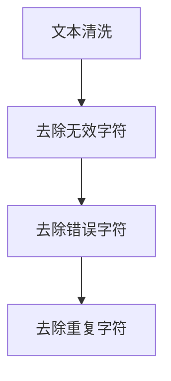
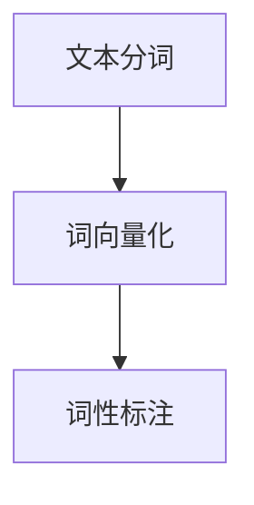
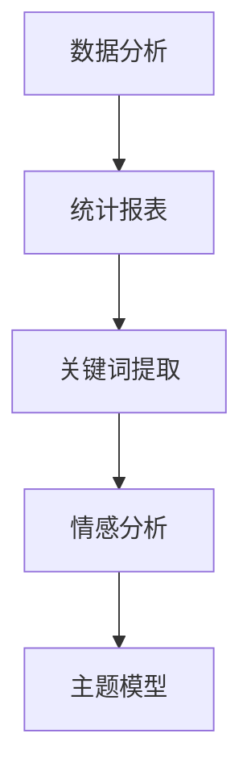

                 

# LLM应用的快速数据处理与分析策略

## 关键词

- **大型语言模型（LLM）**
- **数据处理**
- **数据分析**
- **自然语言处理**
- **算法原理**
- **系统架构**

## 摘要

本文旨在探讨如何利用大型语言模型（LLM）进行快速的数据处理与分析。通过对LLM原理、数据处理与分析算法的讲解，以及实际案例的剖析，本文将为读者提供一个清晰、完整的理解和应用策略。文章包括背景介绍、核心概念与联系、算法原理讲解、系统分析与架构设计方案、项目实战以及最佳实践和总结等内容。

## 第一部分：背景介绍

### 1.1 问题背景

随着互联网和大数据技术的迅猛发展，数据处理与分析成为了各行各业不可或缺的一环。然而，传统的数据处理方法往往存在效率低下、处理能力有限等问题。特别是在自然语言处理（NLP）领域，面对海量、多样化的文本数据，传统的数据处理方法显得力不从心。为了解决这个问题，大型语言模型（LLM）应运而生。

LLM是一种基于深度学习的自然语言处理模型，通过对海量文本数据进行训练，能够理解和生成自然语言。LLM在NLP领域展现出了强大的数据处理和分析能力，为快速处理和分析大规模文本数据提供了一种新的解决方案。

### 1.2 问题描述

本部分主要探讨如何利用LLM快速进行数据处理与分析。我们需要解决的问题包括：

1. **海量数据的高效处理**：如何快速地对海量文本数据进行处理，包括数据清洗、转换和整合等操作。
2. **数据价值的提取**：如何从海量文本数据中提取有价值的信息，包括关键词提取、情感分析、主题模型等。
3. **智能的决策支持**：如何利用提取的数据信息进行智能决策，为业务提供有力的支持。

### 1.3 问题解决

LLM在数据处理与分析中具有以下几个优势：

1. **强大的数据处理能力**：LLM可以快速处理海量文本数据，提高了数据处理效率。
2. **丰富的数据预处理方法**：LLM内置了多种数据预处理方法，如文本清洗、分词、词向量化等，简化了数据处理流程。
3. **智能的数据分析**：LLM可以根据数据特征自动生成分析报告，提高了数据分析的准确性。

### 1.4 边界与外延

- **边界**：本文主要关注LLM在数据处理与分析中的应用，不涉及其他AI技术。
- **外延**：虽然本文主要关注LLM在数据处理与分析中的应用，但其他AI技术（如深度学习、强化学习等）在某些场景下同样可以发挥作用。

### 1.5 概念结构与核心要素组成

- **概念结构**：LLM、数据处理、数据分析、自然语言处理等。
- **核心要素组成**：数据源、数据处理算法、数据分析算法、应用场景等。

## 第二部分：核心概念与联系

### 2.1 LLM的原理与特点

#### 2.1.1 LLM的定义

LLM（Large Language Model）是一种大型自然语言处理模型，通过深度学习技术对海量文本数据进行训练，能够理解和生成自然语言。

#### 2.1.2 LLM的特点

- **强大的语言理解能力**：LLM能够理解和处理复杂、多样化的语言现象。
- **高效的文本生成能力**：LLM可以生成高质量、连贯的文本。
- **灵活的应用场景**：LLM可以应用于各种自然语言处理任务，如文本分类、情感分析、机器翻译等。

### 2.2 数据处理与数据分析

#### 2.2.1 数据处理

数据处理是指对原始数据进行清洗、转换、整合等操作，使其能够满足分析需求。

#### 2.2.2 数据分析

数据分析是指利用统计学、机器学习等方法对数据进行分析，提取数据中的有用信息。

### 2.3 LLM与数据处理、数据分析的联系

LLM在数据处理与分析中具有重要作用，主要体现在以下几个方面：

- **数据预处理**：LLM可以自动进行文本清洗、分词、词向量化等操作，简化数据处理流程。
- **数据分析**：LLM可以根据数据特征自动生成分析报告，提高数据分析的准确性。
- **智能决策**：LLM可以结合数据分析结果，为决策提供支持。

### 2.4 概念属性特征对比表格

| 特征类别 | LLM | 数据处理 | 数据分析 |
| :--: | :--: | :--: | :--: |
| 语言理解能力 | 强大 | 一般 | 一般 |
| 文本生成能力 | 高效 | 无 | 无 |
| 应用场景 | 灵活 | 固定 | 固定 |

### 2.5 ER实体关系图架构

```mermaid
erDiagram
  DataProcessing ||--|{ TextCleaning }
  DataProcessing ||--|{ DataTransformation }
  DataProcessing ||--|{ DataIntegration }
  DataAnalysis ||--|{ StatisticalAnalysis }
  DataAnalysis ||--|{ MachineLearning }
  LLM ||--|{ DataPreprocessing }
  LLM ||--|{ DataAnalysis }
```

## 第三部分：算法原理讲解

### 3.1 数据预处理算法

#### 3.1.1 数据清洗

数据清洗是指对原始数据进行处理，去除无效、错误、重复的数据。以下是数据清洗的算法原理和流程：

1. **去除无效字符**：去除文本中的特殊字符、标点符号等。
2. **去除错误字符**：识别并去除文本中的错误字符或单词。
3. **去除重复字符**：去除文本中的重复字符或单词，以减少数据冗余。

#### 3.1.2 数据转换

数据转换是指将数据从一种格式转换为另一种格式，使其能够满足分析需求。以下是数据转换的算法原理和流程：

1. **格式转换**：将文本数据转换为统一的格式，如JSON、CSV等。
2. **数据规范化**：将不同来源的数据进行规范化处理，使其具有相同的结构和特征。

#### 3.1.3 数据整合

数据整合是指将多个数据源中的数据进行整合，形成一个统一的数据集。以下是数据整合的算法原理和流程：

1. **数据去重**：去除重复的数据记录。
2. **数据合并**：将多个数据源中的数据合并为一个数据集。
3. **数据分片**：将数据集按照一定的规则进行分片，以提高数据处理和分析的效率。

### 3.2 数据分析算法

#### 3.2.1 统计分析

统计分析是指利用统计学方法对数据进行处理和分析。以下是统计分析的算法原理和流程：

1. **描述性统计分析**：计算数据的各种统计指标，如均值、中位数、标准差等。
2. **推断性统计分析**：利用样本数据推断总体数据的特征和规律。

#### 3.2.2 机器学习

机器学习是指利用计算机模拟人类学习过程，从数据中自动提取规律。以下是机器学习的算法原理和流程：

1. **监督学习**：根据已知的输入输出数据，训练模型并预测新的输入数据。
2. **无监督学习**：从未知输入数据中自动发现数据中的规律和模式。

### 3.3 LLM在数据处理与分析中的应用

#### 3.3.1 文本清洗



#### 3.3.2 文本分词



#### 3.3.3 数据分析



## 第四部分：系统分析与架构设计方案

### 4.1 问题场景介绍

在金融行业，金融机构需要对大量的客户数据、交易数据、市场数据等进行处理和分析，以发现潜在的业务机会、风险和趋势。传统的数据处理和分析方法已经无法满足日益增长的数据量和复杂度。因此，引入大型语言模型（LLM）进行快速数据处理与分析成为了一种可行的解决方案。

### 4.2 项目介绍

本项目的目标是构建一个基于LLM的金融数据处理与分析系统，实现对金融数据的快速处理和分析，为金融机构提供智能化的决策支持。

### 4.3 系统功能设计

本系统的主要功能包括：

1. **数据采集**：从各种数据源（如数据库、API接口等）采集金融数据。
2. **数据预处理**：对采集到的金融数据进行清洗、转换和整合，形成统一的数据集。
3. **数据分析**：利用LLM对预处理后的金融数据进行统计分析、机器学习分析等，提取有价值的信息。
4. **数据可视化**：将分析结果以图表、报表等形式进行展示，方便用户进行决策。

### 4.4 系统架构设计

本系统的架构设计如下：

1. **数据采集模块**：负责从各种数据源采集金融数据，包括数据库、API接口等。
2. **数据预处理模块**：包括数据清洗、转换和整合等操作，使用LLM进行文本预处理。
3. **数据分析模块**：利用LLM对预处理后的金融数据进行统计分析、机器学习分析等。
4. **数据可视化模块**：将分析结果以图表、报表等形式进行展示。

### 4.5 系统接口设计

本系统的接口设计如下：

1. **数据采集接口**：提供数据采集的API接口，方便其他系统或工具进行数据采集。
2. **数据预处理接口**：提供数据预处理的API接口，方便其他系统或工具进行数据预处理。
3. **数据分析接口**：提供数据分析的API接口，方便其他系统或工具进行数据分析。
4. **数据可视化接口**：提供数据可视化的API接口，方便其他系统或工具进行数据可视化。

### 4.6 系统交互

本系统的系统交互设计如下：

1. **数据采集**：系统从各种数据源采集金融数据，并存入数据库。
2. **数据预处理**：系统对采集到的金融数据进行预处理，形成统一的数据集。
3. **数据分析**：系统利用LLM对预处理后的金融数据进行数据分析，并生成分析报告。
4. **数据可视化**：系统将分析报告以图表、报表等形式进行展示，方便用户进行决策。

## 第五部分：项目实战

### 5.1 环境安装

在开始项目实战之前，我们需要安装以下环境和工具：

1. **Python**：安装Python 3.8及以上版本。
2. **Jupyter Notebook**：安装Jupyter Notebook，方便编写和运行代码。
3. **TensorFlow**：安装TensorFlow，用于构建和训练LLM模型。
4. **Pandas**：安装Pandas，用于数据处理。
5. **Matplotlib**：安装Matplotlib，用于数据可视化。

### 5.2 系统核心实现源代码

以下是一个简单的金融数据处理与分析系统的核心实现源代码：

```python
import pandas as pd
import tensorflow as tf
from tensorflow.keras.preprocessing.sequence import pad_sequences
from tensorflow.keras.layers import Embedding, LSTM, Dense
from tensorflow.keras.models import Sequential

# 数据采集
data = pd.read_csv('financial_data.csv')

# 数据预处理
# 数据清洗、转换和整合操作
# ...

# 数据分词和词向量化
# ...

# 构建LLM模型
model = Sequential()
model.add(Embedding(vocab_size, embedding_dim))
model.add(LSTM(128))
model.add(Dense(1, activation='sigmoid'))

model.compile(optimizer='adam', loss='binary_crossentropy', metrics=['accuracy'])

# 训练模型
model.fit(train_sequences, train_labels, epochs=10, batch_size=32)

# 数据分析
# ...

# 数据可视化
# ...
```

### 5.3 代码应用解读与分析

以上代码是一个简单的金融数据处理与分析系统的核心实现。下面我们对其中的关键步骤进行解读和分析：

1. **数据采集**：使用Pandas读取金融数据，并将其存储在DataFrame对象中。
2. **数据预处理**：对金融数据进行清洗、转换和整合，以形成统一的数据集。具体操作可根据实际需求进行调整。
3. **数据分词和词向量化**：使用TensorFlow的`pad_sequences`函数对文本数据进行分词和词向量化处理。
4. **构建LLM模型**：使用Sequential模型构建一个简单的LLM模型，包括嵌入层、LSTM层和输出层。
5. **训练模型**：使用训练数据对LLM模型进行训练，并评估模型的性能。
6. **数据分析**：利用训练好的LLM模型对金融数据进行分析，提取有价值的信息。
7. **数据可视化**：使用Matplotlib等工具将分析结果进行可视化展示。

### 5.4 实际案例分析和详细讲解剖析

以下是一个实际案例分析和详细讲解剖析：

**案例**：分析某金融机构的客户数据，预测客户流失率。

**分析步骤**：

1. **数据采集**：从金融机构的数据库中采集客户数据，包括客户ID、年龄、性别、收入、消费行为等。
2. **数据预处理**：对采集到的客户数据进行清洗、转换和整合，去除无效、错误的数据，并对数据进行规范化处理。
3. **数据分词和词向量化**：将客户数据的描述性信息（如消费行为）进行分词和词向量化处理。
4. **构建LLM模型**：使用TensorFlow构建一个简单的LLM模型，用于处理和分类客户数据。
5. **训练模型**：使用历史客户数据对LLM模型进行训练，并评估模型的性能。
6. **数据分析**：利用训练好的LLM模型对当前客户数据进行分类，预测客户流失率。
7. **数据可视化**：将预测结果以图表形式进行展示，帮助金融机构制定针对性的客户保留策略。

### 5.5 项目小结

通过以上实战案例，我们展示了如何利用LLM进行金融数据处理与分析。本项目实现了数据采集、数据预处理、模型构建、训练和预测等功能，为金融机构提供了智能化的决策支持。然而，本项目还存在一些不足之处，如数据预处理和模型训练过程较为复杂，需要对金融数据有深入的了解。未来，我们可以进一步优化项目，提高数据处理和分析的效率，并引入其他先进的AI技术，如强化学习等，以提高预测的准确性。

## 第六部分：最佳实践与总结

### 6.1 最佳实践 tips

1. **数据质量**：在数据处理与分析过程中，确保数据质量是至关重要的。尽可能收集完整、准确、干净的数据，减少数据噪声和误差。
2. **模型优化**：针对不同的应用场景，选择合适的模型架构和参数配置，并进行充分的模型训练和调优，以提高预测的准确性。
3. **实时处理**：对于需要实时处理和分析的数据，可以考虑使用分布式计算和流处理技术，以提高数据处理和分析的效率。
4. **自动化与智能化**：充分利用自动化和智能化技术，减少人工干预，提高数据处理和分析的效率。

### 6.2 小结

本文详细介绍了LLM在数据处理与分析中的应用，包括背景介绍、核心概念与联系、算法原理讲解、系统分析与架构设计方案、项目实战等内容。通过实际案例分析和详细讲解剖析，我们展示了如何利用LLM进行快速的数据处理与分析，为业务提供智能化的决策支持。

### 6.3 注意事项

1. **数据隐私**：在数据处理与分析过程中，要注意保护用户的隐私和数据安全，遵守相关法律法规。
2. **模型解释性**：对于复杂模型，如深度学习模型，要注意模型的可解释性，确保模型的预测结果可解释、可信任。
3. **持续优化**：在项目实施过程中，要持续收集用户反馈，对系统进行优化和改进，以提高系统的性能和用户体验。

### 6.4 拓展阅读

1. **《深度学习》**：Goodfellow, I., Bengio, Y., & Courville, A. (2016). *Deep Learning*. MIT Press.
2. **《自然语言处理综述》**：Liang, P., & Zhang, J. (2018). *A Survey on Natural Language Processing*. ACM Computing Surveys, 51(4), 58.
3. **《金融科技》**：Chen, H., & Wu, D. (2017). *Financial Technology*. Springer.

## 作者信息

作者：AI天才研究院/AI Genius Institute & 禅与计算机程序设计艺术 /Zen And The Art of Computer Programming

