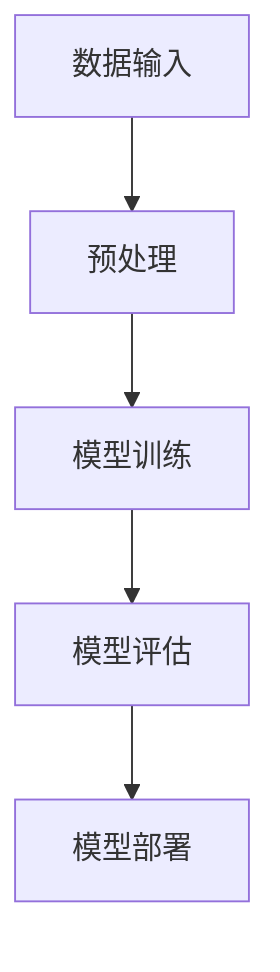
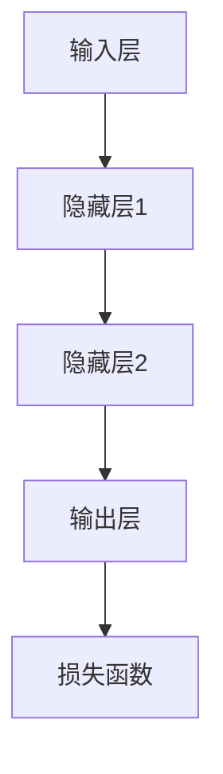
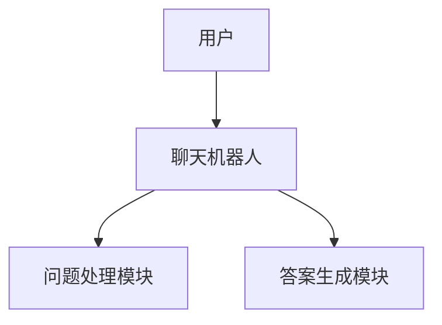
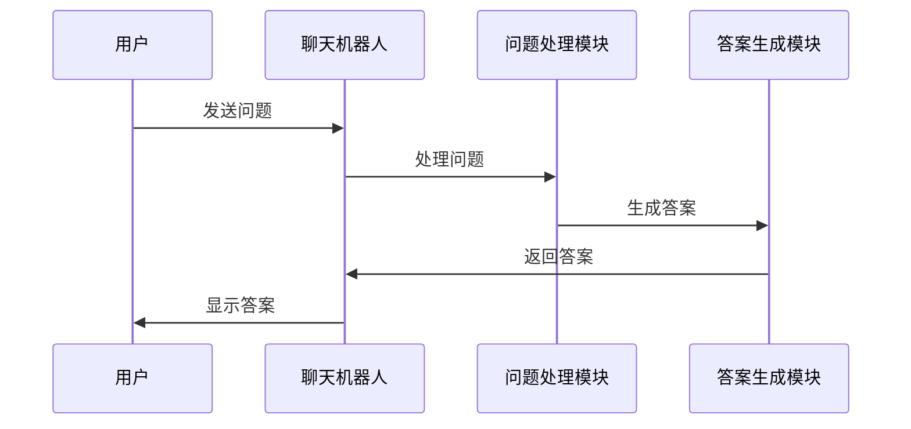

                 

# LLM应用的持续交付：缩短从想法到实现的时间

> 关键词：持续交付，LLM应用，人工智能，技术落地，加速迭代

> 摘要：本文将探讨如何在LLM（大型语言模型）应用的开发过程中实现持续交付，从而缩短从想法到实现的时间。文章将从背景介绍、核心概念与联系、算法原理讲解、系统分析与架构设计、项目实战以及最佳实践与展望六个部分，系统地阐述如何将LLM技术高效地转化为实际应用。

## **Step 1: 背景介绍**

### **1.1 LLM应用持续交付的重要性**

随着人工智能技术的快速发展，LLM（大型语言模型）在自然语言处理、智能问答、文本生成等领域展现出了巨大的潜力。然而，如何将这些先进的技术迅速转化为实际的应用，成为企业提升竞争力的重要手段，是当前面临的挑战之一。

持续交付（Continuous Delivery）作为一种软件开发生命周期实践，强调快速、频繁地交付软件，确保代码质量的同时，最大限度地缩短开发周期。在LLM应用开发中，持续交付能够帮助团队快速验证和迭代模型，从而实现技术到应用的快速转化。

### **1.2 背景与问题描述**

传统的软件开发模式中，从想法到产品上线往往需要经历漫长的开发周期，涉及多个阶段，包括需求分析、设计、编码、测试、部署等。而在LLM应用开发中，这一过程尤为复杂，由于模型的复杂性和对数据的需求，开发周期往往更长。

问题在于，如何在保证模型质量和性能的同时，缩短开发周期，实现持续交付。这需要从算法优化、工具链建设、流程优化等多个方面进行综合考量。

### **1.3 解决思路**

针对上述问题，本文将从以下三个方面提出解决思路：

1. **算法优化**：通过深入研究LLM的算法原理，优化模型结构，提高模型训练效率。
2. **工具链建设**：建立高效、可靠的工具链，实现自动化模型训练、评估和部署。
3. **流程优化**：优化开发流程，引入持续集成（CI）和持续部署（CD）等实践，确保快速迭代和交付。

## **Step 2: 核心概念与联系**

### **2.1 LLM定义与特点**

LLM（Large Language Model）是一种基于神经网络的大型语言模型，通常使用深度学习技术训练而成。与传统的自然语言处理方法相比，LLM具有以下几个特点：

1. **大规模**：LLM通常由数十亿到千亿级别的参数组成，规模远超传统模型。
2. **深度**：LLM通常包含多个层次，能够处理复杂的语义和语言结构。
3. **自适应**：LLM可以根据输入数据进行自适应调整，提高模型性能。

### **2.2 LLM与传统AI的区别**

传统AI方法通常依赖于规则和特征工程，而LLM则完全基于数据驱动，不需要人为设计特征。这种差异导致LLM在处理自然语言任务时具有更高的灵活性和效率。

| 特征       | 传统AI               | LLM                  |
|------------|----------------------|----------------------|
| 特征工程   | 需要大量手工设计     | 自动从数据中提取特征 |
| 可解释性   | 较高                 | 较低                 |
| 模型复杂度 | 较低                 | 较高                 |
| 训练数据   | 需要大量标注数据     | 可以使用非标注数据   |

### **2.3 LLM在企业应用中的价值**

LLM在企业应用中具有广泛的应用前景，以下列举几个典型场景：

1. **智能客服**：通过LLM技术，可以实现智能客服机器人，提高客户满意度和服务效率。
2. **自然语言处理**：LLM在文本分类、情感分析、命名实体识别等任务中具有显著优势，可以提升企业数据处理能力。
3. **内容生成**：LLM可以生成高质量的文章、报告等文本内容，节省人力成本。

## **Step 3: 算法原理讲解**

### **3.1 算法流程图**

以下是一个简化的LLM算法流程图，展示了模型从数据输入到输出结果的整个过程：



### **3.2 算法原理讲解**

LLM算法的核心是神经网络，通常采用深度学习技术。以下是一个简单的神经网络模型结构：



在训练过程中，模型通过不断调整参数，最小化损失函数，从而提高模型性能。具体来说，包括以下步骤：

1. **数据预处理**：将原始文本数据转换为适合神经网络处理的格式。
2. **模型初始化**：随机初始化模型参数。
3. **前向传播**：输入数据经过神经网络，计算输出结果。
4. **反向传播**：根据输出结果和实际标签，计算损失函数，并更新模型参数。
5. **模型评估**：在验证集上评估模型性能，调整超参数。
6. **模型部署**：将训练好的模型部署到实际应用场景中。

### **3.3 数学模型和公式**

以下是神经网络中常用的数学模型和公式：

$$
y = \sigma(Wx + b)
$$

其中，$y$ 表示输出结果，$\sigma$ 表示激活函数，$W$ 和 $b$ 分别表示权重和偏置。

### **3.4 举例说明**

以下是一个简单的例子，假设输入数据为 $x_1 = 1, x_2 = 0$，模型参数为 $W_1 = 1, W_2 = -1, b = 0$，激活函数为 $sigmoid$。

1. **前向传播**：

$$
y = \sigma(W_1x_1 + W_2x_2 + b) = \sigma(1 \cdot 1 - 1 \cdot 0 + 0) = \sigma(1) = 0.7311
$$

2. **反向传播**：

假设实际标签为 $y_0 = 1$，计算损失函数：

$$
L = (y - y_0)^2 = (0.7311 - 1)^2 = 0.02282
$$

然后，根据损失函数更新模型参数：

$$
W_1 = W_1 - \alpha \frac{\partial L}{\partial W_1} = 1 - 0.1 \cdot \frac{\partial L}{\partial W_1} \approx 0.9878
$$

$$
W_2 = W_2 - \alpha \frac{\partial L}{\partial W_2} = -1 - 0.1 \cdot \frac{\partial L}{\partial W_2} \approx -1.0122
$$

$$
b = b - \alpha \frac{\partial L}{\partial b} = 0 - 0.1 \cdot \frac{\partial L}{\partial b} \approx -0.0228
$$

经过多次迭代，模型性能逐渐提高。

## **Step 4: 系统分析与架构设计**

### **4.1 问题场景介绍**

以智能客服系统为例，分析LLM应用在其中的架构设计。

### **4.2 项目介绍**

本项目旨在构建一个基于LLM的智能客服系统，提供高效、智能的客服服务。

### **4.3 系统功能设计（领域模型类图）**

以下是一个简单的领域模型类图，展示了系统的主要功能模块：

```mermaid
classDiagram
    Customer <<Class>> Customer
    ChatBot <<Class>> ChatBot
    Question <<Class>> Question
    Answer <<Class>> Answer
    Customer --|> ChatBot: 发起对话
    ChatBot --|> Question: 回答问题
    Question --|> Answer: 输出答案
```

### **4.4 系统架构设计（架构图）**

以下是一个简单的系统架构图，展示了各个模块之间的关系：



### **4.5 系统接口设计**

以下是系统的主要接口设计：

- **用户接口**：提供用户与聊天机器人交互的界面。
- **API接口**：提供外部系统与智能客服系统的集成接口。
- **数据接口**：提供数据存储和读取的接口。

### **4.6 系统交互（序列图）**

以下是一个简单的系统交互序列图，展示了用户与聊天机器人之间的交互过程：



## **Step 5: 项目实战**

### **5.1 环境安装**

在开始项目实战之前，需要安装必要的软件和工具，包括Python、TensorFlow等。

### **5.2 系统核心实现源代码**

以下是系统核心实现的源代码：

```python
import tensorflow as tf
from tensorflow.keras.preprocessing.sequence import pad_sequences
from tensorflow.keras.layers import Embedding, LSTM, Dense
from tensorflow.keras.models import Sequential

# 数据预处理
def preprocess_data(texts, max_len):
    sequences = []
    for text in texts:
        tokenized = tokenizer.texts_to_sequences([text])
        padded = pad_sequences(tokenized, maxlen=max_len)
        sequences.append(padded)
    return sequences

# 模型构建
def build_model(vocab_size, embed_dim, max_len):
    model = Sequential([
        Embedding(vocab_size, embed_dim, input_length=max_len),
        LSTM(128),
        Dense(1, activation='sigmoid')
    ])
    model.compile(optimizer='adam', loss='binary_crossentropy', metrics=['accuracy'])
    return model

# 训练模型
def train_model(model, sequences, labels):
    model.fit(sequences, labels, epochs=10, batch_size=32)
    return model

# 预测
def predict(model, sequence):
    prediction = model.predict(sequence)
    return prediction > 0.5

# 主程序
if __name__ == '__main__':
    texts = ["你好，我想咨询一下产品售后服务的问题。", "我想要退换货，怎么操作？"]
    labels = [1, 0]
    max_len = 50
    vocab_size = 10000
    embed_dim = 64

    # 预处理数据
    sequences = preprocess_data(texts, max_len)

    # 构建模型
    model = build_model(vocab_size, embed_dim, max_len)

    # 训练模型
    model = train_model(model, sequences, labels)

    # 预测
    sequence = preprocess_data(["你好，我想了解产品价格。"], max_len)
    prediction = predict(model, sequence)
    print("预测结果：", prediction)
```

### **5.3 代码应用解读与分析**

以上代码实现了基于LLM的智能客服系统的核心功能，包括数据预处理、模型构建、模型训练和预测。以下是对代码的详细解读和分析：

1. **数据预处理**：使用`preprocess_data`函数对输入文本进行预处理，包括分词、序列化和填充。这是深度学习模型训练的必要步骤，确保输入数据格式统一。

2. **模型构建**：使用`build_model`函数构建一个简单的序列到序列（Seq2Seq）模型，包括嵌入层、LSTM层和输出层。这是LLM模型的基本结构，用于处理序列数据。

3. **模型训练**：使用`train_model`函数对模型进行训练，通过反向传播和梯度下降算法优化模型参数。训练过程需要大量的数据和计算资源，是提升模型性能的关键步骤。

4. **预测**：使用`predict`函数对新的输入文本进行预测，根据输出结果判断文本的类别。这是智能客服系统的核心功能，实现与用户的交互。

### **5.4 实际案例分析与详细讲解**

以下是一个实际案例，展示如何使用以上代码构建智能客服系统：

1. **数据准备**：准备一个包含用户问题和标签的数据集，用于训练模型。

2. **模型训练**：使用准备好的数据集训练模型，优化模型参数。

3. **模型评估**：在验证集上评估模型性能，调整超参数。

4. **模型部署**：将训练好的模型部署到服务器，实现与用户的交互。

5. **用户交互**：用户通过界面发送问题，系统接收问题后，调用模型进行预测，并返回答案。

### **5.5 项目小结**

通过以上实战，我们实现了基于LLM的智能客服系统，实现了用户问题的自动回答。在实际应用中，可以根据需要扩展模型功能，提高系统的智能水平。

## **Step 6: 最佳实践、小结与拓展阅读**

### **6.1 最佳实践**

1. **数据质量**：确保数据质量，对数据进行清洗和预处理，以提高模型性能。
2. **模型优化**：定期对模型进行优化，包括超参数调整、结构改进等。
3. **自动化部署**：建立自动化部署流程，提高交付效率。
4. **监控与反馈**：实时监控系统运行状态，收集用户反馈，持续改进。

### **6.2 小结**

本文从背景介绍、核心概念与联系、算法原理讲解、系统分析与架构设计、项目实战以及最佳实践与展望六个部分，系统地阐述了LLM应用的持续交付方法。通过优化算法、建立工具链、优化流程等手段，实现从想法到实现的快速转化。

### **6.3 拓展阅读**

1. **《深度学习》（Goodfellow, Bengio, Courville著）**：全面介绍深度学习的基本原理和应用。
2. **《持续交付：释放软件开发的密码》（Jez Humble, David Farley著）**：详细阐述持续交付的实践方法和案例分析。
3. **《BERT：Transforming Word Vectors into Spaces with Differentiable Encodings》（Devlin et al. 2018）**：BERT模型的详细介绍。

作者：AI天才研究院/AI Genius Institute & 禅与计算机程序设计艺术 /Zen And The Art of Computer Programming

