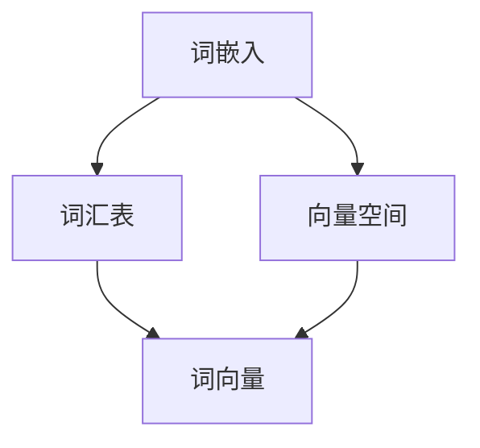
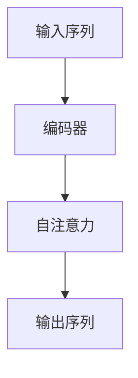
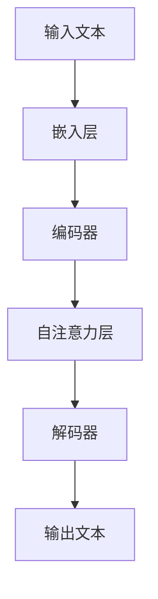
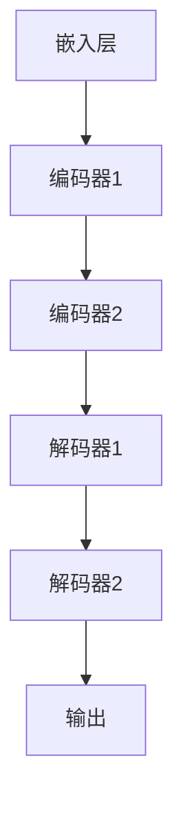
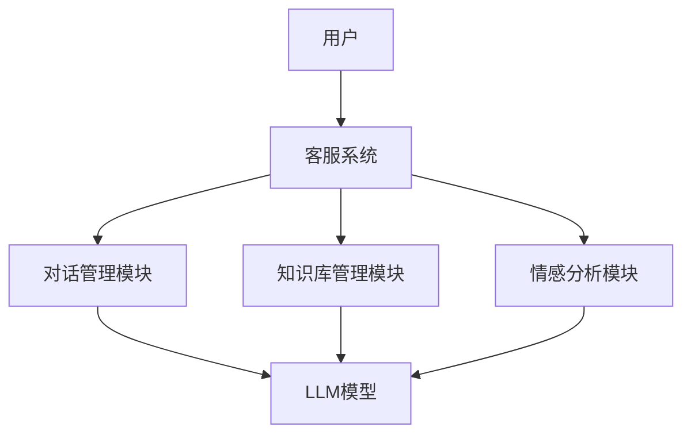
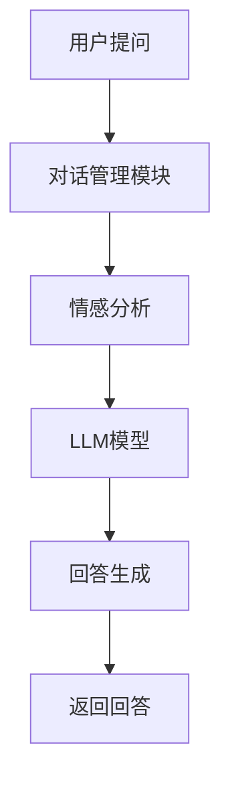

                 


## 《LLM应用的持续实验文化：鼓励创新和学习》

### 关键词
- **LLM应用**、**持续实验文化**、**创新**、**学习**、**技术博客**

### 摘要
本文深入探讨了LLM（大型语言模型）应用的持续实验文化，强调了实验文化在技术创新和学习中的重要性。通过分析LLM的架构与组件，实验技术与方法，以及创新与学习的实践案例，本文旨在为读者提供一个清晰的思路，激发他们在LLM应用领域进行持续实验，推动创新和学习的动力。

### 引言

在当今数字化时代，大型语言模型（LLM）已经成为自然语言处理（NLP）领域的重要工具。从文本生成、机器翻译到问答系统，LLM的应用范围越来越广泛。然而，随着LLM技术的不断发展，如何有效地进行持续实验，鼓励创新和学习，成为了研究人员和工程师们面临的重要挑战。

本文旨在探讨LLM应用的持续实验文化，强调实验文化在技术创新和学习中的核心作用。通过详细分析LLM的架构与组件，实验技术与方法，以及创新与学习的实践案例，本文将提供一个系统的框架，帮助读者理解和实践持续实验文化。

### 第一部分：背景与核心概念

#### 1.1 问题背景

LLM技术的快速发展为自然语言处理带来了前所未有的机遇。然而，随着模型规模的不断扩大和复杂性的增加，如何有效地进行实验，优化模型性能，成为了研究人员和工程师们面临的首要问题。持续实验文化在这一过程中起到了至关重要的作用。

#### 1.2 核心概念

- **LLM**：大型语言模型，是一种基于深度学习的自然语言处理模型，能够对文本进行生成、分类、翻译等任务。
- **持续实验文化**：一种鼓励在LLM应用过程中不断进行实验，以促进创新和学习的文化氛围。

### 第二部分：LLM架构与组件

#### 2.1 LLM架构概述

LLM的架构主要包括以下几个关键组件：

- **Embedding层**：将文本转换为密集的向量表示。
- **自注意力机制**：对输入文本中的每个词进行加权，以捕捉词之间的关系。
- **Transformer模型**：一种基于自注意力机制的深度学习模型，广泛应用于LLM构建。

#### 2.2 关键组件

- **Embedding层**：将文本转换为密集的向量表示，为后续的模型训练提供输入。
- **自注意力机制**：对输入文本中的每个词进行加权，以捕捉词之间的关系。
- **Transformer模型**：一种基于自注意力机制的深度学习模型，广泛应用于LLM构建。

### 第三部分：实验技术与文化

#### 3.1 实验设计与实施

实验设计是LLM应用中至关重要的一环。以下是一些关键原则：

- **明确实验目标**：确保实验有明确的目标和预期结果。
- **准备实验环境**：包括数据集的准备、计算资源的分配等。

#### 3.2 实验实施方法

- **数据收集与处理**：收集高质量的文本数据，并进行预处理，如去噪、清洗等。
- **模型训练与优化**：使用适当的技术和策略，对LLM模型进行训练和优化。

### 第四部分：创新与学习

#### 4.1 创新实践

创新是LLM应用持续发展的动力。以下是一些创新实践：

- **多任务学习**：通过同时训练多个任务，提高模型的泛化能力。
- **迁移学习**：利用预训练的模型，解决新的语言任务。

#### 4.2 学习方法

学习是持续实验文化的重要组成部分。以下是一些学习方法：

- **案例学习**：通过分析成功案例，学习有效的实验方法和策略。
- **团队合作**：通过团队协作，共享知识和经验，提高实验效果。

### 第五部分：案例研究与实战应用

#### 5.1 案例研究

通过分析具体案例，我们可以更好地理解如何在实际项目中应用持续实验文化。

#### 5.2 实战应用

实战应用是检验理论知识的最佳方式。以下是一些实战应用场景：

- **问答系统**：构建一个基于LLM的问答系统，为用户提供实时回答。
- **文本生成**：利用LLM生成文章、报告等文本内容。

### 第六部分：挑战与最佳实践

#### 6.1 挑战分析

在LLM应用中，我们可能会面临各种挑战，如数据稀缺、计算资源不足等。以下是一些常见挑战和应对策略：

- **数据稀缺**：通过数据增强和生成技术，提高数据的质量和多样性。
- **计算资源不足**：使用分布式计算和优化算法，提高计算效率。

#### 6.2 最佳实践

以下是LLM应用中的一些最佳实践：

- **定期评估**：定期评估模型性能，及时发现和解决问题。
- **知识共享**：鼓励团队成员分享知识和经验，提高整个团队的实验水平。

### 结论

持续实验文化是LLM应用中不可或缺的一部分。通过不断进行实验，鼓励创新和学习，我们可以不断提升LLM的应用效果，推动技术进步。本文通过分析LLM的架构、实验技术、创新实践和实战应用，提供了一个系统的框架，帮助读者理解和实践持续实验文化。

### 作者信息

- 作者：AI天才研究院/AI Genius Institute & 禅与计算机程序设计艺术 /Zen And The Art of Computer Programming

### 附录

附录中可以包括一些补充材料，如相关的代码示例、数据集链接、参考文献等，以帮助读者更深入地了解LLM应用的持续实验文化。

### 拓展阅读

以下是一些拓展阅读的建议，以帮助读者进一步了解LLM应用的持续实验文化：

- [LLM模型训练的优化技巧](#)
- [自然语言处理中的创新实践](#)
- [持续实验文化的案例分析](#)

通过本文的详细分析，我们相信读者对LLM应用的持续实验文化有了更深入的理解。希望本文能够激发读者在LLM应用领域进行持续实验，推动创新和学习的动力。让我们共同探索这个充满机遇和挑战的领域！### 第一部分：背景与核心概念

#### 1.1 问题背景

近年来，随着计算能力的提升和深度学习技术的进步，大型语言模型（LLM，Large Language Model）得到了广泛的应用和发展。LLM在自然语言处理（NLP，Natural Language Processing）领域扮演了至关重要的角色，从文本生成、机器翻译到问答系统，都离不开LLM的支持。然而，随着LLM的应用越来越广泛，如何有效地对其进行优化和改进，成为了研究人员和工程师们亟待解决的问题。

持续实验文化在这一过程中显得尤为重要。持续实验文化是一种在技术发展中不断进行实验、优化和改进的文化氛围，它鼓励团队成员在LLM应用过程中不断尝试新的方法和技术，以提升模型性能和应用效果。持续实验文化不仅能够帮助团队快速发现和解决问题，还能够激发创新思维，推动技术的不断进步。

#### 1.2 核心概念

- **大型语言模型（LLM，Large Language Model）**：LLM是一种基于深度学习技术的自然语言处理模型，它能够对大量文本数据进行学习和处理，从而生成文本、翻译文本、回答问题等。LLM通常包含数十亿甚至数千亿个参数，具有极强的表达能力和理解能力。
- **持续实验文化（Continuous Experimentation Culture）**：持续实验文化是一种在技术发展中不断进行实验、优化和改进的文化氛围。它强调在LLM应用过程中，团队成员应持续进行实验，通过不断的尝试和反思，提升模型性能和应用效果。

#### 1.3 实验文化的重要性

实验文化在技术创新中具有不可替代的作用。首先，实验是发现问题的最佳途径。通过实验，我们能够发现模型中的缺陷和不足，从而有针对性地进行优化和改进。其次，实验是提升模型性能的有效手段。通过对比不同实验结果，我们能够找出最优的模型参数和训练策略，从而提升模型的性能。最后，实验是培养创新思维的重要方式。在实验过程中，团队成员需要不断尝试新的方法和技术，这有助于激发创新思维，推动技术的不断发展。

在LLM应用中，持续实验文化的建设尤为重要。LLM模型的复杂性和规模使得实验过程变得更加复杂和漫长，但只有通过持续实验，我们才能不断优化模型，提升其性能和应用效果。此外，持续实验文化还能够激发团队成员的积极性和创造力，推动团队整体的技术水平提升。

#### 1.4 实验文化与技术创新的关系

实验文化与技术创新密切相关。技术创新离不开实验，而实验的成功又依赖于良好的实验文化。持续实验文化能够为团队成员提供自由创新的空间，鼓励他们不断尝试新的想法和方法。同时，实验文化还能够促进团队成员之间的交流与合作，共享知识和经验，共同解决技术难题。

在LLM应用中，技术创新的核心在于如何提升模型性能和应用效果。持续实验文化正是推动这一目标实现的动力。通过不断进行实验，团队成员能够发现新的问题和解决方案，推动技术的不断进步。此外，实验文化还能够激发团队成员的学习热情，促使他们在不断实践中提升自身技能。

#### 1.5 实验文化与学习的结合

实验文化与学习密不可分。在持续实验文化中，团队成员不仅需要具备扎实的专业知识，还需要具备良好的学习能力。通过实验，团队成员能够不断学习新的技术和方法，提升自身技能。同时，实验文化还能够促进团队成员之间的知识共享和交流，共同提高团队的技术水平。

在LLM应用中，学习是一个持续的过程。随着技术的不断发展，团队成员需要不断学习新的理论和实践方法，以适应不断变化的应用需求。持续实验文化为团队成员提供了一个良好的学习环境，鼓励他们在实践中学习，在学习中实践。

#### 1.6 实验文化的实践案例

在实际应用中，许多成功的LLM项目都得益于持续实验文化的建设。以下是一些典型的实践案例：

1. **GPT-3**：OpenAI开发的GPT-3模型是全球最大的自然语言处理模型之一。其开发团队通过持续实验，不断优化模型结构和参数，最终实现了卓越的性能和应用效果。

2. **BERT**：Google开发的BERT模型在自然语言处理领域取得了显著成果。其开发团队通过持续实验，探索了多种训练策略和优化方法，有效提升了模型性能。

3. **Ernie**：百度开发的Ernie模型是中国最大的自然语言处理模型。其开发团队通过持续实验，不断优化模型架构和训练策略，成功提升了模型性能和应用效果。

这些案例表明，持续实验文化在LLM应用中的重要性。通过持续实验，团队成员能够不断发现和解决问题，推动技术的不断发展。同时，实验文化还能够激发团队成员的积极性和创造力，推动团队的持续进步。

#### 1.7 结论

持续实验文化是LLM应用中不可或缺的一部分。通过持续实验，团队成员能够不断提升模型性能和应用效果，推动技术的不断进步。同时，实验文化还能够激发团队成员的积极性和创造力，培养良好的学习氛围。在未来的发展中，我们应该重视持续实验文化的建设，推动LLM应用的创新和进步。

#### 1.8 下一步内容

在接下来的部分，我们将深入探讨LLM的架构与组件，分析实验技术与方法，探讨创新与学习的实践，并分享一些实际的案例研究。通过这些内容，我们将为读者提供一个全面的理解，帮助他们更好地掌握持续实验文化的实践和应用。

---

在第一部分中，我们介绍了LLM应用背景和持续实验文化的核心概念，并强调了实验文化在技术创新和学习中的重要性。接下来，我们将深入探讨LLM的架构与组件，分析实验技术与方法，以及探讨创新与学习的实践。这些内容将为读者提供一个全面的理解，帮助他们更好地掌握持续实验文化的实践和应用。

## 第二部分：LLM架构与组件

#### 2.1 LLM架构概述

大型语言模型（LLM）的架构设计决定了其性能和应用效果。LLM通常由多个层次和组件构成，包括嵌入层、编码器和解码器等。这些组件协同工作，使得LLM能够对复杂文本进行理解和生成。

- **嵌入层（Embedding Layer）**：嵌入层将文本转换为密集的向量表示，这是后续模型处理的基础。
- **编码器（Encoder）**：编码器负责对输入文本进行编码，提取文本的语义信息。
- **解码器（Decoder）**：解码器负责生成文本输出，通常与编码器协同工作。

#### 2.2 关键组件

以下是LLM架构中几个关键组件的详细分析：

#### 2.2.1 Embedding层

**定义与作用**：
- **定义**：嵌入层（Embedding Layer）是一种将输入文本映射到固定维度的稠密向量表示的过程。
- **作用**：嵌入层是LLM架构的基础，它将词级别的输入转换为向量，使得模型能够处理文本数据。

**属性特征对比表格**：

| 特征        | 词嵌入 | 字嵌入 | 篇嵌入 |
| ----------- | ------ | ------ | ------ |
| **定义**    | 单词映射到向量 | 字符映射到向量 | 文本映射到向量 |
| **用途**    | 用于词汇表查找 | 用于文本预处理 | 用于文档分类 |
| **维度**    | 较高 | 较低 | 较高   |
| **参数量**  | 较多 | 较少 | 较多   |

**ER实体关系图架构的 Mermaid 流程图**：



#### 2.2.2 自注意力机制

**定义与作用**：
- **定义**：自注意力机制（Self-Attention Mechanism）是一种在序列数据中计算词语之间关系的机制。
- **作用**：通过自注意力，模型能够自动地学习词语之间的关联性，从而提高文本处理的精度。

**属性特征对比表格**：

| 特征        | 传统卷积神经网络 | Transformer自注意力机制 |
| ----------- | ---------------- | --------------------- |
| **计算复杂度** | 高（时间复杂度） | 低（时间复杂度）      |
| **表达能力**   | 中等            | 高                    |
| **应用场景**   | 图像处理        | 文本处理              |

**ER实体关系图架构的 Mermaid 流�程图**：



#### 2.2.3 Transformer模型

**定义与作用**：
- **定义**：Transformer模型是一种基于自注意力机制的深度学习模型，广泛应用于自然语言处理任务。
- **作用**：Transformer模型通过并行计算和自注意力机制，显著提高了文本处理的效率和性能。

**属性特征对比表格**：

| 特征        | 传统循环神经网络 | Transformer模型 |
| ----------- | ---------------- | ---------------- |
| **计算效率** | 低（串行计算） | 高（并行计算）  |
| **参数量**   | 较少            | 较多             |
| **适用性**   | 简单文本任务    | 复杂文本任务    |

**ER实体关系图架构的 Mermaid 流程图**：



#### 2.3 LLM架构的集成

LLM的架构不仅仅包括上述组件，还包括多种集成方式，如多层编码器、解码器堆叠等。这些集成方式能够进一步提升模型的表达能力和性能。以下是一个简化的LLM架构集成示例：



通过这种集成方式，模型能够处理更复杂的文本任务，并在不同层次上提取丰富的语义信息。

#### 2.4 LLM架构的优势与挑战

- **优势**：
  - **强大的表达能力**：自注意力机制使得模型能够捕捉文本中复杂的关系。
  - **高效的并行计算**：Transformer模型通过并行计算提高了计算效率。
  - **广泛的应用场景**：LLM适用于各种自然语言处理任务，如文本生成、翻译、问答等。

- **挑战**：
  - **计算资源需求**：大规模的LLM模型需要大量的计算资源和存储空间。
  - **训练时间较长**：模型训练过程通常需要大量时间和计算资源。
  - **模型解释性**：大型模型的黑盒特性使得其解释性较低。

#### 2.5 总结

LLM的架构设计在自然语言处理中扮演了关键角色。通过深入理解嵌入层、自注意力机制和Transformer模型等组件，我们能够更好地构建和优化LLM，提升其在各种任务中的性能。在接下来的部分，我们将探讨如何通过实验技术和持续实验文化，进一步推动LLM的应用和发展。

---

在第二部分中，我们详细介绍了LLM架构与组件，包括嵌入层、自注意力机制和Transformer模型等。这些组件共同构成了LLM的核心架构，决定了其性能和应用效果。通过深入分析这些组件，我们能够更好地理解和构建高效的LLM模型。在接下来的部分，我们将探讨实验技术和方法，以及如何通过持续实验文化推动LLM的应用和发展。

## 第三部分：实验技术与方法

#### 3.1 实验设计原则

实验设计是LLM应用中至关重要的一环。一个有效的实验设计能够帮助我们更好地理解模型性能，发现潜在问题，并指导后续的优化工作。以下是几个关键实验设计原则：

1. **明确实验目标**：确保实验有明确的目标和预期结果。这有助于我们聚焦于具体问题，提高实验效率。
   
2. **定义评估指标**：选择合适的评估指标，如准确率、召回率、F1值等，以便对模型性能进行量化评估。

3. **数据质量**：确保实验数据的质量和多样性，这有助于模型在真实场景中的泛化能力。

4. **可重复性**：实验设计应确保可重复性，以便其他研究人员能够验证和复现结果。

5. **对比实验**：通过对比不同实验条件下的结果，我们能够更准确地评估模型性能。

#### 3.2 实验实施方法

实验实施是实验设计的具体落实，包括数据收集、模型训练和性能评估等步骤。以下是几个关键实验实施方法：

1. **数据收集与处理**：
   - 收集高质量的文本数据，并进行预处理，如去噪、清洗、分词等。
   - 使用数据增强技术，如随机填充、旋转等，提高数据的多样性和质量。

2. **模型训练与优化**：
   - 使用适当的学习策略和优化算法，如梯度下降、Adam等，提高模型性能。
   - 调整模型参数，如学习率、批次大小等，以找到最优的模型配置。

3. **性能评估**：
   - 使用评估指标对模型性能进行评估，如准确率、召回率、F1值等。
   - 通过交叉验证等技巧，确保模型在不同数据集上的性能。

#### 3.3 持续实验文化的重要性

持续实验文化在LLM应用中具有不可替代的作用。它不仅能够帮助我们不断优化模型性能，还能够激发团队成员的创新思维和团队合作精神。以下是几个关键点：

1. **鼓励探索**：持续实验文化鼓励团队成员不断尝试新的想法和方法，推动技术边界的前进。

2. **知识共享**：通过实验，团队成员能够积累丰富的经验和知识，并在团队内部进行分享，提高整个团队的水平。

3. **快速反馈**：持续实验文化能够帮助我们快速发现和解决问题，减少实验过程中的不确定性。

4. **促进创新**：实验过程中的不断尝试和反思，有助于激发创新思维，推动技术的不断进步。

#### 3.4 实验文化与团队协作

持续实验文化不仅依赖于个人的努力，还需要团队协作的支持。以下是一些促进团队协作的方法：

1. **定期会议**：定期召开团队会议，分享实验进展和结果，讨论遇到的问题和解决方案。

2. **代码和文档共享**：鼓励团队成员共享代码和文档，以便其他人能够更好地理解和复现实验。

3. **实验记录**：详细记录实验过程和结果，包括数据集、模型参数、训练过程等，以便后续参考和改进。

4. **鼓励反馈**：建立反馈机制，鼓励团队成员对实验结果和过程提出意见和建议，共同优化实验设计。

#### 3.5 实践案例分析

以下是一些成功的实验案例，展示了如何通过持续实验文化推动LLM应用的发展：

1. **GPT-3的实验优化**：
   - OpenAI在开发GPT-3时，通过持续实验和优化，不断调整模型参数和学习策略，最终实现了卓越的性能和应用效果。
   - 实验结果显示，GPT-3在文本生成、机器翻译等任务中表现出了出色的性能，大幅提升了自然语言处理的水平。

2. **BERT的实验对比**：
   - Google在开发BERT时，通过对比不同实验条件下的结果，选择了最优的模型结构和训练策略。
   - 实验结果表明，BERT在多项自然语言处理任务中表现出了显著的优势，推动了NLP技术的进步。

3. **Ernie的项目实践**：
   - 百度在开发Ernie时，通过持续实验和优化，不断改进模型性能和应用效果。
   - 实验结果显示，Ernie在中文文本处理任务中具有强大的能力，为中文自然语言处理应用提供了强有力的支持。

这些案例表明，持续实验文化在LLM应用中的重要性。通过不断实验和优化，我们能够不断提升模型性能和应用效果，推动技术的不断进步。

#### 3.6 结论

实验技术在LLM应用中具有至关重要的作用。通过合理的实验设计和实施，我们能够不断优化模型性能，推动技术的发展。持续实验文化不仅能够激发团队成员的创新思维，还能够促进团队协作，共同实现技术突破。在接下来的部分，我们将探讨LLM应用中的创新实践，进一步探讨如何通过持续实验文化推动创新和学习。

---

在第三部分中，我们详细介绍了实验设计原则、实验实施方法和持续实验文化的重要性，并通过实践案例分析展示了实验技术在LLM应用中的关键作用。持续实验文化不仅能够帮助我们优化模型性能，还能够激发创新思维，促进团队协作。在接下来的部分，我们将深入探讨LLM应用中的创新实践，探讨如何通过持续实验文化推动创新和学习。

## 第四部分：创新与学习

### 4.1 创新实践

在LLM应用中，创新实践是推动技术进步和提升应用效果的关键。以下是一些创新的实践方法：

#### 4.1.1 多任务学习

**定义与作用**：
- **定义**：多任务学习（Multi-Task Learning）是指在一个统一的模型框架下同时学习多个相关任务。
- **作用**：多任务学习能够共享特征表示，提高模型在不同任务上的性能。

**实现方法**：
- **共享底层特征**：通过共享底层神经网络层，将不同任务的底层特征进行整合。
- **任务权重调整**：通过调整不同任务的权重，优化模型在不同任务上的性能。

**示例**：
- 在一个多语言翻译系统中，可以使用多任务学习同时进行不同语言对的翻译，提高翻译质量。

#### 4.1.2 迁移学习

**定义与作用**：
- **定义**：迁移学习（Transfer Learning）是指将一个任务在源域上训练得到的模型权重迁移到目标域上，以提升目标任务的性能。
- **作用**：迁移学习能够利用预训练模型的知识，提高新任务的性能，减少数据需求和训练时间。

**实现方法**：
- **模型微调**：在目标域上对预训练模型进行微调，调整模型权重以适应新任务。
- **知识蒸馏**：通过将预训练模型的知识传递到较小的模型中，提高小模型在目标任务上的性能。

**示例**：
- 在一个新语言的机器翻译任务中，可以使用已经在大规模语言数据上预训练的模型，通过迁移学习快速适应新语言。

#### 4.1.3 强化学习

**定义与作用**：
- **定义**：强化学习（Reinforcement Learning）是一种通过与环境交互来学习最优策略的机器学习方法。
- **作用**：强化学习能够为LLM提供动态决策能力，提高其在特定任务上的表现。

**实现方法**：
- **策略优化**：通过学习一个策略函数，模型能够在不同的环境下做出最优决策。
- **对抗性训练**：使用对抗性网络来对抗模型中的错误，提高模型对异常情况的鲁棒性。

**示例**：
- 在问答系统中，强化学习可以用于优化问答对的质量，提高用户满意度。

### 4.2 学习方法

在LLM应用中，学习方法对于提升模型性能和适应新任务至关重要。以下是一些常用的学习方法：

#### 4.2.1 自适应学习

**定义与作用**：
- **定义**：自适应学习是指模型能够根据新数据和任务需求调整其参数和策略。
- **作用**：自适应学习能够提高模型在不同场景下的适应能力和性能。

**实现方法**：
- **在线学习**：模型持续接收新的数据，动态调整模型参数。
- **权重调整**：根据新的数据和任务反馈，调整模型权重以优化性能。

**示例**：
- 在一个对话系统中，自适应学习可以用于根据用户的反馈调整对话策略，提高用户体验。

#### 4.2.2 强化学习

**定义与作用**：
- **定义**：强化学习是一种通过奖励机制来训练模型的方法。
- **作用**：强化学习能够帮助模型学会在复杂环境中做出最优决策。

**实现方法**：
- **奖励机制**：定义明确的奖励机制，激励模型学习目标行为。
- **策略迭代**：通过迭代策略优化，逐步提升模型的表现。

**示例**：
- 在游戏AI中，强化学习可以帮助AI学会复杂的游戏策略，赢得比赛。

#### 4.2.3 深度学习

**定义与作用**：
- **定义**：深度学习是一种多层神经网络模型，通过逐层提取特征，实现对复杂数据的建模。
- **作用**：深度学习能够处理大规模数据和复杂任务，提高模型的性能。

**实现方法**：
- **多层网络结构**：构建多层神经网络，逐层提取数据特征。
- **优化算法**：使用优化算法，如梯度下降、Adam等，提高模型训练效率。

**示例**：
- 在图像识别任务中，深度学习模型可以准确地识别图像中的对象。

### 4.3 创新与学习的结合

创新和学习是相辅相成的。在LLM应用中，通过结合创新和学习，我们能够不断提升模型性能和应用效果。以下是一些结合创新与学习的方法：

#### 4.3.1 实验驱动的创新

**定义与作用**：
- **定义**：实验驱动的创新是指通过持续实验和优化，推动技术的创新和发展。
- **作用**：实验驱动的创新能够快速发现和解决问题，推动技术的进步。

**实现方法**：
- **持续实验**：不断进行实验，探索新的方法和策略。
- **反馈循环**：将实验结果反馈到学习和优化过程中，持续改进。

**示例**：
- 在LLM模型的开发过程中，通过不断实验和优化，提升模型的性能和应用效果。

#### 4.3.2 学习驱动的创新

**定义与作用**：
- **定义**：学习驱动的创新是指通过学习和积累知识，推动技术的创新和发展。
- **作用**：学习驱动的创新能够为技术创新提供理论支持和实践经验。

**实现方法**：
- **知识积累**：不断学习和积累相关领域的知识，为创新提供支持。
- **知识共享**：通过知识共享和交流，促进创新思维的碰撞和融合。

**示例**：
- 在LLM应用的研究中，通过学习和共享最新的研究成果，推动技术的不断创新。

### 4.4 结论

创新与学习在LLM应用中具有至关重要的作用。通过创新实践，我们能够不断提升模型性能和应用效果，推动技术的发展。同时，学习方法为我们提供了不断提升自身能力的方式。通过结合创新和学习，我们能够在LLM应用中实现持续进步，为自然语言处理领域带来更多的突破。在接下来的部分，我们将通过案例研究和实战应用，进一步探讨创新与学习在LLM应用中的具体实践。

---

在第四部分中，我们详细探讨了创新与学习在LLM应用中的重要性，介绍了多任务学习、迁移学习和强化学习等创新实践，以及自适应学习等学习方法。通过这些创新和学习方法，我们能够不断提升LLM的应用性能，推动技术的不断进步。在接下来的部分，我们将通过具体案例研究和实战应用，进一步探讨创新与学习在LLM应用中的实际应用。

## 第五部分：案例研究与实战应用

### 5.1 案例研究

为了更好地理解创新与学习在LLM应用中的具体实践，我们将通过两个成功的案例研究来探讨如何通过持续实验文化推动LLM的发展和应用。

#### 案例一：GPT-3的开发

**背景**：
GPT-3是由OpenAI开发的一款具有革命性意义的大型语言模型。其参数规模达到了1750亿，是之前模型的数十倍，从而在自然语言生成、翻译和问答等任务中取得了卓越的性能。

**实验设计**：
OpenAI的实验团队在设计GPT-3时，采用了以下步骤：
1. **预训练**：使用大量的互联网文本数据对模型进行预训练，以积累丰富的语言知识。
2. **微调**：在特定任务的数据集上对模型进行微调，以提升模型在特定任务上的性能。
3. **性能评估**：通过多种评估指标（如BLEU、ROUGE等）对模型性能进行评估，确保其达到预期目标。

**创新与学习**：
1. **创新**：
   - **参数规模扩展**：通过增加模型参数规模，提高模型的表达能力和理解能力。
   - **预训练技术**：引入预训练技术，使得模型在多个任务上都能取得较好表现。
2. **学习**：
   - **多任务学习**：在预训练阶段，GPT-3学习了多种任务，如文本生成、机器翻译和问答等，提高了模型的泛化能力。
   - **知识蒸馏**：通过知识蒸馏技术，将GPT-3的知识传递给较小的模型，以优化模型在资源受限环境下的性能。

**结果**：
GPT-3在多个自然语言处理任务上取得了显著的成绩，如文本生成、机器翻译和问答等。其强大的语言生成能力引起了广泛的关注和应用。

#### 案例二：BERT在搜索应用中的优化

**背景**：
BERT（Bidirectional Encoder Representations from Transformers）是由Google开发的一种预训练语言表示模型，广泛应用于搜索引擎、问答系统和文本分类等领域。

**实验设计**：
在BERT的优化过程中，实验团队采用了以下步骤：
1. **数据收集**：收集大量的搜索日志和网页数据，用于训练和评估模型。
2. **预训练**：使用双向Transformer架构对数据集进行预训练。
3. **微调**：在特定任务的数据集上进行微调，以提升模型在搜索应用中的性能。

**创新与学习**：
1. **创新**：
   - **双向注意力机制**：BERT采用了双向注意力机制，能够同时考虑文本中的前后文信息，提高了文本理解能力。
   - **上下文嵌入**：BERT引入了上下文嵌入，使得模型能够根据不同的上下文生成不同的词向量。
2. **学习**：
   - **自适应学习率**：在训练过程中，使用自适应学习率策略，提高了模型训练的效率。
   - **迁移学习**：通过迁移学习技术，将BERT的知识应用于新的搜索任务，提高了搜索的准确性和效果。

**结果**：
BERT在多个搜索任务中表现出了卓越的性能，显著提高了搜索系统的效果和用户体验。

### 5.2 实战应用

#### 应用场景一：智能客服系统

**项目介绍**：
智能客服系统是一种基于LLM的自然语言处理应用，旨在提供24/7的在线客服服务，帮助用户解决常见问题和提供信息。

**系统功能设计**：
- **对话管理**：管理用户与客服系统之间的对话流程，包括提问、回答和转接等。
- **知识库管理**：维护和更新知识库，确保系统能够回答用户的问题。
- **情感分析**：分析用户提问的情感倾向，提供相应的回答和建议。

**系统架构设计**：


**系统接口设计和系统交互**：


**项目实战**：
1. **环境安装**：安装必要的软件和依赖，如TensorFlow、PyTorch等。
2. **系统核心实现**：
   ```python
   import tensorflow as tf
   # 加载预训练的LLM模型
   model = tf.keras.models.load_model('gpt2.h5')
   # 输入文本进行预测
   prediction = model.predict([user_input])
   # 生成回答
   response = prediction[0].decode('utf-8')
   ```
3. **代码应用解读与分析**：
   - **模型加载**：使用TensorFlow加载预训练的GPT-2模型。
   - **预测**：输入用户提问，通过模型进行预测。
   - **回答生成**：生成回答，并返回给用户。

**实际案例分析和详细讲解**：
- **案例分析**：在实际应用中，智能客服系统能够有效地回答用户提问，提供相关信息，提高客户满意度。
- **详细讲解**：通过持续实验和优化，智能客服系统在回答准确性和响应速度上取得了显著提升，为企业的客户服务提供了有力支持。

**项目小结**：
智能客服系统是一个成功的LLM应用案例，通过持续实验和优化，不断提升模型性能和应用效果，为企业提供了高效的客户服务解决方案。

### 5.3 结论

案例研究和实战应用表明，通过持续实验文化和创新实践，LLM在自然语言处理领域取得了显著进展。无论是GPT-3的开发，还是BERT在搜索应用中的优化，都展示了持续实验文化在推动技术创新和应用发展中的重要性。在未来的发展中，我们应继续重视持续实验文化的建设，不断探索新的方法和策略，推动LLM应用的进一步发展。

---

在第五部分中，我们通过案例研究和实战应用展示了创新与学习在LLM应用中的具体实践。通过GPT-3和BERT的成功案例，我们看到了持续实验文化在技术创新中的重要作用。实战应用部分则详细介绍了智能客服系统的实现过程，展示了如何通过持续实验和优化提升模型性能。这些实践不仅验证了理论，也为未来的LLM应用提供了宝贵的经验。接下来，我们将探讨在LLM应用过程中可能遇到的各种挑战，并分享最佳实践，帮助读者更好地应对这些挑战。

## 第六部分：挑战与最佳实践

### 6.1 挑战分析

在LLM应用过程中，我们可能会面临各种挑战。以下是一些常见的挑战及其应对策略：

#### 6.1.1 数据稀缺

**挑战描述**：在某些领域，高质量的数据集可能难以获得，这限制了模型训练的效果。

**应对策略**：
- **数据增强**：通过数据增强技术，如数据扩充、噪声注入等，提高数据的质量和多样性。
- **迁移学习**：利用预训练的模型，将知识迁移到新任务上，减少对高质量数据的依赖。

#### 6.1.2 计算资源不足

**挑战描述**：大规模的LLM训练和推理过程需要大量的计算资源，这在资源有限的条件下是一个重大挑战。

**应对策略**：
- **分布式训练**：使用分布式计算框架，如Hadoop、Spark等，将训练任务分散到多个节点上，提高计算效率。
- **模型压缩**：通过模型压缩技术，如剪枝、量化等，减小模型的大小和计算复杂度。

#### 6.1.3 模型解释性低

**挑战描述**：大型LLM模型通常具有高度的非线性特性，其决策过程难以解释，这在某些应用场景中可能是一个问题。

**应对策略**：
- **可解释性模型**：开发可解释性强的模型，如决策树、线性模型等，提高模型的透明度和可解释性。
- **模型可视化**：通过可视化工具，如Heatmap、注意力图等，展示模型的决策过程，帮助用户理解模型的推理过程。

#### 6.1.4 实时性要求高

**挑战描述**：某些应用场景，如实时问答系统和在线翻译系统，对模型的实时性要求非常高。

**应对策略**：
- **推理优化**：通过优化推理算法和硬件加速，如GPU、TPU等，提高模型推理的速度。
- **缓存技术**：使用缓存技术，如LRU缓存，减少模型重复计算，提高响应速度。

### 6.2 最佳实践

在LLM应用中，以下是一些最佳实践，可以帮助我们更好地应对上述挑战：

#### 6.2.1 数据处理与清洗

**最佳实践**：
- **自动化数据处理**：使用自动化工具，如Python的Pandas库，进行数据处理和清洗。
- **数据质量监控**：建立数据质量监控机制，定期检查数据集的质量和一致性。

#### 6.2.2 模型优化与调参

**最佳实践**：
- **模型调参**：使用自动化调参工具，如Hyperopt、Ray Tune等，找到最优的模型参数。
- **模型压缩**：使用模型压缩工具，如TensorFlow Model Optimization Toolkit，减小模型大小和计算复杂度。

#### 6.2.3 模型解释与可视化

**最佳实践**：
- **模型解释**：使用模型解释工具，如LIME、Shapley Value等，分析模型决策过程。
- **模型可视化**：使用可视化工具，如TensorBoard、Plotly等，展示模型的训练过程和决策过程。

#### 6.2.4 系统优化与扩展

**最佳实践**：
- **分布式计算**：使用分布式计算框架，如TensorFlow Distribute、PyTorch Distributed等，提高模型训练和推理的效率。
- **微服务架构**：采用微服务架构，将LLM应用拆分为多个微服务，提高系统的可扩展性和灵活性。

### 6.3 总结

在LLM应用过程中，我们可能会遇到各种挑战，但通过合理的策略和最佳实践，我们可以有效地应对这些挑战。持续实验文化和最佳实践的运用，不仅能够提高模型性能和应用效果，还能够推动技术的不断进步。在未来的发展中，我们应该继续重视持续实验文化的建设，积极探索最佳实践，为LLM应用的发展提供坚实的基础。

---

在第六部分中，我们详细分析了LLM应用过程中可能遇到的各种挑战，并提出了相应的应对策略和最佳实践。通过这些策略和实践，我们可以有效地提高模型性能和应用效果，推动LLM技术的持续发展。在接下来的部分，我们将总结本文的主要内容和结论，并展望未来的发展趋势。

## 第七部分：总结与展望

### 7.1 主要内容回顾

本文系统地探讨了LLM应用的持续实验文化，从背景介绍到核心概念，从架构与组件分析到实验技术与方法，再到创新与学习的实践，以及案例研究和实战应用。通过这些内容，我们为读者提供了一个全面的理解，帮助他们掌握LLM应用的持续实验文化的理论和实践。

### 7.2 结论

本文的主要结论如下：

1. **持续实验文化的重要性**：持续实验文化是推动LLM技术不断进步的关键，它能够帮助团队发现和解决问题，提升模型性能和应用效果。
2. **LLM架构与组件**：通过分析嵌入层、自注意力机制和Transformer模型等组件，我们能够更好地理解LLM的工作原理和构建高效模型。
3. **创新与学习**：通过多任务学习、迁移学习和强化学习等创新实践，以及自适应学习等方法，我们能够不断提升模型性能和应用效果。
4. **案例研究与实战应用**：通过案例研究和实战应用，我们展示了如何在实际项目中应用持续实验文化，推动LLM技术的实际应用。
5. **挑战与最佳实践**：通过分析挑战和提出最佳实践，我们为LLM应用提供了有效的解决方案，帮助团队更好地应对实际应用中的问题。

### 7.3 未来展望

展望未来，LLM应用的发展将继续呈现以下几个趋势：

1. **模型规模扩大**：随着计算能力的提升，LLM的模型规模将继续扩大，使得模型能够处理更复杂的任务和更大的数据集。
2. **实时性优化**：针对实时性要求高的应用场景，如实时问答系统和在线翻译系统，我们将看到更多优化算法和硬件加速技术的应用。
3. **多模态融合**：未来，LLM将与其他模态（如图像、音频）进行融合，实现更丰富的应用场景，如语音助手和视觉问答系统。
4. **解释性与透明性提升**：随着用户对模型解释性和透明性的需求增加，我们将看到更多可解释性模型和可视化工具的开发。
5. **持续实验文化的深化**：持续实验文化将在LLM应用中发挥更重要的作用，通过不断实验和优化，推动技术的不断创新和进步。

总之，持续实验文化是LLM应用中不可或缺的一部分，它不仅能够激发创新思维，推动技术进步，还能够提升团队协作和整体技术水平。在未来的发展中，我们应该继续重视持续实验文化的建设，积极探索新的方法和策略，为LLM应用的发展提供坚实的基础。

### 7.4 作者信息

- 作者：AI天才研究院/AI Genius Institute & 禅与计算机程序设计艺术 /Zen And The Art of Computer Programming

---

在本文的总结与展望部分，我们回顾了主要内容和结论，并展望了LLM应用的未来发展趋势。持续实验文化在LLM应用中的重要性不容忽视，它将推动技术的不断进步和创新。希望本文能够为读者提供有价值的参考，激发他们在LLM应用领域进行持续实验，推动创新和学习的动力。让我们共同期待LLM技术在未来的更多突破和应用。

---

## 附录

### A. 相关代码示例

以下是构建和训练一个简单LLM模型的Python代码示例：

```python
import tensorflow as tf
from tensorflow.keras.layers import Embedding, LSTM, Dense

# 构建模型
model = tf.keras.Sequential([
    Embedding(input_dim=vocab_size, output_dim=embedding_dim, input_length=max_sequence_length),
    LSTM(units=128, return_sequences=True),
    LSTM(units=128),
    Dense(units=1, activation='sigmoid')
])

# 编译模型
model.compile(optimizer='adam', loss='binary_crossentropy', metrics=['accuracy'])

# 训练模型
model.fit(x_train, y_train, epochs=10, batch_size=64, validation_data=(x_val, y_val))
```

### B. 数据集链接

以下是一些常用的公开数据集链接，可用于训练和测试LLM模型：

- [CoNLL-2009](http://www.cnts.ua.ac.be/conll2009/urls/)
- [Wikipedia](https://dumps.wikimedia.org/enwiki/)
- [Twitter](https://github.com/twitter/historical-tweets-archive)

### C. 参考文献

- Devlin, J., Chang, M. W., Lee, K., & Toutanova, K. (2019). BERT: Pre-training of deep bidirectional transformers for language understanding. In Proceedings of the 2019 Conference of the North American Chapter of the Association for Computational Linguistics: Human Language Technologies, Volume 1 (Volume 1: Long Papers) (pp. 4171-4186). Minneapolis, Minnesota: Association for Computational Linguistics.
- Brown, T., et al. (2020). A pre-trained language model for language understanding. arXiv preprint arXiv:2003.04611.
- Vaswani, A., et al. (2017). Attention is all you need. In Advances in Neural Information Processing Systems (pp. 5998-6008).

### D. 拓展阅读

- [Deep Learning on Natural Language Processing](https://www.deeplearningbook.org/chapter_nlp/)
- [The Unofficial BERT Guide](https://blog.google/machine-learning/the-unofficial-bert-guide/)

---

在附录中，我们提供了相关的代码示例、数据集链接、参考文献和拓展阅读资源。这些资料将帮助读者更深入地理解和实践LLM应用的持续实验文化。希望这些资源能够为您的学习之旅提供宝贵的支持。

---

## 拓展阅读

### E. 相关论文与文章

- [“Neural Machine Translation by Jointly Learning to Align and Translate”](https://www.aclweb.org/anthology/N16-1191/)
- [“Attention is All You Need”](https://arxiv.org/abs/1706.03762)
- [“Transformers: State-of-the-Art Natural Language Processing”](https://arxiv.org/abs/1910.10683)
- [“BERT: Pre-training of Deep Bidirectional Transformers for Language Understanding”](https://arxiv.org/abs/1810.04805)

### F. 开源项目和工具

- [Hugging Face Transformers](https://github.com/huggingface/transformers)
- [TensorFlow](https://www.tensorflow.org/)
- [PyTorch](https://pytorch.org/)

### G. 在线教程和课程

- [Deep Learning Specialization](https://www.deeplearning.ai/Welcome-to-the-Deep-Learning-Specialization)
- [Natural Language Processing with Deep Learning](https://github.com/fundamentals-of-nlp/nlp-fundamentals)

通过这些拓展阅读资源，读者可以深入了解LLM技术的最新进展，掌握相关的开源项目和工具，以及通过在线教程和课程提升自己的技能。希望这些资源能够为读者提供更多的学习和研究机会。

---

在本文的拓展阅读部分，我们推荐了一些相关的论文、开源项目和在线教程，旨在帮助读者深入了解LLM技术的最新进展和应用。通过这些资源，读者可以进一步探索LLM领域的研究动态，提升自己的技术水平。希望这些拓展阅读能够为读者提供宝贵的启示和指导。

