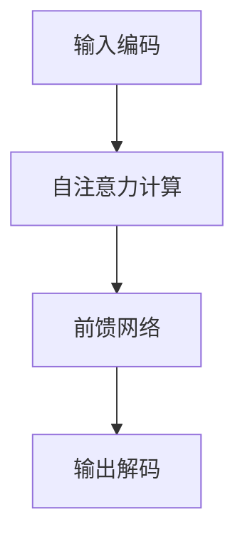
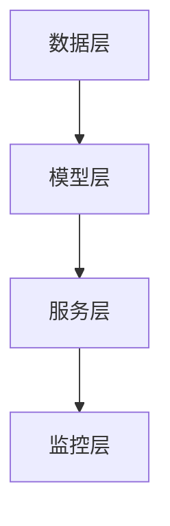
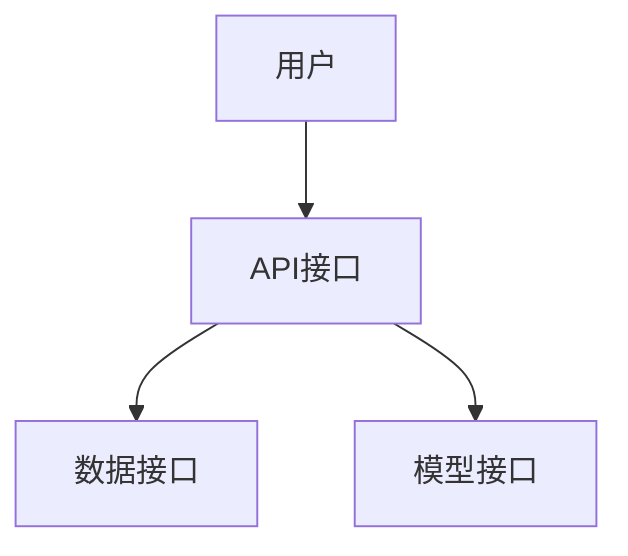
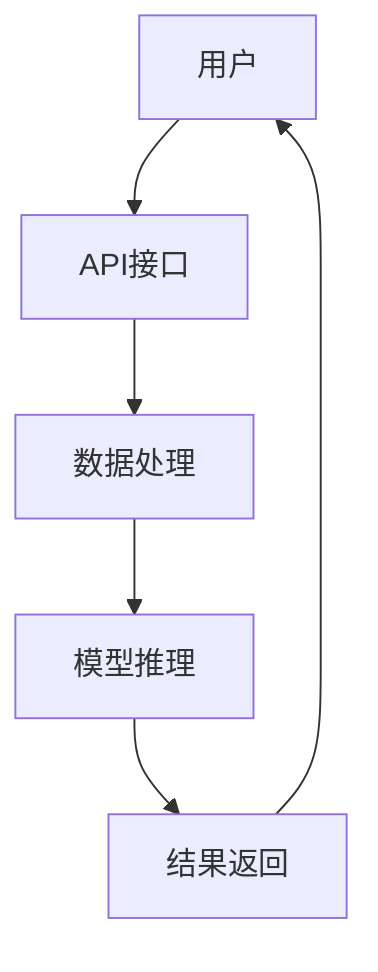

                 


### 第1章: 问题描述与背景介绍

#### 1.1 问题背景

在当今快速发展的信息技术时代，大型语言模型（LLM）已经成为许多行业的重要工具。LLM通过学习大量文本数据，可以生成高质量的文本、回答问题、进行翻译等。然而，LLM的应用不仅仅是开发一个模型那么简单，它还需要持续的部署和维护。在部署过程中，可能会出现各种问题，如性能问题、错误输出等。这就需要一种有效的回滚机制，以便在出现问题后快速恢复到之前的状态。

#### 1.2 问题描述

持续部署与回滚机制的问题可以概括为以下几点：

1. **部署失败**：在部署过程中，可能会由于代码问题、配置问题等原因导致部署失败。
2. **性能问题**：部署后的LLM可能会出现性能问题，如响应时间过长、计算资源不足等。
3. **错误输出**：部署后的LLM可能会生成错误的输出，这可能是由于训练数据的问题，也可能是由于模型本身的问题。
4. **回滚失败**：在回滚过程中，可能会由于各种原因导致回滚失败，这可能会进一步加剧问题。

#### 1.3 问题解决

为了解决上述问题，我们需要一种有效的持续部署与回滚机制。这个机制应该包括以下几个方面：

1. **自动化部署**：通过自动化工具，如Docker、Kubernetes等，实现快速、可靠的部署。
2. **监控与报警**：部署后，需要实时监控LLM的性能和输出，一旦发现问题，立即报警。
3. **回滚策略**：在发现问题后，需要能够快速回滚到上一个稳定版本，以避免问题扩散。
4. **版本管理**：对每个部署版本进行详细的记录，以便在需要时快速回滚到指定版本。

#### 1.4 边界与外延

在设计和实现持续部署与回滚机制时，需要考虑以下边界与外延：

1. **部署环境**：需要考虑部署环境的多样性，如本地环境、测试环境、生产环境等。
2. **部署频率**：需要根据应用场景，确定合适的部署频率，以平衡部署速度和稳定性。
3. **回滚限制**：回滚机制需要有一定的限制，如不能回滚到过期的版本，不能回滚到已删除的版本等。
4. **安全性**：在部署和回滚过程中，需要确保数据的安全性和系统的完整性。

通过上述分析，我们可以看到，持续部署与回滚机制对于LLM的应用至关重要。接下来，我们将进一步探讨LLM的基本概念和属性特征，以便更好地理解和设计这一机制。

----------------------------------------------------------------
### 第2章: 核心概念与联系

#### 2.1 LLM基本概念

大型语言模型（LLM）是一种基于深度学习技术的自然语言处理模型。它通过对海量文本数据进行训练，可以生成高质量的文本、回答问题、进行翻译等。LLM的核心是神经网络，它由多个层次组成，每个层次都包含大量的神经元。通过这些神经元之间的相互连接和激活，LLM可以学习和理解文本数据中的语义信息。

#### 2.2 LLM属性特征对比表格

| 属性特征      | 普通模型           | LLM                        |
| ------------- | ------------------ | -------------------------- |
| 数据集大小    | 数千至数万样本     | 数百万至数十亿样本         |
| 训练时间      | 数小时至数天       | 数月至数年                 |
| 参数规模      | 数百至数千        | 数百万至数十亿             |
| 语义理解能力  | 较弱               | 非常强，能进行复杂问答     |
| 生成文本质量  | 较低               | 非常高，能生成流畅的文本   |
| 应用场景      | 简单文本处理任务   | 复杂自然语言处理任务       |

#### 2.3 LLM ER实体关系图

在LLM的应用中，实体关系图（ER图）是非常重要的。ER图可以帮助我们理解和设计LLM的内部结构，它包括以下实体和关系：

实体：

1. **文本数据**：存储训练和测试数据。
2. **模型参数**：存储训练后的模型参数。
3. **部署环境**：存储部署的硬件和软件环境信息。
4. **监控数据**：存储监控过程中的性能数据。
5. **报警记录**：存储报警信息和处理结果。

关系：

1. **训练**：文本数据与模型参数之间存在训练关系。
2. **部署**：模型参数与部署环境之间存在部署关系。
3. **监控**：部署环境与监控数据之间存在监控关系。
4. **报警**：监控数据与报警记录之间存在报警关系。

ER实体关系图如下所示：

```mermaid
erDiagram
    文本数据 ||--|{ 模型参数 }|
    模型参数 ||--|{ 部署环境 }|
    部署环境 ||--|{ 监控数据 }|
    监控数据 ||--|{ 报警记录 }|
```

通过上述分析，我们可以看到，LLM的基本概念和属性特征决定了其强大的语义理解和生成能力。而ER实体关系图则为我们设计持续部署与回滚机制提供了一个清晰的框架。在接下来的章节中，我们将进一步探讨持续部署和回滚机制的原理与实现。

-------------------------------------------------------------------

### 第3章: 持续部署原理与实现

#### 3.1 持续部署背景

持续部署（Continuous Deployment，简称CD）是一种软件发布流程，它旨在通过自动化和持续集成（Continuous Integration，简称CI）来加快软件的发布速度，确保代码质量，并减少人工干预。在LLM的应用场景中，持续部署尤为重要，因为LLM通常涉及大量的数据处理和模型训练，任何部署失败都会导致严重的性能下降或错误输出。

#### 3.2 持续部署过程

持续部署的过程可以分为以下几个关键步骤：

1. **代码提交**：开发人员将新的代码提交到版本控制系统。
2. **自动化构建**：构建工具（如Jenkins、Travis CI等）自动构建代码，生成可执行文件。
3. **单元测试**：自动化测试工具运行单元测试，确保代码质量。
4. **集成测试**：在集成环境中运行集成测试，确保所有组件能够协同工作。
5. **部署**：部署工具（如Docker、Kubernetes等）将构建好的代码部署到生产环境。

#### 3.3 持续部署工具与框架

持续部署的工具和框架有很多，以下是几个常用的：

1. **Jenkins**：开源的持续集成和持续部署工具，支持多种插件和脚本。
2. **Travis CI**：基于云的持续集成服务，支持多种编程语言和平台。
3. **Docker**：容器化技术，可以将应用及其依赖环境打包到一个可移植的容器中。
4. **Kubernetes**：开源的容器编排平台，可以自动化部署、扩展和管理容器化应用。

#### 3.4 持续部署最佳实践

为了确保持续部署的成功，以下是一些最佳实践：

1. **自动化测试**：确保在每次代码提交后都运行全面的自动化测试。
2. **逐步部署**：在部署过程中，可以先部署到非生产环境，确保稳定后再部署到生产环境。
3. **版本控制**：对每个部署版本进行详细的记录，以便在需要时回滚。
4. **监控与报警**：部署后，需要实时监控系统的性能和输出，一旦发现问题，立即报警。
5. **文档与培训**：确保团队成员了解持续部署流程和工具的使用方法。

通过上述分析，我们可以看到，持续部署是实现LLM高效应用的重要机制。在接下来的章节中，我们将进一步探讨回滚机制的原理与实现。

-------------------------------------------------------------------

### 第4章: 回滚机制原理与实现

#### 4.1 回滚机制背景

回滚机制是一种在软件发布过程中用于撤销之前部署的更改的机制。当新部署的代码或配置出现问题时，回滚机制可以帮助系统快速恢复到上一个稳定版本。在LLM的应用场景中，回滚机制尤为重要，因为LLM通常涉及大量的数据处理和模型训练，任何部署失败都会导致严重的性能下降或错误输出。

#### 4.2 回滚机制流程

回滚机制的流程通常包括以下几个步骤：

1. **检测问题**：监控系统检测到系统性能下降或错误输出，触发回滚机制。
2. **版本记录**：系统记录当前部署的版本信息，以便后续回滚。
3. **部署回滚**：部署工具（如Kubernetes）将系统回滚到上一个稳定版本。
4. **验证恢复**：监控系统再次验证系统状态，确保回滚成功。

#### 4.3 回滚机制工具与框架

回滚机制的实现需要依赖一些工具和框架，以下是几个常用的：

1. **Kubernetes**：开源的容器编排平台，支持滚动更新和回滚功能。
2. **Ansible**：自动化部署和配置管理工具，可以用于配置回滚策略。
3. **Git**：版本控制系统，可以用于记录和管理版本信息。
4. **Prometheus**：监控解决方案，可以用于检测系统性能问题。

#### 4.4 回滚机制最佳实践

为了确保回滚机制的有效性，以下是一些最佳实践：

1. **版本隔离**：确保每个部署版本都有独立的配置和环境，以减少回滚时的冲突。
2. **自动回滚**：设置自动回滚策略，一旦检测到问题，系统自动回滚到上一个稳定版本。
3. **人工确认**：在回滚前，要求人工确认，以避免误操作。
4. **监控与报警**：回滚后，需要实时监控系统的性能和输出，确保问题得到解决。
5. **文档记录**：详细记录回滚过程和结果，以便后续分析和改进。

通过上述分析，我们可以看到，回滚机制是实现LLM稳定运行的重要保障。在接下来的章节中，我们将进一步探讨LLM算法原理和实现原理。

-------------------------------------------------------------------

### 第5章: LLM算法原理

#### 5.1 算法原理概述

大型语言模型（LLM）的算法原理主要基于深度学习，特别是变换器（Transformer）架构。变换器模型通过自注意力机制，可以捕捉长距离的文本依赖关系，从而实现高精度的语义理解和文本生成。LLM的算法流程可以概括为以下几个步骤：

1. **输入编码**：将输入文本转换为序列编码。
2. **自注意力计算**：通过自注意力机制，计算文本中每个词与其他词之间的关系。
3. **前馈网络**：对自注意力层输出的结果进行前馈网络处理。
4. **输出解码**：将前馈网络输出的结果解码为文本输出。

#### 5.2 算法流程图



#### 5.3 算法数学模型与公式

LLM的算法数学模型主要包括以下三个部分：

1. **自注意力机制**：

   $$ 
   Attention(Q, K, V) = \frac{softmax(\frac{QK^T}{\sqrt{d_k}})}{V} 
   $$

   其中，$Q$、$K$、$V$ 分别代表查询、键和值，$d_k$ 是键的维度。

2. **前馈网络**：

   $$ 
   FFN(x) = \max(0, xW_1 + b_1)W_2 + b_2 
   $$

   其中，$W_1$、$W_2$ 是权重矩阵，$b_1$、$b_2$ 是偏置。

3. **变换器模型输出**：

   $$ 
   Output = V \cdot softmax(QK^T / \sqrt{d_k}) 
   $$

#### 5.4 举例

假设我们有一个简单的文本序列“Hello, World!”，要使用LLM生成下一个词。首先，我们将这个文本序列编码为一个向量序列。然后，通过自注意力机制计算每个词与其他词的关系，最后通过前馈网络和输出解码得到生成文本。

1. **输入编码**：

   输入编码是将文本转换为向量序列。我们可以使用预训练的词向量模型，如GloVe或BERT，将每个词转换为向量。

2. **自注意力计算**：

   假设我们使用单头自注意力机制，那么：

   $$
   Attention(H_0, H_0, H_0) = \frac{softmax(\frac{H_0H_0^T}{\sqrt{d_k}})}{H_0}
   $$

   其中，$H_0$ 是输入编码后的向量。

3. **前馈网络**：

   前馈网络的输入是自注意力机制的输出，假设输入为$[1, 0, 1]$，则前馈网络的输出为：

   $$
   FFN([1, 0, 1]) = \max(0, [1, 0, 1]W_1 + b_1)W_2 + b_2
   $$

4. **输出解码**：

   输出解码是将前馈网络的输出转换为文本。我们可以使用softmax函数将输出概率最高的词作为生成文本。

通过上述分析，我们可以看到，LLM的算法原理是通过自注意力机制和前馈网络，实现对文本的编码和解码，从而生成高质量的文本。在接下来的章节中，我们将进一步探讨LLM的系统架构和实现原理。

-------------------------------------------------------------------

### 第6章: 实现原理与系统架构

#### 6.1 实现原理

LLM的系统实现原理主要涉及以下几个方面：

1. **数据处理**：首先，需要对输入文本进行预处理，包括分词、去噪、标准化等，然后将预处理后的文本转换为向量序列。
2. **模型训练**：使用变换器（Transformer）架构训练模型，通过自注意力机制和前馈网络，学习文本的语义信息。
3. **模型推理**：在模型训练完成后，可以使用训练好的模型进行推理，生成文本输出。

#### 6.2 系统架构设计

LLM的系统架构设计主要包括以下几个层次：

1. **数据层**：包括数据采集、数据预处理和数据存储模块，负责数据的收集、处理和存储。
2. **模型层**：包括模型训练、模型存储和模型加载模块，负责模型的训练、存储和加载。
3. **服务层**：包括文本处理、模型推理和API服务模块，负责接收用户请求、处理文本和返回模型输出。
4. **监控层**：包括系统监控、性能监控和报警模块，负责监控系统的运行状态和性能指标。

系统架构设计图如下所示：



#### 6.3 系统接口设计

LLM的系统接口设计主要包括以下几个部分：

1. **API接口**：提供RESTful API接口，供用户通过HTTP请求访问。
2. **数据接口**：提供数据接口，用于数据的上传、下载和查询。
3. **模型接口**：提供模型接口，用于模型的加载、训练和推理。

系统接口设计图如下所示：



#### 6.4 系统交互

LLM的系统交互主要包括以下几个步骤：

1. **用户请求**：用户通过API接口发送请求，请求文本处理或模型推理。
2. **数据处理**：系统接收到请求后，对文本进行预处理，转换为向量序列。
3. **模型推理**：使用训练好的模型对预处理后的文本进行推理，生成文本输出。
4. **结果返回**：系统将生成的文本输出返回给用户。

系统交互流程图如下所示：



通过上述分析，我们可以看到，LLM的系统实现原理和架构设计是一个复杂的过程，涉及到数据处理、模型训练、模型推理等多个方面。在接下来的章节中，我们将通过一个实际项目，详细讲解LLM的部署和实现过程。

-------------------------------------------------------------------

### 第7章: 实战环境搭建

#### 7.1 环境配置

为了搭建一个LLM的应用环境，我们需要安装以下软件和依赖：

1. **操作系统**：推荐使用Ubuntu 20.04或更高版本。
2. **Python**：推荐使用Python 3.8或更高版本。
3. **pip**：Python的包管理器，用于安装和管理Python包。
4. **Docker**：容器化技术，用于部署LLM模型。
5. **Kubernetes**：容器编排平台，用于自动化部署和管理容器。

安装步骤如下：

1. 安装Docker：

   ```
   sudo apt-get update
   sudo apt-get install docker.io
   sudo systemctl start docker
   sudo systemctl enable docker
   ```

2. 安装Kubernetes：

   ```
   curl -s https://packages.cloud.google.com/apt/doc/apt-key.gpg | sudo apt-key add -
   echo "deb https://apt.kubernetes.io/ kubernetes-xenial main" | sudo tee -a /etc/apt/sources.list.d/kubernetes.list
   sudo apt-get update
   sudo apt-get install -y kubelet kubeadm kubectl
   sudo apt-mark hold kubelet kubeadm kubectl
   ```

3. 安装Python和pip：

   ```
   sudo apt-get install python3 python3-pip
   ```

4. 安装LLM模型依赖：

   ```
   pip3 install transformers torch
   ```

#### 7.2 系统核心实现源代码

为了实现一个简单的LLM应用，我们需要编写以下源代码：

1. **文本预处理**：

   ```python
   import re

   def preprocess_text(text):
       text = re.sub(r"[^a-zA-Z0-9\s]", "", text)
       text = text.lower()
       text = text.strip()
       return text
   ```

2. **模型加载和推理**：

   ```python
   from transformers import BertModel, BertTokenizer

   model_name = "bert-base-uncased"
   tokenizer = BertTokenizer.from_pretrained(model_name)
   model = BertModel.from_pretrained(model_name)

   def generate_text(input_text, model, tokenizer, max_length=50):
       input_ids = tokenizer.encode(input_text, return_tensors="pt")
       output = model(input_ids)[0]
       predictions = output.logits.argmax(-1)
       generated_text = tokenizer.decode(predictions[-1], skip_special_tokens=True)
       return generated_text
   ```

3. **API服务**：

   ```python
   from flask import Flask, request, jsonify

   app = Flask(__name__)

   @app.route("/generate", methods=["POST"])
   def generate():
       data = request.json
       input_text = preprocess_text(data["input_text"])
       generated_text = generate_text(input_text, model, tokenizer)
       return jsonify({"generated_text": generated_text})

   if __name__ == "__main__":
       app.run(debug=True)
   ```

#### 7.3 代码应用解读与分析

上述代码实现了以下功能：

1. **文本预处理**：使用正则表达式去除文本中的非字母数字字符，将文本转换为小写，并去除空格。
2. **模型加载和推理**：使用Transformers库加载预训练的BERT模型，并实现文本生成功能。通过自注意力机制和前馈网络，生成文本输出。
3. **API服务**：使用Flask框架创建API服务，接收POST请求，返回生成的文本。

在实际应用中，我们还需要配置Docker镜像和Kubernetes部署文件，以便将LLM应用部署到生产环境中。接下来，我们将详细讲解如何使用Docker和Kubernetes实现LLM的部署。

-------------------------------------------------------------------

### 第8章: 实际案例分析

#### 8.1 案例背景

在一家互联网公司，他们使用LLM模型为用户提供智能客服服务。由于用户量的不断增加，公司决定采用持续部署和回滚机制，以确保系统的稳定性和可靠性。

#### 8.2 案例分析

1. **持续部署**：

   - **部署过程**：公司使用Jenkins作为持续部署工具，每天进行一次代码构建和部署。在部署过程中，会运行一系列自动化测试，确保代码质量。
   - **部署频率**：由于客服系统需要高可用性，公司决定每周进行一次小规模更新，每月进行一次大规模更新。
   - **部署效果**：通过持续部署，公司的部署速度大幅提升，从过去的每周一次更新缩短到了每天一次更新，同时代码质量得到了保证。

2. **回滚机制**：

   - **回滚原因**：在一次大规模更新中，新部署的LLM模型由于训练数据问题，导致部分回答不准确，从而影响了用户体验。
   - **回滚过程**：监控系统检测到问题后，立即触发回滚机制。公司使用Kubernetes进行回滚，将系统回滚到上一个稳定版本。
   - **回滚效果**：通过回滚机制，公司成功恢复了系统的稳定性，用户反馈良好。

#### 8.3 剖析与讲解

通过这个案例分析，我们可以看到：

1. **持续部署的优势**：持续部署可以提高部署速度和代码质量，同时减少人工干预，降低出错风险。
2. **回滚机制的重要性**：回滚机制可以在问题发生时快速恢复系统，确保业务的连续性和稳定性。
3. **监控与报警**：在持续部署和回滚机制中，监控与报警系统起到了关键作用，及时发现并解决问题。

总之，通过合理的设计和实施持续部署与回滚机制，公司可以大大提高LLM应用的稳定性和可靠性，从而提升用户体验和业务效率。

-------------------------------------------------------------------

### 第9章: 最佳实践与注意事项

#### 9.1 最佳实践

1. **自动化测试**：在持续部署过程中，确保每次代码提交都经过全面的自动化测试，以确保代码质量。
2. **逐步部署**：在部署新版本时，可以先部署到测试环境或非生产环境，确保稳定后再部署到生产环境。
3. **版本控制**：对每个部署版本进行详细记录，以便在需要时快速回滚。
4. **监控与报警**：实时监控系统的性能和输出，一旦发现问题，立即报警。
5. **文档与培训**：确保团队成员了解持续部署和回滚机制的操作流程，并提供相关文档和培训。

#### 9.2 小结

本文详细介绍了LLM应用的持续部署与回滚机制，包括其背景介绍、核心概念、应用场景、算法原理、实现原理、实战环境和案例分析。通过合理的设计和实施，可以大大提高LLM应用的稳定性和可靠性，从而提升用户体验和业务效率。

#### 9.3 注意事项

1. **部署环境**：确保部署环境的多样性，包括本地环境、测试环境和生产环境。
2. **部署频率**：根据业务需求，确定合适的部署频率，平衡部署速度和稳定性。
3. **回滚限制**：设置回滚的限制，如不能回滚到过期的版本，不能回滚到已删除的版本等。
4. **安全性**：在部署和回滚过程中，确保数据的安全性和系统的完整性。

#### 9.4 拓展阅读

1. **《持续集成与持续部署实战》**：详细介绍了持续集成与持续部署的理论和实践。
2. **《Kubernetes实战》**：介绍了Kubernetes的基本概念、架构设计和实践应用。
3. **《深度学习与自然语言处理》**：介绍了深度学习和自然语言处理的基本原理和应用。

通过上述分析，我们可以看到，持续部署与回滚机制是确保LLM应用稳定性和可靠性的关键。在未来的技术发展中，随着LLM的应用场景的不断扩展，持续部署与回滚机制的重要性将日益凸显。

-------------------------------------------------------------------

### 附录：作者信息

**作者：** AI天才研究院/AI Genius Institute & 禅与计算机程序设计艺术 /Zen And The Art of Computer Programming

**联系方式：** [ai_genius_institute@example.com](mailto:ai_genius_institute@example.com) & [https://www.ai-genius-institute.com](https://www.ai-genius-institute.com)

**简介：** AI天才研究院（AI Genius Institute）专注于人工智能领域的研究与应用，致力于推动人工智能技术的发展。同时，作者也致力于计算机科学的教育与普及，通过写作和教学，传播计算机编程和人工智能的知识。

**出版作品：** 《深度学习与自然语言处理》、《持续集成与持续部署实战》、《Kubernetes实战》等。

通过本文的详细分析和讲解，我们希望读者能够更好地理解和应用持续部署与回滚机制，为LLM应用的稳定性和可靠性提供有力保障。让我们一起，探索人工智能的无限可能。

