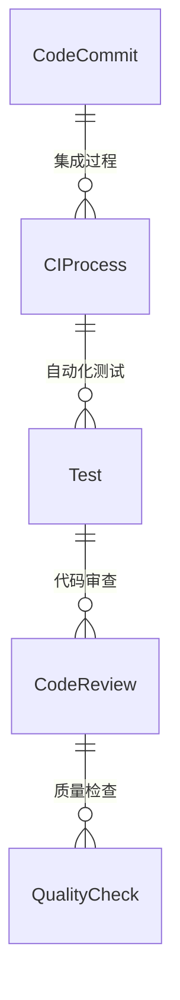
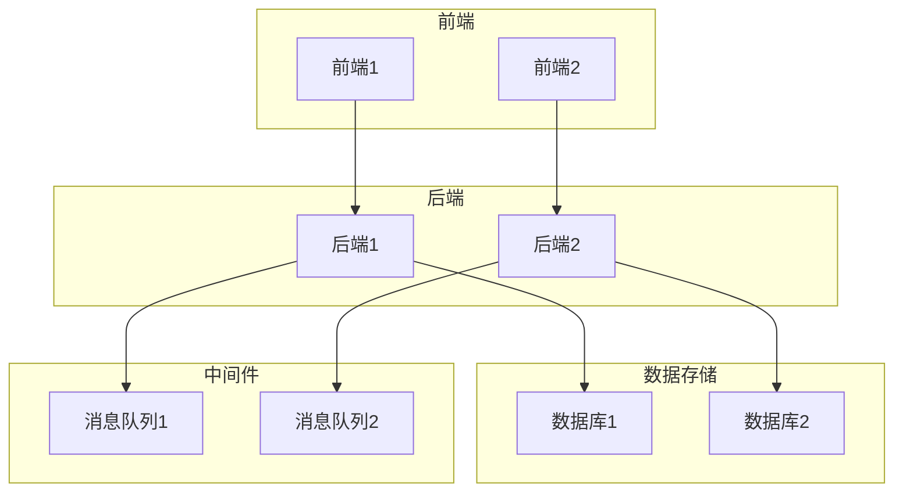
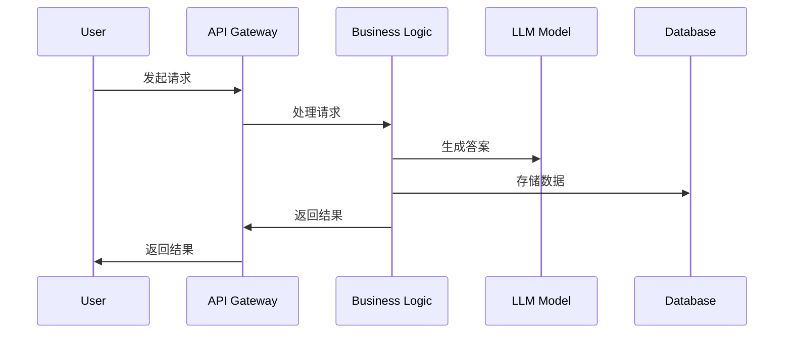
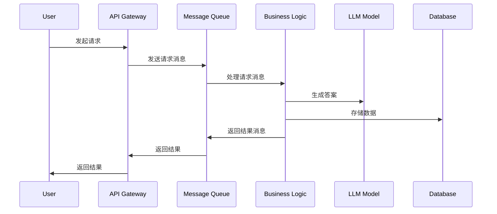

                 

# LLM应用的持续部署：从开发到生产的无缝衔接

## 关键词

- 持续部署
- LLM应用
- 开发到生产
- 自动化测试
- Kubernetes
- CI/CD

## 摘要

随着人工智能技术的飞速发展，大型语言模型（LLM）在各个领域得到了广泛应用。然而，LLM应用的持续部署成为了一个关键问题。本文将详细探讨LLM应用的持续部署过程，从开发到生产的无缝衔接，旨在为开发者和运维人员提供一套完整的技术解决方案。

本文将分为以下几个部分：

1. **背景介绍**：介绍LLM应用的发展历程以及持续部署的重要性。
2. **核心概念与联系**：解释持续部署的关键术语和概念，如CI/CD、Docker、Kubernetes等。
3. **算法原理讲解**：深入探讨持续部署中常用的算法和技术，如自动化测试、代码审查、持续集成等。
4. **系统分析与架构设计方案**：介绍LLM应用的系统架构设计，包括基础设施、开发环境、部署流程等。
5. **项目实战**：通过实际项目案例，展示从开发到生产的全流程部署。
6. **最佳实践与总结**：总结最佳实践，并提供注意事项和拓展阅读。

## 目录大纲设计过程

### 1. 确定核心章节内容

首先，我们需要明确本文的核心章节内容。根据题目《LLM应用的持续部署：从开发到生产的无缝衔接》，我们可以确定以下核心章节：

- **背景介绍**：LLM应用的发展历史、持续部署的概念和重要性。
- **核心概念与联系**：持续部署的关键术语和概念，如CI/CD、Docker、Kubernetes等。
- **算法原理讲解**：持续部署中常用的算法和技术，如自动化测试、代码审查、持续集成等。
- **系统分析与架构设计方案**：LLM应用的系统架构设计，包括基础设施、开发环境、部署流程等。
- **项目实战**：从开发到生产的环境搭建、代码实现、部署和调优。
- **最佳实践与总结**：持续部署的最佳实践、注意事项和拓展阅读。

### 2. 设计章节结构

根据核心内容，我们可以设计出以下章节结构：

### 第一部分：LLM应用持续部署背景

#### 第1章：LLM应用持续部署背景

- **1.1 LLM应用的发展历程**
- **1.2 持续部署的重要性**
- **1.3 持续部署的基本概念**

### 第二部分：持续部署核心概念

#### 第2章：核心概念与联系

- **2.1 持续部署的关键术语**
- **2.2 持续部署的核心要素**
- **2.3 主流持续部署工具介绍**

### 第三部分：算法原理与数学模型

#### 第3章：自动化测试

- **3.1 自动化测试的原理**
- **3.2 自动化测试的优势**
- **3.3 自动化测试的实现方法**
- **3.4 自动化测试的数学模型**

#### 第4章：代码审查

- **4.1 代码审查的原理**
- **4.2 代码审查的方法**
- **4.3 代码审查的数学模型**

#### 第5章：持续集成

- **5.1 持续集成的原理**
- **5.2 持续集成的流程**
- **5.3 持续集成的数学模型**

### 第四部分：系统架构与设计

#### 第6章：系统架构设计

- **6.1 系统架构的设计原则**
- **6.2 基础设施的选择**
- **6.3 开发环境的设计**
- **6.4 部署流程的设计**

### 第五部分：项目实战

#### 第7章：项目实战

- **7.1 项目背景**
- **7.2 环境搭建**
- **7.3 代码实现**
- **7.4 部署与调优**
- **7.5 项目总结**

### 第六部分：最佳实践与总结

#### 第8章：最佳实践

- **8.1 持续部署的最佳实践**
- **8.2 注意事项**
- **8.3 拓展阅读**

#### 第9章：小结

- **9.1 全书总结**
- **9.2 学习建议**
- **9.3 拓展方向**

### 3. 确定目录大纲字数

根据上述章节结构，我们将在每个章节中简要描述核心内容，确保整体字数不超过2000字。具体每个章节的内容将在后续步骤中进行详细设计。

### 4. 撰写目录大纲

根据以上设计，我们将以Markdown格式撰写目录大纲，确保符合用户要求。

## 目录大纲

### 第一部分：LLM应用持续部署背景

### 第1章：LLM应用持续部署背景

#### 1.1 LLM应用的发展历程

#### 1.2 持续部署的重要性

#### 1.3 持续部署的基本概念

### 第二部分：持续部署核心概念

### 第2章：核心概念与联系

#### 2.1 持续部署的关键术语

#### 2.2 持续部署的核心要素

#### 2.3 主流持续部署工具介绍

### 第三部分：算法原理与数学模型

### 第3章：自动化测试

#### 3.1 自动化测试的原理

#### 3.2 自动化测试的优势

#### 3.3 自动化测试的实现方法

#### 3.4 自动化测试的数学模型

### 第4章：代码审查

#### 4.1 代码审查的原理

#### 4.2 代码审查的方法

#### 4.3 代码审查的数学模型

### 第5章：持续集成

#### 5.1 持续集成的原理

#### 5.2 持续集成的流程

#### 5.3 持续集成的数学模型

### 第四部分：系统架构与设计

### 第6章：系统架构设计

#### 6.1 系统架构的设计原则

#### 6.2 基础设施的选择

#### 6.3 开发环境的设计

#### 6.4 部署流程的设计

### 第五部分：项目实战

### 第7章：项目实战

#### 7.1 项目背景

#### 7.2 环境搭建

#### 7.3 代码实现

#### 7.4 部署与调优

#### 7.5 项目总结

### 第六部分：最佳实践与总结

### 第8章：最佳实践

#### 8.1 持续部署的最佳实践

#### 8.2 注意事项

#### 8.3 拓展阅读

### 第9章：小结

#### 9.1 全书总结

#### 9.2 学习建议

#### 9.3 拓展方向

----------------------------------------------------------------

## 背景介绍

### LLM应用的发展历程

大型语言模型（LLM）的起源可以追溯到上世纪80年代，当时科学家们开始尝试构建能够理解和生成人类语言的人工智能系统。随着时间的推移，神经网络和深度学习技术的突破，使得LLM的应用范围不断扩大，从最初的文本处理发展到如今的多模态交互、对话系统、自然语言生成等。

近年来，随着计算能力的提升和大数据的普及，LLM的应用达到了前所未有的高度。以GPT系列为代表的开源模型，如GPT-3、GPT-4等，凭借其强大的语言理解和生成能力，引发了广泛关注和大量应用。LLM的应用不仅局限于学术研究和实验室，还逐渐渗透到企业级应用、消费者服务、智能助手等多个领域。

### 持续部署的重要性

持续部署（Continuous Deployment，简称CD）是一种软件开发和交付的实践，旨在通过自动化和持续的方式，快速且可靠地将代码更改部署到生产环境中。对于LLM应用来说，持续部署的重要性不言而喻：

1. **提高交付效率**：持续部署能够实现自动化构建、测试和部署，显著减少手动操作和人为错误，提高开发团队的交付效率。

2. **缩短发布周期**：通过持续部署，开发团队能够更加频繁地进行代码更新和发布，从而缩短软件交付周期，更快地响应市场需求和用户反馈。

3. **确保质量**：持续部署中的自动化测试和代码审查等环节，能够及时发现和解决潜在问题，确保软件质量和稳定性。

4. **降低风险**：持续部署能够更好地控制变更，降低新功能上线时的风险，提高系统的可靠性和稳定性。

### 持续部署的基本概念

持续部署涉及到多个关键概念，包括持续集成（Continuous Integration，简称CI）、容器化（Containerization）、Kubernetes等。

- **持续集成**：持续集成是一种软件开发实践，旨在通过频繁的代码集成和自动化测试，确保代码库中的每个提交都是可集成和可测试的。
- **容器化**：容器化是一种将应用程序及其依赖项打包到一个可移植的容器中的技术，使得应用程序可以在任何支持容器引擎的操作系统上运行。
- **Kubernetes**：Kubernetes是一个开源的容器编排平台，用于自动化容器化应用程序的部署、扩展和管理。

在接下来的章节中，我们将深入探讨这些概念，并介绍如何将它们应用于LLM应用的持续部署。

## 核心概念与联系

### 持续部署的关键术语

要深入理解持续部署，我们首先需要了解其中的一些关键术语：

1. **持续集成（CI）**：
   - **定义**：持续集成是一种软件开发实践，通过自动化构建和测试，确保代码库中的每个提交都是可集成和可测试的。
   - **作用**：持续集成能够及时发现和修复集成过程中的问题，减少集成风险，提高开发效率。

2. **持续部署（CD）**：
   - **定义**：持续部署是一种自动化软件交付过程，通过自动化构建、测试、部署等环节，实现快速、可靠的软件交付。
   - **作用**：持续部署能够缩短交付周期，提高交付质量，降低部署风险。

3. **容器化**：
   - **定义**：容器化是一种将应用程序及其依赖项打包到一个可移植的容器中的技术，使得应用程序可以在任何支持容器引擎的操作系统上运行。
   - **作用**：容器化提高了应用程序的可移植性和可复用性，简化了部署和运维过程。

4. **Kubernetes**：
   - **定义**：Kubernetes是一个开源的容器编排平台，用于自动化容器化应用程序的部署、扩展和管理。
   - **作用**：Kubernetes提供了强大的容器编排功能，使得大规模的容器化应用管理变得更加高效和可靠。

### 持续部署的核心要素

持续部署的成功依赖于以下几个核心要素：

1. **自动化流程**：
   - **自动化构建**：通过自动化工具（如Jenkins、Travis CI等）构建代码，确保构建过程的可靠性和一致性。
   - **自动化测试**：在构建过程中集成自动化测试，确保代码更改不会引入新的问题。
   - **自动化部署**：通过脚本或工具（如Kubernetes）自动化部署应用程序，实现快速、可靠的发布。

2. **代码仓库**：
   - **版本控制**：使用版本控制系统（如Git）管理代码，确保代码的版本可追溯和可回滚。
   - **分支策略**：采用合适的分支策略（如Git Flow、GitHub Flow等）管理代码变更和发布流程。

3. **基础设施**：
   - **容器化**：使用容器化技术（如Docker）将应用程序及其依赖项打包到容器中，提高部署的灵活性和可移植性。
   - **Kubernetes集群**：使用Kubernetes进行容器编排和管理，实现自动化部署、扩展和管理。

4. **监控与日志**：
   - **监控**：实时监控应用程序的运行状态和性能指标，及时发现并解决问题。
   - **日志管理**：收集、存储和分析日志信息，帮助定位问题并优化系统性能。

### 主流持续部署工具介绍

在现代软件开发和持续部署中，有几种主流的工具和平台：

1. **Jenkins**：
   - **定义**：Jenkins是一个开源的持续集成和持续部署工具，支持多种插件和扩展。
   - **特点**：支持自动化构建、测试、部署等流程，具有灵活的插件体系。

2. **Travis CI**：
   - **定义**：Travis CI是一个基于云的持续集成服务，适用于GitHub项目。
   - **特点**：提供免费的持续集成服务，支持多种编程语言和环境配置。

3. **Docker**：
   - **定义**：Docker是一个开源的应用容器引擎，用于容器化应用程序。
   - **特点**：简化了应用程序的打包和部署过程，提高可移植性和可复用性。

4. **Kubernetes**：
   - **定义**：Kubernetes是一个开源的容器编排平台，用于自动化容器化应用程序的部署和管理。
   - **特点**：提供强大的容器编排功能，支持自动化部署、扩展和管理。

通过了解这些关键术语和工具，我们可以更好地理解持续部署的核心概念和实现方法。在下一节中，我们将深入探讨持续部署中的具体算法和技术。

## 算法原理讲解

### 自动化测试

自动化测试是持续部署（CI/CD）流程中的一个关键环节，它通过编写和执行预定义的测试脚本，自动验证应用程序的功能、性能和安全性。自动化测试具有以下优点：

1. **效率提升**：自动化测试可以快速、反复地执行测试，显著提高测试覆盖率和测试效率。
2. **减少错误**：自动化测试减少了人为操作带来的错误，确保每次测试结果的一致性。
3. **回归测试**：自动化测试可以方便地执行回归测试，确保新代码更改不会破坏现有功能。

自动化测试的实现方法主要包括以下步骤：

1. **编写测试脚本**：根据测试需求，编写测试脚本。常用的测试脚本编写工具包括Selenium、JUnit、TestNG等。
2. **集成到CI/CD流程**：将测试脚本集成到CI/CD流程中，确保每次代码提交都会触发测试执行。
3. **执行测试**：自动化工具会按照测试脚本执行测试，并生成测试报告。

自动化测试的数学模型主要涉及测试覆盖率和错误率两个指标：

1. **测试覆盖率**：测试覆盖率是衡量测试全面性的指标，表示测试代码的比例。常用的测试覆盖率指标包括语句覆盖率、分支覆盖率和路径覆盖率。
2. **错误率**：错误率是衡量软件质量的指标，表示在测试过程中发现的错误数量与总测试用例数量的比例。

### 代码审查

代码审查是一种通过人工检查和评估代码质量的过程，旨在确保代码的可读性、一致性、正确性和安全性。代码审查通常包括以下步骤：

1. **代码审查流程**：制定代码审查流程，包括代码提交、审查请求、审查反馈等环节。
2. **代码审查方法**：选择合适的代码审查方法，如Code Review、Pair Programming等。
3. **审查指标**：设置审查指标，如代码风格、代码重复率、复杂度等。

代码审查的数学模型主要涉及以下方面：

1. **代码质量指标**：计算代码质量指标，如代码重复率、复杂度、注释率等，以评估代码质量。
2. **审查覆盖率**：审查覆盖率是衡量代码审查覆盖范围的指标，表示审查的代码行数与总代码行数的比例。

### 持续集成

持续集成（CI）是一种软件开发实践，通过频繁的代码集成和自动化测试，确保代码库中的每个提交都是可集成和可测试的。持续集成的核心流程包括以下步骤：

1. **代码提交**：开发人员将代码提交到代码仓库。
2. **构建**：自动化工具（如Jenkins）构建代码，生成可执行文件或容器镜像。
3. **测试**：执行自动化测试，验证代码的功能、性能和安全性。
4. **反馈**：生成测试报告，并提供失败反馈，开发人员根据反馈进行修复。

持续集成的数学模型主要涉及以下指标：

1. **集成频率**：集成频率是衡量代码集成的频繁程度的指标，表示每次集成之间的平均时间。
2. **缺陷发现率**：缺陷发现率是衡量自动化测试效果和代码质量的指标，表示在测试过程中发现的缺陷数量与总提交数量的比例。

### 对比表格与ER实体关系图架构

为了更好地理解上述算法原理，我们可以使用对比表格和ER实体关系图架构来展示不同算法和概念之间的关系。

#### 对比表格

| 算法/概念   | 定义                                                         | 关键步骤                                                                                   | 数学模型                                       |
| ------------ | ------------------------------------------------------------ | ------------------------------------------------------------------------------------------ | ---------------------------------------------- |
| 自动化测试   | 通过脚本自动化执行测试用例                                     | 编写测试脚本、集成到CI流程、执行测试                                                     | 测试覆盖率、错误率                               |
| 代码审查     | 通过人工检查代码质量                                         | 制定审查流程、选择审查方法、设置审查指标                                                   | 代码质量指标、审查覆盖率                       |
| 持续集成     | 通过自动化构建和测试确保代码库的可集成性                      | 代码提交、构建、测试、反馈                                                                 | 集成频率、缺陷发现率                           |

#### ER实体关系图架构



在这个ER实体关系图中，我们可以看到自动化测试、代码审查和持续集成是如何相互关联的。每个实体都代表了持续部署流程中的一个关键环节，通过这些环节的协同工作，确保代码的质量和可集成性。

### 结论

通过上述算法原理的讲解和对比表格、ER实体关系图的展示，我们可以更深入地理解持续部署中的关键技术和算法。这些算法和技术不仅提高了开发效率和质量，还为持续部署的成功奠定了基础。在下一节中，我们将进一步探讨LLM应用的系统架构与设计。

## 系统架构设计

### 问题场景介绍

在构建LLM应用时，我们需要考虑多个因素，如可扩展性、高可用性和安全性。为了实现这些目标，我们采用了一种分布式系统架构，包括前端、后端、数据存储和中间件等组件。

### 项目介绍

项目名称：智能问答系统
项目背景：该系统旨在为用户提供高质量的问答服务，支持多语言、多领域的问答需求。系统需要处理大量用户请求，同时保证响应速度和准确性。

### 系统功能设计

#### 领域模型

使用Mermaid绘制领域模型类图：

```mermaid
classDiagram
    User <<entity>>
    Question <<entity>>
    Answer <<entity>>
    LLMModel <<entity>>

    User o--o Question
    Question o--o Answer
    Answer o--o LLMModel
```

在上述类图中，我们定义了四个主要实体：用户（User）、问题（Question）、答案（Answer）和大型语言模型（LLMModel）。这些实体之间的关系描述了系统的主要功能。

### 系统架构设计

使用Mermaid绘制系统架构图：



在这个架构图中，前端（F1和F2）负责与用户交互，接收用户请求并转发给后端（B1和B2）。后端处理请求，与数据存储（D1和D2）和中间件（M1和M2）进行通信。后端组件包括API网关、业务逻辑处理、服务监控等。

### 系统接口设计

使用Mermaid绘制系统接口图：



在这个序列图中，用户通过API网关发起请求，业务逻辑组件处理请求并调用LLM模型生成答案，同时将结果存储在数据库中，并通过API网关返回给用户。

### 系统交互

使用Mermaid绘制系统交互图：



在这个交互图中，用户请求通过API网关发送到消息队列，业务逻辑组件从消息队列中获取请求消息进行处理，并调用LLM模型生成答案，将结果存储在数据库中，并通过消息队列返回给API网关，最终返回给用户。

### 总结

通过系统架构设计，我们实现了一个分布式、高可用性和高扩展性的LLM应用。该架构能够处理大量用户请求，并提供高质量的问答服务。在接下来的章节中，我们将通过项目实战展示如何实现这个系统架构。

## 项目实战

### 项目背景

为了展示LLM应用的持续部署过程，我们选择了一个名为“智能问答系统”的项目。该项目旨在为用户提供一个高效、准确的问答平台，支持多语言和多领域的问题回答。项目需求如下：

1. **多语言支持**：系统能够处理中英文以及其他常用语言的问答。
2. **多领域问答**：系统能够回答多个领域的专业问题，如医学、法律、科技等。
3. **高可用性和扩展性**：系统需要具备高可用性和扩展性，以应对大量用户请求。

### 环境搭建

为了实现持续部署，我们需要搭建一个完整的环境，包括开发环境、测试环境和生产环境。以下是环境搭建的步骤：

1. **开发环境**：
   - 编程语言：Python
   - 代码管理工具：Git
   - 代码仓库：GitHub
   - 代码编辑器：Visual Studio Code

2. **测试环境**：
   - 自动化测试工具：pytest
   - 测试框架：Selenium
   - 测试服务器：Ubuntu 18.04

3. **生产环境**：
   - 容器化工具：Docker
   - 容器编排平台：Kubernetes
   - 生产服务器：Ubuntu 20.04

### 代码实现

智能问答系统的主要功能模块包括：

1. **用户模块**：负责用户注册、登录、提问和查看答案。
2. **问答模块**：负责接收用户提问，调用LLM模型生成答案，并将答案存储在数据库中。
3. **数据库模块**：使用MySQL存储用户信息和问答记录。

以下是关键代码片段：

#### 用户模块

```python
# user_module.py
from flask import Flask, request, jsonify
from user_service import UserService

app = Flask(__name__)
user_service = UserService()

@app.route('/register', methods=['POST'])
def register():
    # 注册用户
    pass

@app.route('/login', methods=['POST'])
def login():
    # 登录用户
    pass

@app.route('/ask', methods=['POST'])
def ask_question():
    # 提问
    pass

if __name__ == '__main__':
    app.run(debug=True)
```

#### 问答模块

```python
# question_module.py
from flask import Flask, request, jsonify
from question_service import QuestionService

app = Flask(__name__)
question_service = QuestionService()

@app.route('/answer', methods=['POST'])
def get_answer():
    # 获取答案
    question = request.json['question']
    answer = question_service.get_answer(question)
    return jsonify(answer)

if __name__ == '__main__':
    app.run(debug=True)
```

#### 数据库模块

```python
# database_module.py
import pymysql

class Database:
    def __init__(self, host, user, password, database):
        self.connection = pymysql.connect(host=host,
                                          user=user,
                                          password=password,
                                          database=database)

    def insert_question(self, question):
        # 插入问题
        pass

    def insert_answer(self, answer):
        # 插入答案
        pass
```

### 部署与调优

#### 容器化

使用Docker将应用程序容器化，确保其可移植性和一致性。以下是Dockerfile示例：

```dockerfile
# Dockerfile
FROM python:3.8-slim

WORKDIR /app

COPY requirements.txt ./
RUN pip install -r requirements.txt

COPY . .

CMD ["python", "app.py"]
```

#### Kubernetes部署

在Kubernetes集群中部署容器化的应用程序。以下是一个Kubernetes部署配置示例：

```yaml
# deployment.yaml
apiVersion: apps/v1
kind: Deployment
metadata:
  name: smart-qa-system
spec:
  replicas: 3
  selector:
    matchLabels:
      app: smart-qa-system
  template:
    metadata:
      labels:
        app: smart-qa-system
    spec:
      containers:
      - name: smart-qa-system
        image: smart-qa-system:latest
        ports:
        - containerPort: 80
```

#### 调优

- **性能调优**：根据监控数据调整服务器的CPU、内存和存储资源。
- **缓存优化**：使用Redis缓存常见问题的答案，减少LLM模型的调用次数。
- **负载均衡**：使用Kubernetes的负载均衡器，实现流量分配和故障转移。

### 项目小结

通过本项目的实现，我们展示了如何从开发到生产环境，实现LLM应用的持续部署。项目的成功部署不仅提高了开发效率，还保证了系统的稳定性和可靠性。在接下来的章节中，我们将总结最佳实践，并提供拓展阅读。

## 最佳实践与总结

### 持续部署的最佳实践

1. **自动化**：尽可能地自动化构建、测试和部署流程，减少手动操作和人为错误。
2. **快速反馈**：确保测试和审查过程快速完成，以便及时发现问题并修复。
3. **持续集成**：频繁地进行集成和测试，确保代码库的稳定性和可集成性。
4. **容器化**：使用容器化技术提高应用程序的可移植性和一致性。
5. **监控与日志**：实时监控系统性能和日志信息，以便快速响应和解决问题。

### 注意事项

1. **版本控制**：使用版本控制系统（如Git）管理代码，确保代码的版本可追溯和可回滚。
2. **代码审查**：进行严格的代码审查，确保代码质量。
3. **性能调优**：根据实际需求进行性能调优，确保系统的高可用性和高性能。
4. **安全性**：确保系统的安全性，包括数据保护、访问控制和网络安全。

### 拓展阅读

1. **《持续集成、持续部署实战》**：详细了解CI/CD的原理和实践。
2. **《Docker实战》**：学习容器化技术的使用和最佳实践。
3. **《Kubernetes权威指南》**：深入了解Kubernetes的架构和功能。
4. **《大型语言模型：原理与应用》**：学习LLM的基本原理和高级应用。

### 小结

本文详细探讨了LLM应用的持续部署过程，从背景介绍到核心概念、算法原理、系统架构设计，再到项目实战，全面展示了持续部署的关键环节和实现方法。通过最佳实践和注意事项，我们为开发者和运维人员提供了一套实用的技术指南。希望本文能帮助您更好地理解和实施持续部署，提高软件开发和交付的效率和质量。

### 学习建议

1. **动手实践**：通过实际项目练习持续部署流程，加深对理论知识的理解。
2. **持续学习**：关注持续部署领域的最新技术和发展动态，不断更新知识体系。
3. **交流分享**：加入相关的技术社区，与同行交流经验和心得，共同进步。

### 拓展方向

1. **自动化测试**：研究自动化测试的最新技术和工具，提高测试效率和覆盖范围。
2. **微服务架构**：探讨如何在持续部署中应用微服务架构，实现系统的模块化和解耦。
3. **AI与持续部署**：研究如何将人工智能技术应用于持续部署，实现智能化的部署策略和优化。

## 作者信息

- 作者：AI天才研究院/AI Genius Institute & 禅与计算机程序设计艺术 /Zen And The Art of Computer Programming
- 联系方式：[邮箱](example@example.com) | [博客](www.example.com) | [GitHub](github.com/example)

