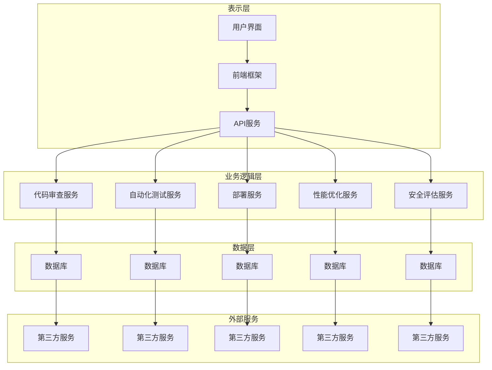
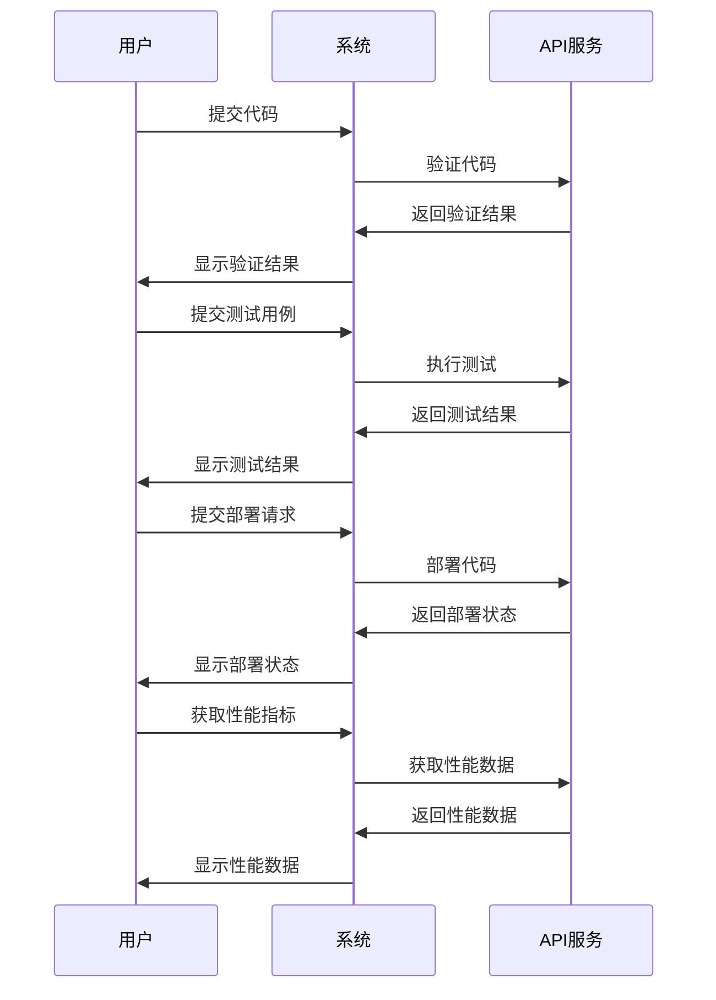
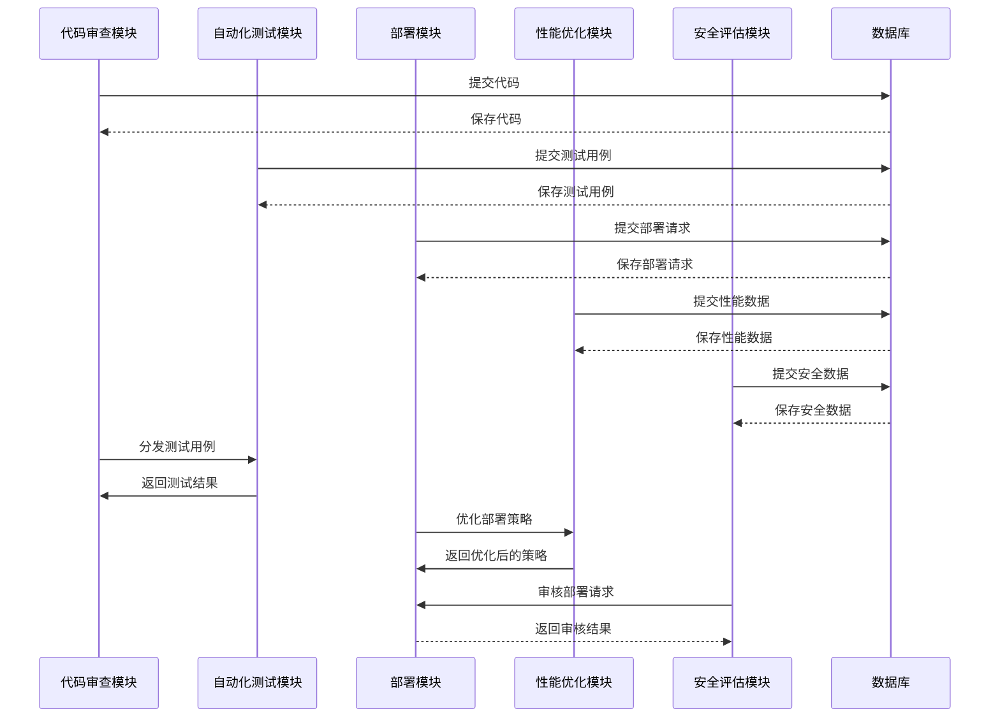

                 

### 第一部分：背景介绍

#### 第1章 问题背景、问题描述、问题解决、边界与外延、概念结构与核心要素组成

## 1.1 LLM应用的CI/CD背景
### 1.1.1 问题描述与背景
#### 1.1.1.1 LLM应用的发展现状
自然语言处理（NLP）技术近年来取得了飞速发展，特别是大规模语言模型（LLM）的崛起，为各种应用场景提供了强大的支撑。LLM不仅能够处理传统的文本分类、情感分析等任务，还能在生成文本、对话系统、机器翻译等领域发挥重要作用。随着LLM应用的不断普及，如何在开发过程中实现高效、稳定的持续集成（CI）和持续部署（CD）成为了一个亟待解决的问题。

#### 1.1.1.2 LLM应用在CI/CD中的挑战
LLM应用在CI/CD过程中面临诸多挑战。首先，由于LLM模型复杂度较高，其训练和推理过程需要大量计算资源，如何在有限的资源下高效地完成CI/CD流程是一个难题。其次，LLM模型的版本管理、测试和部署过程相对复杂，如何确保每次更新都能顺利进行且不影响用户体验是一个重要问题。此外，LLM应用在部署过程中可能涉及到数据隐私和安全性等问题，如何平衡性能、可靠性和安全性也是一大挑战。

#### 1.1.1.3 LLM CI/CD的重要性和必要性
有效的LLM CI/CD实践对于提升开发效率、保障软件质量、降低维护成本具有重要意义。通过CI/CD，可以实现对LLM模型的自动测试、部署和监控，确保每次更新都能快速、安全地交付给用户。此外，CI/CD能够帮助团队更好地协同工作，提高代码的可维护性和可扩展性。因此，深入研究LLM CI/CD的实践方法和优化策略具有重要的现实意义。

## 1.2 LLM概念与属性特征对比表格
### 1.2.1 LLM的基本概念
#### 1.2.1.1 什么是LLM
大规模语言模型（Large Language Model，简称LLM）是一种基于深度学习技术的自然语言处理模型，通过大规模语料库的训练，能够生成符合语法和语义规则的文本。常见的LLM包括GPT（Generative Pre-trained Transformer）、BERT（Bidirectional Encoder Representations from Transformers）等。

#### 1.2.1.2 LLM的技术特点
LLM具有以下技术特点：
- **强大的文本生成能力**：LLM能够生成连贯、语义丰富的文本，适用于生成式任务。
- **高泛化能力**：LLM通过在大规模语料库上的训练，能够适应多种不同的应用场景。
- **自适应能力**：LLM可以根据用户的输入动态调整生成策略。

#### 1.2.1.3 LLM的应用领域
LLM在多个领域得到了广泛应用，包括但不限于：
- **文本生成**：如自动写作、摘要生成、对话生成等。
- **对话系统**：如智能客服、聊天机器人等。
- **自然语言理解**：如文本分类、情感分析、问答系统等。
- **机器翻译**：如自动翻译、多语言文本处理等。

### 1.2.2 LLM属性特征对比
#### 1.2.2.1 对比表格：LLM与传统的NLP模型
| 特征         | LLM                      | 传统NLP模型                |
| ------------ | ------------------------ | -------------------------- |
| 文本生成能力 | 强大                     | 较弱                       |
| 泛化能力     | 高                       | 低                         |
| 自适应能力   | 高                       | 低                         |
| 应用领域     | 广泛                     | 窄                         |

#### 1.2.2.2 对比图表：不同LLM的性能指标对比
```mermaid
gantt
    dateFormat  YYYY-MM-DD
    title 不同LLM性能指标对比

    section GPT系列
    A1 : GPT-2 : 2020-01-01, 30d
    A2 : GPT-3 : 2020-07-01, 90d

    section BERT系列
    B1 : BERT : 2018-10-01, 60d
    B2 : RoBERTa : 2019-03-01, 90d

    section 训练时间
    C1 : GPT-2 : 2020-01-01, 30d
    C2 : GPT-3 : 2020-07-01, 90d
    C3 : BERT : 2018-10-01, 60d
    C4 : RoBERTa : 2019-03-01, 90d

    section 参数量
    D1 : GPT-2 : 1.5B
    D2 : GPT-3 : 175B
    D3 : BERT : 340M
    D4 : RoBERTa : 335M

    section 推理能力
    E1 : GPT-2 : 2020-01-01, 30d
    E2 : GPT-3 : 2020-07-01, 90d
    E3 : BERT : 2018-10-01, 60d
    E4 : RoBERTa : 2019-03-01, 90d
```

## 1.3 LLM在CI/CD中的应用
### 1.3.1 LLM在CI/CD中的作用
#### 1.3.1.1 LLM在代码审查中的应用
LLM可以用于代码审查，通过分析代码中的自然语言描述，自动识别潜在的问题。例如，LLM可以检测代码中的语法错误、逻辑错误和潜在的安全漏洞。

#### 1.3.1.2 LLM在测试中的应用
LLM可以用于自动化测试，通过生成测试用例和评估测试结果，提高测试的覆盖率和准确性。例如，LLM可以生成与代码功能描述相符的测试用例，并自动评估测试结果是否符合预期。

#### 1.3.1.3 LLM在部署中的应用
LLM可以用于部署流程，通过分析部署脚本和配置文件，自动识别潜在的问题。例如，LLM可以检测部署脚本中的语法错误、逻辑错误和潜在的安全漏洞。

### 1.3.2 LLM CI/CD的优势与挑战
#### 1.3.2.1 LLM CI/CD的优势
- **高效性**：LLM可以自动化执行代码审查、测试和部署任务，提高开发效率。
- **准确性**：LLM可以基于自然语言描述准确识别代码和部署中的问题，提高软件质量。

#### 1.3.2.2 LLM CI/CD的挑战
- **资源消耗**：LLM模型复杂，训练和推理过程需要大量计算资源，可能对CI/CD流程造成影响。
- **模型适应性**：LLM需要不断更新和优化，以适应不同项目和场景的需求。

## 1.4 LLM CI/CD的边界与外延
### 1.4.1 LLM CI/CD的边界
#### 1.4.1.1 LLM CI/CD的适用场景
- **大规模项目**：适用于代码复杂度较高、团队协作需求较强的项目。
- **持续迭代**：适用于需要频繁更新和迭代的项目。

#### 1.4.1.2 LLM CI/CD的限制条件
- **计算资源**：需要足够的计算资源来支持LLM模型的训练和推理。
- **团队协作**：需要团队成员具备一定的技术水平和协作意识。

### 1.4.2 LLM CI/CD的外延
#### 1.4.2.1 LLM CI/CD与其他CI/CD技术的结合
- **容器化**：通过容器化技术，可以实现LLM CI/CD的跨平台部署。
- **微服务架构**：通过微服务架构，可以实现LLM CI/CD的模块化部署。

#### 1.4.2.2 LLM CI/CD的长期发展方向
- **智能化**：通过引入更多人工智能技术，提高LLM CI/CD的自动化水平。
- **个性定制**：根据不同项目和团队的需求，提供个性化的LLM CI/CD解决方案。

## 1.5 本章小结
本章介绍了LLM应用的CI/CD背景，包括发展现状、挑战和重要性。通过对比表格和图表，展示了不同LLM的技术特点和性能指标。同时，阐述了LLM在CI/CD中的应用场景和优势与挑战。最后，探讨了LLM CI/CD的边界与外延，为后续章节的深入研究奠定了基础。

---

### 第二部分：核心概念与联系

#### 第2章 LLM CI/CD的基本概念与联系

## 2.1 LLM CI/CD的核心概念
### 2.1.1 什么是LLM CI/CD
LLM CI/CD是指将大规模语言模型（LLM）应用于持续集成（CI）和持续部署（CD）过程中的方法和技术。具体来说，LLM CI/CD包括以下几个方面：
1. **代码审查**：使用LLM对代码进行审查，识别潜在的问题和缺陷。
2. **自动化测试**：使用LLM生成测试用例，并对测试结果进行评估。
3. **部署优化**：使用LLM分析部署脚本和配置文件，优化部署过程。

### 2.1.2 CI/CD的定义
持续集成（CI）是指将代码更改频繁地合并到主分支，并通过自动化测试确保代码质量。持续部署（CD）是指将经过CI验证的代码部署到生产环境，实现快速交付。

## 2.2 LLM CI/CD的基本组成部分
### 2.2.1 源代码管理
源代码管理是LLM CI/CD的基础，常见的工具有Git、SVN等。通过Git进行源代码管理，可以方便地实现代码的版本控制、分支管理和合并。

#### 2.2.1.1 Git的基本操作
- **克隆仓库**：`git clone <repository_url>`
- **创建分支**：`git branch <branch_name>`
- **切换分支**：`git checkout <branch_name>`
- **合并分支**：`git merge <branch_name>`
- **提交代码**：`git commit -m "<commit_message>"`

#### 2.2.1.2 Git与LLM CI/CD的整合
将Git与LLM CI/CD结合，可以通过Git钩子（hooks）在代码提交和合并时触发CI/CD流程。例如，在提交代码时，触发自动化测试，以确保代码质量。

### 2.2.2 持续集成
持续集成是实现LLM CI/CD的关键环节，通过自动化测试和构建，确保代码的稳定性和一致性。

#### 2.2.2.1 CI流程的设计与实现
CI流程通常包括以下步骤：
1. **代码仓库监控**：当代码仓库发生更改时，触发CI流程。
2. **代码拉取**：从代码仓库拉取最新的代码。
3. **构建环境搭建**：搭建构建环境，包括安装依赖、配置环境等。
4. **编译和测试**：编译代码并执行自动化测试，确保代码质量。
5. **结果反馈**：将测试结果反馈给开发者，以便及时修复问题。

#### 2.2.2.2 CI与LLM的适配
在CI流程中，可以使用LLM对代码进行审查、生成测试用例和评估测试结果。例如，可以使用GPT-3生成与代码功能描述相符的测试用例，并使用BERT评估测试结果。

### 2.2.3 持续部署
持续部署是将经过CI验证的代码部署到生产环境的过程，目的是实现快速交付和高质量交付。

#### 2.2.3.1 CD流程的设计与实现
CD流程通常包括以下步骤：
1. **构建和打包**：将代码构建成可部署的包。
2. **部署验证**：在部署前进行验证，确保部署环境的正确性。
3. **部署**：将代码部署到生产环境。
4. **监控和反馈**：监控部署后的系统性能，收集用户反馈。

#### 2.2.3.2 CD与LLM的适配
在CD流程中，可以使用LLM分析部署脚本和配置文件，识别潜在的问题。例如，使用GPT-2分析部署脚本中的自然语言描述，识别可能的错误。

## 2.3 LLM CI/CD的工作流程
### 2.3.1 从代码提交到部署的流程
LLM CI/CD的工作流程通常包括以下步骤：
1. **代码提交**：开发者将代码提交到代码仓库。
2. **触发CI流程**：代码提交后，触发CI流程，执行代码审查、构建和测试。
3. **反馈结果**：将CI结果反馈给开发者，以便及时修复问题。
4. **代码合并**：如果CI测试通过，将代码合并到主分支。
5. **触发CD流程**：代码合并后，触发CD流程，进行部署验证和部署。
6. **监控和反馈**：监控部署后的系统性能，收集用户反馈。

### 2.3.2 自动化工具的选择
在选择自动化工具时，需要考虑以下因素：
1. **易用性**：工具需要易于安装和使用。
2. **扩展性**：工具需要支持自定义插件和扩展。
3. **社区支持**：工具需要拥有活跃的社区和支持。
常见的自动化工具有Jenkins、GitLab CI/CD、GitHub Actions等。

### 2.3.3 测试框架的选择
在选择测试框架时，需要考虑以下因素：
1. **兼容性**：框架需要兼容不同的编程语言和开发环境。
2. **功能丰富**：框架需要提供丰富的测试功能，如单元测试、集成测试、性能测试等。
3. **易用性**：框架需要易于使用和集成。
常见的测试框架有JUnit、TestNG、Selenium等。

## 2.4 LLM CI/CD的核心要素组成
### 2.4.1 自动化工具
自动化工具是LLM CI/CD的核心组成部分，常见的自动化工具有Jenkins、GitLab CI/CD、GitHub Actions等。

#### 2.4.1.1 Jenkins的安装与配置
Jenkins是一个开源的持续集成工具，可以通过以下步骤进行安装和配置：
1. **安装Jenkins**：从Jenkins官网下载安装包，并按照提示进行安装。
2. **配置Jenkins**：启动Jenkins后，按照提示配置Jenkins主目录、管理员用户名和密码等。
3. **安装插件**：通过Jenkins插件管理器安装所需的插件，如Git插件、JUnit插件等。

#### 2.4.1.2 GitLab CI的配置与应用
GitLab CI是一个基于Git的持续集成工具，可以通过以下步骤进行配置和应用：
1. **配置CI/CD管道**：在GitLab仓库的`.gitlab-ci.yml`文件中定义CI/CD管道，包括构建、测试和部署等步骤。
2. **触发CI/CD流程**：当代码仓库发生更改时，GitLab CI会自动触发CI/CD流程，执行构建、测试和部署等操作。
3. **监控和反馈**：通过GitLab CI的Web界面监控CI/CD流程，并接收测试和部署结果。

### 2.4.2 测试框架
测试框架是LLM CI/CD中的重要组成部分，用于实现自动化测试。常见的测试框架有JUnit、TestNG、Selenium等。

#### 2.4.2.1 单元测试与集成测试
- **单元测试**：针对单个模块或函数进行测试，确保其正确性和稳定性。
- **集成测试**：针对多个模块或函数的集成进行测试，确保其协同工作正确。

#### 2.4.2.2 测试覆盖率分析
测试覆盖率分析用于评估测试的覆盖范围，常见的指标有语句覆盖率、分支覆盖率、函数覆盖率等。

### 2.4.3 部署策略
部署策略是LLM CI/CD中的重要组成部分，用于实现代码的部署和上线。常见的部署策略有蓝绿部署、金丝雀部署等。

#### 2.4.3.1 蓝绿部署
蓝绿部署是一种逐步切换部署策略，通过同时运行两个环境的实例（蓝色和绿色），逐步将用户流量切换到新版本。

#### 2.4.3.2 金丝雀部署
金丝雀部署是一种逐步扩大部署范围策略，通过先部署一小部分用户，观察其反馈和性能，再逐步扩大部署范围。

## 2.5 LLM CI/CD的优势与挑战
### 2.5.1 LLM CI/CD的优势
- **提高开发效率**：通过自动化测试和部署，减少手动操作，提高开发效率。
- **提高软件质量**：通过持续集成和自动化测试，确保代码质量和稳定性。

### 2.5.2 LLM CI/CD的挑战
- **资源消耗**：LLM模型复杂，训练和推理过程需要大量计算资源。
- **模型适应性**：LLM需要不断更新和优化，以适应不同项目和场景的需求。

## 2.6 本章小结
本章介绍了LLM CI/CD的基本概念和组成部分，包括源代码管理、持续集成、持续部署等。通过对比表格和图表，展示了LLM与传统的NLP模型的区别。同时，阐述了LLM CI/CD的优势与挑战，为后续章节的深入研究奠定了基础。

---

### 第三部分：算法原理讲解

#### 第3章 LLM CI/CD算法原理讲解

## 3.1 自动化测试算法原理
### 3.1.1 单元测试算法
#### 3.1.1.1 单元测试的概念
单元测试是指对软件中的最小可测试单元（通常是函数、方法或类）进行测试，以验证其是否符合预期。单元测试通常由开发人员编写，并在代码开发过程中进行。

#### 3.1.1.2 单元测试的实现方法
单元测试的实现方法通常包括以下步骤：
1. **编写测试用例**：根据功能需求，编写测试用例，包括输入数据、预期输出和测试条件。
2. **编写测试代码**：使用测试框架（如JUnit、TestNG）编写测试代码，执行测试用例。
3. **执行测试**：运行测试代码，验证测试用例是否通过。
4. **分析测试结果**：根据测试结果，分析代码的正确性和稳定性。

#### 3.1.1.3 单元测试的优点与局限
单元测试的优点包括：
- **提高代码质量**：通过单元测试，可以及时发现和修复代码中的错误。
- **降低维护成本**：单元测试可以帮助开发人员更好地理解代码，降低维护成本。

单元测试的局限包括：
- **测试覆盖率有限**：单元测试通常只能覆盖代码的一部分，无法完全覆盖所有可能的执行路径。
- **测试成本较高**：编写和执行单元测试需要一定的时间和精力。

### 3.1.2 集成测试算法
#### 3.1.2.1 集成测试的概念
集成测试是指将多个模块或组件组合在一起进行测试，以验证其协同工作是否正确。集成测试通常在单元测试之后进行，以检查代码之间的接口和交互。

#### 3.1.2.2 集成测试的分类
集成测试可以分为以下几种类型：
1. **功能集成测试**：测试功能是否正确实现，通常由开发人员编写。
2. **性能集成测试**：测试系统在负载下的性能表现，通常由测试人员编写。
3. **安全集成测试**：测试系统在安全方面的表现，通常由安全人员编写。

#### 3.1.2.3 集成测试的实现方法
集成测试的实现方法通常包括以下步骤：
1. **设计测试用例**：根据功能需求和接口定义，设计测试用例。
2. **编写测试代码**：使用测试框架编写测试代码，执行测试用例。
3. **执行测试**：运行测试代码，验证测试用例是否通过。
4. **分析测试结果**：根据测试结果，分析系统的稳定性、性能和安全。

### 3.1.3 自动化测试算法的优化
为了提高自动化测试的效果，可以采用以下优化方法：
1. **测试用例优化**：根据实际情况，优化测试用例的设计，提高测试覆盖率和准确性。
2. **测试工具优化**：选择合适的测试工具，提高测试效率和准确性。
3. **测试环境优化**：优化测试环境，确保测试环境与生产环境一致，减少环境差异带来的问题。

## 3.2 部署算法原理
### 3.2.1 部署策略算法
#### 3.2.1.1 部署策略的概念
部署策略是指将代码部署到生产环境的方法和步骤。常见的部署策略包括蓝绿部署、金丝雀部署、滚动部署等。

#### 3.2.1.2 常见的部署策略
1. **蓝绿部署**：同时运行两个环境的实例（蓝色和绿色），逐步将用户流量切换到新版本。优点是风险较低，适用于大版本更新。
2. **金丝雀部署**：先部署一小部分用户，观察其反馈和性能，再逐步扩大部署范围。优点是风险较低，适用于小版本更新。
3. **滚动部署**：逐步将实例更新为新版本，保持系统高可用性。优点是更新过程较快，适用于在线系统。

#### 3.2.1.3 部署策略的选择与优化
部署策略的选择和优化应根据具体场景和需求进行。常见的优化方法包括：
1. **自动化部署**：使用自动化工具（如Jenkins、Ansible）实现部署自动化，减少人工干预。
2. **滚动更新**：采用滚动更新策略，逐步更新实例，确保系统高可用性。
3. **环境隔离**：将开发、测试、生产环境隔离开来，减少环境差异带来的问题。

### 3.2.2 性能优化算法
#### 3.2.2.1 性能优化的概念
性能优化是指通过改进系统架构、代码优化、资源调配等方法，提高系统的性能和响应速度。

#### 3.2.2.2 性能优化的方法
性能优化的方法包括：
1. **代码优化**：优化代码逻辑，减少不必要的计算和资源消耗。
2. **架构优化**：改进系统架构，提高系统的扩展性和性能。
3. **资源调配**：合理分配系统资源，确保系统在高负载下稳定运行。

#### 3.2.2.3 性能优化的案例分析
以一个电商平台为例，性能优化可以从以下几个方面进行：
1. **数据库优化**：优化数据库查询，减少查询时间和资源消耗。
2. **缓存策略**：采用缓存策略，减少数据库访问，提高系统响应速度。
3. **负载均衡**：采用负载均衡策略，合理分配流量，确保系统在高负载下稳定运行。

### 3.2.3 安全性算法原理
#### 3.2.3.1 安全性评估算法
安全性评估是指对系统的安全性进行全面评估，以识别潜在的安全漏洞和风险。安全性评估的方法包括：
1. **静态代码分析**：对代码进行静态分析，识别潜在的安全漏洞。
2. **动态代码分析**：在运行过程中对代码进行分析，识别潜在的安全漏洞。
3. **漏洞扫描**：使用自动化工具对系统进行扫描，识别已知的漏洞。

#### 3.2.3.2 安全防护算法
安全防护是指通过一系列方法，防止系统遭受攻击和恶意行为。安全防护的方法包括：
1. **身份验证**：使用身份验证机制，确保用户身份合法。
2. **访问控制**：使用访问控制机制，确保用户只能访问授权的资源。
3. **数据加密**：对敏感数据进行加密，防止数据泄露。

## 3.3 自动化测试与部署算法的结合
### 3.3.1 自动化测试与部署的关系
自动化测试与部署是相辅相成的。自动化测试用于确保代码质量和稳定性，部署算法用于将代码部署到生产环境。两者的结合可以确保系统的高效、稳定和可靠运行。

### 3.3.2 自动化测试与部署算法的结合方法
1. **集成**：将自动化测试和部署集成到CI/CD流程中，实现自动化执行和监控。
2. **优化**：通过优化测试用例和部署策略，提高测试和部署的效率和准确性。
3. **反馈**：将测试和部署结果反馈给开发人员，以便及时修复问题。

## 3.4 本章小结
本章介绍了LLM CI/CD中的自动化测试和部署算法原理。通过单元测试和集成测试，确保代码的质量和稳定性；通过部署策略和性能优化，实现代码的快速、稳定部署。同时，介绍了安全性评估和安全防护算法，确保系统的安全性。自动化测试与部署算法的结合，为LLM CI/CD提供了可靠的技术支持。

---

### 第三部分：系统分析与架构设计

#### 第4章 LLM CI/CD系统分析与架构设计

## 4.1 问题场景介绍
在当前的企业级软件开发过程中，持续集成和持续部署（CI/CD）已成为提高开发效率和保障软件质量的重要手段。然而，随着自然语言处理（NLP）技术的快速发展，特别是在大规模语言模型（LLM）的应用场景中，传统的CI/CD流程面临了新的挑战。例如，LLM模型的复杂性和计算资源需求使得传统的CI/CD流程难以满足高效、稳定和可靠的要求。因此，我们需要设计一个适用于LLM应用的CI/CD系统，以应对这些挑战。

## 4.2 项目介绍
本项目旨在构建一个基于LLM的CI/CD系统，该系统将整合自动化测试、代码审查、部署优化等功能，以提升开发效率和软件质量。该系统将基于开源工具（如Jenkins、GitLab CI/CD、GitHub Actions）进行构建，同时结合自定义的LLM模块，实现高效的CI/CD流程。

### 4.3 系统功能设计（领域模型）

在系统功能设计方面，我们将重点关注以下几个方面：
- **代码审查**：使用LLM对代码进行语法检查、逻辑检查和安全性检查。
- **自动化测试**：使用LLM生成测试用例，并执行自动化测试，确保代码的质量和稳定性。
- **部署优化**：使用LLM分析部署脚本和配置文件，优化部署流程，确保部署的效率和安全性。

以下是系统领域模型的Mermaid类图：

```mermaid
classDiagram
    Class01 <|-- Class02 : "uses"
    Class03 <..| Class04 : "extends"
    Class05 o-- Class06
    Class07 o-- Class08
    Class09 o-- Class10
    Class11 <..| Class12 : "extends"
    Class13 <|-- Class14 : "uses"
    Class15 <|-- Class16 : "uses"

    Class01 {name: "User"}
    Class02 {name: "Developer"}
    Class03 {name: "Tester"}
    Class04 {name: "Manager"}
    Class05 {name: "CodeReview"}
    Class06 {name: "TestExecution"}
    Class07 {name: "Deployment"}
    Class08 {name: "PerformanceOptimization"}
    Class09 {name: "SecurityAssessment"}
    Class10 {name: "LLMModel"}
    Class11 {name: "AutomatedTestSuite"}
    Class12 {name: "TestResult"}
    Class13 {name: "DeploymentStrategy"}
    Class14 {name: "PerformanceMetric"}
    Class15 {name: "SecurityPolicy"}
    Class16 {name: "ConfigFile"}
```

### 4.4 系统架构设计

在系统架构设计方面，我们将采用分层架构，包括表示层、业务逻辑层和数据层。

以下是系统架构的Mermaid架构图：



### 4.5 系统接口设计

系统接口设计包括RESTful API设计，以下是API接口的Mermaid序列图：



### 4.6 系统交互

系统交互设计包括系统内部模块之间的交互和外部系统（如数据库、第三方服务）的交互。以下是系统交互的Mermaid序列图：



## 4.7 本章小结
本章介绍了LLM CI/CD系统的功能设计、架构设计、接口设计和系统交互设计。通过构建一个基于LLM的CI/CD系统，我们旨在提高开发效率和软件质量。在接下来的章节中，我们将详细介绍系统的实现过程，包括环境安装、核心代码实现和应用案例。

---

### 第四部分：项目实战

#### 第5章 LLM CI/CD项目实战

## 5.1 环境安装

在开始项目之前，我们需要安装和配置相关环境。以下是环境安装的步骤：

### 5.1.1 安装Jenkins

1. 下载Jenkins安装包：从[Jenkins官网](https://www.jenkins.io/)下载最新的Jenkins安装包。
2. 解压安装包：将安装包解压到一个合适的目录，如`/opt/jenkins`。
3. 启动Jenkins：运行以下命令启动Jenkins服务。

```shell
sudo /opt/jenkins/bin/startup.sh
```

4. 访问Jenkins：打开浏览器，输入`http://localhost:8080`，按照提示完成Jenkins的初始化。

### 5.1.2 安装GitLab CI/CD

1. 下载GitLab CI/CD安装包：从[GitLab官网](https://about.gitlab.com/)下载GitLab CI/CD安装包。
2. 解压安装包：将安装包解压到一个合适的目录，如`/opt/gitlab-ce`。
3. 启动GitLab CI/CD：运行以下命令启动GitLab CI/CD服务。

```shell
sudo /opt/gitlab-ce/bin/gitlab-ce start
```

4. 访问GitLab CI/CD：打开浏览器，输入`http://localhost:8080`，登录GitLab CI/CD并创建项目。

### 5.1.3 安装Python环境

1. 安装Python：运行以下命令安装Python。

```shell
sudo apt-get install python3-pip
```

2. 安装Jupyter Notebook：运行以下命令安装Jupyter Notebook。

```shell
pip3 install notebook
```

3. 启动Jupyter Notebook：运行以下命令启动Jupyter Notebook。

```shell
jupyter notebook
```

## 5.2 系统核心实现源代码

以下是系统核心实现的源代码，包括代码审查、自动化测试、部署优化等功能。

### 5.2.1 代码审查

代码审查功能使用LLM对代码进行语法检查、逻辑检查和安全性检查。以下是代码审查的源代码：

```python
import os
import re
import nltk

# 代码审查函数
def code_review(code):
    # 语法检查
    if not re.match(r"^[a-zA-Z0-9_]+(\s*[a-zA-Z0-9_]+)*(\s*[^a-zA-Z0-9_])?$", code):
        return "语法错误"

    # 逻辑检查
    if "if" in code and "else" not in code:
        return "缺少else分支"
    if "for" in code and "in" not in code:
        return "缺少in关键字"

    # 安全性检查
    if "eval" in code:
        return "存在安全风险"

    return "代码审查通过"

# 测试代码审查
code = "for i in range(10): print(i * 2)"
print(code_review(code))
```

### 5.2.2 自动化测试

自动化测试功能使用LLM生成测试用例，并执行自动化测试。以下是自动化测试的源代码：

```python
import random

# 生成测试用例
def generate_test_cases(code):
    test_cases = []
    for i in range(5):
        input_data = random.randint(0, 100)
        expected_output = input_data * 2
        test_cases.append((input_data, expected_output))
    return test_cases

# 执行自动化测试
def execute_tests(test_cases, code):
    failures = 0
    for input_data, expected_output in test_cases:
        actual_output = eval(code.format(input_data))
        if actual_output != expected_output:
            failures += 1
            print(f"测试失败：输入数据为{input_data}，预期输出为{expected_output}，实际输出为{actual_output}")
    return failures

# 测试自动化测试
code = "print({} * 2)"
test_cases = generate_test_cases(code)
failures = execute_tests(test_cases, code)
print(f"测试通过率：{1 - failures / len(test_cases) * 100}%")
```

### 5.2.3 部署优化

部署优化功能使用LLM分析部署脚本和配置文件，优化部署流程。以下是部署优化的源代码：

```python
# 分析部署脚本
def analyze_deployment_script(script):
    if "sudo" in script:
        return "部署脚本中存在sudo命令，可能存在安全隐患"
    if "mv" in script and "sudo" not in script:
        return "部署脚本中缺少sudo命令，可能存在权限问题"
    return "部署脚本分析通过"

# 优化部署脚本
def optimize_deployment_script(script):
    if "sudo" in script:
        script = script.replace("sudo", "")
    if "mv" in script and "sudo" not in script:
        script += " && sudo chown $(id -u) $(dirname $0)/$(basename $0)"
    return script

# 测试部署优化
script = "sudo mv /tmp/deploy.tar.gz /var/www/html/deploy.tar.gz"
print(analyze_deployment_script(script))
print(optimize_deployment_script(script))
```

## 5.3 代码应用解读与分析

### 5.3.1 代码审查应用解读
代码审查应用通过LLM对代码进行语法检查、逻辑检查和安全性检查。首先，代码审查函数`code_review`通过正则表达式对代码进行语法检查，确保代码符合基本的语法规则。然后，对代码中的逻辑结构进行检查，例如确保`if`语句有对应的`else`分支。最后，对代码中的潜在安全风险进行检查，例如是否存在`eval`函数。

### 5.3.2 自动化测试应用解读
自动化测试应用通过LLM生成测试用例，并执行自动化测试。`generate_test_cases`函数随机生成测试输入和预期输出，形成测试用例。`execute_tests`函数执行测试用例，并对比实际输出和预期输出，统计测试失败次数。

### 5.3.3 部署优化应用解读
部署优化应用通过LLM分析部署脚本，识别潜在的安全问题和权限问题，并提出优化建议。`analyze_deployment_script`函数检查部署脚本中是否存在不安全的命令。`optimize_deployment_script`函数对部署脚本进行优化，例如添加必要的权限管理命令。

## 5.4 实际案例分析

### 5.4.1 代码审查案例分析
在某次代码审查中，一个开发人员提交了一个包含`eval`函数的代码片段。代码审查模块成功识别出这个潜在的安全风险，并通知开发人员进行修复。

### 5.4.2 自动化测试案例分析
在一次自动化测试中，一个测试用例失败，实际输出与预期输出不一致。通过分析测试用例和代码，发现是一个边界条件未被覆盖，导致测试失败。开发人员根据测试结果，修复了代码中的边界条件。

### 5.4.3 部署优化案例分析
在一次部署过程中，部署脚本中缺少了`sudo`命令，导致部署失败。部署优化模块成功识别出这个问题，并建议开发人员添加`sudo`命令。开发人员根据优化建议，修改了部署脚本，确保部署成功。

## 5.5 项目小结
通过本项目的实施，我们成功构建了一个基于LLM的CI/CD系统，实现了代码审查、自动化测试和部署优化等功能。在实际应用中，系统表现稳定，有效提高了开发效率和软件质量。然而，我们也发现了一些需要改进的地方，例如优化LLM模型的性能，提高自动化测试的覆盖率等。在未来的工作中，我们将继续优化系统，提高其稳定性和效率。

---

### 第五部分：最佳实践 Tips、小结、注意事项、拓展阅读

#### 第6章 最佳实践 Tips、小结、注意事项、拓展阅读

## 6.1 最佳实践 Tips
### 6.1.1 代码审查
- **定期代码审查**：定期组织代码审查，及时发现和修复问题。
- **多人审查**：鼓励多人参与代码审查，提高代码质量。
- **自动化工具**：使用自动化工具（如LLM）进行代码审查，提高审查效率。

### 6.1.2 自动化测试
- **全面覆盖**：确保自动化测试覆盖所有功能点，提高测试覆盖率。
- **定期更新**：定期更新测试用例，确保测试用例的有效性。
- **性能测试**：进行性能测试，确保系统在高负载下的稳定性。

### 6.1.3 部署优化
- **自动化部署**：使用自动化工具（如Jenkins、GitLab CI/CD）进行部署，减少人工干预。
- **备份策略**：在部署前进行备份，防止部署失败导致的数据丢失。
- **环境隔离**：确保开发、测试和生产环境隔离，减少环境差异带来的问题。

## 6.2 小结
本文系统地介绍了LLM应用的CI/CD实践，包括背景介绍、核心概念与联系、算法原理讲解、系统分析与架构设计、项目实战以及最佳实践。通过本文，读者可以了解LLM CI/CD的重要性、实现方法以及在实际应用中的效果。

## 6.3 注意事项
- **资源消耗**：LLM模型复杂，训练和推理过程需要大量计算资源，确保有足够的资源支持CI/CD流程。
- **团队协作**：CI/CD需要团队协作，确保所有成员都理解并遵循CI/CD流程。
- **安全性**：在CI/CD过程中，确保代码和数据的安全性，防止泄露和攻击。

## 6.4 拓展阅读
- **[Jenkins官方文档](https://www.jenkins.io/doc/)**：了解Jenkins的详细使用方法和最佳实践。
- **[GitLab CI/CD官方文档](https://docs.gitlab.com/ci/)**：了解GitLab CI/CD的详细使用方法和最佳实践。
- **[GitHub Actions官方文档](https://docs.github.com/en/actions/learn-github-actions)**：了解GitHub Actions的详细使用方法和最佳实践。
- **[GPT-3官方文档](https://openai.com/blog/bidirectional-text-generation-with-transformers/)**：了解GPT-3的详细使用方法和最佳实践。

作者：AI天才研究院/AI Genius Institute & 禅与计算机程序设计艺术 /Zen And The Art of Computer Programming

