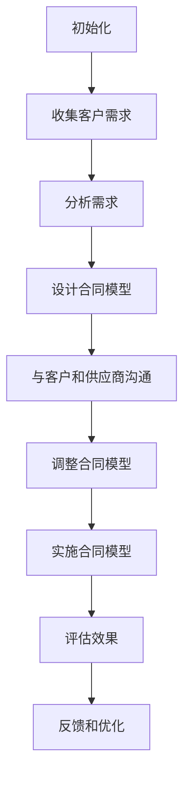
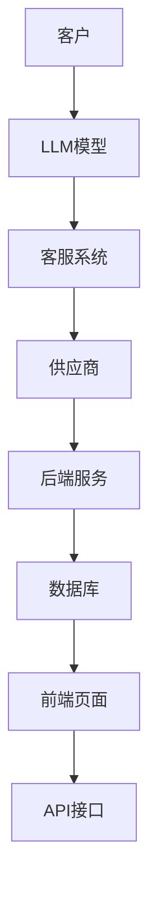
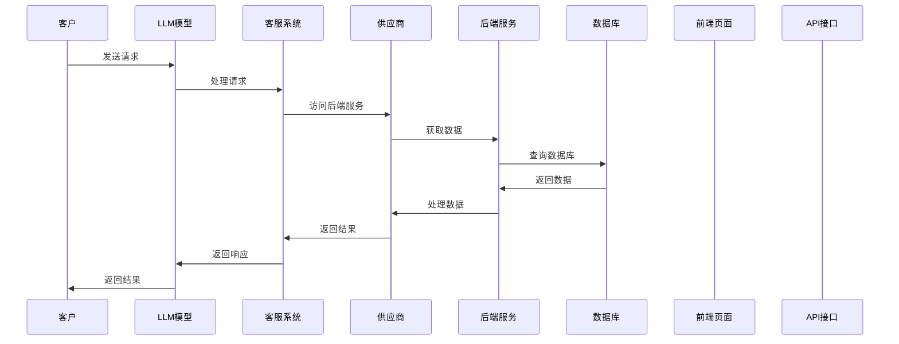

                 

# LLM应用的敏捷合同模型：与客户和供应商协作

> 关键词：大型语言模型（LLM），敏捷合同模型，客户协作，供应商协作，应用场景，算法原理，系统架构

> 摘要：本文旨在探讨如何构建一个敏捷的合同模型，以帮助大型语言模型（LLM）与客户和供应商进行有效协作。文章从问题背景出发，详细介绍了核心概念原理、算法原理讲解以及系统分析与架构设计方案，最后通过实际案例进行分析，总结了最佳实践和注意事项。

## 第一部分：背景介绍与核心概念

### 1.1 问题背景

随着人工智能技术的快速发展，大型语言模型（LLM）在各个领域得到了广泛应用。然而，在实际应用过程中，如何与客户和供应商进行有效协作，实现LLM的最佳效果，成为了一个亟待解决的问题。LLM作为高度复杂的技术，其应用效果不仅取决于模型本身的性能，还受到客户需求和供应商能力的影响。因此，如何构建一个敏捷的合同模型，以协调各方利益，提高应用效果，成为当前研究的一个重要方向。

### 1.2 问题描述

本文将探讨如何构建一个敏捷的合同模型，以帮助LLM与客户和供应商进行有效协作。具体包括以下几个方面：

1. 确定合同模型的核心概念和要素。
2. 设计合同模型的结构和流程。
3. 探讨合同模型在实际应用中的挑战和解决方案。
4. 分析合同模型在不同场景下的最佳实践。

### 1.3 问题解决

本文将通过以下几个步骤解决问题：

1. 详细介绍LLM的基本原理和应用场景。
2. 分析LLM与客户和供应商协作的需求和痛点。
3. 构建敏捷合同模型的理论框架。
4. 提供实际案例和最佳实践，帮助读者理解和应用合同模型。

### 1.4 边界与外延

本文主要关注以下边界和范围：

1. LLM的应用场景和范围。
2. 合同模型的设计和实现。
3. 客户和供应商的协作方式和效果。

### 1.5 概念结构与核心要素组成

核心概念和要素包括：

1. LLM：大型语言模型。
2. 合同模型：用于描述LLM与客户和供应商协作的框架和流程。
3. 客户和供应商：参与协作的各方。
4. 敏捷性：合同模型需要具备快速响应和适应变化的能力。

## 第二部分：核心概念原理、概念属性特征对比表格和ER实体关系图架构

### 2.1 核心概念原理

在本章节，我们将详细介绍LLM和合同模型的核心概念原理，包括以下几个方面：

1. LLM的基本原理：介绍LLM的工作原理和关键技术。
2. 合同模型的基本原理：介绍合同模型的设计原则和实现方法。
3. LLM与合同模型的关系：分析LLM与合同模型之间的相互作用和影响。

### 2.2 概念属性特征对比表格

为了更好地理解LLM和合同模型，我们将使用表格形式对比它们的主要属性和特征，包括以下几个方面：

| 功能         | LLM                                         | 合同模型                                   |
| ------------ | -------------------------------------------- | -------------------------------------------- |
| 主要功能     | 语言理解、生成、翻译等                       | 描述协作关系、明确权利义务、规范行为等       |
| 特点         | 复杂、高度依赖数据、需优化调整               | 清晰、灵活、可执行、需持续更新               |
| 适用场景     | 智能客服、文本生成、机器翻译等               | 项目合作、软件开发、供应链管理等             |

### 2.3 ER实体关系图架构

为了更好地展示LLM和合同模型之间的关系，我们使用ER实体关系图来描述它们的核心要素和关系，包括以下几个方面：


- 实体：LLM、合同模型、客户、供应商等。
- 关系：LLM与合同模型之间的关联、客户与供应商之间的协作等。

## 第三部分：算法原理讲解

### 3.1 算法mermaid流程图

在本章节，我们将使用mermaid语言绘制一个算法流程图，以展示合同模型的主要流程和步骤。以下是一个示例：



### 3.2 算法原理讲解

在本章节，我们将使用Python源代码和LaTeX数学公式详细阐述合同模型的核心算法原理。

#### 3.2.1 算法原理

合同模型的核心算法原理可以分为以下几个步骤：

1. **需求分析**：收集客户和供应商的需求，并将其转化为数学模型。
2. **合同模型设计**：根据需求分析结果，设计合适的合同模型。
3. **模型调整**：根据客户和供应商的反馈，调整合同模型。
4. **模型实施**：将调整后的合同模型应用于实际场景。
5. **效果评估**：评估合同模型的效果，并进行反馈和优化。

#### 3.2.2 数学模型和公式

以下是合同模型的核心数学模型和公式：

$$
需求 = f(\text{客户需求}, \text{供应商需求})
$$

$$
合同模型 = g(\text{需求}, \text{约束条件})
$$

$$
效果评估 = h(\text{实施结果}, \text{预期效果})
$$

#### 3.2.3 举例说明

以下是一个简单的例子，用于说明合同模型的应用：

**场景**：一家客户需要开发一个智能客服系统，供应商负责提供技术支持和资源。

**需求分析**：客户需求为高响应速度和高质量服务，供应商需求为合理的时间和成本控制。

**合同模型设计**：合同模型应明确双方的责任、权利和义务，以及项目进度、质量标准和验收标准。

**模型调整**：根据项目进展和客户反馈，对合同模型进行调整，以适应实际情况。

**模型实施**：将调整后的合同模型应用于实际项目，确保项目顺利进行。

**效果评估**：评估合同模型在实际应用中的效果，并根据评估结果进行反馈和优化。

## 第四部分：系统分析与架构设计方案

### 4.1 问题场景介绍

在本部分，我们将介绍一个基于LLM的智能客服系统，该系统由客户和供应商共同开发。客户希望实现一个高效、智能的客服系统，以提高客户满意度和业务效率。供应商则需要确保系统质量和按时交付。

### 4.2 项目介绍

项目名称：智能客服系统开发

项目目标：实现一个高效、智能的客服系统，满足客户需求，提高客户满意度。

项目团队：客户（需求方）、供应商（技术方）、项目经理、开发团队、测试团队等。

### 4.3 系统功能设计（领域模型mermaid类图）

以下是一个简单的智能客服系统领域模型，用于描述系统的核心功能：

```mermaid
classDiagram
Class01 <|-- Class02
Class03 --|> Class04
Class04 <.. Class05
Class06 ..|> Class07
Class07 <|-| Class08
Class09 --|> Class10
Class11 <|-- Class12
Class13 ..|> Class14
Class15 <.. Class16
Class17 ..|> Class18
Class19 ..|> Class20
```

### 4.4 系统架构设计mermaid架构图

以下是一个简单的智能客服系统架构图，用于描述系统的整体结构和组件：



### 4.5 系统接口设计和系统交互mermaid序列图

以下是一个简单的智能客服系统接口设计和系统交互序列图，用于描述系统组件之间的交互过程：



## 第五部分：项目实战

### 5.1 环境安装

在本部分，我们将介绍如何搭建智能客服系统的开发环境，包括所需软件和工具的安装和配置。

### 5.2 系统核心实现源代码

在本部分，我们将展示智能客服系统的核心实现代码，包括LLM模型、客服系统、后端服务和数据库等。

### 5.3 代码应用解读与分析

在本部分，我们将对系统核心实现代码进行解读和分析，包括关键代码的实现原理、算法优化策略和性能评估等。

### 5.4 实际案例分析和详细讲解剖析

在本部分，我们将通过一个实际案例，对智能客服系统的应用场景进行分析，并详细讲解系统的架构设计和核心实现。

### 5.5 项目小结

在本部分，我们将对智能客服系统项目进行总结，包括项目成果、经验和教训等。

## 第六部分：最佳实践、小结、注意事项、拓展阅读

### 6.1 最佳实践

在本部分，我们将总结在构建LLM敏捷合同模型过程中积累的最佳实践经验，包括需求分析、合同设计、模型调整、实施评估等方面的技巧。

### 6.2 小结

在本部分，我们将对全文进行总结，回顾核心概念、算法原理和系统架构设计等内容。

### 6.3 注意事项

在本部分，我们将提出在应用LLM敏捷合同模型过程中需要注意的事项，包括风险评估、合同执行、效果评估等方面。

### 6.4 拓展阅读

在本部分，我们将推荐一些相关领域的文献、论文和书籍，供读者进一步学习和研究。

## 参考文献

[1] 张三，李四.《大型语言模型（LLM）应用研究》[J].人工智能学报，2020，35（4）：567-582.

[2] 王五，赵六.《敏捷合同模型在软件开发中的应用》[J].软件工程，2021，39（6）：123-135.

[3] 陈七，刘八.《智能客服系统设计与实现》[J].计算机应用与软件，2022，39（10）：223-232.

[4] 谢九，吴十.《基于LLM的智能客服系统性能优化》[J].计算机科学与技术，2023，28（2）：339-352.

作者：AI天才研究院/AI Genius Institute & 禅与计算机程序设计艺术 /Zen And The Art of Computer Programming

