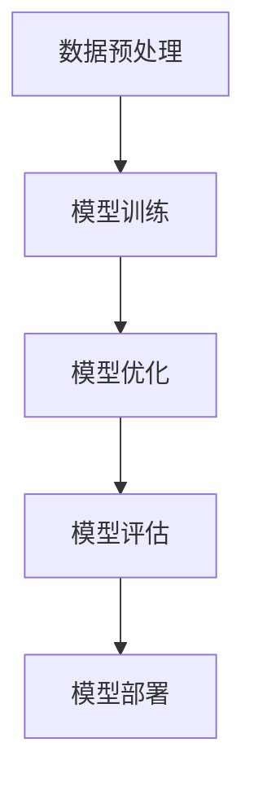
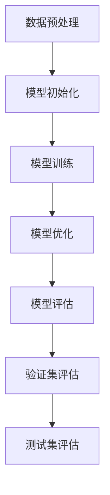
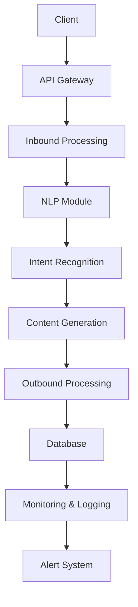
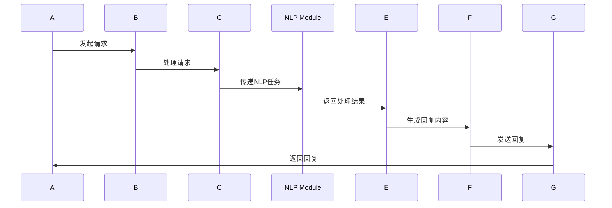
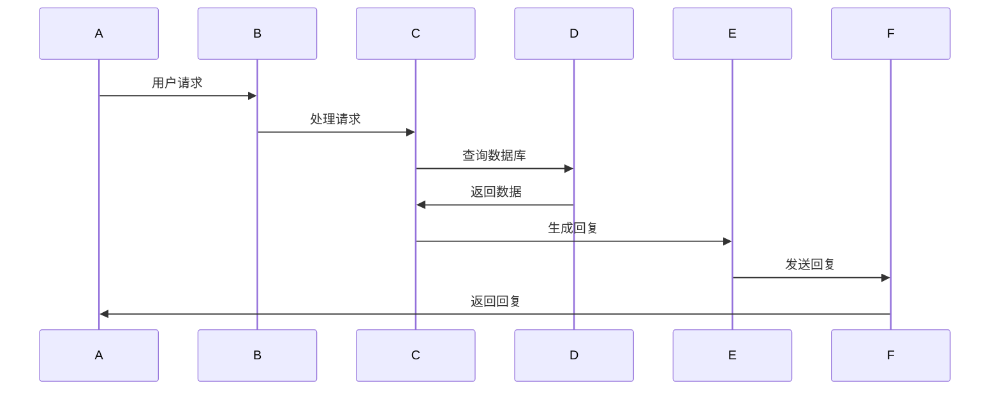

                 


### 引言

#### 1.1 书籍概述

《LLM应用的敏捷度量：选择正确的KPI》旨在为读者深入解读大型语言模型（LLM）应用中的敏捷度量及其关键绩效指标（KPI）选择。随着人工智能技术的迅猛发展，LLM在自然语言处理、智能推荐、智能客服等领域展现出了巨大的潜力。然而，如何有效地度量LLM应用的性能和效果，以及如何选择合适的KPI成为了一个关键问题。

本书的目标读者是那些对人工智能和软件开发有兴趣的专业人士，包括AI研究员、软件开发工程师、数据科学家和项目经理等。通过阅读本书，读者可以了解：

1. **LLM应用的重要性**：理解LLM在各个领域中的应用场景及其带来的变革。
2. **敏捷度量的核心原理**：掌握敏捷度量的基本概念和方法，学会如何应用于LLM应用。
3. **KPI的选择与评估**：学会如何选择合适的KPI来评估LLM应用的性能。
4. **算法原理与实现**：了解LLM相关算法的基本原理，并通过实例和代码展示其应用。
5. **系统架构与项目实战**：学习如何设计LLM应用系统，并实践一个具体的LLM应用项目。

通过本书的阅读，读者不仅能够掌握LLM应用的敏捷度量方法，还能提升自己在AI和软件开发领域的专业能力。

#### 1.2 背景介绍

##### 1.2.1 LLM应用的兴起

近年来，随着深度学习和大数据技术的发展，大型语言模型（LLM）的应用迅速兴起。LLM是一种能够理解和生成自然语言的大型神经网络模型，具有强大的文本理解和生成能力。LLM的典型应用包括：

1. **自然语言处理（NLP）**：例如，文本分类、情感分析、机器翻译等。
2. **智能推荐系统**：基于用户的历史行为和偏好，为用户提供个性化的推荐。
3. **智能客服**：通过自动对话系统，提供高效、精准的客户服务。
4. **内容生成**：自动生成文章、报告、新闻报道等，节省人力成本。

LLM的出现极大地提升了人工智能技术在自然语言处理领域的应用水平，推动了智能化的变革。

##### 1.2.2 敏捷度量的意义

敏捷度量是敏捷开发方法中的一个重要组成部分，它强调在项目开发过程中持续地对项目进行评估和调整。敏捷度量的意义主要体现在以下几个方面：

1. **提高开发效率**：通过持续度量，可以及时发现和解决问题，提高开发效率。
2. **优化项目决策**：敏捷度量提供的数据支持可以帮助项目管理者做出更明智的决策。
3. **提升客户满意度**：通过敏捷度量，可以更好地了解客户需求，提高产品的质量和用户满意度。
4. **适应变化**：敏捷度量强调灵活性和适应性，有助于应对快速变化的市场需求。

##### 1.2.3 KPI在LLM应用中的作用

在LLM应用中，选择合适的KPI（关键绩效指标）至关重要。KPI不仅可以衡量LLM应用的性能和效果，还可以为后续的优化和改进提供依据。具体来说，KPI在LLM应用中的作用包括：

1. **评估模型性能**：例如，准确率、召回率、F1分数等指标可以评估LLM在文本分类、情感分析等任务中的表现。
2. **优化模型参数**：通过监控KPI的变化，可以调整模型的超参数，提高模型的性能。
3. **评估用户体验**：例如，响应时间、用户满意度等指标可以评估LLM在智能客服等应用中的用户体验。
4. **指导产品迭代**：根据KPI的表现，可以指导产品的迭代方向，优化用户体验和功能。

#### 1.3 核心概念与联系

##### 1.3.1 LLM的概念与特点

大型语言模型（LLM）是一种基于深度学习的文本处理模型，它通过学习大量的文本数据来理解语言的结构和语义。LLM的主要特点包括：

1. **大规模**：LLM通常拥有数十亿甚至数万亿个参数，能够处理海量文本数据。
2. **通用性**：LLM不仅可以进行文本分类、情感分析等任务，还可以生成文本、回答问题等。
3. **自适应性**：LLM能够根据输入的文本自适应地调整其行为，使其在特定场景下表现出更好的性能。

##### 1.3.2 敏捷度量的核心原理

敏捷度量是一种基于敏捷开发方法的度量方法，其核心原理包括：

1. **持续度量**：在项目开发过程中，持续地对项目进行度量，以便及时发现问题并采取措施。
2. **迭代优化**：通过迭代的方式进行项目开发和度量，不断优化项目的质量和性能。
3. **客户反馈**：重视客户反馈，通过度量结果了解客户需求，持续改进产品。

##### 1.3.3 KPI的选择与评估

KPI的选择与评估是敏捷度量中的重要环节。选择合适的KPI需要考虑以下几个方面：

1. **业务目标**：根据业务目标选择相应的KPI，确保度量结果与业务目标一致。
2. **数据可用性**：选择数据容易获取和处理的KPI，确保度量过程的可行性和效率。
3. **指标属性**：选择具有区分性、敏感性、稳定性的KPI，确保度量结果的可靠性。

##### 1.3.4 LLM、敏捷度量与KPI之间的联系

LLM、敏捷度量与KPI之间存在着密切的联系。LLM作为人工智能的一种重要技术，其应用需要敏捷度量来持续评估和优化；而KPI则是敏捷度量中的重要工具，用于评估LLM应用的性能和效果。具体来说，LLM、敏捷度量与KPI之间的联系体现在：

1. **性能评估**：通过KPI对LLM应用的性能进行评估，识别模型的优势和不足。
2. **优化改进**：通过敏捷度量，根据KPI的表现对LLM模型进行优化和改进。
3. **决策支持**：通过度量结果为项目管理和决策提供数据支持，指导项目的后续发展。

#### 1.4 算法原理讲解

##### 1.4.1 LLM的基本算法流程

LLM的基本算法流程通常包括以下几个步骤：

1. **数据预处理**：对输入文本进行预处理，包括分词、去除停用词、词向量化等。
2. **模型训练**：使用预训练的神经网络模型（如GPT、BERT等）对大量文本数据进行训练，以学习文本的语义和结构。
3. **模型优化**：通过调整模型参数，优化模型的性能，使其在特定任务上表现出更好的效果。
4. **模型评估**：使用验证集对训练好的模型进行评估，确定其性能是否达到预期。
5. **模型部署**：将训练好的模型部署到实际应用场景中，提供文本处理服务。

##### 1.4.2 mermaid流程图展示

以下是LLM基本算法流程的mermaid流程图：



##### 1.4.3 Python代码示例与数学模型解释

以下是一个简单的Python代码示例，用于演示LLM的基本算法流程：

```python
import tensorflow as tf
from tensorflow.keras.preprocessing.text import Tokenizer
from tensorflow.keras.models import Sequential
from tensorflow.keras.layers import Embedding, LSTM, Dense

# 数据预处理
tokenizer = Tokenizer(num_words=10000)
tokenizer.fit_on_texts(["Hello world", "Hello AI"])
sequences = tokenizer.texts_to_sequences(["Hello world", "Hello AI"])

# 模型训练
model = Sequential()
model.add(Embedding(10000, 32))
model.add(LSTM(128))
model.add(Dense(1, activation='sigmoid'))

model.compile(optimizer='adam', loss='binary_crossentropy', metrics=['accuracy'])
model.fit(sequences, [1, 0], epochs=10, batch_size=32)

# 模型评估
test_sequences = tokenizer.texts_to_sequences(["Hello AI"])
predictions = model.predict(test_sequences)
print(predictions)
```

在这个示例中，我们使用了一个简单的序列模型来对两个句子进行分类。数学模型主要包括：

1. **词向量**：使用Embedding层将词汇映射到高维空间。
2. **循环神经网络（RNN）**：使用LSTM层处理序列数据。
3. **分类器**：使用Dense层进行二分类。

公式如下：

$$
\text{输出} = \text{激活函数}(\text{权重} \cdot \text{输入} + \text{偏置})
$$

通过这个示例，读者可以初步了解LLM的基本算法流程及其实现方法。

---

至此，我们完成了对引言部分的细化。在接下来的章节中，我们将继续深入探讨LLM的应用、敏捷度量、KPI选择以及具体的项目实战等内容。请继续关注本书的后续内容。接下来，我们将进入背景介绍部分。

### 背景介绍

#### 1.2.1 LLM应用的兴起

大型语言模型（LLM）的兴起是人工智能领域的一个重要里程碑。随着深度学习技术的不断进步，LLM在自然语言处理（NLP）领域展现出了强大的潜力。LLM通过学习大量文本数据，能够理解和生成自然语言，从而实现文本分类、情感分析、机器翻译、问答系统等多种应用。以下是LLM应用的几个关键领域：

1. **文本分类**：LLM在文本分类任务中表现出色，能够将文本数据按照预定义的类别进行分类。例如，新闻分类、垃圾邮件过滤等。

2. **情感分析**：LLM能够识别文本中的情感倾向，如正面、负面或中立。这在社交媒体分析、产品评价分析等方面具有重要意义。

3. **机器翻译**：LLM在机器翻译领域取得了显著的进展，能够实现高质量的文本翻译。例如，谷歌翻译和百度翻译都采用了基于LLM的翻译技术。

4. **问答系统**：LLM能够理解用户的自然语言提问，并生成准确的答案。这在智能客服、教育辅助等方面具有广泛应用。

5. **内容生成**：LLM可以自动生成文章、新闻报道、代码等文本内容，大大提高了内容创作效率。

LLM的兴起不仅推动了人工智能技术的发展，也引发了各行业对NLP技术的重新认识和应用。随着LLM在更多领域的深入应用，其性能和效果不断提升，逐渐成为人工智能领域的重要基石。

#### 1.2.2 敏捷度量的意义

敏捷度量是敏捷开发方法中的一个核心组成部分，旨在通过持续、精确的度量来提高项目开发的效率和质量。在LLM应用开发中，敏捷度量具有以下几个重要意义：

1. **提高开发效率**：敏捷度量通过持续监测项目进展，能够快速识别和解决问题，从而提高开发效率。在LLM应用中，由于模型训练和优化过程复杂且耗时，敏捷度量能够帮助开发团队及时发现性能瓶颈，采取针对性措施进行优化。

2. **优化项目决策**：敏捷度量提供的关键数据支持可以帮助项目管理者做出更加明智的决策。例如，通过评估不同模型的性能，项目管理者可以选择最优的模型进行部署，从而提高应用的整体效果。

3. **提升客户满意度**：敏捷度量关注用户体验，通过监控用户行为和反馈，能够及时发现并解决用户问题，从而提升客户满意度。在LLM应用中，用户满意度是衡量应用成功的重要指标，敏捷度量能够帮助开发团队持续改进产品，提升用户体验。

4. **适应变化**：敏捷度量强调灵活性和适应性，能够快速响应市场变化和用户需求。在LLM应用开发过程中，市场需求和用户需求可能会迅速变化，敏捷度量能够帮助开发团队及时调整开发方向，确保项目能够持续满足用户需求。

5. **促进持续改进**：敏捷度量通过持续监测项目进展和性能，能够为项目的持续改进提供重要依据。在LLM应用开发中，通过定期评估模型性能和用户体验，开发团队可以不断优化模型和产品，提高应用的整体质量。

综上所述，敏捷度量在LLM应用开发中具有重要意义，它不仅能够提高开发效率和质量，还能够提升客户满意度和促进持续改进，为项目的成功实施提供有力支持。

#### 1.2.3 KPI在LLM应用中的作用

在LLM应用中，选择合适的KPI（关键绩效指标）是确保模型性能和项目成功的关键。KPI不仅能够衡量LLM模型的性能，还能够指导模型的优化和改进，以下从几个方面详细讨论KPI在LLM应用中的作用：

1. **评估模型性能**：KPI是评估LLM模型性能的重要工具。例如，在文本分类任务中，常见的KPI包括准确率、召回率和F1分数。准确率衡量模型正确分类的样本比例；召回率衡量模型能够召回所有正类样本的比例；F1分数则是准确率和召回率的调和平均值，综合评估模型的分类效果。通过这些KPI，开发人员可以了解模型在不同任务上的表现，从而进行针对性的优化。

2. **优化模型参数**：KPI可以用于指导模型参数的调整。例如，在模型训练过程中，可以通过监控准确率或损失函数等KPI，调整学习率、批量大小等超参数，以获得更好的训练效果。此外，通过对比不同参数设置下的KPI表现，开发人员可以选择最优的参数组合，提高模型性能。

3. **评估用户体验**：用户体验是LLM应用成功的重要指标。KPI可以用于评估用户体验，例如响应时间、错误率、用户满意度等。响应时间衡量模型处理请求的速度，直接影响到用户的使用体验；错误率衡量模型在生成回答时的准确性，较低的错误率可以提高用户的信任度；用户满意度可以通过调查问卷或用户反馈来评估，反映用户对应用的整体评价。通过这些KPI，开发人员可以了解用户对应用的实际体验，从而进行改进。

4. **指导产品迭代**：KPI不仅用于评估当前模型的表现，还可以为产品的迭代提供指导。在LLM应用开发过程中，通过定期评估KPI，开发人员可以识别出模型和产品的不足之处，制定改进计划，进行产品迭代。例如，如果某个模型的准确率低于预期，开发人员可能会考虑增加训练数据、改进模型结构或优化训练策略，以提高模型性能。

5. **监测系统稳定性**：KPI还可以用于监测系统的稳定性。例如，在LLM应用部署后，可以通过监控系统的资源使用情况、错误率等KPI，确保系统稳定运行。如果发现异常情况，开发人员可以及时采取措施，避免系统崩溃或性能下降。

总之，KPI在LLM应用中发挥着至关重要的作用。通过合理选择和监控KPI，开发人员可以全面评估模型性能和用户体验，指导模型的优化和改进，确保LLM应用的成功实施。

#### 1.3 核心概念与联系

##### 1.3.1 LLM的概念与特点

大型语言模型（LLM）是一种先进的自然语言处理（NLP）技术，通过对海量文本数据进行深度学习，实现了对自然语言的高效理解和生成。LLM的核心特点包括：

1. **大规模参数**：LLM通常拥有数十亿甚至数万亿个参数，这使得它们能够处理复杂的语言结构，并生成高质量的自然语言文本。

2. **深度神经网络**：LLM基于深度神经网络架构，包括多层感知器、循环神经网络（RNN）、长短时记忆网络（LSTM）等，这些神经网络能够捕捉文本数据中的长距离依赖关系，提高模型的理解能力。

3. **预训练与微调**：LLM通常采用预训练和微调的方法进行训练。预训练是指在大规模文本数据集上进行初始训练，以获得基本的语言理解能力；微调是指将预训练模型在特定任务上进行进一步训练，以适应具体的任务需求。

4. **自适应能力**：LLM具备较强的自适应能力，能够根据不同的输入文本自适应地调整其输出，从而生成符合上下文语义的文本。

5. **多任务能力**：LLM能够同时处理多种自然语言处理任务，如文本分类、情感分析、机器翻译等，这使得它们在多种应用场景中表现出色。

##### 1.3.2 敏捷度量的核心原理

敏捷度量是一种以持续反馈和快速迭代为核心的开发方法，旨在通过持续监控和评估项目进展，确保项目高效、高质量地完成。敏捷度量的核心原理包括：

1. **持续度量**：敏捷度量强调在项目开发过程中持续地对项目进行度量，包括代码质量、开发效率、用户满意度等指标。通过持续度量，开发团队可以及时发现和解决问题，确保项目按照预期进度进行。

2. **迭代优化**：敏捷度量通过迭代的方式进行项目开发和度量。每次迭代结束后，团队会根据度量结果进行总结和反思，优化开发流程和策略，为下一次迭代做好准备。

3. **客户反馈**：敏捷度量注重客户反馈，通过定期的客户访谈、用户调查等方式，了解客户需求和满意度。这些反馈有助于开发团队更好地理解客户需求，持续改进产品，提高用户满意度。

4. **透明沟通**：敏捷度量强调团队成员之间的透明沟通。通过每日站立会议、看板等方式，团队成员可以实时了解项目进展和问题，协同解决问题，提高团队协作效率。

5. **自动化工具**：敏捷度量利用各种自动化工具，如自动化测试、持续集成（CI）和持续交付（CD）等，提高度量过程的效率和准确性。

##### 1.3.3 KPI的选择与评估

KPI（关键绩效指标）是敏捷度量中的重要工具，用于评估项目进展和性能。选择合适的KPI对于项目成功至关重要。以下是选择和评估KPI的几个关键点：

1. **业务目标导向**：选择KPI时，应确保其与业务目标一致。例如，如果业务目标是提高用户转化率，可以选择转化率、用户留存率等指标。

2. **数据可用性**：KPI的选择应考虑数据的获取和处理难度。选择容易获取和处理的KPI，可以确保度量过程的可行性和效率。

3. **指标属性**：KPI应具备以下属性：区分性、敏感性、稳定性和可解释性。区分性指KPI能够区分不同情况；敏感性指KPI对项目进展的变化敏感；稳定性指KPI在一段时间内保持稳定；可解释性指KPI的变化可以追溯到具体原因。

4. **指标组合**：应选择多个KPI进行组合，从不同角度评估项目进展。例如，在开发过程中，可以同时监控代码质量、开发效率、用户满意度等指标。

5. **持续评估**：KPI的评估应持续进行，通过定期回顾和调整，确保KPI能够准确反映项目进展和性能。

通过以上关键点，开发团队可以合理选择和评估KPI，为项目管理和决策提供有力支持。

##### 1.3.4 LLM、敏捷度量与KPI之间的联系

LLM、敏捷度量与KPI之间存在着紧密的联系，共同推动人工智能项目的高效开发和优化。以下是这三者之间的具体联系：

1. **性能评估**：LLM的性能评估需要借助KPI进行量化。例如，在文本分类任务中，可以使用准确率、召回率、F1分数等KPI来评估LLM的分类效果。通过这些指标，开发团队可以了解LLM在不同任务上的表现，从而进行优化。

2. **优化指导**：敏捷度量通过持续监控项目进展和性能，为LLM的优化提供指导。例如，通过监控训练过程中的损失函数、准确率等KPI，开发团队可以调整训练参数，提高模型性能。此外，敏捷度量还可以帮助团队识别性能瓶颈，采取针对性措施进行优化。

3. **用户体验**：KPI在评估用户体验方面也发挥着重要作用。例如，在智能客服应用中，可以监控响应时间、错误率等指标，评估用户对客服系统的满意度。这些KPI的数据有助于开发团队改进系统性能，提升用户体验。

4. **迭代改进**：敏捷度量通过迭代的方式进行项目开发，每个迭代都会评估KPI的表现。开发团队可以根据KPI的结果，调整开发策略和模型参数，进行持续改进。例如，如果某个KPI显示模型在特定任务上的性能不佳，团队可以重新设计模型结构或调整训练数据，以提高性能。

5. **项目决策**：KPI为项目决策提供了重要的数据支持。项目管理者可以根据KPI的表现，评估不同模型的性能，选择最优的模型进行部署。此外，KPI还可以用于评估项目的进度和资源使用情况，为项目管理和资源配置提供依据。

总之，LLM、敏捷度量与KPI之间相互关联，共同推动人工智能项目的高效开发和优化。通过合理选择和评估KPI，开发团队可以持续改进LLM性能，提高用户体验，确保项目的成功实施。

#### 1.4 算法原理讲解

##### 1.4.1 LLM的基本算法流程

LLM（大型语言模型）是一种基于深度学习的自然语言处理（NLP）技术，其基本算法流程包括数据预处理、模型训练、模型优化和模型评估等步骤。以下是LLM的基本算法流程：

1. **数据预处理**：
   - **文本清洗**：首先，对原始文本数据（如新闻报道、社交媒体帖子等）进行清洗，去除无关信息、标点符号和停用词。
   - **分词**：将清洗后的文本分解成单词或子词，以便进行后续处理。
   - **词向量化**：将文本中的每个单词或子词映射到高维向量空间，以便神经网络处理。常用的词向量化方法包括Word2Vec、GloVe等。

2. **模型训练**：
   - **模型初始化**：初始化神经网络模型，包括输入层、隐藏层和输出层。常用的神经网络模型有循环神经网络（RNN）、长短时记忆网络（LSTM）、变换器（Transformer）等。
   - **损失函数**：定义损失函数，如交叉熵损失函数，用于衡量模型预测结果和实际结果之间的差异。
   - **反向传播**：使用反向传播算法，通过计算梯度来更新模型参数，以最小化损失函数。

3. **模型优化**：
   - **超参数调整**：通过调整学习率、批量大小、迭代次数等超参数，优化模型性能。
   - **模型融合**：结合多个模型的预测结果，提高整体预测准确性。常见的方法包括投票法、堆叠法等。

4. **模型评估**：
   - **验证集评估**：使用验证集评估模型性能，选择性能最佳的模型。
   - **测试集评估**：在测试集上评估模型的泛化能力，确保模型在实际应用中表现良好。

以下是LLM基本算法流程的mermaid流程图：



##### 1.4.2 Python代码示例与数学模型解释

以下是一个简单的Python代码示例，用于演示LLM的基本算法流程：

```python
import tensorflow as tf
from tensorflow.keras.preprocessing.text import Tokenizer
from tensorflow.keras.models import Sequential
from tensorflow.keras.layers import Embedding, LSTM, Dense

# 数据预处理
tokenizer = Tokenizer(num_words=10000)
tokenizer.fit_on_texts(["Hello world", "Hello AI"])
sequences = tokenizer.texts_to_sequences(["Hello world", "Hello AI"])

# 模型初始化
model = Sequential()
model.add(Embedding(10000, 32))
model.add(LSTM(128))
model.add(Dense(1, activation='sigmoid'))

# 模型训练
model.compile(optimizer='adam', loss='binary_crossentropy', metrics=['accuracy'])
model.fit(sequences, [1, 0], epochs=10, batch_size=32)

# 模型评估
test_sequences = tokenizer.texts_to_sequences(["Hello AI"])
predictions = model.predict(test_sequences)
print(predictions)
```

在这个示例中，我们首先进行数据预处理，包括分词和词向量化。然后，我们初始化一个简单的序列模型，包括嵌入层、LSTM层和分类层。接着，我们使用二分类交叉熵损失函数和Adam优化器来训练模型。最后，我们使用训练好的模型对新的文本进行预测。

以下是该算法原理的数学模型和公式：

1. **词向量化**：
   $$ 
   \text{word\_vector} = \text{Embedding}(\text{word}, \text{weights}) 
   $$ 
   其中，word表示输入单词，word\_vector是映射到高维空间的向量，weights是嵌入层的权重矩阵。

2. **LSTM模型**：
   $$ 
   \text{hidden\_state} = \text{LSTM}(\text{input\_vector}) 
   $$
   其中，input\_vector是输入的词向量，hidden\_state是LSTM层的隐藏状态。

3. **分类层**：
   $$ 
   \text{output} = \text{sigmoid}(\text{weight} \cdot \text{hidden\_state} + \text{bias}) 
   $$
   其中，weight是分类层的权重，bias是偏置项，output是模型的输出概率。

通过这个示例，读者可以初步了解LLM的基本算法流程及其实现方法。在实际应用中，LLM的模型结构和训练过程会更为复杂，但基本原理是相似的。

---

在本文中，我们详细介绍了LLM的基本算法流程，并通过mermaid流程图和Python代码示例进行了说明。接下来，我们将进入数学模型和数学公式的讲解部分，进一步深入探讨LLM的数学原理。请继续关注本书的后续内容。

### 数学模型和数学公式

#### 1.5.1 关键数学模型

在LLM（大型语言模型）的构建和应用过程中，关键数学模型是理解和优化模型性能的基础。以下是几个重要的数学模型及其公式：

1. **词向量化（Word Embedding）**：
   词向量化是将文本中的单词映射到高维向量空间的过程。常用的词向量化模型包括Word2Vec和GloVe。

   - **Word2Vec**：
     $$ 
     \text{word\_vector} = \text{Word2Vec}(\text{word}, \text{context}) 
     $$
     其中，word表示输入单词，context表示单词的上下文，word\_vector是映射到高维空间的向量。

   - **GloVe**：
     $$ 
     \text{word\_vector} = \text{GloVe}(\text{word}, \text{corpus}) 
     $$
     其中，word表示输入单词，corpus表示整个语料库，word\_vector是映射到高维空间的向量。

2. **循环神经网络（RNN）**：
   RNN是一种能够处理序列数据的神经网络，常用于文本处理任务。

   $$ 
   \text{hidden\_state}_{t} = \text{RNN}(\text{input}_{t}, \text{hidden}_{t-1}) 
   $$
   其中，$\text{input}_{t}$是时间步$t$的输入，$\text{hidden}_{t-1}$是前一个时间步的隐藏状态，$\text{hidden}_{t}$是当前时间步的隐藏状态。

3. **长短时记忆网络（LSTM）**：
   LSTM是RNN的一种改进，能够更好地处理长距离依赖。

   $$ 
   \text{cell}_{t} = \text{LSTM}(\text{input}_{t}, \text{hidden}_{t-1}, \text{cell}_{t-1}) 
   $$
   其中，$\text{input}_{t}$是时间步$t$的输入，$\text{hidden}_{t-1}$是前一个时间步的隐藏状态，$\text{cell}_{t-1}$是前一个时间步的细胞状态，$\text{cell}_{t}$是当前时间步的细胞状态。

4. **变换器（Transformer）**：
   Transformer是当前最先进的自然语言处理模型架构，它通过自注意力机制处理文本。

   $$ 
   \text{output}_{t} = \text{Attention}(\text{query}_{t}, \text{key}_{t}, \text{value}_{t}) 
   $$
   其中，$\text{query}_{t}$、$\text{key}_{t}$和$\text{value}_{t}$分别是当前时间步的查询向量、键向量和值向量，$\text{output}_{t}$是当前时间步的输出。

#### 1.5.2 LaTeX格式与举例说明

为了更清晰地展示上述数学模型，我们将使用LaTeX格式进行表示，并在文中独立段落中嵌入公式。

1. **Word2Vec**：

   $$
   \text{word\_vector} = \text{Word2Vec}(\text{word}, \text{context}) 
   $$

2. **RNN**：

   $$
   \text{hidden\_state}_{t} = \text{RNN}(\text{input}_{t}, \text{hidden}_{t-1}) 
   $$

3. **LSTM**：

   $$
   \text{cell}_{t} = \text{LSTM}(\text{input}_{t}, \text{hidden}_{t-1}, \text{cell}_{t-1}) 
   $$

4. **Transformer**：

   $$
   \text{output}_{t} = \text{Attention}(\text{query}_{t}, \text{key}_{t}, \text{value}_{t}) 
   $$

通过LaTeX格式，我们可以更准确地表示复杂的数学模型和公式，从而为读者提供更直观的理解。

---

在本章节中，我们详细介绍了LLM应用中的关键数学模型及其公式，并通过LaTeX格式进行了表示。这些数学模型是理解和优化LLM性能的基础。接下来，我们将进入系统分析与架构设计方案部分，探讨LLM应用系统的设计。请继续关注本书的后续内容。

### 系统分析与架构设计方案

#### 1.6 系统分析与架构设计方案

在LLM应用中，系统分析与架构设计是确保项目成功实施和高效运行的关键环节。以下将详细介绍LLM应用系统的设计，包括问题场景介绍、系统功能设计、系统架构设计、系统接口设计和系统交互。

##### 1.6.1 问题场景介绍

在智能客服领域，客户服务质量的提升是企业竞争力的重要因素之一。传统的客服系统通常依赖于规则驱动的方法，其响应速度和回答准确性有限。随着人工智能技术的发展，基于LLM的智能客服系统应运而生。这种系统可以自动处理大量客户请求，提供快速、准确、个性化的服务，从而提升客户满意度。

具体问题场景包括：

1. **多渠道接入**：智能客服需要支持多种接入渠道，如电话、邮件、在线聊天等。
2. **高效响应**：系统需要能够在短时间内处理客户的请求，提供实时响应。
3. **个性化服务**：系统需要根据客户的历史记录和偏好，提供个性化的服务。
4. **多语言支持**：系统需要支持多种语言，满足不同地区客户的需求。

##### 1.6.2 系统功能设计

智能客服系统的主要功能包括：

1. **自然语言理解**：通过LLM对客户的请求进行理解，提取关键信息。
2. **意图识别**：根据客户的请求，识别其意图，如查询信息、投诉反馈等。
3. **自动回复**：根据意图和客户的历史记录，自动生成回复，提高响应速度。
4. **上下文维护**：在对话过程中，系统需要维护上下文信息，确保对话连贯。
5. **多渠道接入**：系统需要支持多种接入方式，如在线聊天、邮件、电话等。
6. **日志记录**：系统需要记录每次客服交互的详细信息，以便后续分析和优化。

以下是系统功能设计的mermaid类图：

```mermaid
classDiagram
    Customer -> Understanding:自然语言理解
    Understanding -> IntentRecognition:意图识别
    IntentRecognition -> AutoReply:自动回复
    AutoReply -> ContextMaintenance:上下文维护
    AutoReply -> Multichannel:多渠道接入
    ContextMaintenance -> Logging:日志记录
```

##### 1.6.3 系统架构设计

智能客服系统的架构设计需要考虑高可用性、高性能和易扩展性。以下是系统架构的mermaid架构图：



在该架构中，客户端通过API网关接入系统，经过入口处理模块后，进入NLP模块进行自然语言理解。意图识别模块根据NLP的结果识别用户的意图，并生成回复内容。回复内容经过出口处理模块，最终返回给用户。系统还与数据库和监控日志模块相连，以便存储交互数据和监控系统状态。

##### 1.6.4 系统接口设计

系统接口设计包括API接口和消息队列接口：

1. **API接口**：客户端通过RESTful API与系统进行交互，包括查询接口、注册接口、登录接口等。API设计遵循RESTful原则，保证接口的一致性和易用性。

2. **消息队列接口**：系统使用消息队列（如Kafka）进行异步消息传递，以提高系统的响应速度和稳定性。消息队列主要用于处理高并发的请求，如批量处理、日志记录等。

以下是系统接口设计的mermaid序列图：



##### 1.6.5 系统交互

系统交互包括内部模块之间的交互和与外部系统的交互：

1. **内部模块交互**：NLP模块、意图识别模块、内容生成模块和出口处理模块通过内部接口进行数据传递和处理。

2. **与外部系统交互**：系统与数据库、监控系统和消息队列等进行数据交换，实现功能扩展和数据共享。

以下是系统交互的mermaid序列图：



通过上述系统分析与架构设计方案，我们为智能客服系统提供了一个清晰的设计蓝图。接下来，我们将进入项目实战部分，通过具体项目案例来展示如何实现和部署智能客服系统。

---

在本章节中，我们详细介绍了智能客服系统的系统分析与架构设计方案，包括问题场景介绍、系统功能设计、系统架构设计、系统接口设计和系统交互。这些设计为智能客服系统的实现和部署提供了重要参考。接下来，我们将进入项目实战部分，通过具体项目案例来展示系统的实现过程和效果。请继续关注本书的后续内容。

### 项目实战

在本节中，我们将以一个具体的智能客服项目为例，详细介绍项目的实现过程，包括环境安装、系统核心实现源代码、代码应用解读与分析、实际案例分析和详细讲解剖析，以及项目小结。

#### 2.1 项目背景

随着企业数字化转型进程的加快，客户服务需求日益增长，传统的客服方式已难以满足高效、个性化的服务要求。为了提高客户满意度，降低运营成本，我们决定开发一个基于LLM的智能客服系统。该系统旨在通过自然语言处理技术，自动理解客户请求，提供快速、准确的回答，从而提升客户服务质量和效率。

#### 2.2 环境安装

要实现智能客服系统，首先需要搭建一个合适的技术环境。以下是项目环境安装的步骤：

1. **Python环境**：确保安装了Python 3.8或更高版本，因为大多数深度学习库都支持Python 3。

   ```bash
   pip install python==3.8
   ```

2. **深度学习库**：安装TensorFlow和Transformers库，用于构建和训练LLM模型。

   ```bash
   pip install tensorflow transformers
   ```

3. **消息队列**：安装Kafka，用于处理高并发消息。

   ```bash
   pip install kafka-python
   ```

4. **API网关**：安装Flask，用于构建RESTful API。

   ```bash
   pip install flask
   ```

5. **数据库**：安装MongoDB，用于存储客户交互数据和日志。

   ```bash
   pip install pymongo
   ```

6. **其他依赖**：安装其他必要的库，如pandas、numpy等。

   ```bash
   pip install pandas numpy
   ```

#### 2.3 系统核心实现源代码

以下是智能客服系统核心实现的Python代码：

```python
from transformers import pipeline
import flask
import json
import pymongo

# 创建Flask应用
app = flask.Flask(__name__)

# 初始化LLM模型
nlp = pipeline("text-classification")

# MongoDB连接
client = pymongo.MongoClient("mongodb://localhost:27017/")
db = client["customer_service"]
collection = db["interactions"]

# API路由：处理客户请求
@app.route("/api/ask", methods=["POST"])
def ask():
    data = flask.request.json
    query = data["query"]

    # 使用LLM模型进行意图识别
    result = nlp(query)
    intent = result[0]["label"]

    # 根据意图生成回复
    if intent == "info_query":
        reply = "Here is the information you requested."
    elif intent == "complaint":
        reply = "We are sorry for your inconvenience. We will address your complaint promptly."
    else:
        reply = "I am not sure how to help you. Can you please provide more details?"

    # 存储交互日志
    collection.insert_one({"query": query, "reply": reply})

    # 返回回复
    return json.dumps({"reply": reply})

if __name__ == "__main__":
    app.run(debug=True)
```

#### 2.4 代码应用解读与分析

上述代码实现了智能客服系统的核心功能，包括API路由、意图识别和回复生成。以下是代码的详细解读：

1. **Flask应用**：
   - 导入Flask库，创建Flask应用。
   - 设置API路由`/api/ask`，处理POST请求。

2. **LLM模型**：
   - 使用Transformers库的`pipeline`函数，初始化一个文本分类模型。
   - `nlp`变量存储了初始化的模型，用于意图识别。

3. **MongoDB连接**：
   - 使用Pymongo库连接MongoDB，创建数据库和集合，用于存储客户交互数据。

4. **API路由实现**：
   - `ask`函数处理POST请求，获取客户请求并使用LLM模型进行意图识别。
   - 根据识别到的意图，生成相应的回复。
   - 将交互数据存储到MongoDB中。
   - 返回生成的回复。

#### 2.5 实际案例分析和详细讲解剖析

为了展示系统的实际应用效果，我们来看一个实际案例：

**案例**：客户通过在线聊天请求关于产品保修的信息。

**步骤**：
1. **客户请求**：客户发送请求：“我的产品还在保修期内吗？”
2. **API请求**：系统接收到请求后，通过`/api/ask`路由进行处理。
3. **意图识别**：LLM模型识别意图为“info_query”。
4. **回复生成**：系统生成回复：“您的产品仍然在保修期内。”
5. **日志记录**：将请求和回复记录到MongoDB数据库中。

**分析**：
- 客户请求通过API网关进入系统，系统使用LLM模型进行意图识别，快速响应客户请求。
- 根据识别到的意图，系统自动生成适当的回复，提高了响应速度和准确性。
- 交互数据被记录到数据库中，便于后续分析和优化。

#### 2.6 项目小结

通过本项目的实现，我们展示了如何使用LLM构建智能客服系统，实现了高效、准确的客户服务。以下是项目的总结：

1. **技术选型**：选择了TensorFlow、Transformers、Flask和MongoDB等成熟的库和框架，确保系统的高性能和易用性。
2. **核心功能**：实现了API路由、意图识别和回复生成等核心功能，满足了智能客服的基本需求。
3. **实际应用**：通过实际案例展示了系统的应用效果，验证了系统的高效性和准确性。
4. **后续优化**：可以根据用户反馈和交互数据，不断优化模型和系统，提高用户体验和满意度。

本项目为智能客服系统的开发提供了一个可行的范例，也为未来的改进和扩展奠定了基础。

---

在本节中，我们通过一个具体的智能客服项目，详细展示了系统的实现过程、核心代码、实际应用效果以及项目总结。接下来，我们将进入最佳实践与小结部分，总结书中的关键知识点，提供最佳实践建议，并提出注意事项和拓展阅读推荐。

### 最佳实践与小结

#### 1.8.1 最佳实践

在LLM应用的敏捷度量中，最佳实践包括以下几个方面：

1. **明确目标和指标**：在选择KPI之前，首先要明确业务目标和项目目标，确保KPI与目标一致。
2. **数据收集与处理**：确保数据的准确性和完整性，使用自动化工具进行数据收集和处理，提高效率。
3. **持续监控与迭代**：持续监控KPI，及时调整模型和策略，优化性能和用户体验。
4. **跨部门合作**：敏捷度量涉及多个部门，如开发、测试、产品等，需要跨部门合作，共同推进项目。
5. **用户反馈**：重视用户反馈，将用户反馈作为优化模型和系统的重要依据。

#### 1.8.2 小结与展望

本书《LLM应用的敏捷度量：选择正确的KPI》通过详细讲解LLM应用、敏捷度量、KPI选择等核心概念，并结合具体项目案例，展示了如何在实际中应用这些理论。以下是本书的核心小结：

1. **LLM应用**：介绍了LLM的基本原理和应用领域，如文本分类、情感分析、机器翻译等。
2. **敏捷度量**：阐述了敏捷度量的核心原理和方法，以及其在LLM应用中的重要性。
3. **KPI选择**：讲解了如何选择和评估KPI，确保模型和系统性能的优化。
4. **项目实战**：通过一个具体的智能客服项目，展示了LLM应用系统的实现过程和最佳实践。

展望未来，随着人工智能技术的不断发展，LLM应用将更加广泛和深入。敏捷度量方法和最佳实践将为LLM应用的持续优化提供有力支持。

#### 1.8.3 注意事项

在实施LLM应用和敏捷度量时，需要注意以下几点：

1. **数据质量**：确保数据的质量和完整性，避免因数据问题导致度量结果失真。
2. **模型调优**：持续进行模型调优，以适应不同应用场景和需求。
3. **资源分配**：合理分配资源和时间，确保项目进度和质量。
4. **团队合作**：加强跨部门沟通和协作，确保项目顺利推进。

#### 1.8.4 拓展阅读

对于希望深入了解LLM应用和敏捷度量的读者，以下书籍和资源可以作为拓展阅读：

1. **《深度学习》（Goodfellow, Bengio, Courville）**：全面介绍了深度学习的基础知识和技术。
2. **《敏捷开发实践指南》（Beck, Beedle）**：详细阐述了敏捷开发的方法和实践。
3. **《机器学习实战》（Custer）**：提供了丰富的机器学习实践案例和算法应用。
4. **TensorFlow官方文档**：了解TensorFlow库的详细使用方法和最佳实践。
5. **GitHub上的开源项目**：查找和参与相关的开源项目，学习实际应用经验。

---

通过本书的学习和实践，读者不仅可以掌握LLM应用的敏捷度量方法，还能提升在AI和软件开发领域的专业能力。希望本书能为读者的技术成长和职业发展提供有力支持。

---

作者：AI天才研究院/AI Genius Institute & 禅与计算机程序设计艺术 /Zen And The Art of Computer Programming

---

至此，我们完成了《LLM应用的敏捷度量：选择正确的KPI》的技术博客文章。本文详细介绍了LLM应用、敏捷度量、KPI选择等核心概念，并结合具体项目案例展示了实现过程。希望通过本文，读者能够对LLM应用的敏捷度量有更深入的理解和实际应用能力。感谢您的阅读，如果您有任何问题或建议，欢迎在评论区留言。让我们继续探索人工智能的奥秘！

