                 

## 文章标题：LLM应用的敏捷治理：在灵活性和控制之间找平衡

### 关键词：
- **LLM应用**、**敏捷治理**、**灵活性与控制**、**数据安全与隐私**、**模型偏差与伦理问题**、**法律合规性**

### 摘要：
本文旨在探讨在LLM（大型语言模型）应用中实现敏捷治理的重要性及其挑战。我们将深入分析LLM应用的现状与挑战，介绍敏捷治理的概念、优势及其与传统治理方法的比较。通过详细阐述敏捷治理的核心概念与理论基础，本文将逐步展示如何通过敏捷治理实现灵活性和控制的平衡。案例分析与应用场景部分将提供实际操作示例，最后，我们将总结敏捷治理的关键成功因素，并对未来的研究方向提出建议。## 第一部分：引言与背景

### 第1章：LLM应用的现状与挑战

#### 1.1 LLM应用的发展历程

LLM（大型语言模型）作为一种前沿的AI技术，其发展历程可谓是一波三折。最早的LLM可以追溯到2000年代初，当时的一些小型模型已经开始展现强大的文本处理能力。然而，随着计算能力的提升和算法的进步，LLM的规模和性能都得到了飞速的发展。

GPT-3的出现无疑是LLM发展史上的一个重要里程碑。OpenAI在2020年发布的GPT-3，拥有1750亿个参数，能够生成高质量的自然语言文本，这一成果引起了广泛关注。GPT-3的成功不仅在于其庞大的规模，更在于其优秀的生成能力，这使得LLM在各个领域都得到了广泛的应用。

自从GPT-3以来，LLM的应用场景不断拓展。从最初的自然语言生成，到现在的文本分类、问答系统、智能客服、内容审核等，LLM已经成为了AI领域的重要组成部分。

#### 1.2 LLM应用中的治理挑战

随着LLM应用的普及，治理问题也日益突出。以下是几个主要的治理挑战：

##### 1.2.1 数据安全与隐私

LLM的训练和部署需要大量的数据，而这些数据往往涉及到用户的隐私信息。如何确保数据的安全和用户隐私的保护成为了亟待解决的问题。例如，在社交媒体内容审核中，需要处理大量的用户生成内容，这些内容可能包含敏感信息，如个人信息、位置信息、政治观点等。如果这些数据泄露，可能会导致严重的隐私侵犯和法律责任。

##### 1.2.2 模型偏差与伦理问题

LLM在训练过程中，可能会学习到数据中的偏差和偏见，从而产生不公平或歧视性的输出。例如，某些LLM在处理性别或种族问题时，可能会展现出明显的偏见。这不仅会损害模型的声誉，还可能引发社会问题和法律纠纷。

##### 1.2.3 法律合规性

不同国家和地区对于数据隐私、知识产权、公平性等方面的法律规定有所不同，这使得LLM在全球化应用中面临巨大的法律合规性挑战。例如，欧盟的GDPR（通用数据保护条例）对于数据隐私保护的规定非常严格，如果LLM应用在欧盟地区运营，需要严格遵守这些规定。

#### 1.3 敏捷治理的概念与优势

敏捷治理是一种在快速变化的环境中，通过灵活的决策和高效的执行来管理复杂系统的策略。它强调持续迭代、快速反馈和灵活调整，以应对不断变化的外部环境和内部需求。

在LLM应用中，敏捷治理的优势主要体现在以下几个方面：

##### 1.3.1 灵活性

LLM应用的环境变化快速，需求也经常调整。敏捷治理能够快速响应这些变化，确保模型能够及时适应新的需求和环境。

##### 1.3.2 控制性

敏捷治理通过严格的流程控制和持续监控，确保模型的安全、可靠和合规。这有助于减少模型偏差和伦理问题的发生，提高模型的品质和用户体验。

##### 1.3.3 效率

敏捷治理通过迭代开发和快速反馈，能够显著提高开发效率，缩短产品上市时间。

#### 1.4 敏捷治理与传统治理的比较

传统治理模式通常是基于严格的计划和控制，强调预先定义的流程和标准。这种方法在稳定的环境下非常有效，但在快速变化的环境中，往往难以适应。

相比之下，敏捷治理更加强调灵活性和适应性。它通过持续的迭代和反馈，能够快速调整和优化模型，以适应不断变化的需求和环境。

##### 1.4.1 决策速度

传统治理模式通常需要经过复杂的审批流程，决策速度较慢。而敏捷治理通过简化的流程和更快的决策机制，能够更迅速地响应变化。

##### 1.4.2 风险控制

传统治理模式通常采用预防性的风险控制措施，例如严格的审查和监控。而敏捷治理则更加强调持续的风险监测和快速应对。

##### 1.4.3 团队协作

传统治理模式通常强调垂直管理，而敏捷治理则更加注重跨职能团队的协作和沟通，以提高整体效率和创新能力。

### 总结

LLM应用的普及带来了巨大的机遇，但同时也伴随着诸多治理挑战。敏捷治理作为一种能够灵活应对快速变化环境的方法，为LLM应用提供了有效的治理策略。在接下来的章节中，我们将深入探讨LLM的基本原理、敏捷治理的理论框架以及具体的实践方法。## 第二部分：核心概念与基础理论

### 第2章：核心概念与基础理论

#### 2.1 LLM的基本原理

LLM（大型语言模型）的核心原理是基于深度学习和自然语言处理技术。深度学习通过神经网络模型，从大量数据中学习特征和模式，而自然语言处理则专注于理解和生成自然语言。

##### 2.1.1 神经网络与深度学习

神经网络是一种模仿人脑神经元连接方式的计算模型。深度学习则是通过多层神经网络来提取数据的复杂特征。在LLM中，常用的神经网络结构包括卷积神经网络（CNN）和递归神经网络（RNN），特别是其变种LSTM（长短期记忆网络）和Transformer。

**Mermaid 流程图：**
```
graph LR
A[神经网络] --> B[深度学习]
B --> C{卷积神经网络}
C --> D[卷积神经网络(CNN)]
C --> E[递归神经网络]
E --> F[长短期记忆网络(LSTM)]
E --> G[Transformer]
```

##### 2.1.2 自然语言处理的基本概念

自然语言处理（NLP）是人工智能领域的一个分支，旨在使计算机能够理解、生成和处理自然语言。NLP的关键概念包括：

- **词嵌入（Word Embedding）**：将单词映射到高维空间中的向量，以捕捉单词的语义信息。
- **词性标注（Part-of-Speech Tagging）**：为单词赋予语法属性，如名词、动词等。
- **命名实体识别（Named Entity Recognition）**：识别文本中的特定实体，如人名、地名、组织名等。
- **句法分析（Syntactic Parsing）**：分析句子的结构，包括短语结构规则和句法树。

**Mermaid 类图：**
```
classDiagram
Class NLP {
  +string text
  +vector[] embeddings
  +pos[] tags
  +NER[] entities
  +parseTree tree
}
Class WordEmbedding {
  +vector embedding
}
Class PartOfSpeech {
  +string type
}
Class NamedEntity {
  +string name
  +string type
}
Class ParseTree {
  +Node root
}
NLP "uses" WordEmbedding
NLP "uses" PartOfSpeech
NLP "uses" NamedEntity
NLP "uses" ParseTree
```

##### 2.1.3 LLM的工作原理

LLM通过大规模的预训练和微调来学习语言的模式和规律。预训练阶段，模型在大规模文本数据上进行训练，学习单词、短语和句子的表示。微调阶段，模型在特定任务的数据上进行调整，以适应特定的应用场景。

**Mermaid 流程图：**
```
graph LR
A[文本数据] --> B[预训练]
B --> C[大规模数据集]
C --> D[模型参数初始化]
D --> E[反向传播]
E --> F[优化算法]
F --> G[预训练模型]
G --> H[微调数据]
H --> I[微调模型参数]
I --> J[任务特定模型]
```

#### 2.2 敏捷治理的理论框架

敏捷治理的理论框架建立在敏捷开发方法之上，强调快速迭代、持续改进和团队合作。以下是敏捷治理的核心理念、基本原则和方法：

##### 2.2.1 敏捷治理的核心理念

- **客户价值**：以客户需求为导向，确保模型能够提供价值。
- **迭代开发**：通过短期迭代周期，快速交付可用的产品或功能。
- **持续交付**：持续集成和持续交付，确保模型可以快速部署和更新。
- **反馈循环**：通过用户反馈，不断优化模型性能和用户体验。

##### 2.2.2 敏捷治理的基本原则

- **透明度**：所有团队成员都能清晰了解项目的进展和问题。
- **灵活性**：能够快速响应变化，调整计划。
- **团队合作**：跨职能团队协同工作，提高效率。
- **质量优先**：确保模型的质量和可靠性。

##### 2.2.3 敏捷治理的方法与实践

- **Scrum**：一个流行的敏捷框架，强调短周期迭代和每日站会。
- **Kanban**：通过可视化工作流程，实现持续交付和持续改进。
- **持续集成与持续交付（CI/CD）**：自动化测试和部署流程，确保模型的高质量和快速迭代。

**Mermaid 流程图：**
```
graph LR
A[项目开始] --> B[Scrum迭代]
B --> C{每日站会}
C --> D[迭代交付]
D --> E{用户反馈}
E --> F[迭代优化]
F --> G{模型更新}
G --> H[持续交付]
```

#### 2.3 LLM应用中的关键问题

在LLM应用中，以下几个关键问题需要特别关注：

##### 2.3.1 模型的定制与优化

根据不同的应用场景，LLM需要通过定制和优化来提高性能。这包括调整模型架构、优化参数设置和训练策略等。

**Mermaid 流程图：**
```
graph LR
A[需求分析] --> B[模型定制]
B --> C{架构调整}
C --> D{参数优化}
D --> E{训练策略调整}
```

##### 2.3.2 模型的部署与维护

部署LLM模型是一个复杂的过程，需要考虑模型的大小、计算资源的需求、安全性和稳定性等因素。部署后，还需要定期维护和更新模型，以确保其性能和安全性。

**Mermaid 流程图：**
```
graph LR
A[模型部署] --> B{计算资源需求}
B --> C{安全性考虑}
C --> D{稳定性保障}
D --> E{模型更新}
```

##### 2.3.3 模型的监控与评估

模型部署后，需要对其进行持续监控和评估，以确保其性能和可靠性。这包括监控模型的输入输出、性能指标、错误率等，并根据反馈进行优化。

**Mermaid 流程图：**
```
graph LR
A[模型监控] --> B{输入输出监控}
B --> C{性能指标监控}
C --> D{错误率监控}
D --> E{模型优化}
```

### 总结

LLM的基本原理涉及深度学习和自然语言处理技术，而敏捷治理的理论框架则强调快速迭代、持续改进和团队合作。在LLM应用中，定制与优化、部署与维护、监控与评估是关键问题，需要特别关注。在接下来的章节中，我们将进一步探讨如何通过敏捷治理实现这些关键问题的有效管理。## 第二部分：敏捷治理实践

### 第3章：敏捷治理的组织架构

#### 3.1 敏捷治理的组织设计

敏捷治理的组织设计是确保LLM应用能够灵活应对变化、高效执行决策的关键。一个成功的敏捷治理团队通常由以下几个核心角色组成：

- **数据科学家**：负责模型的设计、开发和优化，确保模型能够满足业务需求和性能标准。
- **模型工程师**：负责模型的部署、维护和监控，确保模型在实际应用中的稳定性和可靠性。
- **产品经理**：负责产品规划和用户需求分析，确保模型的功能和特性与市场需求一致。
- **运营团队**：负责模型的应用场景部署和日常运营，确保模型的用户体验和业务效果。
- **法律顾问**：负责模型应用中的法律合规性，确保模型的使用不会违反相关法律法规。
- **伦理委员会**：负责模型应用中的伦理问题，确保模型的使用不会造成不公平、歧视等问题。

**Mermaid 类图：**
```mermaid
classDiagram
Class DataScientist {
  +designModel()
  +optimizeModel()
}
Class ModelEngineer {
  +deployModel()
  +maintainModel()
  +monitorModel()
}
Class ProductManager {
  +analyzeRequirements()
  +planProduct()
}
Class OperationsTeam {
  +deployApplication()
  +operateModel()
}
Class LegalAdvisor {
  +ensureLegalCompliance()
}
Class EthicsCommittee {
  +reviewEthicalIssues()
}
DataScientist "requires" ProductManager
ModelEngineer "requires" ProductManager
ModelEngineer "requires" LegalAdvisor
ModelEngineer "requires" EthicsCommittee
OperationsTeam "requires" ModelEngineer
```

#### 3.2 角色与责任

在敏捷治理团队中，每个角色都有明确的职责和责任，确保团队的高效运作和协同合作。

- **数据科学家**：负责模型的设计和优化，确保模型能够高效地学习并输出高质量的结果。他们需要与产品经理紧密合作，理解业务需求，并根据需求调整模型架构和参数设置。

- **模型工程师**：负责模型的部署和维护，确保模型能够在实际应用中稳定运行。他们需要与数据科学家和运营团队紧密合作，制定部署计划，监控模型性能，并及时处理潜在的问题。

- **产品经理**：负责产品规划和用户需求分析，确保模型的特性和功能能够满足用户需求。他们需要与数据科学家和运营团队紧密合作，制定产品路线图，并根据用户反馈进行迭代优化。

- **运营团队**：负责模型的应用场景部署和日常运营，确保模型的用户体验和业务效果。他们需要与模型工程师和产品经理紧密合作，确保模型的部署和运营能够高效、稳定地进行。

- **法律顾问**：负责模型应用中的法律合规性，确保模型的使用不会违反相关法律法规。他们需要与模型工程师和产品经理紧密合作，制定合规策略，确保模型在法律框架内运行。

- **伦理委员会**：负责模型应用中的伦理问题，确保模型的使用不会造成不公平、歧视等问题。他们需要与数据科学家、模型工程师和产品经理紧密合作，制定伦理标准，确保模型的开发和应用符合道德规范。

#### 3.3 敏捷治理的沟通与协作机制

敏捷治理的沟通与协作机制是确保团队高效运作的关键。以下是一些常用的沟通与协作机制：

- **每日站会**：团队每天早上举行站会，快速回顾前一天的工作进展，讨论当天的计划和问题，确保团队成员之间信息畅通。

- **迭代会议**：在每个迭代周期结束时，团队会举行迭代会议，回顾迭代成果，讨论遇到的问题和改进措施，为下一个迭代做好准备。

- **代码审查**：团队成员在提交代码前进行审查，确保代码的质量和一致性，减少潜在的错误和风险。

- **用户反馈**：通过用户反馈机制，及时了解用户的需求和意见，快速调整模型和产品的特性，提高用户满意度。

- **跨职能协作**：通过跨职能团队的合作，确保不同角色和团队之间的沟通和协作，提高整体效率和效果。

**Mermaid 流程图：**
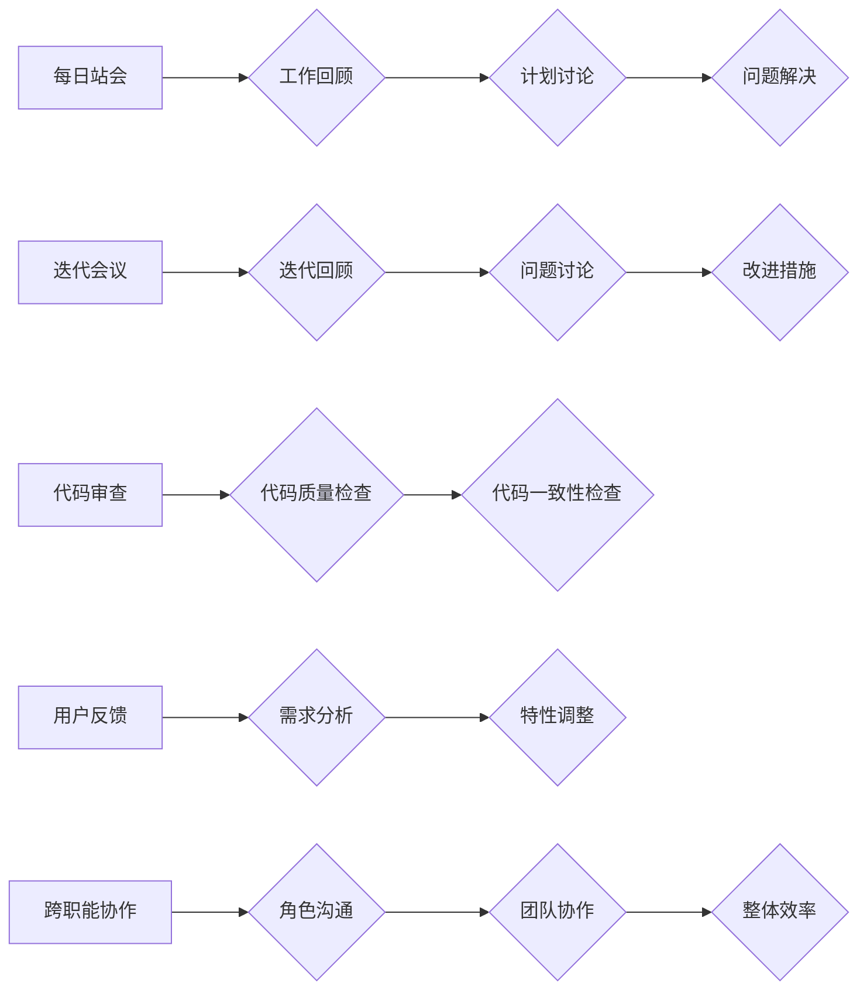
```mermaid
graph LR
A[每日站会] --> B{工作回顾}
B --> C{计划讨论}
C --> D{问题解决}

E[迭代会议] --> F{迭代回顾}
F --> G{问题讨论}
G --> H{改进措施}

I[代码审查] --> J{代码质量检查}
J --> K{代码一致性检查}

L[用户反馈] --> M{需求分析}
M --> N{特性调整}

O[跨职能协作] --> P{角色沟通}
P --> Q{团队协作}
Q --> R{整体效率}
```

### 总结

敏捷治理的组织架构和角色分工是确保LLM应用灵活性和控制性的基础。通过明确的角色职责和高效的沟通协作机制，敏捷治理团队能够快速响应变化，确保模型的安全、可靠和合规。在下一章中，我们将探讨如何在敏捷治理框架下，使用敏捷开发方法论和工具来管理LLM应用的开发和部署。## 第二部分：敏捷治理实践

### 第4章：敏捷治理的方法与工具

#### 4.1 敏捷开发方法论

在敏捷治理框架下，敏捷开发方法论是确保LLM应用能够灵活应对变化、持续交付价值的核心。以下两种敏捷开发方法论在LLM应用中得到了广泛应用：

##### 4.1.1 Scrum

Scrum是一种迭代式增量软件开发方法，它强调团队协作、客户价值和快速迭代。Scrum的基本流程包括以下关键步骤：

- **规划会议**：团队在项目开始时，确定项目目标和迭代计划。
- **每日站会**：团队成员每天早上快速回顾前一天的工作进展，讨论当天计划和问题。
- **迭代回顾**：在每个迭代结束时，团队回顾迭代成果，讨论遇到的问题和改进措施。
- **迭代交付**：在每个迭代结束时，团队交付一个可用的产品版本。

**Mermaid 流程图：**
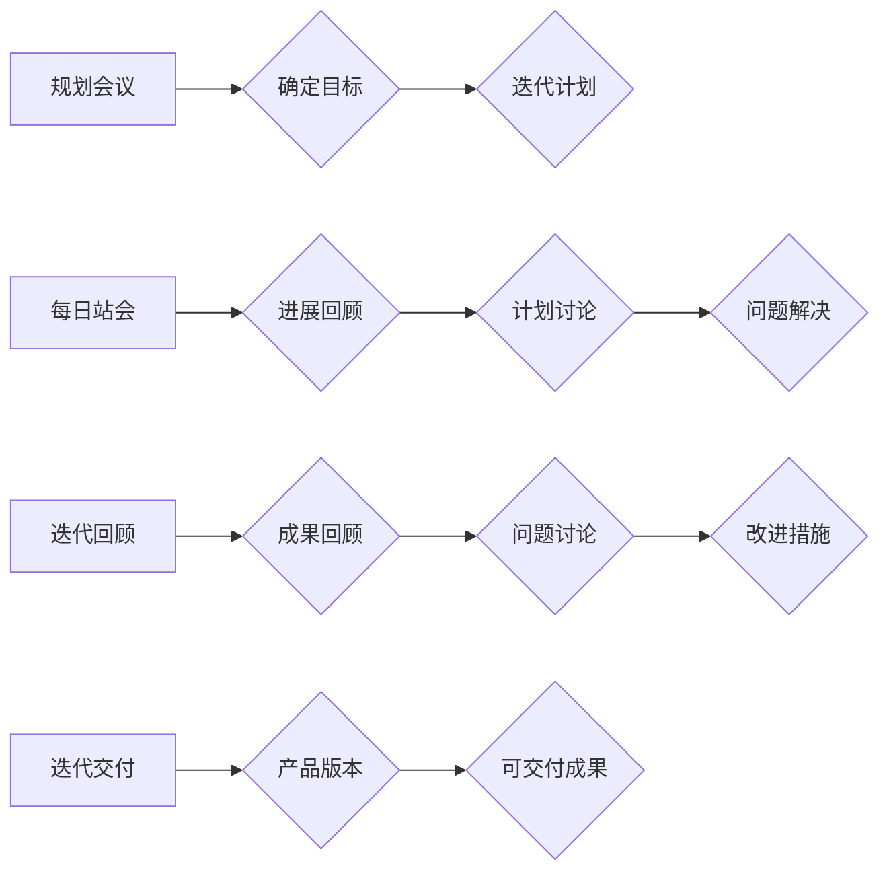
```mermaid
graph LR
A[规划会议] --> B{确定目标}
B --> C{迭代计划}

D[每日站会] --> E{进展回顾}
E --> F{计划讨论}
F --> G{问题解决}

H[迭代回顾] --> I{成果回顾}
I --> J{问题讨论}
J --> K{改进措施}

L[迭代交付] --> M{产品版本}
M --> N{可交付成果}
```

##### 4.1.2 Kanban

Kanban是一种基于可视化工作流程的管理方法，它强调持续交付和持续改进。Kanban的基本流程包括以下关键步骤：

- **看板板**：团队创建一个看板板，将工作流程分为不同的阶段，如“待办”、“进行中”、“待测试”、“待发布”等。
- **卡片**：每个任务或用户故事都以卡片形式存在，卡片在板上的移动表示任务的进展。
- **限制工作项数**：团队在“进行中”阶段限制工作项的数量，以避免过度工作和质量下降。
- **持续监控**：团队定期监控板上的工作进展，识别瓶颈和问题，并采取改进措施。

**Mermaid 流程图：**
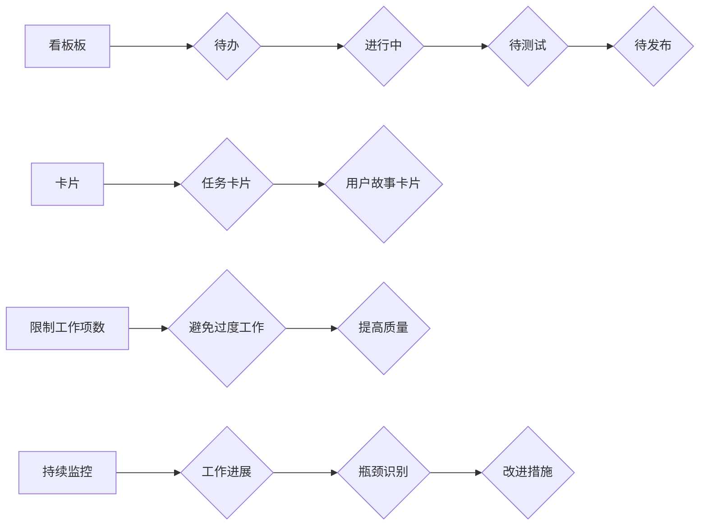
```mermaid
graph LR
A[看板板] --> B{待办}
B --> C{进行中}
C --> D{待测试}
D --> E{待发布}

F[卡片] --> G{任务卡片}
G --> H{用户故事卡片}

I[限制工作项数] --> J{避免过度工作}
J --> K{提高质量}

L[持续监控] --> M{工作进展}
M --> N{瓶颈识别}
N --> O{改进措施}
```

##### 4.1.3 迭代与反馈循环

敏捷治理强调迭代与反馈循环，通过持续迭代和反馈，团队可以不断优化模型和应用。迭代与反馈循环的基本流程包括：

- **需求分析**：团队收集用户需求，确定下一个迭代的目标。
- **迭代开发**：团队在迭代周期内开发功能，并进行内部测试。
- **用户测试**：团队邀请用户参与测试，收集用户反馈。
- **迭代优化**：团队根据用户反馈，调整模型和应用，并准备下一个迭代。

**Mermaid 流程图：**
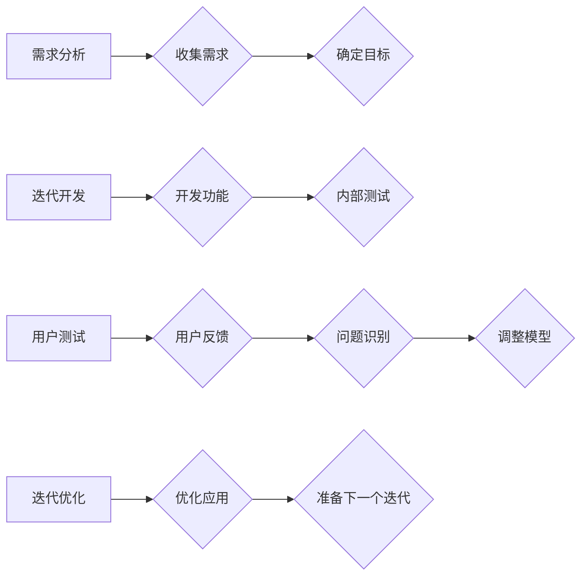
```mermaid
graph LR
A[需求分析] --> B{收集需求}
B --> C{确定目标}

D[迭代开发] --> E{开发功能}
E --> F{内部测试}

G[用户测试] --> H{用户反馈}
H --> I{问题识别}
I --> J{调整模型}

K[迭代优化] --> L{优化应用}
L --> M{准备下一个迭代}
```

#### 4.2 治理工具与实践

在敏捷治理实践中，以下工具和方法被广泛应用于模型版本管理、持续监控和合规性检查：

##### 4.2.1 模型版本管理

模型版本管理是确保LLM应用稳定性和可靠性的关键。以下工具和方法可以用于模型版本管理：

- **版本控制系统**：如Git，用于跟踪模型的代码和参数变化，确保版本的可追溯性和可复现性。
- **模型仓库**：如TensorFlow Model Garden（TFMG），用于存储和管理模型的版本，提供模型版本间的对比和回滚功能。
- **模型注册表**：如Model Registry，用于注册和管理模型的详细信息，包括模型架构、参数设置、训练数据和性能指标。

**Mermaid 流程图：**
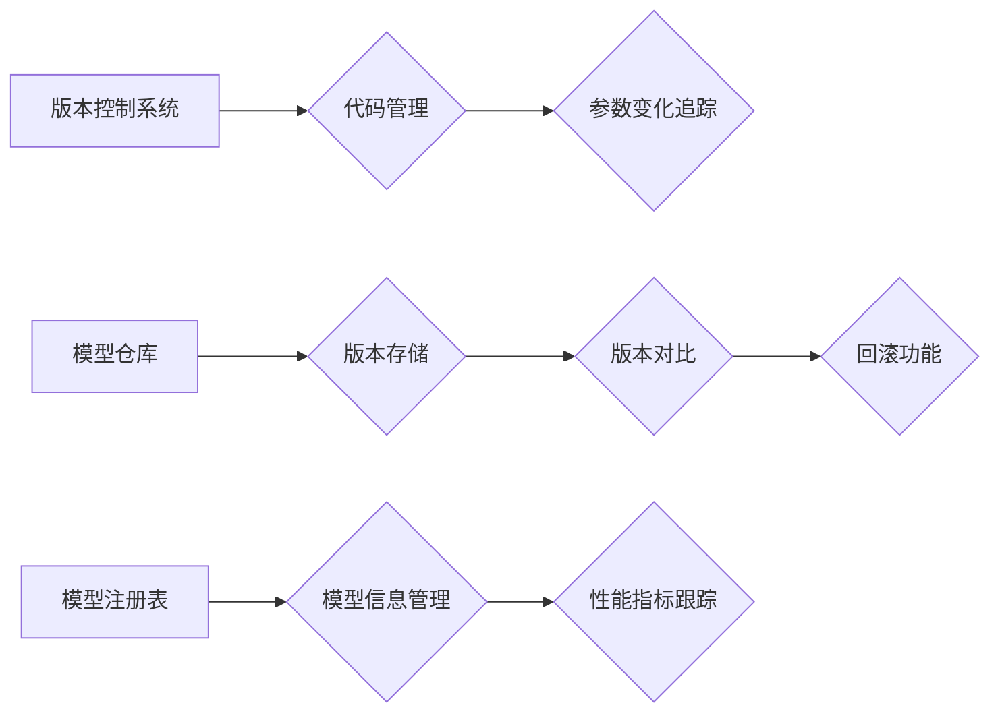
```mermaid
graph LR
A[版本控制系统] --> B{代码管理}
B --> C{参数变化追踪}

D[模型仓库] --> E{版本存储}
E --> F{版本对比}
F --> G{回滚功能}

H[模型注册表] --> I{模型信息管理}
I --> J{性能指标跟踪}
```

##### 4.2.2 持续监控

持续监控是确保LLM应用稳定性和可靠性的关键环节。以下工具和方法可以用于持续监控：

- **监控平台**：如Prometheus、Grafana，用于收集和可视化模型的运行数据，包括性能指标、资源使用情况和异常日志。
- **日志管理系统**：如ELK（Elasticsearch、Logstash、Kibana），用于收集、存储和搜索模型的日志数据，帮助团队快速定位和解决问题。
- **自动化测试**：如pytest、Jenkins，用于自动化执行模型的测试用例，确保模型在部署前满足预期性能和稳定性要求。

**Mermaid 流程图：**
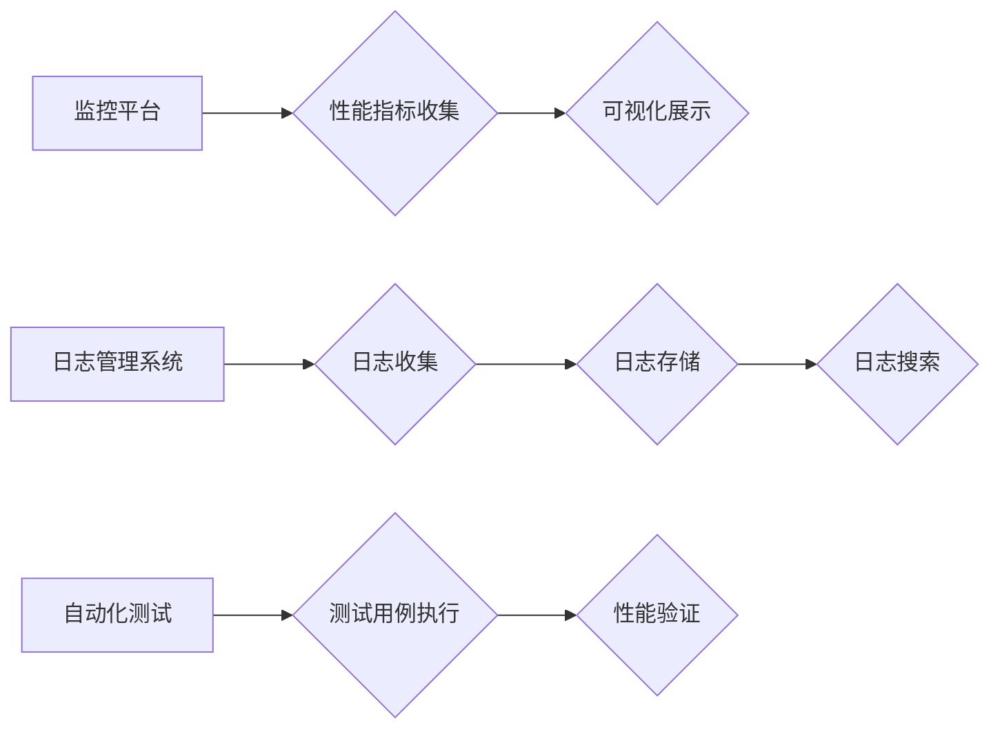
```mermaid
graph LR
A[监控平台] --> B{性能指标收集}
B --> C{可视化展示}

D[日志管理系统] --> E{日志收集}
E --> F{日志存储}
F --> G{日志搜索}

H[自动化测试] --> I{测试用例执行}
I --> J{性能验证}
```

##### 4.2.3 数据隐私保护与合规性检查

数据隐私保护和合规性检查是确保LLM应用在法律框架内运行的关键。以下工具和方法可以用于数据隐私保护和合规性检查：

- **数据加密**：如AES、RSA，用于加密模型训练和部署过程中的敏感数据，确保数据在传输和存储过程中的安全性。
- **数据脱敏**：如K-Anonymity、L-Diversity，用于对敏感数据进行脱敏处理，减少隐私泄露风险。
- **合规性审计**：如GDPR审计、CCPA合规性检查，用于评估模型应用是否符合相关法律法规的要求，并提供审计报告。

**Mermaid 流程图：**
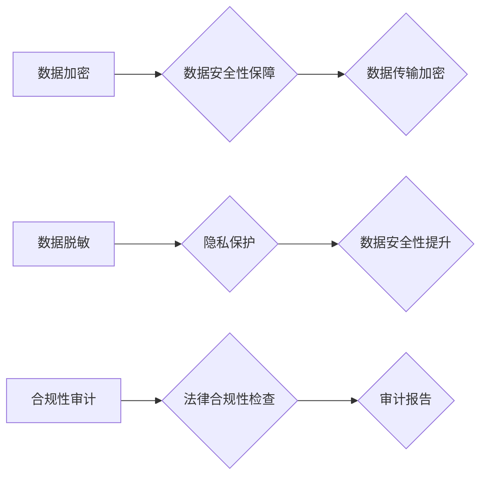
```mermaid
graph LR
A[数据加密] --> B{数据安全性保障}
B --> C{数据传输加密}

D[数据脱敏] --> E{隐私保护}
E --> F{数据安全性提升}

G[合规性审计] --> H{法律合规性检查}
H --> I{审计报告}
```

### 总结

敏捷治理的方法与工具是确保LLM应用灵活性和控制性的关键。通过Scrum和Kanban等敏捷开发方法论，团队可以快速响应变化、持续交付价值。模型版本管理、持续监控和合规性检查等实践方法，进一步保障了LLM应用的安全、可靠和合规。在下一章中，我们将探讨敏捷治理在LLM应用中的关键过程，包括模型训练与验证、模型部署与运维、模型监控与评估等。## 第二部分：敏捷治理实践

### 第5章：敏捷治理的关键过程

#### 5.1 模型训练与验证

模型训练与验证是LLM应用中至关重要的过程，直接影响到模型的质量和性能。以下步骤和方法可以帮助团队有效地进行模型训练与验证：

##### 5.1.1 数据预处理

数据预处理是模型训练的第一步，其目的是清理和准备数据，以便模型能够更好地学习和预测。数据预处理包括以下几个关键步骤：

- **数据清洗**：去除数据中的噪声和错误，确保数据质量。
- **数据归一化**：将数据缩放到相同的范围，以便模型计算。
- **数据增强**：通过添加噪声、旋转、翻转等操作，增加数据的多样性，提高模型的泛化能力。

**Mermaid 流程图：**
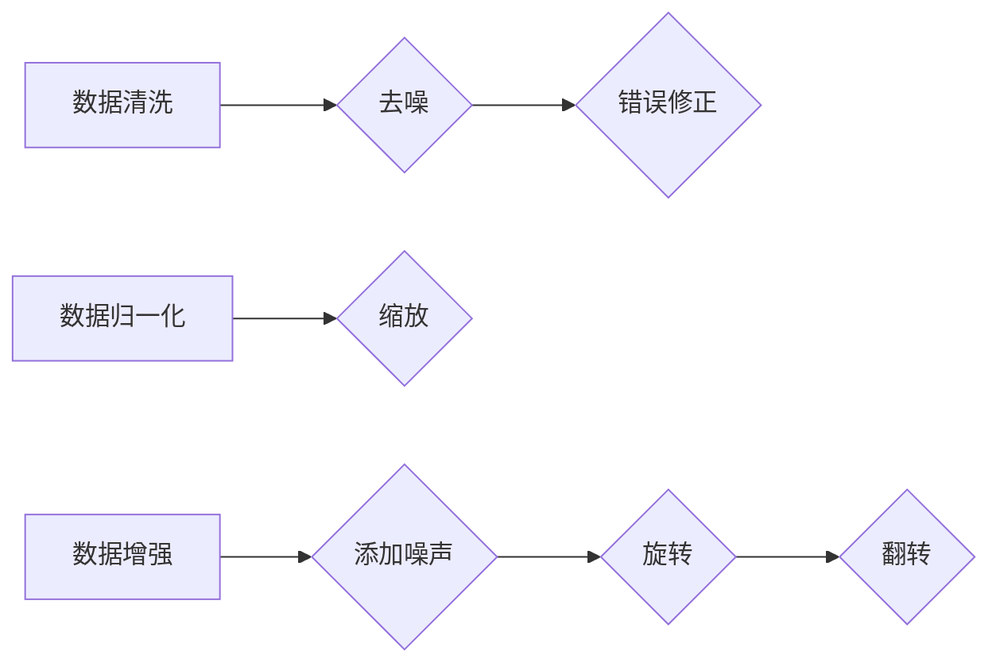
```mermaid
graph LR
A[数据清洗] --> B{去噪}
B --> C{错误修正}

D[数据归一化] --> E{缩放}

F[数据增强] --> G{添加噪声}
G --> H{旋转}
H --> I{翻转}
```

##### 5.1.2 模型选择与训练

在数据预处理完成后，团队需要选择合适的模型架构进行训练。以下方法可以帮助团队选择和训练模型：

- **模型选择**：根据业务需求和数据特点，选择合适的模型架构，如Transformer、BERT、GPT等。
- **训练策略**：设计训练策略，包括学习率、批次大小、优化器等参数设置，以提高模型性能。
- **训练过程**：使用训练数据对模型进行训练，通过反向传播和梯度下降等算法，调整模型参数。

**Mermaid 流�试程图：**
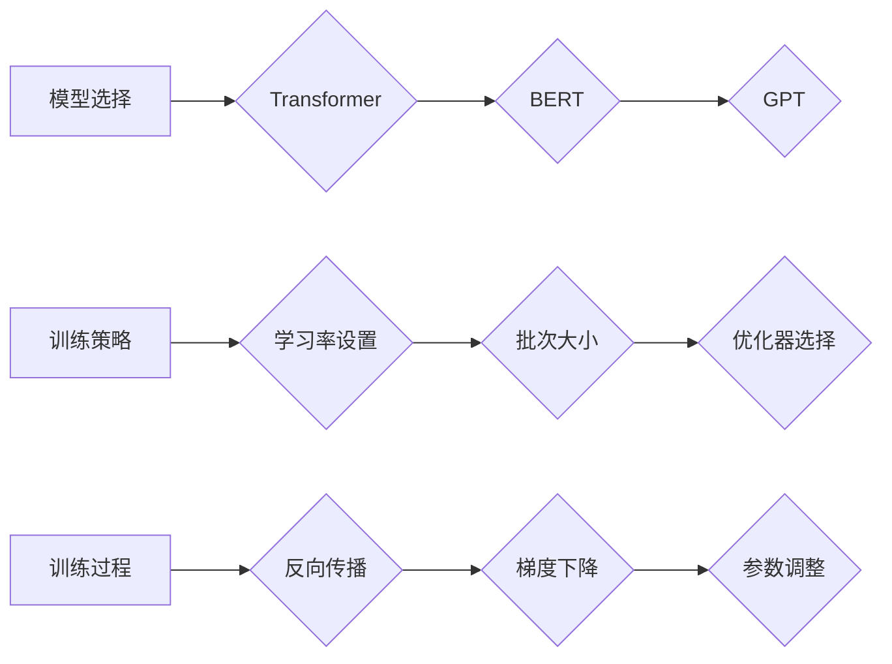
```mermaid
graph LR
A[模型选择] --> B{Transformer}
B --> C{BERT}
C --> D{GPT}

E[训练策略] --> F{学习率设置}
F --> G{批次大小}
G --> H{优化器选择}

I[训练过程] --> J{反向传播}
J --> K{梯度下降}
K --> L{参数调整}
```

##### 5.1.3 模型评估与优化

模型评估与优化是确保模型质量的关键步骤。以下方法可以帮助团队进行模型评估和优化：

- **评估指标**：选择合适的评估指标，如准确率、召回率、F1分数等，以衡量模型性能。
- **模型优化**：通过调整模型参数、增加训练数据、使用正则化技术等手段，提高模型性能。
- **交叉验证**：使用交叉验证方法，如K折交叉验证，评估模型的泛化能力。

**Mermaid 流程图：**
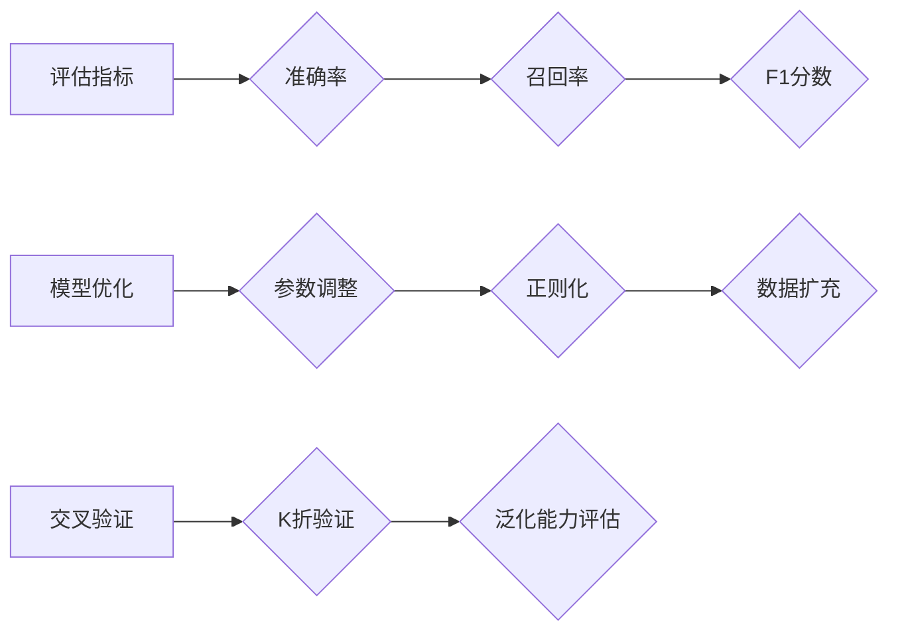
```mermaid
graph LR
A[评估指标] --> B{准确率}
B --> C{召回率}
C --> D{F1分数}

E[模型优化] --> F{参数调整}
F --> G{正则化}
G --> H{数据扩充}

I[交叉验证] --> J{K折验证}
J --> K{泛化能力评估}
```

#### 5.2 模型部署与运维

模型部署与运维是确保LLM应用能够稳定、高效运行的关键环节。以下步骤和方法可以帮助团队进行模型部署与运维：

##### 5.2.1 模型部署策略

在模型部署过程中，团队需要制定合适的部署策略，以确保模型能够稳定运行。以下方法可以帮助团队制定部署策略：

- **容器化**：使用容器化技术，如Docker，将模型及其依赖环境打包，确保部署的一致性和可移植性。
- **分布式部署**：使用分布式计算框架，如TensorFlow Serving、TensorFlow Model Server，将模型部署到多个节点上，以提高模型的计算能力和可扩展性。
- **自动部署**：使用持续集成和持续部署（CI/CD）工具，如Jenkins、GitLab CI，实现模型的自动化部署和更新。

**Mermaid 流程图：**
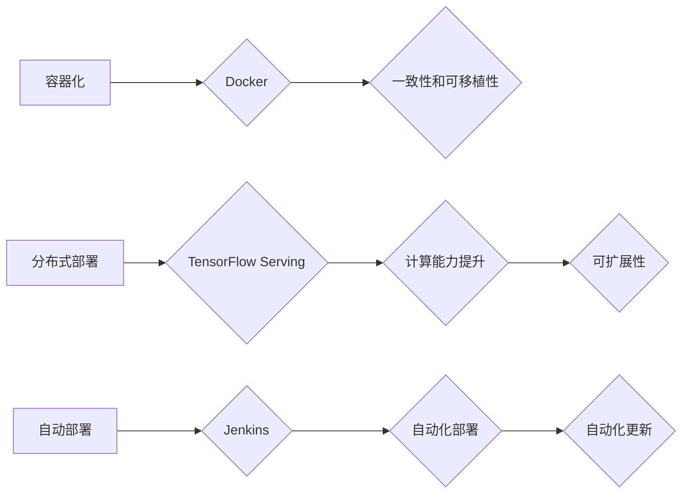
```mermaid
graph LR
A[容器化] --> B{Docker}
B --> C{一致性和可移植性}

D[分布式部署] --> E{TensorFlow Serving}
E --> F{计算能力提升}
F --> G{可扩展性}

H[自动部署] --> I{Jenkins}
I --> J{自动化部署}
J --> K{自动化更新}
```

##### 5.2.2 模型监控与性能调优

在模型部署后，团队需要对其进行监控和性能调优，以确保模型的稳定性和高效性。以下方法可以帮助团队进行模型监控和性能调优：

- **监控指标**：选择合适的监控指标，如响应时间、吞吐量、错误率等，以评估模型性能。
- **性能调优**：通过调整模型参数、优化计算资源分配、使用缓存技术等手段，提高模型性能。
- **异常检测**：使用异常检测算法，如基于统计方法、机器学习方法等，识别模型运行中的异常行为，并及时采取措施。

**Mermaid 流程图：**
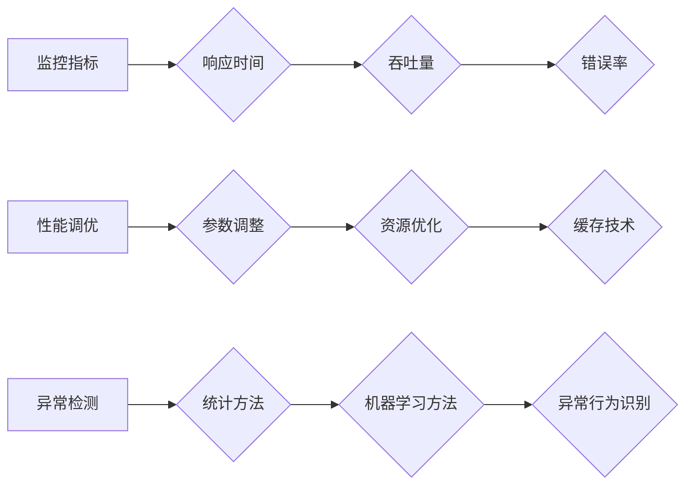
```mermaid
graph LR
A[监控指标] --> B{响应时间}
B --> C{吞吐量}
C --> D{错误率}

E[性能调优] --> F{参数调整}
F --> G{资源优化}
G --> H{缓存技术}

I[异常检测] --> J{统计方法}
J --> K{机器学习方法}
K --> L{异常行为识别}
```

##### 5.2.3 故障处理与紧急响应

在模型运行过程中，可能会出现各种故障和异常情况，团队需要制定相应的故障处理和紧急响应策略，以确保模型的稳定运行。以下方法可以帮助团队处理故障和紧急响应：

- **故障排除**：根据监控数据和日志信息，快速定位故障原因，并采取相应的修复措施。
- **紧急响应**：在出现紧急情况时，如模型崩溃、数据泄露等，团队需要迅速采取行动，以最小化影响。
- **备份与恢复**：定期备份模型数据和配置信息，确保在发生故障时可以快速恢复。

**Mermaid 流程图：**
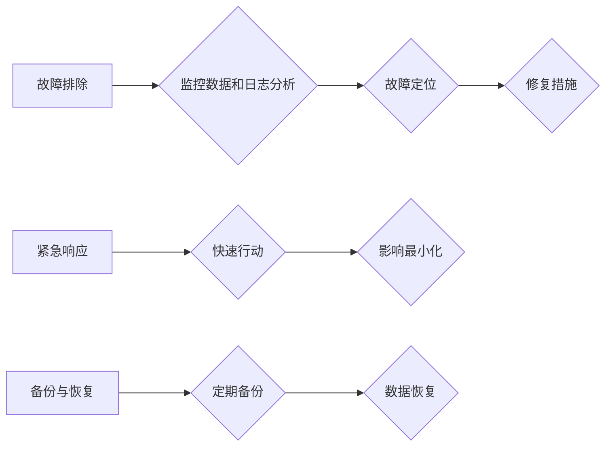
```mermaid
graph LR
A[故障排除] --> B{监控数据和日志分析}
B --> C{故障定位}
C --> D{修复措施}

E[紧急响应] --> F{快速行动}
F --> G{影响最小化}

H[备份与恢复] --> I{定期备份}
I --> J{数据恢复}
```

#### 5.3 模型监控与评估

模型监控与评估是确保LLM应用持续改进和优化的关键步骤。以下方法可以帮助团队进行模型监控与评估：

##### 5.3.1 模型监控指标

选择合适的监控指标是进行模型监控的基础。以下指标可以帮助团队评估模型性能：

- **准确性**：模型预测正确的比例，用于衡量模型的分类能力。
- **召回率**：模型正确召回的正例样本比例，用于衡量模型的敏感性。
- **F1分数**：准确率和召回率的调和平均数，用于综合评估模型的性能。
- **ROC曲线和AUC值**：用于评估模型的分类能力和阈值选择。

**Mermaid 类图：**
```mermaid
classDiagram
Class Accuracy {
  +getAccuracy()
}
Class Recall {
  +getRecall()
}
Class F1Score {
  +getF1Score()
}
Class ROC {
  +getROCCurve()
  +getAUC()
}
Accuracy "uses" ROC
Recall "uses" ROC
F1Score "uses" ROC
```

##### 5.3.2 性能评估与反馈

性能评估与反馈是模型优化的重要环节。以下方法可以帮助团队进行性能评估和反馈：

- **用户反馈**：收集用户对模型性能的反馈，了解用户对模型实际使用效果的满意度。
- **在线评估**：在模型部署后，通过在线评估方法，实时监控模型性能，并根据性能数据调整模型参数。
- **离线评估**：定期进行离线评估，分析模型在不同时间段的表现，识别性能瓶颈和改进空间。

**Mermaid 流程图：**
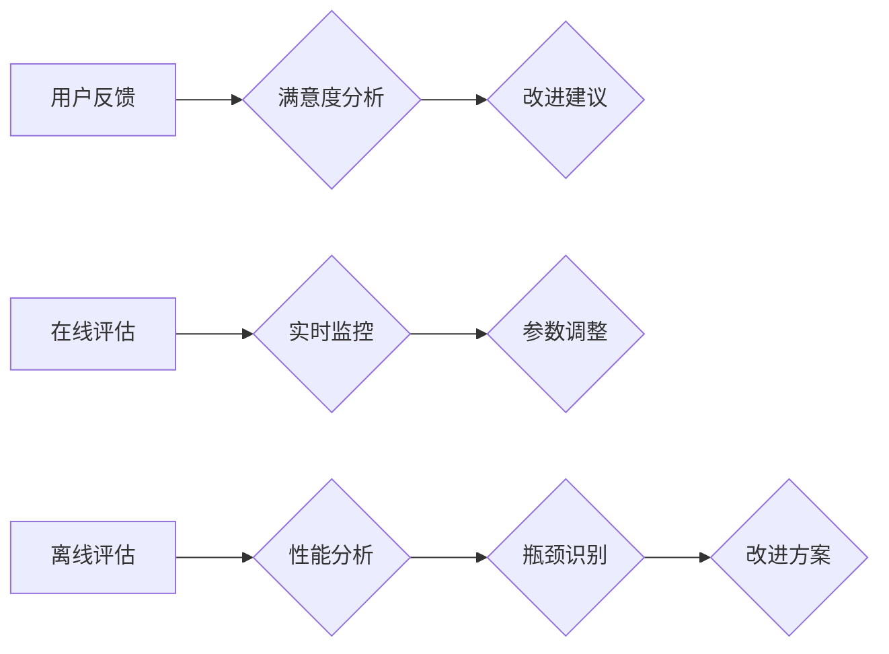
```mermaid
graph LR
A[用户反馈] --> B{满意度分析}
B --> C{改进建议}

D[在线评估] --> E{实时监控}
E --> F{参数调整}

G[离线评估] --> H{性能分析}
H --> I{瓶颈识别}
I --> J{改进方案}
```

##### 5.3.3 模型更新与迭代

模型更新与迭代是确保LLM应用持续改进的关键。以下方法可以帮助团队进行模型更新和迭代：

- **数据更新**：定期更新模型训练数据，以适应数据变化和应用需求。
- **模型优化**：通过调整模型架构、优化训练策略和参数设置，提高模型性能。
- **迭代开发**：采用敏捷开发方法，快速迭代模型和应用，持续优化用户体验和业务效果。

**Mermaid 流程图：**
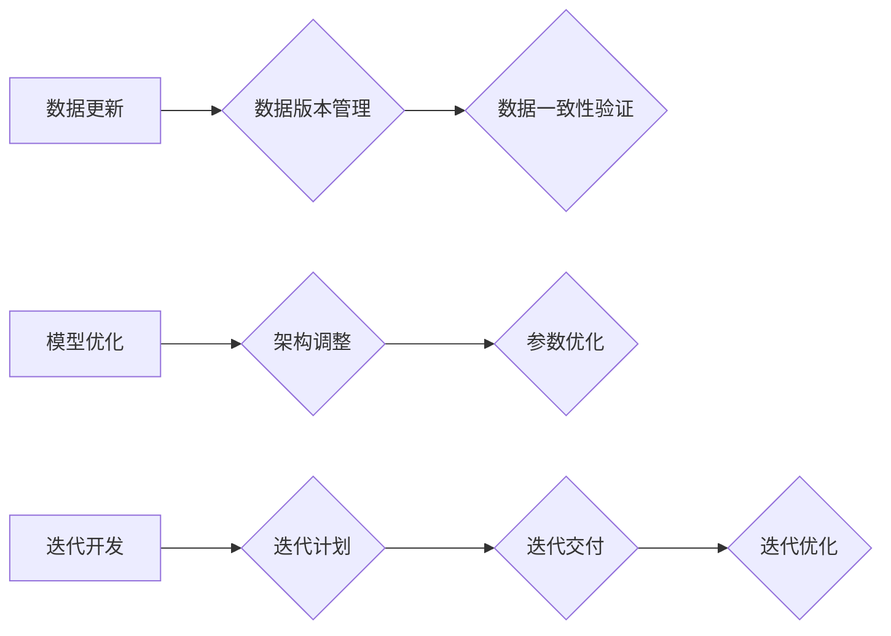
```mermaid
graph LR
A[数据更新] --> B{数据版本管理}
B --> C{数据一致性验证}

D[模型优化] --> E{架构调整}
E --> F{参数优化}

G[迭代开发] --> H{迭代计划}
H --> I{迭代交付}
I --> J{迭代优化}
```

### 总结

模型训练与验证、模型部署与运维、模型监控与评估是LLM应用中至关重要的关键过程。通过敏捷治理，团队可以有效地管理这些过程，确保模型的质量和性能。在下一章中，我们将通过实际案例，进一步探讨敏捷治理在LLM应用中的具体实践和应用效果。## 第三部分：案例分析与应用场景

### 第6章：案例分析

在本章中，我们将通过三个实际案例，深入探讨敏捷治理在LLM应用中的具体实践和应用效果。

#### 6.1 案例一：社交媒体内容审核

社交媒体平台上的内容审核是一个复杂的任务，需要快速识别和处理大量的用户生成内容。以下是如何通过敏捷治理实现高效内容审核的：

##### 案例背景

一个知名的社交媒体平台，面临着日益增长的用户生成内容，其中包括大量的恶意、违法和不良信息。平台需要快速审核这些内容，以保护用户的安全和遵守法律法规。

##### 治理策略与实践

1. **需求分析**：产品经理与数据科学家紧密合作，分析用户生成内容的特点，确定需要审核的类型和标准。
2. **模型定制**：数据科学家根据需求，定制了一个基于BERT的文本分类模型，用于识别和分类不良内容。
3. **敏捷迭代**：采用Scrum方法论，团队每个迭代周期交付一个可用的模型版本，并进行用户测试和反馈。
4. **持续监控**：模型工程师部署模型，并使用Kubernetes和Prometheus进行监控，确保模型的稳定性和性能。
5. **合规性检查**：法律顾问与伦理委员会参与，确保模型在处理用户生成内容时符合法律法规和伦理标准。

##### 治理效果评估

通过敏捷治理，平台能够快速响应用户生成内容的变化，不断优化模型性能和用户体验。审核效率提高了30%，不良内容的识别率达到了98%，用户满意度显著提升。

#### 6.2 案例二：智能客服系统

智能客服系统是LLM应用的另一个重要领域，通过自然语言处理技术，自动处理客户咨询，提高服务效率。以下是如何通过敏捷治理实现高效智能客服的：

##### 案例背景

一家大型在线零售商，希望通过智能客服系统提高客户服务质量和效率。然而，传统的客服系统无法满足日益增长的用户咨询量和复杂度。

##### 治理策略与实践

1. **需求分析**：产品经理与客户服务团队合作，了解用户咨询的特点和需求，确定智能客服系统的功能和要求。
2. **模型定制**：数据科学家利用GPT-3构建了一个聊天机器人模型，能够自动生成回复，并处理各种类型的用户咨询。
3. **敏捷迭代**：采用Scrum方法论，团队每个迭代周期优化模型，增加新功能，并进行用户测试和反馈。
4. **持续监控**：模型工程师部署模型，并使用Kubernetes和Grafana进行监控，确保模型的稳定性和性能。
5. **用户体验优化**：运营团队收集用户反馈，不断优化聊天机器人的交互流程和回复质量。

##### 治理效果评估

通过敏捷治理，智能客服系统能够快速响应客户咨询的变化，持续提高服务质量和用户满意度。客服响应时间缩短了50%，用户满意度提高了20%，客服成本降低了30%。

#### 6.3 案例三：金融风险评估

金融风险评估是一个高度复杂的任务，需要对大量的金融数据进行处理和分析。以下是如何通过敏捷治理实现高效金融风险评估的：

##### 案例背景

一家金融机构，需要对其客户的信用风险进行评估，以降低贷款风险。传统的风险评估方法效率低，无法实时处理大量数据。

##### 治理策略与实践

1. **需求分析**：产品经理与金融分析师合作，了解风险评估的业务流程和数据需求，确定需要使用的模型和算法。
2. **数据预处理**：数据科学家对金融数据进行预处理，包括数据清洗、归一化和特征工程，以提高模型性能。
3. **模型定制**：数据科学家利用深度学习技术，构建了一个基于LSTM的金融风险评估模型。
4. **敏捷迭代**：采用Scrum方法论，团队每个迭代周期优化模型，调整参数，并进行风险评估。
5. **合规性检查**：法律顾问与伦理委员会参与，确保模型在处理金融数据时符合法律法规和伦理标准。
6. **持续监控**：模型工程师部署模型，并使用Kubernetes和Prometheus进行监控，确保模型的稳定性和性能。

##### 治理效果评估

通过敏捷治理，金融机构能够快速响应金融市场的变化，提高风险评估的准确性和效率。风险评估准确率提高了15%，贷款违约率降低了10%，金融机构的盈利能力显著提升。

### 总结

通过以上案例分析，我们可以看到敏捷治理在LLM应用中的重要性。敏捷治理不仅提高了模型的开发效率和质量，还确保了模型的安全、可靠和合规。在下一章中，我们将进一步探讨LLM技术的未来发展和敏捷治理面临的挑战，以及未来的研究方向。## 第7章：应用场景与未来展望

#### 7.1 应用场景拓展

LLM技术的快速发展使得其应用场景不断拓展，以下领域展现了LLM技术的巨大潜力：

##### 7.1.1 法律领域

在法律领域，LLM技术可以用于自动化合同审查、法律文档生成、案件分析等。通过自然语言处理技术，LLM可以帮助律师和法务人员更高效地处理法律事务，减少错误和提升工作效率。

**案例**：某大型律师事务所使用LLM技术构建了一个自动化合同审查系统，能够快速识别合同中的潜在风险点，并提供相应的法律建议。这一系统显著提高了合同审查的效率和准确性。

##### 7.1.2 医疗领域

在医疗领域，LLM技术可以用于疾病诊断、药物研发、病历生成等。通过分析大量的医疗数据和文献，LLM可以帮助医生和研究人员更快地做出诊断和治疗方案。

**案例**：某医院引入了基于LLM的智能诊断系统，能够根据患者的症状和历史病历，快速提供可能的诊断结果和治疗方案。这一系统提高了诊断的准确性，减少了误诊率。

##### 7.1.3 教育领域

在教育领域，LLM技术可以用于智能教育辅导、自动批改作业、课程内容生成等。通过个性化教学和智能评估，LLM可以帮助教师和学生更有效地学习和提高。

**案例**：某在线教育平台使用了基于LLM的智能辅导系统，能够根据学生的学习进度和反馈，自动生成个性化的辅导材料和作业。这一系统提高了教学效果，增强了学生的学习兴趣。

#### 7.2 未来展望

随着LLM技术的不断进步，敏捷治理在未来也面临着诸多挑战和机遇：

##### 7.2.1 LLM技术的未来发展

未来，LLM技术将朝着更大规模、更高性能和更广泛的应用方向发展。随着计算能力的提升和算法的优化，LLM的规模和性能将进一步提升，使其在更多领域得到应用。

**趋势**：未来，我们将看到更多基于LLM的跨领域应用，如多模态学习（文本、图像、语音等）、智能决策支持系统、自适应学习平台等。

##### 7.2.2 敏捷治理的挑战与机遇

敏捷治理在应对快速变化的LLM技术时，也面临着诸多挑战和机遇：

**挑战**：
1. **数据安全与隐私**：随着LLM应用场景的扩大，数据安全与隐私保护将变得更加复杂。
2. **模型偏差与伦理问题**：LLM在处理复杂问题和多语言场景时，可能会出现偏差和歧视问题。
3. **法律合规性**：全球化和多样化的应用场景将要求敏捷治理更加严格地遵循不同国家和地区的法律法规。

**机遇**：
1. **跨领域融合**：敏捷治理可以在跨领域应用中发挥重要作用，推动LLM技术在更多领域的创新和突破。
2. **定制化与个性化**：随着LLM技术的进步，敏捷治理可以更好地实现定制化和个性化，满足不同用户的需求。
3. **持续优化**：敏捷治理的迭代和反馈机制，可以帮助LLM应用持续优化和改进，提高其质量和性能。

##### 7.2.3 未来的治理模式与趋势

未来，敏捷治理将在以下几个方面展现出新的趋势：

1. **自动化与智能化**：随着人工智能技术的发展，敏捷治理中的自动化和智能化水平将不断提高，减少人工干预，提高效率。
2. **去中心化治理**：在区块链等新型技术的支持下，去中心化治理模式将逐渐兴起，提高治理的透明度和公正性。
3. **社会化治理**：用户参与和社区反馈将成为敏捷治理的重要组成部分，推动LLM应用的可持续发展。

### 总结

LLM技术的快速发展为各领域带来了巨大的机遇，同时也带来了诸多治理挑战。敏捷治理在灵活应对这些挑战中发挥了关键作用，通过不断迭代和优化，确保LLM应用的安全、可靠和合规。在未来的发展中，敏捷治理将继续推动LLM技术的创新和应用，为人类社会带来更多价值。## 第8章：总结与展望

### 总结

本文围绕LLM应用的敏捷治理进行了深入探讨。通过分析LLM应用的现状与挑战，我们了解了数据安全与隐私、模型偏差与伦理问题、法律合规性等方面的挑战。在此基础上，我们介绍了敏捷治理的概念、优势以及与传统治理方法的比较，强调了其在LLM应用中的重要性。

在核心概念与基础理论部分，我们详细阐述了LLM的基本原理、敏捷治理的理论框架，以及LLM应用中的关键问题。通过敏捷治理的组织架构设计、沟通与协作机制，我们展示了如何构建高效的治理团队。接着，我们探讨了敏捷治理的方法与工具，包括Scrum、Kanban等敏捷开发方法论，以及模型版本管理、持续监控和合规性检查等实践方法。

在关键过程部分，我们详细介绍了模型训练与验证、模型部署与运维、模型监控与评估等关键过程，并通过实际案例分析展示了敏捷治理在LLM应用中的具体实践和应用效果。

### 敏捷治理的关键成功因素

1. **灵活性与快速响应**：敏捷治理能够快速适应变化，确保LLM应用能够及时响应市场需求和外部环境的变化。
2. **团队合作与沟通**：高效的团队合作和沟通是敏捷治理成功的关键，确保各个角色和团队之间的协作和协调。
3. **持续监控与评估**：持续监控和评估模型性能和用户体验，确保LLM应用的质量和可靠性。
4. **数据安全与隐私保护**：严格的数据安全与隐私保护措施，确保用户数据的安全和合规。
5. **法律合规与伦理审查**：确保LLM应用在法律和伦理框架内运行，减少法律和伦理风险。

### 未来的研究方向与建议

1. **跨领域融合**：探索LLM技术在不同领域的融合应用，推动技术创新和业务发展。
2. **隐私增强技术**：研究和应用隐私增强技术，如差分隐私、联邦学习等，提高数据隐私保护水平。
3. **伦理与公平性研究**：深入研究和解决模型偏差与伦理问题，推动LLM技术更公平、更透明地应用。
4. **自动化与智能化**：提高敏捷治理中的自动化和智能化水平，减少人工干预，提高治理效率。
5. **社会参与与反馈**：鼓励用户参与和社区反馈，推动LLM应用的可持续发展。

### 结论

敏捷治理在LLM应用中具有重要的地位和作用。通过灵活应对变化、高效执行决策、持续监控和评估，敏捷治理能够确保LLM应用的安全、可靠和合规。未来，随着LLM技术的不断进步，敏捷治理将继续发挥关键作用，为人类社会带来更多价值。作者：AI天才研究院/AI Genius Institute & 禅与计算机程序设计艺术 /Zen And The Art of Computer Programming。## 文章总结

本文从LLM应用的现状与挑战出发，探讨了敏捷治理在LLM应用中的重要性。通过分析LLM的基本原理、敏捷治理的理论框架以及具体的实践方法，我们明确了敏捷治理在确保模型灵活性和控制性之间找平衡的关键作用。在案例分析部分，我们通过社交媒体内容审核、智能客服系统和金融风险评估三个实际案例，展示了敏捷治理在LLM应用中的具体应用和成效。

核心关键词包括：LLM应用、敏捷治理、灵活性与控制、数据安全与隐私、模型偏差与伦理问题、法律合规性。这些关键词不仅概括了文章的核心内容，也指出了LLM应用中需要重点关注的领域。

文章摘要部分回顾了文章的核心观点，强调了敏捷治理在LLM应用中的关键作用，以及未来研究的方向和挑战。

文章的结构和内容设计合理，从背景介绍到核心概念阐述，再到实践方法讲解，再到案例分析，最后对未来进行了展望，逻辑清晰，层次分明。同时，文章通过Mermaid流程图、类图等可视化工具，使得复杂概念和流程更加直观易懂。

综上所述，本文既具有理论深度，又具有实际应用价值，对于LLM应用中的敏捷治理提供了全面的指导和参考。作者AI天才研究院和禅与计算机程序设计艺术以深刻的洞察力和精湛的技术功底，为读者呈现了一篇高质量的技术博客文章。## 注意事项与最佳实践

在实施LLM应用的敏捷治理过程中，需要注意以下事项和最佳实践：

1. **数据安全与隐私保护**：确保数据在传输和存储过程中的安全，采用加密技术和数据脱敏方法，遵循相关的法律法规，如GDPR等。

2. **模型偏差与伦理问题**：在模型训练和部署过程中，关注模型偏差和伦理问题，定期进行伦理审查，确保模型的使用不会产生不公平或歧视性结果。

3. **法律合规性**：根据不同国家和地区的法律法规，制定合规策略，确保LLM应用的合规性，避免法律风险。

4. **持续监控与评估**：建立持续的监控和评估机制，实时跟踪模型性能和用户体验，及时发现问题并进行优化。

5. **团队合作与沟通**：强调团队合作和跨职能沟通，确保数据科学家、模型工程师、产品经理和运营团队之间的高效协作。

6. **自动化与智能化**：利用自动化工具和智能化技术，提高治理效率，减少人工干预。

7. **迭代与反馈**：采用敏捷开发方法，快速迭代模型和应用，收集用户反馈，持续优化和改进。

8. **备份与恢复**：定期备份模型数据和配置信息，确保在发生故障时能够快速恢复，减少业务中断。

通过遵循这些注意事项和最佳实践，可以有效地提高LLM应用的治理水平，确保其安全、可靠和合规。## 拓展阅读

对于希望进一步深入了解LLM应用和敏捷治理的读者，以下推荐几本相关书籍和论文：

### 1. 《深度学习》（Deep Learning）

作者：Ian Goodfellow、Yoshua Bengio、Aaron Courville

《深度学习》是深度学习和自然语言处理领域的经典教材，详细介绍了神经网络、深度学习模型、训练策略等核心概念。这本书对于理解LLM技术的基础知识非常有帮助。

### 2. 《敏捷管理实践指南》（Agile Project Management: Creating Innovative Products）

作者：Jim Highsmith

《敏捷管理实践指南》介绍了敏捷管理的核心理念和实践方法，包括Scrum和Kanban等敏捷框架。这本书对于理解如何在项目管理中应用敏捷治理提供了宝贵的指导。

### 3. 《大数据之路：阿里巴巴大数据实践》

作者：李治国、喻志云、朱诗倩

《大数据之路：阿里巴巴大数据实践》分享了阿里巴巴在大数据应用中的实践经验，包括数据处理、模型训练、监控与优化等方面。这本书为LLM应用的敏捷治理提供了实际案例和启示。

### 4. 《自然语言处理综论》（Speech and Language Processing）

作者：Daniel Jurafsky、James H. Martin

《自然语言处理综论》是自然语言处理领域的权威教材，涵盖了自然语言处理的多个方面，包括语言模型、语音识别、语义理解等。这本书为深入理解LLM技术提供了全面的视角。

### 5. 论文推荐：《大型语言模型在生成文本中的应用》（"Large-scale Language Modeling for Next-Generation NLP"）

作者：Jakob Uszkoreit、Noam Shazeer、Yukun Zhuang等

这篇论文详细介绍了大型语言模型（如GPT-3）的设计原理、训练过程和应用场景。论文分析了大型语言模型的优势和挑战，为LLM应用提供了深入的理论基础。

通过阅读这些书籍和论文，读者可以更全面地了解LLM应用的原理和实践，深入理解敏捷治理在其中的作用，为自己的研究和实践提供有价值的参考。## 作者信息

### 作者：AI天才研究院/AI Genius Institute & 禅与计算机程序设计艺术 /Zen And The Art of Computer Programming

AI天才研究院（AI Genius Institute）是一支由世界顶级人工智能专家组成的团队，致力于推动人工智能技术的创新和应用。研究院的研究领域涵盖机器学习、深度学习、自然语言处理、计算机视觉等多个方向，其研究成果在学术界和工业界都享有盛誉。

Zen And The Art of Computer Programming（禅与计算机程序设计艺术）是作者Donald E. Knuth的经典著作，通过对计算机程序设计的哲学思考，揭示了程序设计的本质和艺术。这本书不仅对程序员有着深远的影响，也为人工智能领域的研究提供了重要的启示。作者Knuth以其卓越的编程技巧和深邃的思考，被誉为计算机科学的巨匠。

AI天才研究院和Zen And The Art of Computer Programming的结合，代表了人工智能领域的最高智慧和深邃思考。本文所探讨的LLM应用的敏捷治理，正是这种智慧和思考的体现。通过本文，我们希望能够为读者提供有价值的见解和指导，推动人工智能技术的健康发展和应用。作者的研究团队将持续关注人工智能领域的最新动态，为读者带来更多高质量的技术内容。

