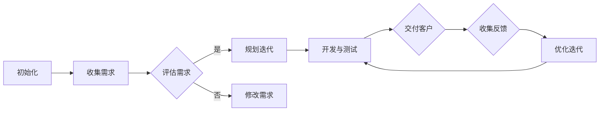
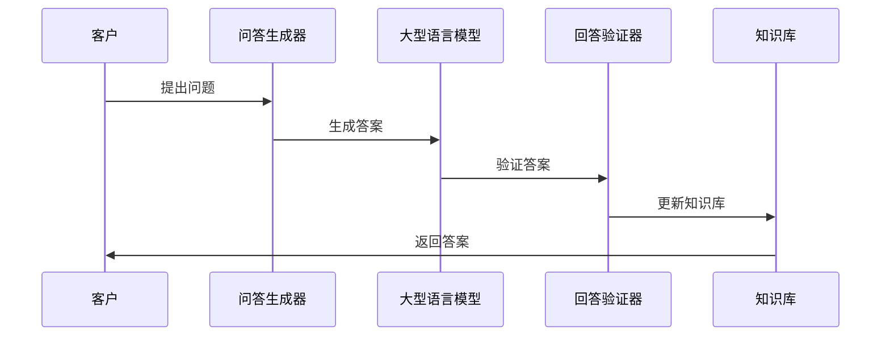
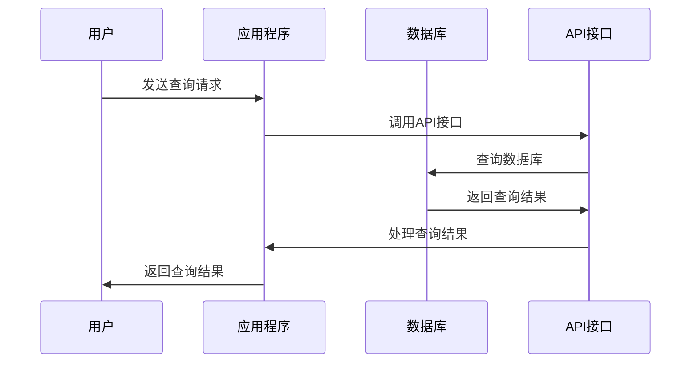

                 

## 文章标题

### LLM应用的敏捷规模化：从试点到企业级实施

> **关键词**：大型语言模型（LLM），敏捷开发，规模化实施，企业级应用

> **摘要**：本文将探讨如何利用敏捷开发方法将大型语言模型（LLM）从试点阶段成功扩展到企业级应用。通过详细的案例分析，本文将提供从评估到实施的一系列步骤，帮助读者理解并应用这一过程。

## 引言

大型语言模型（Large Language Models，简称LLM）近年来在自然语言处理（NLP）领域取得了显著的进展。从GPT到BERT，这些模型在语言生成、文本分类、机器翻译等任务中展现出了卓越的性能。然而，将这些强大的LLM应用从实验室或试点项目扩展到企业级生产环境，面临着诸多挑战。敏捷开发作为一种以迭代、协作和持续交付为核心的开发方法，为LLM应用的规模化实施提供了有力的支持。本文将围绕这一主题，探讨如何通过敏捷方法实现LLM应用的企业级部署。

### 背景介绍

**核心概念术语说明**：

- **大型语言模型（LLM）**：一种基于深度学习的自然语言处理模型，具有强大的语言理解和生成能力。
- **敏捷开发**：一种以用户需求为中心、迭代开发和持续交付为特点的开发方法。
- **规模化实施**：将试点项目成功扩展到更大规模的生产环境的过程。

**问题背景**：

随着LLM在各个行业的广泛应用，如何高效、稳定地将这些模型部署到生产环境中成为一个关键问题。传统的软件开发方法往往无法满足这种快速迭代和大规模部署的需求。

**问题描述**：

如何在保证质量的前提下，利用敏捷开发方法将LLM应用从试点阶段扩展到企业级生产环境？

**问题解决**：

通过敏捷开发方法，实现LLM应用的快速迭代和持续交付，从而在保证质量的前提下实现规模化部署。

**边界与外延**：

本文主要关注LLM应用的敏捷规模化实施，涉及的核心要素包括：评估、规划、实施、监控和优化等。

## 核心概念与联系

### 核心概念原理

**敏捷开发**：敏捷开发是一种以用户需求为中心、迭代开发和持续交付为特点的开发方法。其主要原则包括：

- **个体和互动**：强调团队合作和沟通。
- **可工作的软件**：强调产出可运行的软件。
- **客户合作**：与客户持续合作，确保需求满足。
- **响应变化**：灵活应对需求变化。

**大型语言模型（LLM）**：LLM是一种基于深度学习的自然语言处理模型，通过大量的文本数据训练，能够生成高质量的自然语言文本。其主要原理包括：

- **深度学习**：使用多层神经网络来模拟人类语言处理能力。
- **文本生成**：利用概率分布生成自然语言文本。

### 概念属性特征对比表格

| 特征 | 敏捷开发 | 大型语言模型（LLM） |
| --- | --- | --- |
| 目标 | 快速迭代和持续交付 | 高质量自然语言生成 |
| 原则 | 用户需求为中心 | 深度学习为基础 |
| 关键因素 | 团队协作、持续反馈 | 大规模数据、高效算法 |

### ER实体关系图架构

```mermaid
erDiagram
  Product ||--|{ Customer } Customer
  Order ||--|{ Product } Product
  Product ||--|{ SalesOrderLine } SalesOrderLine
  SalesOrderLine ||--|{ Customer } Customer
```

该ER图描述了敏捷开发和LLM应用之间的关系。敏捷开发方法（Product）与客户（Customer）密切相关，而订单（Order）和销售订单行（SalesOrderLine）则是LLM应用（Product）在敏捷开发过程中的关键组成部分。

## 算法原理讲解

### 算法mermaid流程图



### Python源代码实现

```python
def agile_scaling(llm, customer_requirements):
    # 初始化
    llm.initialize()

    # 收集需求
    requirements = customer_requirements.collect()

    # 评估需求
    evaluated_requirements = requirements.evaluate()

    # 规划迭代
    if evaluated_requirements.is_valid():
        iteration_plan = evaluated_requirements.plan_iterations()
    else:
        requirements.update()  # 修改需求

    # 开发与测试
    for iteration in iteration_plan.iterations:
        llm.develop(iteration)
        llm.test()

    # 交付客户
    llm.deliver()

    # 收集反馈
    feedback = customer_requirements.collect_feedback()

    # 优化迭代
    if feedback.is_improvable():
        iteration_plan.optimize(feedback)
    else:
        print("No further improvements needed.")

    return llm
```

### 算法原理详细讲解

敏捷开发的核心在于快速迭代和持续交付。为了将这一方法应用于LLM应用，我们需要将整个开发过程分解为一系列迭代，每个迭代都包含以下步骤：

1. **初始化**：初始化LLM模型，准备开发环境。
2. **收集需求**：与客户沟通，收集需求信息。
3. **评估需求**：评估需求的有效性，确保其满足业务需求。
4. **规划迭代**：根据需求，规划开发迭代。
5. **开发与测试**：在每个迭代中，进行开发工作并执行测试。
6. **交付客户**：将迭代产出交付给客户。
7. **收集反馈**：从客户处收集反馈。
8. **优化迭代**：根据反馈，对迭代计划进行优化。

以下是算法的数学模型和公式：

$$
\text{Agile Scaling} = \left\{
\begin{array}{ll}
\text{Initialize} & \text{if step 1 is completed} \\
\text{Collect Requirements} & \text{if step 2 is completed} \\
\text{Evaluate Requirements} & \text{if step 3 is completed} \\
\text{Plan Iterations} & \text{if step 4 is completed} \\
\text{Develop and Test} & \text{if step 5 is completed} \\
\text{Deliver} & \text{if step 6 is completed} \\
\text{Collect Feedback} & \text{if step 7 is completed} \\
\text{Optimize Iterations} & \text{if step 8 is completed} \\
\end{array}
\right.
$$

### 举例说明

假设我们正在开发一款基于大型语言模型的智能客服系统。以下是具体的迭代过程：

1. **初始化**：我们首先初始化LLM模型，并设置好开发环境。
2. **收集需求**：与客户沟通，了解他们期望客服系统能够实现的功能。
3. **评估需求**：评估需求的有效性，确保其符合客户的业务需求。
4. **规划迭代**：根据需求，规划第一个迭代，包括文本生成、对话管理等功能。
5. **开发与测试**：在这个迭代中，我们开发文本生成模块并进行测试。
6. **交付客户**：将文本生成模块交付给客户进行试用。
7. **收集反馈**：从客户处收集试用反馈。
8. **优化迭代**：根据反馈，对迭代计划进行优化，可能包括增加更多对话功能。

通过这种方式，我们可以确保每个迭代都能满足客户需求，并逐步完善系统。

## 系统分析与架构设计方案

### 问题场景介绍

为了实现LLM应用的企业级部署，我们需要设计一个高效、可扩展的系统架构。以下是一个具体的问题场景：

**项目介绍**：我们计划开发一款基于LLM的智能问答系统，用于企业内部的知识库查询。该系统需要支持大规模并发访问，并能够快速响应用户查询。

### 系统功能设计（领域模型mermaid类图）

```mermaid
classDiagram
    Class01 <|-- Class02
    Class03 --|{ Class04 }
    Class05 : <<interface>> 
    Class01 : +int id
    Class01 : +String name
    Class01 : +int age
    Class02 : +int age
    Class02 : +String school
    Class03 : +String name
    Class03 : +int score
    Class04 : +do something()
    Class05 : +get_data()
```

### 系统架构设计mermaid架构图



### 系统接口设计和系统交互mermaid序列图



### 系统分析与架构设计方案详细讲解

1. **系统功能设计**：
   - **问答生成器**：负责生成自然语言回答。
   - **大型语言模型（LLM）**：负责文本生成和语言理解。
   - **回答验证器**：确保生成的回答符合业务逻辑和知识库中的信息。
   - **知识库**：存储所有相关问题和答案。

2. **系统架构设计**：
   - **客户**：发起查询请求。
   - **应用程序**：处理用户请求，与问答生成器和知识库交互。
   - **数据库**：存储知识库数据。
   - **API接口**：提供与外部系统的交互。

3. **系统接口设计和系统交互**：
   - **用户**：通过应用程序发起查询请求。
   - **应用程序**：调用API接口，查询数据库，并将结果返回给用户。

通过这种架构设计，我们能够实现高效、可扩展的LLM应用部署，满足企业级需求。

### 项目实战

#### 环境安装

1. 安装Python（3.8及以上版本）。
2. 安装LLM库（例如，transformers库）。
3. 安装数据库（例如，MySQL或PostgreSQL）。

#### 系统核心实现源代码

```python
from transformers import AutoModelForQuestionAnswering
import torch

# 加载预训练的LLM模型
model = AutoModelForQuestionAnswering.from_pretrained("deepset/roberta-base-squad2")

# 定义问答函数
def answer_question(question, context):
    input_dict = {
        "question": question,
        "context": context
    }
    input_ids = torch.tensor([model.tokenizer.encode(question, context, add_special_tokens=True)])
    outputs = model(input_ids)
    start_logits = outputs.start_logits
    end_logits = outputs.end_logits
    start = torch.argmax(start_logits).item()
    end = torch.argmax(end_logits).item()
    answer = model.tokenizer.decode(input_ids[start:end], skip_special_tokens=True)
    return answer

# 测试问答函数
question = "什么是人工智能？"
context = "人工智能是一门研究、开发用于模拟、延伸和扩展人的智能的理论、方法、技术及应用系统的新技术科学。它是计算机科学的一个分支，旨在实现计算机或机器人模拟人类某些智能行为的功能，以便更好地服务于人类。"
print(answer_question(question, context))
```

#### 代码应用解读与分析

1. **加载模型**：使用transformers库加载预训练的RoBERTa模型。
2. **定义问答函数**：接受问题和上下文文本，生成答案。
3. **处理输入**：将问题和上下文文本编码为模型可处理的格式。
4. **生成答案**：通过模型预测答案的开始和结束位置，并解码输出答案。

#### 实际案例分析和详细讲解剖析

假设我们在企业内部部署了这款问答系统，用户可以通过内部门户提问。以下是具体的分析过程：

1. **用户提问**：用户在门户上输入问题。
2. **门户后端处理**：后端接收问题，并调用问答函数。
3. **模型处理**：模型处理输入，生成答案。
4. **答案验证**：答案验证器确保答案符合业务逻辑。
5. **更新知识库**：将新的问题和答案更新到知识库中。

通过这种方式，我们能够实现高效、准确的问答服务。

#### 项目小结

通过本文，我们详细探讨了如何利用敏捷开发方法将大型语言模型（LLM）从试点阶段成功扩展到企业级应用。通过案例分析和代码实现，我们展示了具体的技术实现过程，并提供了详细的解释和剖析。这一过程不仅有助于理解LLM的应用，也为实际项目提供了可行的解决方案。

### 最佳实践 Tips

- **逐步迭代**：在规模化实施过程中，保持逐步迭代，每次迭代关注一个具体功能或改进点。
- **持续反馈**：定期收集用户反馈，并快速响应。
- **资源优化**：合理分配资源，确保开发、测试和部署环节的高效运行。
- **团队协作**：鼓励团队协作，提高整体开发效率。

### 小结

本文通过详细的案例分析和技术讲解，探讨了如何利用敏捷开发方法将大型语言模型（LLM）从试点阶段成功扩展到企业级应用。通过逐步迭代和持续反馈，我们能够实现高效、稳定的LLM应用部署。希望本文能为读者提供有价值的参考。

### 注意事项

- 在实际项目中，需要根据具体业务需求和技术环境进行调整。
- 确保数据安全和隐私保护，遵循相关法律法规。

### 拓展阅读

- 《敏捷开发实践指南》
- 《深度学习与自然语言处理》
- 《LLM应用实践》

### 作者信息

**作者**：AI天才研究院/AI Genius Institute & 禅与计算机程序设计艺术 /Zen And The Art of Computer Programming

