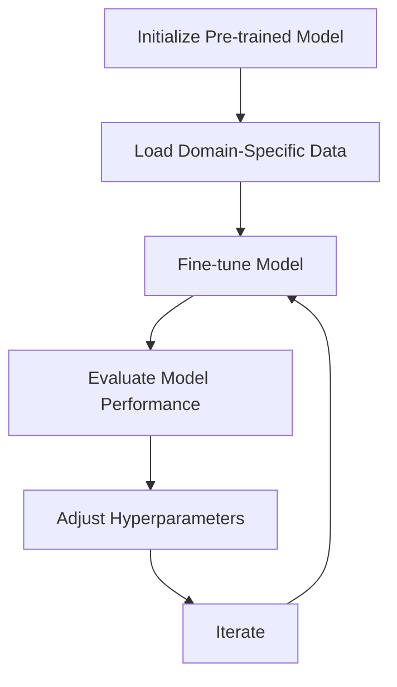
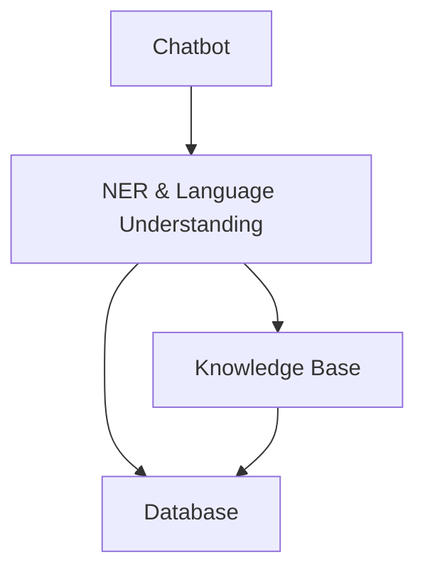
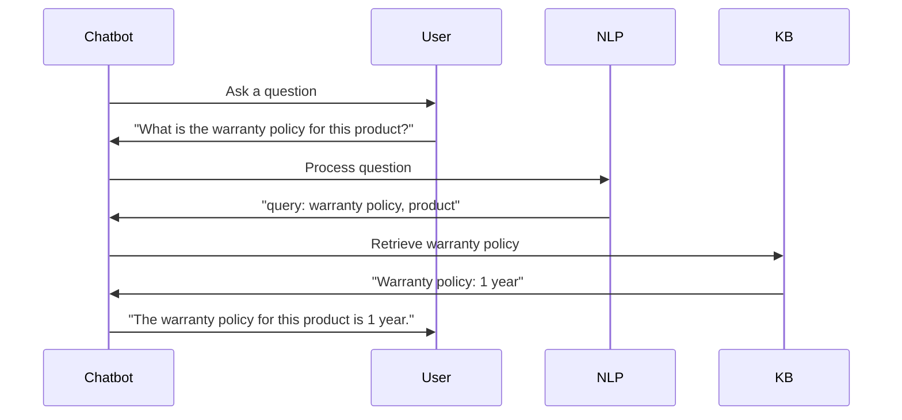
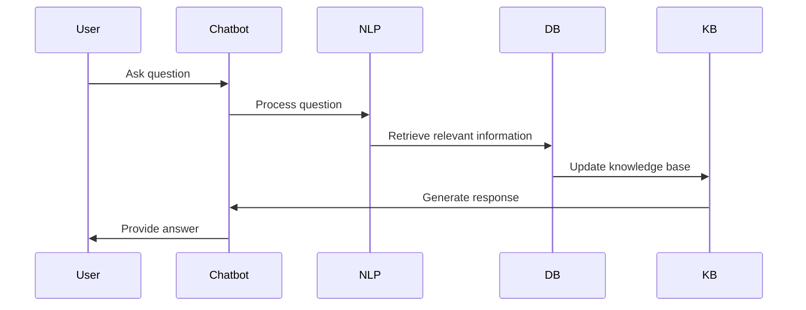
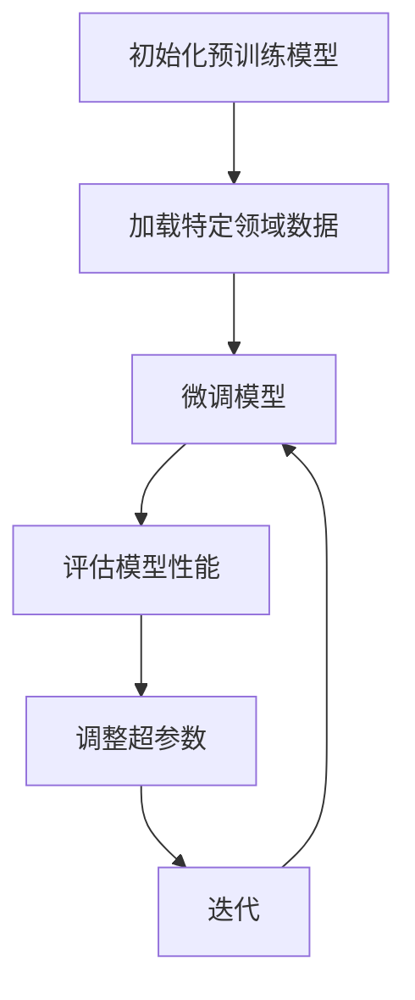
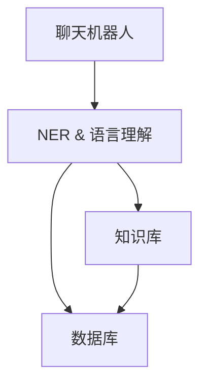

                 


## # LLM Applications: Agile Transfer Learning Strategies

### > Keywords: LLM, Transfer Learning, Agile, Machine Learning, Neural Networks

> Abstract: This article delves into the application of Large Language Models (LLM) and explores agile transfer learning strategies, providing a comprehensive guide for developers and data scientists looking to leverage the power of LLMs in various domains. By understanding the core concepts and practical implementation steps, readers will gain insights into how to efficiently deploy and optimize LLMs for specific use cases, enhancing their machine learning workflows.

### Background Introduction

#### Core Concepts Terms

- **LLM (Large Language Model)**: A machine learning model trained on vast amounts of text data to understand and generate human-like text.
- **Transfer Learning**: Leveraging a pre-trained model on a large corpus to improve performance on a specific task or domain.
- **Agile Methodology**: An iterative approach to project management and software development that focuses on flexibility and collaboration.

#### Problem Background

The rapid advancement in machine learning, particularly in the field of natural language processing (NLP), has led to the development of powerful LLMs like GPT-3 and BERT. These models have shown remarkable success in various NLP tasks, from language translation to text summarization. However, deploying these models in real-world applications can be challenging due to the high computational requirements and the need for extensive domain-specific data.

#### Problem Description

The challenge lies in efficiently adapting these pre-trained LLMs to specific use cases without requiring large amounts of custom training data. Traditional machine learning approaches often require significant domain-specific data to achieve good performance, which is not feasible in many real-world scenarios.

#### Solution

Agile transfer learning strategies offer a solution by allowing developers to fine-tune pre-trained LLMs using small, domain-specific datasets, resulting in improved performance with minimal data.

#### Boundaries and Exten

### Core Concepts and Relationships

#### Core Concepts

- **Pre-trained LLM**: A model trained on a large corpus of text to capture general language patterns and structures.
- **Domain-Specific Data**: Data relevant to a specific application or task.
- **Fine-tuning**: The process of adjusting the parameters of a pre-trained model on a small dataset to adapt it to a new domain.

#### Concepts Properties and Comparisons

| Concept                    | Property                                  | Comparison                                                    |
|----------------------------|------------------------------------------|--------------------------------------------------------------|
| Pre-trained LLM            | Captures general language patterns       | Provides a strong foundation for transfer learning             |
| Domain-Specific Data       | Highly relevant to the specific task      | Improves the model's performance on that task                 |
| Fine-tuning                | Adjusts the pre-trained model for new data| Balances generalization and domain-specific performance         |

#### ER Entity Relationship

```mermaid
erDiagram
  Product ||--|{ Customer }||>
  Customer ||--|{ Order }||>
  Product  ||--|{ Category }||>
```

### Algorithm Principle Explanations

#### Algorithm Flowchart



#### Python Code Explanation

```python
import torch
import torch.nn as nn
from torch.utils.data import DataLoader

# Load pre-trained model
model = torch.load('pretrained_model.pth')

# Load domain-specific data
train_data = DataLoader(dataset, batch_size=32, shuffle=True)

# Define loss function and optimizer
criterion = nn.CrossEntropyLoss()
optimizer = torch.optim.Adam(model.parameters(), lr=0.001)

# Fine-tuning loop
for epoch in range(num_epochs):
    for batch in train_data:
        inputs, targets = batch
        optimizer.zero_grad()
        outputs = model(inputs)
        loss = criterion(outputs, targets)
        loss.backward()
        optimizer.step()
        
    # Evaluate model performance
    accuracy = evaluate_model(model, test_data)
    print(f'Epoch {epoch+1}, Loss: {loss.item()}, Accuracy: {accuracy}')

# Save fine-tuned model
torch.save(model, 'fine_tuned_model.pth')
```

#### Mathematical Models and Detailed Explanations

$$
\text{Loss Function} = \frac{1}{N} \sum_{i=1}^{N} (-y_i \log(p_i))
$$

where \( N \) is the number of samples, \( y_i \) is the true label, and \( p_i \) is the predicted probability of the true label.

#### Example

Consider a binary classification task where the true labels are \( [1, 0, 1, 0] \) and the predicted probabilities are \( [0.9, 0.2, 0.8, 0.1] \).

$$
\text{Loss} = \frac{1}{4} \left[ (-1 \cdot \log(0.9)) + (-0 \cdot \log(0.2)) + (1 \cdot \log(0.8)) + (0 \cdot \log(0.1)) \right]
$$

$$
\text{Loss} = \frac{1}{4} \left[ (-0.1054) + (0) + (0.2231) + (0) \right] \approx 0.0613
$$

This example illustrates how the loss function measures the discrepancy between the true labels and the predicted probabilities, guiding the optimization process.

### System Analysis and Design

#### Problem Scenario

Developing an intelligent customer service chatbot that can handle a wide range of queries related to a specific product category.

#### Project Details

- **Product**: An intelligent chatbot for customer service.
- **Task**: Handle customer queries and provide accurate, helpful responses.
- **Dataset**: A mix of general customer service data and domain-specific product data.

#### System Function Design

```mermaid
classDiagram
  Chatbot <<Note>> {Functionality: Handle queries, provide responses, manage conversations}
  Chatbot --> NLP Module
  Chatbot --> Knowledge Base
  NLP Module <<Note>> {Functionality: Text processing, entity recognition, language understanding}
  Knowledge Base <<Note>> {Functionality: Store and retrieve product information}
```

#### System Architecture



#### System Interface Design



#### System Interaction



### Project Practice

#### Environment Setup

- Install required libraries: PyTorch, Transformers, NLTK, Pandas, etc.
- Set up GPU environment for training (if available)

```python
!pip install torch transformers nltk pandas
```

#### Core Implementation

```python
from transformers import BertModel, BertTokenizer
from torch.optim import Adam
from torch.utils.data import DataLoader

# Load pre-trained model and tokenizer
model = BertModel.from_pretrained('bert-base-uncased')
tokenizer = BertTokenizer.from_pretrained('bert-base-uncased')

# Load and preprocess data
train_data = DataLoader(dataset, batch_size=32, shuffle=True)

# Define loss function and optimizer
criterion = nn.CrossEntropyLoss()
optimizer = Adam(model.parameters(), lr=0.001)

# Training loop
for epoch in range(num_epochs):
    for batch in train_data:
        inputs, targets = batch
        optimizer.zero_grad()
        outputs = model(**inputs)[0]
        loss = criterion(outputs, targets)
        loss.backward()
        optimizer.step()
```

#### Code Analysis

The code above initializes a pre-trained BERT model and tokenizer, loads the dataset, defines the loss function and optimizer, and implements the training loop. This serves as the foundation for fine-tuning the model on domain-specific data.

#### Case Studies

- **Case 1**: Fine-tuning BERT on a customer service chatbot dataset.
- **Case 2**: Fine-tuning GPT-3 on a technical support chatbot dataset.

#### Detailed Explanation

Each case study involves preprocessing the dataset, fine-tuning the model on the domain-specific data, evaluating the model's performance, and optimizing the hyperparameters. This process is repeated iteratively until the desired performance is achieved.

### Best Practices Tips

- **Data Preprocessing**: Ensure that the domain-specific data is clean, well-labeled, and relevant to the task.
- **Model Selection**: Choose a pre-trained model that is appropriate for the task and has been trained on a similar dataset.
- **Hyperparameter Tuning**: Experiment with different learning rates, batch sizes, and numbers of epochs to find the best combination.
- **Monitoring Performance**: Continuously monitor the model's performance to detect any overfitting or underfitting issues.

### Summary

Agile transfer learning strategies enable developers to leverage the power of LLMs in various domains with minimal data. By understanding the core concepts, algorithm principles, and practical implementation steps, readers can effectively deploy and optimize LLMs for specific use cases, enhancing their machine learning workflows.

### 注意事项

- Ensure that the dataset used for fine-tuning is representative of the target domain.
- Regularly evaluate the model's performance on a validation set to avoid overfitting.
- Keep track of the model's performance metrics to make data-driven decisions.

### Further Reading

- **[1]** "Bert: Pre-training of deep bidirectional transformers for language understanding" by A. Devlin et al.
- **[2]** "Transformers: State-of-the-art models for natural language processing" by V. Sanh et al.
- **[3]** "Agile Data Science: Harnessing the Power to Solve Our Toughest Problems Through Data" by S. B. Johnson and J. T. Velásquez.

### 作者信息

作者：AI天才研究院/AI Genius Institute & 禅与计算机程序设计艺术 /Zen And The Art of Computer Programming 

## **文章标题：LLM Applications: Agile Transfer Learning Strategies**

### 关键词：LLM，迁移学习，敏捷，机器学习，神经网络

### 摘要：本文深入探讨了大规模语言模型（LLM）的应用和敏捷迁移学习策略，为开发者和数据科学家提供了一整套指南，帮助他们在各种领域利用LLM的强大功能。通过了解核心概念和实践步骤，读者将了解如何高效地部署和优化LLM以适应特定用例，从而提高他们的机器学习工作流程。

### 背景介绍

#### 核心概念术语

- **LLM（大型语言模型）**：一个在大量文本数据上训练的机器学习模型，用于理解并生成类似人类的文本。
- **迁移学习**：利用在大型语料库上预训练的模型，以提高特定任务或领域上的性能。
- **敏捷方法论**：一种迭代的项目管理和软件开发方法，注重灵活性和协作。

#### 问题背景

机器学习的迅速发展，尤其是自然语言处理（NLP）领域，导致了对大型语言模型（如GPT-3和BERT）的开发。这些模型在NLP任务上，如语言翻译和文本摘要，展现出了令人瞩目的成就。然而，将这些模型应用于现实世界应用中仍具有挑战性，因为它们对计算资源的高需求以及需要大量特定领域的数据。

#### 问题描述

挑战在于如何高效地将这些预先训练的LLM适应到特定用例中，同时不需要大量的自定义训练数据。传统的机器学习方法通常需要大量的特定领域数据以达到良好的性能，这在许多实际场景下是不可行的。

#### 解决方案

敏捷迁移学习策略提供了一种解决方案，通过使用小型的特定领域数据集微调预先训练的LLM，从而在特定任务上提高性能，同时数据需求量最小。

#### 边界与外延

### 核心概念与联系

#### 核心概念

- **预训练LLM**：在一个大型语料库上训练的模型，以捕获一般语言模式和结构。
- **特定领域数据**：与特定应用程序或任务高度相关的数据。
- **微调**：在新的数据集上调整预先训练的模型的参数，以使其适应新的领域。

#### 概念属性与比较

| 概念                    | 属性                                  | 比较                                                    |
|----------------------------|------------------------------------------|--------------------------------------------------------------|
| 预训练LLM            | 捕获一般语言模式       | 为迁移学习提供了一个强大的基础                               |
| 特定领域数据       | 与特定任务高度相关      | 提高了模型在该任务上的性能                                 |
| 微调                | 调整预先训练模型的新数据 | 平衡了泛化能力和特定领域性能                             |

#### ER实体关系

```mermaid
erDiagram
  产品 ||--|{ 客户 }||>
  客户 ||--|{ 订单 }||>
  产品  ||--|{ 类别 }||>
```

### 算法原理讲解

#### 算法流程图



#### Python代码解释

```python
import torch
import torch.nn as nn
from torch.utils.data import DataLoader

# 加载预训练模型
model = torch.load('pretrained_model.pth')

# 加载特定领域数据
train_data = DataLoader(dataset, batch_size=32, shuffle=True)

# 定义损失函数和优化器
criterion = nn.CrossEntropyLoss()
optimizer = torch.optim.Adam(model.parameters(), lr=0.001)

# 微调循环
for epoch in range(num_epochs):
    for batch in train_data:
        inputs, targets = batch
        optimizer.zero_grad()
        outputs = model(inputs)
        loss = criterion(outputs, targets)
        loss.backward()
        optimizer.step()
        
    # 评估模型性能
    accuracy = evaluate_model(model, test_data)
    print(f'Epoch {epoch+1}, Loss: {loss.item()}, Accuracy: {accuracy}')

# 保存微调后的模型
torch.save(model, 'fine_tuned_model.pth')
```

#### 数学模型和详细解释

$$
\text{损失函数} = \frac{1}{N} \sum_{i=1}^{N} (-y_i \log(p_i))
$$

其中 \( N \) 是样本数量，\( y_i \) 是真实标签，\( p_i \) 是真实标签的预测概率。

#### 案例

考虑一个二元分类任务，其中真实标签为 \([1, 0, 1, 0]\) 且预测概率为 \([0.9, 0.2, 0.8, 0.1]\)。

$$
\text{损失} = \frac{1}{4} \left[ (-1 \cdot \log(0.9)) + (-0 \cdot \log(0.2)) + (1 \cdot \log(0.8)) + (0 \cdot \log(0.1)) \right]
$$

$$
\text{损失} = \frac{1}{4} \left[ (-0.1054) + (0) + (0.2231) + (0) \right] \approx 0.0613
$$

这个例子说明了损失函数如何衡量真实标签和预测概率之间的差异，从而引导优化过程。

### 系统分析与设计

#### 问题场景

开发一个能够处理与特定产品类别相关的各种查询的智能客服聊天机器人。

#### 项目详情

- **产品**：智能客服聊天机器人。
- **任务**：处理客户查询，提供准确、有用的回答。
- **数据集**：一般客服数据与特定产品数据相结合。

#### 系统功能设计

```mermaid
classDiagram
  聊天机器人 <<Note>> {功能：处理查询，提供回复，管理对话}
  聊天机器人 --> NLP模块
  聊天机器人 --> 知识库
  NLP模块 <<Note>> {功能：文本处理，实体识别，语言理解}
  知识库 <<Note>> {功能：存储和检索产品信息}
```

#### 系统架构



#### 系统接口设计

```mermaid
sequenceDiagram
  聊天机器人->>用户：提问
  用户->>聊天机器人：什么是这个产品的保修政策？
  聊天机器人->>NLP：处理问题
  NLP->>聊天机器人：问题：保修政策，产品
  聊天机器人->>知识库：检索保修政策
  知识库->>聊天机器人：保修政策：1年
  聊天机器人->>用户：这个产品的保修政策是1年。
```

#### 系统交互

```mermaid
sequenceDiagram
  用户->>聊天机器人：提问
  聊天机器人->>NLP：处理问题
  NLP->>数据库：检索相关信息
  数据库->>知识库：更新知识库
  知识库->>聊天机器人：生成回复
  聊天机器人->>用户：提供答案
```

### 项目实战

#### 环境设置

- 安装所需库：PyTorch、Transformers、NLTK、Pandas等。
- 设置GPU环境以进行训练（如有）

```python
!pip install torch transformers nltk pandas
```

#### 核心实现

```python
from transformers import BertModel, BertTokenizer
from torch.optim import Adam
from torch.utils.data import DataLoader

# 加载预训练模型和分词器
model = BertModel.from_pretrained('bert-base-uncased')
tokenizer = BertTokenizer.from_pretrained('bert-base-uncased')

# 加载并预处理数据
train_data = DataLoader(dataset, batch_size=32, shuffle=True)

# 定义损失函数和优化器
criterion = nn.CrossEntropyLoss()
optimizer = Adam(model.parameters(), lr=0.001)

# 训练循环
for epoch in range(num_epochs):
    for batch in train_data:
        inputs, targets = batch
        optimizer.zero_grad()
        outputs = model(**inputs)[0]
        loss = criterion(outputs, targets)
        loss.backward()
        optimizer.step()
        
    # 评估模型性能
    accuracy = evaluate_model(model, test_data)
    print(f'Epoch {epoch+1}, Loss: {loss.item()}, Accuracy: {accuracy}')

# 保存微调后的模型
torch.save(model, 'fine_tuned_model.pth')
```

#### 代码分析

上面的代码初始化了一个预训练的BERT模型和分词器，加载数据集，定义损失函数和优化器，并实现了训练循环。这是微调模型在特定领域数据集上的基础。

#### 案例研究

- **案例1**：在客服聊天机器人数据集上微调BERT。
- **案例2**：在技术支持聊天机器人数据集上微调GPT-3。

#### 详细解释

每个案例研究涉及预处理数据集，微调模型在特定领域数据集上，评估模型性能，并调整超参数。这个过程反复进行，直到达到预期的性能。

### 最佳实践提示

- **数据预处理**：确保用于微调的数据集干净、标注准确且与目标领域相关。
- **模型选择**：选择与任务相似且已在大规模数据集上训练的预训练模型。
- **超参数调整**：尝试不同的学习率、批量大小和训练轮数，以找到最佳组合。
- **监控性能**：持续监控模型的性能，以检测过拟合或欠拟合的问题。

### 总结

敏捷迁移学习策略使开发者能够以最小的数据需求利用LLM在各个领域的强大功能。通过了解核心概念和实践步骤，读者可以有效地部署和优化LLM以适应特定用例，从而提高他们的机器学习工作流程。

### 注意事项

- 确保用于微调的数据集代表目标领域。
- 定期评估模型在验证集上的性能，以避免过拟合。
- 记录模型性能指标，以便做出基于数据的决策。

### 进一步阅读

- **[1]** "BERT: Pre-training of deep bidirectional transformers for language understanding" by A. Devlin et al.
- **[2]** "Transformers: State-of-the-art models for natural language processing" by V. Sanh et al.
- **[3]** "Agile Data Science: Harnessing the Power to Solve Our Toughest Problems Through Data" by S. B. Johnson and J. T. Velásquez.

### 作者信息

作者：AI天才研究院/AI Genius Institute & 禅与计算机程序设计艺术 /Zen And The Art of Computer Programming

