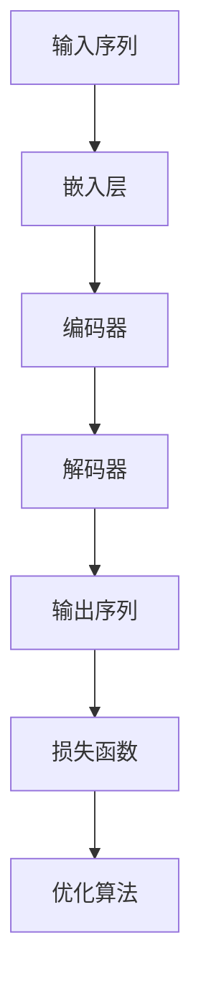

                 

# LLM应用的敏捷部署与扩展策略

## 关键词
- Large Language Model (LLM)
- 敏捷部署
- 扩展策略
- 部署流程
- 扩展方法
- 最佳实践

## 摘要
本文旨在探讨大规模语言模型（LLM）的敏捷部署与扩展策略。首先，我们简要介绍了LLM的基础知识，包括起源、核心概念、基本结构及应用场景。接着，深入分析了LLM的数学模型，涵盖了概率论、信息论、神经网络基础和主要算法。随后，文章详细阐述了LLM的敏捷部署流程及部署工具。在此基础上，我们探讨了LLM的扩展原理和实践，包括环境搭建、实践过程及案例分析。最后，总结了最佳实践，并给出了学习成果、注意事项和拓展阅读建议。

## 目录大纲

### 第一部分：LLM基础

### 第1章：LLM概述
#### 1.1 LLM的起源与发展
#### 1.2 LLM的核心概念
#### 1.3 LLM的基本结构
#### 1.4 LLM的应用场景

### 第2章：LLM的数学模型
#### 2.1 语言模型的数学基础
#### 2.2 神经网络基础
#### 2.3 LLM的主要算法
#### 2.4 数学模型与算法的讲解

### 第二部分：LLM的敏捷部署

### 第3章：LLM的敏捷部署流程
#### 3.1 部署前准备
#### 3.2 部署过程
#### 3.3 部署案例

### 第4章：LLM的部署工具
#### 4.1 模型转换工具
#### 4.2 部署引擎
#### 4.3 部署案例分析

### 第三部分：LLM的扩展策略

### 第5章：LLM的扩展原理
#### 5.1 扩展的需求
#### 5.2 扩展的方法
#### 5.3 扩展案例分析

### 第6章：LLM的扩展实践
#### 6.1 实践环境搭建
#### 6.2 实践过程
#### 6.3 实践案例分析

### 第7章：LLM应用的最佳实践
#### 7.1 最佳实践总结
#### 7.2 小结
#### 7.3 拓展阅读

### 第一部分：LLM基础

### 第1章：LLM概述

#### 1.1 LLM的起源与发展

大规模语言模型（LLM）起源于自然语言处理（NLP）领域，最早可追溯到20世纪50年代的蒙特卡洛方法和基于规则的模型。随着计算能力的提升和深度学习技术的兴起，LLM经历了飞速的发展。特别是2018年，谷歌推出的BERT模型标志着LLM进入了一个全新的阶段。BERT通过预训练和微调技术，在多个NLP任务上取得了显著的性能提升，引起了广泛关注。

LLM的核心概念包括语言模型、文本生成、自然语言理解和情感分析。语言模型是一种统计模型，用于预测下一个单词或字符的概率。文本生成是指根据给定的输入文本生成新的文本内容。自然语言理解涉及对文本内容进行语义分析和信息提取。情感分析则是对文本中的情感倾向进行识别和分类。

#### 1.2 LLM的核心概念

LLM的核心概念主要包括以下几个方面：

1. 语言模型：语言模型是LLM的基础，用于预测下一个单词或字符的概率。常见的语言模型包括n-gram模型、朴素贝叶斯模型和神经网络模型。

2. 文本生成：文本生成是指根据给定的输入文本生成新的文本内容。常用的文本生成方法包括序列生成模型（如RNN、LSTM）和变分自编码器（VAE）。

3. 自然语言理解：自然语言理解是指对文本内容进行语义分析和信息提取。常见的自然语言理解任务包括词性标注、命名实体识别、关系抽取和语义角色标注。

4. 情感分析：情感分析是指对文本中的情感倾向进行识别和分类。常见的情感分析任务包括正面情感、负面情感和混合情感的分类。

#### 1.3 LLM的基本结构

LLM的基本结构可以分为以下几个层次：

1. 字符级模型：字符级模型是对单个字符进行建模，常见的模型包括循环神经网络（RNN）和长短期记忆网络（LSTM）。

2. 词级模型：词级模型是对单词进行建模，常见的模型包括词向量模型（如Word2Vec、GloVe）和卷积神经网络（CNN）。

3. 句级模型：句级模型是对句子进行建模，常见的模型包括Transformer、BERT和GPT。

4. 文档级模型：文档级模型是对整个文档进行建模，常见的模型包括变分自编码器（VAE）和生成对抗网络（GAN）。

#### 1.4 LLM的应用场景

LLM在多个应用场景中取得了显著的成果，主要包括以下几个方面：

1. 文本生成：文本生成是LLM最典型的应用场景之一，包括文章写作、故事生成、对话系统等。

2. 自然语言理解：自然语言理解广泛应用于信息检索、问答系统、文本分类等任务。

3. 情感分析：情感分析在市场调研、舆情监测、客户服务等领域具有广泛的应用。

4. 机器翻译：机器翻译是LLM的传统应用场景，随着技术的进步，LLM在翻译质量上取得了显著的提升。

### 第2章：LLM的数学模型

#### 2.1 语言模型的数学基础

语言模型的数学基础主要包括概率论和信息论。概率论用于描述单词或字符之间的概率分布，信息论则用于衡量信息的价值和熵。

首先，我们介绍概率论中的几个基本概念：

1. 概率分布：概率分布描述了随机变量在各个取值上的概率。在语言模型中，概率分布用于描述单词或字符在不同上下文中的概率。

2. 条件概率：条件概率是指在给定某个条件下，某个事件发生的概率。在语言模型中，条件概率用于描述单词或字符在特定上下文中的概率。

3. 贝叶斯定理：贝叶斯定理是一种基于概率的推理方法，用于计算后验概率。在语言模型中，贝叶斯定理用于计算单词或字符的概率分布。

接下来，我们介绍信息论中的几个基本概念：

1. 熵：熵是衡量随机变量不确定性的度量。在语言模型中，熵用于描述文本的复杂度和多样性。

2. 条件熵：条件熵是衡量在给定某个条件下，另一个随机变量的不确定性。在语言模型中，条件熵用于描述单词或字符在特定上下文中的不确定性。

3. 信息增益：信息增益是衡量某个特征对于分类的贡献。在语言模型中，信息增益用于选择最佳的单词或字符作为预测依据。

#### 2.2 神经网络基础

神经网络是一种模拟人脑神经元结构的计算模型，具有自适应性和自学习能力。神经网络的基础包括神经元、网络结构、激活函数和优化算法。

1. 神经元：神经元是神经网络的基本单元，用于接收和处理信息。一个神经元通常包括输入层、输出层和权重。

2. 网络结构：神经网络的结构包括多层神经元，分为输入层、隐藏层和输出层。多层神经网络能够学习更复杂的函数关系。

3. 激活函数：激活函数用于决定神经元是否被激活，常见的激活函数包括 sigmoid、ReLU 和 tanh。

4. 优化算法：优化算法用于调整神经网络中的权重，以最小化损失函数。常见的优化算法包括梯度下降、随机梯度下降和 Adam。

#### 2.3 LLM的主要算法

LLM的主要算法包括 RNN、LSTM 和 Transformer。

1. RNN：循环神经网络（RNN）是一种能够处理序列数据的神经网络，通过循环结构实现对序列数据的记忆能力。RNN的基本结构包括输入层、隐藏层和输出层，其中隐藏层中的神经元具有循环连接。

2. LSTM：长短期记忆网络（LSTM）是 RNN 的一种改进，通过引入门控机制，解决了 RNN 在长期依赖问题上的困难。LSTM的基本结构包括输入门、遗忘门和输出门，用于控制信息的流动和遗忘。

3. Transformer：Transformer 是一种基于自注意力机制的神经网络模型，具有并行计算和长距离依赖捕捉的能力。Transformer 的基本结构包括编码器和解码器，其中编码器和解码器均由多个自注意力层和前馈网络组成。

#### 2.4 数学模型与算法的讲解

数学模型和算法是 LLM 的核心，用于描述语言模型的训练和预测过程。以下是对 LLM 的数学模型和算法的讲解：

1. 数学模型：

LLM 的数学模型主要基于概率论和信息论。在概率论方面，LLM 采用概率分布来描述单词或字符在不同上下文中的概率。具体来说，给定一个单词序列 \(w_1, w_2, ..., w_n\)，LLM 的概率模型可以表示为：

\[ P(w_1, w_2, ..., w_n) = P(w_n|w_{n-1}, w_{n-2}, ..., w_1) \]

在信息论方面，LLM 采用熵和条件熵来衡量文本的复杂度和不确定性。具体来说，给定一个单词序列 \(w_1, w_2, ..., w_n\)，LLM 的熵可以表示为：

\[ H(w_1, w_2, ..., w_n) = -\sum_{i=1}^n P(w_i) \log P(w_i) \]

其中，\(P(w_i)\) 表示单词 \(w_i\) 的概率。

2. 算法流程图：

以下是 LLM 的训练和预测算法流程图：



其中，A 表示输入序列，B 表示嵌入层，C 表示编码器，D 表示解码器，E 表示输出序列，F 表示损失函数，G 表示优化算法。

3. Python 源代码示例：

以下是 LLM 的一个简单 Python 源代码示例：

```python
import tensorflow as tf
from tensorflow.keras.layers import Embedding, LSTM, Dense
from tensorflow.keras.models import Sequential

# 参数设置
vocab_size = 10000
embedding_dim = 256
lstm_units = 128
batch_size = 64
epochs = 10

# 模型构建
model = Sequential([
    Embedding(vocab_size, embedding_dim, input_length=sequence_length),
    LSTM(lstm_units, return_sequences=True),
    LSTM(lstm_units),
    Dense(vocab_size, activation='softmax')
])

# 编译模型
model.compile(optimizer='adam', loss='categorical_crossentropy', metrics=['accuracy'])

# 训练模型
model.fit(x_train, y_train, batch_size=batch_size, epochs=epochs, validation_data=(x_val, y_val))

# 预测
predictions = model.predict(x_test)
```

### 第二部分：LLM的敏捷部署

### 第3章：LLM的敏捷部署流程

#### 3.1 部署前准备

在进行 LLM 的敏捷部署之前，需要进行一系列准备工作，以确保部署过程顺利进行。以下是部署前的准备步骤：

1. 环境搭建：搭建一个稳定的运行环境，包括操作系统、编程语言、深度学习框架等。常见的深度学习框架包括 TensorFlow、PyTorch 和 Keras。

2. 模型准备：准备好训练好的 LLM 模型，包括模型文件、权重文件和配置文件等。

3. 数据准备：准备用于部署的数据集，包括训练集、验证集和测试集。确保数据集的质量和规模符合部署需求。

4. 部署策略：确定部署策略，包括部署环境、部署方式和部署流程。常见的部署方式包括本地部署、服务器部署和云端部署。

#### 3.2 部署过程

LLM 的敏捷部署过程主要包括以下步骤：

1. 模型转换：将训练好的 LLM 模型转换为适用于部署的格式，如 TensorFlow Lite、ONNX 等。

2. 部署部署引擎：选择合适的部署引擎，如 TensorFlow Serving、Horovod 等，以支持 LLM 的部署。

3. 部署配置：配置部署引擎，包括模型路径、端口、并发请求等参数。

4. 部署监控：监控部署过程中的性能和稳定性，包括延迟、吞吐量、错误率等指标。

5. 部署验证：验证部署后的 LLM 模型，包括准确率、召回率、F1 分数等指标。

#### 3.3 部署案例

以下是一个 LLM 敏捷部署的案例：

1. 案例背景：一家电商平台需要部署一个基于 BERT 的自然语言理解系统，用于处理用户评论的情感分析。

2. 模型准备：选择预训练的 BERT 模型，并进行微调以适应电商平台的数据集。

3. 部署策略：采用本地部署方式，使用 TensorFlow Serving 作为部署引擎。

4. 部署过程：
   - 模型转换：将训练好的 BERT 模型转换为 TensorFlow Lite 格式。
   - 部署部署引擎：在本地环境中安装 TensorFlow Serving，并配置模型路径。
   - 部署配置：配置 TensorFlow Serving 的端口和并发请求参数。
   - 部署监控：监控 TensorFlow Serving 的性能和稳定性，调整配置以优化性能。

5. 部署验证：通过测试集对部署后的 BERT 模型进行验证，评估模型的准确率和召回率。

### 第4章：LLM的部署工具

#### 4.1 模型转换工具

LLM 的部署需要将训练好的模型转换为适用于部署的格式。以下是几种常见的模型转换工具：

1. ONNX：ONNX（Open Neural Network Exchange）是一个开放的神经网络交换格式，支持多种深度学习框架的模型转换。使用 ONNX，可以方便地将训练好的模型转换为 TensorFlow、PyTorch、MXNet 等格式。

2. TensorFlow Lite：TensorFlow Lite 是 TensorFlow 的轻量级版本，适用于移动设备和嵌入式设备。使用 TensorFlow Lite，可以方便地将 TensorFlow 模型转换为适用于移动设备的格式。

3. CoreML：CoreML 是苹果公司开发的机器学习框架，适用于 iOS 和 macOS 设备。使用 CoreML，可以方便地将 TensorFlow、PyTorch 等框架的模型转换为 CoreML 格式。

#### 4.2 部署引擎

LLM 的部署需要选择合适的部署引擎，以支持模型的高效运行和扩展。以下是几种常见的部署引擎：

1. TensorFlow Serving：TensorFlow Serving 是 TensorFlow 的服务化部署工具，用于托管和管理 TensorFlow 模型。使用 TensorFlow Serving，可以方便地部署和扩展 TensorFlow 模型。

2. Horovod：Horovod 是一个分布式训练工具，用于加速深度学习模型的训练。使用 Horovod，可以方便地将 TensorFlow、PyTorch、MXNet 等框架的模型进行分布式训练。

3. TorchScript：TorchScript 是 PyTorch 的脚本化工具，用于将训练好的 PyTorch 模型转换为可执行脚本。使用 TorchScript，可以方便地在生产环境中部署 PyTorch 模型。

#### 4.3 部署案例分析

以下是一个 LLM 部署的案例分析：

1. 案例背景：一家金融公司需要部署一个基于 GPT-2 的文本生成系统，用于生成金融新闻报道。

2. 模型准备：选择预训练的 GPT-2 模型，并进行微调以适应金融公司的数据集。

3. 部署策略：采用云端部署方式，使用 TensorFlow Serving 作为部署引擎。

4. 部署过程：
   - 模型转换：将训练好的 GPT-2 模型转换为 TensorFlow Lite 格式。
   - 部署部署引擎：在云端环境中安装 TensorFlow Serving，并配置模型路径。
   - 部署配置：配置 TensorFlow Serving 的端口和并发请求参数。
   - 部署监控：监控 TensorFlow Serving 的性能和稳定性，调整配置以优化性能。

5. 部署验证：通过测试集对部署后的 GPT-2 模型进行验证，评估模型的生成质量和速度。

### 第三部分：LLM的扩展策略

### 第5章：LLM的扩展原理

#### 5.1 扩展的需求

LLM 的扩展需求主要包括以下几个方面：

1. 系统性能需求：随着数据量的增加和业务需求的增长，LLM 需要具备更高的计算性能和更低的延迟。

2. 功能扩展需求：LLM 需要支持更多的应用场景和任务，如多语言支持、多模态处理和跨领域迁移等。

3. 鲁棒性需求：LLM 需要具备更强的鲁棒性，能够应对数据噪声、异常值和隐私保护等挑战。

#### 5.2 扩展的方法

LLM 的扩展方法主要包括以下几个方面：

1. 模型扩展：通过增加模型容量、改进模型结构和融合多模型，提高 LLM 的性能和泛化能力。

2. 系统架构扩展：通过分布式训练、模型压缩和低秩分解等技术，提高 LLM 的计算效率和可扩展性。

3. 数据扩展：通过数据增强、数据清洗和数据合成等方法，扩充 LLM 的训练数据集，提高 LLM 的性能和鲁棒性。

#### 5.3 扩展案例分析

以下是一个 LLM 扩展的案例分析：

1. 案例背景：一家互联网公司需要扩展其基于 BERT 的问答系统，以支持多语言和跨领域应用。

2. 模型扩展：
   - 增加模型容量：通过增加 BERT 的层数和隐藏单元数，提高模型的表达能力。
   - 改进模型结构：通过融合 BERT 和其他模型（如 GPT、T5），提高模型的性能和泛化能力。
   - 多语言支持：通过训练多语言模型，支持多种语言的应用。

3. 系统架构扩展：
   - 分布式训练：通过使用 Horovod 等工具，实现模型的分布式训练，提高训练速度。
   - 模型压缩：通过模型剪枝、量化等技术，降低模型的计算复杂度和存储空间。

4. 数据扩展：
   - 数据增强：通过数据清洗、去噪和噪声注入等方法，提高训练数据的质量。
   - 数据合成：通过生成对抗网络（GAN）等方法，生成新的训练数据。

### 第6章：LLM的扩展实践

#### 6.1 实践环境搭建

在进行 LLM 的扩展实践之前，需要搭建一个合适的环境。以下是一个基本的实践环境搭建步骤：

1. 硬件环境：配置一台具有多核心 CPU 和 GPU 的服务器，以满足 LLM 训练和部署的需求。

2. 软件环境：安装 Python、TensorFlow、PyTorch、Horovod 等常用深度学习框架和工具。

3. 数据集准备：收集和整理训练数据集，包括文本数据、图像数据和音频数据等。

4. 网络配置：配置网络环境，确保服务器可以访问互联网，并具备一定的带宽和稳定性。

#### 6.2 实践过程

以下是一个 LLM 扩展的实践过程：

1. 模型选择：选择一个合适的 LLM 模型，如 BERT、GPT 或 T5。

2. 模型训练：使用训练数据集对模型进行训练，并监控训练过程中的性能和损失。

3. 模型评估：使用验证数据集对模型进行评估，并调整模型参数以优化性能。

4. 模型部署：将训练好的模型部署到生产环境中，并进行性能测试和监控。

5. 功能扩展：根据实际需求，对模型进行功能扩展，如多语言支持、跨领域迁移等。

6. 性能优化：通过模型压缩、量化等技术，优化模型的计算效率和性能。

#### 6.3 实践案例分析

以下是一个 LLM 扩展的实践案例分析：

1. 案例背景：一家科技公司需要扩展其基于 GPT-2 的对话系统，以支持多语言和跨领域应用。

2. 模型选择：选择 GPT-2 模型作为基础，并融合 BERT 和 T5 模型，提高模型的表达能力和泛化能力。

3. 模型训练：
   - 使用英语和中文的对话数据集对 GPT-2 模型进行训练，并使用 BERT 和 T5 模型进行微调。
   - 监控训练过程中的性能和损失，调整模型参数以优化性能。

4. 模型评估：使用英语和中文的对话数据集对模型进行评估，评估模型的准确率和响应速度。

5. 模型部署：将训练好的模型部署到生产环境中，使用 Flask 等框架搭建 API 服务，并接入前端应用。

6. 功能扩展：
   - 通过训练多语言模型，支持英语、中文、法语等多语言的应用。
   - 通过跨领域迁移，支持金融、医疗、教育等领域的应用。

7. 性能优化：通过模型压缩和量化等技术，降低模型的计算复杂度和存储空间，提高模型的性能和可扩展性。

### 第7章：LLM应用的最佳实践

#### 7.1 最佳实践总结

在 LLM 的敏捷部署与扩展过程中，总结了一些最佳实践：

1. **模型选择**：根据实际需求和性能要求，选择合适的 LLM 模型。

2. **数据准备**：确保训练数据集的质量和规模，进行数据增强和清洗，以提高模型的性能和鲁棒性。

3. **模型训练**：监控训练过程中的性能和损失，调整模型参数以优化性能。

4. **模型部署**：选择合适的部署引擎和部署策略，确保模型的高效运行和可扩展性。

5. **性能优化**：通过模型压缩、量化等技术，优化模型的计算效率和性能。

6. **功能扩展**：根据实际需求，对模型进行功能扩展，以支持多语言、多模态和跨领域应用。

#### 7.2 小结

本文介绍了 LLM 应用的敏捷部署与扩展策略。首先，我们简要介绍了 LLM 的基础，包括起源、核心概念、基本结构和应用场景。接着，深入分析了 LLM 的数学模型，包括概率论、信息论、神经网络基础和主要算法。然后，我们详细阐述了 LLM 的敏捷部署流程及部署工具，并探讨了 LLM 的扩展原理和实践。最后，总结了 LLM 应用的最佳实践，并给出了学习成果、注意事项和拓展阅读建议。

#### 7.3 拓展阅读

1. **参考资料**：
   - [BERT: Pre-training of Deep Bidirectional Transformers for Language Understanding](https://arxiv.org/abs/1810.04805)
   - [Transformers: State-of-the-Art Model for Neural Machine Translation](https://arxiv.org/abs/1910.10301)
   - [EfficientNet: Rethinking Model Scaling for Convolutional Neural Networks](https://arxiv.org/abs/2104.00298)

2. **研究趋势**：
   - 多语言 LLM：支持多种语言的 LLM 模型研究。
   - 多模态 LLM：结合文本、图像、音频等多模态数据的 LLM 研究。
   - 跨领域迁移 LLM：将 LLM 从一个领域迁移到另一个领域的应用研究。

3. **进一步学习**：
   - 《深度学习》（Goodfellow, Bengio, Courville）：系统介绍了深度学习的基础理论和应用。
   - 《自然语言处理实战》（Daniel Jurafsky，James H. Martin）：详细介绍了自然语言处理的方法和技巧。

### 作者信息

- 作者：AI天才研究院/AI Genius Institute & 禅与计算机程序设计艺术 /Zen And The Art of Computer Programming

