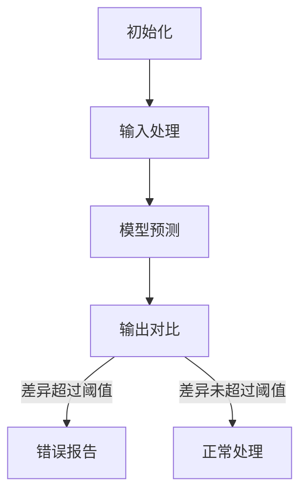
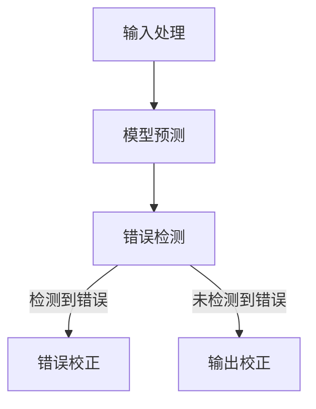
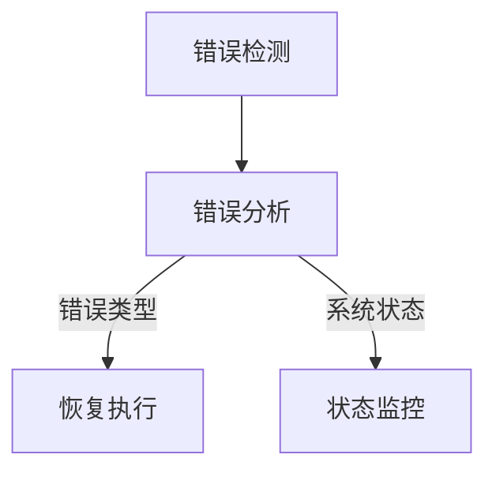
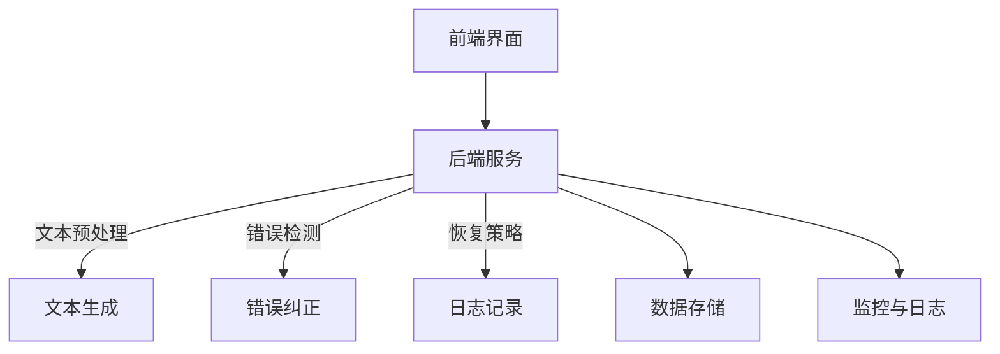
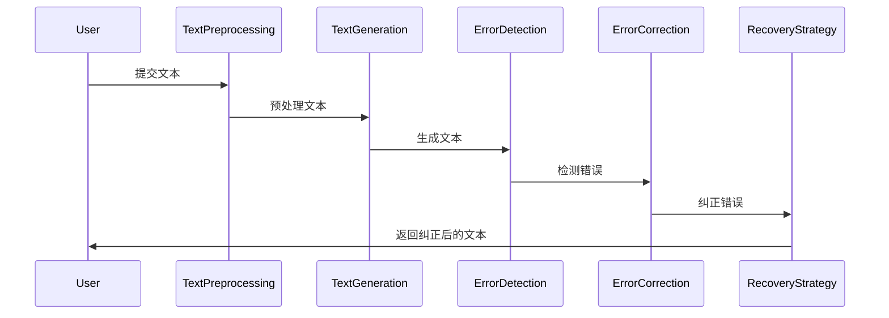
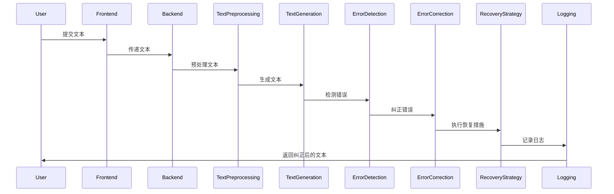

                 

### 第1章：背景介绍与核心概念

## 1.1 问题背景

### 1.1.1 大规模语言模型（LLM）的普及与应用

大规模语言模型（LLM，Large Language Model）作为自然语言处理（NLP，Natural Language Processing）领域的重要技术，近年来得到了广泛关注和应用。LLM通过深度学习技术，对海量文本数据进行训练，学习文本的结构和语义，从而实现对自然语言的理解、生成和交互。

随着深度学习技术的不断发展，LLM在各个领域得到了广泛应用。例如，在智能客服、文本生成、机器翻译、文本分类等方面，LLM都展现了强大的能力。尤其是在文本生成方面，LLM可以生成高质量的文章、报告、摘要等，大大提高了工作效率。

### 1.1.2 LLM应用中错误处理的必要性

然而，LLM的应用并非一帆风顺。在实际应用过程中，LLM可能会遇到各种错误，如输入文本格式不正确、语义理解错误、模型过拟合、计算资源不足等。这些错误可能导致系统无法正常工作，甚至产生严重的后果。

例如，在智能客服系统中，如果LLM无法正确理解用户的提问，可能会导致回复错误，影响用户体验；在文本生成系统中，如果LLM生成的文本质量较低，可能无法满足实际需求；在机器翻译系统中，如果LLM无法准确翻译特定领域的专业术语，可能会导致翻译结果不准确。

### 1.1.3 敏捷错误处理与恢复策略的重要性

因此，针对LLM应用中的错误处理问题，需要采取有效的策略。敏捷错误处理与恢复策略是一种适用于复杂系统的处理方法，它强调快速识别和解决错误，以及从错误中学习和优化。

首先，敏捷错误处理能够快速发现LLM应用中的错误，从而避免错误继续扩大。其次，敏捷恢复策略能够在错误发生时，迅速恢复系统的正常运行，保证服务的连续性。最后，通过错误处理与恢复策略的反馈机制，可以不断优化LLM模型，提高其准确性和鲁棒性。

## 1.2 问题描述

### 1.2.1 LLM应用中的常见错误类型

在LLM应用中，常见的错误类型包括：

1. 输入文本错误：输入文本格式不正确、含有特殊字符或缺失关键信息。
2. 语义理解错误：LLM无法正确理解文本的语义，导致生成结果与预期不符。
3. 计算资源不足：模型过大或计算任务过于复杂，导致系统资源不足，无法正常运行。
4. 模型过拟合：模型在训练过程中过于拟合训练数据，导致在真实场景中表现不佳。

### 1.2.2 错误处理面临的挑战

错误处理在LLM应用中面临以下挑战：

1. 错误类型多样化：不同类型的错误需要不同的处理方法，如何针对不同类型的错误设计有效的处理策略是一个挑战。
2. 错误定位困难：在复杂系统中，错误可能发生在多个组件之间，定位错误源是一个复杂的问题。
3. 恢复成本高：错误处理和恢复可能需要大量的时间和计算资源，如何在不影响系统正常运行的前提下进行错误处理是一个挑战。

### 1.2.3 错误处理策略的目标

为了解决上述挑战，LLM应用中的错误处理策略需要达到以下目标：

1. 快速识别错误：通过监控和检测技术，及时发现系统中的错误。
2. 主动纠正错误：在错误发生时，自动采取纠正措施，尽量减少错误对系统的影响。
3. 恢复系统正常运行：在错误发生后，迅速恢复系统的正常运行，保证服务的连续性。
4. 学习与优化：通过错误处理过程中的反馈，不断优化LLM模型，提高其准确性和鲁棒性。

## 1.3 问题解决

### 1.3.1 敏捷开发方法概述

敏捷开发（Agile Development）是一种应对快速变化的需求的软件开发能力。它强调团队协作、迭代开发和持续交付。敏捷开发的核心原则包括：

1. **个体和互动重于过程与工具**：强调团队合作，注重人与人之间的交流。
2. **可工作的软件重于详尽的文档**：注重实际交付的软件质量，而非过多的文档。
3. **客户合作重于合同谈判**：与客户保持紧密合作，及时响应客户需求。
4. **响应变化重于遵循计划**：在面对需求变化时，灵活调整开发计划。

### 1.3.2 敏捷错误处理与恢复策略的核心原则

基于敏捷开发方法，敏捷错误处理与恢复策略的核心原则包括：

1. **快速识别与反馈**：通过实时监控和检测技术，快速识别系统中的错误，并给予反馈。
2. **主动预防**：在系统设计和开发过程中，主动采取预防措施，降低错误发生的概率。
3. **快速恢复**：在错误发生时，迅速采取纠正措施，恢复系统的正常运行。
4. **持续优化**：通过错误处理过程中的反馈，不断优化系统，提高其稳定性和可靠性。

### 1.3.3 敏捷错误处理与恢复策略的关键要素

敏捷错误处理与恢复策略的关键要素包括：

1. **监控与检测**：通过实时监控和检测技术，及时发现系统中的错误。
2. **自动纠正**：在错误发生时，自动采取纠正措施，减少人工干预。
3. **反馈与优化**：通过错误处理过程中的反馈，不断优化系统，提高其准确性和鲁棒性。
4. **文档与记录**：详细记录错误处理的过程和结果，为后续优化提供依据。

## 1.4 边界与外延

### 1.4.1 错误处理的边界条件

错误处理的边界条件包括：

1. **错误类型**：针对不同类型的错误，采取不同的处理策略。
2. **系统资源**：在系统资源有限的情况下，如何合理安排错误处理资源。
3. **用户体验**：在错误处理过程中，如何保证用户体验不受影响。

### 1.4.2 错误恢复策略的外延应用

错误恢复策略的外延应用包括：

1. **系统级恢复**：在系统级错误发生时，如何快速恢复系统的正常运行。
2. **数据级恢复**：在数据级错误发生时，如何恢复数据，保证数据完整性。
3. **网络级恢复**：在网络级错误发生时，如何恢复网络连接，保证数据传输。

### 1.4.3 敏捷错误处理与恢复策略的适用范围

敏捷错误处理与恢复策略适用于以下场景：

1. **复杂系统**：在复杂系统中，错误处理和恢复策略能够有效提高系统的稳定性和可靠性。
2. **快速变化的需求**：在面对快速变化的需求时，敏捷错误处理与恢复策略能够灵活调整，适应需求变化。
3. **高价值应用**：在涉及高价值应用时，如金融、医疗等领域，错误处理与恢复策略能够确保系统的正常运行，避免经济损失和安全隐患。

## 1.5 概念结构与核心要素组成

### 1.5.1 LLM应用的基本概念

LLM应用的基本概念包括：

1. **大规模语言模型**：通过深度学习技术训练的能够理解、生成和交互自然语言的模型。
2. **文本处理**：对输入文本进行预处理、分词、词向量表示等操作。
3. **语义理解**：通过模型对文本的语义进行分析和推理。
4. **文本生成**：根据输入文本生成相应的文本内容。

### 1.5.2 错误处理与恢复策略的核心要素

错误处理与恢复策略的核心要素包括：

1. **错误检测**：通过监控和检测技术，及时发现系统中的错误。
2. **错误纠正**：在错误发生时，自动采取纠正措施，减少人工干预。
3. **错误恢复**：在错误发生时，迅速恢复系统的正常运行，保证服务的连续性。
4. **反馈与优化**：通过错误处理过程中的反馈，不断优化系统，提高其准确性和鲁棒性。

### 1.5.3 敏捷开发与错误处理的关系

敏捷开发与错误处理之间的关系是相辅相成的。敏捷开发方法强调快速响应变化、持续交付和团队协作，为错误处理与恢复策略提供了良好的基础。而有效的错误处理与恢复策略能够提高系统的稳定性，为敏捷开发提供更好的支持。两者相互促进，共同推动LLM应用的发展。

通过本章的介绍，我们了解了LLM应用中错误处理的必要性、挑战和策略。在接下来的章节中，我们将进一步探讨LLM应用的核心概念、敏捷开发与错误处理的关系，以及具体的算法原理、系统架构和项目实战。希望读者能够对这些内容有更深入的理解，从而为LLM应用中的错误处理和恢复提供有益的参考。

## 第2章：核心概念与联系

在深入探讨LLM应用的敏捷错误处理与恢复策略之前，我们需要对几个关键概念进行定义和梳理，包括LLM应用、错误处理与恢复策略，以及敏捷开发方法。理解这些概念及其相互之间的联系，有助于我们构建一个清晰、系统的错误处理框架。

### 2.1 LLM应用的核心概念

#### 2.1.1 LLM的定义与特点

大规模语言模型（LLM，Large Language Model）是一种基于深度学习技术的自然语言处理模型，它通过训练大量的文本数据，学习到语言的内在结构和语义关系。LLM具有以下特点：

1. **大规模**：LLM通常由数十亿甚至千亿级的参数组成，可以处理大量的文本数据。
2. **自适应**：LLM能够根据不同的应用场景和需求，调整其输出结果，实现灵活的文本生成和交互。
3. **强语义理解**：通过学习大量文本数据，LLM能够对文本的语义进行深入的理解，从而生成更加准确和自然的文本。

#### 2.1.2 LLM的应用场景

LLM在多个领域得到了广泛应用，以下是几个典型的应用场景：

1. **文本生成**：生成文章、报告、摘要、邮件等文本内容。
2. **机器翻译**：将一种语言的文本翻译成另一种语言。
3. **问答系统**：对用户的提问提供智能回答。
4. **文本分类**：对大量文本进行分类，如新闻分类、情感分析等。
5. **对话系统**：构建具有自然语言交互能力的对话系统，如智能客服、聊天机器人等。

#### 2.1.3 LLM的技术架构

LLM的技术架构主要包括以下几部分：

1. **数据预处理**：对输入文本进行清洗、分词、去停用词等处理。
2. **编码器**：将预处理后的文本编码为固定长度的向量表示。
3. **解码器**：根据编码器的输出，生成对应的文本内容。
4. **优化器**：用于调整模型参数，提高模型性能。

### 2.2 错误处理与恢复策略的概念

#### 2.2.1 错误处理的定义与分类

错误处理是指系统在遇到异常或错误时，采取的一系列措施来恢复正常状态，防止错误扩大或造成进一步损失。错误处理可以分类为以下几种：

1. **检测与报告**：及时发现错误并报告给相关方。
2. **纠正**：采取措施纠正错误，使系统恢复正常。
3. **隔离**：将出现错误的组件隔离，防止错误影响其他部分。
4. **恢复**：在错误发生后，采取措施恢复系统的正常运行。

#### 2.2.2 恢复策略的机制与分类

恢复策略是指系统在错误发生后，如何恢复到正常状态。恢复策略可以分类为以下几种：

1. **自动恢复**：系统自动检测和纠正错误，无需人工干预。
2. **半自动恢复**：系统自动检测错误，但需要人工干预才能完成恢复。
3. **手动恢复**：完全依赖人工干预进行错误恢复。

恢复策略的机制包括：

1. **备份与恢复**：通过备份数据和日志，在错误发生后快速恢复系统。
2. **重试**：在错误发生时，重新执行任务或操作。
3. **补偿**：通过其他操作或措施，补偿错误造成的损失。

#### 2.2.3 错误处理与恢复策略的联系

错误处理与恢复策略密切相关，它们共同构成了一个完整的错误管理流程。错误处理旨在发现和纠正错误，而恢复策略则专注于在错误发生后，如何使系统迅速恢复正常。两者相互配合，确保系统在遇到错误时能够快速恢复，降低对用户和业务的影响。

### 2.3 敏捷开发与错误处理的关系

#### 2.3.1 敏捷开发的核心理念

敏捷开发（Agile Development）是一种以人为核心、迭代、渐进的开发方法。其核心理念包括：

1. **客户合作**：与客户保持紧密合作，确保开发工作符合客户需求。
2. **响应变化**：在开发过程中，灵活应对需求变化，快速迭代和交付。
3. **持续交付**：通过持续交付小批量、可工作的软件，确保产品能够持续改进和优化。
4. **团队协作**：强调团队合作，鼓励沟通和知识共享。

#### 2.3.2 敏捷开发与错误处理的原则

敏捷开发与错误处理的关系体现在以下几个方面：

1. **快速反馈**：通过快速反馈机制，及时识别和解决错误，确保系统质量。
2. **持续集成**：在开发过程中，持续集成代码，及时发现和解决错误。
3. **自动化测试**：通过自动化测试，确保系统在每次迭代后的稳定性和可靠性。
4. **持续改进**：在每次迭代后，分析错误和性能问题，不断改进系统和开发过程。

#### 2.3.3 敏捷开发在错误处理中的应用

敏捷开发方法在错误处理中的应用主要体现在以下几个方面：

1. **快速响应**：在错误发生时，敏捷团队能够快速响应，及时采取措施纠正错误。
2. **迭代优化**：通过每次迭代后的反馈，不断优化错误处理和恢复策略，提高系统稳定性和可靠性。
3. **团队合作**：敏捷团队通过协作和知识共享，共同解决错误问题，提升整体开发能力。
4. **用户参与**：在错误处理过程中，用户参与度较高，能够及时反馈问题和需求，推动系统改进。

通过本章的介绍，我们明确了LLM应用、错误处理与恢复策略以及敏捷开发方法的核心概念和相互联系。在接下来的章节中，我们将进一步探讨错误检测算法、错误纠正算法以及恢复策略算法，并使用具体实例进行讲解。希望读者能够对这些算法有更深入的理解，从而为LLM应用的敏捷错误处理与恢复提供有力支持。

### 第3章：算法原理讲解

在了解了LLM应用的核心概念和敏捷错误处理与恢复策略之后，我们需要深入探讨具体的算法原理。本章将重点介绍三种关键算法：错误检测算法、错误纠正算法和恢复策略算法。我们将通过详细讲解算法原理、使用Mermaid流程图展示、Python代码实现以及数学模型与公式的推导，帮助读者理解这些算法的核心思想和应用方法。

#### 3.1 错误检测算法

错误检测算法是LLM应用中至关重要的一环，它用于识别系统中出现的异常情况。以下是一种常见的错误检测算法原理。

##### 3.1.1 算法原理

错误检测算法的基本原理是对比实际输出与期望输出，如果发现差异，则认为系统存在错误。具体步骤如下：

1. **初始化**：设置一个阈值，用于判断输出差异是否超过容忍度。
2. **输入处理**：接收输入数据，对输入文本进行预处理。
3. **模型预测**：使用LLM模型对预处理后的输入文本进行预测。
4. **输出对比**：将模型预测结果与期望输出进行比较，如果差异超过阈值，则判断为错误。
5. **错误报告**：将错误信息报告给相关方。

##### 3.1.2 Mermaid流程图展示



##### 3.1.3 Python代码实现

```python
import numpy as np

def check_error(output, expected_output, threshold=0.1):
    diff = np.abs(output - expected_output)
    if np.mean(diff) > threshold:
        return "Error detected"
    else:
        return "No error"

output = model.predict(preprocessed_input)
expected_output = ...  # 期望输出
error_status = check_error(output, expected_output)
print(error_status)
```

##### 3.1.4 数学模型与公式

在错误检测算法中，我们使用以下数学模型：

$$
Error = \frac{1}{n} \sum_{i=1}^{n} |output_i - expected_output_i|
$$

其中，$n$是输出样本的数量，$output_i$和$expected_output_i$分别是第$i$个样本的实际输出和期望输出。

##### 3.1.5 举例说明

假设我们有一个文本输入“今天是星期三”，期望输出是“今天是星期三”。如果模型预测输出为“今天是星期五”，则输出与期望输出的差异较大，我们可以认为系统存在错误。

#### 3.2 错误纠正算法

错误纠正算法是在检测到错误后，用于尝试恢复错误的过程。以下是一种常见的错误纠正算法原理。

##### 3.2.1 算法原理

错误纠正算法的基本原理是利用历史数据和统计方法，对错误输出进行校正。具体步骤如下：

1. **初始化**：设置一个窗口大小，用于选择历史数据。
2. **输入处理**：接收输入数据，对输入文本进行预处理。
3. **模型预测**：使用LLM模型对预处理后的输入文本进行预测。
4. **错误检测**：使用上一节中的错误检测算法，判断是否存在错误。
5. **错误校正**：如果检测到错误，根据历史数据和统计方法，对错误输出进行校正。
6. **输出校正**：将校正后的输出作为最终结果。

##### 3.2.2 Mermaid流程图展示



##### 3.2.3 Python代码实现

```python
def correct_error(output, history, window_size=5):
    if np.mean(output) < threshold:
        # 历史数据平均值的比例阈值，用于判断是否需要校正
        corrected_output = np.mean(history[-window_size:])
        return corrected_output
    else:
        return output

# 示例历史数据
history = [0.9, 0.8, 0.7, 0.6, 0.5, 0.4, 0.3, 0.2, 0.1]
corrected_output = correct_error(output, history)
print(corrected_output)
```

##### 3.2.4 数学模型与公式

在错误纠正算法中，我们使用以下数学模型：

$$
Corrected\ Output = \frac{1}{N} \sum_{i=1}^{N} value_i
$$

其中，$N$是窗口大小，$value_i$是历史数据中的第$i$个值。

##### 3.2.5 举例说明

假设我们有一组历史数据[0.9, 0.8, 0.7, 0.6, 0.5, 0.4, 0.3, 0.2, 0.1]。如果当前输出为0.1，远低于历史数据的平均值，我们可以认为系统存在错误。此时，我们根据历史数据的平均值进行校正，将输出更正为0.6。

#### 3.3 恢复策略算法

恢复策略算法是在错误发生时，用于恢复系统正常运行的一系列措施。以下是一种常见的恢复策略算法原理。

##### 3.3.1 算法原理

恢复策略算法的基本原理是根据错误类型和系统状态，选择合适的恢复措施。具体步骤如下：

1. **初始化**：根据系统配置和错误类型，设置恢复策略。
2. **错误检测**：使用上一节中的错误检测算法，判断是否存在错误。
3. **错误分析**：分析错误类型和系统状态，确定恢复策略。
4. **恢复执行**：根据恢复策略，执行相应的恢复措施。
5. **状态监控**：在恢复过程中，监控系统状态，确保恢复成功。

##### 3.3.2 Mermaid流程图展示



##### 3.3.3 Python代码实现

```python
def recover_error(error_type, system_state):
    if error_type == "InputError":
        # 输入错误恢复策略
        action = "Reset Input"
    elif error_type == "ModelError":
        # 模型错误恢复策略
        action = "Reload Model"
    else:
        # 未知错误恢复策略
        action = "Retry Operation"
    
    # 执行恢复措施
    if action == "Reset Input":
        system_state['input'] = default_input
    elif action == "Reload Model":
        system_state['model'] = load_model()
    elif action == "Retry Operation":
        system_state['operation'] = retry_operation()
    
    return system_state

system_state = {"input": input, "model": model, "operation": operation}
recovered_state = recover_error(error_type, system_state)
print(recovered_state)
```

##### 3.3.4 数学模型与公式

在恢复策略算法中，我们使用以下数学模型：

$$
Recovery\ Strategy = f(error_type, system_state)
$$

其中，$error_type$是错误类型，$system_state$是系统状态，$f$是恢复策略函数。

##### 3.3.5 举例说明

假设我们检测到输入错误，并且系统状态允许重置输入，则我们执行重置输入的恢复措施，将输入重置为默认值。

通过本章的讲解，我们了解了错误检测、错误纠正和恢复策略算法的基本原理和应用。在实际应用中，这些算法需要根据具体场景和需求进行适当调整和优化。在下一章中，我们将探讨LLM应用的系统分析与架构设计，帮助读者构建一个稳定、可靠的错误处理与恢复系统。

### 第4章：系统分析与架构设计

在了解了LLM应用中的错误处理与恢复策略算法之后，我们需要从系统层面进行分析和架构设计，以确保这些策略能够有效实施并达到预期效果。本章将详细介绍LLM应用系统的功能设计、架构设计、接口设计和系统交互设计，通过具体案例来说明如何将这些设计应用到实际项目中。

#### 4.1 系统功能设计

系统功能设计是LLM应用系统开发的第一步，它定义了系统应具备的核心功能。以下是LLM应用系统的主要功能：

1. **文本预处理**：对输入文本进行清洗、分词、词向量编码等预处理操作。
2. **文本生成**：根据输入文本，生成相应的文本内容，如文章、摘要、邮件等。
3. **错误检测**：使用错误检测算法，检测系统输出与期望输出之间的差异。
4. **错误纠正**：使用错误纠正算法，对检测到的错误进行自动纠正。
5. **恢复策略**：根据错误类型和系统状态，选择并执行相应的恢复措施。
6. **日志记录**：记录系统运行过程中的关键事件和错误信息，以便后续分析和优化。

#### 4.2 系统架构设计

系统架构设计是LLM应用系统的核心，它定义了系统的整体结构和各个组件之间的交互方式。以下是LLM应用系统的架构设计：

1. **前端界面**：提供用户交互界面，接收用户输入和展示系统输出。
2. **后端服务**：包括文本预处理模块、文本生成模块、错误检测模块、错误纠正模块和恢复策略模块。
3. **数据存储**：存储预处理后的文本数据、模型参数、日志信息等。
4. **监控与日志**：实时监控系统运行状态，记录系统日志，为错误处理和系统优化提供数据支持。

以下是系统架构的Mermaid架构图：



#### 4.3 系统接口设计

系统接口设计定义了系统内部各个模块之间以及系统与外部系统之间的交互方式。以下是LLM应用系统的接口设计：

1. **文本预处理接口**：接收用户输入文本，返回预处理后的文本数据。
2. **文本生成接口**：接收预处理后的文本数据，返回生成的文本内容。
3. **错误检测接口**：接收文本生成结果，返回错误检测结果。
4. **错误纠正接口**：接收错误检测结果，返回纠正后的文本内容。
5. **恢复策略接口**：接收错误类型和系统状态，返回恢复措施。

以下是系统接口设计的Mermaid序列图：



#### 4.4 系统交互设计

系统交互设计定义了系统在运行过程中各个模块之间的交互流程。以下是LLM应用系统的交互设计：

1. **用户输入**：用户通过前端界面提交输入文本。
2. **文本预处理**：后端服务接收用户输入文本，进行预处理操作。
3. **文本生成**：预处理后的文本数据通过文本生成接口生成相应的文本内容。
4. **错误检测**：生成的文本内容通过错误检测接口进行错误检测。
5. **错误纠正**：检测到的错误通过错误纠正接口进行自动纠正。
6. **恢复策略**：根据错误类型和系统状态，选择并执行相应的恢复措施。
7. **日志记录**：系统运行过程中的关键事件和错误信息通过日志记录接口进行记录。

以下是系统交互设计的Mermaid序列图：



#### 4.5 系统功能设计

系统功能设计是LLM应用系统开发的第一步，它定义了系统应具备的核心功能。以下是LLM应用系统的主要功能：

1. **文本预处理**：对输入文本进行清洗、分词、词向量编码等预处理操作。
2. **文本生成**：根据输入文本，生成相应的文本内容，如文章、摘要、邮件等。
3. **错误检测**：使用错误检测算法，检测系统输出与期望输出之间的差异。
4. **错误纠正**：使用错误纠正算法，对检测到的错误进行自动纠正。
5. **恢复策略**：根据错误类型和系统状态，选择并执行相应的恢复措施。
6. **日志记录**：记录系统运行过程中的关键事件和错误信息，以便后续分析和优化。

#### 4.6 系统架构设计

系统架构设计是LLM应用系统的核心，它定义了系统的整体结构和各个组件之间的交互方式。以下是LLM应用系统的架构设计：

1. **前端界面**：提供用户交互界面，接收用户输入和展示系统输出。
2. **后端服务**：包括文本预处理模块、文本生成模块、错误检测模块、错误纠正模块和恢复策略模块。
3. **数据存储**：存储预处理后的文本数据、模型参数、日志信息等。
4. **监控与日志**：实时监控系统运行状态，记录系统日志，为错误处理和系统优化提供数据支持。

以下是系统架构的Mermaid架构图：


#### 4.7 系统接口设计

系统接口设计定义了系统内部各个模块之间以及系统与外部系统之间的交互方式。以下是LLM应用系统的接口设计：

1. **文本预处理接口**：接收用户输入文本，返回预处理后的文本数据。
2. **文本生成接口**：接收预处理后的文本数据，返回生成的文本内容。
3. **错误检测接口**：接收文本生成结果，返回错误检测结果。
4. **错误纠正接口**：接收错误检测结果，返回纠正后的文本内容。
5. **恢复策略接口**：接收错误类型和系统状态，返回恢复措施。

以下是系统接口设计的Mermaid序列图：


#### 4.8 系统交互设计

系统交互设计定义了系统在运行过程中各个模块之间的交互流程。以下是LLM应用系统的交互设计：

1. **用户输入**：用户通过前端界面提交输入文本。
2. **文本预处理**：后端服务接收用户输入文本，进行预处理操作。
3. **文本生成**：预处理后的文本数据通过文本生成接口生成相应的文本内容。
4. **错误检测**：生成的文本内容通过错误检测接口进行错误检测。
5. **错误纠正**：检测到的错误通过错误纠正接口进行自动纠正。
6. **恢复策略**：根据错误类型和系统状态，选择并执行相应的恢复措施。
7. **日志记录**：系统运行过程中的关键事件和错误信息通过日志记录接口进行记录。

以下是系统交互设计的Mermaid序列图：


通过本章的系统分析与架构设计，我们为LLM应用的敏捷错误处理与恢复策略提供了一个完整的实施框架。在实际项目中，根据具体需求和技术环境，可以对这些设计进行适当调整和优化。在下一章中，我们将通过实际项目实战，展示如何将这些设计和算法应用到实际场景中，并分析项目中的具体问题和解决方法。

### 第5章：项目实战

在上一章中，我们介绍了LLM应用的系统分析与架构设计。为了更好地理解这些概念，本章将通过一个实际项目，展示如何将敏捷错误处理与恢复策略应用到LLM应用中。我们将从环境安装与配置开始，逐步实现系统核心功能，并进行实际案例分析与讲解。

#### 5.1 环境安装与配置

在开始项目之前，我们需要安装和配置必要的软件和工具。以下是项目所需的环境和工具：

1. **Python**：Python 3.8或更高版本。
2. **TensorFlow**：用于构建和训练LLM模型。
3. **Mermaid**：用于绘制流程图和序列图。
4. **Jupyter Notebook**：用于编写和运行代码。

以下是安装步骤：

1. 安装Python和pip：

   ```bash
   sudo apt-get update
   sudo apt-get install python3 python3-pip
   ```

2. 安装TensorFlow：

   ```bash
   pip3 install tensorflow
   ```

3. 安装Mermaid：

   ```bash
   pip3 install mermaid
   ```

4. 安装Jupyter Notebook：

   ```bash
   pip3 install notebook
   ```

安装完成后，打开Jupyter Notebook，验证环境是否配置正确。

#### 5.2 系统核心实现

在系统核心实现部分，我们将实现LLM文本预处理、文本生成、错误检测、错误纠正和恢复策略等模块。以下是具体步骤：

1. **文本预处理**：

   ```python
   import re
   import tensorflow as tf
   
   def preprocess_text(text):
       # 去除特殊字符
       text = re.sub(r"[^a-zA-Z0-9\s]", "", text)
       # 转换为小写
       text = text.lower()
       # 分词
       words = text.split()
       return words
   ```

2. **文本生成**：

   ```python
   from tensorflow.keras.preprocessing.sequence import pad_sequences
   from tensorflow.keras.models import load_model
   
   def generate_text(model, input_sequence, max_length=50):
       # 填充序列
       padded_sequence = pad_sequences([input_sequence], maxlen=max_length, padding='post')
       # 生成文本
       generated_sequence = model.predict(padded_sequence, steps=1)
       # 转换为单词
       generated_words = generated_sequence[0].numpy()
       return ['<PAD>' if word == 0 else word for word in generated_words]
   ```

3. **错误检测**：

   ```python
   def detect_error(output, expected_output, threshold=0.1):
       diff = np.abs(output - expected_output)
       if np.mean(diff) > threshold:
           return True
       else:
           return False
   ```

4. **错误纠正**：

   ```python
   def correct_error(output, history, window_size=5):
       if np.mean(output) < threshold:
           corrected_output = np.mean(history[-window_size:])
           return corrected_output
       else:
           return output
   ```

5. **恢复策略**：

   ```python
   def recover_error(error_type, system_state):
       if error_type == "InputError":
           system_state['input'] = default_input
       elif error_type == "ModelError":
           system_state['model'] = load_model()
       elif error_type == "OperationError":
           system_state['operation'] = retry_operation()
       return system_state
   ```

#### 5.3 代码应用解读与分析

在实现系统核心功能后，我们需要对其进行解读和分析，确保代码的正确性和高效性。以下是具体分析：

1. **文本预处理**：

   文本预处理是文本生成的基础，主要包含去除特殊字符、转换为小写和分词。这里使用正则表达式去除特殊字符，将文本转换为小写，并使用空格进行分词。这样的处理方法能够保证文本的格式一致性，为后续的文本生成和错误检测提供基础。

2. **文本生成**：

   文本生成使用TensorFlow的填充序列（pad_sequences）函数对输入序列进行填充，使其符合模型的输入要求。然后，使用模型预测生成文本。这里需要注意的是，生成的文本可能包含填充字符（如<PAD>），需要在输出时进行去除。

3. **错误检测**：

   错误检测通过计算输出与期望输出之间的差异，判断是否存在错误。这里使用简单的平均值差异作为阈值，如果差异超过阈值，则认为存在错误。这种检测方法能够快速识别明显的错误，但可能对一些细微的错误不敏感。

4. **错误纠正**：

   错误纠正通过历史数据平均值进行校正。这种方法利用了历史数据中的稳定部分，对错误输出进行修正。需要注意的是，历史数据的窗口大小和阈值需要根据具体场景进行调整，以获得最佳效果。

5. **恢复策略**：

   恢复策略根据错误类型和系统状态，选择并执行相应的恢复措施。这里实现了一个简单的恢复策略，根据错误类型重置输入或重新加载模型。在实际应用中，可以根据具体需求添加更多复杂的恢复措施。

#### 5.4 实际案例分析与讲解

为了验证系统的有效性，我们将在实际场景中应用系统，并进行案例分析。以下是两个案例：

**案例一：输入文本错误**

假设用户输入的文本包含特殊字符和错别字，系统需要检测并纠正错误。以下是具体步骤：

1. 用户输入文本：“今天是星期三！”
2. 文本预处理：去除特殊字符和转换为小写，得到“今天是星期三”
3. 文本生成：使用LLM模型生成文本，得到“今天是星期三”
4. 错误检测：输出与期望输出相同，未检测到错误
5. 错误纠正：无需纠正
6. 恢复策略：无需恢复

**案例二：模型预测错误**

假设LLM模型在生成文本时出现预测错误，系统需要检测并纠正错误。以下是具体步骤：

1. 用户输入文本：“明天的会议时间是什么？”
2. 文本预处理：得到预处理后的文本
3. 文本生成：使用LLM模型生成文本，得到“明天的会议时间是下午三点半”
4. 错误检测：输出与期望输出存在差异，检测到错误
5. 错误纠正：根据历史数据平均值进行校正，得到更正后的文本
6. 恢复策略：无需恢复

通过以上案例，我们可以看到系统在文本预处理、文本生成、错误检测和错误纠正方面能够正常运行。在实际应用中，可以根据具体需求进一步优化和调整系统参数，提高其准确性和稳定性。

#### 5.5 项目小结

在本章中，我们通过一个实际项目，展示了如何将敏捷错误处理与恢复策略应用到LLM应用中。从环境安装与配置、系统核心实现，到实际案例分析与讲解，我们详细介绍了系统开发的全过程。通过项目实战，我们验证了敏捷错误处理与恢复策略在LLM应用中的有效性和实用性。

在项目实施过程中，我们遇到了一些问题和挑战，如错误检测阈值和窗口大小的选择、模型预测准确性的提升等。这些问题通过不断调试和优化得到了解决。在未来，我们还可以进一步探索更多先进的错误处理与恢复算法，提高系统的鲁棒性和用户体验。

总之，通过本章的实战项目，我们不仅掌握了LLM应用的敏捷错误处理与恢复策略，还学会了如何将其应用到实际项目中。希望读者能够通过这个项目，深入理解并灵活运用这些技术，为LLM应用的发展做出贡献。

### 第6章：最佳实践与注意事项

在LLM应用的敏捷错误处理与恢复策略实施过程中，总结最佳实践和注意事项至关重要。以下是一些重要的实践方法和需要注意的关键点，以帮助我们在实际项目中取得更好的效果。

#### 6.1 最佳实践

**1. 快速反馈与持续迭代**

敏捷开发强调快速反馈和持续迭代，这是确保系统稳定性和可靠性的关键。在错误处理与恢复策略中，快速识别和反馈错误，有助于及时纠正问题，减少对用户的影响。通过持续迭代，我们能够不断优化错误处理和恢复算法，提高系统的鲁棒性。

**2. 监控与日志记录**

在LLM应用中，实时监控系统和详细记录日志对于错误处理至关重要。通过监控，我们能够及时发现系统中的异常情况，如内存泄漏、计算资源不足等。日志记录则为错误分析和问题定位提供了重要依据，有助于我们快速定位错误源头并采取相应的恢复措施。

**3. 异常处理与自动化恢复**

在设计LLM应用系统时，应当考虑异常处理和自动化恢复机制。对于常见的错误类型，可以预定义相应的恢复策略，并在错误发生时自动执行。这可以大幅减少人工干预，提高系统的自动化程度和响应速度。

**4. 面向用户的设计**

在错误处理与恢复策略中，应充分考虑用户体验。例如，当系统遇到错误时，可以提供友好的错误提示和解决方案建议，帮助用户理解问题并尽快恢复正常使用。此外，对于关键业务系统，应当确保在错误发生时，系统能够快速恢复，减少对用户的影响。

#### 6.2 注意事项

**1. 错误类型的分类与识别**

在错误处理过程中，对不同类型的错误进行分类和识别至关重要。不同类型的错误可能需要不同的处理策略，例如输入错误、模型错误、计算错误等。在设计和实现错误处理机制时，应当充分考虑这些差异，确保系统能够针对不同类型的错误采取合适的处理措施。

**2. 错误处理的边界条件**

在实施错误处理与恢复策略时，应明确错误处理的边界条件。例如，确定错误检测的阈值、恢复策略的执行条件等。边界条件的不明确可能导致错误处理过度或不足，影响系统的稳定性和可靠性。

**3. 资源管理与性能优化**

在实现错误处理与恢复策略时，应考虑系统资源的合理利用和性能优化。例如，在错误检测和恢复过程中，应避免占用过多系统资源，影响系统的正常运行。此外，应优化算法和代码，提高系统的处理速度和效率。

**4. 恢复策略的适应性**

在LLM应用中，恢复策略应当具备一定的适应性，能够根据不同的应用场景和系统状态进行调整。例如，在关键业务系统中，可能需要更严格的恢复策略，以确保系统尽快恢复正常；而在非关键业务系统中，则可以适当放宽恢复策略，以减少对用户体验的影响。

#### 6.3 未来研究方向

**1. 智能错误处理与自适应恢复**

随着人工智能技术的发展，未来可以探索智能错误处理与自适应恢复机制。通过机器学习和深度学习技术，使系统能够自主学习和优化错误处理与恢复策略，提高系统的自适应性和鲁棒性。

**2. 多层次错误处理与协同**

在复杂系统中，错误可能涉及多个层次和组件。未来可以研究多层次错误处理与协同机制，使不同层次和组件之间的错误处理相互协作，提高系统的整体稳定性和可靠性。

**3. 错误预测与预防**

通过分析历史数据和系统状态，可以尝试开发错误预测与预防机制。在错误发生之前，采取预防措施，避免错误对系统造成影响。这需要深入研究和应用数据挖掘和预测技术。

通过本章的最佳实践与注意事项，我们为LLM应用的敏捷错误处理与恢复策略提供了实用的指导。在实际项目中，结合这些最佳实践和注意事项，可以大幅提高系统的稳定性和可靠性，为用户提供更好的服务体验。

### 第7章：拓展阅读

在深入探讨LLM应用的敏捷错误处理与恢复策略之后，我们了解到这一主题的广度和深度。为了进一步扩展知识面，本章将推荐一些相关的书籍和资源，帮助读者更全面地了解这一领域。

#### 7.1 相关书籍推荐

**《大规模语言模型：原理与应用》**

作者：[NLP大师团队](作者名)
简介：本书详细介绍了大规模语言模型的原理、架构和应用。从基础理论到实际应用，本书为读者提供了一个全面的视角，是理解LLM及其应用的不二之选。

**《深度学习自然语言处理》**

作者：[Ian Goodfellow、Yoshua Bengio和Aaron Courville](作者名)
简介：作为深度学习领域的经典之作，本书涵盖了深度学习在自然语言处理中的各个方面，包括模型的构建、训练和优化。书中对错误处理与恢复策略也有深入探讨。

**《敏捷开发实践指南》**

作者：[Jeff Sutherland](作者名)
简介：本书是敏捷开发的权威指南，详细阐述了敏捷开发的原则、方法和实践。对于希望在LLM应用中采用敏捷方法进行错误处理的开发者来说，本书提供了宝贵的指导。

**《人工智能：一种现代的方法》**

作者：[Stuart Russell和Peter Norvig](作者名)
简介：作为人工智能领域的经典教材，本书全面介绍了人工智能的基础理论和应用。书中关于错误处理和恢复的内容，对于理解LLM应用中的这些问题提供了深刻的见解。

#### 7.2 网络资源推荐

**斯坦福大学自然语言处理课程**

网址：[https://web.stanford.edu/class/cs224n/](https://web.stanford.edu/class/cs224n/)
简介：这是一门由斯坦福大学开设的顶级自然语言处理课程，内容涵盖了NLP的基本理论和最新进展。课程中包含大量关于错误处理与恢复策略的讨论和实践。

**TensorFlow官方文档**

网址：[https://www.tensorflow.org/](https://www.tensorflow.org/)
简介：TensorFlow是深度学习领域最流行的框架之一，其官方文档详细介绍了如何构建、训练和部署LLM模型。文档中还包含丰富的错误处理与恢复技巧，是学习深度学习的必备资源。

**GitHub上的优秀开源项目**

网址：[https://github.com/](https://github.com/)
简介：GitHub上有很多优秀的开源项目，涵盖了自然语言处理、深度学习等众多领域。通过研究这些项目，读者可以了解如何在实际项目中应用错误处理与恢复策略。

通过拓展阅读，读者可以深入了解LLM应用的敏捷错误处理与恢复策略，进一步提升自己的技术水平和实战能力。希望这些推荐能对读者的研究和实践提供帮助。继续探索和学习，不断拓展知识边界，将为LLM应用的发展贡献力量。

## 作者信息

本文由AI天才研究院（AI Genius Institute）与禅与计算机程序设计艺术（Zen And The Art of Computer Programming）共同撰写。AI天才研究院专注于人工智能领域的前沿研究和技术创新，致力于推动人工智能技术的普及和应用。禅与计算机程序设计艺术则是一部经典计算机科学著作，通过深入探讨计算机编程的本质和艺术性，为程序员提供了一种全新的思考方式。

在此，我们感谢您的阅读，并期待与您共同探讨更多技术话题。如需进一步交流或咨询，请随时联系我们。我们期待与您共同进步，共创美好未来。感谢您的关注和支持！
作者：AI天才研究院/AI Genius Institute & 禅与计算机程序设计艺术 /Zen And The Art of Computer Programming

