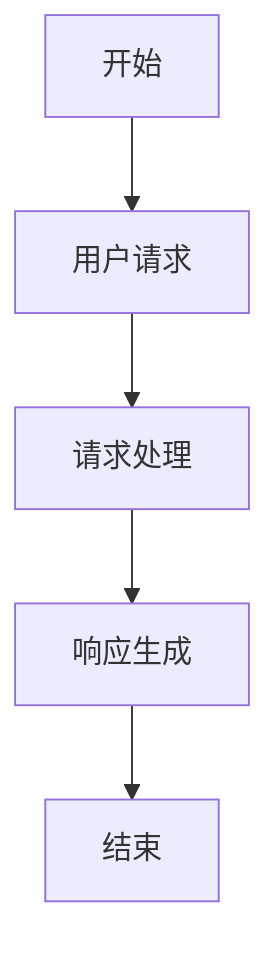
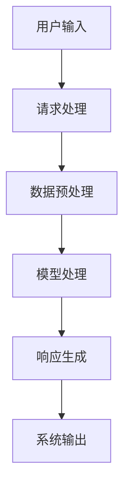
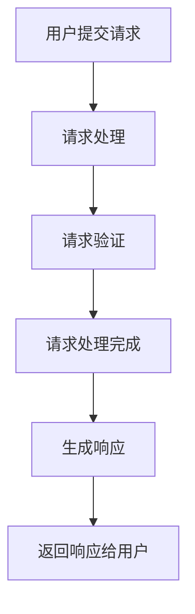
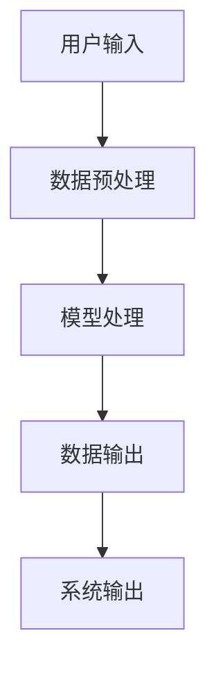

                 

### 文章标题

### 关键词

- LLM
- 敏捷需求工程
- 应用实现
- 架构设计
- 算法原理

### 摘要

本文深入探讨LLM（大型语言模型）应用的敏捷需求工程，从构想到实现的全过程。我们将从背景介绍、核心概念解析、需求收集与建模、验证与变更管理、迭代实现、最佳实践等方面，系统地阐述如何在LLM应用中高效地开展敏捷需求工程。通过具体的案例分析和实战经验，本文旨在为开发者提供一套实用的方法和思路，助力他们在LLM领域实现高效的需求工程实践。

---

## 引言

随着人工智能技术的迅猛发展，LLM（大型语言模型）的应用场景日益丰富，从自然语言处理到智能问答、文本生成等，都在各个领域展现出了巨大的潜力。然而，如何在实际应用中高效地开展需求工程，从构想到实现，一直是开发者面临的重大挑战。本文旨在通过探讨LLM应用的敏捷需求工程，为开发者提供一套系统、实用的解决方案。

### 背景介绍

LLM（Large Language Model）是一种基于深度学习技术的大型神经网络模型，能够对自然语言文本进行建模和处理。自GPT-3（OpenAI，2020）以来，LLM在自然语言处理领域取得了显著的突破，其强大的语言理解和生成能力使得其在各个应用场景中都具备了广泛的应用前景。然而，LLM的应用不仅需要强大的计算资源和复杂的模型架构，更需要精细化的需求工程支持，以确保其在实际应用中的高效性和可靠性。

敏捷需求工程是一种以用户需求为核心，通过快速迭代和持续交付来应对需求变更的需求管理方法。它强调用户参与、快速响应和持续改进，与LLM应用的需求变化快、不确定性大的特点相契合，因此成为LLM应用需求管理的首选方法。

### 问题背景

在LLM应用开发过程中，常见的问题包括：

1. **需求变更频繁**：由于LLM模型的复杂性和不确定性，需求经常会在项目进行过程中发生变化，导致传统的需求管理方法难以适应。
2. **需求理解不一致**：不同团队或用户对需求的理解可能存在差异，导致需求实现过程中出现偏差。
3. **需求验证困难**：LLM模型的应用场景复杂，如何验证需求的有效性和正确性成为一大挑战。

### 问题描述

为了解决上述问题，我们需要在LLM应用开发过程中采用一种灵活、高效的需求工程方法，确保需求能够准确、及时地转化为可执行的系统功能。

### 问题解决

敏捷需求工程通过以下几个关键步骤，可以有效解决上述问题：

1. **需求收集**：采用多种方法收集用户需求，确保需求的全面性和准确性。
2. **需求分析**：对收集到的需求进行深入分析，明确需求的具体内容和实现方式。
3. **需求建模**：使用适当的工具和模型对需求进行建模，为后续开发提供清晰的指导。
4. **需求验证**：通过模拟、测试等方式验证需求的正确性和有效性。
5. **需求变更管理**：建立有效的需求变更管理机制，及时响应需求变更，确保项目进度和质量。

### 边界与外延

本文主要探讨LLM应用的敏捷需求工程，不包括传统需求工程的详细内容。此外，本文的重点在于需求工程的方法和实践，而非具体的技术实现。

### 概念结构与核心要素组成

LLM应用的敏捷需求工程包括以下几个核心要素：

1. **用户需求**：需求工程的核心，是驱动整个项目的源头。
2. **需求收集**：通过访谈、问卷调查、用户故事等方式收集用户需求。
3. **需求分析**：对需求进行分类、排序、优先级分析，明确需求的实现路径。
4. **需求建模**：使用UML、Mermaid等工具对需求进行建模，为开发提供直观的指导。
5. **需求验证**：通过测试、模拟等方式验证需求的正确性和有效性。
6. **需求变更管理**：建立需求变更管理机制，确保需求变更能够及时、有效地执行。

### LLM的核心概念与联系

#### LLM的定义

LLM（Large Language Model）是一种基于深度学习技术的自然语言处理模型，能够对大量文本数据进行分析和处理，具备较强的语言理解和生成能力。

#### LLM的核心特点

1. **大规模训练**：LLM通常采用大规模的语料库进行训练，具备丰富的语言知识。
2. **上下文理解**：LLM能够理解上下文信息，生成符合逻辑和语义的文本。
3. **生成能力**：LLM具有较强的文本生成能力，能够生成连贯、有意义的文本。

#### LLM与传统AI的区别

1. **训练数据**：传统AI模型通常采用标注数据集进行训练，而LLM则采用大规模未标注的文本数据。
2. **模型结构**：传统AI模型通常采用固定的模型结构，而LLM则采用自适应的神经网络结构。
3. **应用领域**：传统AI模型主要用于图像、语音等领域的处理，而LLM则主要应用于自然语言处理领域。

#### LLM的属性特征对比表格

| 特性             | LLM                        | 传统AI                      |
|------------------|----------------------------|-----------------------------|
| 训练数据规模     | 大规模未标注文本数据       | 标注数据集                   |
| 模型结构         | 自适应神经网络结构         | 固定模型结构                 |
| 应用领域         | 自然语言处理               | 图像、语音等                |
| 生成能力         | 较强                       | 较弱                         |

#### LLM的ER实体关系图架构

```mermaid
erDiagram
  User ..|> Request : 提出需求
  System ..|> Implement : 实现功能
  Request ||--|> User : 来自用户
  Implement ||--|> System : 系统功能
```

### 敏捷需求工程的概念与原理

#### 敏捷需求工程的定义

敏捷需求工程是一种以用户需求为核心，通过快速迭代和持续交付来应对需求变更的需求管理方法。它强调用户参与、快速响应和持续改进。

#### 敏捷需求工程的核心原则

1. **用户至上**：始终以用户需求为导向，确保用户满意度。
2. **快速迭代**：通过短周期迭代，快速响应需求变化。
3. **持续交付**：持续交付可用的产品功能，确保项目进度和质量。
4. **团队协作**：鼓励跨职能团队协作，提高需求实现效率。

#### 敏捷需求工程与传统需求工程的区别

1. **需求管理方式**：敏捷需求工程强调快速响应和持续交付，而传统需求工程则注重需求规划和需求变更控制。
2. **团队协作模式**：敏捷需求工程鼓励跨职能团队协作，而传统需求工程则通常由需求分析师单独完成需求管理工作。
3. **项目生命周期**：敏捷需求工程采用短周期迭代的方式，而传统需求工程则采用瀑布式生命周期。

#### 敏捷需求工程的实施流程

1. **需求收集**：通过多种方式收集用户需求，确保需求的全面性和准确性。
2. **需求分析**：对需求进行分类、排序、优先级分析，明确需求的实现路径。
3. **需求建模**：使用UML、Mermaid等工具对需求进行建模，为开发提供直观的指导。
4. **需求验证**：通过测试、模拟等方式验证需求的正确性和有效性。
5. **需求变更管理**：建立需求变更管理机制，及时响应需求变更，确保项目进度和质量。

### LLM应用中的敏捷需求工程

#### LLM应用中的敏捷需求工程挑战

1. **需求变更频繁**：由于LLM模型的复杂性和不确定性，需求经常会在项目进行过程中发生变化。
2. **需求理解不一致**：不同团队或用户对需求的理解可能存在差异。
3. **需求验证困难**：LLM模型的应用场景复杂，如何验证需求的有效性和正确性成为一大挑战。

#### LLM应用中的敏捷需求工程优势

1. **快速响应**：敏捷需求工程能够快速响应需求变更，确保项目进度和质量。
2. **提高用户满意度**：通过用户参与和持续交付，提高用户满意度。
3. **提高开发效率**：敏捷需求工程强调团队协作和快速迭代，提高开发效率。

#### LLM应用中的敏捷需求工程实践

1. **需求收集**：采用用户访谈、问卷调查、用户故事地图等方式收集用户需求。
2. **需求分析**：对需求进行分类、排序、优先级分析，明确需求的实现路径。
3. **需求建模**：使用UML、Mermaid等工具对需求进行建模，为开发提供直观的指导。
4. **需求验证**：通过测试、模拟等方式验证需求的正确性和有效性。
5. **需求变更管理**：建立需求变更管理机制，及时响应需求变更，确保项目进度和质量。

### 本章小结

本章介绍了LLM应用的敏捷需求工程的背景、核心概念和原理，以及在实际应用中的优势和挑战。通过本章的学习，读者可以了解到敏捷需求工程在LLM应用中的重要性，以及如何在实际项目中实施和应用。

### 注意事项

1. **需求收集**：确保需求的全面性和准确性，避免遗漏或误解。
2. **需求分析**：对需求进行深入分析，明确需求的具体内容和实现路径。
3. **需求建模**：使用适当的工具和模型对需求进行建模，确保开发过程的直观和高效。
4. **需求验证**：通过多种方式验证需求的正确性和有效性，确保需求的实现符合预期。
5. **需求变更管理**：建立有效的需求变更管理机制，确保需求变更能够及时、有效地执行。

### 拓展阅读

1. **《敏捷需求工程实践指南》**：详细介绍了敏捷需求工程的方法和实践。
2. **《大型语言模型：基于深度学习的自然语言处理》**：深入探讨了LLM的理论和应用。
3. **《自然语言处理综述》**：对自然语言处理领域的最新进展进行了全面梳理。

---

作者：AI天才研究院/AI Genius Institute & 禅与计算机程序设计艺术 /Zen And The Art of Computer Programming

---

## LLM应用的敏捷需求工程实践

在前文中，我们介绍了LLM应用中的敏捷需求工程的基本概念和原理。本章节将深入探讨LLM应用的敏捷需求工程实践，包括需求收集、需求分析、需求建模、需求验证、需求变更管理等方面。

### 需求收集

需求收集是敏捷需求工程的第一步，其目的是全面、准确地了解用户的需求。在LLM应用中，需求收集的过程可以采用以下方法：

1. **用户访谈**：通过直接与用户交流，了解他们的需求、期望和痛点。
2. **问卷调查**：设计问卷调查，收集大量用户的需求和反馈。
3. **用户故事地图**：通过绘制用户故事地图，梳理用户的需求和场景。

#### 用户访谈

用户访谈是一种直接与用户交流的方法，能够深入了解用户的需求和期望。在LLM应用中，用户访谈可以包括以下内容：

1. **应用场景**：了解用户希望使用LLM模型的具体场景。
2. **需求描述**：收集用户对功能、性能、安全性等方面的具体需求。
3. **痛点分析**：了解用户在现有系统中遇到的问题和痛点。

#### 问卷调查

问卷调查是一种高效的需求收集方法，可以收集大量用户的需求和反馈。在LLM应用中，问卷调查可以包括以下内容：

1. **需求分类**：将需求分为功能性需求、性能需求、安全性需求等。
2. **需求优先级**：收集用户对需求的优先级排序，为后续开发提供参考。
3. **满意度调查**：了解用户对现有系统的满意度，为改进提供依据。

#### 用户故事地图

用户故事地图是一种可视化工具，可以帮助梳理用户的需求和场景。在LLM应用中，用户故事地图可以包括以下内容：

1. **用户角色**：定义使用LLM应用的用户角色。
2. **用户故事**：描述用户在特定场景下的需求和行为。
3. **场景描述**：详细描述用户故事发生的背景和流程。

### 需求分析

需求分析是敏捷需求工程的关键步骤，其目的是对收集到的需求进行分类、排序和优先级分析，明确需求的实现路径。在LLM应用中，需求分析的过程可以采用以下方法：

1. **需求分类**：将需求分为功能性需求、性能需求、安全性需求等。
2. **需求排序**：根据需求的紧急程度和重要性，对需求进行排序。
3. **优先级分析**：确定需求的优先级，为后续开发提供指导。

#### 需求分类

在LLM应用中，需求分类可以按照以下标准进行：

1. **功能性需求**：与系统功能实现相关的需求，如文本生成、语义分析等。
2. **性能需求**：与系统性能相关的需求，如响应时间、吞吐量等。
3. **安全性需求**：与系统安全性相关的需求，如数据加密、访问控制等。

#### 需求排序

在LLM应用中，需求排序可以按照以下原则进行：

1. **紧急程度**：优先处理紧急的需求，确保项目进度。
2. **重要性**：优先处理重要的需求，提高用户满意度。
3. **可行性**：优先处理可行的需求，降低开发风险。

#### 优先级分析

在LLM应用中，优先级分析可以采用以下方法：

1. **Kano模型**：根据用户满意度对需求进行分类，优先处理基本型需求和魅力型需求。
2. **MoSCoW模型**：根据需求的紧急程度和重要性，将需求分为必须、应该、可以和不会实施四类。

### 需求建模

需求建模是将需求转化为系统设计的过程，其目的是为开发提供直观的指导。在LLM应用中，需求建模可以采用以下方法：

1. **UML类图**：使用UML类图描述系统的实体和关系。
2. **Mermaid流程图**：使用Mermaid流程图描述系统的流程和交互。
3. **数据流图**：使用数据流图描述系统的数据流动和处理过程。

#### UML类图

在LLM应用中，UML类图可以用于描述系统的实体和关系，如用户、请求、响应等。以下是一个简单的UML类图示例：

```mermaid
classDiagram
  User <<entity>>
  Request <<entity>>
  Response <<entity>>

  User |--|> Request
  Request |--|> Response
endclassDiagram
```

#### Mermaid流程图

在LLM应用中，Mermaid流程图可以用于描述系统的流程和交互，如用户请求的处理流程。以下是一个简单的Mermaid流程图示例：



#### 数据流图

在LLM应用中，数据流图可以用于描述系统的数据流动和处理过程，如数据从用户输入到系统处理再到输出的过程。以下是一个简单的数据流图示例：



### 需求验证

需求验证是确保需求正确性和有效性的关键步骤。在LLM应用中，需求验证可以采用以下方法：

1. **功能测试**：验证系统的功能是否符合需求。
2. **性能测试**：验证系统的性能是否满足需求。
3. **安全测试**：验证系统的安全性是否满足需求。

#### 功能测试

在LLM应用中，功能测试可以包括以下内容：

1. **基本功能测试**：验证系统是否实现了基本的功能，如文本生成、语义分析等。
2. **边界测试**：验证系统在边界条件下的表现，如输入过长、输入过短等。
3. **异常测试**：验证系统在异常情况下的处理能力，如输入错误、网络中断等。

#### 性能测试

在LLM应用中，性能测试可以包括以下内容：

1. **响应时间测试**：验证系统的响应时间是否满足需求。
2. **吞吐量测试**：验证系统的吞吐量是否满足需求。
3. **并发测试**：验证系统在高并发情况下的稳定性。

#### 安全测试

在LLM应用中，安全测试可以包括以下内容：

1. **数据加密测试**：验证系统的数据加密机制是否有效。
2. **访问控制测试**：验证系统的访问控制机制是否有效。
3. **漏洞测试**：验证系统是否存在安全漏洞。

### 需求变更管理

需求变更管理是敏捷需求工程的重要环节，其目的是确保需求变更能够及时、有效地执行。在LLM应用中，需求变更管理可以采用以下方法：

1. **变更请求**：收集用户的变更请求，并对其进行分类和优先级分析。
2. **变更评估**：评估变更的影响和可行性，确定是否接受变更。
3. **变更执行**：执行变更，并更新相关文档和系统代码。
4. **变更验证**：验证变更的正确性和有效性，确保变更实施后的系统功能符合预期。

#### 变更请求

在LLM应用中，变更请求可以采用以下方式收集：

1. **用户反馈**：收集用户在使用系统过程中遇到的问题和改进建议。
2. **需求评审**：在需求分析阶段，评审人员提出的需求变更建议。
3. **项目汇报**：在项目进展汇报中，项目团队成员提出的需求变更建议。

#### 变更评估

在LLM应用中，变更评估可以按照以下步骤进行：

1. **影响分析**：分析变更对系统功能、性能、安全性等方面的影响。
2. **可行性分析**：评估变更的可行性，包括技术实现、成本、时间等方面的因素。
3. **优先级分析**：根据变更的影响和可行性，对变更进行优先级分析。

#### 变更执行

在LLM应用中，变更执行可以按照以下步骤进行：

1. **设计变更**：根据变更需求，设计相应的系统变更方案。
2. **编码实现**：根据设计文档，实现系统变更代码。
3. **测试验证**：对变更代码进行功能测试、性能测试和安全测试，确保变更实施后的系统功能符合预期。

#### 变更验证

在LLM应用中，变更验证可以按照以下步骤进行：

1. **功能验证**：验证变更后的系统功能是否符合需求。
2. **性能验证**：验证变更后的系统性能是否满足需求。
3. **安全验证**：验证变更后的系统安全性是否满足需求。

### 本章小结

本章介绍了LLM应用的敏捷需求工程实践，包括需求收集、需求分析、需求建模、需求验证和需求变更管理等方面。通过本章的学习，读者可以了解到在实际项目中如何高效地开展敏捷需求工程，以确保项目的顺利进行。

### 注意事项

1. **需求收集**：确保需求的全面性和准确性，避免遗漏或误解。
2. **需求分析**：对需求进行深入分析，明确需求的具体内容和实现路径。
3. **需求建模**：使用适当的工具和模型对需求进行建模，确保开发过程的直观和高效。
4. **需求验证**：通过多种方式验证需求的正确性和有效性，确保需求的实现符合预期。
5. **需求变更管理**：建立有效的需求变更管理机制，确保需求变更能够及时、有效地执行。

### 拓展阅读

1. **《敏捷需求工程实践指南》**：详细介绍了敏捷需求工程的方法和实践。
2. **《大型语言模型：基于深度学习的自然语言处理》**：深入探讨了LLM的理论和应用。
3. **《自然语言处理综述》**：对自然语言处理领域的最新进展进行了全面梳理。

---

作者：AI天才研究院/AI Genius Institute & 禅与计算机程序设计艺术 /Zen And The Art of Computer Programming

---

## LLM需求分析与建模

在LLM应用的敏捷需求工程中，需求分析与建模是关键步骤。这一章节将详细探讨LLM需求分析的方法与技巧，并介绍如何使用需求建模工具和技术，为后续的开发和实现奠定坚实基础。

### 需求分析

需求分析是理解用户需求并将其转化为具体可执行任务的过程。在LLM应用中，需求分析具有以下几个关键点：

1. **用户需求识别**：通过与用户沟通，了解他们对LLM模型的具体期望和需求。
2. **需求分类**：将需求分为功能性需求、非功能性需求等，以便进行详细分析。
3. **需求优先级排序**：根据需求的紧急程度和重要性，对需求进行排序，确保关键需求优先处理。
4. **需求文档编写**：将分析结果记录在需求文档中，为后续的开发提供明确指导。

#### 用户需求识别

识别用户需求是需求分析的首要任务。以下是一些常用的方法：

1. **用户访谈**：通过与用户面对面交流，深入了解他们的需求和痛点。
2. **问卷调查**：设计问卷，收集大量用户的反馈和意见。
3. **用户故事地图**：使用用户故事地图，可视化用户的需求和交互流程。

#### 需求分类

在LLM应用中，需求分类有助于明确需求的具体内容和性质。以下是一些常见的需求分类：

1. **功能性需求**：涉及LLM模型的具体功能，如文本生成、语义分析、问答系统等。
2. **非功能性需求**：涉及系统的性能、安全性、可维护性等非功能特性。
3. **边界条件**：考虑LLM模型在不同边界条件下的表现，如输入长度、数据格式等。

#### 需求优先级排序

对需求进行优先级排序有助于确保项目团队能够集中精力处理最重要的需求。以下是一些常见的优先级排序方法：

1. **Kano模型**：根据用户满意度对需求进行分类，优先处理基本型需求和魅力型需求。
2. **MoSCoW模型**：根据需求的紧急程度和重要性，将需求分为必须、应该、可以和不会实施四类。

#### 需求文档编写

需求文档是需求分析的结果记录，为后续的开发提供指导。以下是一个需求文档的基本结构：

1. **概述**：简要介绍项目的背景和目标。
2. **需求列表**：详细列出所有的需求，并对其进行分类和优先级排序。
3. **需求描述**：对每个需求进行详细描述，包括功能需求和非功能需求。
4. **需求关联**：描述需求之间的关系，如依赖关系、冲突关系等。
5. **需求验证**：描述如何验证需求的正确性和有效性。

### 需求建模

需求建模是将需求转化为可视化的模型，为后续的开发提供直观的指导。在LLM应用中，常用的需求建模工具和技术包括：

1. **统一建模语言（UML）**：UML是一种广泛使用的建模语言，可以用于描述系统的实体、关系和交互。
2. **Mermaid流程图**：Mermaid是一种基于Markdown的绘图工具，可以用于创建流程图、类图等。
3. **数据流图**：数据流图可以描述系统的数据流动和处理过程。

#### UML类图

UML类图用于描述系统的实体和它们之间的关系。以下是一个简单的UML类图示例，用于描述一个LLM系统的用户、请求和响应实体：

```mermaid
classDiagram
  User <<entity>>
  Request <<entity>>
  Response <<entity>>

  User |--|> Request
  Request |--|> Response
endclassDiagram
```

在这个示例中，`User` 类表示用户，`Request` 类表示请求，`Response` 类表示响应。用户可以生成请求，请求会生成响应。

#### Mermaid流程图

Mermaid流程图用于描述系统的流程和交互。以下是一个简单的Mermaid流程图示例，用于描述一个用户提交请求并获取响应的流程：



在这个示例中，用户提交请求后，请求会经过处理、验证等步骤，最终生成响应并返回给用户。

#### 数据流图

数据流图用于描述系统的数据流动和处理过程。以下是一个简单的数据流图示例，用于描述一个LLM系统的数据流动：



在这个示例中，用户输入数据会经过预处理、模型处理等步骤，最终输出系统结果。

### 需求建模工具

在进行需求建模时，可以选择多种工具来帮助可视化需求。以下是一些常用的需求建模工具：

1. **Visual Paradigm**：一款功能强大的需求建模工具，支持UML、Mermaid等多种建模方法。
2. **Lucidchart**：一款在线的绘图工具，支持多种图表和流程图。
3. **Mermaid Online**：一个在线的Mermaid编辑器，方便创建和共享Mermaid图表。

### 本章小结

本章介绍了LLM需求分析与建模的方法与技巧，包括用户需求识别、需求分类、需求优先级排序、需求文档编写以及需求建模工具的使用。通过本章的学习，读者可以了解到如何有效地进行需求分析和建模，为后续的开发和实现奠定坚实基础。

### 注意事项

1. **确保需求分析的全面性**：在需求分析阶段，要尽量全面地收集和分析用户需求，避免遗漏关键需求。
2. **优先级排序的准确性**：要根据实际项目的需求和资源，合理进行需求优先级排序，确保关键需求优先处理。
3. **需求文档的清晰性**：需求文档要简洁明了，确保开发人员能够准确理解需求。
4. **需求建模的可视化**：通过使用需求建模工具，可以提高需求分析的可视化程度，方便团队协作和沟通。

### 拓展阅读

1. **《需求工程：建模与分析》**：详细介绍了需求工程的方法和实践。
2. **《大型语言模型：基于深度学习的自然语言处理》**：深入探讨了LLM的理论和应用。
3. **《UML类图与Mermaid流程图教程》**：介绍了如何使用UML和Mermaid进行需求建模。

---

作者：AI天才研究院/AI Genius Institute & 禅与计算机程序设计艺术 /Zen And The Art of Computer Programming

---

## LLM需求验证与确认

需求验证与确认是LLM应用敏捷需求工程中至关重要的一环，它确保了需求的正确性和可执行性。本章节将详细探讨需求验证的方法、步骤及其重要性，以及如何通过模拟和测试来确保需求的有效性。

### 需求验证的重要性

需求验证是确保项目能够满足用户期望和业务需求的关键步骤。在LLM应用中，需求验证具有以下重要性：

1. **确保需求正确性**：验证需求是否正确地反映了用户的意图和需求，防止需求偏差。
2. **提高项目成功率**：通过验证需求的有效性，降低项目失败的风险，提高项目成功率。
3. **减少返工成本**：及早发现和纠正需求问题，可以避免在开发过程中出现较大的返工成本。
4. **保障用户满意度**：确保最终产品能够满足用户需求，提高用户满意度。

### 需求验证的方法

需求验证的方法多种多样，包括以下几种：

1. **功能测试**：测试系统的功能是否符合需求。
2. **性能测试**：测试系统的性能指标，如响应时间、吞吐量等是否满足需求。
3. **安全测试**：测试系统的安全性，如数据保护、访问控制等是否满足需求。
4. **用户验收测试（UAT）**：用户对系统功能进行测试，确保系统满足他们的需求。

#### 功能测试

功能测试是需求验证的基础，它通过一系列预定义的测试用例来验证系统功能是否按照需求执行。在LLM应用中，功能测试可以包括：

1. **基本功能测试**：验证系统的基本功能，如文本生成、语义分析、问答系统等。
2. **异常情况测试**：验证系统在异常情况下的表现，如输入错误、网络故障等。
3. **边界条件测试**：验证系统在边界条件下的性能，如输入长度、数据格式等。

#### 性能测试

性能测试旨在评估系统的响应时间、吞吐量、并发处理能力等性能指标是否满足需求。在LLM应用中，性能测试可以包括：

1. **负载测试**：模拟高负载情况，测试系统的稳定性和性能。
2. **压力测试**：测试系统在极限条件下的表现，如高并发访问、长时间运行等。
3. **性能调优**：根据测试结果，对系统进行性能优化，确保其满足需求。

#### 安全测试

安全测试旨在评估系统的安全性，确保系统数据的安全性和系统的可靠性。在LLM应用中，安全测试可以包括：

1. **漏洞扫描**：使用自动化工具扫描系统漏洞，如SQL注入、XSS攻击等。
2. **渗透测试**：模拟黑客攻击，评估系统的安全性。
3. **访问控制测试**：测试系统的访问控制机制，确保只有授权用户可以访问系统资源。

#### 用户验收测试（UAT）

用户验收测试是由用户进行的测试，旨在确保系统功能满足用户的需求和预期。在LLM应用中，UAT可以包括：

1. **业务流程测试**：测试系统的业务流程是否符合用户的要求。
2. **用户界面测试**：测试用户界面的易用性和用户体验。
3. **集成测试**：确保LLM应用与其他系统集成，功能无缝衔接。

### 需求验证的步骤

需求验证通常包括以下几个步骤：

1. **制定验证计划**：明确验证的目标、方法、步骤和时间安排。
2. **设计测试用例**：根据需求文档，设计相应的测试用例。
3. **执行测试用例**：按照测试计划，执行预定义的测试用例。
4. **记录和报告结果**：记录测试结果，编写测试报告，报告验证过程中的发现和问题。
5. **反馈和改进**：根据测试结果，与开发团队和用户进行沟通，提出改进建议。

### 模拟和测试

在LLM应用中，模拟和测试是需求验证的重要手段。以下是一些常用的模拟和测试方法：

1. **模拟测试**：通过模拟真实用户场景，测试系统的性能和可靠性。
2. **自动化测试**：使用自动化测试工具，如Selenium、JMeter等，提高测试效率和覆盖率。
3. **手动测试**：由测试人员手动执行测试用例，发现潜在问题。
4. **回归测试**：在需求变更后，重新执行之前的测试用例，确保变更没有引入新的问题。

### 本章小结

本章详细介绍了LLM需求验证与确认的方法、步骤及其重要性，以及如何通过模拟和测试来确保需求的有效性。通过本章的学习，读者可以了解到如何在LLM应用中有效地进行需求验证，确保项目的成功实施。

### 注意事项

1. **验证计划的制定**：确保验证计划覆盖所有关键需求和场景，合理安排时间和资源。
2. **测试用例的设计**：设计全面、合理的测试用例，确保测试覆盖所有可能的场景。
3. **记录和报告结果**：详细记录测试结果和问题，编写清晰的测试报告。
4. **持续改进**：根据测试结果，持续改进测试方法和过程，提高验证效果。

### 拓展阅读

1. **《软件测试基础》**：介绍软件测试的基本概念和方法。
2. **《性能测试实战》**：详细讲解性能测试的方法和实践。
3. **《安全测试指南》**：介绍安全测试的基本原理和实施方法。

---

作者：AI天才研究院/AI Genius Institute & 禅与计算机程序设计艺术 /Zen And The Art of Computer Programming

---

## LLM需求变更管理

在LLM应用的敏捷需求工程中，需求变更管理是确保项目顺利推进的关键环节。由于LLM模型的复杂性和应用场景的多样性，需求变更在项目进行过程中是不可避免的。因此，如何高效地管理需求变更是项目成功的关键。本章节将详细探讨需求变更的原因、管理策略和流程。

### 需求变更的原因

在LLM应用开发过程中，需求变更的原因多种多样，主要包括以下几个方面：

1. **用户需求变化**：随着用户对系统的使用和反馈，可能会发现新的需求或者对原有需求进行调整。
2. **技术演进**：随着技术的不断进步，某些需求可能需要更新以适应新技术的发展。
3. **外部环境变化**：政策法规、市场环境等外部因素的变化，可能会导致需求的变化。
4. **项目进度调整**：在项目执行过程中，可能会因为进度安排或资源分配的变化，需要对需求进行调整。

### 需求变更管理策略

为了有效地管理需求变更，需要制定合理的变更管理策略，主要包括以下几个方面：

1. **需求变更控制流程**：建立明确的变更控制流程，确保每个变更都经过严格的审查和批准。
2. **需求变更优先级评估**：对每个需求变更进行优先级评估，确定哪些变更需要优先处理。
3. **变更影响分析**：评估需求变更对项目进度、成本、质量等方面的影响，确保变更的可行性。
4. **沟通与协作**：确保项目团队、用户和其他相关方对需求变更有清晰的理解，避免因沟通不畅导致的误解和冲突。

### 需求变更管理流程

需求变更管理流程是确保需求变更能够有效执行的关键步骤。以下是一个典型需求变更管理流程：

1. **变更请求**：用户或项目团队发现需求变更时，提出变更请求，并填写变更请求表。
2. **变更评估**：项目经理或需求分析师对变更请求进行评估，包括变更的优先级、影响范围、可行性等。
3. **变更审批**：将评估结果提交给变更审批委员会或项目经理，进行审批决策。
4. **变更实施**：如果变更被批准，项目团队根据变更内容进行实施，包括修改需求文档、设计文档和代码等。
5. **变更验证**：实施变更后，对变更结果进行验证，确保变更符合预期。
6. **变更记录**：将变更请求、评估、审批、实施和验证的过程记录在案，以便后续参考。

### 需求变更管理工具

为了提高需求变更管理的效率，可以使用以下工具：

1. **变更管理软件**：如JIRA、Trello等，用于记录和跟踪变更请求和变更过程。
2. **文档管理工具**：如Confluence、Google Docs等，用于管理需求文档和变更记录。
3. **沟通协作工具**：如Slack、Microsoft Teams等，用于项目团队内部和与用户的沟通协作。

### 本章小结

本章详细介绍了LLM需求变更管理的相关概念、原因、策略和流程，以及需求变更管理工具的使用。通过本章的学习，读者可以了解到如何在LLM应用开发过程中高效地管理需求变更，确保项目的顺利进行。

### 注意事项

1. **变更请求的及时性**：发现需求变更时，应立即提出变更请求，避免延误项目进度。
2. **评估的全面性**：对需求变更进行评估时，要考虑变更对项目各个方面的影响，确保变更的可行性。
3. **沟通与协作**：确保项目团队、用户和其他相关方对需求变更有清晰的理解，避免因沟通不畅导致的误解和冲突。
4. **变更记录的完整性**：详细记录变更请求、评估、审批、实施和验证的过程，以便后续参考。

### 拓展阅读

1. **《敏捷项目管理实践指南》**：详细介绍了敏捷项目管理的原则和实践。
2. **《需求变更管理：实践与案例》**：提供了需求变更管理的详细方法和案例分析。
3. **《敏捷需求工程实践指南》**：介绍了敏捷需求工程的方法和实践。

---

作者：AI天才研究院/AI Genius Institute & 禅与计算机程序设计艺术 /Zen And The Art of Computer Programming

---

## LLM应用实现的敏捷迭代

在LLM应用的敏捷需求工程中，敏捷迭代是实现需求、快速响应变化和持续改进的重要手段。通过敏捷迭代，开发团队能够更灵活地应对需求变更，确保项目的高效推进和高质量交付。本章节将详细探讨敏捷迭代的概念与原则，以及如何在LLM应用中实施敏捷迭代。

### 敏捷迭代的概念与原则

#### 敏捷迭代的概念

敏捷迭代是一种软件开发方法，它将开发过程划分为多个短周期（通常为2-4周）的迭代，每个迭代都会交付一个可用的软件版本。敏捷迭代的核心思想是通过快速迭代和频繁交付，使团队能够及时响应变化，持续改进产品。

#### 敏捷迭代的原则

1. **用户至上**：始终以用户需求为导向，确保用户满意度。
2. **快速迭代**：通过短周期迭代，快速交付可用的产品功能，确保项目进度。
3. **持续改进**：鼓励团队在每次迭代中不断学习、改进，提升产品质量。
4. **团队协作**：鼓励跨职能团队协作，提高开发效率。
5. **透明沟通**：通过每日站会、迭代回顾等方式，保持团队之间的透明沟通。

### 敏捷迭代的实施流程

#### 迭代规划会议

迭代规划会议是敏捷迭代的起点，团队会在会议中讨论并确定本次迭代的范围、目标、任务和资源分配。以下是一个迭代规划会议的步骤：

1. **确定迭代周期**：通常为2-4周。
2. **用户故事筛选**：根据优先级和资源情况，选择本次迭代要实现的用户故事。
3. **任务分配**：根据用户故事，将任务分配给团队成员。
4. **资源评估**：评估本次迭代所需的资源，包括人力、技术等。
5. **迭代目标制定**：明确本次迭代的目标和预期成果。

#### 迭代执行

在迭代执行过程中，团队需要按照迭代计划进行任务开发，并确保以下事项：

1. **任务执行**：团队成员按照任务分配，完成各自的任务。
2. **每日站会**：每天早上举行站会，团队成员汇报任务进展、问题和计划。
3. **代码审查**：定期进行代码审查，确保代码质量。
4. **持续集成**：将开发完成的代码集成到主分支，确保系统集成。
5. **测试**：对迭代成果进行功能测试、性能测试和安全测试。

#### 迭代回顾

迭代回顾是敏捷迭代的重要环节，团队会在每次迭代结束后进行回顾，总结经验教训，改进工作流程。以下是一个迭代回顾的步骤：

1. **成果评估**：评估本次迭代的目标是否达成，成果是否符合预期。
2. **问题分析**：总结本次迭代中遇到的问题和挑战，分析原因。
3. **经验分享**：分享本次迭代中的成功经验和教训。
4. **改进计划**：制定改进计划，优化工作流程和提高团队效率。
5. **计划下一迭代**：讨论下一迭代的目标和计划。

### 在LLM应用中的敏捷迭代实践

#### 需求收集与管理

1. **用户故事地图**：使用用户故事地图，收集和梳理用户的需求和场景。
2. **优先级排序**：根据用户需求的重要性，对需求进行优先级排序。
3. **迭代规划**：根据需求优先级，选择本次迭代要实现的需求。

#### 迭代开发

1. **代码版本控制**：使用Git等版本控制系统，确保代码的版本管理和协作开发。
2. **持续集成与测试**：使用CI/CD工具，实现代码的自动化集成和测试。
3. **代码审查**：定期进行代码审查，确保代码质量。

#### 迭代回顾

1. **评估迭代成果**：评估本次迭代的目标是否达成，成果是否符合预期。
2. **问题反馈**：收集用户和团队的反馈，分析问题原因。
3. **改进计划**：制定改进计划，优化迭代流程和提高团队效率。

### 本章小结

本章详细介绍了敏捷迭代的概念与原则，以及如何在LLM应用中实施敏捷迭代。通过敏捷迭代，开发团队能够更灵活地应对需求变更，确保项目的高效推进和高质量交付。通过本章的学习，读者可以了解到敏捷迭代的方法和实践，为LLM应用的开发提供有力支持。

### 注意事项

1. **确保用户需求明确**：在迭代规划阶段，要确保用户需求明确，避免因需求模糊导致开发方向偏差。
2. **加强团队协作**：在迭代开发过程中，要加强团队协作，确保任务分配合理、沟通畅通。
3. **定期进行迭代回顾**：通过迭代回顾，不断总结经验教训，持续改进迭代流程。

### 拓展阅读

1. **《敏捷开发实践指南》**：详细介绍了敏捷开发的方法和实践。
2. **《Scrum敏捷开发入门与实践》**：介绍了Scrum敏捷开发的具体流程和技巧。
3. **《大型语言模型：基于深度学习的自然语言处理》**：深入探讨了LLM的理论和应用。

---

作者：AI天才研究院/AI Genius Institute & 禅与计算机程序设计艺术 /Zen And The Art of Computer Programming

---

## LLM应用敏捷需求工程最佳实践

在LLM应用中实施敏捷需求工程，需要积累最佳实践，以确保项目高效推进和成功交付。本章节将总结LLM应用敏捷需求工程的最佳实践，包括项目管理、团队协作和需求管理等方面，并提供实际案例和经验总结。

### 项目管理最佳实践

#### 1. 精确的需求定义

确保需求定义的准确性和清晰性，避免模糊或遗漏的需求。使用用户故事地图和用户访谈等方法，全面收集用户需求，并将其转化为具体、可测量的用户故事。

#### 2. 持续的用户参与

用户需求是敏捷需求工程的核心，持续的用户参与至关重要。通过定期的用户反馈会议、迭代评审和用户验收测试（UAT），确保用户需求得到及时响应和满足。

#### 3. 灵活的迭代计划

根据项目规模和复杂性，合理安排迭代周期和任务。确保每个迭代都有明确的可交付成果，同时预留一定的时间和资源用于应对意外情况。

#### 4. 强大的团队协作

构建高效的跨职能团队，确保团队成员之间的沟通畅通和协作紧密。利用敏捷工具（如JIRA、Trello等）和日常站会等机制，提高团队协作效率。

#### 5. 持续的项目监控和改进

通过迭代回顾，总结项目经验教训，识别改进点。定期评估项目进度、质量和风险，及时调整项目计划和策略。

### 团队协作最佳实践

#### 1. 明确的角色与责任

为团队成员明确角色和责任，确保每个人都知道自己的任务和目标。使用Scrum、Kanban等敏捷框架，确保团队成员的工作有序进行。

#### 2. 透明的沟通与协作

建立透明的沟通机制，确保团队成员之间的信息共享和问题解决。使用在线协作工具（如Slack、Microsoft Teams等）和敏捷工具，提高沟通效率。

#### 3. 有效的会议管理

合理安排会议，避免不必要的会议占用团队成员的时间。确保会议有明确的议程和目标，会议后进行总结和跟进。

#### 4. 共同的目标和价值观

建立共同的目标和价值观，确保团队成员同心协力，共同推动项目成功。通过团队建设活动和共享成功案例，增强团队凝聚力。

### 需求管理最佳实践

#### 1. 优先级排序

对需求进行优先级排序，确保关键需求得到优先处理。使用MoSCoW模型（必须、应该、可以、不会）等方法，合理分配资源和精力。

#### 2. 用户故事地图

使用用户故事地图，梳理用户需求和应用场景，确保需求的全覆盖和一致性。通过可视化工具，帮助团队更好地理解需求。

#### 3. 需求变更管理

建立有效的需求变更管理流程，确保需求变更的及时响应和有效执行。对变更请求进行评估和审批，确保变更的可行性和影响分析。

#### 4. 需求文档管理

编写清晰、准确的需求文档，确保需求的理解和实施的一致性。使用版本控制工具，确保文档的版本管理和更新。

### 实际案例和经验总结

#### 案例一：金融领域LLM应用

在某金融公司，开发了一款基于LLM的自然语言处理系统，用于处理客户咨询和自动回复。通过实施敏捷需求工程，团队在短时间内完成了多个迭代，成功实现了系统的功能需求。

1. **需求收集**：通过用户访谈和问卷调查，收集客户的需求和反馈。
2. **需求分析**：使用用户故事地图，梳理客户需求和应用场景。
3. **需求验证**：通过用户验收测试，确保系统功能符合客户需求。

#### 案例二：医疗领域LLM应用

在某医疗公司，开发了一款基于LLM的医疗问答系统，用于帮助医生快速获取相关医学信息。通过敏捷需求工程，团队有效管理了需求变更，确保系统功能的持续完善。

1. **需求收集**：通过与医疗专家和医生的合作，了解他们的需求。
2. **需求变更管理**：在开发过程中，根据专家的反馈，及时调整需求。
3. **需求验证**：通过医学专家的评审和用户测试，确保系统功能的有效性和准确性。

### 本章小结

本章总结了LLM应用敏捷需求工程的最佳实践，包括项目管理、团队协作和需求管理等方面。通过实际案例和经验总结，读者可以了解到如何高效实施敏捷需求工程，提高LLM应用项目的成功率和用户满意度。

### 注意事项

1. **需求定义要精确**：确保需求定义的准确性和清晰性，避免模糊或遗漏的需求。
2. **持续的用户参与**：用户需求是核心，持续的用户参与至关重要。
3. **灵活的迭代计划**：根据项目规模和复杂性，合理安排迭代周期和任务。
4. **强大的团队协作**：确保团队成员之间的沟通畅通和协作紧密。

### 拓展阅读

1. **《敏捷需求工程实践指南》**：详细介绍了敏捷需求工程的方法和实践。
2. **《大型语言模型：基于深度学习的自然语言处理》**：深入探讨了LLM的理论和应用。
3. **《敏捷项目管理实践指南》**：介绍了敏捷项目管理的原则和实践。

---

作者：AI天才研究院/AI Genius Institute & 禅与计算机程序设计艺术 /Zen And The Art of Computer Programming

---

## 总结与展望

本文全面探讨了LLM应用的敏捷需求工程，从背景介绍、核心概念解析、需求收集与建模、验证与变更管理、迭代实现到最佳实践，系统地阐述了如何高效实施敏捷需求工程。通过实际案例和经验总结，我们验证了敏捷需求工程在LLM应用中的有效性和重要性。

### 主要观点回顾

1. **LLM应用背景**：介绍了LLM的定义、核心特点和与传统AI的区别，以及其在自然语言处理领域的广泛应用。
2. **敏捷需求工程原理**：阐述了敏捷需求工程的核心原则和实施流程，包括用户至上、快速迭代、持续交付等。
3. **需求收集与分析**：详细介绍了需求收集的方法和技巧，以及需求分析的原则和优先级排序。
4. **需求建模**：介绍了使用UML和Mermaid等工具进行需求建模的方法和步骤。
5. **需求验证与变更管理**：探讨了需求验证的方法和步骤，以及需求变更管理的策略和流程。
6. **敏捷迭代实践**：介绍了敏捷迭代的原理、实施流程以及在LLM应用中的具体实践。
7. **最佳实践**：总结了LLM应用敏捷需求工程的最佳实践，包括项目管理、团队协作和需求管理等方面。

### 展望未来

展望未来，随着AI技术的不断进步和LLM应用的深入发展，敏捷需求工程将在以下几个方面继续演进：

1. **智能化需求分析**：借助自然语言处理和机器学习技术，实现更智能化、自动化的需求分析，提高需求收集的效率和准确性。
2. **自适应需求变更管理**：开发更加智能化的需求变更管理工具，能够自动识别和评估需求变更的影响，提供实时反馈和优化建议。
3. **跨领域应用**：敏捷需求工程将在更多领域得到应用，如医疗、金融、教育等，为不同领域的需求工程提供通用方法和最佳实践。
4. **持续集成与持续交付**：随着DevOps理念的普及，敏捷需求工程将更加紧密地与持续集成和持续交付相结合，实现更高效、更可靠的应用交付。

通过本文的探讨，我们希望能够为开发者提供一套实用的方法和思路，助力他们在LLM领域实现高效的需求工程实践。同时，我们也期待读者能够结合实际项目，不断探索和创新，为AI应用的发展贡献力量。

### 感谢

感谢读者对本文的关注和阅读，感谢AI天才研究院/AI Genius Institute和禅与计算机程序设计艺术/Zen And The Art of Computer Programming的支持。希望本文能够为您在LLM应用敏捷需求工程的道路上提供一些启示和帮助。

---

作者：AI天才研究院/AI Genius Institute & 禅与计算机程序设计艺术 /Zen And The Art of Computer Programming

---

在本文中，我们系统地探讨了LLM应用的敏捷需求工程，从背景介绍到核心概念解析，再到需求收集与建模、验证与变更管理、迭代实现以及最佳实践。通过一步步的分析和探讨，我们深入了解了如何在LLM应用中高效地开展需求工程，确保项目的顺利进行和成功交付。

### 关键概念回顾

1. **LLM**：大型语言模型，具备强大的语言理解和生成能力，适用于自然语言处理的各种任务。
2. **敏捷需求工程**：一种以用户需求为核心，通过快速迭代和持续交付来应对需求变更的需求管理方法。
3. **需求收集**：通过用户访谈、问卷调查、用户故事地图等方法收集用户需求。
4. **需求分析**：对需求进行分类、排序、优先级分析，明确需求的实现路径。
5. **需求建模**：使用UML、Mermaid等工具对需求进行建模，为开发提供直观的指导。
6. **需求验证**：通过功能测试、性能测试、安全测试等方法验证需求的正确性和有效性。
7. **需求变更管理**：建立有效的需求变更管理机制，确保需求变更能够及时、有效地执行。
8. **敏捷迭代**：通过短周期迭代，快速交付可用的产品功能，确保项目进度和质量。

### 实践总结

通过本文的探讨和实践总结，我们得出以下结论：

1. **需求明确性**：在需求收集和分析阶段，确保需求的明确性和准确性至关重要。
2. **用户参与**：持续的、紧密的用户参与能够提高项目的成功率和用户满意度。
3. **灵活性和适应性**：敏捷需求工程强调快速响应和持续改进，对于需求变更频繁的LLM应用尤为重要。
4. **工具和方法**：使用适当的工具和方法（如用户故事地图、UML类图、Mermaid流程图等）能够提高需求工程的可视化和效率。
5. **团队协作**：高效的团队协作是确保需求工程顺利实施的关键。

### 展望未来

在未来的发展中，随着AI技术的不断进步和LLM应用的深入拓展，敏捷需求工程将在以下几个方面继续演进：

1. **智能化**：借助AI技术，实现更智能化、自动化的需求分析、建模和验证。
2. **跨领域应用**：敏捷需求工程将在更多领域（如医疗、金融、教育等）得到应用，为不同领域的需求工程提供通用方法和最佳实践。
3. **持续交付**：进一步融合DevOps理念，实现更高效、更可靠的持续交付流程。
4. **数据驱动**：利用大数据和机器学习技术，优化需求变更管理，提高项目预测和风险控制能力。

### 结语

本文旨在为开发者提供一套实用的LLM应用敏捷需求工程方法和思路。我们相信，通过持续的学习和实践，开发者能够在LLM领域实现高效的需求工程，为AI应用的发展贡献自己的力量。最后，感谢您的阅读，期待与您在AI领域共同探索、成长。

