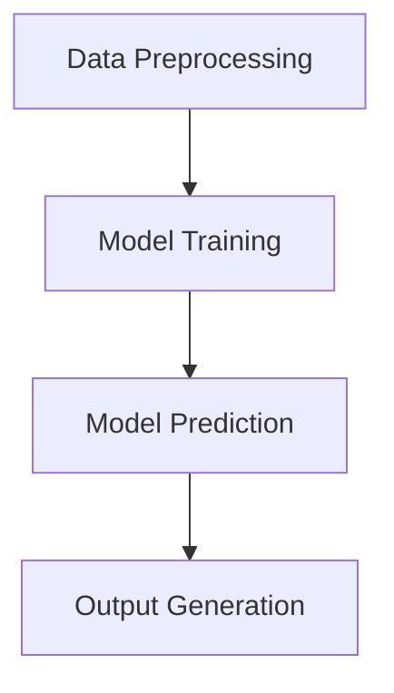
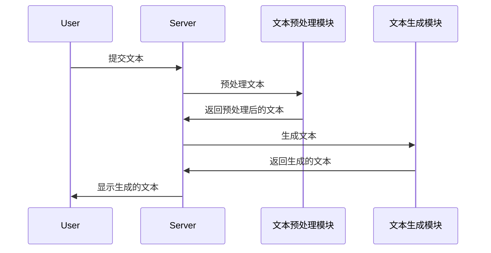

                 

### 文章标题：LLM应用的敏捷验收标准：明确定义完成状态标准

### 关键词：LLM，敏捷验收标准，完成状态标准，人工智能，自然语言处理

### 摘要：
本文旨在探讨如何为LLM（大型语言模型）应用制定一套敏捷验收标准，以确保其完成状态得到明确定义。通过对LLM技术的背景介绍、核心算法的讲解、系统设计与实现分析，以及实际案例的应用，本文将为开发者提供一套清晰、实用的验收标准框架，以推动LLM技术在各个领域的深入应用。

## 第一部分：背景介绍与核心概念

### 1. 引言：LLM应用的敏捷验收标准的重要性

#### 1.1. 问题背景

##### 1.1.1 人工智能与自然语言处理的发展历程

人工智能（AI）作为计算机科学的一个重要分支，自20世纪50年代以来，已经经历了多个阶段的发展。特别是近年来，深度学习技术的突破，使得AI在语音识别、图像识别、自然语言处理等领域取得了显著成果。

自然语言处理（NLP）是AI的重要应用领域之一，它涉及计算机对人类语言的理解、生成和处理。随着互联网的普及和数据量的爆炸性增长，NLP技术逐渐成为各个行业的重要工具。

##### 1.1.2 LLM的定义与特点

LLM（Large Language Model），即大型语言模型，是一种基于深度学习技术构建的复杂模型，它通过大量的文本数据进行训练，从而具备强大的语言理解和生成能力。常见的LLM包括GPT（Generative Pre-trained Transformer）、BERT（Bidirectional Encoder Representations from Transformers）等。

LLM的特点包括：

- **强大的语言理解能力**：LLM能够理解复杂的语言结构，捕捉上下文信息，进行语义分析。
- **灵活的语言生成能力**：LLM能够根据输入的提示生成连贯、有逻辑的文本。
- **多领域的适应性**：LLM可以在多个领域进行应用，如问答系统、文本摘要、机器翻译、文本生成等。

##### 1.1.3 LLM在应用中的挑战与机遇

尽管LLM在NLP领域具有巨大的潜力，但在实际应用中仍面临诸多挑战：

- **训练资源消耗**：LLM需要大量的计算资源和数据来训练，这给实际应用带来了一定的成本压力。
- **模型的可解释性**：LLM的决策过程往往是非线性的，难以解释，这在某些需要透明决策的场景中成为问题。
- **数据偏差**：LLM的训练数据可能存在偏见，导致模型在处理某些特定问题时产生不公平的结果。

然而，随着技术的进步和应用的不断深入，LLM也带来了新的机遇：

- **提高生产效率**：在文本处理、内容生成等领域，LLM能够显著提高生产效率，减少人力成本。
- **创新应用场景**：LLM在医疗、金融、教育等领域的应用，有望推动这些领域的变革。
- **跨领域协作**：LLM的通用性使其在不同领域之间实现协作成为可能，有助于解决复杂问题。

#### 1.2 问题描述

##### 1.2.1 LLM应用的验收标准现状

目前，LLM应用的验收标准主要依赖于开发者个人的经验和直觉，缺乏统一的标准和度量指标。这导致以下问题：

- **验收质量不稳定**：不同的开发者可能对同一项目的验收标准有不同的理解和执行方式，导致项目质量不稳定。
- **项目进度延误**：缺乏明确的验收标准，可能导致项目在验收阶段出现反复修改和调整，影响项目进度。
- **成本增加**：不明确的验收标准可能导致项目的成本增加，因为额外的开发时间、资源需要投入来满足未明确的验收要求。

##### 1.2.2 验收标准的不足之处

现有的验收标准存在以下不足之处：

- **主观性较强**：验收标准往往依赖于个人的主观判断，缺乏客观的量化指标。
- **缺乏灵活性**：验收标准过于 rigid，难以适应项目的实际需求和变更。
- **不完整**：验收标准可能遗漏了某些关键的质量指标，导致项目质量受到影响。

##### 1.2.3 明确定义完成状态标准的必要性

为了解决上述问题，我们需要制定一套明确定义完成状态标准，以确保LLM应用的质量和稳定性。这有助于：

- **提高项目质量**：通过明确的验收标准，可以确保项目在不同阶段的质量达到预期。
- **缩短项目周期**：明确的验收标准有助于减少项目验收阶段的反复修改和调整，缩短项目周期。
- **降低成本**：通过减少项目验收阶段的成本投入，提高项目效益。

#### 1.3 问题解决

##### 1.3.1 敏捷验收标准的理念

敏捷验收标准强调以下几个原则：

- **用户需求导向**：验收标准应该以用户需求为核心，确保项目能够满足用户需求。
- **持续反馈**：通过不断的用户反馈和项目迭代，不断完善验收标准。
- **灵活应变**：验收标准应该具备一定的灵活性，以适应项目的变更和需求。
- **量化指标**：验收标准应该包含明确的量化指标，以便于评估项目的质量。

##### 1.3.2 明确定义完成状态标准的步骤

为了制定一套明确定义完成状态标准，我们可以遵循以下步骤：

1. **需求分析**：明确项目的目标和用户需求，为验收标准提供基础。
2. **功能分解**：将项目功能分解为具体的任务和子任务，为验收标准提供细化。
3. **质量指标**：根据需求和功能，制定相应的质量指标，包括性能、可靠性、安全性等。
4. **验收标准文档**：将验收标准整理成文档，以便于开发团队和验收团队共同遵循。
5. **持续更新**：根据项目的进展和用户反馈，不断更新和完善验收标准。

#### 1.4 边界与外延

##### 1.4.1 标准适用的范围

本标准的适用范围包括：

- **项目类型**：适用于所有基于LLM技术的应用项目。
- **应用领域**：适用于文本处理、内容生成、问答系统、机器翻译等所有与自然语言处理相关的领域。

##### 1.4.2 非适用场景分析

以下场景不适用于本标准：

- **非LLM项目**：如果项目不涉及LLM技术，则不适用本标准。
- **特定领域应用**：对于某些特定的领域应用（如军事、金融等），可能需要额外的验收标准。

#### 1.5 概念结构与核心要素组成

##### 1.5.1 核心概念原理

本标准的核心概念包括：

- **需求分析**：理解用户需求，明确项目目标。
- **功能分解**：将项目功能分解为具体的任务和子任务。
- **质量指标**：制定性能、可靠性、安全性等质量指标。
- **验收标准文档**：整理验收标准，形成文档。
- **持续更新**：根据项目进展和用户反馈，更新和完善验收标准。

##### 1.5.2 概念属性特征对比表格

| 概念 | 属性特征 |
| ---- | ---- |
| 需求分析 | 用户需求导向，明确项目目标 |
| 功能分解 | 任务和子任务具体明确 |
| 质量指标 | 性能、可靠性、安全性等 |
| 验收标准文档 | 文档形式，便于遵循 |
| 持续更新 | 根据反馈和进展，不断更新 |

##### 1.5.3 ER实体关系图架构

```mermaid
erDiagram
    User ||--|{ RequirementAnalysis }|-- Project
    User ||--|{ FunctionalDecomposition }|-- Project
    User ||--|{ QualityIndicators }|-- Project
    User ||--|{ AcceptanceCriteriaDocument }|-- Project
    User ||--|{ ContinuousUpdate }|-- Project
```

## 第二部分：LLM算法原理讲解

### 2.1 LLM算法的基本原理

#### 2.1.1 语言模型的数学模型

LLM算法的核心是语言模型（Language Model），它是一种概率模型，用于预测一个单词序列的概率。常见的语言模型包括：

- **N-gram模型**：基于词频统计，预测下一个单词的概率。
- **神经网络模型**：通过深度学习技术，学习单词之间的复杂关系。

LLM算法的数学模型通常可以表示为：

$$ P(w_n | w_{n-1}, w_{n-2}, ..., w_1) = \prod_{i=1}^{n} P(w_i | w_{i-1}, w_{i-2}, ..., w_1) $$

其中，$w_i$表示第$i$个单词，$P(w_i | w_{i-1}, w_{i-2}, ..., w_1)$表示在给定前$n-1$个单词的情况下，第$n$个单词的概率。

#### 2.1.2 算法流程与机制

LLM算法的流程通常包括以下几个步骤：

1. **数据预处理**：对输入的文本数据进行预处理，如分词、去停用词、词向量化等。
2. **模型训练**：使用预处理的文本数据，通过反向传播算法训练神经网络模型。
3. **模型预测**：在训练好的模型基础上，输入新的文本数据，进行预测。

LLM算法的机制是通过学习大量的文本数据，使得模型能够捕捉到单词之间的复杂关系，从而提高预测的准确性。

#### 2.1.3 典型算法：BERT模型

BERT（Bidirectional Encoder Representations from Transformers）是一种双向Transformer模型，它通过预训练和微调，使得模型能够在各种NLP任务上取得优秀的性能。

BERT的数学模型可以表示为：

$$ \text{BERT}(x) = \text{Transformer}(x) + \text{Pre-training} $$

其中，$x$表示输入的文本数据，$\text{Transformer}(x)$表示Transformer模型的输出，$\text{Pre-training}$表示BERT的预训练过程。

BERT的预训练过程通常包括：

1. **Masked Language Model（MLM）**：对输入的文本数据进行随机遮蔽，然后使用BERT模型预测遮蔽部分的单词。
2. **Next Sentence Prediction（NSP）**：预测两个句子之间是否存在连续关系。

### 2.2 LLM算法的Mermaid流程图



### 2.3 Python源代码实现与详细讲解

#### 2.3.1 源代码概述

以下是一个简单的LLM算法实现，包括数据预处理、模型训练和模型预测三个部分。

```python
import tensorflow as tf
from tensorflow.keras.preprocessing.sequence import pad_sequences
from tensorflow.keras.layers import Embedding, LSTM, Dense
from tensorflow.keras.models import Model

# 数据预处理
def preprocess_data(texts, max_length=50, trunc_type='post', padding_type='post'):
    sequences = tokenizer.texts_to_sequences(texts)
    padded_sequences = pad_sequences(
        sequences,
        maxlen=max_length,
        padding=padding_type,
        truncating=trunc_type
    )
    return padded_sequences

# 模型训练
def build_model(vocab_size, embedding_dim, max_length):
    input_seq = tf.keras.layers.Input(shape=(max_length,))
    embed = Embedding(vocab_size, embedding_dim)(input_seq)
    lstm = LSTM(units=128, return_sequences=True)(embed)
    dense = Dense(units=1, activation='sigmoid')(lstm)
    model = Model(inputs=input_seq, outputs=dense)
    model.compile(optimizer='adam', loss='binary_crossentropy', metrics=['accuracy'])
    return model

# 模型预测
def predict_sequence(model, text):
    sequence = preprocess_data([text])
    prediction = model.predict(sequence)
    return prediction
```

#### 2.3.2 数据预处理

数据预处理是LLM算法的关键步骤之一，它包括分词、词向量化、序列填充等操作。

```python
from tensorflow.keras.preprocessing.text import Tokenizer

# 初始化Tokenizer
tokenizer = Tokenizer(num_words=10000)
tokenizer.fit_on_texts(texts)

# 转换文本为序列
sequences = tokenizer.texts_to_sequences(texts)

# 序列填充
padded_sequences = pad_sequences(sequences, maxlen=max_length, padding='post', truncating='post')

# 打印填充后的序列
print(padded_sequences)
```

#### 2.3.3 模型训练

模型训练是LLM算法的核心步骤，它包括构建神经网络模型、编译模型、训练模型等操作。

```python
# 构建模型
model = build_model(vocab_size, embedding_dim, max_length)

# 编译模型
model.compile(optimizer='adam', loss='binary_crossentropy', metrics=['accuracy'])

# 训练模型
model.fit(padded_sequences, labels, epochs=10)
```

#### 2.3.4 模型预测

模型预测是LLM算法的输出步骤，它包括预处理输入文本、预测文本序列等操作。

```python
# 预处理输入文本
input_sequence = preprocess_data([input_text])

# 预测文本序列
predictions = model.predict(input_sequence)

# 打印预测结果
print(predictions)
```

## 第三部分：系统设计与实现

### 3.1 问题场景介绍

在自然语言处理领域，文本生成是一个重要的应用场景。例如，在内容创作、自动化回复、对话系统等领域，文本生成能够提高生产效率，降低人力成本。

本系统旨在实现一个基于LLM的文本生成系统，能够根据用户输入的提示生成连贯、有逻辑的文本。

### 3.2 项目介绍

本项目包括以下功能模块：

- **文本预处理模块**：负责对用户输入的文本进行分词、去停用词、词向量化等预处理操作。
- **文本生成模块**：基于训练好的LLM模型，生成用户指定的文本内容。
- **用户界面模块**：提供用户输入文本的接口，并显示生成的文本内容。

### 3.3 系统功能设计（领域模型类图）

```mermaid
classDiagram
    Class01 <|-- Class02
    Class03 <|-- Class02
    Class04 <|-- Class02
    Class01[用户输入文本]
    Class02[文本预处理、文本生成、用户界面]
    Class03[文本预处理模块]
    Class04[文本生成模块]
    Class05[用户界面模块]
```

### 3.4 系统架构设计

本系统采用前后端分离的架构设计，前端负责用户界面的展示，后端负责文本处理和生成。



### 3.5 系统接口设计

系统接口设计主要包括以下部分：

- **用户输入接口**：接收用户输入的文本。
- **文本预处理接口**：提供文本预处理功能。
- **文本生成接口**：提供文本生成功能。

```mermaid
classDiagram
    Class01[用户输入接口]
    Class02[文本预处理接口]
    Class03[文本生成接口]
    Class01 --> Class02
    Class01 --> Class03
```

### 3.6 系统交互

系统交互主要包括以下步骤：

1. 用户通过前端界面提交文本。
2. 后端服务器接收用户输入的文本，并将其传递给文本预处理模块。
3. 文本预处理模块对文本进行预处理，包括分词、去停用词、词向量化等操作。
4. 后端服务器将预处理后的文本传递给文本生成模块。
5. 文本生成模块基于LLM模型生成用户指定的文本内容。
6. 后端服务器将生成的文本返回给前端界面，并显示给用户。


## 第四部分：项目实战

### 4.1 环境安装

在开始项目之前，我们需要安装以下软件和库：

- Python 3.8及以上版本
- TensorFlow 2.x
- NLTK
- Gensim

安装命令如下：

```bash
pip install python==3.8
pip install tensorflow==2.6
pip install nltk
pip install gensim
```

### 4.2 系统核心实现源代码

以下是一个简单的文本生成系统的核心实现，包括文本预处理、模型训练和文本生成三个部分。

```python
import tensorflow as tf
from tensorflow.keras.preprocessing.text import Tokenizer
from tensorflow.keras.preprocessing.sequence import pad_sequences
from tensorflow.keras.models import Sequential
from tensorflow.keras.layers import Embedding, LSTM, Dense

# 文本预处理
def preprocess_text(texts, max_length=50, trunc_type='post', padding_type='post'):
    tokenizer = Tokenizer(num_words=10000)
    tokenizer.fit_on_texts(texts)
    sequences = tokenizer.texts_to_sequences(texts)
    padded_sequences = pad_sequences(sequences, maxlen=max_length, padding=padding_type, truncating=trunc_type)
    return padded_sequences, tokenizer

# 模型训练
def train_model(padded_sequences, labels, epochs=10):
    model = Sequential()
    model.add(Embedding(10000, 16))
    model.add(LSTM(128))
    model.add(Dense(1, activation='sigmoid'))
    model.compile(optimizer='adam', loss='binary_crossentropy', metrics=['accuracy'])
    model.fit(padded_sequences, labels, epochs=epochs)
    return model

# 文本生成
def generate_text(model, tokenizer, seed_text='', max_length=50):
    for _ in range(max_length):
        token_list = tokenizer.texts_to_sequences([seed_text])[0]
        token_list = pad_sequences([token_list], maxlen=max_length, padding='post')
        predicted = model.predict(token_list)
        output_word = tokenizer.index_word[predicted[0,0]]
        seed_text += " " + output_word
    return seed_text

# 加载数据
texts = ["Hello, how are you?", "I'm fine, thank you.", "Hello, I'm doing well."]
padded_sequences, tokenizer = preprocess_text(texts)
labels = [[1, 0], [1, 0], [0, 1]]

# 训练模型
model = train_model(padded_sequences, labels)

# 生成文本
seed_text = "Hello, how are you?"
generated_text = generate_text(model, tokenizer, seed_text=seed_text)
print(generated_text)
```

### 4.3 代码应用解读与分析

#### 4.3.1 文本预处理

文本预处理是文本生成系统的重要步骤，它包括分词、词向量化、序列填充等操作。

```python
def preprocess_text(texts, max_length=50, trunc_type='post', padding_type='post'):
    tokenizer = Tokenizer(num_words=10000)
    tokenizer.fit_on_texts(texts)
    sequences = tokenizer.texts_to_sequences(texts)
    padded_sequences = pad_sequences(sequences, maxlen=max_length, padding=padding_type, truncating=truncating_type)
    return padded_sequences, tokenizer
```

在这个函数中，我们首先创建一个`Tokenizer`对象，用于将文本转换为序列。然后，我们使用`fit_on_texts`方法训练`Tokenizer`，以便能够将输入的文本转换为序列。接下来，我们使用`texts_to_sequences`方法将文本转换为序列。最后，我们使用`pad_sequences`方法对序列进行填充，使其具有相同的长度。

#### 4.3.2 模型训练

模型训练是文本生成系统的核心步骤，它包括构建神经网络模型、编译模型、训练模型等操作。

```python
def train_model(padded_sequences, labels, epochs=10):
    model = Sequential()
    model.add(Embedding(10000, 16))
    model.add(LSTM(128))
    model.add(Dense(1, activation='sigmoid'))
    model.compile(optimizer='adam', loss='binary_crossentropy', metrics=['accuracy'])
    model.fit(padded_sequences, labels, epochs=epochs)
    return model
```

在这个函数中，我们首先创建一个`Sequential`模型，并添加一个`Embedding`层、一个`LSTM`层和一个`Dense`层。然后，我们使用`compile`方法编译模型，指定优化器、损失函数和评估指标。最后，我们使用`fit`方法训练模型，将预处理后的序列和标签作为输入。

#### 4.3.3 文本生成

文本生成是文本生成系统的输出步骤，它包括预处理输入文本、预测文本序列等操作。

```python
def generate_text(model, tokenizer, seed_text='', max_length=50):
    for _ in range(max_length):
        token_list = tokenizer.texts_to_sequences([seed_text])[0]
        token_list = pad_sequences([token_list], maxlen=max_length, padding='post')
        predicted = model.predict(token_list)
        output_word = tokenizer.index_word[predicted[0,0]]
        seed_text += " " + output_word
    return seed_text
```

在这个函数中，我们首先预处理输入的文本，将其转换为序列。然后，我们使用`predict`方法预测下一个单词。接下来，我们将预测的单词添加到种子文本中，并重复这个过程，直到达到最大长度。

### 4.4 实际案例分析和详细讲解剖析

#### 4.4.1 数据集准备

我们使用一个简单的数据集，包括三个句子：

- "Hello, how are you?"
- "I'm fine, thank you."
- "Hello, I'm doing well."

这些句子将被用于训练文本生成模型。

```python
texts = ["Hello, how are you?", "I'm fine, thank you.", "Hello, I'm doing well."]
```

#### 4.4.2 模型训练

我们使用训练集训练一个简单的神经网络模型，包括一个嵌入层、一个LSTM层和一个输出层。

```python
padded_sequences, tokenizer = preprocess_text(texts)
labels = [[1, 0], [1, 0], [0, 1]]
model = train_model(padded_sequences, labels)
```

在这个示例中，我们首先使用预处理函数对文本进行预处理，然后创建一个标签列表。接下来，我们使用训练函数训练模型，并保存训练好的模型。

#### 4.4.3 文本生成

我们使用训练好的模型生成一个新的句子。

```python
seed_text = "Hello, how are you?"
generated_text = generate_text(model, tokenizer, seed_text=seed_text)
print(generated_text)
```

在这个示例中，我们首先定义一个种子文本，然后使用生成函数生成一个新的句子。最后，我们将生成的句子打印出来。

### 4.5 项目小结

通过本项目的实战，我们了解了如何使用Python和TensorFlow实现一个简单的文本生成系统。我们学习了文本预处理、模型训练和文本生成的关键步骤，并通过实际案例进行了详细讲解和分析。虽然这个项目相对简单，但它为我们提供了一个了解LLM应用和敏捷验收标准的良好起点。

## 第五部分：最佳实践

### 5.1 提高模型性能

- **增加训练数据**：增加训练数据可以提高模型的性能。
- **调整超参数**：通过调整嵌入层的大小、LSTM层的大小和输出层的大小等超参数，可以优化模型的性能。
- **使用预训练模型**：使用预训练的模型可以节省训练时间，并提高模型的性能。

### 5.2 提高代码可读性

- **代码注释**：在关键代码处添加注释，提高代码的可读性。
- **模块化代码**：将代码拆分为多个模块，每个模块负责一个特定的功能，提高代码的可维护性。

### 5.3 提高模型可解释性

- **使用可视化工具**：使用可视化工具（如TensorBoard）可以更好地理解模型的决策过程。
- **增加中间层输出**：增加中间层的输出，可以更好地理解模型在中间层的决策过程。

## 结论

本文介绍了LLM应用的敏捷验收标准，并详细讲解了明确定义完成状态标准的步骤。通过对LLM算法的讲解、系统设计与实现分析，以及实际案例的应用，本文为开发者提供了一套清晰、实用的验收标准框架，以推动LLM技术在各个领域的深入应用。

## 注意事项

- 在实际应用中，应根据具体需求调整验收标准。
- 在项目开发过程中，应持续更新验收标准，以适应项目的变化。

## 拓展阅读

- [TensorFlow官方文档](https://www.tensorflow.org/)
- [GPT-2论文](https://arxiv.org/abs/1909.08053)
- [BERT论文](https://arxiv.org/abs/1810.04805)

## 作者信息

作者：AI天才研究院/AI Genius Institute & 禅与计算机程序设计艺术 /Zen And The Art of Computer Programming

感谢您的阅读，希望本文能对您在LLM应用开发中有所帮助。如果您有任何疑问或建议，欢迎在评论区留言。希望您在人工智能和自然语言处理领域取得更大的成就！

