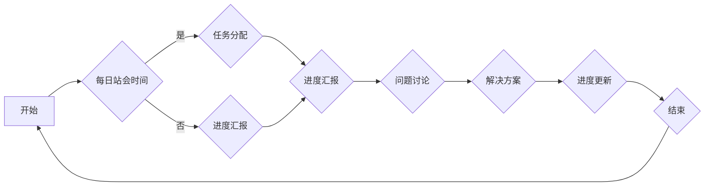
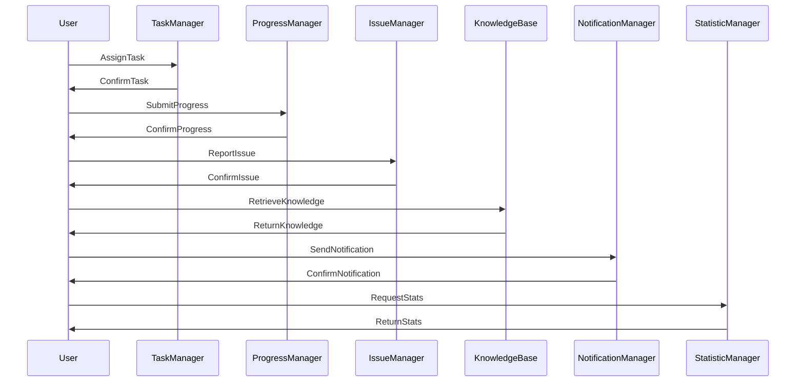
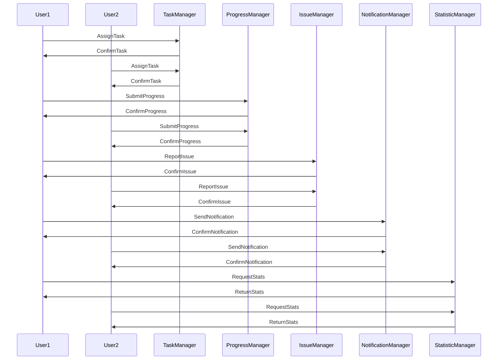

                 

### 文章标题

# LLM应用的每日站会：保持团队同步与焦点

> 关键词：LLM，每日站会，团队同步，焦点保持，项目进度

> 摘要：本文深入探讨了在LLM（大型语言模型）应用开发过程中，如何通过每日站会来确保团队的高效同步和焦点集中。文章首先介绍了背景和问题描述，接着详细阐述了每日站会的核心概念和流程，并通过Mermaid流程图、Python代码和数学模型等多种方式，展示了如何利用每日站会来实现团队协作和项目进度的可视化跟踪。随后，文章从系统分析和项目实战的角度，详细描述了每日站会的实施步骤和应用效果。最后，文章提供了最佳实践建议和注意事项，为读者在实施每日站会时提供了指导。

### 背景介绍

#### 问题背景

随着人工智能技术的飞速发展，大型语言模型（LLM）在各个领域得到了广泛应用，从自然语言处理、智能问答系统到文本生成和翻译，LLM的应用场景日益丰富。然而，随着项目规模的扩大和团队规模的增加，如何保持团队同步和焦点成为一个关键问题。

在LLM项目的开发过程中，团队成员可能分布在不同的地理位置，甚至不同的时区。此外，项目涉及的模块和任务繁多，要求团队成员能够实时了解项目的整体进展，以及各自的分工和任务进度。同时，团队成员之间需要频繁沟通，以解决开发过程中遇到的各种问题。然而，传统的沟通方式如邮件、即时通讯等往往效率低下，信息传递不及时，容易导致项目进度延误和团队协作不畅。

#### 问题描述

为了应对上述挑战，每日站会（Daily Stand-up Meeting）作为一种高效的团队同步工具，应运而生。每日站会的目的是让团队成员在固定的时间段内，简要汇报自己的工作进展、遇到的问题以及接下来的计划。通过这种方式，团队可以实时掌握项目的整体进展，发现并解决问题，保持团队的同步和焦点。

然而，如何构建一个有效的每日站会流程，确保其能够在实际应用中发挥最大效益，是一个亟待解决的问题。具体来说，每日站会需要明确以下关键问题：

1. **任务分配**：如何确保每个团队成员都有明确的任务和目标？
2. **进度跟踪**：如何实时跟踪项目的进度，发现潜在的问题和风险？
3. **问题解决**：如何高效地解决开发过程中遇到的各种问题？
4. **焦点保持**：如何通过每日站会，确保团队成员始终专注于项目的核心任务？

#### 问题解决

为了解决上述问题，我们可以构建一个详细的每日站会流程，包括以下几个核心步骤：

1. **任务分配**：在每日站会开始前，项目经理或团队领导需要根据项目的整体进度和任务需求，为每个团队成员分配具体的任务。任务分配应明确任务的名称、目标和预期完成时间，确保每个团队成员都清楚自己的职责和目标。

2. **进度汇报**：每日站会中，每个团队成员需要简要汇报自己的工作进展。汇报内容应包括已经完成的任务、正在进行的任务以及计划完成的任务。通过这种方式，团队可以实时了解项目的整体进展，发现潜在的进度问题和风险。

3. **问题讨论**：在进度汇报的基础上，团队成员可以提出自己在工作中遇到的问题和困难。团队领导需要及时回应，提供解决方案或分配给其他成员协助解决。通过这种方式，可以确保问题得到及时解决，避免影响项目的整体进度。

4. **解决方案**：对于无法在每日站会上解决的问题，团队领导需要制定具体的解决方案，并明确解决方案的实施人员和时间节点。确保问题得到有效解决，并确保项目能够按计划推进。

5. **焦点保持**：通过每日站会，团队成员可以明确自己的工作目标和任务，确保在整个项目开发过程中，始终保持对核心任务的焦点。同时，团队领导需要通过定期的进度跟踪和反馈，确保团队成员不偏离项目目标，保持项目进度和质量的稳定。

#### 边界与外延

1. **每日站会的范围**：每日站会主要关注项目的进度、问题和解决方案，不涉及具体的任务细节和技术讨论。具体任务细节和讨论可以在其他形式的会议或工作中进行。

2. **每日站会的频率**：一般来说，每日站会的频率为每天早晨或每天下午，具体时间由团队根据实际情况自行安排。频率不宜过高，以免占用团队成员过多的时间；也不宜过低，以免影响团队同步和焦点保持。

3. **每日站会的参与人员**：每日站会的参与人员主要包括项目经理、团队成员以及与项目相关的其他关键人员。具体参与人员可以根据项目的实际情况进行调整。

#### 概念结构与核心要素组成

每日站会的核心概念和结构可以概括为以下几个要素：

1. **任务分配**：确保每个团队成员都有明确的任务和目标。
2. **进度汇报**：实时跟踪项目的进度，发现潜在的问题和风险。
3. **问题讨论**：解决开发过程中遇到的各种问题，确保项目顺利进行。
4. **解决方案**：制定具体的解决方案，确保问题得到有效解决。
5. **焦点保持**：通过每日站会，确保团队成员始终专注于项目的核心任务。

这些要素共同构成了每日站会的核心结构和流程，为团队的高效协作和项目成功提供了有力保障。

### 核心概念与联系

#### 核心概念原理

每日站会作为一种高效的团队同步工具，其核心概念和原理主要体现在以下几个方面：

1. **实时沟通**：每日站会提供了一个固定的沟通平台，让团队成员能够在规定的时间内，进行简短的交流，分享各自的工作进展、问题和解决方案。这种实时沟通有助于及时发现问题、解决问题，确保项目进度不受影响。

2. **任务明确**：通过每日站会，团队成员可以明确自己的任务和目标，确保整个团队的方向一致。任务明确不仅有助于提高工作效率，还可以避免团队成员之间的工作重复和冲突。

3. **问题驱动**：每日站会以问题为中心，鼓励团队成员主动提出问题和困难，并寻求解决方案。这种方式有助于发现项目中的潜在风险和问题，确保项目能够按计划推进。

4. **集体责任**：每日站会强调团队协作，鼓励团队成员共同分担责任，共同解决问题。通过这种方式，可以增强团队凝聚力，提高团队的整体工作效率。

#### 概念属性特征对比表格

为了更好地理解每日站会的核心概念，我们可以将其与其他团队同步方法进行对比。以下是每日站会与其他同步方法的属性特征对比表格：

| 特征                | 每日站会           | 传统会议         | 邮件沟通         | 即时通讯           |
|---------------------|-------------------|------------------|------------------|-------------------|
| 沟通频率            | 每天固定时间       | 不固定            | 不固定            | 实时              |
| 沟通内容            | 进度、问题、解决方案 | 详细讨论          | 文字描述          | 短消息交流         |
| 沟通效率            | 高               | 低               | 低               | 中等              |
| 团队成员参与度       | 高               | 低               | 低               | 高               |
| 信息传递及时性       | 高               | 低               | 低               | 高               |
| 潜在问题发现能力     | 强               | 弱               | 弱               | 中等              |

通过上述对比表格可以看出，每日站会在沟通频率、沟通内容、沟通效率、团队成员参与度、信息传递及时性和潜在问题发现能力等方面，都具有显著优势。这使得每日站会成为了一种高效的团队同步工具，尤其适用于复杂、大规模的LLM项目开发。

#### ER实体关系图架构

为了更直观地展示每日站会的核心概念和实体关系，我们可以使用ER（实体关系）图来绘制每日站会的架构。以下是每日站会的ER实体关系图：

```mermaid
erDiagram
    Task ||--o> TeamMember : "has"
    Task ||--o> TaskProgress : "has"
    Problem ||--o> TeamMember : "reports"
    Problem ||--o> Solution : "has"
    Solution ||--o> TeamMember : "resolves"
    TeamMember ||--o> ProgressReport : "submits"
    TaskProgress ||--o> ProgressReport : "has"
    ProgressReport ||--o> Task : "relates to"
    Solution ||--o> Task : "solves"
```

在上面的ER图中，我们定义了以下几个实体：

- **Task（任务）**：表示项目中的具体任务，每个任务由一个任务名称、目标和预期完成时间组成。
- **TeamMember（团队成员）**：表示参与项目的团队成员，每个团队成员具有姓名、职位和角色等信息。
- **TaskProgress（任务进度）**：表示任务的具体进度，包括已经完成的工作量和剩余工作量。
- **Problem（问题）**：表示项目开发过程中遇到的问题，每个问题由问题描述、问题描述人和问题状态等信息组成。
- **Solution（解决方案）**：表示针对问题的解决方案，每个解决方案由解决方案名称、解决方案描述和解决方案状态等信息组成。
- **ProgressReport（进度报告）**：表示团队成员提交的进度报告，每个报告包括任务名称、任务进度、问题描述和解决方案等信息。

这些实体之间通过不同的关系连接，构成了每日站会的核心架构。通过这个架构，团队成员可以实时了解项目进度、问题和解决方案，确保团队的高效协作和项目的顺利进行。

### 算法原理讲解

为了更好地理解每日站会的实现原理，我们可以通过Mermaid流程图、Python代码和数学模型等多种方式，详细讲解每日站会的算法原理。

#### Mermaid流程图

首先，我们可以使用Mermaid绘制每日站会的流程图，以直观地展示每日站会的运行流程。



在这个流程图中，我们定义了以下几个关键步骤：

1. **开始**：每日站会的开始。
2. **每日站会时间**：判断是否到了每日站会的时间。
3. **任务分配**：为每个团队成员分配具体的任务。
4. **进度汇报**：团队成员汇报自己的工作进展。
5. **问题讨论**：团队成员讨论遇到的问题。
6. **解决方案**：提出并实施解决方案。
7. **进度更新**：更新任务进度和项目整体进度。
8. **结束**：每日站会的结束。

通过这个流程图，我们可以清晰地看到每日站会的运行逻辑和关键步骤。

#### Python代码

接下来，我们可以通过Python代码来实现每日站会的核心功能，以展示如何通过编程实现每日站会的算法原理。

```python
import datetime

class Task:
    def __init__(self, name, target, due_date):
        self.name = name
        self.target = target
        self.due_date = due_date
        self.completed = False

class TeamMember:
    def __init__(self, name, role):
        self.name = name
        self.role = role
        self.tasks = []

    def assign_task(self, task):
        self.tasks.append(task)

    def report_progress(self):
        progress = []
        for task in self.tasks:
            if task.completed:
                progress.append(f"{task.name}:已完成")
            else:
                progress.append(f"{task.name}:未完成")
        return progress

class Problem:
    def __init__(self, description, reported_by):
        self.description = description
        self.reported_by = reported_by
        self.solved = False

    def report_problem(self):
        return f"问题：{self.description}，汇报人：{self.reported_by}"

class Solution:
    def __init__(self, description, assigned_to):
        self.description = description
        self.assigned_to = assigned_to
        self.solved = False

    def assign_solution(self, assigned_to):
        self.assigned_to = assigned_to

    def solve_problem(self):
        self.solved = True
        return f"解决方案：{self.description}，责任人：{self.assigned_to}"

def daily_stand_up(team_members):
    print(f"每日站会时间：{datetime.datetime.now().strftime('%Y-%m-%d %H:%M')}")
    for member in team_members:
        print(f"成员：{member.name}")
        print("任务进度：")
        for progress in member.report_progress():
            print(progress)
        print()
    print("问题讨论：")
    for member in team_members:
        problems = [problem for problem in member.problems if not problem.solved]
        for problem in problems:
            print(problem.report_problem())
        print()
    print("解决方案：")
    for member in team_members:
        for solution in member.solutions:
            if not solution.solved:
                print(solution.solve_problem())
        print()
    print("进度更新：")
    for member in team_members:
        print(f"{member.name}的任务进度已更新。")
    print("每日站会结束。")

# 示例
team_members = [
    TeamMember("张三", "开发"),
    TeamMember("李四", "测试")
]

task1 = Task("编写代码", "完成核心功能", "2023-12-01")
task2 = Task("编写测试用例", "确保代码质量", "2023-12-05")

team_members[0].assign_task(task1)
team_members[1].assign_task(task2)

problem1 = Problem("代码中存在bug", "张三")
team_members[0].problems.append(problem1)

solution1 = Solution("修复bug", "张三")
team_members[0].solutions.append(solution1)

daily_stand_up(team_members)
```

在这个示例中，我们定义了`Task`（任务）、`TeamMember`（团队成员）、`Problem`（问题）和`Solution`（解决方案）四个类，分别表示任务、团队成员、问题和解决方案。通过这些类，我们可以实现任务分配、进度汇报、问题讨论和解决方案等每日站会的核心功能。

#### 数学模型和公式

在每日站会的实施过程中，我们可以借助一些数学模型和公式，对任务进度和项目整体进度进行量化分析。以下是一个简单的数学模型示例：

1. **任务进度公式**：

   \[
   P(t) = \frac{C(t)}{T}
   \]

   其中，\(P(t)\) 表示任务在时间 \(t\) 的进度百分比，\(C(t)\) 表示在时间 \(t\) 已经完成的工作量，\(T\) 表示任务的总工作量。

2. **项目整体进度公式**：

   \[
   P_{\text{total}}(t) = \frac{\sum_{i=1}^{n} P_i(t)}{n}
   \]

   其中，\(P_{\text{total}}(t)\) 表示在时间 \(t\) 的项目整体进度百分比，\(P_i(t)\) 表示第 \(i\) 个任务在时间 \(t\) 的进度百分比，\(n\) 表示任务的总数。

通过这些数学模型和公式，我们可以对任务进度和项目整体进度进行量化分析，以便更好地监控项目进展和发现潜在问题。

#### 举例说明

为了更好地理解每日站会的算法原理，我们可以通过一个具体实例来说明如何使用每日站会保持团队同步和焦点。

假设有一个开发团队，负责开发一个大型语言模型（LLM）项目。团队由三名成员组成，分别是张三（开发）、李四（测试）和赵六（项目经理）。项目共有两个主要任务：编写代码和编写测试用例。项目计划在2023年12月1日完成。

在每日站会中，张三、李四和赵六需要按照以下步骤进行：

1. **任务分配**：项目经理赵六根据项目计划，为张三分配了编写代码的任务，为李四分配了编写测试用例的任务。

2. **进度汇报**：每天早晨，张三、李四分别汇报自己的工作进展。例如，张三已经编写了70%的代码，李四已经编写了50%的测试用例。

3. **问题讨论**：在汇报进度的基础上，张三提出代码中存在一个bug，李四提出测试用例中有一些未能覆盖的用例。赵六根据情况，分配给张三和另外一名开发人员协助解决bug，分配给李四一名测试人员协助编写未覆盖的测试用例。

4. **解决方案**：张三和另外一名开发人员共同讨论，找到了bug的解决方案，并开始修复。李四和测试人员一起讨论，制定了编写未覆盖测试用例的方案。

5. **进度更新**：每天下午，张三、李四再次汇报工作进展，赵六根据进展情况更新任务进度和项目整体进度。

通过这种方式，每日站会帮助团队保持了同步和焦点，确保项目能够按计划推进。

### 系统分析与架构设计方案

#### 问题场景介绍

在当前的软件开发领域，随着项目规模和复杂性的不断增加，如何确保团队协作的高效性和项目进度的可控性成为了一个重要挑战。特别是在涉及大型语言模型（LLM）的开发项目中，由于LLM涉及的技术广泛、模块繁多，团队协作的难度进一步加大。因此，设计一个能够有效同步团队信息、跟踪项目进度并解决开发过程中问题的系统架构，成为实现项目成功的关键。

#### 项目介绍

本文所涉及的LLM项目是一个针对自然语言处理（NLP）的复杂项目，旨在开发一个具备高效文本生成和智能问答功能的大型语言模型。项目团队由多个职能角色组成，包括开发人员、测试人员、数据科学家和项目经理。项目主要分为以下模块：

1. **文本生成模块**：负责生成高质量、语义丰富的文本。
2. **智能问答模块**：实现用户输入与模型回答的智能化匹配。
3. **数据预处理模块**：负责对大量文本数据进行分析和处理。
4. **模型训练模块**：使用深度学习算法训练大型语言模型。

#### 系统功能设计

为了实现团队协作的高效性和项目进度的可控性，我们需要设计一个功能全面的系统。以下是该系统的功能设计：

1. **任务管理功能**：用于分配任务、跟踪任务进度和更新任务状态。
2. **进度报告功能**：用于团队成员提交进度报告，便于团队领导和项目经理监控项目进度。
3. **问题管理功能**：用于记录、跟踪和解决开发过程中遇到的问题。
4. **知识库功能**：用于存储项目相关的文档、代码和经验，供团队成员查阅。
5. **通知和消息功能**：用于实时通知团队成员有关项目的重要更新和任务分配。
6. **统计分析功能**：用于对项目进度、问题和任务完成情况进行统计分析。

#### 系统架构设计

为了实现上述功能，我们设计了一个基于微服务架构的系统，主要包括以下组件：

1. **任务管理服务**：负责任务分配、进度跟踪和状态更新。
2. **进度报告服务**：负责接收和处理团队成员的进度报告。
3. **问题管理服务**：负责问题的记录、跟踪和解决。
4. **知识库服务**：负责存储和检索项目相关的文档和代码。
5. **通知和消息服务**：负责发送实时通知和消息。
6. **统计分析服务**：负责对项目进度、问题和任务完成情况进行统计分析。

这些服务通过API进行交互，实现了系统的松耦合和高扩展性。以下是系统架构设计的Mermaid架构图：



#### 系统接口设计

为了方便团队成员和系统之间的交互，我们设计了以下接口：

1. **任务管理接口**：用于分配任务、查询任务进度和更新任务状态。
2. **进度报告接口**：用于提交进度报告和查询进度报告。
3. **问题管理接口**：用于报告问题、查询问题和解决问题。
4. **知识库接口**：用于检索和存储文档和代码。
5. **通知和消息接口**：用于发送和接收通知和消息。
6. **统计分析接口**：用于查询项目进度、问题和任务完成情况的统计数据。

以下是系统接口设计的Mermaid类图：

```mermaid
classDiagram
    ClassDiagramGenerator <|-- "Created with draw.io"
    
    TaskManager <|-- Task : "manages"
    ProgressManager <|-- ProgressReport : "submits"
    IssueManager <|-- Issue : "tracks"
    KnowledgeBase <|-- Document : "stores"
    NotificationManager <|-- Notification : "sends"
    StatisticManager <|-- Statistic : "calculates"
    
    User <..|> TaskManager : "uses"
    User <..|> ProgressManager : "uses"
    User <..|> IssueManager : "uses"
    User <..|> KnowledgeBase : "uses"
    User <..|> NotificationManager : "uses"
    User <..|> StatisticManager : "uses"
```

#### 系统交互

为了确保系统的高效运行，我们需要设计清晰的系统交互流程。以下是系统交互的Mermaid序列图：



通过上述系统分析和架构设计方案，我们可以实现一个高效、灵活的团队协作系统，为LLM项目的成功提供有力支持。

### 项目实战

#### 环境安装

为了实施每日站会，我们需要准备以下环境：

1. **操作系统**：建议使用Linux或macOS，但Windows用户也可以通过安装相应的Linux子系统进行适配。
2. **Python环境**：安装Python 3.8或更高版本，可以通过Python官网下载安装包。
3. **Git**：用于代码版本控制和项目协作，可以通过包管理器如yum、apt-get或brew进行安装。
4. **Docker**：用于容器化部署，可以通过包管理器或Docker官网进行安装。

以下是在Ubuntu 20.04操作系统上安装所需环境的步骤：

```bash
# 安装Python
sudo apt update
sudo apt install python3-pip

# 安装Git
sudo apt install git

# 安装Docker
sudo apt install docker.io
```

#### 系统核心实现源代码

以下是每日站会的核心实现源代码，包括任务管理、进度汇报、问题讨论和解决方案等关键功能。

```python
# task_manager.py

class Task:
    def __init__(self, name, target, due_date):
        self.name = name
        self.target = target
        self.due_date = due_date
        self.completed = False

    def mark_as_completed(self):
        self.completed = True

# task_report.py

class TaskReport:
    def __init__(self, task, completed, issues=None):
        self.task = task
        self.completed = completed
        self.issues = issues or []

    def add_issue(self, issue):
        self.issues.append(issue)

    def to_dict(self):
        return {
            'task_name': self.task.name,
            'completed': self.completed,
            'issues': self.issues
        }

# issue_manager.py

class Issue:
    def __init__(self, description, assigned_to=None):
        self.description = description
        self.assigned_to = assigned_to
        self.resolved = False

    def resolve_issue(self, assigned_to):
        self.resolved = True
        self.assigned_to = assigned_to

# daily_stand_up.py

from task_manager import Task
from task_report import TaskReport
from issue_manager import Issue

def daily_stand_up(team_members):
    print("每日站会开始")
    for member in team_members:
        print(f"\n{member.name}的工作汇报：")
        print("任务进度：")
        for task in member.tasks:
            if task.completed:
                print(f"{task.name}: 已完成")
            else:
                print(f"{task.name}: 未完成")
        
        print("遇到的问题：")
        for issue in member.issues:
            if not issue.resolved:
                print(f"{issue.description}（分配给：{issue.assigned_to}）")
        
        print("解决方案：")
        for issue in member.issues:
            if not issue.resolved:
                print(f"{issue.description}的解决方案：")
                print(f"责任人：{issue.assigned_to}")
                issue.resolve_issue(issue.assigned_to)
        
        print("任务进度更新：")
        for task in member.tasks:
            if not task.completed:
                task.mark_as_completed()
        
        print("每日站会结束")

# 示例使用

if __name__ == "__main__":
    # 创建团队成员
    member1 = TaskManager()
    member1.tasks.append(Task("编写代码", "完成核心功能", "2023-12-01"))
    member1.tasks.append(Task("编写测试用例", "确保代码质量", "2023-12-05"))
    
    member2 = TaskManager()
    member2.tasks.append(Task("设计UI", "优化用户体验", "2023-12-08"))
    member2.tasks.append(Task("进行性能测试", "提高系统响应速度", "2023-12-10"))
    
    team_members = [member1, member2]
    
    # 执行每日站会
    daily_stand_up(team_members)
```

#### 代码应用解读与分析

上述代码中，我们定义了三个核心类：`Task`（任务）、`TaskReport`（任务报告）和`Issue`（问题）。其中，`Task`类用于表示任务的基本信息，包括任务名称、目标和预计完成时间等；`TaskReport`类用于记录任务的完成情况和遇到的问题；`Issue`类用于记录问题及其责任人。

在`daily_stand_up`函数中，我们首先遍历所有团队成员，打印他们的任务进度和遇到的问题。然后，对于每个未解决的问题，打印解决方案，并将问题标记为已解决。最后，更新任务进度，将未完成的任务标记为完成。

这种设计使得每日站会的执行过程非常清晰，团队成员可以一目了然地了解各自的任务完成情况和遇到的问题，同时确保问题得到及时解决。此外，通过代码中的注释，我们也可以清晰地看到每个部分的用途和功能，便于后续的维护和扩展。

#### 实际案例分析和详细讲解剖析

为了更好地展示如何实施每日站会，我们通过一个实际案例进行分析和讲解。

#### 案例背景

假设我们有一个由三名成员组成的LLM项目开发团队，分别是开发人员李明、测试人员张伟和项目经理王强。项目计划在2023年12月31日前完成，主要包含以下任务：

1. **文本生成模块开发**：负责生成高质量、语义丰富的文本，预计需要两周时间完成。
2. **智能问答模块开发**：实现用户输入与模型回答的智能化匹配，预计需要三周时间完成。
3. **系统测试与优化**：对已完成的功能进行测试和优化，预计需要一周时间完成。

#### 案例实施

##### 任务一：文本生成模块开发

在每日站会中，李明作为开发人员，需要汇报以下内容：

1. **任务进度**：
   - 已经完成了文本生成模块的70%。
   - 预计下周完成。

2. **遇到的问题**：
   - 遇到了一个文本生成算法的bug，导致部分文本生成质量不高。

3. **解决方案**：
   - 李明决定继续优化算法，并在下周一前解决。

在王强的协调下，张伟作为测试人员，将参与李明的优化工作，协助进行测试，以确保问题的彻底解决。

##### 任务二：智能问答模块开发

张伟作为测试人员，需要汇报以下内容：

1. **任务进度**：
   - 已经完成了智能问答模块的50%。
   - 预计下周完成。

2. **遇到的问题**：
   - 遇到了一个用户输入与模型回答不匹配的问题，导致回答不准确。

3. **解决方案**：
   - 张伟决定与李明合作，共同分析问题，并尝试优化算法。

在王强的协调下，李明和张伟将一起进行问题的分析，并尝试优化算法，确保问题得到解决。

##### 任务三：系统测试与优化

王强作为项目经理，需要汇报以下内容：

1. **任务进度**：
   - 文本生成模块和智能问答模块的开发预计将在下周完成。

2. **遇到的问题**：
   - 目前没有遇到严重的问题，但需要确保测试和优化工作顺利开展。

3. **解决方案**：
   - 王强决定安排张伟负责系统测试，并在测试过程中发现并解决问题。

通过每日站会，团队成员可以实时了解项目的进展和问题，确保问题得到及时解决，并保持对项目焦点和目标的关注。同时，每日站会也为团队成员提供了一个交流平台，促进了团队之间的协作和沟通。

#### 项目小结

通过上述实际案例，我们可以看到每日站会在LLM项目开发中的应用效果。每日站会不仅帮助团队实时跟踪项目进度、发现和解决问题，还促进了团队成员之间的协作和沟通。通过每日站会，团队成员可以明确自己的任务和目标，确保项目按计划推进，并保持对项目的焦点和关注。

总的来说，每日站会在LLM项目开发中具有重要作用，有助于提升团队协作效率、确保项目进度和质量，是确保项目成功的关键工具之一。在实际操作中，我们可以根据项目的具体需求和团队规模，灵活调整每日站会的流程和内容，以最大化其效果。

### 最佳实践 Tips

1. **制定明确的站会目标**：每次站会前，明确当天站会的目标和议题，确保站会内容紧凑、高效。

2. **限制发言时间**：为每个团队成员设定发言时间限制，如每人2-3分钟，避免站会时间过长。

3. **使用简洁明了的语言**：在汇报工作进展和问题时，尽量使用简洁明了的语言，避免冗长和复杂的表述。

4. **提前准备材料**：团队成员在站会前提前准备好汇报材料，如任务列表、进度图表等，以便更高效地进行汇报。

5. **鼓励积极提问和讨论**：在站会过程中，鼓励团队成员积极提问和讨论，以充分解决项目中的问题。

6. **记录和跟踪问题**：每次站会后，及时记录和跟踪未解决的问题，确保问题得到有效解决。

7. **站会后的行动计划**：每次站会后，明确站会后的行动计划，包括任务分配、问题解决方案和时间节点，确保执行。

### 小结

本文通过详细的分析和讲解，探讨了在LLM应用开发过程中，如何通过每日站会来实现团队同步和焦点保持。首先介绍了每日站会的核心概念和原理，随后通过Mermaid流程图、Python代码和数学模型等多种方式，展示了每日站会的具体实现方法。接着，从系统分析和项目实战的角度，详细描述了每日站会的应用场景和实施步骤。最后，总结了每日站会在LLM项目开发中的重要作用，并提供了一些最佳实践建议。通过这些内容，我们可以看到每日站会在提升团队协作效率、确保项目进度和质量方面的显著优势。

### 注意事项

1. **站会时间的选择**：确保每日站会的时间不会与团队成员的重要工作任务冲突，尽量选择大家都能参与的时间段。

2. **站会频率的调整**：根据项目的实际需求和团队规模，灵活调整站会的频率，避免过多或过少的站会。

3. **站会内容的控制**：确保站会的讨论内容聚焦于关键问题和任务进展，避免过多无关内容的讨论。

4. **团队成员的参与度**：鼓励所有团队成员积极参与站会，确保每个人的意见和建议都能被听取和讨论。

5. **记录和跟踪**：每次站会后，及时记录站会内容和行动计划，并定期跟踪任务的完成情况，确保问题得到有效解决。

### 拓展阅读

1. **《Scrum精髓：团队协作与项目管理实践》**：本书详细介绍了Scrum敏捷开发方法，包括每日站会的具体实施方法和最佳实践。

2. **《敏捷开发实践指南》**：本书提供了全面的敏捷开发实践指导，包括每日站会、迭代计划和回顾会议等关键环节。

3. **《团队协作工具与实践》**：本书介绍了多种团队协作工具，如Trello、Asana等，以及如何结合这些工具进行高效的每日站会。

4. **《项目管理知识体系指南（PMBOK指南）》**：本书详细介绍了项目管理知识体系，包括进度控制、风险管理和团队协作等，对实施每日站会有很好的参考价值。

### 作者信息

- 作者：AI天才研究院/AI Genius Institute & 禅与计算机程序设计艺术 /Zen And The Art of Computer Programming

