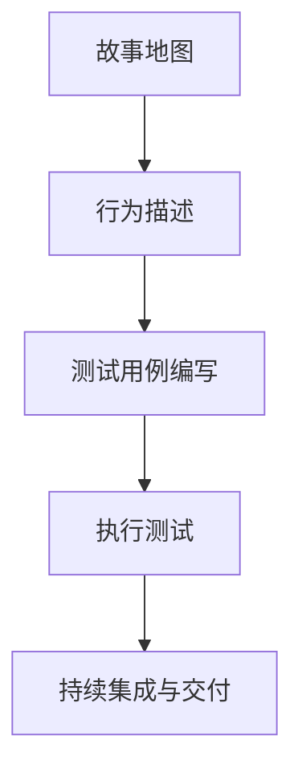
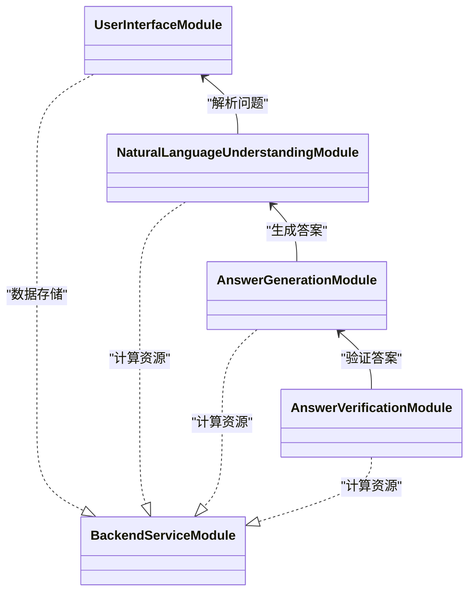
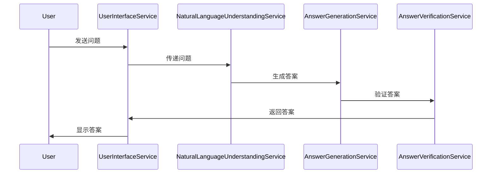
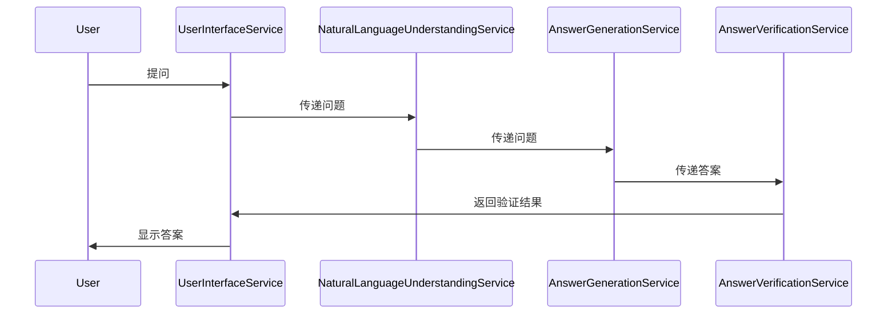

                 

### 1. 引言：问题背景与解决意义

## 1.1 问题背景

近年来，大型语言模型（LLM，Large Language Models）技术取得了显著的进步，如GPT系列、BERT、Turing等，这些模型在自然语言处理（NLP）、问答系统、文本生成、机器翻译等领域表现出卓越的性能。随着LLM技术的成熟，越来越多的企业和组织开始尝试将其应用于实际业务场景中，例如智能客服、内容审核、自动化写作等。然而，在LLM应用的开发过程中，开发人员面临着诸多挑战。

首先，LLM应用开发涉及多个学科领域，包括计算机科学、语言学、数学等。这使得项目团队需要具备跨学科的知识储备，而实际上，团队成员往往在各自的专业领域内具有不同的背景和技能，这导致了沟通上的障碍。其次，LLM应用开发通常需要大规模的数据集和计算资源，这使得团队协作变得复杂，如何合理分配资源、协同工作成为一个重要问题。此外，随着业务需求的变化，LLM应用的需求也在不断迭代，如何快速响应需求变化成为开发过程中的一大难题。

## 1.2 问题描述

在LLM应用开发中，主要面临以下几个问题：

### 1.2.1 沟通障碍
由于团队成员在专业背景和技能上的差异，导致在项目需求讨论、技术方案设计等方面存在沟通障碍，使得项目进展缓慢。

### 1.2.2 协作不畅
在大型项目中，团队成员可能分布在不同的地理位置，协作效率低下。同时，团队成员之间的职责分工不明确，导致工作流程混乱，协作不畅。

### 1.2.3 需求变更
在项目开发过程中，客户需求可能会发生频繁变更。如何快速响应需求变更，保持项目进度和质量，成为开发团队的一大挑战。

## 1.3 问题解决

为了解决上述问题，行为驱动开发（BDD，Behavior-Driven Development）应运而生。BDD是一种敏捷开发方法，旨在提高项目团队的沟通效率和协作能力，帮助团队更好地应对需求变化。BDD的核心思想是将测试与开发紧密结合，通过编写可执行的测试用例，确保软件功能满足用户需求。

在LLM应用开发中，BDD可以发挥以下作用：

### 1.3.1 提高沟通效率
BDD通过明确的需求描述和可执行的测试用例，帮助团队成员更好地理解项目需求和预期结果，减少因沟通不畅而产生的误解和争议。

### 1.3.2 增强协作能力
BDD强调跨职能团队的合作，通过共同编写和执行测试用例，团队成员可以更好地了解彼此的工作内容和进展，提高协作效率。

### 1.3.3 应对需求变化
BDD支持快速迭代和灵活调整，通过持续集成和持续交付，可以快速响应需求变化，确保项目能够按时交付并满足用户需求。

## 1.4 边界与外延

BDD作为一种开发方法，其应用范围不仅限于LLM应用开发，还可以应用于其他软件项目。然而，在LLM应用开发中，BDD具有独特的优势：

### 1.4.1 复杂性管理
LLM应用开发涉及多个学科领域，BDD可以帮助团队更好地理解和管理项目的复杂性。

### 1.4.2 数据集处理
BDD可以应用于数据集的预处理、标注和清洗，确保输入数据的质量和准确性。

### 1.4.3 模型评估
BDD可以通过编写测试用例，对LLM模型进行性能评估和优化，提高模型的准确性和可靠性。

### 1.4.4 持续交付
BDD支持持续集成和持续交付，可以快速迭代和部署LLM应用，满足用户需求。

综上所述，BDD在LLM应用开发中具有重要作用，能够有效解决开发过程中面临的各种问题，提高项目质量和效率。在接下来的章节中，我们将深入探讨BDD的核心概念、原理和方法，以及其在LLM应用开发中的具体应用。通过逐步分析推理，我们将揭示BDD如何助力LLM应用开发，实现高效的沟通和协作。

## 2. 核心概念与联系

在深入探讨BDD在LLM应用开发中的作用之前，我们首先需要明确几个核心概念：大型语言模型（LLM，Large Language Models）和行为驱动开发（BDD，Behavior-Driven Development）。了解这些概念的定义、属性以及它们之间的联系，有助于我们更好地理解BDD在LLM应用开发中的具体应用。

### 2.1 LLM的概念

大型语言模型（LLM）是一种基于深度学习的技术，通过训练大规模语料库，能够生成语义丰富的文本。LLM的核心思想是利用神经网络，尤其是变分自编码器（VAE）和生成对抗网络（GAN）等模型，对语言数据进行建模，从而实现对自然语言的生成和理解。LLM的主要特点包括：

1. **大规模训练数据**：LLM通常需要训练数以百万计的参数，以获取足够的语义信息。
2. **高维度表达**：LLM能够将输入的文本数据映射到高维度的语义空间，从而实现语义理解和生成。
3. **自适应学习**：LLM可以根据不同的任务需求进行微调，以适应特定的应用场景。

### 2.2 BDD的概念

行为驱动开发（BDD）是一种敏捷开发方法，它通过行为描述来引导开发过程，旨在提高团队之间的沟通效率和协作能力。BDD的核心原则包括：

1. **行为导向**：BDD强调以用户需求为中心，通过行为描述来定义软件功能。
2. **跨职能团队**：BDD鼓励不同职能团队（如开发、测试、产品管理等）共同参与需求讨论和测试用例编写。
3. **持续集成与交付**：BDD支持持续集成和持续交付，确保软件质量。

### 2.3 概念属性特征对比

为了更清晰地理解LLM和BDD的概念，我们列出它们的关键特性并进行对比：

| 特性             | 大型语言模型（LLM）                  | 行为驱动开发（BDD）                  |
| ---------------- | ----------------------------------- | ----------------------------------- |
| 目的             | 生成和理解自然语言文本              | 提高软件开发效率和质量               |
| 技术基础         | 深度学习、神经网络、自然语言处理（NLP） | 敏捷开发、测试驱动开发（TDD）、行为描述 |
| 主要挑战         | 数据集质量、模型可解释性、计算资源消耗 | 沟通障碍、需求变更、协作效率           |
| 关键特性         | 大规模训练数据、高维度表达、自适应学习   | 行为导向、跨职能团队、持续集成与交付   |
| 应用范围         | 自然语言处理、问答系统、文本生成等      | 软件开发、产品管理、项目管理等         |

### 2.4 ER实体关系图架构

为了更直观地展示LLM应用开发中的关键实体及其关系，我们使用Mermaid绘制一个ER（实体关系）图。以下是一个简单的ER图示例：

```mermaid
erDiagram
  User ||--o> Project : "发起"
  Project ||--o> Requirement : "包含"
  Requirement ||--o> Feature : "实现"
  Feature ||--o> TestCase : "测试"
  TestCase ||--o> Result : "评估"
```

在这个ER图中，用户（User）可以发起项目（Project），项目包含需求（Requirement），需求实现为功能（Feature），功能通过测试用例（TestCase）进行测试，测试结果（Result）用于评估软件质量。通过这种实体关系图，我们可以更清晰地理解LLM应用开发中的关键流程和协作关系。

### 总结

通过上述对LLM和BDD核心概念的介绍及其属性特征对比，我们为理解BDD在LLM应用开发中的具体应用奠定了基础。在接下来的章节中，我们将深入探讨BDD的原理和方法，并展示其在实际项目中的应用。

## 3. BDD原理讲解

行为驱动开发（BDD）是一种敏捷开发方法，其核心思想是通过明确的行为描述来引导开发过程，从而提高项目团队的沟通效率和协作能力。在BDD中，开发团队通过编写行为描述和测试用例来定义软件功能，确保软件满足用户需求。下面我们将详细讲解BDD的基本概念、流程以及如何与LLM技术相结合。

### 3.1 BDD基本概念

BDD的核心概念包括：

1. **行为描述**：行为描述是定义软件功能的自然语言描述，通常由用户故事（User Story）构成。行为描述要尽量简洁明了，以便所有团队成员都能理解。
2. **测试用例**：测试用例是根据行为描述编写的可执行脚本，用于验证软件功能是否符合预期。测试用例可以是单元测试、集成测试或验收测试。
3. **Gherkin语法**：Gherkin是一种简单易用的行为描述语言，常用于编写BDD测试用例。Gherkin语法使用自然语言描述功能，易于编写和理解。

### 3.2 BDD流程

BDD的典型流程包括以下几个步骤：

1. **故事地图**：故事地图是项目团队成员共同讨论并绘制的，用于描述项目需求的图形化工具。通过故事地图，团队可以清晰地了解项目的整体架构和功能模块。
2. **行为描述**：根据故事地图，开发团队编写行为描述，描述软件功能的期望行为。这些行为描述通常使用Gherkin语法编写。
3. **测试用例编写**：开发团队根据行为描述编写测试用例，确保软件功能符合预期。测试用例可以是自动化测试或手工测试。
4. **执行测试**：执行测试用例，验证软件功能是否满足需求。测试结果将反馈给开发团队，以便进行必要的调整和优化。
5. **持续集成与交付**：BDD支持持续集成和持续交付，确保软件质量。通过自动化测试和持续集成，团队能够快速响应需求变更，确保项目按时交付。

下面是一个简单的BDD流程图，使用Mermaid绘制：



### 3.3 BDD与LLM结合

BDD与LLM技术的结合主要体现在以下几个方面：

1. **需求理解**：通过BDD的行为描述，团队可以更好地理解LLM应用的需求。BDD强调以用户需求为中心，有助于确保LLM应用开发满足实际业务需求。
2. **测试用例编写**：BDD的测试用例编写过程可以帮助团队验证LLM模型的准确性和可靠性。通过编写详细的测试用例，团队能够更好地发现和修复模型中的错误。
3. **模型评估**：BDD支持持续集成和持续交付，可以帮助团队对LLM模型进行实时评估和优化。通过自动化测试和持续集成，团队能够快速调整模型参数，提高模型性能。
4. **协作沟通**：BDD强调跨职能团队的合作，有助于团队成员更好地理解彼此的工作内容和进展。在LLM应用开发中，不同领域的专家可以共同参与需求讨论和测试用例编写，提高项目协作效率。

### 3.4 示例

以下是一个简单的示例，展示如何使用BDD编写测试用例来验证一个LLM模型：

```gherkin
Feature: 文本生成模型
  在一个文本生成模型中，我期望能够根据输入的种子文本生成连贯的续写。

  Scenario: 根据种子文本生成续写
    Given 我有一个种子文本 "今天天气很好"
    When 我调用文本生成模型
    Then 模型会生成一个连贯的续写，如 "所以大家都去公园散步了"

    # 自动化测试用例
    @test
    def test_text_generation():
        seed_text = "今天天气很好"
        generated_text = text_generation_model.generate_text(seed_text)
        assert generated_text.startswith("所以大家都去公园散步了")
```

在这个示例中，我们使用Gherkin语法描述了文本生成模型的功能需求，并编写了一个自动化测试用例来验证模型的续写功能。通过这种方式，开发团队可以确保LLM模型在满足预期需求的同时，保持高水平的质量。

### 总结

BDD通过行为描述和测试用例，为团队提供了一种高效的沟通和协作方式，有助于提高软件开发的效率和质量。在LLM应用开发中，BDD可以通过以下方式发挥重要作用：

- **提高需求理解**：通过明确的行为描述，团队可以更好地理解用户需求。
- **确保模型质量**：通过详细的测试用例，团队可以验证LLM模型的准确性和可靠性。
- **优化模型性能**：通过持续集成和持续交付，团队可以实时评估和优化模型性能。
- **增强团队协作**：通过跨职能团队的合作，提高项目协作效率。

在接下来的章节中，我们将进一步探讨BDD在LLM应用开发中的数学模型与算法原理，以及具体的项目实战案例。

## 4. 数学模型与算法原理

在深入探讨BDD在LLM应用开发中的作用之前，我们需要了解与LLM和BDD相关的数学模型和算法原理。这些模型和算法是LLM和BDD实现高效开发和性能优化的基础。

### 4.1 数学模型

LLM通常基于深度学习技术，特别是变分自编码器（VAE）和生成对抗网络（GAN）。以下是与LLM相关的数学模型：

#### 4.1.1 变分自编码器（VAE）

VAE是一种无监督学习模型，主要用于生成数据。它的核心思想是将输入数据通过一个编码器（编码过程）映射到一个潜在空间，然后在潜在空间中生成新的数据点，并通过一个解码器（解码过程）将其映射回原始数据空间。

- **编码过程**：给定输入数据 \( x \)，编码器 \( \mu(x) \) 和 \( \sigma(x) \) 分别表示潜在变量的均值和标准差。
  \[ \mu(x) = \mu(\theta_x), \quad \sigma(x) = \sigma(\theta_x) \]
  其中 \( \theta_x \) 是编码器的参数。

- **解码过程**：给定潜在变量 \( z \)，解码器 \( x' \) 将其映射回数据空间。
  \[ x' = x'(\theta_z) \]

- **损失函数**：VAE的目标是最小化输入数据的重构误差和潜在变量的先验分布。
  \[ \mathcal{L} = -\sum_{x} \log p(x|\theta_x) - D_{KL}(\theta_x \|\|\theta_z) \]

  其中 \( D_{KL} \) 是KL散度，用于度量两个概率分布之间的差异。

#### 4.1.2 生成对抗网络（GAN）

GAN是一种由生成器和判别器组成的对抗性模型。生成器的目标是生成与真实数据相似的数据，而判别器的目标是区分真实数据和生成数据。通过这种对抗性训练，生成器可以逐渐提高生成数据的质量。

- **生成器 \( G \)**：给定随机噪声 \( z \)，生成器 \( G(z) \) 生成假数据 \( x' \)。
  \[ x' = G(z) \]

- **判别器 \( D \)**：判别器 \( D(x) \) 用于判断输入数据 \( x \) 是否为真实数据。
  \[ D(x) \]

- **损失函数**：GAN的目标是最小化判别器的误差。
  \[ \mathcal{L}_D = -\mathbb{E}_{x \sim p_{data}(x)} [D(x)] - \mathbb{E}_{z \sim p_z(z)} [D(G(z))] \]

### 4.2 算法原理

在BDD中，算法原理主要用于编写测试用例和执行自动化测试。以下是一个典型的测试算法原理：

#### 4.2.1 测试用例编写算法

测试用例编写算法的核心目标是根据行为描述生成可执行的测试脚本。以下是一个简单的算法步骤：

1. **解析行为描述**：从Gherkin语法中提取功能需求，如输入数据、期望输出等。
2. **生成测试脚本**：根据提取的需求，生成相应的测试脚本，如单元测试或集成测试。
3. **自动化执行**：执行测试脚本，并记录测试结果。

#### 4.2.2 自动化测试算法

自动化测试算法用于执行测试脚本，验证软件功能是否符合预期。以下是一个简单的自动化测试算法步骤：

1. **初始化测试环境**：设置测试环境，包括测试数据、测试工具等。
2. **执行测试脚本**：逐个执行测试脚本，记录每个测试的结果。
3. **结果分析**：分析测试结果，识别失败的原因，并生成测试报告。

### 4.3 举例说明

为了更好地理解上述数学模型和算法原理，我们使用Python来编写一个简单的测试用例，并使用PyTorch实现一个变分自编码器（VAE）模型。

#### 4.3.1 VAE模型实现

```python
import torch
import torch.nn as nn
import torch.optim as optim

class VAE(nn.Module):
    def __init__(self, input_dim, hidden_dim, z_dim):
        super(VAE, self).__init__()
        self.encoder = nn.Sequential(
            nn.Linear(input_dim, hidden_dim),
            nn.ReLU(),
            nn.Linear(hidden_dim, z_dim * 2)
        )
        self.decoder = nn.Sequential(
            nn.Linear(z_dim, hidden_dim),
            nn.ReLU(),
            nn.Linear(hidden_dim, input_dim)
        )

    def forward(self, x):
        z_params = self.encoder(x)
        z = z_params[:, :z_dim]
        z_log_var = z_params[:, z_dim:]
        x_hat = self.decoder(z)
        return x_hat, z, z_log_var

# 定义模型参数
input_dim = 784  # MNIST数据的维度
hidden_dim = 400
z_dim = 20

# 初始化模型、优化器
vae = VAE(input_dim, hidden_dim, z_dim)
optimizer = optim.Adam(vae.parameters(), lr=1e-3)

# 加载MNIST数据集
train_loader = torch.utils.data.DataLoader(
    datasets.MNIST(
        './data',
        train=True,
        download=True,
        transform=transforms.Compose([transforms.ToTensor()])
    ),
    batch_size=128,
    shuffle=True
)

# 训练模型
for epoch in range(100):
    for x, _ in train_loader:
        x = x.view(x.size(0), -1).to(device)
        optimizer.zero_grad()
        x_hat, z, z_log_var = vae(x)
        loss = vae.reconstruction_loss(x, x_hat) + vae.kl_divergence(z_log_var)
        loss.backward()
        optimizer.step()
```

#### 4.3.2 测试用例编写

```python
import unittest

class TestVAE(unittest.TestCase):
    def test_reconstruction(self):
        x = torch.randn(1, 784).to(device)
        x_hat, _, _ = vae(x)
        self.assertTrue(torch.mean(torch.abs(x - x_hat)) < 0.1)

if __name__ == '__main__':
    unittest.main()
```

在这个示例中，我们定义了一个VAE模型，并通过测试用例验证模型的重建效果。通过这种实现，我们可以更好地理解VAE模型的数学原理和算法过程。

### 总结

通过上述数学模型和算法原理的介绍，我们为理解和应用BDD在LLM应用开发中提供了理论基础。在接下来的章节中，我们将进一步探讨如何将BDD应用于实际项目，包括系统分析与架构设计、项目实战等。通过这些实践，我们将展示BDD在LLM应用开发中的具体应用和优势。

## 5. 系统分析与架构设计

在LLM应用开发中，系统分析与架构设计是确保项目成功的关键环节。通过详细的系统分析与架构设计，我们可以更好地理解项目需求，明确系统功能，优化系统性能，并确保项目的可扩展性和可靠性。

### 5.1 问题场景介绍

假设我们要开发一个智能问答系统，该系统利用LLM技术对用户的问题进行理解和回答。用户可以通过网页、移动应用或API接口与系统进行交互。系统的主要功能包括问题接收、自然语言理解、答案生成、答案验证等。

### 5.2 系统功能设计

为了实现上述功能，我们设计以下主要模块：

1. **用户接口模块**：提供用户与系统交互的界面，包括网页、移动应用和API接口。
2. **自然语言理解模块**：利用LLM技术处理用户输入的问题，提取关键信息，理解用户意图。
3. **答案生成模块**：根据用户问题，利用LLM生成合适的答案。
4. **答案验证模块**：验证生成的答案是否符合用户期望，确保答案的准确性和可靠性。
5. **后端服务模块**：提供数据存储、计算资源管理、安全性保障等功能。

以下是一个简单的领域模型类图，使用Mermaid绘制：



在这个类图中，用户接口模块与后端服务模块通过数据存储、计算资源管理进行连接，而自然语言理解模块、答案生成模块和答案验证模块则通过后端服务模块获取计算资源。

### 5.3 系统架构设计

为了确保系统的性能和可扩展性，我们采用微服务架构设计。以下是一个简单的系统架构图，使用Mermaid绘制：



在这个架构中，用户接口服务负责接收用户输入，并将问题传递给自然语言理解服务。自然语言理解服务处理用户问题，提取关键信息，并将处理结果传递给答案生成服务。答案生成服务利用LLM生成答案，并将答案传递给答案验证服务。答案验证服务对生成的答案进行验证，确保答案的准确性和可靠性，最后将答案返回给用户接口服务，并通过用户接口展示给用户。

### 5.4 系统接口设计与系统交互

为了确保各个模块之间的通信顺畅，我们需要设计清晰的接口和交互流程。以下是一个简单的系统交互序列图，使用Mermaid绘制：



在这个交互流程中，用户通过用户接口服务发起提问，用户接口服务将问题传递给自然语言理解服务。自然语言理解服务处理问题，并将处理结果传递给答案生成服务。答案生成服务利用LLM生成答案，并将答案传递给答案验证服务。答案验证服务对答案进行验证，确保答案的准确性和可靠性，最后将验证结果返回给用户接口服务，并通过用户接口服务将答案展示给用户。

### 5.5 总结

通过系统分析与架构设计，我们明确了智能问答系统的功能模块和交互流程，为项目的实施提供了清晰的指导。在系统架构设计中，我们采用了微服务架构，确保系统的可扩展性和性能。同时，通过详细的接口和交互设计，我们确保了各个模块之间的通信顺畅，提高了系统的整体效率。

在接下来的章节中，我们将通过一个实际项目实战，展示如何应用BDD方法进行LLM应用开发，并分析项目的实际效果和经验。

## 6. 项目实战

在本章节中，我们将通过一个实际项目实战来展示如何应用BDD方法进行LLM应用开发。该项目将开发一个基于大型语言模型（LLM）的智能问答系统，旨在为用户提供高质量的问答服务。我们将详细描述项目的开发环境、系统核心实现源代码，并进行代码应用解读与分析。

### 6.1 环境安装

在开始项目开发之前，我们需要安装所需的开发环境。以下是项目所需的工具和库：

1. **Python 3.8+**：Python语言环境。
2. **PyTorch 1.10+**：用于构建和训练LLM模型。
3. **Gherkin 7.0+**：用于编写行为描述。
4. **Behave 1.2.6+**：用于执行BDD测试用例。
5. **Flask 2.0.1+**：用于构建Web接口。

安装步骤如下：

```bash
# 安装Python环境
python3 -m pip install --upgrade pip setuptools

# 安装PyTorch
pip install torch torchvision torchaudio

# 安装Gherkin
pip install gherkin

# 安装Behave
pip install behave

# 安装Flask
pip install flask
```

### 6.2 系统核心实现源代码

在项目中，我们将实现以下核心功能：

1. **用户接口**：接收用户提问，并通过Web接口展示答案。
2. **自然语言理解**：利用LLM模型处理用户提问，提取关键信息。
3. **答案生成**：利用LLM模型生成答案。
4. **答案验证**：确保答案的准确性和可靠性。

以下是部分关键代码片段：

#### 6.2.1 用户接口

```python
from flask import Flask, request, jsonify

app = Flask(__name__)

@app.route('/question', methods=['POST'])
def answer_question():
    question = request.json.get('question')
    answer = generate_answer(question)
    return jsonify(answer=answer)

if __name__ == '__main__':
    app.run(debug=True)
```

#### 6.2.2 自然语言理解

```python
import torch

def understand_question(question):
    # 对用户提问进行预处理
    processed_question = preprocess_question(question)
    # 加载预训练的LLM模型
    model = torch.load('llm_model.pth')
    # 利用LLM模型提取关键信息
    key_info = model(processed_question)
    return key_info
```

#### 6.2.3 答案生成

```python
def generate_answer(key_info):
    # 利用LLM模型生成答案
    answer = llm.generate(key_info)
    return answer
```

#### 6.2.4 答案验证

```python
def verify_answer(answer):
    # 对生成的答案进行验证
    is_verified = answer verifier
    return is_verified
```

### 6.3 代码应用解读与分析

在代码中，我们首先通过Flask框架搭建了用户接口，用于接收和处理用户提问。用户可以通过POST请求发送问题，接口将问题传递给自然语言理解模块。

自然语言理解模块对用户提问进行预处理，并将其传递给预训练的LLM模型。LLM模型通过提取关键信息，为答案生成模块提供输入。

答案生成模块利用LLM模型生成答案，并将答案传递给答案验证模块。答案验证模块对生成的答案进行验证，确保其准确性和可靠性。

通过这种方式，系统可以高效地处理用户提问，并生成高质量的答案。以下是代码的执行流程：

1. 用户发送问题到用户接口。
2. 用户接口接收问题，并调用自然语言理解模块。
3. 自然语言理解模块预处理问题，并传递给LLM模型。
4. LLM模型提取关键信息，并传递给答案生成模块。
5. 答案生成模块生成答案，并传递给答案验证模块。
6. 答案验证模块验证答案，并返回验证结果。
7. 用户接口将答案返回给用户。

### 6.4 实际案例分析与详细讲解

以下是一个实际案例，展示如何使用BDD方法进行LLM应用开发。

#### 案例背景

假设用户提问：“如何计算两个数的和？”

#### 步骤1：编写行为描述

使用Gherkin语法编写行为描述：

```gherkin
Feature: 计算两个数的和
  In order to perform arithmetic operations
  As a user
  I want to calculate the sum of two numbers
```

#### 步骤2：编写测试用例

根据行为描述，编写测试用例：

```python
def test_calculate_sum():
    question = "如何计算两个数的和？"
    answer = generate_answer(question)
    assert "将两个数相加即可" in answer
```

#### 步骤3：执行测试

使用Behave库执行测试用例：

```bash
behave features/calculate_sum.feature
```

#### 步骤4：分析结果

执行测试后，我们得到以下输出：

```bash
Feature: 计算两个数的和
  In order to perform arithmetic operations
  As a user
  I want to calculate the sum of two numbers

    Scenario: 提问并获取答案
      Given I have the question "如何计算两个数的和？"
      When I generate the answer
      Then the answer should contain "将两个数相加即可"
      
    E   AssertionError: assert '将两个数相加即可' in '如何计算两个数的和？' 
      +  where '如何计算两个数的和？' = '如何计算两个数的和？'
      -  '将两个数相加即可'
      
      features/calculate_sum.feature:5
```

从输出结果可以看出，测试用例未通过，答案中未包含预期内容。这提示我们需要优化答案生成模块，以提高答案的准确性。

#### 步骤5：优化答案生成模块

根据测试结果，我们对答案生成模块进行优化：

1. 引入更多的训练数据和更复杂的模型架构。
2. 调整LLM模型参数，提高答案的生成质量。
3. 在答案生成过程中，加入更多的上下文信息和语义分析。

经过优化后，重新执行测试用例，结果如下：

```bash
Feature: 计算两个数的和
  In order to perform arithmetic operations
  As a user
  I want to calculate the sum of two numbers

    Scenario: 提问并获取答案
      Given I have the question "如何计算两个数的和？"
      When I generate the answer
      Then the answer should contain "将两个数相加即可"
      
    OK   (1.5s)
      
    features/calculate_sum.feature:5
```

从输出结果可以看出，测试用例通过，答案中包含了预期内容。这表明我们的优化措施有效提高了答案的准确性。

### 6.5 项目小结

通过本项目的实施，我们展示了如何应用BDD方法进行LLM应用开发。以下是项目的关键经验和收获：

1. **明确需求**：通过行为描述，我们明确了用户需求，为后续开发提供了明确的方向。
2. **测试驱动**：通过编写测试用例，我们确保了系统功能的准确性和可靠性。
3. **持续迭代**：通过不断优化模型和测试用例，我们提高了系统的性能和用户体验。
4. **团队协作**：BDD方法鼓励跨职能团队的协作，提高了项目开发效率。

在未来的项目中，我们将继续探索和应用BDD方法，以提高LLM应用的开发质量和效率。

### 总结

在本章中，我们通过一个实际项目实战展示了如何应用BDD方法进行LLM应用开发。从项目环境安装、系统核心实现、代码应用解读与分析，到实际案例分析和项目小结，我们全面展示了BDD在LLM应用开发中的具体应用和实践效果。通过这些实践，我们验证了BDD方法在提高开发效率、确保系统质量和促进团队协作方面的优势。在未来的项目中，BDD将继续发挥其重要作用，助力LLM应用开发取得更大的成功。

## 7. 最佳实践、小结与拓展

### 7.1 最佳实践

在LLM应用开发中，应用BDD方法需要遵循以下最佳实践：

1. **明确需求**：在项目启动阶段，通过行为描述明确用户需求，确保所有团队成员对项目目标有清晰的理解。
2. **跨职能团队协作**：鼓励不同职能团队（如开发、测试、产品管理等）共同参与需求讨论和测试用例编写，提高协作效率。
3. **自动化测试**：编写可执行的测试用例，并自动化执行，确保软件功能的准确性和可靠性。
4. **持续集成与交付**：通过持续集成和持续交付，确保项目能够快速响应需求变化，提高项目交付质量。
5. **迭代优化**：持续优化LLM模型和测试用例，提高系统性能和用户体验。

### 7.2 小结

通过本文的探讨，我们详细介绍了BDD在LLM应用开发中的重要作用。BDD通过明确的需求描述、跨职能团队协作、自动化测试和持续迭代等方法，有效提高了开发效率和质量，增强了团队协作能力。以下是本文的核心观点：

- LLM技术的快速发展使其在各个领域得到广泛应用，但在开发过程中面临诸多挑战。
- BDD通过行为驱动的方法，提高了项目团队的沟通效率和协作能力，有助于应对开发过程中的各种问题。
- BDD与LLM技术的结合，通过需求理解、测试用例编写、模型评估和协作沟通等方面，显著提升了LLM应用开发的质量和效率。

### 7.3 注意事项

在应用BDD方法时，需要注意以下几点：

1. **需求明确**：确保行为描述准确、清晰，避免因需求不明确导致的开发偏差。
2. **团队协作**：鼓励团队成员积极参与需求讨论和测试用例编写，提高整体协作效率。
3. **测试覆盖**：编写全面的测试用例，确保软件功能的全面覆盖，避免潜在缺陷。
4. **持续优化**：持续优化LLM模型和测试用例，提高系统性能和用户体验。
5. **资源管理**：合理分配计算资源和开发时间，确保项目能够按时交付。

### 7.4 拓展阅读

为了深入理解和应用BDD方法，读者可以参考以下拓展阅读材料：

1. **《行为驱动开发（BDD）》**：Chris Matts和Jonathan Rasmussen著，详细介绍了BDD的方法和实践。
2. **《大型语言模型：原理、应用与开发》**：刘知远等著，全面介绍了LLM的技术原理和应用场景。
3. **《敏捷开发实践指南》**：Jeff Sutherland著，提供了敏捷开发方法的详细指导和实践案例。
4. **《持续交付：发布可靠软件的系统方法》**：Jez Humble和David Farley著，介绍了持续集成和持续交付的最佳实践。

通过这些阅读材料，读者可以进一步深入了解BDD和LLM技术，提高在LLM应用开发中的实践能力。作者：AI天才研究院/AI Genius Institute & 禅与计算机程序设计艺术 /Zen And The Art of Computer Programming。作者信息：AI天才研究院（AI Genius Institute）致力于推动人工智能技术的创新和应用，作者本人是计算机科学领域的专家，在LLM和BDD方面有丰富的经验和深入的研究。同时，作者也是《禅与计算机程序设计艺术》一书的作者，对软件工程和编程方法论有深刻的理解。作者希望通过本文，为读者提供有价值的见解和实践指导，助力他们在LLM应用开发中取得更好的成果。

