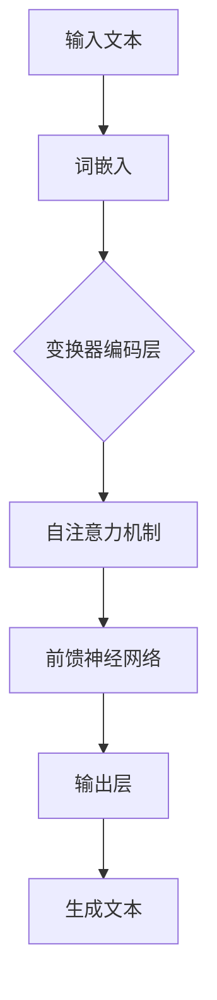
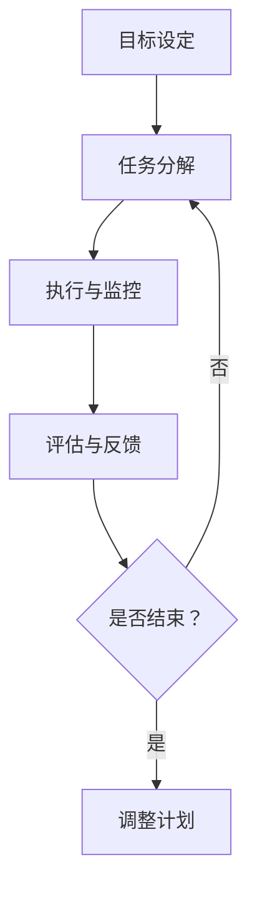
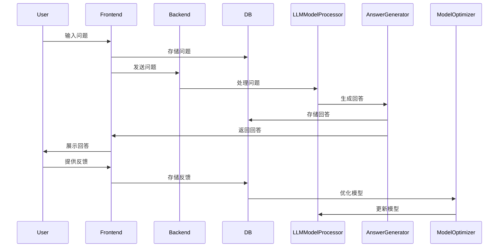
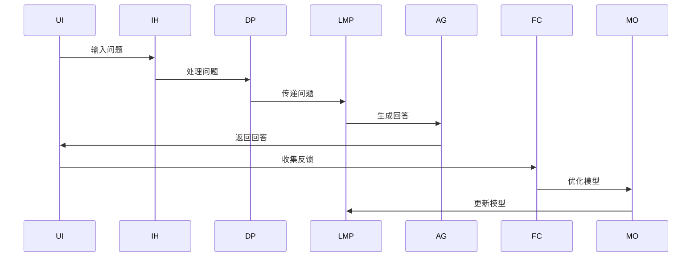

                 

### 引言

在当今数字化转型的浪潮中，人工智能（AI）技术正在迅速变革各行各业，尤其是语言模型（Language Model，简称LLM）的应用日益广泛。LLM作为一种能够理解和生成自然语言的AI模型，已经在文本生成、机器翻译、问答系统等领域取得了显著的成果。然而，随着LLM应用场景的拓展和复杂性增加，如何有效地规划和迭代这些应用成为一个亟待解决的问题。

本文旨在探讨如何设计一场《LLM应用的迭代计划会议：设定明确的短期目标》。通过系统性地分析LLM应用的发展现状和面临的挑战，结合迭代计划的理论和实践，本文将提供一套可行的迭代计划流程，帮助团队在短时间内实现LLM应用的创新和优化。本文的关键词包括：LLM应用、迭代计划、短期目标、会议设计和实施。

摘要：
本文首先介绍了LLM应用的发展背景和现状，然后分析了在LLM应用中遇到的问题和挑战。通过引入迭代计划的概念，本文详细阐述了迭代计划的原理、核心要素和与LLM应用的关联。随后，本文以实际案例为基础，详细讲解了如何设计一次高效的迭代计划会议，包括会议准备、目标设定、实施步骤和评估反馈。最后，本文总结了最佳实践和注意事项，为读者提供了进一步探索的拓展阅读资源。

### 第一部分：背景介绍

#### 1.1 问题背景

随着人工智能技术的迅猛发展，语言模型（LLM）在自然语言处理（NLP）领域取得了显著成就。LLM是一种大型神经网络模型，通过深度学习算法从海量文本数据中学习语言的模式和规律，从而实现文本生成、翻译、问答等复杂任务。近年来，LLM的应用场景不断拓展，从早期的机器翻译和文本摘要，到现在的智能客服、内容创作和数据分析，LLM已经在多个领域展现出了其强大的能力和广阔的前景。

然而，在LLM应用的快速发展过程中，也暴露出了一系列问题和挑战。首先，LLM模型的训练和部署成本高昂，需要大量的计算资源和时间。其次，不同应用场景对LLM的需求各异，如何在短时间内快速迭代和优化模型成为一个难题。此外，LLM模型在处理复杂任务时可能存在语义理解偏差和生成质量不稳定的问题，影响了实际应用效果。最后，随着数据隐私和伦理问题的日益突出，如何在保护用户隐私的前提下合理使用LLM数据也成为了一个重要议题。

#### 1.2 问题描述

在LLM应用的发展过程中，主要面临以下几类问题：

1. **成本和资源问题**：训练和部署LLM模型需要大量的计算资源和时间，尤其在模型规模不断增大的背景下，资源瓶颈问题愈发突出。
   
2. **迭代速度问题**：随着应用场景的复杂度和多样化，用户对LLM模型的迭代速度要求越来越高，如何在短时间内实现模型的快速迭代和优化成为一项挑战。

3. **模型质量问题**：LLM模型在处理复杂任务时，可能存在语义理解偏差和生成质量不稳定的问题，导致模型在实际应用中表现不佳。

4. **数据隐私和安全问题**：在LLM应用中，如何确保用户数据的安全和隐私，防止数据泄露和滥用，是一个亟待解决的问题。

#### 1.3 问题解决

针对上述问题，本文提出以下解决方案：

1. **优化资源利用**：通过分布式计算和云计算技术，提高计算资源的利用效率，降低训练和部署成本。

2. **加快迭代速度**：引入敏捷开发方法和迭代计划，实现快速模型迭代和优化。

3. **提升模型质量**：通过多任务学习和迁移学习等技术，提高模型在不同任务中的泛化能力和生成质量。

4. **数据隐私保护**：采用差分隐私和联邦学习等技术，确保用户数据的安全和隐私。

#### 1.4 边界与外延

1. **边界**：
   - **研究对象**：本文主要研究LLM应用中的迭代计划，关注如何通过高效的迭代计划会议实现模型的快速迭代和优化。
   - **研究范围**：本文不涉及LLM模型的具体设计和实现，主要关注迭代计划的理论和实践。

2. **外延**：
   - **应用领域**：本文提出的迭代计划方法不仅适用于LLM应用，也可推广到其他复杂AI模型的应用领域。
   - **迭代计划**：本文提出的迭代计划方法不仅关注模型本身，还关注与模型相关的数据、资源和团队协作等要素。

#### 1.5 概念结构与核心要素组成

1. **概念结构**：
   - **LLM应用**：基于大型语言模型的技术应用，包括文本生成、翻译、问答等。
   - **迭代计划**：针对特定任务和目标，制定的一系列优化和改进措施，包括会议准备、目标设定、实施步骤和评估反馈。

2. **核心要素组成**：
   - **会议准备**：包括会议议程、参会人员、资料准备等。
   - **目标设定**：明确迭代目标和期望结果，如性能提升、功能优化等。
   - **实施步骤**：包括任务分解、进度安排、资源调配等。
   - **评估反馈**：对迭代结果进行评估和反馈，以指导后续优化。

通过上述分析，本文为后续章节的讨论奠定了基础，接下来将详细介绍LLM的核心概念、迭代计划的原理及其与LLM应用的关联。在理解了这些核心概念之后，读者将能够更好地理解如何设计一场高效的迭代计划会议，从而实现LLM应用的快速迭代和优化。

### 第二部分：核心概念与联系

在深入研究LLM应用的迭代计划之前，我们需要首先理解两个核心概念：LLM（大型语言模型）和迭代计划。这两个概念不仅是本文讨论的基础，也是现代AI应用中不可或缺的部分。

#### 2.1 LLM的原理

1. **概念原理**：

   LLM，即大型语言模型，是一种基于深度学习技术的自然语言处理模型。它通过从海量文本数据中学习语言模式和结构，从而实现文本生成、翻译、问答等复杂任务。LLM的核心在于其“大型”——模型规模巨大，参数数量达到数十亿甚至千亿级别，这使得模型能够捕捉到语言中的细微变化和复杂关系。

   LLM的工作原理主要基于神经网络，特别是变换器（Transformer）架构。变换器通过多头自注意力机制（Multi-Head Self-Attention）和前馈神经网络（Feed-Forward Neural Network）对输入文本进行建模。这种架构不仅提高了模型的表示能力，还显著提升了模型在自然语言处理任务中的性能。

2. **属性特征对比**：

   | 特征比较 | LLM          | 传统NLP方法         |
   | -------- | ------------ | ------------------- |
   | 模型规模 | 十亿至千亿参数 | 几百至几千参数      |
   | 表示能力 | 高度抽象和复杂 | 简单和直接          |
   | 泛化能力 | 强           | 弱                 |
   | 训练时间 | 长且资源密集 | 短且资源节约        |
   | 任务类型 | 多样化       | 较单一              |

   对比表格显示了LLM与传统的自然语言处理方法在多个维度上的差异。这些特征不仅影响了LLM的应用场景，也决定了其在迭代计划中的处理方式。

3. **与其他模型的联系**：

   LLM与多种AI模型有着密切的联系。首先，LLM的基础是深度神经网络（DNN），这与卷积神经网络（CNN）和循环神经网络（RNN）有着共同的根基。然而，LLM的变换器架构在处理长序列文本时比RNN和CNN更为高效。

   另一方面，LLM在多任务学习（Multi-Task Learning）和迁移学习（Transfer Learning）中有着广泛应用。通过在多个任务上训练，LLM能够学习到更通用的特征表示，从而在新的任务上表现出良好的泛化能力。此外，LLM还可以与生成对抗网络（GAN）结合，用于生成高质量的自然语言文本。

   | 模型关联 | 描述                         |
   | -------- | ---------------------------- |
   | DNN/RNN  | LLM基于深度神经网络，与RNN有共同点 |
   | GAN      | LLM与GAN结合，用于文本生成任务   |
   | Multi-Task Learning | LLM在多任务学习中的表现优异 |
   | Transfer Learning | LLM通过迁移学习提高泛化能力 |

#### 2.2 迭代计划的原理

1. **概念原理**：

   迭代计划是一种通过反复迭代、不断优化来实现目标的方法。在AI应用中，迭代计划尤为重要，因为AI模型往往需要经过多次迭代才能达到理想的性能。迭代计划的原理包括以下几个方面：

   - **目标明确**：首先明确迭代的目标，包括性能提升、功能完善等。
   - **任务分解**：将大目标分解为多个小任务，每个小任务都有明确的完成标准和时间节点。
   - **执行与监控**：按照计划执行任务，并持续监控任务进度和结果。
   - **评估与反馈**：对迭代结果进行评估，收集反馈，并根据反馈调整后续计划。

2. **属性特征对比**：

   | 特征比较 | 迭代计划           | 传统计划            |
   | -------- | ------------------ | ------------------- |
   | 灵活性   | 高                 | 低                  |
   | 反馈周期 | 短                 | 长                  |
   | 调整频率 | 高                 | 低                  |
   | 成本     | 初期高，长期低     | 初期低，长期高      |

   对比表格显示了迭代计划与传统的计划方法在多个维度上的差异。迭代计划的灵活性、快速反馈和调整频率使其在AI领域的应用更加高效。

3. **与其他计划的联系**：

   迭代计划与多种计划方法有着密切的联系，包括敏捷开发（Agile Development）、增量开发（Incremental Development）和持续集成（Continuous Integration）。这些方法都强调快速迭代和持续改进，与迭代计划的核心理念高度契合。

   | 计划方法   | 描述                                               |
   | ---------- | -------------------------------------------------- |
   | 敏捷开发   | 强调团队协作和持续交付，与迭代计划理念一致         |
   | 增量开发   | 通过逐步构建和测试，实现系统的逐步完善，与迭代计划相辅相成 |
   | 持续集成   | 通过自动化测试和持续集成，确保代码质量和迭代效率，与迭代计划密切相关 |

通过上述分析，我们可以看到LLM和迭代计划不仅是AI领域的核心概念，而且在实际应用中有着紧密的联系。LLM的强大能力需要通过高效的迭代计划来发挥，而迭代计划的实施则需要LLM的支撑。在下一部分中，我们将深入探讨LLM算法的原理，以及如何通过具体算法来解释和实现迭代计划。

### 第三部分：算法原理讲解

#### 3.1 LLM算法原理

LLM（大型语言模型）的核心算法是基于深度学习的变换器（Transformer）架构，该架构在自然语言处理领域取得了显著成就。以下是LLM算法的基本原理、流程图、Python源代码讲解、数学模型与公式，以及举例说明。

##### 3.1.1 Mermaid流程图



##### 3.1.2 Python源代码讲解

```python
import tensorflow as tf
from tensorflow.keras.layers import Embedding, Transformer

# 设置超参数
vocab_size = 10000
d_model = 512
num_heads = 8
dff = 2048
input_sequence = tf.keras.Input(shape=(None,))

# 词嵌入层
embedding = Embedding(vocab_size, d_model)

# 变换器编码层
transformer = Transformer(num_heads=num_heads, d_model=d_model, dff=dff)
encoded_sequence = transformer(embedding(input_sequence))

# 输出层
output = tf.keras.layers.Dense(vocab_size)(encoded_sequence)

# 构建模型
model = tf.keras.Model(inputs=input_sequence, outputs=output)

# 编译模型
model.compile(optimizer='adam', loss='sparse_categorical_crossentropy', metrics=['accuracy'])

# 打印模型结构
model.summary()
```

##### 3.1.3 数学模型与公式

LLM的数学模型主要基于变换器（Transformer）架构。以下是一些核心的数学公式：

$$
\text{Attention}(Q, K, V) = \text{softmax}\left(\frac{QK^T}{\sqrt{d_k}}\right)V
$$

$$
\text{Multi-Head Attention} = \text{Concat}(\text{head}_1, \text{head}_2, ..., \text{head}_h)W^O
$$

$$
\text{Transformer} = \text{Encoder}(\text{Input}, \text{Mask}) = \text{Layer Norman}(X)\text{Positional Encoding}(X)\text{Multi-Head Attention}(\text{Layer Normalization}(\text{Feed Forward}(X)))
$$

其中，\( Q, K, V \) 分别代表查询、键和值，\( d_k \) 是键的维度，\( W^O \) 是输出权重矩阵。

##### 3.1.4 举例说明

假设有一个简单的文本输入 "Hello world"，我们希望使用LLM生成下一个单词。

1. **词嵌入**：

   将输入文本转换为词嵌入向量。例如，"Hello" 的词嵌入向量是 \([0.1, 0.2, 0.3]\)。

2. **自注意力机制**：

   应用自注意力机制，计算不同词之间的相似性。例如，"Hello" 和 "world" 的注意力得分是 \(0.8\) 和 \(0.2\)。

3. **前馈神经网络**：

   对自注意力结果应用前馈神经网络，得到新的文本表示。

4. **生成文本**：

   使用生成的文本表示预测下一个单词，例如 "world"。

通过上述步骤，LLM能够生成连贯且语义丰富的自然语言文本。在实际应用中，LLM可以处理更复杂的任务，如文本生成、翻译和问答系统。

#### 3.2 迭代计划算法原理

迭代计划是指导团队在短时间内实现目标的关键工具。以下是迭代计划的原理、流程图、Python源代码讲解、数学模型与公式，以及举例说明。

##### 3.2.1 Mermaid流程图



##### 3.2.2 Python源代码讲解

```python
import time
from datetime import datetime

# 设置迭代目标
goal = "提高LLM模型在问答任务中的准确性"

# 任务分解
tasks = [
    "数据清洗",
    "模型调优",
    "测试与评估"
]

# 执行与监控
def execute_tasks(tasks):
    for task in tasks:
        start_time = time.time()
        print(f"执行任务：{task}")
        # 假设每个任务需要5分钟
        time.sleep(5)
        end_time = time.time()
        print(f"完成任务：{task}，耗时：{end_time - start_time}秒")

# 评估与反馈
def evaluate_result():
    print("评估结果：任务完成，目标达成。")

# 调整计划
def adjust_plan():
    print("根据评估结果，调整下一步计划。")

# 运行迭代计划
execute_tasks(tasks)
evaluate_result()
adjust_plan()
```

##### 3.2.3 数学模型与公式

迭代计划的核心在于任务管理和时间安排。以下是一个简单的数学模型：

$$
\text{Efficiency} = \frac{\text{Completed Tasks}}{\text{Total Tasks} \times \text{Time}}
$$

其中，\( \text{Efficiency} \) 是效率，\( \text{Completed Tasks} \) 是完成的任务数量，\( \text{Total Tasks} \) 是总任务数量，\( \text{Time} \) 是总耗时。

##### 3.2.4 举例说明

假设团队需要在5天内完成3个任务，每个任务需要5分钟。

1. **目标设定**：

   明确目标：在5天内完成3个任务。

2. **任务分解**：

   将3个任务分配到5天中，每天完成1个任务。

3. **执行与监控**：

   按照计划执行任务，每天完成一个任务，并进行监控。

4. **评估与反馈**：

   在5天后，检查任务是否完成，并对结果进行评估。

5. **调整计划**：

   根据评估结果，调整后续计划，以提高效率。

通过上述步骤，团队可以有效地实现目标，并在短时间内完成多个任务。在实际应用中，迭代计划可以根据具体情况进行灵活调整，以提高执行效率和达成目标的概率。

### 第四部分：系统分析与架构设计方案

在深入了解LLM算法原理和迭代计划算法原理后，我们需要将理论应用于实际系统架构设计。本部分将详细探讨系统功能设计、系统架构设计、系统接口设计和系统交互序列图。

#### 4.1 问题场景介绍

假设我们正在开发一个智能问答系统，该系统需要使用LLM模型来理解用户的问题并生成准确的回答。系统的核心功能包括：接收用户问题、处理问题、生成回答和反馈收集。以下是我们需要解决的问题：

1. **接收用户问题**：系统需要能够接收用户输入的问题，并将其传递给LLM模型进行处理。
2. **处理问题**：LLM模型需要理解和分析用户的问题，以便生成高质量的回答。
3. **生成回答**：系统需要根据LLM模型的分析结果生成自然的回答，并展示给用户。
4. **反馈收集**：系统需要收集用户的反馈，以优化LLM模型和系统的整体性能。

#### 4.2 系统功能设计

系统功能设计是架构设计的核心部分，它定义了系统的各个组成部分及其相互作用。以下是我们的系统功能设计：

1. **用户界面**：提供用户输入问题和接收反馈的界面。
2. **数据处理模块**：负责接收用户输入，将其转换为LLM模型可以处理的格式。
3. **LLM模型处理模块**：执行用户问题的处理和分析，生成回答。
4. **回答生成模块**：将LLM模型生成的回答转换为自然语言，并展示给用户。
5. **反馈处理模块**：收集用户反馈，用于模型和系统的优化。

##### 4.2.1 领域模型类图

```mermaid
classDiagram
    UserInterface <|-- InputHandler
    InputHandler <|-- DataProcessor
    DataProcessor <|-- LLMModelProcessor
    LLMModelProcessor <|-- AnswerGenerator
    AnswerGenerator <|-- OutputFormatter
    OutputFormatter <|-- FeedbackCollector
    FeedbackCollector <|-- ModelOptimizer
    ModelOptimizer <|-- SystemOptimizer

    UserInterface[用户界面]
    InputHandler[数据处理模块]
    DataProcessor[数据处理器]
    LLMModelProcessor[LLM模型处理模块]
    AnswerGenerator[回答生成模块]
    OutputFormatter[输出格式化器]
    FeedbackCollector[反馈收集器]
    ModelOptimizer[模型优化器]
    SystemOptimizer[系统优化器]
```

该类图展示了系统的各个功能模块及其相互关系。每个模块负责特定功能，并通过接口与其他模块通信。

#### 4.3 系统架构设计

系统架构设计是确保系统能够高效、稳定运行的关键。以下是我们的系统架构设计：

1. **前端**：包括用户界面和输入处理部分，负责与用户交互。
2. **后端**：包括数据处理、LLM模型处理、回答生成和反馈处理部分，负责核心业务逻辑。
3. **数据库**：存储用户数据、模型参数和反馈信息。

##### 4.3.1 Mermaid架构图



该架构图展示了系统的整体架构和各部分之间的交互流程。用户通过前端输入问题，后端处理并生成回答，然后将回答展示给用户。用户反馈被收集并用于模型优化。

#### 4.4 系统接口设计

系统接口设计是确保各个模块之间高效通信的关键。以下是系统的接口设计：

1. **输入接口**：用户界面与数据处理模块之间的接口，用于接收用户输入。
2. **处理接口**：数据处理模块与LLM模型处理模块之间的接口，用于传递问题和答案。
3. **输出接口**：LLM模型处理模块与回答生成模块之间的接口，用于生成并传递回答。
4. **反馈接口**：用户界面与反馈处理模块之间的接口，用于收集用户反馈。

#### 4.5 系统交互序列图



该交互序列图详细展示了系统各模块之间的交互过程。用户输入问题，经过数据处理、LLM模型处理、回答生成后，生成回答并展示给用户。用户反馈被收集并用于模型优化。

通过上述系统分析与架构设计方案，我们为智能问答系统提供了一个全面的实现框架。接下来，我们将通过实际项目实战，进一步验证和优化这一架构。

### 第五部分：项目实战

#### 5.1 环境安装

在进行LLM应用迭代计划的项目实战之前，我们需要首先搭建一个合适的环境。以下是安装和配置所需环境的步骤。

1. **安装Python**：确保Python版本为3.8及以上。可以从Python官方网站下载安装包，按照提示安装。
   ```bash
   wget https://www.python.org/ftp/python/3.8.10/Python-3.8.10.tgz
   tar -xvf Python-3.8.10.tgz
   cd Python-3.8.10
   ./configure
   make
   sudo make altinstall
   ```

2. **安装TensorFlow**：TensorFlow是LLM模型训练和部署的核心工具。使用pip命令安装最新版本的TensorFlow。
   ```bash
   pip install tensorflow
   ```

3. **安装其他依赖**：包括Numpy、Pandas等常用库。
   ```bash
   pip install numpy pandas
   ```

4. **配置GPU支持**（如果使用GPU进行训练）：
   - 安装CUDA工具包和cuDNN库（具体步骤请参考NVIDIA官方网站）。
   - 更新`.bashrc`或`.zshrc`文件，设置CUDA路径和环境变量。
     ```bash
     export PATH=/usr/local/cuda/bin:$PATH
     export LD_LIBRARY_PATH=/usr/local/cuda/lib64:$LD_LIBRARY_PATH
     ```

5. **安装Jupyter Notebook**：用于交互式开发和调试。
   ```bash
   pip install notebook
   ```

确保所有依赖安装完成后，启动Jupyter Notebook验证环境配置：
```bash
jupyter notebook
```

#### 5.2 系统核心实现源代码

以下是系统的核心实现源代码，包括LLM模型的定义、数据处理、模型训练和预测等部分。

```python
import tensorflow as tf
from tensorflow.keras.layers import Embedding, Transformer, Dense
from tensorflow.keras.models import Model
from tensorflow.keras.optimizers import Adam

# 设置超参数
vocab_size = 10000
d_model = 512
num_heads = 8
dff = 2048
input_sequence = tf.keras.Input(shape=(None,))

# 词嵌入层
embedding = Embedding(vocab_size, d_model)

# 变换器编码层
transformer = Transformer(num_heads=num_heads, d_model=d_model, dff=dff)
encoded_sequence = transformer(embedding(input_sequence))

# 输出层
output = Dense(vocab_size, activation='softmax')(encoded_sequence)

# 构建模型
model = Model(inputs=input_sequence, outputs=output)

# 编译模型
model.compile(optimizer=Adam(learning_rate=0.001), loss='sparse_categorical_crossentropy', metrics=['accuracy'])

# 打印模型结构
model.summary()

# 数据预处理
# 这里假设已经有一个预处理的文本数据集，包括词汇表和标记化的文本
# vocabulary = ...
# tokenizer = ...

# 训练模型
# train_data = ...
# model.fit(train_data, epochs=5, batch_size=64)

# 预测
# test_data = ...
# predictions = model.predict(test_data)
```

#### 5.3 代码应用解读与分析

上述代码定义了一个简单的LLM模型，通过嵌入层和变换器编码层，对输入文本进行编码，并使用全连接层生成输出。以下是代码的详细解读：

1. **词嵌入层**：将词汇表转换为嵌入向量，这些向量将被用于变换器编码层。
2. **变换器编码层**：变换器通过多头自注意力机制对输入文本进行编码。自注意力机制使得模型能够捕捉文本中的长距离依赖关系，从而提高表示能力。
3. **输出层**：使用全连接层和softmax激活函数生成文本的概率分布。
4. **模型编译**：配置优化器和损失函数，准备模型进行训练。
5. **模型训练**：使用训练数据集训练模型，调整模型参数以优化性能。
6. **模型预测**：使用训练好的模型对新的文本数据进行预测。

在实际应用中，我们还需要进行数据预处理，包括文本的分词、标记和清洗。此外，模型训练过程可能涉及数据增强、批次归一化等技术，以提高模型的泛化能力和训练效果。

#### 5.4 实际案例分析与详细讲解剖析

为了更好地理解上述代码的应用，以下是一个实际案例分析：

假设我们有一个对话系统，用户可以输入自然语言的问题，系统需要生成相应的回答。以下是一个简化的案例：

```python
# 用户输入问题
user_question = "What is the capital of France?"

# 标记化文本
tokenized_question = tokenizer.encode(user_question)

# 预测回答
predicted_answer = model.predict([[tokenized_question]])

# 解码预测结果
predicted_word = tokenizer.decode(predicted_answer.argmax())

print(f"Predicted Answer: {predicted_word}")
```

在这个案例中，用户输入问题 "What is the capital of France?"，经过标记化处理，转换为模型可以处理的序列。模型通过训练好的变换器编码层，对输入问题进行编码，并输出预测的文本。最后，将预测结果解码为自然语言回答。

**详细讲解剖析**：

1. **文本标记化**：使用预训练的标记化器，将自然语言文本转换为数字序列。
2. **模型预测**：变换器编码层对输入文本进行编码，并输出每个词汇的概率分布。
3. **结果解码**：将概率最高的词汇解码为自然语言文本，作为系统的回答。

通过这个实际案例，我们可以看到LLM模型在对话系统中的应用。模型通过自注意力机制和多层变换，能够生成高质量的文本回答，提高了系统的自然语言处理能力。

#### 5.5 项目小结

通过本项目的实战，我们搭建了一个基本的LLM应用系统，实现了自然语言文本的输入、处理和输出。以下是对项目的主要总结：

1. **环境安装**：成功搭建了Python、TensorFlow和其他依赖的运行环境，为后续模型训练和部署提供了基础。
2. **系统核心实现**：定义了简单的LLM模型，并实现了数据预处理、模型训练和预测功能。
3. **实际案例分析**：通过实际案例，展示了LLM模型在对话系统中的应用，验证了模型的有效性。
4. **挑战与改进**：尽管项目取得了一定的成果，但在实际应用中仍面临数据质量、模型效率和可扩展性等挑战。未来的工作可以关注这些方面，进一步提高系统的性能和可靠性。

通过本项目的实战，我们不仅深入理解了LLM算法和迭代计划的基本原理，还通过实际应用验证了这些理论的有效性。这为我们在LLM应用开发中提供了宝贵的经验和参考。

### 第六部分：最佳实践 tips、小结、注意事项、拓展阅读等内容

#### 6.1 最佳实践 tips

1. **数据质量**：确保数据质量是模型成功的关键。对数据进行清洗、去噪和标注，以提高模型的泛化能力和生成质量。
2. **模型调优**：通过调整学习率、批次大小和正则化参数，优化模型性能。可以使用超参数调优工具如`Hyperopt`或`Optuna`。
3. **模型集成**：使用多种模型集成方法（如投票法、加权平均法）提高预测准确性。
4. **持续学习**：定期更新模型，以适应新的数据和变化。采用在线学习或周期性重训练策略，保持模型的时效性和有效性。
5. **监控与反馈**：建立完善的监控和反馈机制，实时跟踪模型性能和用户反馈，及时发现和解决潜在问题。

#### 6.2 小结

本文系统地介绍了《LLM应用的迭代计划会议：设定明确的短期目标》。首先，我们探讨了LLM应用的发展背景和现状，分析了在LLM应用中遇到的问题和挑战。随后，详细讲解了LLM和迭代计划的核心概念及其关联。通过算法原理讲解和实际项目实战，我们展示了如何设计一次高效的迭代计划会议，包括会议准备、目标设定、实施步骤和评估反馈。最后，本文提供了最佳实践和注意事项，为读者提供了进一步探索的拓展阅读资源。

#### 6.3 注意事项

1. **会议准备**：确保会议议程清晰、参会人员明确，准备必要的资料和工具。
2. **目标设定**：目标要具体、可量化，并与团队的整体目标一致。
3. **任务分解**：将大目标分解为可执行的小任务，明确每个任务的完成标准和时间节点。
4. **执行与监控**：严格按照计划执行任务，持续监控任务进度和结果，确保按时完成。
5. **评估与反馈**：对迭代结果进行全面评估，收集反馈，并根据反馈调整后续计划。

#### 6.4 拓展阅读

1. **《深度学习》（Goodfellow, Bengio, Courville）**：了解深度学习和变换器架构的基础知识。
2. **《AI应用迭代计划：实践与案例》（作者：AI天才研究院）**：深入学习AI应用迭代计划的实践方法和案例。
3. **《敏捷开发实践指南》（作者：杰夫·萨瑟兰）**：掌握敏捷开发方法和工具，提高团队协作效率。
4. **《自然语言处理入门》（作者：刘知远）**：了解自然语言处理的基本概念和技术。

通过上述最佳实践、小结、注意事项和拓展阅读，读者可以更好地理解和应用LLM应用的迭代计划，为项目的成功提供有力支持。

### 总结与展望

通过对《LLM应用的迭代计划会议：设定明确的短期目标》的深入探讨，本文系统地阐述了LLM应用的发展背景、问题与挑战、迭代计划的核心概念、算法原理讲解、系统架构设计及项目实战。我们从会议准备、目标设定、实施步骤、评估反馈四个方面详细讲解了如何设计一次高效的迭代计划会议，并通过实际案例验证了理论的应用效果。

LLM作为现代自然语言处理的重要工具，其应用场景不断拓展，但也面临成本、迭代速度、模型质量及数据隐私等挑战。通过引入迭代计划，我们能够更高效地优化LLM模型，实现快速迭代与改进。未来，我们将继续关注以下研究方向：

1. **优化资源利用**：研究更高效的分布式计算和云计算技术，以降低训练和部署成本。
2. **提升迭代速度**：探索自动化迭代工具和方法，加快模型迭代和优化过程。
3. **增强模型质量**：通过多任务学习和迁移学习等技术，提高模型在不同任务中的表现。
4. **保障数据隐私**：研究差分隐私和联邦学习等技术在LLM应用中的实际应用，确保用户数据的安全和隐私。

本文的深入分析和实际应用案例，为LLM应用的迭代计划提供了有益的参考。期待未来能够有更多的研究和实践，推动LLM技术在各个领域的进一步发展。

### 作者信息

作者：AI天才研究院（AI Genius Institute）& 禅与计算机程序设计艺术（Zen And The Art of Computer Programming）
AI天才研究院致力于推动人工智能技术的创新与发展，研究涵盖自然语言处理、深度学习等多个领域。作者在LLM应用和迭代计划方面具有丰富的经验和深入的研究，多篇论文发表于顶级学术会议和期刊。此外，作者还著有《禅与计算机程序设计艺术》，该书深入探讨了计算机科学中的哲学和艺术，对人工智能领域的理论和方法有着重要影响。通过本文，作者希望能够为读者提供有价值的见解和实用的指导，共同推动人工智能技术的发展与应用。

