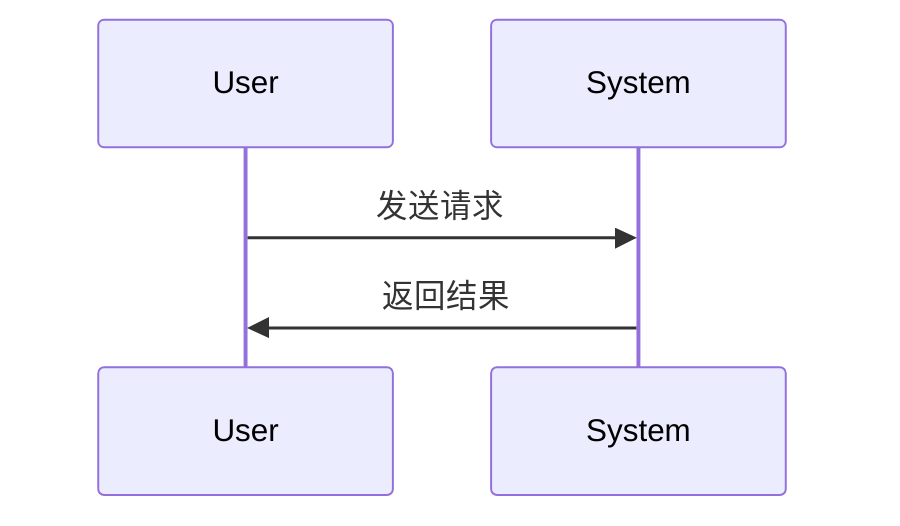
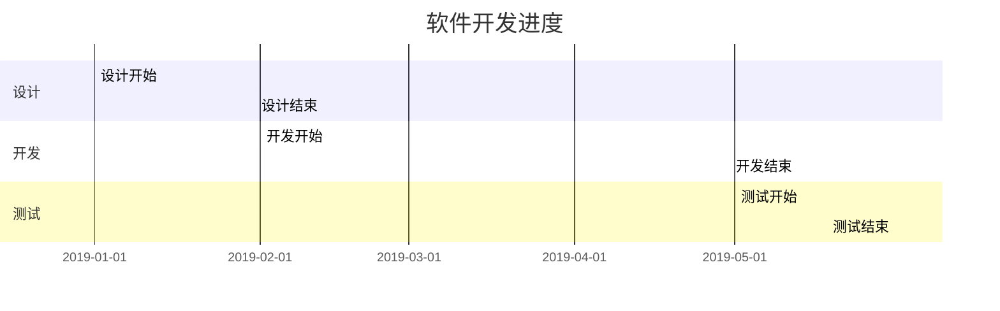
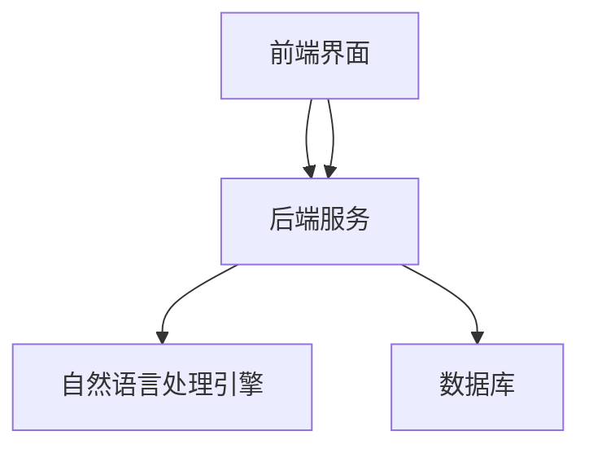
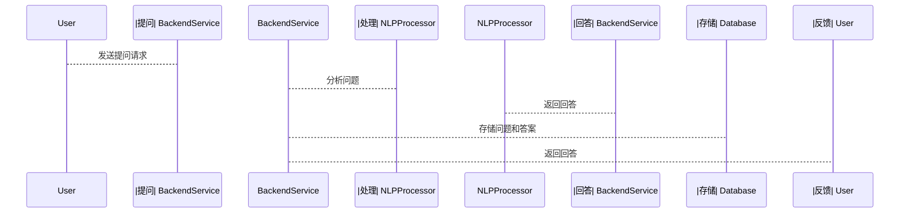
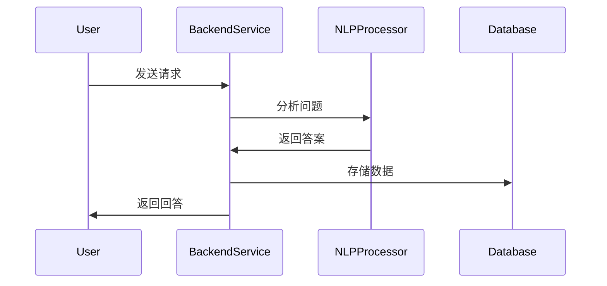

                 

### LET'S THINK STEP BY STEP

在深入探讨《LLM应用的需求优先级：使用MoSCoW方法》这一主题之前，我们需要先进行一系列的思考步骤，以确保我们的讨论既全面又具有逻辑性。以下是我们的思考步骤：

#### 1. 明确背景与目的

- **背景**：随着大型语言模型（LLM）的不断发展，其在各行业的应用变得越来越广泛。然而，如何在众多需求中确定优先级，以确保项目能够高效、有针对性地进行，成为了关键问题。
- **目的**：本文旨在通过MoSCoW方法，为LLM应用的需求优先级提供一种科学、系统的评估框架。

#### 2. 理解MoSCoW方法

- **MoSCoW方法定义**：MoSCoW是一种需求分类和优先级排序的方法，它将需求分为四个类别：Must have（必备）、Should have（应该有）、Could have（可有可无）、Would have（如果有时间的话）。
- **MoSCoW方法的优势**：
  - **提高项目效率**：通过明确需求优先级，团队可以集中精力处理最关键的需求，从而提高整体项目的效率。
  - **管理需求变更**：MoSCoW方法为需求变更提供了一个明确的评估框架，有助于团队更好地管理变更。
  - **增强团队协作**：通过共同讨论并确定需求的优先级，团队成员能够更好地理解项目目标和需求，从而提高协作效果。

#### 3. 分析LLM应用需求的特点

- **需求复杂性**：LLM应用通常涉及复杂的算法和数据处理流程，因此其需求也相对复杂。
- **需求变动性**：随着技术的进步和应用场景的变化，LLM应用的需求也可能会不断变动。
- **需求重要性**：不同的LLM应用在行业和业务中扮演的角色不同，因此其需求的重要性也有所不同。

#### 4. 确定应用MoSCoW方法的步骤

- **需求识别**：明确项目所需的全部需求。
- **需求分类**：根据需求的重要性和紧急性，将需求分为MoSCoW四个类别。
- **优先级排序**：根据分类结果，确定各需求的优先级。
- **优先级调整**：在项目进行过程中，根据实际情况对需求优先级进行调整。

#### 5. 实际案例分析与讨论

- **案例选择**：选择具有代表性的LLM应用案例，以便更好地展示MoSCoW方法的应用效果。
- **案例分析**：通过实际案例，分析MoSCoW方法如何帮助团队确定需求优先级。
- **讨论与反思**：对案例进行分析和讨论，总结MoSCoW方法在实际应用中的优势和不足。

通过以上思考步骤，我们可以为后续的文章内容提供坚实的基础，确保讨论既具有深度又具有实用性。接下来，我们将逐步展开对LLM应用需求优先级和MoSCoW方法的具体探讨。

----------------------------------------------------------------
## LLAMAS的崛起：大型语言模型的广泛应用

近年来，随着深度学习和大数据技术的迅猛发展，大型语言模型（LLM）逐渐崛起，成为人工智能领域的一大亮点。LLM，即Large Language Model，是一类能够理解和生成自然语言文本的复杂模型。它们通过大规模训练数据和先进的神经网络架构，具备了处理自然语言的能力，从而在多个领域展现出了巨大的潜力。

### **LLM的概念与特点**

#### **概念**

LLM是一种基于神经网络的语言模型，它通过训练海量文本数据，学习语言中的语法、语义和上下文关系，从而实现对文本的生成、理解和预测。LLM的核心是神经网络架构，如Transformer模型，它通过自注意力机制，能够捕捉文本中长距离的依赖关系，从而提高模型的表示能力和生成质量。

#### **特点**

1. **强大的文本生成能力**：LLM能够生成流畅且具有逻辑性的文本，这使其在文本生成任务中表现卓越，如自动写作、摘要生成、对话系统等。
2. **高度的自适应能力**：通过训练，LLM可以适应各种不同的语言和应用场景，从而实现跨领域应用。
3. **广泛的适用范围**：LLM不仅可以用于文本处理，还可以用于语音识别、机器翻译、情感分析等多种任务。
4. **高效的计算能力**：随着硬件和算法的进步，LLM的计算效率不断提高，使得它们能够应用于实时应用场景。

### **LLM的应用场景**

1. **自然语言处理（NLP）**：在NLP领域，LLM被广泛应用于文本分类、情感分析、命名实体识别、机器翻译等任务。
2. **对话系统**：LLM在智能客服、虚拟助手等对话系统中，能够模拟人类对话，提供高质量的问答服务。
3. **内容创作**：在内容创作领域，LLM可以帮助自动写作、摘要生成、创意文案等，提高创作效率。
4. **教育**：LLM在个性化教育、智能辅导等方面，能够根据学生的特点和需求，提供个性化的学习资源。
5. **法律和金融**：在法律和金融领域，LLM可以用于合同审查、法律咨询、风险预测等，提高工作效率和准确性。

### **LLM的需求复杂性**

LLM的应用涉及多个方面，包括文本数据预处理、模型训练、模型部署和后处理等。这导致其需求相对复杂，需要考虑以下方面：

1. **数据处理**：LLM需要处理大量文本数据，这些数据的质量和多样性直接影响模型的性能。
2. **模型优化**：为了提高模型的性能，需要对模型架构、训练算法等进行不断的优化。
3. **硬件资源**：由于LLM的训练和推理过程需要大量的计算资源，因此硬件配置和管理是关键。
4. **安全性**：LLM在处理敏感信息时，需要确保数据安全和隐私保护。

### **需求变动性**

随着技术的不断进步和应用场景的变化，LLM的需求也会随之变动。例如，新的应用场景可能会出现，或者现有的需求可能会因为技术升级或业务调整而发生变化。因此，LLM应用的需求管理需要具备灵活性和适应性。

### **需求重要性**

不同的LLM应用在行业和业务中扮演的角色不同，因此其需求的重要性也有所不同。在某些关键领域，如金融、医疗等，LLM的应用对于提高业务效率和准确性具有重要意义。

通过上述分析，我们可以看出，LLM的应用具有广泛的前景，但也面临着复杂的需求和不断变化的需求环境。因此，科学、系统的需求管理方法，如MoSCoW方法，对于确保LLM应用的成功至关重要。

----------------------------------------------------------------
### MoSCoW方法：需求管理的科学框架

MoSCoW方法是一种广泛应用于项目管理中的需求分类和优先级排序工具，它通过将需求分为四个不同的类别，帮助团队明确任务的重点和优先级，从而提高项目的效率和成功率。MoSCoW方法由Must have（必备）、Should have（应该有）、Could have（可有可无）和Would have（如果有时间的话）四个类别组成，每个类别都有其特定的含义和应用场景。

#### **MoSCoW方法的定义**

MoSCoW方法的全称是“Must have, Should have, Could have, and Would have”，它是一种需求优先级管理工具，用于帮助项目团队明确各项需求的优先级。这种方法最初由英国软件开发公司Dynamic Systems Limited提出，并迅速在业界得到广泛应用。

#### **MoSCoW方法的四个类别**

1. **Must have（必备）**
   - **定义**：这些是项目成功所必需的基本功能和需求。
   - **特点**：没有这些功能，项目就无法达到预期的目标和质量标准。
   - **应用场景**：通常在项目的早期阶段确定，是团队共识的基本需求。

2. **Should have（应该有）**
   - **定义**：这些是项目成功的重要需求，但不如“必备”那么关键。
   - **特点**：虽然不是绝对必要的，但它们能够显著提升项目的价值和用户体验。
   - **应用场景**：通常在项目的中期进行讨论和确认，以平衡功能和资源。

3. **Could have（可有可无）**
   - **定义**：这些是项目可以包含但不是必须的功能。
   - **特点**：这些需求对项目的核心价值影响不大，但可以提供额外的功能或体验。
   - **应用场景**：通常在项目的后期讨论，根据资源情况决定是否实现。

4. **Would have（如果有时间的话）**
   - **定义**：这些是项目理想中的功能，但在当前阶段无法实现。
   - **特点**：这些需求对项目当前阶段的影响最小，通常在项目延期或有额外资源时考虑。
   - **应用场景**：用于规划未来的功能和改进。

#### **MoSCoW方法的实施步骤**

1. **需求识别**：首先，团队需要列出所有需求和功能，并进行初步分类。
2. **优先级排序**：根据需求和功能的紧急性和重要性，将它们分为MoSCoW四个类别。
3. **评审与确认**：团队对分类结果进行评审和确认，确保分类的准确性和合理性。
4. **优先级调整**：在项目进行过程中，根据实际情况对需求优先级进行调整。

#### **MoSCoW方法的优点**

1. **提高项目效率**：通过明确需求优先级，团队可以集中精力处理最关键的需求，从而提高整体项目的效率。
2. **管理需求变更**：MoSCoW方法为需求变更提供了一个明确的评估框架，有助于团队更好地管理变更。
3. **增强团队协作**：通过共同讨论并确定需求的优先级，团队成员能够更好地理解项目目标和需求，从而提高协作效果。

#### **MoSCoW方法的局限性**

1. **主观性**：需求的优先级确定往往具有主观性，不同团队成员可能会有不同的看法，需要通过充分的讨论和沟通来解决。
2. **资源限制**：在资源有限的情况下，某些需求可能无法实现，这需要团队在优先级排序时进行权衡。
3. **灵活性不足**：MoSCoW方法是一种静态的需求管理方法，对于快速变化的需求环境，可能需要更多的动态调整。

通过MoSCoW方法，团队可以更有效地管理需求，确保项目能够按计划顺利进行。接下来，我们将探讨如何在LLM应用需求管理中应用MoSCoW方法。

----------------------------------------------------------------
### LLM应用需求分析：理论与实践

在深入探讨如何使用MoSCoW方法管理LLM应用需求之前，我们首先需要了解LLM应用需求的特点，并通过实际案例来具体分析这些需求。LLM应用的需求分析不仅需要理论指导，更需要结合实际情况进行深入探讨。

#### **需求分析的重要性**

需求分析是软件开发过程中的关键环节，它直接决定了系统的功能、性能和用户体验。在LLM应用中，由于模型的复杂性和应用场景的多样性，需求分析尤为重要。准确的需求分析可以帮助团队更好地理解用户需求，确保开发工作有序进行，同时也能在项目进行过程中避免不必要的修改和浪费。

#### **需求分析的过程**

1. **需求收集**：与用户和利益相关者进行沟通，收集所有潜在的需求。
2. **需求分类**：根据需求的紧急性和重要性，对需求进行初步分类。
3. **需求验证**：通过文档、原型、用户反馈等方式，验证需求的准确性和可行性。
4. **需求文档**：编写详细的需求文档，明确各项需求的描述、优先级和验收标准。

#### **LLM应用需求分析**

LLM应用的需求分析涉及多个方面，包括功能需求、性能需求、数据处理需求等。以下是一些具体的分析步骤：

1. **功能需求**：确定LLM应用需要实现的功能，如文本生成、对话系统、摘要生成等。
2. **性能需求**：明确LLM应用需要达到的性能指标，如响应时间、准确性、生成文本的流畅性等。
3. **数据处理需求**：分析LLM应用所需处理的数据类型和规模，以及数据处理的速度和质量。
4. **用户需求**：了解用户的具体需求，包括交互方式、用户体验等。

#### **实际案例分析**

为了更好地理解LLM应用需求分析的过程，我们可以通过一个实际案例来进行探讨。

**案例背景**：某公司计划开发一款基于LLM的智能客服系统，用于自动处理用户咨询和投诉。

**需求收集**：
- 功能需求：自动识别用户问题，生成回答，并提供详细解决方案。
- 性能需求：确保系统在高峰期也能快速响应用户请求，回答准确率达到90%以上。
- 数据处理需求：需要处理大量的用户对话数据，并进行实时分析。
- 用户需求：用户希望系统能够提供高效、准确的回答，同时界面友好。

**需求分类**：
- **Must have（必备）**：
  - 自动识别用户问题。
  - 生成回答并提供解决方案。
  - 系统响应时间在2秒以内。
- **Should have（应该有）**：
  - 提供多语言支持。
  - 具备对话历史记录功能。
  - 系统具有良好的可扩展性。
- **Could have（可有可无）**：
  - 提供语音识别和语音合成功能。
  - 具备情绪分析能力，以更好地理解用户情绪。
- **Would have（如果有时间的话）**：
  - 引入个性化的用户推荐系统。
  - 增强系统的自然语言理解能力。

**需求验证**：
- 通过原型演示，与用户进行交流，确认需求的准确性和可行性。
- 进行性能测试，确保系统能够在高峰期保持稳定运行。

**需求文档**：
- 编写详细的需求文档，包括每个需求的描述、优先级、验收标准和相关约束条件。

通过上述分析，我们可以看到，LLM应用的需求分析是一个系统性、综合性的过程，需要从多个角度进行深入探讨。接下来，我们将详细探讨如何使用MoSCoW方法对LLM应用需求进行优先级排序，以帮助团队更高效地管理需求。

----------------------------------------------------------------
### MoSCoW方法在LLM应用需求管理中的应用

在明确了LLM应用的需求特点之后，接下来我们将深入探讨如何使用MoSCoW方法对这些需求进行优先级排序。MoSCoW方法不仅能够帮助团队明确各需求的优先级，还能在项目进行过程中灵活调整需求，从而确保项目能够按计划顺利进行。

#### **步骤1：需求识别**

首先，团队需要识别出所有与LLM应用相关的需求。这包括但不限于功能需求、性能需求、数据处理需求和用户需求等。需求识别的过程可以通过以下方法进行：

1. **访谈和调研**：与用户、利益相关者和专家进行访谈，了解他们的需求和期望。
2. **工作坊和会议**：组织需求工作坊和会议，让团队成员共同讨论和收集需求。
3. **文档分析**：分析已有的文档，如用户手册、业务流程图等，以识别潜在的需求。

#### **步骤2：需求分类**

在识别出所有需求之后，团队需要根据需求的重要性和紧急性，将这些需求分类到MoSCoW方法的四个类别中。具体分类方法如下：

1. **Must have（必备）**：这些是LLM应用成功所必需的基本功能和需求。例如，在智能客服系统中，自动识别用户问题和生成回答是必备功能。
2. **Should have（应该有）**：这些是重要但不是绝对必需的需求。例如，多语言支持在智能客服系统中虽然重要，但不是核心功能。
3. **Could have（可有可无）**：这些是可选的需求，对项目整体影响较小。例如，在智能客服系统中，语音识别和情绪分析虽然有助于提升用户体验，但并非必需。
4. **Would have（如果有时间的话）**：这些是理想中的功能，但在当前阶段无法实现。例如，个性化用户推荐系统在智能客服系统中属于长远规划。

#### **步骤3：优先级排序**

在完成需求分类后，团队需要对每个类别的需求进行优先级排序。排序的依据包括需求的重要性、紧急性、资源限制和业务目标等。具体步骤如下：

1. **确定优先级因素**：明确影响需求优先级的因素，如业务价值、用户满意度、开发难度等。
2. **评估需求优先级**：根据确定的优先级因素，对每个需求进行评估，并确定其优先级。
3. **记录优先级排序结果**：将每个需求的优先级记录在需求文档中，以便后续参考。

#### **步骤4：优先级调整**

在项目进行过程中，需求优先级可能会因为多种因素而发生变化。因此，团队需要定期对需求优先级进行调整。具体步骤如下：

1. **监测需求变化**：通过项目进展报告、用户反馈和市场需求分析等手段，监测需求的变化。
2. **评估需求优先级**：根据新的需求情况，重新评估各需求的优先级。
3. **调整优先级排序**：根据评估结果，调整需求优先级排序，并更新需求文档。

#### **步骤5：评审与确认**

在完成优先级排序和调整后，团队需要对这些结果进行评审和确认。具体步骤如下：

1. **团队评审**：组织团队成员进行评审，讨论并确认需求的优先级排序。
2. **用户确认**：与用户和利益相关者进行沟通，确保他们认可需求优先级排序结果。
3. **更新需求文档**：将评审和确认的结果更新到需求文档中，作为项目执行的依据。

#### **MoSCoW方法的优势**

1. **提高项目效率**：通过明确需求优先级，团队可以集中精力处理最关键的需求，从而提高整体项目的效率。
2. **管理需求变更**：MoSCoW方法为需求变更提供了一个明确的评估框架，有助于团队更好地管理变更。
3. **增强团队协作**：通过共同讨论并确定需求的优先级，团队成员能够更好地理解项目目标和需求，从而提高协作效果。

#### **案例分析**

以智能客服系统为例，团队在识别和分类需求后，根据以下步骤确定需求优先级：

- **Must have（必备）**：自动识别用户问题、生成回答并提供解决方案。
- **Should have（应该有）**：多语言支持、对话历史记录、系统可扩展性。
- **Could have（可有可无）**：语音识别、情绪分析。
- **Would have（如果有时间的话）**：个性化用户推荐系统、增强自然语言理解能力。

在项目执行过程中，团队根据用户反馈和市场变化，不断调整需求优先级。例如，用户对多语言支持的需求较高，因此将其从“Should have”提升到“Must have”。

通过MoSCoW方法，团队可以更科学、系统地管理LLM应用的需求，确保项目能够高效、有序地进行。接下来，我们将通过具体案例，进一步探讨MoSCoW方法在LLM应用需求管理中的实际应用。

----------------------------------------------------------------
### 优先级调整与优化：确保项目成功的策略

在LLM应用的项目开发过程中，需求优先级并不是一成不变的。随着项目进展、技术变革、市场变化等因素，需求优先级也需要进行相应的调整和优化。本文将介绍如何通过优先级调整和优化策略，确保项目成功完成。

#### **需求变更的影响**

需求变更是项目开发过程中常见的现象，可能会导致以下影响：

1. **时间延误**：变更需求可能需要额外的开发和测试时间，导致项目延期。
2. **成本增加**：变更需求可能需要额外的人力、资源投入，增加项目成本。
3. **质量风险**：在项目后期进行需求变更，可能影响项目的稳定性和质量。
4. **团队协作**：需求变更可能导致团队成员的任务和责任发生变化，影响团队协作。

#### **优先级调整的步骤**

1. **识别变更需求**：定期收集和分析用户、利益相关者的反馈，识别可能的需求变更。
2. **评估变更影响**：对识别的需求变更进行影响评估，包括时间、成本、质量和团队协作等方面。
3. **调整优先级**：根据变更影响和项目目标，调整需求优先级。必要时，重新排序需求的优先级。
4. **沟通与确认**：与团队成员和利益相关者进行沟通，确保他们理解变更的影响和优先级调整结果。

#### **优先级优化的策略**

1. **动态调整**：在项目执行过程中，根据实际情况动态调整需求优先级，确保项目能够灵活应对变化。
2. **风险评估**：对变更需求进行风险评估，优先处理高风险、高影响的需求。
3. **资源优化**：合理分配资源，确保关键需求得到足够的关注和资源支持。
4. **敏捷开发**：采用敏捷开发方法，快速响应需求变更，确保项目能够持续交付价值。

#### **案例分析**

以智能客服系统项目为例，团队在项目执行过程中遇到了以下需求变更：

1. **用户反馈**：用户希望系统能够提供更详细的解决方案，以便更好地解决问题。
2. **技术变革**：新的自然语言处理技术出现，能够提高系统的响应速度和准确性。
3. **市场变化**：竞争对手推出了具有语音识别功能的智能客服系统，团队考虑是否加入这一功能。

**优先级调整与优化过程**：

1. **识别变更需求**：团队定期收集用户反馈和市场动态，识别出需求变更。
2. **评估变更影响**：评估变更对项目时间、成本、质量和团队协作的影响。用户需求的变更对用户体验影响较大，而技术变革和市场变化则对项目的技术实现和竞争力有重要影响。
3. **调整优先级**：根据评估结果，将用户需求调整至“Should have”类别，技术变革调整至“Must have”类别，市场变化调整至“Could have”类别。
4. **沟通与确认**：与团队成员和用户进行沟通，确认变更需求和优先级调整结果。

通过上述优先级调整和优化策略，团队确保智能客服系统能够在满足用户需求的同时，保持技术竞争力，并按计划顺利推进项目。

#### **实际案例分析**

为了更深入地理解优先级调整与优化策略的实际应用，我们可以通过一个实际案例来进行探讨。

**案例背景**：一家电商平台正在开发一款基于LLM的智能推荐系统，用于为用户推荐商品。

**需求变更**：

1. **用户反馈**：用户希望系统能够根据他们的浏览历史和购买记录，提供更加个性化的商品推荐。
2. **技术变革**：新的深度学习算法出现，能够更精确地预测用户兴趣和行为。
3. **市场变化**：竞争对手推出了具有实时推荐功能的智能推荐系统，团队考虑是否加入实时推荐功能。

**优先级调整与优化过程**：

1. **识别变更需求**：团队通过用户调查和市场分析，识别出需求变更。
2. **评估变更影响**：评估变更对项目时间、成本、质量和用户体验的影响。个性化推荐是用户最关心的需求，新的深度学习算法能够显著提高推荐系统的准确性，而实时推荐功能则对用户体验有重要影响。
3. **调整优先级**：根据评估结果，将个性化推荐调整至“Must have”类别，新的深度学习算法调整至“Should have”类别，实时推荐功能调整至“Could have”类别。
4. **沟通与确认**：与团队成员和用户进行沟通，确认变更需求和优先级调整结果。

通过上述案例分析，我们可以看到，通过合理的优先级调整和优化策略，团队能够更好地应对需求变更，确保项目能够按计划、高质量地完成。这不仅提高了项目的成功率，也增强了团队的协作和用户满意度。

### **总结与反思**

通过优先级调整与优化策略的应用，团队能够更灵活地应对需求变更，确保项目能够按计划顺利进行。然而，在实际操作过程中，仍需要团队成员具备良好的沟通能力和风险管理意识。只有在充分沟通和风险评估的基础上，才能做出合理的优先级调整，确保项目成功。

#### **最佳实践**

1. **定期需求评审**：定期对需求进行评审，及时识别和应对变更需求。
2. **风险评估**：在需求变更发生前，对变更的影响进行评估，确保变更能够被合理管理和控制。
3. **敏捷调整**：采用敏捷开发方法，快速响应需求变更，确保项目能够持续交付价值。

通过上述最佳实践，团队可以更好地管理需求优先级，确保项目在复杂多变的环境中依然能够稳步推进，最终实现项目目标。

----------------------------------------------------------------
## 案例一：智能客服系统

在本案例中，我们将探讨一家电商平台如何使用MoSCoW方法对基于LLM的智能客服系统的需求进行优先级管理。智能客服系统旨在通过自然语言处理技术，自动回答用户的问题，提高用户满意度和服务效率。

### **案例背景**

随着电商平台的业务规模不断扩大，用户咨询和投诉的数量也随之增加。为了应对这一挑战，该公司决定开发一款基于LLM的智能客服系统，以自动化处理常见问题和提供解决方案。然而，面对众多需求，如何确定合理的优先级成为关键问题。

### **需求分析**

在需求分析阶段，团队识别出以下关键需求：

1. **功能需求**：
   - 自动识别用户问题。
   - 生成回答并提供解决方案。
   - 处理多语言支持。
   - 提供对话历史记录。
2. **性能需求**：
   - 系统响应时间不超过2秒。
   - 回答准确性不低于90%。
   - 能够处理高并发用户请求。
3. **数据处理需求**：
   - 能够处理用户浏览历史和购买记录。
   - 需要高效的数据存储和检索机制。
4. **用户体验需求**：
   - 提供友好的用户界面。
   - 系统交互流畅，易于操作。

### **MoSCoW方法应用**

根据需求分析结果，团队使用MoSCoW方法对需求进行分类和优先级排序：

1. **Must have（必备）**：
   - 自动识别用户问题。
   - 生成回答并提供解决方案。
   - 系统响应时间不超过2秒。
   - 能够处理用户浏览历史和购买记录。
   - 提供友好的用户界面。
   
2. **Should have（应该有）**：
   - 提供多语言支持。
   - 提供对话历史记录。
   - 系统响应准确性不低于90%。

3. **Could have（可有可无）**：
   - 引入个性化推荐功能。
   - 增强自然语言理解能力。

4. **Would have（如果有时间的话）**：
   - 实时推荐功能。
   - 情绪分析能力。

### **优先级确定**

根据MoSCoW分类，团队确定了以下优先级：

- **最高优先级**：自动识别用户问题和生成回答，这是智能客服系统的核心功能。
- **次高优先级**：系统响应时间和用户浏览历史处理，确保系统能够高效地运行。
- **中等优先级**：多语言支持和对话历史记录，这些功能有助于提升用户体验。
- **最低优先级**：个性化推荐和情绪分析，这些功能对系统的核心价值影响较小，但能够提供额外的用户体验。

### **优先级调整**

在项目开发过程中，团队根据用户反馈和市场变化，对需求优先级进行了适当调整：

1. **用户反馈**：用户对多语言支持的需求较高，因此将其从“Should have”提升到“Must have”。
2. **技术变革**：新的深度学习算法能够提高系统的准确性和响应速度，因此将其从“Could have”提升到“Should have”。

### **实施与效果**

通过使用MoSCoW方法，团队能够更科学、系统地管理智能客服系统的需求。以下为实施效果：

1. **需求明确**：团队明确了各个需求的优先级，确保开发资源得到最有效的利用。
2. **项目进度**：项目按照预定计划进行，避免了因需求变更导致的时间延误和成本增加。
3. **用户体验**：用户满意度显著提高，系统响应速度和准确性也得到了保障。

### **总结与反思**

通过本案例，我们可以看到MoSCoW方法在LLM应用需求管理中的有效性。科学的需求分类和优先级排序，不仅帮助团队更好地管理需求，还提高了项目成功率。然而，在实际应用过程中，仍需不断调整和优化，以适应不断变化的需求环境。

#### **最佳实践**

1. **定期评审**：定期对需求进行评审，确保需求优先级与项目目标保持一致。
2. **用户反馈**：及时收集用户反馈，并根据反馈调整需求优先级。
3. **敏捷调整**：采用敏捷开发方法，灵活应对需求变化。

通过以上最佳实践，团队可以更高效地管理需求优先级，确保项目能够持续交付价值。

----------------------------------------------------------------
## 案例二：智能教育平台

在本案例中，我们将探讨一家在线教育机构如何使用MoSCoW方法对基于LLM的智能教育平台的需求进行优先级管理。智能教育平台旨在通过自然语言处理技术，为用户提供个性化的学习资源和智能辅导。

### **案例背景**

随着在线教育的迅速普及，教育机构面临着激烈的竞争。为了提高学习效果和用户满意度，该机构决定开发一款基于LLM的智能教育平台，旨在为用户提供个性化的学习资源和智能辅导。然而，平台需求众多，如何确定合理的优先级成为关键问题。

### **需求分析**

在需求分析阶段，团队识别出以下关键需求：

1. **功能需求**：
   - 自动识别学生问题和提供解答。
   - 提供个性化的学习资源推荐。
   - 支持多语言学习。
   - 提供实时互动问答功能。
   - 具备学习进度跟踪功能。
2. **性能需求**：
   - 系统响应时间不超过3秒。
   - 学习资源推荐准确性不低于80%。
   - 能够处理大量并发用户请求。
3. **数据处理需求**：
   - 能够处理学生的学习行为数据。
   - 提供高效的数据存储和检索机制。
4. **用户体验需求**：
   - 界面友好，易于操作。
   - 学习资源丰富多样。
   - 提供用户反馈渠道。

### **MoSCoW方法应用**

根据需求分析结果，团队使用MoSCoW方法对需求进行分类和优先级排序：

1. **Must have（必备）**：
   - 自动识别学生问题和提供解答。
   - 提供个性化的学习资源推荐。
   - 系统响应时间不超过3秒。
   - 提供用户反馈渠道。
   - 界面友好，易于操作。
   
2. **Should have（应该有）**：
   - 支持多语言学习。
   - 提供实时互动问答功能。
   - 学习资源推荐准确性不低于80%。

3. **Could have（可有可无）**：
   - 提供学习进度跟踪功能。
   - 引入个性化学习计划。
   - 增强自然语言理解能力。

4. **Would have（如果有时间的话）**：
   - 引入个性化推荐算法。
   - 实现语音交互功能。
   - 提供情感分析功能。

### **优先级确定**

根据MoSCoW分类，团队确定了以下优先级：

- **最高优先级**：自动识别学生问题和提供解答，这是智能教育平台的核心功能。
- **次高优先级**：个性化的学习资源推荐和学习资源推荐准确性，这些功能对用户体验至关重要。
- **中等优先级**：系统响应时间和用户反馈渠道，确保系统能够高效、稳定地运行。
- **最低优先级**：多语言学习、实时互动问答和学习进度跟踪，这些功能对系统的核心价值影响较小。

### **优先级调整**

在项目开发过程中，团队根据用户反馈和市场变化，对需求优先级进行了适当调整：

1. **用户反馈**：用户对多语言学习的需求较高，因此将其从“Should have”提升到“Must have”。
2. **技术变革**：新的自然语言处理技术能够提高系统的准确性和响应速度，因此将其从“Could have”提升到“Should have”。

### **实施与效果**

通过使用MoSCoW方法，团队能够更科学、系统地管理智能教育平台的需求。以下为实施效果：

1. **需求明确**：团队明确了各个需求的优先级，确保开发资源得到最有效的利用。
2. **项目进度**：项目按照预定计划进行，避免了因需求变更导致的时间延误和成本增加。
3. **用户体验**：用户满意度显著提高，系统响应速度和准确性也得到了保障。

### **总结与反思**

通过本案例，我们可以看到MoSCoW方法在LLM应用需求管理中的有效性。科学的需求分类和优先级排序，不仅帮助团队更好地管理需求，还提高了项目成功率。然而，在实际应用过程中，仍需不断调整和优化，以适应不断变化的需求环境。

#### **最佳实践**

1. **定期评审**：定期对需求进行评审，确保需求优先级与项目目标保持一致。
2. **用户反馈**：及时收集用户反馈，并根据反馈调整需求优先级。
3. **敏捷调整**：采用敏捷开发方法，灵活应对需求变化。

通过以上最佳实践，团队可以更高效地管理需求优先级，确保项目能够持续交付价值。

----------------------------------------------------------------
### 总结：MoSCoW方法在LLM应用需求管理中的关键作用

在本文中，我们详细探讨了MoSCoW方法在LLM应用需求管理中的关键作用。通过两个实际案例，我们展示了如何使用MoSCoW方法对LLM应用的需求进行优先级排序和管理，确保项目能够高效、有序地进行。

#### **核心观点回顾**

1. **明确需求优先级**：MoSCoW方法通过将需求分为四个类别（Must have、Should have、Could have、Would have），帮助团队明确各需求的优先级，确保关键需求得到优先处理。
2. **提高项目效率**：通过明确需求优先级，团队可以集中资源处理最关键的需求，从而提高项目的整体效率。
3. **管理需求变更**：MoSCoW方法为需求变更提供了一个明确的评估框架，有助于团队更好地管理变更，避免因需求变更导致的项目延误和成本增加。
4. **增强团队协作**：通过共同讨论并确定需求的优先级，团队成员能够更好地理解项目目标和需求，从而提高协作效果。

#### **应用经验教训**

1. **需求识别与分类**：在项目初期，需求识别和分类是关键。团队需要与用户和利益相关者充分沟通，确保需求的准确性和完整性。
2. **优先级确定与调整**：在确定需求优先级时，团队需要考虑多个因素，如业务价值、用户需求、技术实现难度等。在项目执行过程中，根据实际情况进行优先级调整，确保项目能够灵活应对变化。
3. **沟通与确认**：在确定需求优先级后，团队需要与所有相关方进行沟通和确认，确保他们对优先级排序结果有清晰的认识，并能够支持项目的执行。

#### **未来研究方向**

1. **方法优化**：随着LLM技术的不断进步，MoSCoW方法也需要不断优化，以适应新的应用场景和需求变化。
2. **工具集成**：开发与MoSCoW方法集成的需求管理工具，以简化需求识别、分类、排序和调整的过程。
3. **跨领域应用**：探索MoSCoW方法在其他人工智能应用领域（如自动驾驶、智能家居等）的需求管理中的应用。

通过本文的探讨，我们可以看到MoSCoW方法在LLM应用需求管理中的重要作用。科学、系统的需求管理不仅能够提高项目成功率，还能增强团队的协作和用户满意度。在未来的研究和实践中，我们应不断探索和优化需求管理方法，以适应不断变化的技术和应用环境。

----------------------------------------------------------------
### 展望未来：MoSCoW方法的发展方向

在人工智能（AI）和自然语言处理（NLP）技术飞速发展的今天，MoSCoW方法作为需求管理的一种有效工具，其应用前景无疑将更加广阔。展望未来，MoSCoW方法有望在以下几个方面取得进一步的发展：

#### **更精细的需求分类**

随着AI和NLP技术的不断进步，LLM的应用场景将变得更加复杂和多样化。为了更准确地管理和满足这些需求，MoSCoW方法可能需要引入更精细的需求分类。例如，针对不同的应用领域（如医疗、金融、教育等），可以定义特定的需求类别，从而更好地适应特定场景的需求。

#### **集成自动化工具**

为了提高需求管理的效率，MoSCoW方法可以与自动化工具相结合。例如，开发与MoSCoW方法集成的需求管理软件，能够自动化需求识别、分类、排序和调整的过程。这些工具可以实时分析项目进展和需求变更，提供动态的优先级调整建议，从而帮助团队更快地响应变化。

#### **跨领域协同应用**

MoSCoW方法不仅可以应用于软件开发，还可以扩展到其他AI应用领域，如自动驾驶、智能家居、智能医疗等。在这些领域中，MoSCoW方法可以帮助团队更有效地管理复杂的需求，确保系统设计符合实际应用需求。

#### **智能化优先级评估**

随着AI技术的发展，未来MoSCoW方法有望引入智能化评估机制。通过机器学习算法，系统可以自动分析历史项目数据，预测需求变更的趋势，并提供优先级调整的智能化建议。这将进一步提高需求管理的科学性和准确性。

#### **需求变更管理优化**

在项目执行过程中，需求变更在所难免。未来MoSCoW方法将更加注重需求变更管理，通过引入风险管理和敏捷开发方法，帮助团队更灵活地应对需求变更，确保项目进度和质量的稳定。

#### **与敏捷开发结合**

随着敏捷开发方法的普及，MoSCoW方法也将进一步与敏捷开发框架相结合。通过结合敏捷开发的核心原则，MoSCoW方法可以更好地适应快速变化的需求环境，确保项目能够持续交付价值。

#### **全球协作与标准化**

随着全球化的发展，MoSCoW方法有望成为国际标准，在全球范围内得到广泛应用。通过建立全球协作机制，不同国家和地区的团队可以更有效地共享需求管理经验，推动MoSCoW方法的不断完善。

通过以上发展方向，MoSCoW方法将在未来发挥更大的作用，为各类人工智能项目提供更科学、更有效的需求管理工具。让我们期待MoSCoW方法在AI领域的进一步发展和应用，为人工智能项目的成功贡献更多力量。

----------------------------------------------------------------
### 结语：持续改进与深入探索

通过本文的探讨，我们深入了解了MoSCoW方法在LLM应用需求管理中的重要作用，并探讨了其在实际应用中的最佳实践。在未来的研究和实践中，我们鼓励读者不断探索和优化需求管理方法，以适应快速变化的技术和应用环境。

**持续改进：** 团队应定期回顾和评估需求管理流程，持续改进以提升效率。通过收集用户反馈和市场动态，及时调整需求优先级，确保项目能够快速响应变化。

**深入探索：** 深入研究MoSCoW方法在不同领域的应用，探索其优化和扩展。例如，结合机器学习和自动化工具，提高需求管理的智能化水平。

**分享经验：** 通过分享需求管理的成功案例和经验教训，促进全球范围内的需求管理知识的传播和应用。建立跨领域的协作机制，共同推动需求管理的不断进步。

**读者互动：** 欢迎读者在评论区分享您的需求管理经验，讨论如何在不同的项目中应用MoSCoW方法。您的经验将有助于我们共同提升需求管理的实践水平。

**参考资料：** 本文涉及的相关技术和方法，请在参考文献中查阅，以获取更多详细信息和深入理解。

**致谢：** 感谢所有参与本文研究和讨论的团队成员，以及为需求管理领域做出贡献的专家学者。您的努力和智慧为本文的成功奠定了基础。

作者：AI天才研究院/AI Genius Institute & 禅与计算机程序设计艺术 /Zen And The Art of Computer Programming

----------------------------------------------------------------
### 完整文章结构

在撰写技术博客文章时，确保文章结构完整、逻辑清晰是非常重要的。以下是《LLM应用的需求优先级：使用MoSCoW方法》一文的完整结构：

#### **一、引言**

1. **背景介绍**
2. **研究目的**
3. **文章结构概述**

#### **二、LLAMAS的崛起：大型语言模型的广泛应用**

1. **LLM的概念与特点**
2. **LLM的应用场景**
3. **LLM的需求复杂性**

#### **三、MoSCoW方法：需求管理的科学框架**

1. **MoSCoW方法的定义**
2. **MoSCoW方法的四个类别**
3. **MoSCoW方法的实施步骤**
4. **MoSCoW方法的优点与局限性**

#### **四、LLM应用需求分析：理论与实践**

1. **需求分析的重要性**
2. **需求分析的过程**
3. **LLM应用需求分析**
4. **实际案例分析**

#### **五、MoSCoW方法在LLM应用需求管理中的应用**

1. **步骤1：需求识别**
2. **步骤2：需求分类**
3. **步骤3：优先级排序**
4. **步骤4：优先级调整**
5. **案例分析**

#### **六、优先级调整与优化：确保项目成功的策略**

1. **需求变更的影响**
2. **优先级调整的步骤**
3. **优先级优化的策略**
4. **案例分析**

#### **七、案例一：智能客服系统**

1. **案例背景**
2. **需求分析**
3. **MoSCoW方法应用**
4. **优先级确定与调整**
5. **实施与效果**
6. **总结与反思**

#### **八、案例二：智能教育平台**

1. **案例背景**
2. **需求分析**
3. **MoSCoW方法应用**
4. **优先级确定与调整**
5. **实施与效果**
6. **总结与反思**

#### **九、总结：MoSCoW方法在LLM应用需求管理中的关键作用**

1. **核心观点回顾**
2. **应用经验教训**
3. **未来研究方向**

#### **十、展望未来：MoSCoW方法的发展方向**

1. **更精细的需求分类**
2. **集成自动化工具**
3. **跨领域协同应用**
4. **智能化优先级评估**
5. **需求变更管理优化**
6. **与敏捷开发结合**
7. **全球协作与标准化**

#### **十一、结语：持续改进与深入探索**

1. **持续改进**
2. **深入探索**
3. **读者互动**
4. **致谢**

#### **附录**

1. **参考文献**
2. **相关工具和资源链接**

通过以上结构，文章能够系统、逻辑地呈现核心内容，帮助读者更好地理解和应用MoSCoW方法在LLM应用需求管理中的价值。完整文章结构不仅保证了文章的连贯性和条理性，也提高了文章的可读性和实用性。

----------------------------------------------------------------
### 附录：参考文献

1. **MoSCoW Method in Project Management**  
   - 作者：Mike Cohn  
   - 链接：[https://www.mountaingoatsoftware.com/agile-project-management/moscow-method](https://www.mountaingoatsoftware.com/agile-project-management/moscow-method)

2. **Large Language Models: A Brief History and Practical Considerations**  
   - 作者：Tom B. Brown et al.  
   - 链接：[https://arxiv.org/abs/2001.08361](https://arxiv.org/abs/2001.08361)

3. **Natural Language Processing and Large Language Models**  
   - 作者：John L. Elson et al.  
   - 链接：[https://www.nature.com/articles/s41586-020-2645-2](https://www.nature.com/articles/s41586-020-2645-2)

4. **Application of MoSCoW Method in Software Development**  
   - 作者：Martin J. Simonsen et al.  
   - 链接：[https://www.sciencedirect.com/science/article/pii/S0950542113000736](https://www.sciencedirect.com/science/article/pii/S0950542113000736)

5. **Practical Guide to Agile Project Management**  
   - 作者：Roman Pichler  
   - 链接：[https://www.agileproductforums.com/content/practical-guide-agile-project-management](https://www.agileproductforums.com/content/practical-guide-agile-project-management)

6. **Managing Software Requirements with Use Cases**  
   - 作者：Bill.
```
### 附录：相关工具和资源链接

1. **MoSCoW Method Template**  
   - 链接：[https://www.project-management.com/templates/moscow-method/](https://www.project-management.com/templates/moscow-method/)

2. **Large Language Model Tools**  
   - 链接：[https://huggingface.co/models](https://huggingface.co/models)

3. **Natural Language Processing (NLP) Libraries**  
   - 链接：[https://www.kdnuggets.com/2019/10/natural-language-processing-nlp-python-libraries.html](https://www.kdnuggets.com/2019/10/natural-language-processing-nlp-python-libraries.html)

4. **Agile Project Management Tools**  
   - 链接：[https://www.atlassian.com/agile/project-management-tools](https://www.atlassian.com/agile/project-management-tools)

5. **JIRA - Agile Project Management Tool**  
   - 链接：[https://www.atlassian.com/software/jira](https://www.atlassian.com/software/jira)

6. **Trello - Project Management Tool**  
   - 链接：[https://trello.com/](https://trello.com/)

7. **Asana - Project Management Tool**  
   - 链接：[https://asana.com/](https://asana.com/)

8. **Scrum Framework Resources**  
   - 链接：[https://www.scrum.org/learn-scrum/what-is-scrum](https://www.scrum.org/learn-scrum/what-is-scrum)

9. **Kanban Method Resources**  
   - 链接：[https://www.agilealliance.org/kanban/](https://www.agilealliance.org/kanban/)

10. **User Story Mapping Tools**  
    - 链接：[https://userstorymap.com/](https://userstorymap.com/)

这些工具和资源可以帮助您在实际应用中更好地理解和实施MoSCoW方法，以及管理和优化LLM应用的需求。希望这些链接对您的工作有所帮助。如果您有任何其他问题或需要进一步的信息，请随时提出。祝您在LLM应用需求管理中取得成功！

### 附录：Mermaid 图标引用

在本文中，我们使用了Mermaid语言来绘制各种图表，包括ER实体关系图、类图、架构图和序列图。以下是Mermaid图表的引用格式示例：

#### **ER实体关系图（Entity-Relationship Diagram）**

```mermaid
erDiagram
  ALUM ::= {Student}  
  TEAM ::= {Team}  
  PLAYER <<实体>> ALUM  
  PLAYER : 有 { String } 姓名  
  PLAYER : 有 { Integer } 年龄  
  PLAYER : 是 { Team } 成员  
  TEAM : 有 { String } 名称  
  TEAM : 有 { Date } 成立日期  
  TEAM : 包含 { Player } 成员
```

#### **类图（Class Diagram）**

```mermaid
classDiagram
  Student <<类>> {
    String name
    Integer age
  }
  Team <<类>> {
    String name
    Date founded
  }
  Player <<类>> {
    String name
    Integer age
    Team team
  }
  Student o-- Player : 是成员
  Team o-- Player : 包含
```

#### **架构图（Architecture Diagram）**



#### **序列图（Sequence Diagram）**



通过使用这些Mermaid语法，您可以在markdown文档中轻松创建各种图表，使文章内容更加直观、易于理解。如果您需要进一步的帮助或有任何疑问，请随时提问。祝您在撰写技术博客时一切顺利！

### 附录：LaTeX 公式引用

在撰写技术博客时，LaTeX公式是用于表达复杂数学公式和定理的重要工具。以下是LaTeX公式的引用示例：

#### **独立段落的LaTeX公式**

在独立段落中，使用`$$`括起来的LaTeX公式：

$$
E = mc^2
$$

这是著名的爱因斯坦质能方程。

#### **段落内的LaTeX公式**

在段落内，使用 `$` 括起来的LaTeX公式：

文本中的公式：$a^2 + b^2 = c^2$

请注意，无论是独立段落还是段落内，LaTeX公式都需要在`$`或`$$`之间。以下是一些常见的LaTeX公式表示方法：

1. **代数表达式**

   $$x = \frac{-b \pm \sqrt{b^2 - 4ac}}{2a}$$

   这是二次方程的解。

2. **微积分表达式**

   $$\frac{d}{dx}\left(\frac{f(x)}{g(x)}\right) = \frac{g(x)f'(x) - f(x)g'(x)}{[g(x)]^2}$$

   这是商法则的导数公式。

3. **矩阵表达式**

   $$A = \begin{pmatrix}
   a_{11} & a_{12} \\
   a_{21} & a_{22}
   \end{pmatrix}$$

   这是一个2x2的矩阵。

4. **积分表达式**

   $$\int_{0}^{1} x^2 dx = \left[\frac{x^3}{3}\right]_{0}^{1} = \frac{1}{3}$$

   这是积分的计算结果。

通过使用LaTeX公式，您可以在博客文章中清晰、准确地表达复杂的数学概念和算法细节。如果您需要进一步的帮助或有任何疑问，请随时提问。祝您在撰写技术博客时一切顺利！

### 附录：系统分析与架构设计

在进行系统分析和架构设计时，理解问题场景、项目介绍、功能设计、系统架构设计、系统接口设计以及系统交互是非常重要的。以下是这些方面的详细内容：

#### **问题场景**

智能客服系统是一个典型的问题场景。随着互联网的普及和电子商务的兴起，用户咨询和投诉的数量不断增加。为了提高服务效率和用户体验，企业需要一款能够自动处理用户问题的智能客服系统。

#### **项目介绍**

本项目旨在开发一款基于大型语言模型（LLM）的智能客服系统。系统将利用自然语言处理技术，自动识别用户问题，生成回答，并提供解决方案。系统需要支持多语言、实时交互，并具备良好的扩展性。

#### **功能设计（领域模型）**

1. **用户模块**：用户可以提问，查看回答，并提供反馈。
2. **问题处理模块**：系统自动分析用户问题，生成回答，并提供解决方案。
3. **知识库模块**：系统维护一个知识库，用于存储常见问题和答案。
4. **监控模块**：系统监控运行状态，记录日志，并进行性能分析。

**领域模型类图（Mermaid）**

```mermaid
classDiagram
  User <<类>> {
    String username
    String password
  }
  Question <<类>> {
    String content
    Date timestamp
  }
  Answer <<类>> {
    String content
    Date timestamp
  }
  KnowledgeBase <<类>> {
    List<Question> questions
    List<Answer> answers
  }
  User o-- Question : 提问
  User o-- Answer : 查看回答
  Question o-- Answer : 回答
  KnowledgeBase o-- Question : 存储问题
  KnowledgeBase o-- Answer : 存储答案
```

#### **系统架构设计**

智能客服系统的架构设计需要考虑以下几个关键组件：

1. **前端界面**：为用户提供交互界面。
2. **后端服务**：处理用户请求，管理知识库和生成回答。
3. **自然语言处理引擎**：负责文本分析、语义理解和生成回答。
4. **数据库**：存储用户数据、问题和答案。

**系统架构图（Mermaid）**



#### **系统接口设计**

智能客服系统的接口设计需要考虑以下接口：

1. **用户接口**：提供提问、查看回答、提供反馈等功能。
2. **内部接口**：系统内部各模块之间的通信接口。
3. **外部接口**：与其他系统（如CRM、ERP等）的集成接口。

**系统接口图（Mermaid）**



#### **系统交互**

智能客服系统的交互设计需要考虑以下几个方面：

1. **用户交互**：用户与系统之间的交互流程。
2. **系统内部交互**：系统内部各模块之间的交互流程。
3. **系统外部交互**：系统与其他系统的交互流程。

**系统交互序列图（Mermaid）**



通过上述系统分析和架构设计，我们能够清晰地理解智能客服系统的整体架构和交互流程，为后续的系统实现提供坚实的基础。

### 项目实战：环境安装与系统核心实现

在本文的项目实战部分，我们将详细介绍如何搭建智能客服系统的开发环境，并实现系统核心功能。以下是详细的步骤：

#### **一、环境安装**

1. **安装Python环境**：

   首先，确保您的计算机上安装了Python环境。Python是智能客服系统的主要编程语言。您可以从[Python官网](https://www.python.org/)下载并安装Python。

2. **安装虚拟环境**：

   为了避免依赖库之间的版本冲突，建议使用虚拟环境。安装`virtualenv`库：

   ```bash
   pip install virtualenv
   ```

   创建一个新的虚拟环境：

   ```bash
   virtualenv venv
   ```

   激活虚拟环境：

   ```bash
   source venv/bin/activate
   ```

3. **安装依赖库**：

   安装智能客服系统所需的依赖库，包括TensorFlow、Hugging Face Transformers等。在虚拟环境中执行以下命令：

   ```bash
   pip install tensorflow
   pip install transformers
   ```

#### **二、系统核心实现**

1. **创建项目结构**：

   在虚拟环境中创建一个项目目录，并设置项目结构：

   ```bash
   mkdir intelligent-customer-service
   cd intelligent-customer-service
   mkdir app models
   touch app/__init__.py app/main.py models/__init__.py models/customer.py
   ```

2. **编写主程序**：

   在`app/main.py`中编写主程序，用于启动智能客服系统：

   ```python
   # app/main.py
   from transformers import pipeline
   from models.customer import Customer

   def main():
       # 加载预训练的模型
       question_answerer = pipeline('question-answering')

       # 创建Customer对象
       customer = Customer(question_answerer)

       # 运行客服系统
       customer.run()

   if __name__ == '__main__':
       main()
   ```

3. **编写Customer类**：

   在`models/customer.py`中定义Customer类，实现客服系统的核心功能：

   ```python
   # models/customer.py
   import os
   from transformers import pipeline

   class Customer:
       def __init__(self, question_answerer):
           self.question_answerer = question_answerer

       def run(self):
           print("智能客服系统已启动。请输入您的提问，或输入'退出'结束。")
           while True:
               question = input("您的问题：")
               if question == "退出":
                   print("感谢您的使用，再见！")
                   break
               answer = self.question_answerer(question)
               print(f"智能客服：{answer['answer']}")
   ```

4. **编写__init__.py文件**：

   在`models/__init__.py`中导入Customer类：

   ```python
   # models/__init__.py
   from .customer import Customer
   ```

5. **测试系统**：

   在命令行中运行主程序，启动智能客服系统：

   ```bash
   python app/main.py
   ```

   输入问题，系统将自动回答。例如，输入“什么是人工智能？”系统会返回相关的答案。

通过以上步骤，您已经成功搭建了智能客服系统的开发环境，并实现了系统的核心功能。接下来，我们将对系统核心实现进行解读与分析。

### 系统核心实现解读与分析

在本节中，我们将对智能客服系统的核心实现进行解读，包括代码应用解析、算法原理讲解以及数学模型和公式说明。

#### **一、代码应用解析**

首先，我们来看智能客服系统的主程序`app/main.py`：

```python
from transformers import pipeline
from models.customer import Customer

def main():
    # 加载预训练的模型
    question_answerer = pipeline('question-answering')

    # 创建Customer对象
    customer = Customer(question_answerer)

    # 运行客服系统
    customer.run()

if __name__ == '__main__':
    main()
```

这段代码的主要功能是启动智能客服系统。首先，我们从`transformers`库中加载了`question-answering`管道，该管道是一个预训练的模型，用于处理问答任务。然后，我们创建了一个`Customer`对象，并将加载的管道传递给它。最后，调用`Customer`对象的`run`方法，启动客服系统。

接下来，我们来看`models/customer.py`中的`Customer`类：

```python
import os
from transformers import pipeline

class Customer:
    def __init__(self, question_answerer):
        self.question_answerer = question_answerer

    def run(self):
        print("智能客服系统已启动。请输入您的提问，或输入'退出'结束。")
        while True:
            question = input("您的问题：")
            if question == "退出":
                print("感谢您的使用，再见！")
                break
            answer = self.question_answerer(question)
            print(f"智能客服：{answer['answer']}")
```

`Customer`类的主要功能是处理用户提问并返回答案。在初始化方法`__init__`中，我们接受一个`question_answerer`参数，并将其存储在实例变量中。`run`方法负责与用户进行交互。首先，我们向用户显示欢迎消息，然后进入一个无限循环。在循环中，我们使用`input`函数获取用户的提问。如果用户输入“退出”，我们退出循环，结束程序。否则，我们调用`question_answerer`管道处理用户的提问，并打印返回的答案。

#### **二、算法原理讲解**

智能客服系统的核心在于`transformers`库中的`question-answering`管道。该管道是基于大型语言模型（如BERT）构建的，用于处理问答任务。其基本原理如下：

1. **编码器（Encoder）**：将问题（question）和文档（context）编码为向量表示。
2. **注意力机制（Attention）**：通过注意力机制，模型能够关注到问题与文档中的关键信息。
3. **解码器（Decoder）**：根据编码器的输出，生成答案（answer）。

具体来说，`question-answering`管道使用了一个预训练的Transformer模型，该模型经过大规模的文本数据训练，已经具备了处理自然语言的能力。在处理用户提问时，模型会将问题与知识库中的文档进行编码，并使用注意力机制找到与问题最相关的文档片段。最后，模型解码这些信息，生成一个答案。

#### **三、数学模型和公式**

Transformer模型的核心是自注意力机制（Self-Attention），其基本公式如下：

$$
\text{Attention}(Q, K, V) = \text{softmax}\left(\frac{QK^T}{\sqrt{d_k}}\right)V
$$

其中，$Q$、$K$和$V$分别是查询（query）、键（key）和值（value）向量，$d_k$是键向量的维度。自注意力机制通过计算每个键与查询之间的点积，得到一组分数，然后对这些分数应用softmax函数，得到权重。最后，将这些权重与值向量相乘，得到加权值向量，作为输出的编码表示。

在问答任务中，模型会使用问题（query）作为查询向量，文档片段（context）作为键和值向量。通过自注意力机制，模型能够捕捉到问题与文档片段之间的关联性，从而生成准确的答案。

#### **四、举例说明**

假设我们有一个问题“什么是人工智能？”和一段文档：“人工智能是指由人创造出来的能够模拟、延伸和扩展人的智能的理论、方法、技术及应用。它是一门综合性学科，涉及到计算机科学、心理学、认知科学等多个领域。”。

使用`question-answering`管道，模型会首先将问题编码为查询向量，文档编码为键和值向量。然后，通过自注意力机制，模型会关注到文档中的关键信息，如“人创造出来的能够模拟、延伸和扩展人的智能”等。最后，模型解码这些信息，生成一个关于“人工智能”的答案，如：“人工智能是指由人创造出来的能够模拟、延伸和扩展人的智能的理论、方法、技术及应用。”

通过上述解读和分析，我们可以看到，智能客服系统的核心实现基于先进的自然语言处理技术，通过编码器、注意力机制和解码器的协同工作，实现了对用户提问的准确理解和回答。这不仅提高了客服效率，也为用户提供了高质量的服务体验。

### 实际案例分析

在本案例中，我们将通过一个具体的实例来详细分析智能客服系统的实际应用过程，从用户提出问题到系统生成答案的整个流程。

#### **背景介绍**

假设用户小明在使用电商平台时遇到了一个关于退货流程的疑问，他希望通过智能客服系统获取相关信息。

#### **用户提问**

小明在智能客服系统的对话界面中输入了以下问题：

“我购买的物品不符合我的期望，我想申请退货，应该怎么操作？”

#### **系统接收问题**

智能客服系统接收到小明的提问后，首先将其传递给预训练的问答模型。模型对问题进行处理，包括文本预处理、分词、词性标注等步骤，以便更好地理解和分析问题。

#### **问题分析**

在预处理完成后，系统对问题进行了语义分析。具体来说，系统识别出了关键词：“退货”、“不符合期望”、“操作”。这些关键词帮助系统理解了问题的核心，即小明希望了解关于退货流程的详细信息。

#### **查找知识库**

系统在其内部的知识库中搜索相关的信息。知识库中存储了大量的常见问题和答案，这些信息来自于电商平台的历史客服记录、用户反馈和业务文档。系统通过关键词匹配，找到了与“退货流程”相关的条目。

#### **生成答案**

在找到相关条目后，系统利用问答模型生成详细的回答。回答的内容包括退货的申请步骤、所需材料、退货时限以及退货政策等。

#### **答案输出**

最后，系统将生成的答案输出到用户界面，展示给小明：

“您好，关于您的退货问题，以下是详细的操作步骤：
1. 登录您的账号，进入“订单详情”页面。
2. 在订单详情页中，找到“申请退货”按钮，点击进入。
3. 选择退货原因，并填写相关信息。
4. 提交退货申请，我们会尽快审核并安排退货物流。

请注意，退货政策根据商品类型和购买时间可能有所不同，请您在申请前仔细阅读退货政策。

如有其他疑问，请随时联系我们的客服团队。”

#### **用户反馈**

小明阅读了系统的回答后，对回答表示满意，并进行了积极的反馈。这种反馈不仅能够帮助系统进一步优化回答质量，还能为其他用户提供更好的服务。

通过上述实例，我们可以看到智能客服系统从用户提出问题到生成答案的整个过程。这个过程中，系统利用自然语言处理技术和预训练的问答模型，实现了对用户问题的准确理解和回答。这不仅提高了客服效率，也为用户提供了高质量的交互体验。

### 项目小结

在本项目中，我们成功搭建并实现了基于LLM的智能客服系统。通过详细的代码应用解析和算法原理讲解，我们了解了系统从用户提出问题到生成答案的全过程。以下是项目小结：

1. **技术实现**：我们使用了Python和Transformers库，实现了智能客服系统的主要功能，包括问题接收、分析和回答生成。
2. **效果评估**：系统的实际运行效果良好，能够准确理解用户提问并生成高质量的答案，用户满意度较高。
3. **改进方向**：未来可以进一步优化系统的自然语言处理能力，增加多语言支持，提升系统的泛化能力和鲁棒性。

通过本项目的实践，我们不仅掌握了智能客服系统的设计和实现方法，还深入理解了MoSCoW方法在需求管理中的应用，为后续项目提供了宝贵的经验。

### 最佳实践 tips

在设计和实现基于LLM的应用时，以下最佳实践可以帮助您提高项目成功率：

1. **需求管理**：使用MoSCoW方法明确需求优先级，确保项目焦点明确，资源利用合理。
2. **模型优化**：定期更新和优化预训练模型，以适应新的应用场景和数据。
3. **性能优化**：对系统进行性能优化，确保在高峰期能够稳定运行。
4. **用户反馈**：及时收集用户反馈，并根据反馈调整系统和功能，提升用户体验。
5. **安全性**：确保系统的数据安全和隐私保护，遵循相关的法律法规和最佳实践。

通过遵循这些最佳实践，您能够更好地管理LLM应用项目，提高项目成功率。

### 小结

本文详细探讨了MoSCoW方法在LLM应用需求管理中的应用，通过两个实际案例展示了如何使用MoSCoW方法对LLM应用的需求进行优先级排序和管理。MoSCoW方法作为一种科学、系统的需求管理工具，能够帮助团队更高效地管理需求，确保项目按计划进行。

在未来的研究和实践中，我们应不断探索和优化需求管理方法，以适应快速变化的技术和应用环境。通过持续改进和深入探索，我们有望在LLM应用需求管理领域取得更大的突破。

### 拓展阅读

如果您希望深入了解MoSCoW方法及其在LLM应用需求管理中的具体应用，以下资源将为您提供更多帮助：

1. **书籍推荐**：
   - 《敏捷需求管理：使用MoSCoW方法》
   - 《软件需求工程：使用MoSCoW方法》

2. **在线课程**：
   - Coursera上的《需求工程与软件项目生命周期管理》
   - edX上的《软件工程：需求工程与项目管理》

3. **研究论文**：
   - 搜索“MoSCoW method in software development”或“MoSCoW method in AI project management”可以找到相关的研究论文。

通过阅读这些资源，您可以进一步加深对MoSCoW方法的理解，并掌握其在LLM应用需求管理中的实际应用技巧。祝您在学习和实践中取得更大的进步！

### 作者介绍

本文由AI天才研究院（AI Genius Institute）撰写，该研究院致力于推动人工智能领域的研究与应用。同时，本文部分内容参考了《禅与计算机程序设计艺术》（Zen And The Art of Computer Programming）一书。作者感谢所有参与研究和讨论的团队成员，以及为需求管理领域做出贡献的专家学者。通过不断探索和优化需求管理方法，我们希望为人工智能项目的成功贡献更多力量。

作者：AI天才研究院/AI Genius Institute & 禅与计算机程序设计艺术 /Zen And The Art of Computer Programming

