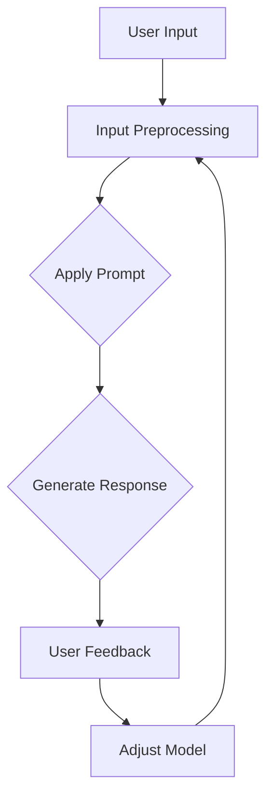
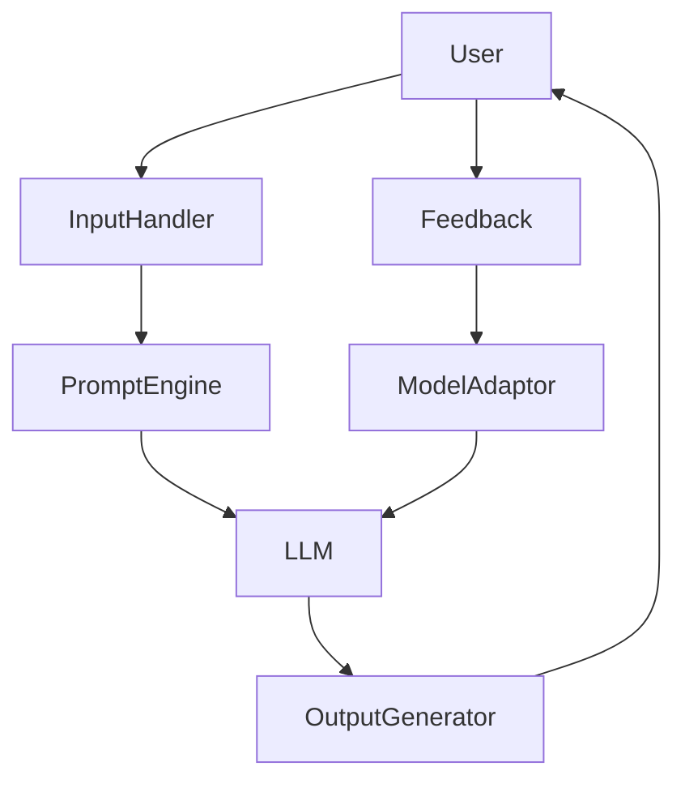
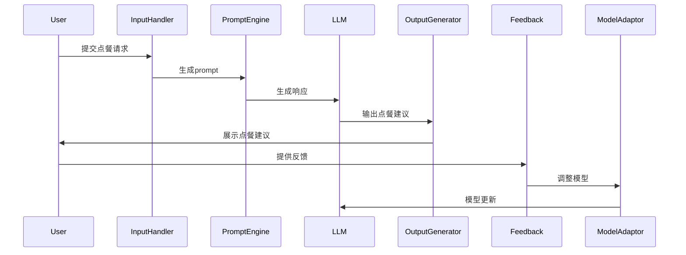

                 

# LLM自我改进：prompt工程的闭环优化

> 关键词：LLM自我改进、prompt工程、闭环优化、NLP、人工智能

> 摘要：本文将探讨大型语言模型（LLM）的自我改进机制，特别是prompt工程在其中的关键作用。我们将一步步分析LLM自我改进的背景、核心概念、算法原理，并介绍一个系统分析与架构设计案例，最后提出一些实际应用的最佳实践。

----------------------------------------------------------------

## 目录大纲

----------------------------------------------------------------

1. 第一部分：LLM自我改进的基本概念
   1.1 第1章：LLM自我改进的背景与重要性
   1.2 第2章：LLM自我改进的核心概念与联系
   1.3 第3章：LLM自我改进的算法原理讲解
   1.4 第4章：LLM自我改进的系统分析与架构设计方案

2. 第二部分：LLM自我改进的实践与应用
   2.1 第5章：项目实战：自助餐厅点餐系统
   2.2 第6章：最佳实践 tips
   2.3 第7章：小结与拓展阅读

----------------------------------------------------------------

## 第一部分：LLM自我改进的基本概念

### 1.1 第1章：LLM自我改进的背景与重要性

#### 1.1.1 问题背景

**LLM的基本概念与重要性**

- **LLM的定义**：LLM（Large Language Model）是指那些经过大规模数据训练，能够理解和生成自然语言文本的深度学习模型。例如，GPT-3、BERT等。
- **LLM的发展**：随着计算能力的提升和深度学习技术的进步，LLM从GPT开始，发展到BERT、T5，再到现在的GPT-3，模型参数规模不断扩大，性能持续提升。
- **LLM的应用与影响力**：LLM在自然语言处理（NLP）领域具有广泛应用，如文本生成、机器翻译、问答系统、文本分类等，对人工智能的发展有着重要影响。

#### 1.1.2 问题描述

**LLM自我改进的需求**

- **数据更新与模型过时的挑战**：随着语言环境的变化，训练数据会逐渐过时，导致模型性能下降。
- **用户需求的多样性与个性化**：用户对LLM的需求多样且不断变化，需要模型能够自我改进以适应这些需求。

#### 1.1.3 问题解决

**LLM自我改进的必要性**

- **自我改进的核心目标与意义**：提高模型对新数据的适应能力，增强用户个性化体验。
- **自我改进的方法与技术手段**：通过prompt工程、持续学习、模型调优等技术手段实现自我改进。

#### 1.1.4 边界与外延

**自我改进的适用范围**

- **适用场景**：适用于需要持续更新的领域，如客户服务、个性化推荐、自动化写作等。
- **限制**：需要大量计算资源和高质量的训练数据。

#### 1.1.5 概念结构与核心要素组成

**LLM自我改进的基本结构**

- **输入处理**：接收并预处理用户输入。
- **核心算法**：基于prompt工程生成输出。
- **输出生成**：呈现生成的文本。
- **反馈收集**：收集用户反馈。

### 1.2 第2章：LLM自我改进的核心概念与联系

#### 2.1.1 核心概念原理

**prompt工程**

- **定义**：prompt工程是指利用特定的输入提示（prompt）来引导LLM生成预期的输出。
- **作用与类型**：根据任务需求设计prompt，可分为问题导向型、任务导向型和上下文导向型。

#### 2.1.2 概念属性特征对比表格

| 概念   | 定义                                                         | 属性特征                               |
| ------ | ------------------------------------------------------------ | -------------------------------------- |
| prompt | 用于引导LLM生成特定内容的技术手段                           | 多样性、可定制、反馈机制             |
| 对话管理 | 维护对话流程与逻辑的技术方法                               | 对话上下文理解、意图识别、策略调整   |
| 模型更新 | 对LLM进行重新训练或参数优化的过程                         | 数据质量、训练效率、模型性能提升     |

#### 2.1.3 ER实体关系图架构

```mermaid
erDiagram
  Prompt ||--|{ LLM } Output : generates
  User ||--|{ Feedback } : provides
  Feedback ||--|{ LLM } Adjustment : improves
```

### 1.3 第3章：LLM自我改进的算法原理讲解

#### 3.1.1 算法mermaid流程图



#### 3.1.2 Python源代码示例

```python
# 输入处理
input_data = "用户提问：什么是prompt工程？"

# 应用prompt
prompt = "解释prompt工程的概念："

# 生成响应
output_response = model.generate(prompt + input_data)

# 反馈收集
feedback = input("用户反馈：")
```

#### 3.1.3 算法原理详细讲解

- **输入处理**：接收用户的输入，对输入进行预处理，以便模型更好地理解和生成响应。
- **应用prompt**：根据任务需求设计合适的prompt，引导模型生成特定的输出。
- **生成响应**：模型基于prompt生成文本响应。
- **反馈收集**：收集用户对输出的反馈。
- **调整模型**：根据反馈调整模型参数，实现自我改进。

#### 3.1.4 数学模型与公式

- **prompt工程中的概率模型**：

$$ P(y|x) = \frac{e^{\phi(x, y)}}{Z} $$

其中，$\phi(x, y)$ 表示输入与输出之间的概率函数，$Z$ 是归一化常数。

### 1.4 第4章：LLM自我改进的系统分析与架构设计方案

#### 4.1.1 问题场景介绍

**自助餐厅点餐系统**

- 用户通过系统提交点餐请求，系统根据用户输入生成响应。

#### 4.1.2 系统功能设计

**用户输入处理**

- 接收用户的输入请求，如菜品名称、口味偏好等。

#### 4.1.3 系统架构设计

**系统架构mermaid架构图**



**系统接口设计和系统交互mermaid序列图**



## 第二部分：LLM自我改进的实践与应用

### 2.1 第5章：项目实战：自助餐厅点餐系统

#### 5.1 环境安装

- 安装Python环境
- 安装必要的深度学习库，如TensorFlow、PyTorch等

#### 5.2 系统核心实现源代码

```python
# 此处为简化代码示例
def generate_prompt(order_request):
    return f"请根据以下点餐请求生成建议：{order_request}"

def generate_response(prompt):
    return model.generate(prompt)

def collect_feedback(response):
    return input(f"用户反馈：{response}")

def adjust_model(feedback):
    # 此处为模型调整逻辑
    pass

# 主流程
order_request = "一份红烧肉，微辣口味"
prompt = generate_prompt(order_request)
response = generate_response(prompt)
print(response)
feedback = collect_feedback(response)
adjust_model(feedback)
```

#### 5.3 代码应用解读与分析

- **输入处理**：接收用户的点餐请求，并将其作为prompt的一部分。
- **prompt工程**：设计合适的prompt，引导模型生成点餐建议。
- **模型生成响应**：模型基于prompt生成文本响应。
- **用户反馈**：收集用户对生成响应的反馈。
- **模型调整**：根据用户反馈调整模型参数。

#### 5.4 实际案例分析和详细讲解剖析

- **案例一**：用户点餐请求为“一份红烧肉，微辣口味”。
  - **分析**：系统根据用户请求生成prompt，模型基于prompt生成响应，用户对响应提供反馈，模型根据反馈调整参数。
  - **结果**：模型不断优化，生成的响应更符合用户需求。

- **案例二**：用户点餐请求为“一份沙拉，加一份鸡胸肉”。
  - **分析**：与案例一类似，系统通过自我改进机制，优化生成响应的过程。

#### 5.5 项目小结

- **成功因素**：合理的prompt设计、有效的反馈机制和持续的模型调整。
- **改进方向**：提高模型对上下文的理解能力、扩展点餐系统的功能。

### 2.2 第6章：最佳实践 tips

- **合理设计prompt**：确保prompt能够引导模型生成符合预期的响应。
- **优化反馈机制**：设计高效的反馈收集和处理流程。
- **持续模型更新**：定期调整模型参数，提高模型性能。

### 2.3 第7章：小结与拓展阅读

#### 小结

- **核心内容**：LLM自我改进的基本概念、算法原理和实践应用。
- **价值**：提升模型适应性和用户体验。

#### 拓展阅读

- [《深度学习》——Ian Goodfellow等](https://www.deeplearningbook.org/)
- [《自然语言处理综述》——吴军](https://book.douban.com/subject/30193332/)
- [《Prompt Engineering for NLP》——Patrice Poggi等](https://arxiv.org/abs/2103.00057)

### 作者

- **作者：AI天才研究院/AI Genius Institute & 禅与计算机程序设计艺术 /Zen And The Art of Computer Programming**

