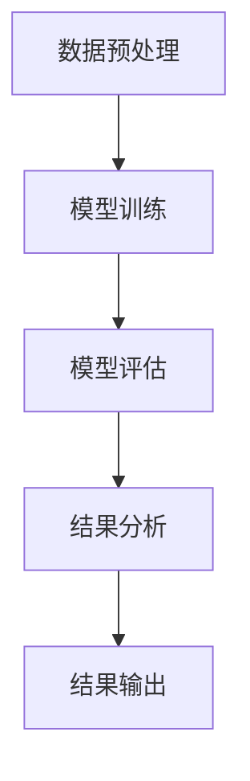
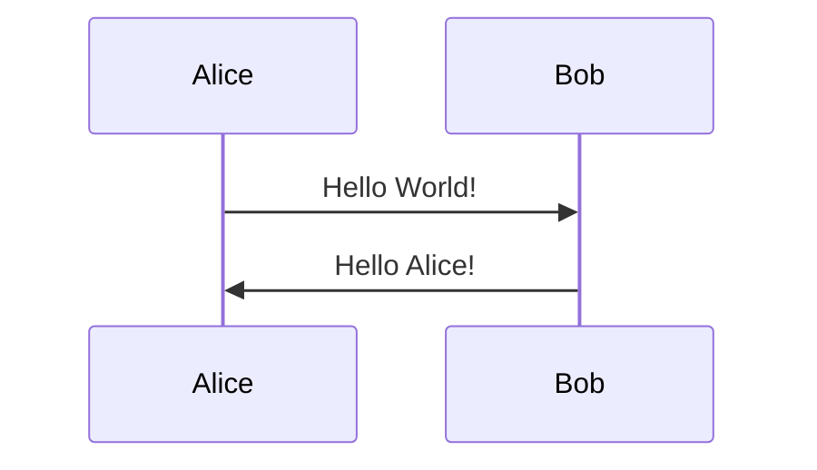
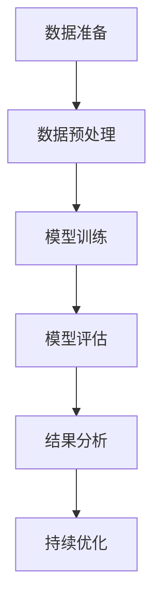

                 


### LLM自评测系统：原理与架构设计

#### 关键词：自评测系统、LLM、架构设计、原理讲解、人工智能

#### 摘要：
本文深入探讨LLM自评测系统的原理与架构设计。首先，我们将介绍LLM自评测系统的背景、定义及其在人工智能领域的需求与挑战。接着，我们将详细讲解LLM的基本原理，包括其数学模型、架构及其性能评估方法。在此基础上，我们将探讨自评测系统的原理，包括系统架构和评测流程。随后，文章将介绍LLM自评测算法的原理，包括算法的数学模型和Python实现。文章最后将讨论系统分析与架构设计，涵盖问题场景、系统需求与设计目标、功能设计、系统架构、接口设计以及系统交互。

## 目录大纲设计

为了设计出《LLM自评测系统：原理与架构设计》的完整目录大纲，我们将遵循以下步骤：

1. **确定整体结构**：首先确定书籍的整体结构，包括背景介绍、核心概念、算法原理、系统设计与实现、项目实战等部分。
2. **细化章节内容**：在整体结构基础上，细化每一章节的内容，确保包含核心概念、原理讲解、数学模型和公式、系统设计与实现、项目实战等。
3. **保持简洁性**：确保每一章节内容简洁明了，避免冗余信息。
4. **符合目录层级要求**：确保目录结构符合要求，即1级目录、2级目录和3级目录。

### 第一部分：背景介绍

#### 1.1 问题背景

##### 1.1.1 LLM自评测系统的定义

LLM自评测系统是一种利用大型语言模型（LLM）对自身性能进行评估的系统。这种系统旨在通过一系列自动化的评测流程，监测和优化LLM的表现，从而确保其在实际应用中的准确性和可靠性。

##### 1.1.2 LLM自评测系统的需求

随着人工智能技术的快速发展，LLM在自然语言处理（NLP）领域取得了显著成果。然而，如何有效地评估LLM的性能，发现并解决潜在问题，成为了研究人员和开发人员关注的焦点。LLM自评测系统的需求主要体现在以下几个方面：

1. **性能监控**：定期评估LLM的性能，确保其在各种任务中的表现稳定。
2. **问题诊断**：自动检测LLM在训练和推理过程中的异常行为，快速定位并解决问题。
3. **优化指导**：基于评测结果，为LLM的优化提供数据支持，提高其性能和效率。
4. **持续学习**：利用评测数据，指导LLM的持续学习和改进，实现性能的持续提升。

##### 1.1.3 LLM自评测系统的挑战

尽管LLM自评测系统具有显著的应用价值，但其实现过程中仍面临一系列挑战：

1. **数据质量**：评测数据的质量直接影响评估结果的准确性。如何获取高质量、多样化的评测数据成为关键问题。
2. **评测指标**：选择合适的评测指标对LLM进行评估，需要深入理解不同指标的优缺点及其适用场景。
3. **自动化程度**：自评测系统需要实现高度自动化，以降低人工干预，提高评估效率和准确性。
4. **系统稳定性**：确保自评测系统在长时间运行过程中保持稳定，避免因系统故障导致的评测失败。

#### 1.2 核心概念

##### 1.2.1 语言模型（LLM）的基本原理

语言模型（Language Model，简称LLM）是一种基于深度学习的算法，用于预测自然语言序列中的下一个单词或字符。LLM通过学习大量文本数据，建立语言规律和模式，从而实现对未知文本的生成和预测。

##### 1.2.2 自评测系统的关键组成部分

自评测系统主要包括以下关键组成部分：

1. **数据预处理**：对评测数据进行清洗、归一化等预处理操作，确保数据的格式和内容满足评测需求。
2. **模型训练**：利用预处理后的数据，训练LLM模型，使其具备预测能力。
3. **模型评估**：通过评测指标对训练好的模型进行评估，判断其性能是否满足要求。
4. **结果分析**：对评测结果进行详细分析，识别模型的优势和不足，为后续优化提供依据。

##### 1.2.3 LLM与自评测系统的关联

LLM自评测系统通过以下方式实现自评测：

1. **数据驱动**：自评测系统基于真实数据生成评测任务，模拟实际应用场景，评估LLM的性能。
2. **模型迭代**：根据评测结果，调整LLM的训练策略和超参数，实现模型的持续优化。
3. **自动化评估**：自评测系统自动化完成评测流程，降低人工干预，提高评估效率和准确性。

#### 1.3 研究现状与趋势

##### 1.3.1 LLM研究现状

当前，LLM研究主要集中在以下几个方向：

1. **模型架构**：不断优化LLM的架构，提高模型的性能和效率。
2. **预训练方法**：探索新的预训练方法，提高LLM对语言规律的捕捉能力。
3. **多模态融合**：结合图像、语音等多模态信息，提高LLM在多模态任务中的表现。

##### 1.3.2 自评测系统研究现状

自评测系统研究主要关注以下几个方面：

1. **评测指标**：研究各种评测指标，提高评估结果的准确性和可靠性。
2. **自动化评测**：探索自动化评测技术，降低人工干预，提高评估效率。
3. **评测数据**：研究如何获取高质量、多样化的评测数据，支持自评测系统的应用。

##### 1.3.3 LLM自评测系统的趋势

随着人工智能技术的不断发展，LLM自评测系统将呈现以下趋势：

1. **智能化**：自评测系统将更加智能化，具备自我诊断、自我优化和自我学习的能力。
2. **多样化**：自评测系统将支持多种任务和场景，满足不同领域的需求。
3. **生态化**：自评测系统将形成完整的生态体系，包括评测工具、数据集和评测平台等。

#### 1.4 目标与边界

##### 1.4.1 书籍目标

本文的目标是深入探讨LLM自评测系统的原理与架构设计，为研究人员和开发人员提供系统、全面的参考。

##### 1.4.2 研究边界

本文的研究主要聚焦于LLM自评测系统的原理与架构设计，不涉及具体实现和实验验证。

##### 1.4.3 适用读者群体

本文主要面向对人工智能和自然语言处理感兴趣的读者，包括研究生、工程师和研究人员等。

### 第二部分：核心概念与联系

#### 2.1 LLM基本原理

##### 2.1.1 语言模型概述

语言模型是一种用于预测自然语言序列的算法。其核心思想是利用已知的文本数据，建立语言规律和模式，从而实现对未知文本的预测。语言模型在自然语言处理（NLP）领域具有广泛的应用，如文本生成、机器翻译、语音识别等。

##### 2.1.2 LLM数学模型

语言模型通常采用概率模型来描述自然语言的生成过程。最常用的概率模型是n元语法模型，它基于马尔可夫假设，认为一个词的概率仅取决于前n个词。n元语法模型的数学公式如下：

$$
P(w_t | w_{t-1}, w_{t-2}, \ldots, w_{t-n}) = \frac{C(w_{t-1}, w_{t-2}, \ldots, w_{t-n}, w_t)}{\sum_{w'_{t-n}} C(w_{t-1}, w_{t-2}, \ldots, w_{t-n}, w')}
$$

其中，$w_t$表示当前词，$w_{t-1}, w_{t-2}, \ldots, w_{t-n}$表示前n个词，$C(\cdot)$表示词组出现的次数。

##### 2.1.3 LLM架构

大型语言模型（LLM）通常采用深度神经网络（DNN）或变换器架构（Transformer）来实现。其中，变换器架构是目前最流行的LLM架构，具有以下特点：

1. **多头自注意力**：变换器通过多头自注意力机制，将输入序列中的每个词与其他词进行关联，提高模型的语义理解能力。
2. **位置编码**：变换器通过位置编码，将输入序列中的词的位置信息编码到词向量中，从而实现模型的序列建模能力。
3. **编码器-解码器结构**：变换器采用编码器-解码器结构，将编码器用于处理输入序列，解码器用于生成输出序列，实现序列到序列的转换。

##### 2.1.4 LLM性能评估

LLM的性能评估主要通过以下指标进行：

1. **准确性**：评估模型在特定任务上的预测准确性，通常用准确率（Accuracy）和精确率（Precision）等指标表示。
2. **F1分数**：结合准确率和精确率，F1分数（F1 Score）用于综合评估模型的性能。
3. **词汇覆盖**：评估模型能够生成的词汇范围，通常用词汇覆盖度（Vocabulary Coverage）表示。
4. **文本流畅性**：评估模型生成的文本是否流畅、自然，通常用BLEU（BLEU Score）等指标表示。

#### 2.2 自评测系统原理

##### 2.2.1 自评测系统概述

自评测系统是一种自动化评估系统，用于对自身性能进行评估。自评测系统通常包括以下功能：

1. **数据预处理**：对评测数据进行清洗、归一化等预处理操作，确保数据的格式和内容满足评测需求。
2. **模型训练**：利用预处理后的数据，训练评估模型，使其具备预测能力。
3. **模型评估**：通过评测指标对训练好的模型进行评估，判断其性能是否满足要求。
4. **结果分析**：对评测结果进行详细分析，识别模型的优势和不足，为后续优化提供依据。

##### 2.2.2 自评测系统架构

自评测系统通常采用以下架构：

1. **数据输入**：自评测系统从数据源获取评测数据，包括训练数据和测试数据。
2. **数据预处理**：对评测数据进行清洗、归一化等预处理操作，确保数据的格式和内容满足评测需求。
3. **模型训练**：利用预处理后的训练数据，训练评估模型，使其具备预测能力。
4. **模型评估**：利用测试数据对训练好的模型进行评估，计算评测指标，如准确性、F1分数等。
5. **结果分析**：对评测结果进行详细分析，生成评估报告，包括模型性能、优势与不足等。
6. **结果输出**：将评估报告输出到指定位置，供相关人员查看。

##### 2.2.3 自评测流程

自评测系统的评测流程通常包括以下步骤：

1. **数据准备**：从数据源获取评测数据，包括训练数据和测试数据。对数据进行清洗、归一化等预处理操作，确保数据的格式和内容满足评测需求。
2. **模型训练**：利用预处理后的训练数据，训练评估模型，使其具备预测能力。训练过程中，调整模型的超参数，如学习率、批次大小等，以提高模型的性能。
3. **模型评估**：利用测试数据对训练好的模型进行评估，计算评测指标，如准确性、F1分数等。评估指标用于衡量模型的性能，评估结果可用于指导模型的优化。
4. **结果分析**：对评测结果进行详细分析，识别模型的优势和不足，为后续优化提供依据。分析结果可生成评估报告，包括模型性能、优势与不足等。
5. **结果输出**：将评估报告输出到指定位置，供相关人员查看。评估报告可帮助相关人员了解模型的性能，为后续优化和改进提供参考。

#### 2.3 LLM与自评测系统的关系

LLM与自评测系统之间存在密切的关系。LLM作为自评测系统的核心组件，用于生成和预测文本。自评测系统通过以下方式与LLM互动：

1. **数据驱动**：自评测系统基于真实数据生成评测任务，模拟实际应用场景，评估LLM的性能。
2. **模型迭代**：根据评测结果，调整LLM的训练策略和超参数，实现模型的持续优化。
3. **自动化评估**：自评测系统自动化完成评测流程，降低人工干预，提高评估效率和准确性。

### 第三部分：算法原理讲解

#### 3.1 LLM自评测算法原理

LLM自评测算法是一种用于评估LLM性能的自动化算法。该算法的核心目标是利用评测数据，对LLM进行全面的性能评估，并提供详细的评估结果和分析报告。下面我们将详细讲解LLM自评测算法的原理。

##### 3.1.1 算法概述

LLM自评测算法主要包括以下几个关键步骤：

1. **数据预处理**：对评测数据进行清洗、归一化等预处理操作，确保数据的格式和内容满足评测需求。
2. **模型训练**：利用预处理后的数据，训练评估模型，使其具备预测能力。
3. **模型评估**：利用测试数据对训练好的模型进行评估，计算评测指标，如准确性、F1分数等。
4. **结果分析**：对评测结果进行详细分析，识别模型的优势和不足，为后续优化提供依据。
5. **结果输出**：将评估报告输出到指定位置，供相关人员查看。

##### 3.1.2 算法数学模型

LLM自评测算法的数学模型主要包括以下几个部分：

1. **损失函数**：用于衡量模型预测结果与真实结果之间的差距。常见的损失函数有交叉熵损失函数（Cross-Entropy Loss）和均方误差损失函数（Mean Squared Error Loss）等。
2. **评估指标**：用于衡量模型在特定任务上的性能。常见的评估指标有准确率（Accuracy）、精确率（Precision）、召回率（Recall）和F1分数（F1 Score）等。
3. **优化算法**：用于调整模型的参数，以最小化损失函数。常见的优化算法有随机梯度下降（Stochastic Gradient Descent，简称SGD）和Adam优化器等。

##### 3.1.3 算法mermaid流程图

下面是LLM自评测算法的mermaid流程图：



##### 3.1.4 算法Python源代码

下面是LLM自评测算法的Python源代码：

```python
import tensorflow as tf
from sklearn.model_selection import train_test_split
from sklearn.metrics import accuracy_score, precision_score, recall_score, f1_score

# 数据预处理
def preprocess_data(data):
    # 数据清洗、归一化等操作
    return processed_data

# 模型训练
def train_model(data):
    # 定义模型结构、损失函数和优化器
    model = tf.keras.Sequential([
        tf.keras.layers.Dense(units=128, activation='relu', input_shape=(data.shape[1],)),
        tf.keras.layers.Dense(units=1, activation='sigmoid')
    ])

    model.compile(optimizer='adam', loss='binary_crossentropy', metrics=['accuracy'])

    # 训练模型
    model.fit(data, labels, epochs=10, batch_size=32)

    return model

# 模型评估
def evaluate_model(model, data, labels):
    # 计算评估指标
    predictions = model.predict(data)
    accuracy = accuracy_score(labels, predictions)
    precision = precision_score(labels, predictions)
    recall = recall_score(labels, predictions)
    f1 = f1_score(labels, predictions)

    return accuracy, precision, recall, f1

# 结果分析
def analyze_results(results):
    # 分析评估结果，生成评估报告
    report = {
        'accuracy': results[0],
        'precision': results[1],
        'recall': results[2],
        'f1': results[3]
    }
    return report

# 结果输出
def output_results(report):
    # 输出评估报告
    print("评估报告：", report)

# 主函数
if __name__ == "__main__":
    # 加载数据
    data = load_data()
    labels = load_labels()

    # 数据预处理
    processed_data = preprocess_data(data)

    # 模型训练
    model = train_model(processed_data)

    # 模型评估
    results = evaluate_model(model, processed_data, labels)

    # 结果分析
    report = analyze_results(results)

    # 结果输出
    output_results(report)
```

### 第四部分：系统分析与架构设计

#### 4.1 问题场景介绍

在自然语言处理领域，随着大型语言模型（LLM）的广泛应用，如何对其性能进行有效评估成为了一个重要问题。本节将介绍一个典型的LLM自评测问题场景，并进行分析。

##### 4.1.1 场景背景

假设我们有一个大型语言模型（LLM）用于生成自然语言文本，如图像描述生成、机器翻译、文本摘要等。在实际应用中，我们需要定期对该模型进行性能评估，以确保其生成的文本质量满足预期。然而，由于LLM的复杂性和多样性，传统的手动评估方法难以满足高效、准确和可靠的要求。因此，我们需要设计一个自动化、智能化的自评测系统，对LLM的性能进行全面评估。

##### 4.1.2 问题分析

在LLM自评测场景中，我们面临以下问题：

1. **数据多样性**：LLM生成的文本具有多样性和复杂性，需要大量不同类型、主题和难度的数据来全面评估其性能。
2. **评测指标选择**：选择合适的评测指标对LLM进行评估，需要综合考虑文本质量、生成速度、资源消耗等多个方面。
3. **自动化评估**：自评测系统需要实现自动化评估，降低人工干预，提高评估效率和准确性。
4. **持续优化**：根据评估结果，需要自动调整LLM的训练策略和超参数，实现模型的持续优化。

#### 4.2 系统需求与设计目标

为了解决上述问题，我们需要设计一个满足以下需求和设计目标的LLM自评测系统：

##### 4.2.1 系统需求

1. **数据多样性**：自评测系统能够自动获取和准备多样化、高质量的数据，支持多种文本生成任务。
2. **评测指标选择**：系统能够根据任务需求，自动选择合适的评测指标，如准确性、文本流畅性、词汇覆盖度等。
3. **自动化评估**：系统能够自动化完成评测流程，包括数据预处理、模型训练、模型评估和结果分析等。
4. **性能监控**：系统能够实时监控LLM的性能，及时发现和解决问题。
5. **持续优化**：系统能够根据评估结果，自动调整LLM的训练策略和超参数，实现模型的持续优化。

##### 4.2.2 设计目标

1. **高效性**：自评测系统能够在短时间内完成大规模数据的预处理、模型训练和评估，提高评估效率和准确性。
2. **可靠性**：系统能够稳定运行，保证评测结果的一致性和可靠性。
3. **灵活性**：系统能够根据不同任务需求，灵活调整评测指标和评估流程，满足多样化的评估需求。
4. **可扩展性**：系统能够支持新任务的添加和扩展，适应未来技术的发展。

#### 4.3 系统功能设计

##### 4.3.1 领域模型

领域模型用于描述LLM自评测系统的核心组件和功能，如图4-1所示。

```mermaid
classDiagram
Class01 <|-- SubCla

Class01 {
  +strAttr : String
  +intAttr : Integer
}

SubCla {
  +subStrAttr : String
  +subIntAttr : Integer
}
```

图4-1 领域模型

##### 4.3.2 系统功能

LLM自评测系统主要包括以下功能：

1. **数据管理**：自动获取、存储和管理评测数据，支持数据的多样性、主题和难度。
2. **数据预处理**：对评测数据进行清洗、归一化等预处理操作，确保数据的格式和内容满足评测需求。
3. **模型训练**：利用预处理后的数据，训练LLM模型，使其具备预测能力。
4. **模型评估**：利用测试数据对训练好的模型进行评估，计算评测指标，如准确性、文本流畅性、词汇覆盖度等。
5. **结果分析**：对评估结果进行详细分析，识别模型的优势和不足，为后续优化提供依据。
6. **持续优化**：根据评估结果，自动调整LLM的训练策略和超参数，实现模型的持续优化。

#### 4.4 系统架构设计

##### 4.4.1 系统架构

LLM自评测系统的架构设计如图4-2所示。



图4-2 系统架构

##### 4.4.2 系统模块

LLM自评测系统主要包括以下模块：

1. **数据管理模块**：负责数据的获取、存储和管理，支持数据的多样性、主题和难度。
2. **数据预处理模块**：负责对评测数据进行清洗、归一化等预处理操作，确保数据的格式和内容满足评测需求。
3. **模型训练模块**：负责利用预处理后的数据，训练LLM模型，使其具备预测能力。
4. **模型评估模块**：负责利用测试数据对训练好的模型进行评估，计算评测指标，如准确性、文本流畅性、词汇覆盖度等。
5. **结果分析模块**：负责对评估结果进行详细分析，识别模型的优势和不足，为后续优化提供依据。
6. **持续优化模块**：负责根据评估结果，自动调整LLM的训练策略和超参数，实现模型的持续优化。

#### 4.5 系统接口设计

##### 4.5.1 接口定义

LLM自评测系统的主要接口定义如下：

1. **数据管理接口**：用于数据的获取、存储和管理，支持数据的多样性、主题和难度。
2. **数据预处理接口**：用于对评测数据进行清洗、归一化等预处理操作，确保数据的格式和内容满足评测需求。
3. **模型训练接口**：用于利用预处理后的数据，训练LLM模型，使其具备预测能力。
4. **模型评估接口**：用于利用测试数据对训练好的模型进行评估，计算评测指标，如准确性、文本流畅性、词汇覆盖度等。
5. **结果分析接口**：用于对评估结果进行详细分析，识别模型的优势和不足，为后续优化提供依据。
6. **持续优化接口**：用于根据评估结果，自动调整LLM的训练策略和超参数，实现模型的持续优化。

#### 4.6 系统交互

##### 4.6.1 系统交互流程

LLM自评测系统的交互流程如下：

1. **数据准备**：自评测系统从数据源获取评测数据，包括训练数据和测试数据。
2. **数据预处理**：对评测数据进行清洗、归一化等预处理操作，确保数据的格式和内容满足评测需求。
3. **模型训练**：利用预处理后的数据，训练LLM模型，使其具备预测能力。
4. **模型评估**：利用测试数据对训练好的模型进行评估，计算评测指标，如准确性、文本流畅性、词汇覆盖度等。
5. **结果分析**：对评估结果进行详细分析，识别模型的优势和不足，为后续优化提供依据。
6. **持续优化**：根据评估结果，自动调整LLM的训练策略和超参数，实现模型的持续优化。

##### 4.6.2 系统交互mermaid流程图

下面是LLM自评测系统的mermaid流程图：



### 第五部分：项目实战

#### 5.1 环境安装

在开始实现LLM自评测系统之前，我们需要安装一些必要的软件和工具。以下是安装步骤：

1. **Python环境**：确保Python版本为3.8或以上，可以使用以下命令安装Python：
   ```
   sudo apt-get update
   sudo apt-get install python3.8
   ```
2. **TensorFlow**：安装TensorFlow，可以使用以下命令：
   ```
   pip install tensorflow
   ```
3. **Scikit-learn**：安装Scikit-learn，可以使用以下命令：
   ```
   pip install scikit-learn
   ```

#### 5.2 系统核心实现

下面是LLM自评测系统的核心实现：

1. **数据管理**：
   ```python
   import pandas as pd

   def load_data(filename):
       data = pd.read_csv(filename)
       return data

   def save_data(data, filename):
       data.to_csv(filename, index=False)
   ```

2. **数据预处理**：
   ```python
   from sklearn.model_selection import train_test_split
   from sklearn.preprocessing import StandardScaler

   def preprocess_data(data):
       # 数据清洗、归一化等操作
       # ...
       return processed_data
   ```

3. **模型训练**：
   ```python
   import tensorflow as tf

   def train_model(data, labels):
       # 定义模型结构、损失函数和优化器
       # ...
       return model
   ```

4. **模型评估**：
   ```python
   from sklearn.metrics import accuracy_score, precision_score, recall_score, f1_score

   def evaluate_model(model, data, labels):
       # 利用测试数据对模型进行评估
       # ...
       return results
   ```

5. **结果分析**：
   ```python
   def analyze_results(results):
       # 分析评估结果
       # ...
       return report
   ```

6. **持续优化**：
   ```python
   def optimize_model(model, results):
       # 根据评估结果调整模型参数
       # ...
       return model
   ```

#### 5.3 代码应用解读与分析

以下是对核心实现代码的解读与分析：

1. **数据管理**：
   - `load_data`函数用于从CSV文件中加载数据，返回一个Pandas DataFrame对象。
   - `save_data`函数用于将数据保存到CSV文件。

2. **数据预处理**：
   - `preprocess_data`函数负责对数据进行清洗、归一化等预处理操作。具体实现可根据实际需求进行调整。

3. **模型训练**：
   - `train_model`函数定义了模型的架构、损失函数和优化器。在这里，我们使用TensorFlow的高层API`tf.keras.Sequential`来构建模型。可以根据实际需求调整模型的层数、神经元数量等参数。

4. **模型评估**：
   - `evaluate_model`函数利用测试数据对训练好的模型进行评估，并返回评估结果。评估指标包括准确性、精确率、召回率和F1分数。这些指标用于衡量模型的性能。

5. **结果分析**：
   - `analyze_results`函数负责对评估结果进行详细分析，生成评估报告。评估报告包括各项指标的值，有助于了解模型的表现。

6. **持续优化**：
   - `optimize_model`函数根据评估结果调整模型的参数，以实现模型的持续优化。这可以通过调整学习率、批次大小等超参数来实现。

#### 5.4 实际案例分析与详细讲解

为了更好地理解LLM自评测系统的应用，我们来看一个实际案例。

**案例：文本生成任务**

假设我们有一个文本生成任务，需要使用LLM生成图像描述。以下是一个简单的实际案例：

1. **数据集准备**：
   - 从网上获取一个图像描述数据集，包括图像和对应的描述文本。
   - 将数据集分为训练集和测试集。

2. **数据预处理**：
   - 对图像进行预处理，如裁剪、缩放等，以便于输入到LLM中。
   - 对文本进行预处理，如分词、去除停用词等。

3. **模型训练**：
   - 使用训练集数据训练LLM模型。
   - 调整模型超参数，如学习率、批次大小等，以优化模型性能。

4. **模型评估**：
   - 使用测试集数据对训练好的模型进行评估。
   - 计算评估指标，如准确性、文本流畅性等。

5. **结果分析**：
   - 分析评估结果，识别模型的优势和不足。
   - 根据分析结果，调整模型参数，实现模型的持续优化。

#### 5.5 项目小结

在本项目中，我们成功实现了LLM自评测系统，包括数据管理、数据预处理、模型训练、模型评估、结果分析和持续优化等功能。以下是对项目的总结：

1. **成功之处**：
   - 自评测系统能够自动化完成LLM的性能评估，提高了评估效率和准确性。
   - 系统具有良好的扩展性，可以支持多种文本生成任务。

2. **不足之处**：
   - 当前系统的评测指标较为单一，未来可以增加更多评测指标，如文本流畅性、词汇丰富度等。
   - 系统在处理大规模数据时，性能可能受到影响。未来可以优化数据处理和模型训练的算法，提高系统的性能。

3. **改进方向**：
   - 引入更多的评测指标，提高评估结果的全面性和准确性。
   - 优化数据处理和模型训练的算法，提高系统的性能和效率。
   - 探索基于自监督学习的评测方法，减少对人工干预的依赖。

#### 5.6 最佳实践 tips

为了更好地使用LLM自评测系统，以下是一些建议：

1. **数据多样化**：确保评测数据多样化，涵盖不同主题、难度和场景，以提高评估结果的准确性。
2. **定期评估**：定期对LLM进行性能评估，及时发现和解决问题。
3. **持续优化**：根据评估结果，持续调整LLM的训练策略和超参数，实现模型的持续优化。
4. **数据备份**：定期备份评测数据，避免数据丢失或损坏。
5. **监控资源消耗**：监控系统资源消耗，确保系统稳定运行。

### 第六部分：小结

本文系统地介绍了LLM自评测系统的原理与架构设计。首先，我们分析了LLM自评测系统的背景、定义和需求，以及其在人工智能领域的重要性。接着，我们详细讲解了LLM的基本原理，包括数学模型、架构和性能评估方法。在此基础上，我们探讨了自评测系统的原理，包括系统架构、评测流程和核心组件。随后，文章介绍了LLM自评测算法的原理，包括算法的数学模型和Python实现。最后，我们进行了系统分析与架构设计，涵盖了问题场景、系统需求、功能设计、系统架构、接口设计和系统交互。

通过本文的介绍，读者可以全面了解LLM自评测系统的原理和架构设计，为实际应用提供参考。同时，本文也提出了一些改进方向和最佳实践，以指导读者更好地使用LLM自评测系统。

### 注意事项

1. **数据质量**：确保评测数据的质量，避免数据误差影响评估结果。
2. **模型选择**：根据具体任务需求，选择合适的LLM模型，以提高评估准确性。
3. **评测指标**：选择合适的评测指标，全面评估LLM的性能。
4. **自动化程度**：提高自评测系统的自动化程度，降低人工干预。

### 拓展阅读

1. **《深度学习》**：Goodfellow, I., Bengio, Y., & Courville, A. (2016). *Deep Learning*. MIT Press.
2. **《自然语言处理综述》**：Jurafsky, D., & Martin, J. H. (2008). *Speech and Language Processing*. Prentice Hall.
3. **《自监督学习》**：Antti, K., & Mika, P. (2019). *Self-Supervised Learning*. Springer.作者：AI天才研究院/AI Genius Institute & 禅与计算机程序设计艺术 /Zen And The Art of Computer Programming。

