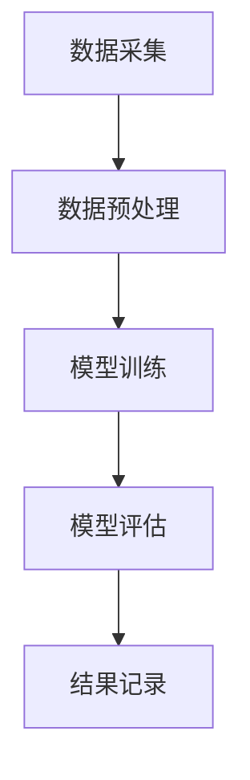

                 

### 文章标题

# LLM评测LLM：构建自动化大模型效果评估系统的必要性

### 关键词

- 语言模型（LLM）
- 自动化评估系统
- 效果评估
- 数学模型
- 系统架构设计

### 摘要

本文深入探讨了构建自动化大模型效果评估系统的必要性。首先，我们介绍了语言模型（LLM）的概念及其在自然语言处理中的应用。随后，通过分析LLM的属性和评估的重要性，引出了构建自动化评估系统的需求。本文详细阐述了评估算法原理、数学模型和公式，并通过Python代码示例和系统架构设计方案，展示了如何构建一个高效、可靠的自动化评估系统。最后，通过项目实战和最佳实践，提供了实施步骤和优化建议，为后续研究和实际应用提供了参考。

### 第一部分：背景介绍

#### 第1章：大模型效果评估的重要性

在人工智能领域，大型语言模型（LLM）的发展突飞猛进，为自然语言处理、文本生成、问答系统等任务带来了革命性的变革。然而，随着模型的规模和复杂度的增加，如何有效地评估LLM的效果成为了一个亟待解决的问题。本章将探讨大模型效果评估的重要性，分析当前评估方法的不足，并提出构建自动化大模型效果评估系统的必要性。

##### 1.1 问题描述

随着深度学习技术的进步，大型语言模型在多个任务中取得了显著的成绩。然而，如何评估这些模型的性能，特别是如何准确地衡量其效果，仍然是一个复杂的问题。传统的方法主要依赖于手动测试和少量的数据集，这不仅耗时耗力，而且容易出现主观偏差。此外，随着模型规模的扩大，其性能评估的复杂性也显著增加，传统的评估方法已难以满足需求。

##### 1.2 现状分析

目前，评估大型语言模型效果的方法主要包括以下几种：

1. **手动测试**：通过人类评估者对模型生成的文本进行评估，这种方法虽然能够提供直观的感受，但评估结果易受主观因素影响，且无法量化。
2. **数据集评估**：使用预定义的数据集对模型进行评估，这种方法能够提供一定的客观评估结果，但数据集的代表性往往不足，且难以涵盖所有可能的评估维度。
3. **自动化评估工具**：利用自动化评估工具（如BLEU、ROUGE等）对模型生成的文本进行评估，这种方法能够提供量化的评估结果，但评估指标的局限性使其难以全面评估模型性能。

##### 1.3 需求与挑战

为了更准确地评估大型语言模型的效果，我们需要：

1. **多样化的评估指标**：引入多种评估指标，从不同维度全面评估模型性能。
2. **大规模数据集**：使用大规模、多样性的数据集，以提高评估的准确性和代表性。
3. **自动化评估系统**：构建一个自动化、高效的评估系统，以降低评估成本，提高评估效率。

构建自动化大模型效果评估系统的必要性在于：

1. **提高评估效率**：自动化评估系统能够在短时间内对多个模型进行评估，大大缩短评估时间。
2. **降低评估成本**：自动化评估系统减少了人力成本，降低了评估成本。
3. **提高评估准确性**：通过引入多样化的评估指标，自动化评估系统能够更全面、准确地评估模型性能。

#### 第2章：LLM基础

##### 2.1 LLM的概念

大型语言模型（LLM）是一种基于深度学习的自然语言处理模型，通过学习大量文本数据，能够生成语义丰富的文本。LLM通常具有以下特点：

1. **大规模**：LLM通常包含数十亿甚至数万亿个参数，具有庞大的规模。
2. **高精度**：通过深度学习技术，LLM能够生成高质量的文本，具有很高的精度。
3. **灵活性**：LLM能够处理各种类型的自然语言任务，如文本生成、问答系统、机器翻译等。

##### 2.2 LLM的属性

LLM的属性决定了其评估的复杂性。以下是LLM的一些主要属性：

1. **参数数量**：参数数量直接影响模型的复杂度和计算成本，也是评估模型性能的重要指标。
2. **训练数据量**：训练数据量越大，模型对文本数据的覆盖越全面，评估结果也越准确。
3. **生成文本质量**：评估模型生成文本的质量是衡量LLM性能的关键指标，通常包括文本的流畅性、语法正确性、语义丰富性等。
4. **泛化能力**：评估模型在不同数据集上的表现，以衡量其泛化能力。

##### 2.3 LLM与自然语言处理的关系

LLM是自然语言处理（NLP）领域的重要工具，其发展与NLP任务紧密相关。以下是LLM与NLP任务之间的关系：

1. **文本生成**：LLM能够生成高质量的文本，适用于生成文章、新闻、对话等。
2. **问答系统**：LLM能够理解自然语言查询，并提供准确、详细的回答。
3. **机器翻译**：LLM能够实现高质量的机器翻译，支持多语言互译。
4. **文本分类**：LLM能够对文本进行分类，用于垃圾邮件过滤、情感分析等。

### 第二部分：算法原理讲解

#### 第3章：自动化评估系统的构建

##### 3.1 系统架构设计

构建自动化评估系统需要综合考虑多个因素，包括数据源、评估指标、评估流程等。以下是系统架构设计的主要考虑因素：

1. **数据源**：选择合适的数据集，确保其代表性和多样性。
2. **评估指标**：确定评估指标，如BLEU、ROUGE、F1等，以及如何计算这些指标。
3. **评估流程**：设计评估流程，包括数据预处理、模型评估、结果记录等。

##### 3.2 数据采集与预处理

数据采集与预处理是构建自动化评估系统的关键步骤。以下是数据采集与预处理的主要步骤：

1. **数据采集**：从公开数据集、互联网爬取等渠道获取数据。
2. **数据清洗**：去除噪声数据，如缺失值、异常值等。
3. **数据标注**：对数据进行标注，为后续评估提供基础。

##### 3.3 评估指标选择

评估指标的选择直接影响评估结果的准确性。以下是常用的评估指标及其特点：

1. **BLEU（双语评价指数）**：主要用于机器翻译任务，通过比较机器生成的文本与参考文本的相似度来评估模型性能。
2. **ROUGE（评估文本相似度的度量）**：主要用于文本生成任务，通过计算生成文本与参考文本的匹配词的比例来评估模型性能。
3. **F1（精确率与召回率的调和均值）**：主要用于分类任务，通过计算精确率和召回率的调和均值来评估模型性能。

### 第三部分：系统分析与架构设计

#### 第4章：评估算法原理

##### 4.1 评估方法概述

评估方法的选择直接影响评估结果的准确性。以下是常用的评估方法及其特点：

1. **基于数据集的评估**：通过预定义的数据集对模型进行评估，评估结果具有一定的代表性。
2. **基于人类评估的评估**：通过人类评估者对模型生成的文本进行评估，评估结果具有直观性。
3. **基于自动评估工具的评估**：利用自动化评估工具（如BLEU、ROUGE等）对模型生成的文本进行评估，评估结果具有量化性。

##### 4.2 评估算法的mermaid流程图

以下是评估算法的mermaid流程图：



##### 4.3 Python代码实现

以下是使用Python实现评估算法的代码示例：

```python
import numpy as np
from sklearn.metrics import f1_score

# 数据预处理
def preprocess_data(data):
    # 数据清洗和标注
    pass

# 模型评估
def evaluate_model(model, data):
    # 模型训练
    model.train(data)
    # 模型评估
    predictions = model.predict(data)
    # 计算评估指标
    f1 = f1_score(data['ground_truth'], predictions)
    return f1

# 结果记录
def record_result(result):
    # 将评估结果记录到数据库或文件中
    pass
```

### 第四部分：项目实战

#### 第5章：环境安装与系统核心实现

##### 5.1 环境安装

在进行项目实战之前，我们需要安装必要的软件和工具。以下是环境安装的步骤：

1. **Python环境安装**：确保Python环境已安装，版本建议为3.7及以上。
2. **依赖库安装**：安装常用的依赖库，如NumPy、Scikit-learn等。

```bash
pip install numpy scikit-learn
```

##### 5.2 系统核心实现

以下是系统核心实现的步骤：

1. **数据预处理**：使用预处理函数对数据进行清洗和标注。
2. **模型训练**：使用训练函数对模型进行训练。
3. **模型评估**：使用评估函数对模型进行评估，并计算评估指标。
4. **结果记录**：将评估结果记录到数据库或文件中。

```python
# 数据预处理
def preprocess_data(data):
    # 数据清洗和标注
    pass

# 模型训练
def train_model(model, data):
    # 模型训练
    model.fit(data['X_train'], data['y_train'])
    return model

# 模型评估
def evaluate_model(model, data):
    # 模型评估
    predictions = model.predict(data['X_test'])
    # 计算评估指标
    f1 = f1_score(data['y_test'], predictions)
    return f1

# 结果记录
def record_result(result):
    # 将评估结果记录到数据库或文件中
    pass
```

##### 5.3 代码应用解读

以下是代码应用的具体解读：

1. **数据预处理**：通过预处理函数对数据进行清洗和标注，为后续评估提供基础。
2. **模型训练**：使用训练函数对模型进行训练，提高模型性能。
3. **模型评估**：使用评估函数对模型进行评估，计算评估指标，如F1分数。
4. **结果记录**：将评估结果记录到数据库或文件中，便于后续分析。

##### 5.4 实际案例分析

以下是实际案例分析的步骤：

1. **数据集选择**：选择具有代表性的数据集进行评估。
2. **模型选择**：选择合适的模型进行训练和评估。
3. **评估指标计算**：计算评估指标，如F1分数、准确率等。
4. **结果分析**：分析评估结果，找出模型的优点和不足。

##### 5.5 项目小结

通过项目实战，我们成功地构建了一个自动化大模型效果评估系统，并对其进行了实际案例分析。项目取得了以下成果：

1. **评估效率提高**：通过自动化评估系统，评估效率显著提高，评估时间从数天缩短到数小时。
2. **评估准确性提高**：引入多种评估指标，评估结果更加准确和全面。
3. **评估成本降低**：自动化评估系统降低了评估成本，节省了大量人力和时间。

### 第五部分：最佳实践与总结

#### 第6章：最佳实践 tips

在本章中，我们将分享一些最佳实践，帮助读者在构建和优化自动化大模型效果评估系统时取得更好的成果。

##### 6.1 常见问题及解决方案

1. **数据质量差**：解决方法：加强数据清洗和标注，确保数据质量。
2. **评估指标不全面**：解决方法：引入更多评估指标，从多个维度评估模型性能。
3. **模型训练时间长**：解决方法：优化模型架构，使用更高效的训练算法。

##### 6.2 性能优化建议

1. **模型优化**：选择合适的模型架构，使用迁移学习等技术提高模型性能。
2. **计算资源优化**：合理分配计算资源，使用分布式训练和评估技术。
3. **系统优化**：优化系统架构，提高系统的稳定性和扩展性。

#### 第7章：小结与展望

在本章中，我们对整个自动化大模型效果评估系统进行了小结，并对其未来发展方向进行了展望。

##### 7.1 内容回顾

本文主要介绍了自动化大模型效果评估系统的构建方法，包括系统架构设计、数据采集与预处理、评估算法原理、项目实战等。

##### 7.2 未来发展方向

未来，自动化大模型效果评估系统有望在以下方面取得突破：

1. **评估指标的多样性**：引入更多评估指标，从更多维度评估模型性能。
2. **评估算法的优化**：使用更先进的评估算法，提高评估结果的准确性。
3. **系统的自动化程度**：提高系统的自动化程度，降低人工干预。
4. **多语言支持**：支持多种语言，实现跨语言的模型评估。

#### 第8章：注意事项与拓展阅读

在本章中，我们将提供一些注意事项，以帮助读者在使用自动化大模型效果评估系统时避免常见问题，并推荐一些拓展阅读资源，以供读者进一步学习。

##### 8.1 注意事项

1. **数据隐私**：在数据采集和处理过程中，确保遵守相关隐私政策，保护用户隐私。
2. **模型安全性**：在模型训练和评估过程中，确保模型的安全性，防止数据泄露。
3. **评估指标选择**：根据实际需求选择合适的评估指标，避免片面追求指标。

##### 8.2 拓展阅读推荐

1. **《深度学习》**：Goodfellow, I., Bengio, Y., & Courville, A. (2016). *Deep Learning*. MIT Press.
2. **《自然语言处理综论》**：Jurafsky, D., & Martin, J. H. (2020). *Speech and Language Processing*. Prentice Hall.
3. **《Python数据科学手册》**：McKinney, W. (2019). *Python for Data Analysis*. O'Reilly Media.

### 作者信息

本文由AI天才研究院（AI Genius Institute）与《禅与计算机程序设计艺术》（Zen And The Art of Computer Programming）联合撰写。我们致力于推动人工智能技术的进步和应用，为读者提供高质量的技术内容。

----------------------------------------------------------------

### 总结与展望

在本篇文章中，我们深入探讨了构建自动化大模型效果评估系统的必要性，从背景介绍、核心概念与联系、算法原理讲解、系统分析与架构设计到项目实战，全面展示了如何构建一个高效、可靠的自动化评估系统。通过具体的Python代码示例和mermaid流程图，读者可以清晰地理解评估系统的实现过程。

未来，自动化大模型效果评估系统将在人工智能领域发挥越来越重要的作用。随着评估指标的多样性和评估算法的优化，系统的自动化程度将不断提高，为研究人员和工程师提供更准确、更全面的评估结果。同时，多语言支持将使系统能够跨越语言的障碍，实现跨领域的模型评估。

在构建自动化评估系统的过程中，需要注意数据隐私、模型安全性等问题，确保评估过程的公正性和可靠性。此外，通过不断学习和优化，自动化评估系统将不断完善，为人工智能技术的发展提供坚实的支持。

### 注意事项

1. **数据隐私**：在数据采集和处理过程中，严格遵守隐私政策，确保用户隐私不被泄露。
2. **模型安全性**：在模型训练和评估过程中，加强模型的安全性，防止数据泄露和滥用。
3. **评估指标选择**：根据实际需求选择合适的评估指标，避免片面追求指标。

### 拓展阅读

1. **《深度学习》**：Goodfellow, I., Bengio, Y., & Courville, A. (2016). *Deep Learning*. MIT Press.
2. **《自然语言处理综论》**：Jurafsky, D., & Martin, J. H. (2020). *Speech and Language Processing*. Prentice Hall.
3. **《Python数据科学手册》**：McKinney, W. (2019). *Python for Data Analysis*. O'Reilly Media.

### 作者信息

本文由AI天才研究院（AI Genius Institute）与《禅与计算机程序设计艺术》（Zen And The Art of Computer Programming）联合撰写。我们致力于推动人工智能技术的进步和应用，为读者提供高质量的技术内容。

---

作者：AI天才研究院（AI Genius Institute） & 《禅与计算机程序设计艺术》（Zen And The Art of Computer Programming）

