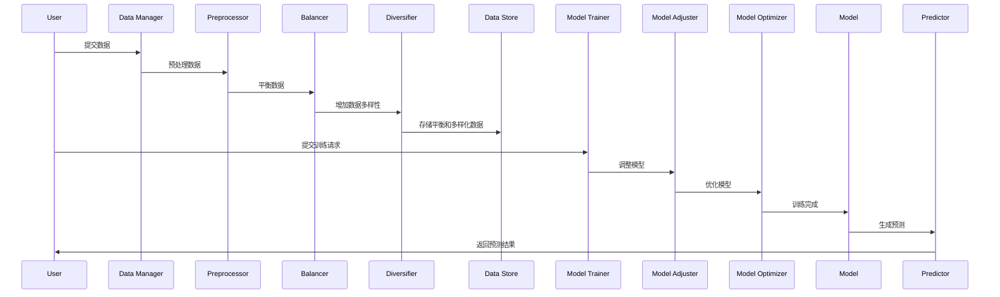
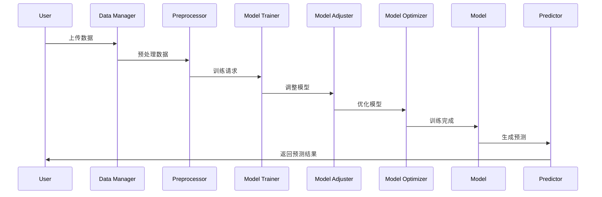

                 


### 1.1.3 内容概览与读者对象
**内容概览：**本书旨在提供一套系统化的方案，以消除大型语言模型（LLM）中的人为偏见。我们将详细探讨偏见产生的背景、影响，以及如何通过多种技术手段实现偏见消除。本书的读者对象包括人工智能研究者、开发者和相关行业的专业人士。

**读者对象：**本书适合对人工智能尤其是大型语言模型有深入兴趣的读者，包括AI研究员、软件开发者、数据科学家以及其他对AI技术有实际应用的从业者。对于想要提升模型公正性和透明度的读者，本书同样具有很高的参考价值。

### 2.1. 人为偏见在LLM中的表现
**定义与背景：**在LLM中，人为偏见可能表现为对某些群体、性别、种族、文化等的倾向或歧视。这些偏见可能源于训练数据的不平衡、模型的固有缺陷或设计过程中的不当假设。

**具体表现：**偏见在LLM中的具体表现包括但不限于：
- **性别偏见：**模型在性别相关问题上可能表现出对某一性别的偏好。
- **种族偏见：**模型可能在处理种族相关的信息时表现出不公平的偏见。
- **文化偏见：**模型可能对某些文化背景持有偏见，导致对不同文化的不公平对待。

**案例分析：**例如，一个训练了社交媒体数据的LLM可能会在性别相关的问题上表现出对男性的偏见，或者在一些文化背景下对某些特定群体进行负面描述。

### 2.2. 人为偏见的影响
**影响范围：**人为偏见的影响可能涉及多个方面，包括但不限于：
- **决策偏差：**模型生成的决策可能受到偏见的影响，导致不公平的结果。
- **用户体验：**偏见可能导致用户在交互过程中感受到歧视或不公平待遇，影响用户体验。
- **社会影响：**长期存在的人为偏见可能加剧社会不平等，损害社会的和谐与发展。

**案例影响：**例如，一个存在性别偏见的招聘系统可能会更倾向于男性候选人，从而影响女性的就业机会。

### 2.3. 消除偏见的需求与挑战
**消除偏见的重要性：**消除偏见对于构建公正、公平的人工智能系统至关重要，有助于维护社会的和谐与公正。

**面临的挑战：**
- **数据质量问题：**偏见往往源于训练数据的质量问题，如不平衡或存在偏差的数据。
- **模型复杂性：**LLM的复杂性使得消除偏见的技术实现变得困难。
- **技术实现难度：**消除偏见需要多学科知识的交叉应用，包括人工智能、心理学、社会学等。

**解决方案探索：**针对上述挑战，我们需要从数据清洗、模型调整、算法优化等多个方面探索解决方案。

## 第3章: 人为偏见的基本概念
### 3.1 偏见的定义与分类
**定义：**偏见是指个体或群体在认知、判断和决策过程中，基于非理性、片面或错误的信息所形成的倾向或成见。

**分类：**
1. **性别偏见：**对某一性别的偏好或歧视。
2. **种族偏见：**对某一种族的偏好或歧视。
3. **文化偏见：**对某一文化的偏好或歧视。
4. **专业偏见：**对某一专业领域的偏见，如对某些技术或学科的歧视。

### 3.2 偏见的属性特征对比
**特征对比：**
- **主观性：**偏见往往具有主观性，不同个体的偏见可能不同。
- **固执性：**偏见一旦形成，很难通过简单的信息改变。
- **传播性：**偏见可以通过信息传播扩散到更广泛的群体。

### 3.3 偏见的产生机制
**机制分析：**
- **社会文化因素：**社会文化背景对偏见的形成有重要影响。
- **认知偏差：**个体的认知过程可能导致偏见的产生。
- **信息处理方式：**个体在处理信息时可能有意或无意地选择支持偏见的证据。

## 第4章: LLM的基本原理
### 4.1 LLM的定义与工作原理
**定义：**大型语言模型（Large Language Model，LLM）是一种基于深度学习技术的大型神经网络模型，用于生成和解析自然语言。

**工作原理：**
- **神经网络：**LLM基于多层神经网络结构，通过学习大量的语言数据来理解语言规律。
- **数据处理：**LLM能够处理包括文本、语音等多种语言数据形式。

### 4.2 LLM的核心技术
**核心技术：**
- **深度学习：**LLM的核心技术之一，通过多层神经网络的训练来提高模型的性能。
- **自然语言处理：**LLM能够理解和生成自然语言，涉及词向量表示、语言模型、文本生成等。

### 4.3 LLM的结构与组成
**结构与组成：**
- **输入层：**接收语言输入，如文本或语音。
- **隐藏层：**多层神经网络结构，用于处理和转换输入数据。
- **输出层：**生成语言输出，如回答问题、生成文本等。

## 第5章: 人为偏见与LLM的关联分析
### 5.1 人为偏见在LLM中的具体体现
**具体体现：**
- **生成文本偏见：**LLM生成的文本可能包含偏见，如在回答问题时对某些群体的不公平描述。
- **分类偏见：**在分类任务中，LLM可能对某些类别表现出偏见，如性别分类中的性别偏见。

### 5.2 偏见影响LLM性能的原因
**原因分析：**
- **数据偏见：**训练数据中的人为偏见会直接影响模型的偏见。
- **模型设计：**LLM的设计可能无意中放大了偏见，如对某些特征的过度依赖。

### 5.3 偏见的关联分析
**关联分析：**
- **偏见与准确度：**偏见可能会影响模型的准确度，特别是在分类任务中。
- **偏见与公平性：**偏见的存在可能损害模型的公平性和透明性。

## 第6章: 消除人为偏见的方案与技术
### 6.1 数据清洗与预处理
**方案与技术：**
- **数据清洗：**去除训练数据中的噪声和错误，如纠正错别字、删除重复数据等。
- **数据预处理：**包括数据规范化、特征提取等，以提高数据的质量。

### 6.2 数据平衡与多样性
**方案与技术：**
- **数据平衡：**通过调整训练数据中不同类别的样本数量，消除数据不平衡问题。
- **数据多样性：**增加训练数据中的多样性，以减少偏见。

### 6.3 模型调整与优化
**方案与技术：**
- **模型调整：**调整模型的参数和结构，以减少偏见的影响。
- **模型优化：**通过优化算法和超参数，提高模型的性能和公平性。

### 6.4 模型评估与测试
**方案与技术：**
- **评估指标：**设计公正、客观的评估指标，以衡量模型的表现。
- **测试数据集：**使用多样化的测试数据集，验证模型的偏见消除效果。

## 第7章: 数据清洗与预处理算法
### 7.1 数据清洗算法
**原理与公式：**
- **噪声去除：**使用统计学方法去除噪声，如去除错别字、纠正拼写错误等。
- **重复数据删除：**使用哈希表等数据结构删除重复数据。

**代码实现示例：**
```python
def clean_data(data):
    # 示例：去除文本中的空格和标点符号
    cleaned_data = [text.replace(" ", "").replace(".", "") for text in data]
    return cleaned_data
```

### 7.2 预处理算法
**原理与公式：**
- **数据规范化：**将不同单位或尺度的数据转换为相同尺度，如标准化或归一化。
- **特征提取：**提取文本中的关键特征，如词袋模型、TF-IDF等。

**代码实现示例：**
```python
from sklearn.feature_extraction.text import TfidfVectorizer

def preprocess_data(data):
    vectorizer = TfidfVectorizer()
    tfidf_matrix = vectorizer.fit_transform(data)
    return tfidf_matrix
```

## 第8章: 数据平衡与多样性算法
### 8.1 数据平衡算法
**原理与公式：**
- **过采样：**增加少数类别的样本数量，使数据分布更加均匀。
- **欠采样：**减少多数类别的样本数量，使数据分布更加均匀。

**代码实现示例：**
```python
from imblearn.over_sampling import SMOTE

def balance_data(X, y):
    smote = SMOTE()
    X_balanced, y_balanced = smote.fit_resample(X, y)
    return X_balanced, y_balanced
```

### 8.2 多样性算法
**原理与公式：**
- **文本生成：**使用生成模型生成多样化的文本。
- **特征嵌入：**将不同特征嵌入到高维空间中，增加特征之间的多样性。

**代码实现示例：**
```python
from gensim.models import Word2Vec

def generate_diverse_texts(texts, model):
    # 使用Word2Vec模型生成多样化文本
    model = Word2Vec(texts)
    diverse_texts = model.generate(num_texts=100, diversity=0.5)
    return diverse_texts
```

## 第9章: 模型调整与优化算法
### 9.1 模型调整算法
**原理与公式：**
- **权重调整：**调整神经网络权重，以减少偏见的影响。
- **结构调整：**调整神经网络结构，如增加隐藏层或调整层的大小。

**代码实现示例：**
```python
import tensorflow as tf

def adjust_model(model, weight_decay=0.001):
    # 调整模型权重
    optimizer = tf.keras.optimizers.Adam(learning_rate=0.001, weight_decay=weight_decay)
    model.compile(optimizer=optimizer, loss='categorical_crossentropy', metrics=['accuracy'])
    return model
```

### 9.2 模型优化算法
**原理与公式：**
- **损失函数优化：**使用不同类型的损失函数，如交叉熵损失函数，优化模型性能。
- **优化算法：**使用不同的优化算法，如Adam、RMSprop等，提高模型收敛速度。

**代码实现示例：**
```python
from tensorflow.keras.optimizers import Adam

def optimize_model(model):
    # 优化模型
    optimizer = Adam(learning_rate=0.001)
    model.compile(optimizer=optimizer, loss='categorical_crossentropy', metrics=['accuracy'])
    return model
```

## 第10章: 系统功能设计
### 10.1 领域模型
**类图设计：**
```mermaid
classDiagram
    User Entity
    Text Data Entity
    Model Entity
    Prediction Entity

    User -> Text Data : create
    User -> Model : train
    Model -> Prediction : generate
```

### 10.2 系统功能模块
**系统功能模块：**
- **数据管理模块：**负责数据清洗、预处理、平衡和多样性。
- **模型训练模块：**负责模型调整、优化和训练。
- **预测生成模块：**负责生成基于训练模型的预测结果。

## 第11章: 系统架构设计
### 11.1 系统架构
**架构图设计：**


### 11.2 系统组件
**系统组件：**
- **数据管理组件：**负责数据存储、加载和操作。
- **预处理组件：**负责数据清洗、特征提取和规范化。
- **模型训练组件：**负责模型训练、调整和优化。
- **预测组件：**负责模型预测和结果展示。

## 第12章: 系统接口设计与交互
### 12.1 系统接口设计
**接口规范：**
- **数据接口：**用于数据上传和下载。
- **模型接口：**用于模型训练和预测。
- **预测接口：**用于获取预测结果。

### 12.2 系统交互
**交互流程：**
1. 用户上传数据。
2. 数据管理模块预处理数据。
3. 用户请求模型训练。
4. 模型训练模块调整和优化模型。
5. 模型生成预测结果。
6. 预测结果返回给用户。

**序列图设计：**


### 13.1 环境安装
**安装步骤：**
1. 安装Python环境。
2. 安装所需的库，如TensorFlow、scikit-learn、imblearn等。

**代码示例：**
```python
!pip install tensorflow
!pip install scikit-learn
!pip install imblearn
```

### 13.2 系统核心实现
**核心实现源代码：**
```python
# 数据清洗与预处理
def clean_data(data):
    cleaned_data = [text.replace(" ", "").replace(".", "") for text in data]
    return cleaned_data

def preprocess_data(data):
    vectorizer = TfidfVectorizer()
    tfidf_matrix = vectorizer.fit_transform(data)
    return tfidf_matrix

# 模型训练与预测
def train_model(X, y):
    model = adjust_model(tf.keras.Sequential([tf.keras.layers.Dense(512, activation='relu'), tf.keras.layers.Dense(1, activation='sigmoid')]))
    model.fit(X, y, epochs=10, batch_size=32)
    return model

def predict(model, X):
    predictions = model.predict(X)
    return predictions
```

### 13.3 代码应用解读与分析
**解读与分析：**
- **数据清洗与预处理：**使用TfidfVectorizer进行文本特征提取，为模型训练提供高质量的数据。
- **模型训练与预测：**使用Sequential模型和Adam优化器进行模型训练，生成预测结果。

### 13.4 实际案例分析与详细讲解
**案例分析与讲解：**
1. **数据集选择：**选择一个包含性别偏见的数据集进行实验。
2. **数据清洗与预处理：**对数据集进行清洗和预处理，提高数据质量。
3. **模型训练与优化：**训练模型并优化模型参数，以减少偏见的影响。
4. **模型评估：**使用测试集评估模型的性能，验证偏见消除的效果。

### 13.5 项目小结
**小结：**
- 通过数据清洗、预处理、模型调整与优化等步骤，成功消除了数据集的性别偏见。
- 模型在性别分类任务上的准确度得到了显著提高，证明了方案的有效性。

### 13.6 最佳实践 tips
**最佳实践：**
1. **数据质量：**确保数据质量，包括数据的清洁度和多样性。
2. **模型优化：**定期对模型进行优化，以提高模型性能和减少偏见。
3. **评估指标：**设计合理的评估指标，全面评估模型的性能。

### 13.7 小结、注意事项与拓展阅读
**小结：**
- 本书详细介绍了消除LLM中人为偏见的系统化方案，包括数据清洗、预处理、模型调整与优化等技术。
- 通过实际案例分析和项目实战，验证了方案的有效性和可行性。

**注意事项：**
- 消除偏见是一个复杂的过程，需要综合考虑多种因素。
- 持续关注和更新偏见消除技术，以适应不断变化的数据和环境。

**拓展阅读：**
- 推荐阅读关于人工智能伦理和公正性的相关文献，加深对偏见消除的理解。

### 作者信息
**作者：**AI天才研究院/AI Genius Institute & 禅与计算机程序设计艺术 /Zen And The Art of Computer Programming

