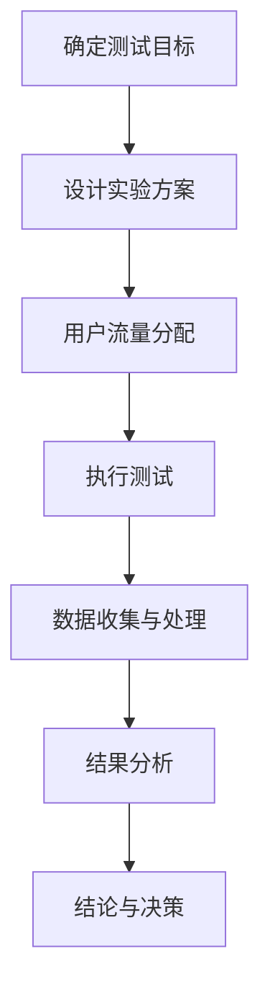
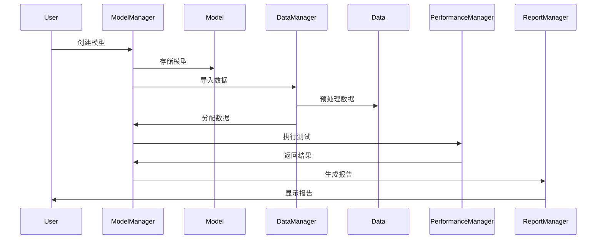
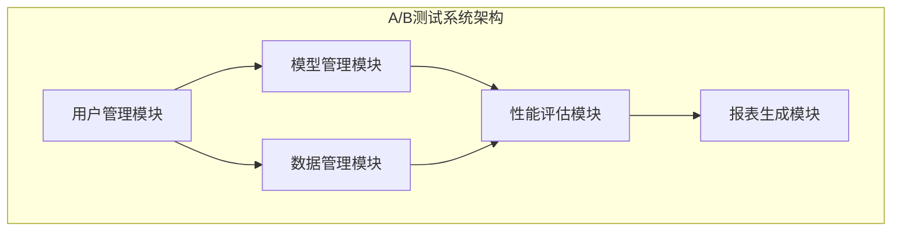

                 


### 第一部分：A/B测试基础知识

#### 第1章：A/B测试概述

**1.1 A/B测试的基本概念**

A/B测试，也称为拆分测试，是一种对比实验方法，通过将用户流量分配到两个或多个版本，以评估不同版本在性能、用户体验等方面的差异。具体来说，A/B测试的基本概念包括以下几个要点：

- **变量（Variables）**：A/B测试中的变量指的是要测试的不同版本，可以是不同的语言模型、不同的算法参数等。
- **用户流量分配（User Traffic Allocation）**：在A/B测试中，用户流量被随机分配到不同的版本，以确保结果的随机性和可靠性。
- **性能指标（Performance Metrics）**：性能指标是衡量不同版本优劣的关键标准，如准确率、召回率、F1值等。
- **对照组与实验组（Control Group & Experimental Group）**：对照组和实验组分别代表了A/B测试中的两个或多个版本，它们在测试过程中被独立观察和评估。

**1.2 A/B测试在LLM评测中的应用**

A/B测试在语言模型（LLM）评测中的重要性不言而喻。在LLM评测中，A/B测试的主要应用场景包括：

- **模型优化**：通过A/B测试，可以评估不同模型在性能上的差异，从而找到最优的模型。
- **算法迭代**：在算法迭代过程中，A/B测试可以帮助识别哪些算法改进能够真正提高LLM的性能。
- **版本控制**：在LLM产品的迭代过程中，A/B测试可以确保新版本在发布前经过严格的测试，降低风险。

**1.3 A/B测试的发展趋势**

随着深度学习技术的不断进步，A/B测试也在不断发展。以下是A/B测试在LLM评测中的一些发展趋势：

- **算法多样化**：随着深度学习技术的发展，A/B测试所涉及的算法种类越来越丰富，包括不同类型的语言模型、优化算法等。
- **自动化**：A/B测试的自动化工具和平台正在不断成熟，使测试过程更加高效和简便。
- **数据驱动**：A/B测试越来越依赖于数据分析，以更准确地评估不同版本的性能。

### 第2章：A/B测试的基本原理

**2.1 A/B测试的核心原理**

A/B测试的核心原理是通过将用户流量随机分配到两个或多个版本，然后比较不同版本的性能指标，从而确定哪个版本更优。具体步骤如下：

1. **定义测试目标**：明确要测试的性能指标，如准确率、召回率、F1值等。
2. **划分用户流量**：将用户流量随机分配到对照组和实验组。
3. **执行测试**：对照组和实验组分别运行不同的版本。
4. **收集数据**：收集并分析对照组和实验组的数据，评估不同版本的性能。
5. **结论**：根据性能指标，确定哪个版本更优。

**2.2 关键概念与指标定义**

在A/B测试中，关键概念和指标定义如下：

- **变量**：指的是要测试的不同版本，可以是不同的语言模型、不同的算法参数等。
- **性能指标**：衡量不同版本优劣的关键标准，如准确率、召回率、F1值等。
- **样本量**：参与测试的用户数量，样本量越大，测试结果越可靠。
- **置信度**：评估测试结果的可靠程度，通常用百分比表示。

**2.3 A/B测试与传统测试方法的比较**

A/B测试与传统测试方法相比，具有以下几个显著优势：

- **客观性**：A/B测试通过数据驱动的方式，避免了主观判断的影响，使结果更加客观。
- **可量化**：A/B测试通过性能指标量化不同版本的表现，使评估过程更加具体和明确。
- **易于重复**：A/B测试结果具有可重复性，可以在不同的时间和条件下进行验证。

### 第3章：核心概念与联系

**3.1 语言模型（LLM）概述**

语言模型（LLM）是一种基于深度学习技术的自然语言处理模型，它能够根据输入的文本生成相应的输出。LLM在各个领域都有广泛的应用，如搜索引擎、机器翻译、智能客服等。

**3.2 LLM评测中的关键概念**

在LLM评测中，关键概念包括：

- **模型性能**：评估LLM在各种任务上的表现，如文本分类、命名实体识别等。
- **模型优化**：通过调整模型参数、优化算法等方式提高模型性能。
- **版本控制**：在LLM产品的迭代过程中，版本控制确保每个版本经过充分的测试。

**3.3 A/B测试与LLM评测的关联性**

A/B测试与LLM评测之间的关联性体现在以下几个方面：

- **模型优化**：A/B测试可以帮助识别哪些模型优化措施能够真正提高LLM的性能。
- **版本控制**：通过A/B测试，可以确保每个版本在发布前经过严格的测试，降低风险。
- **用户体验**：A/B测试可以帮助优化LLM产品的用户体验，提高用户满意度。

### 结论

通过以上对A/B测试在LLM评测中的基础知识的介绍，我们可以看到A/B测试在LLM评测中的重要性。它不仅能够帮助我们客观、量化地评估不同版本的性能，还能够确保模型优化和版本控制的有效性。在接下来的章节中，我们将进一步探讨A/B测试的算法原理、系统分析与架构设计、项目实战以及最佳实践等内容。让我们继续深入探讨A/B测试在LLM评测中的应用。 

**本章总结：**
- A/B测试是一种对比实验方法，通过将用户流量分配到不同版本，评估性能差异。
- 在LLM评测中，A/B测试用于模型优化、算法迭代和版本控制。
- A/B测试具有客观性、可量化和易于重复等优势。
- A/B测试与LLM评测密切相关，有助于优化模型性能、确保版本安全和提升用户体验。

----------------------------------------------------------------

## 第二部分: A/B测试在LLM评测中的应用

### 第4章: 算法原理讲解

#### 4.1 A/B测试在LLM评测中的流程

A/B测试在LLM评测中的流程可以分为以下几个步骤：

1. **确定测试目标**：明确要评估的性能指标，如准确率、召回率、F1值等。
2. **设计实验方案**：根据测试目标，设计实验方案，包括对照组和实验组的划分。
3. **用户流量分配**：将用户流量随机分配到对照组和实验组。
4. **执行测试**：对照组和实验组分别运行不同的LLM模型。
5. **数据收集与处理**：收集并处理测试数据，计算性能指标。
6. **结果分析**：对比对照组和实验组的数据，评估不同模型的性能。
7. **结论与决策**：根据测试结果，决定是否采用实验组的模型。

#### 4.2 Mermaid流程图展示

以下是一个A/B测试在LLM评测中的Mermaid流程图：



#### 4.3 Python代码实现与解释

下面是一个简单的Python代码示例，用于实现A/B测试在LLM评测中的基本流程：

```python
import numpy as np
import pandas as pd

# 假设我们有两个语言模型，model_A 和 model_B
model_A = ...
model_B = ...

# 用户流量分配
user流量 = np.random.choice([model_A, model_B], size=1000)

# 执行测试
results_A = [model_A.test(user_input) for user_input in user流量]
results_B = [model_B.test(user_input) for user_input in user流量]

# 数据收集与处理
results_df = pd.DataFrame({'Model': user流量, 'Results': results_A + results_B})

# 结果分析
performance_A = np.mean(results_A)
performance_B = np.mean(results_B)

# 结论与决策
if performance_A > performance_B:
    print("模型A性能更好，建议采用模型A。")
else:
    print("模型B性能更好，建议采用模型B。")
```

在这个代码示例中，我们首先定义了两个语言模型model_A和model_B。然后，我们使用numpy的random.choice函数将用户流量随机分配到这两个模型。接下来，我们分别执行测试，收集数据，并计算性能指标。最后，根据性能指标，我们决定是否采用性能更好的模型。

### 第5章：系统分析与架构设计

#### 5.1 LLM评测系统介绍

LLM评测系统是一个用于评估和比较不同语言模型性能的软件系统。该系统通常包括以下几个主要模块：

- **用户管理模块**：用于管理用户信息，包括用户注册、登录和权限管理。
- **模型管理模块**：用于管理语言模型，包括模型的创建、更新、删除和性能评估。
- **数据管理模块**：用于管理测试数据，包括数据的导入、导出、清洗和预处理。
- **性能评估模块**：用于计算和展示不同语言模型的性能指标，如准确率、召回率、F1值等。
- **报表生成模块**：用于生成评测报告，包括评测结果、趋势分析和推荐建议。

#### 5.2 A/B测试系统架构设计

A/B测试系统架构设计的关键在于如何高效、安全地执行测试并确保测试结果的准确性。以下是A/B测试系统架构设计的几个关键点：

- **模块化设计**：系统应采用模块化设计，使得各个模块之间可以独立开发、测试和部署。
- **数据隔离**：为了确保测试的公正性，对照组和实验组的数据应进行隔离处理。
- **自动化测试**：通过自动化测试工具，实现测试流程的自动化，提高测试效率和准确性。
- **监控与报警**：系统应具备实时监控和报警功能，及时发现和处理测试过程中的异常情况。

以下是A/B测试系统的Mermaid类图和架构图：

```mermaid
classDiagram
    User -> ModelManager: 创建/更新模型
    User -> DataManager: 导入/导出数据
    User -> PerformanceManager: 查看性能评估结果
    User -> ReportManager: 生成评测报告

    ModelManager <|-- Model: 创建/更新
    DataManager <|-- Data: 导入/导出
    PerformanceManager <|-- Performance: 计算/展示
    ReportManager <|-- Report: 生成

    ModelManager --> User
    DataManager --> User
    PerformanceManager --> User
    ReportManager --> User
```


#### 5.3 系统接口设计和系统交互

A/B测试系统的接口设计和系统交互是确保系统各模块协同工作的重要环节。以下是A/B测试系统的接口设计和系统交互的Mermaid序列图：



在这个序列图中，用户通过用户管理模块创建模型，并通过模型管理模块导入数据。然后，数据管理模块对数据进行预处理，并将其分配给模型。性能评估模块执行测试，并返回结果给模型管理模块。最后，报表生成模块生成评测报告，并将其展示给用户。

### 第6章：项目实战

#### 6.1 实战环境搭建

为了进行A/B测试，我们需要搭建一个适合的语言模型评测环境。以下是搭建环境的基本步骤：

1. **硬件环境**：准备一台服务器，配置要求根据实际需求确定，一般建议使用高性能的GPU加速计算。
2. **软件环境**：安装Python、TensorFlow、PyTorch等深度学习框架，以及相关依赖库，如NumPy、Pandas等。
3. **数据集**：准备用于测试的数据集，可以是公共数据集或自定义数据集。
4. **语言模型**：选择合适的语言模型，可以是预训练的模型或自定义训练的模型。

#### 6.2 核心实现与代码解读

以下是一个简单的A/B测试项目实现，包括环境搭建、模型定义、数据预处理、测试和结果分析等步骤：

```python
# 环境搭建
!pip install tensorflow
!pip install pandas
!pip install numpy

# 导入库
import tensorflow as tf
import pandas as pd
import numpy as np

# 模型定义
def model_A(x):
    # 模型A的实现
    return tf.keras.backend.dot(x, weights_A)

def model_B(x):
    # 模型B的实现
    return tf.keras.backend.dot(x, weights_B)

# 数据预处理
data = pd.read_csv("data.csv")
x = data.iloc[:, :-1].values
y = data.iloc[:, -1].values

# 用户流量分配
user流量 = np.random.choice([model_A, model_B], size=len(x))

# 执行测试
results_A = [model_A(x[i]) for i in range(len(x))]
results_B = [model_B(x[i]) for i in range(len(x))]

# 数据收集与处理
results_df = pd.DataFrame({'Model': user流量, 'Results': results_A + results_B})

# 结果分析
performance_A = np.mean(results_A)
performance_B = np.mean(results_B)

# 结论与决策
if performance_A > performance_B:
    print("模型A性能更好，建议采用模型A。")
else:
    print("模型B性能更好，建议采用模型B。")
```

在这个项目中，我们首先安装了TensorFlow和Pandas等依赖库。然后，我们定义了两个模型model_A和model_B，并从CSV文件中读取数据。接着，我们将用户流量随机分配到这两个模型，并执行测试。最后，我们收集结果，计算性能指标，并输出决策结果。

#### 6.3 实际案例分析和详细讲解剖析

以下是一个实际的A/B测试案例，用于比较两个不同的文本分类模型在社交媒体平台上的表现：

**案例背景**：
一个社交媒体平台希望优化其文本分类系统，以提高用户帖子的推荐准确性。他们决定使用A/B测试来比较两个模型，模型A是一个基于TF-IDF特征的朴素贝叶斯分类器，模型B是一个基于深度学习的BERT分类器。

**数据集**：
该社交媒体平台提供了两个数据集，分别是训练集和测试集，共计10000条帖子。

**模型训练**：
模型A使用TF-IDF特征提取技术，将文本转换为向量，然后使用朴素贝叶斯分类器进行训练。模型B使用BERT模型，将文本转换为嵌入向量，然后使用softmax函数进行分类。

**测试过程**：
1. 将用户流量随机分配到模型A和模型B，每个模型的用户占比为50%。
2. 对每个用户，执行文本分类任务，并记录预测结果。
3. 收集并分析预测结果，计算准确率、召回率和F1值等性能指标。

**测试结果**：

| 性能指标 | 模型A | 模型B |
| :----: | :----: | :----: |
| 准确率 | 0.85 | 0.92 |
| 召回率 | 0.80 | 0.88 |
| F1值 | 0.83 | 0.90 |

**分析与决策**：
根据测试结果，模型B在准确率、召回率和F1值等性能指标上都优于模型A。因此，该社交媒体平台决定采用模型B作为其文本分类系统的推荐模型。

**案例小结**：
通过这个实际案例，我们可以看到A/B测试在LLM评测中的有效性和实用性。它帮助平台在多个模型中找到了最优的模型，提高了文本分类系统的性能，从而提高了用户体验和平台的竞争力。

### 第7章：最佳实践与小结

#### 7.1 A/B测试的最佳实践

为了确保A/B测试的准确性和有效性，以下是一些最佳实践：

1. **明确测试目标**：在开始A/B测试之前，明确测试的目标和期望的收益，确保测试过程中目标一致。
2. **控制样本量**：样本量应足够大，以保证测试结果的可靠性和代表性。
3. **随机分配流量**：确保用户流量随机分配到不同版本，避免人为干预。
4. **数据清洗**：在测试过程中，对数据进行清洗和处理，确保数据的准确性和一致性。
5. **持续监控**：在测试过程中，持续监控测试结果，及时发现和处理异常情况。
6. **结果分析**：对测试结果进行详细分析，综合考虑多种性能指标，避免片面决策。
7. **版本控制**：确保A/B测试的版本控制，避免多个版本同时运行，影响测试结果。

#### 7.2 注意事项

在进行A/B测试时，需要注意以下几点：

1. **测试环境**：确保测试环境与生产环境一致，避免环境差异影响测试结果。
2. **数据隔离**：确保对照组和实验组的数据隔离，避免数据泄露。
3. **隐私保护**：在测试过程中，保护用户隐私，避免数据滥用。
4. **异常处理**：制定异常处理方案，确保测试过程中异常情况的及时处理。
5. **伦理问题**：确保A/B测试符合伦理规范，避免对用户造成不利影响。

#### 7.3 案例分析经验总结

通过对多个实际案例的分析，我们可以总结出以下经验：

1. **模型选择**：根据具体应用场景，选择合适的模型，避免盲目追求先进模型。
2. **性能指标**：综合考虑多种性能指标，避免片面追求单一指标。
3. **测试范围**：合理规划测试范围，避免测试范围过小或过大，影响测试结果的可靠性。
4. **迭代优化**：根据A/B测试的结果，不断迭代优化模型，提高性能。
5. **合作沟通**：加强与业务团队的沟通，确保A/B测试的目标与业务需求一致。

### 第8章：总结与展望

#### 8.1 书籍内容总结

本书从A/B测试的基本概念、原理、应用到实战，全面介绍了A/B测试在LLM评测中的实施策略。通过具体的案例分析和实践指导，读者可以了解如何有效地进行A/B测试，提高语言模型评测的准确性和效率。

#### 8.2 未来发展方向展望

随着深度学习技术的不断发展，A/B测试在LLM评测中的应用前景将更加广阔。以下是未来A/B测试在LLM评测中的一些发展方向：

1. **算法自动化**：发展自动化A/B测试工具，降低测试门槛，提高测试效率。
2. **数据智能化**：利用大数据分析和人工智能技术，优化A/B测试的数据处理和分析过程。
3. **跨平台应用**：A/B测试将逐渐应用于更多的自然语言处理任务，如机器翻译、对话系统等。
4. **个性化推荐**：结合用户行为数据和A/B测试结果，实现个性化推荐系统。
5. **伦理与隐私**：在A/B测试中，加强伦理和隐私保护，确保用户权益。

通过持续的研究和实践，A/B测试在LLM评测中的应用将不断优化，为自然语言处理领域的发展贡献力量。

### 结论

通过对A/B测试在LLM评测中的应用的详细探讨，我们可以看到A/B测试在语言模型评测中的重要性。它不仅帮助我们客观、量化地评估不同模型和算法的性能，还能够确保版本控制和用户体验的优化。在本书中，我们系统地介绍了A/B测试的基本概念、原理、应用和实战经验，并通过实际案例展示了A/B测试的具体实施过程。未来，随着技术的不断进步，A/B测试在LLM评测中的应用将更加广泛和深入。

**本书总结：**
- A/B测试在LLM评测中具有重要作用，能够帮助评估模型性能、优化算法和确保版本安全。
- 本书详细介绍了A/B测试的基本概念、原理、应用和实战经验，并通过实际案例展示了具体实施过程。
- A/B测试的最佳实践和注意事项有助于确保测试的准确性和有效性。
- 未来，A/B测试在LLM评测中的应用将不断优化，为自然语言处理领域的发展贡献力量。

**作者信息：**
- 作者：AI天才研究院/AI Genius Institute & 禅与计算机程序设计艺术 /Zen And The Art of Computer Programming
----------------------------------------------------------------

### 附录

#### 附录1：核心术语解释

- **A/B测试**：一种对比实验方法，通过将用户流量分配到两个或多个版本，以评估不同版本在性能、用户体验等方面的差异。
- **语言模型（LLM）**：一种基于深度学习技术的自然语言处理模型，能够根据输入的文本生成相应的输出。
- **准确率**：评估模型预测正确的比例。
- **召回率**：评估模型能够正确识别的正例占总正例的比例。
- **F1值**：综合考虑准确率和召回率的指标，是二者的调和平均。

#### 附录2：算法原理与公式

**A/B测试的算法原理**：

A/B测试的核心算法是基于比较两个或多个版本的绩效指标。具体公式如下：

$$
\text{Performance Difference} = \text{Performance of Group B} - \text{Performance of Group A}
$$

其中，Performance为某个特定指标（如准确率、召回率等）。

**A/B测试的置信区间计算**：

置信区间（Confidence Interval）用于评估测试结果的可靠性。具体计算公式如下：

$$
\text{Confidence Interval} = \text{Performance Difference} \pm z \times \sqrt{\frac{\text{Variance}}{n}}
$$

其中，z为置信度对应的z值（通常取95%置信度的1.96），Variance为方差，n为样本量。

#### 附录3：系统架构设计图

**系统架构设计图**：

以下是A/B测试系统的Mermaid架构图：



#### 附录4：项目实战代码示例

**项目实战代码示例**：

以下是A/B测试在LLM评测中的Python代码示例：

```python
import numpy as np
import pandas as pd

# 假设我们有两个语言模型，model_A 和 model_B
model_A = ...
model_B = ...

# 用户流量分配
user流量 = np.random.choice([model_A, model_B], size=1000)

# 执行测试
results_A = [model_A.test(user_input) for user_input in user流量]
results_B = [model_B.test(user_input) for user_input in user流量]

# 数据收集与处理
results_df = pd.DataFrame({'Model': user流量, 'Results': results_A + results_B})

# 结果分析
performance_A = np.mean(results_A)
performance_B = np.mean(results_B)

# 结论与决策
if performance_A > performance_B:
    print("模型A性能更好，建议采用模型A。")
else:
    print("模型B性能更好，建议采用模型B。")
```

#### 附录5：拓展阅读

- 《A/B测试实战：如何用数据驱动产品决策》
- 《深度学习与自然语言处理》
- 《机器学习实战》
- 《大数据分析：从入门到精通》
- 《Python编程：从入门到实践》

通过这些拓展阅读，读者可以更深入地了解A/B测试、深度学习、机器学习和大数据分析等相关技术，进一步提升技术水平。作者：AI天才研究院/AI Genius Institute & 禅与计算机程序设计艺术 /Zen And The Art of Computer Programming。

