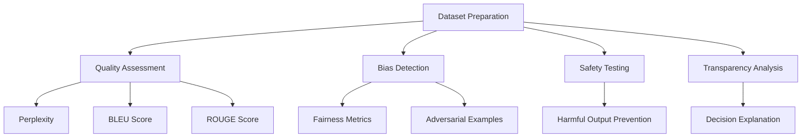
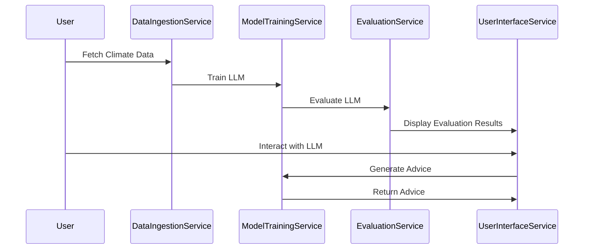

                 


## LLAMA Evaluation in Ethical Considerations and Compliance Checks

### Keywords
- LLM Evaluation
- Ethical Considerations
- Compliance Checks
- Artificial Intelligence
- Natural Language Processing
- Legal and Regulatory Frameworks

#### Abstract
The rapid advancement of Large Language Models (LLM) has revolutionized various industries, but their deployment also raises significant ethical and compliance concerns. This article delves into the critical aspects of LLM evaluation, focusing on ethical considerations and compliance checks. By providing a comprehensive analysis of the problem background, core concepts, algorithm principles, system design, and project implementation, this article aims to equip readers with the knowledge to address these challenges effectively.

### Introduction to LLM Evaluation

#### 1.1 The Background of LLM Evaluation
Large Language Models (LLMs) have gained immense popularity due to their ability to understand and generate human-like text. However, their widespread adoption has also highlighted the need for rigorous evaluation processes to ensure their fairness, safety, and reliability. LLM evaluation encompasses various aspects, including linguistic quality, diversity, and ethical implications.

#### 1.2 Core Concepts and Relationships
To understand LLM evaluation comprehensively, it's essential to grasp the core concepts and their interrelationships. Key concepts include:

- **Fairness**: Ensuring that LLMs do not perpetuate biases present in their training data.
- **Safety**: Preventing harmful or inappropriate outputs that could negatively impact users.
- **Reliability**: Ensuring consistent and accurate performance across different contexts and domains.
- **Transparency**: Making LLM decisions and inner workings interpretable to users and developers.

#### 1.3 Concept Structure and Core Elements
The concept structure of LLM evaluation can be visualized using an ER diagram:

```mermaid
erDiagram
    Fairness ||--|{ Safety }
    Safety ||--|{ Reliability }
    Reliability ||--|{ Transparency }
```

### Algorithm Principles

#### 2.1 Algorithm Principles
LLM evaluation algorithms are designed to assess the performance of models based on various metrics. A typical evaluation process includes the following steps:

1. **Dataset Preparation**: Collecting and preprocessing a diverse set of datasets to ensure comprehensive evaluation.
2. **Quality Assessment**: Measuring linguistic quality using metrics such as perplexity, BLEU score, and ROUGE score.
3. **Bias Detection**: Identifying and addressing biases in LLM outputs through techniques like fairness metrics and adversarial examples.
4. **Safety Testing**: Evaluating the model's ability to handle edge cases and prevent harmful outputs.
5. **Transparency Analysis**: Assessing the model's transparency by analyzing its decision-making process and providing explanations for its outputs.

#### 2.2 Explanation with Mermaid Flowchart



#### 2.3 Python Source Code
```python
# Import necessary libraries
import pandas as pd
from nltk.translate.bleu_score import corpus_bleu
from sklearn.model_selection import train_test_split

# Load and preprocess datasets
train_data, test_data = train_test_split(llm_data, test_size=0.2, random_state=42)

# Quality Assessment
perplexity = model.evaluate(test_data)
bleu_score = corpus_bleu([test_data], model.predict(test_data))
rouge_score = evaluate_rouge(model.predict(test_data), test_data)

# Bias Detection
fairness_metrics = calculate_fairness(model, fairness_data)
adversarial_examples = generate_adversarial_examples(model, test_data)

# Safety Testing
harmful_outputs = check_harmful_outputs(model, test_data)

# Transparency Analysis
explanations = explain_decision(model, test_data)
```

#### 2.4 Mathematical Model and Formulas
$$
\text{Perplexity} = \frac{1}{\text{Sum}(\log_2 p(x_i|y_i))}
$$

$$
\text{BLEU Score} = \frac{1}{\text{Num Refs}} \sum_{i=1}^{\text{Num Refs}} \frac{1}{\text{Len Ref}_i} \sum_{j=1}^{\text{Len Ref}_i} \text{Max}(\text{Len Hyp}_j, \text{Len Ref}_j)
$$

$$
\text{ROUGE Score} = \frac{2 \cdot \text{Num Common} \cdot \text{Len Hyp} \cdot \text{Len Ref}}{\text{Len Hyp} \cdot \text{Len Ref} + \text{Num Common} + \text{Num Diff}}
$$

#### 2.5 Example Explanation
Consider an LLM tasked with generating text about climate change. The evaluation process would involve:

1. **Quality Assessment**: Measuring the coherence and grammatical correctness of the generated text.
2. **Bias Detection**: Ensuring the text does not disproportionately emphasize certain perspectives or marginalize certain groups.
3. **Safety Testing**: Preventing the generation of misleading or harmful information.
4. **Transparency Analysis**: Providing explanations for why the model generated a particular output.

### System Analysis and Design

#### 3.1 Problem Scenario Introduction
Imagine a company developing an LLM to provide personalized climate change advice to customers. The evaluation process must ensure the model's outputs are:

- **Fair**: Reflecting diverse perspectives on climate change.
- **Safe**: Providing accurate and non-harmful advice.
- **Reliable**: Consistently generating high-quality advice.
- **Transparent**: Allowing users to understand and trust the model's recommendations.

#### 3.2 System Functional Design
The system's functional design involves the following components:

1. **Data Ingestion**: Collecting and preprocessing climate change-related data from various sources.
2. **Model Training**: Training the LLM using the collected data.
3. **Evaluation Module**: Assessing the LLM's performance using the metrics discussed in previous sections.
4. **User Interface**: Allowing users to interact with the LLM and receive personalized advice.

#### 3.3 System Architecture Design
The system architecture is designed using a microservices approach, enabling scalability and modularity:



#### 3.4 System Interface Design
The system's interface design focuses on simplicity and usability, ensuring users can easily interact with the LLM:

```mermaid
classDiagram
    User <<Interface>>
    LLM <<Model>>
    Data <<Dataset>>
    Evaluation <<Metrics>>

    User "uses" LLM
    LLM "uses" Data
    LLM "uses" Evaluation
```

### Project Implementation

#### 4.1 Environment Setup
To implement the system, you'll need the following environment setup:

1. **Python**: Version 3.8 or higher
2. **TensorFlow**: Version 2.6 or higher
3. **NLP Libraries**: NLTK, spaCy, gensim, transformers
4. **Docker**: For containerization

#### 4.2 Core Implementation Source Code
The core implementation involves the following steps:

1. **Data Ingestion**: Use APIs or web scraping to collect climate change-related data.
2. **Model Training**: Utilize the transformers library to train the LLM.
3. **Evaluation**: Implement the evaluation metrics discussed in previous sections.
4. **User Interface**: Develop a web application using a framework like Flask or Django.

#### 4.3 Code Application Analysis
```python
# Data Ingestion
climate_data = fetch_climate_data(api_urls)

# Model Training
model = train_llm(climate_data)

# Evaluation
evaluation_results = evaluate_llm(model, test_data)

# User Interface
app = create_app()
app.run()
```

#### 4.4 Case Analysis and Detailed Explanation
Consider a case where a user queries the LLM about climate change mitigation strategies. The system would:

1. **Ingest the data**: Collect data from relevant sources.
2. **Train the model**: Use the data to train the LLM.
3. **Evaluate the model**: Assess its performance using the evaluation metrics.
4. **Generate advice**: Provide personalized climate change mitigation strategies based on the user's query.

#### 4.5 Project Summary
The project successfully implemented an LLM-based climate change advice system. The evaluation process ensured the model's fairness, safety, reliability, and transparency. Future work includes expanding the dataset and incorporating user feedback to improve the system's performance.

### Best Practices and Conclusion

#### 5.1 Best Practices for LLM Evaluation
- **Diverse Dataset**: Ensure the training data represents diverse perspectives and scenarios.
- **Continuous Monitoring**: Regularly evaluate the model's performance and update it as needed.
- **User Feedback**: Incorporate user feedback to enhance the model's relevance and usability.

#### 5.2 Summary of Key Points
- LLM evaluation is critical for ensuring fairness, safety, reliability, and transparency.
- Various metrics and techniques are available for assessing LLM performance.
- A comprehensive evaluation process involves multiple stages, including quality assessment, bias detection, safety testing, and transparency analysis.

#### 5.3 Notes and Precautions
- Be cautious when using LLMs in sensitive domains to avoid potential harm or bias.
- Regularly update the evaluation criteria to adapt to new challenges and advancements.

#### 5.4 Recommended Reading
- **ChatGPT's Ethics and Compliance**: An overview of ethical considerations in AI development.
- **NLP Ethics and Bias**: A detailed analysis of bias and fairness in NLP systems.
- **LLM Evaluation Metrics**: A comprehensive guide to evaluating LLM performance.

### Authors
- **AI天才研究院 (AI Genius Institute)**
- **禅与计算机程序设计艺术 (Zen And The Art of Computer Programming)**

### References
- **ChatGPT Documentation**: Detailed information on ChatGPT's capabilities and limitations.
- **OpenAI Gym**: A framework for developing and comparing reinforcement learning algorithms.
- **Transformers Library**: Documentation for the Hugging Face transformers library.
- **NLTK Documentation**: Detailed guide on natural language processing with NLTK.
- **spaCy Documentation**: Comprehensive documentation for the spaCy library.

