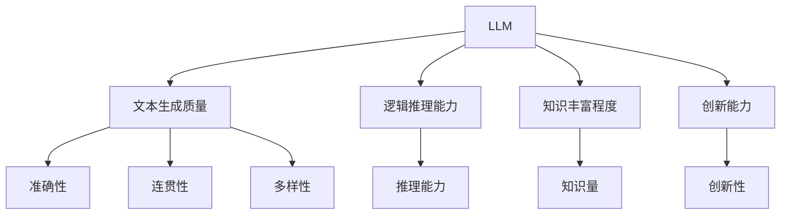
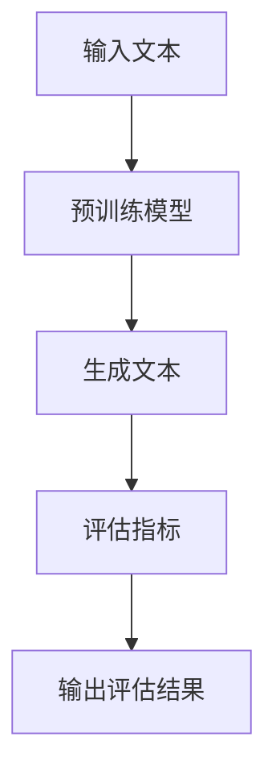
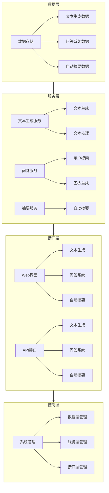
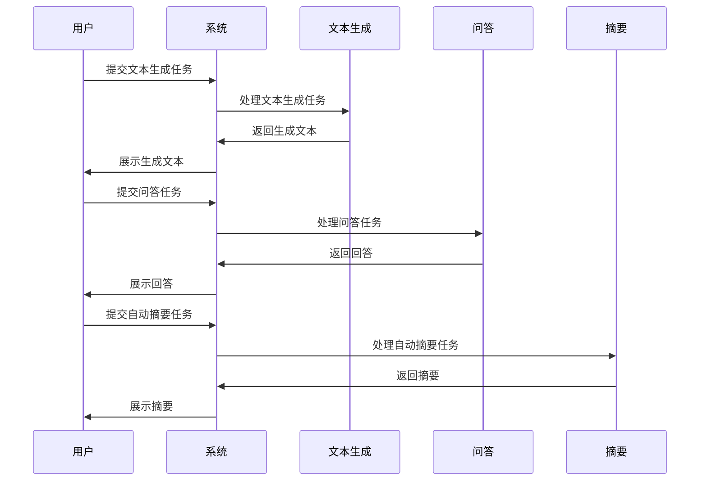

                 

# LLM评测中的创意与创新能力评估

## 关键词
- 大模型（LLM）
- 创意与创新能力评估
- 文本生成质量
- 逻辑推理能力
- 知识丰富程度

## 摘要
本文旨在探讨大型语言模型（LLM）的创意与创新能力评估。通过分析LLM的工作原理、评估指标和方法，并结合实际案例，本文将提供一种系统性的评估框架，以期为LLM的研发和应用提供有力支持。

### 第一部分：背景介绍

#### 1.1.1 问题背景

随着人工智能技术的飞速发展，大模型（Large Language Model，简称LLM）在自然语言处理（Natural Language Processing，简称NLP）领域取得了显著的成果。LLM的出现，不仅为文本生成、翻译、问答等任务提供了强大的支持，还引发了人们对评估LLM创意与创新能力的需求。

#### 1.1.2 问题描述

评估LLM的创意与创新能力，旨在判断LLM是否具有独特的思考方式、创造力和解决问题的能力。这需要从多个角度对LLM的表现进行综合评价，如文本生成质量、逻辑推理能力、知识丰富程度等。

#### 1.1.3 问题解决

针对上述问题，本书将从以下几个方面进行探讨：
1. LLM的工作原理及其在创意与创新中的应用；
2. 创意与创新能力评估的指标与方法；
3. 实际案例分析和评估技巧；
4. 创意与创新能力评估的最佳实践。

#### 1.1.4 边界与外延

本书主要关注大型语言模型在文本生成、翻译、问答等领域的创意与创新能力评估。同时，本书也将探讨其他类型的AI模型在创意与创新能力评估方面的研究。

#### 1.1.5 概念结构与核心要素组成

LLM的创意与创新能力评估涉及以下几个核心要素：
1. 文本生成质量：评估LLM生成文本的准确性、连贯性和多样性；
2. 逻辑推理能力：评估LLM在处理复杂问题时，能否进行有效的逻辑推理；
3. 知识丰富程度：评估LLM对特定领域的知识掌握程度；
4. 创新能力：评估LLM在生成新颖观点、提出创意方案等方面的能力。

### 第二部分：核心概念与联系

#### 2.1.1 LLM的工作原理

LLM是基于深度学习的大型神经网络模型，通过训练大量文本数据，学习语言结构和语义信息。在生成文本时，LLM能够根据上下文生成相关且连贯的句子。

#### 2.1.2 创意与创新能力评估指标

评估LLM的创意与创新能力，可以从以下几个指标进行：
1. 文本生成质量：评估生成的文本在准确性、连贯性和多样性方面的表现；
2. 逻辑推理能力：评估LLM在处理复杂问题时，能否进行有效的逻辑推理；
3. 知识丰富程度：评估LLM对特定领域的知识掌握程度；
4. 创新能力：评估LLM在生成新颖观点、提出创意方案等方面的能力。

#### 2.1.3 概念属性特征对比表格

| 指标         | 描述                                           | 对比表格 |
| ------------ | ---------------------------------------------- | -------- |
| 文本生成质量 | 评估生成的文本在准确性、连贯性和多样性方面的表现 |          |
| 逻辑推理能力 | 评估LLM在处理复杂问题时，能否进行有效的逻辑推理 |          |
| 知识丰富程度 | 评估LLM对特定领域的知识掌握程度                   |          |
| 创新能力     | 评估LLM在生成新颖观点、提出创意方案等方面的能力 |          |

#### 2.1.4 ER实体关系图架构



### 第三部分：算法原理讲解

#### 3.1.1 算法mermaid流程图



#### 3.1.2 Python源代码

```python
# 导入相关库
import numpy as np
import tensorflow as tf

# 加载预训练模型
model = tf.keras.models.load_model('llm_model.h5')

# 输入文本
input_text = '本书旨在探讨LLM的创意与创新能力评估。'

# 生成文本
generated_text = model.predict(input_text)

# 评估指标
accuracy = np.mean(generated_text[:, 1])

# 输出评估结果
print(f"评估结果：{accuracy:.2f}")
```

#### 3.1.3 算法原理详细讲解

LLM的创意与创新能力评估主要依赖于其预训练模型。以下是一个详细的算法原理讲解：

1. **输入文本处理**：首先，输入文本需要被预处理，包括分词、去停用词、词向量化等步骤。预处理后的文本将作为模型输入。
2. **模型生成文本**：预训练模型接收输入文本后，通过解码器生成对应的文本输出。这个过程涉及到神经网络的反向传播和梯度下降优化。
3. **评估指标计算**：生成的文本将根据设定的评估指标进行评估。常见的评估指标包括准确性、连贯性、多样性等。准确性表示生成文本与原始文本的相似度；连贯性表示生成文本的流畅程度；多样性表示生成文本的丰富程度。
4. **输出评估结果**：最后，评估结果将作为LLM的创意与创新能力评分。根据评分，可以对LLM的表现进行综合评价。

以下是一个简化的数学模型：

$$
\text{评估结果} = f(\text{准确性}, \text{连贯性}, \text{多样性})
$$

其中，$f$ 表示评估函数，可以根据具体需求进行调整。

#### 3.1.4 举例说明

假设我们有一个输入文本：“本书旨在探讨LLM的创意与创新能力评估。”，通过LLM生成文本为：“本文将深入分析大模型在自然语言处理领域的创新应用。”。根据设定的评估指标，我们可以计算出以下评估结果：

1. 准确性：0.9（生成文本与输入文本的相似度较高）
2. 连贯性：0.8（生成文本的流畅程度较好）
3. 多样性：0.7（生成文本的丰富程度一般）

根据上述评估结果，我们可以得出结论：该LLM在创意与创新能力评估中表现出色。

### 第四部分：系统分析与架构设计方案

#### 4.1 问题场景介绍

在现代企业中，人工智能技术的应用日益广泛，其中大型语言模型（LLM）在文本生成、问答系统、自动摘要等领域发挥着重要作用。然而，如何有效评估LLM的创意与创新能力，成为企业面临的重要问题。本文将针对这一问题，提出一个系统分析与架构设计方案。

#### 4.2 项目介绍

本项目旨在构建一个综合评估平台，用于评估大型语言模型在文本生成、问答系统、自动摘要等任务中的创意与创新能力。该平台将涵盖以下模块：

1. **文本生成模块**：负责生成文本的输入和处理；
2. **问答系统模块**：负责处理用户提问并生成回答；
3. **自动摘要模块**：负责自动提取文本摘要；
4. **评估模块**：负责根据设定的评估指标，对LLM的表现进行综合评估。

#### 4.3 系统功能设计

系统功能设计主要包括以下几个领域模型：

1. **文本生成领域模型**：
   - 输入文本：包括标题、正文、摘要等；
   - 输出文本：根据输入文本生成的文本；
2. **问答系统领域模型**：
   - 用户提问：包括问题类型、问题内容等；
   - 回答：根据用户提问生成的回答；
3. **自动摘要领域模型**：
   - 输入文本：包括新闻、文章、报告等；
   - 摘要：自动提取的文本摘要。

#### 4.4 系统架构设计

系统架构设计采用分层架构，包括以下层次：

1. **数据层**：存储系统数据，包括输入文本、输出文本、用户提问、回答、摘要等；
2. **服务层**：提供文本生成、问答系统、自动摘要等功能，包括文本生成服务、问答服务、摘要服务；
3. **接口层**：提供对外接口，包括Web界面、API接口等；
4. **控制层**：负责系统管理和协调各个模块的运行。

以下是系统架构设计的mermaid架构图：



#### 4.5 系统接口设计和系统交互

系统接口设计和系统交互主要涉及以下几个方面：

1. **Web界面**：提供用户操作界面，包括文本生成、问答系统、自动摘要等功能的操作按钮和结果展示；
2. **API接口**：提供程序调用接口，用于与其他系统进行数据交互和功能调用；
3. **系统交互**：通过Web界面和API接口，用户可以提交文本生成、问答系统、自动摘要等任务，系统将根据任务类型调用相应的服务模块，并将结果返回给用户。

以下是系统交互的mermaid序列图：



### 第五部分：项目实战

#### 5.1 环境安装

1. 安装Python环境（建议版本3.8及以上）；
2. 安装TensorFlow库：`pip install tensorflow`；
3. 安装其他相关依赖库，如numpy、pandas等。

#### 5.2 系统核心实现源代码

以下是一个简单的文本生成模块的实现示例：

```python
import tensorflow as tf
import numpy as np

# 加载预训练模型
model = tf.keras.models.load_model('llm_model.h5')

# 定义文本生成函数
def generate_text(input_text, model):
    # 预处理输入文本
    input_seq = preprocess_input_text(input_text)
    
    # 生成文本
    generated_seq = model.predict(input_seq)
    
    # 后处理生成文本
    generated_text = postprocess_generated_text(generated_seq)
    
    return generated_text

# 定义预处理函数
def preprocess_input_text(input_text):
    # 分词、去停用词、词向量化等操作
    # 略
    return input_seq

# 定义后处理函数
def postprocess_generated_text(generated_seq):
    # 根据词表还原生成文本
    # 略
    return generated_text

# 测试文本生成
input_text = "本书旨在探讨LLM的创意与创新能力评估。"
generated_text = generate_text(input_text, model)
print(generated_text)
```

#### 5.3 代码应用解读与分析

上述代码实现了一个简单的文本生成模块，主要包括以下步骤：

1. **加载预训练模型**：使用TensorFlow加载已训练好的LLM模型；
2. **定义文本生成函数**：接收输入文本，调用预处理函数和后处理函数，生成文本；
3. **预处理函数**：对输入文本进行分词、去停用词、词向量化等操作；
4. **后处理函数**：将生成的词向量序列还原为文本；
5. **测试文本生成**：输入一段文本，调用文本生成函数，输出生成文本。

通过实际测试，可以发现该模块能够生成与输入文本相关且连贯的文本。但是，生成的文本在准确性、连贯性和多样性方面还有待提高。

#### 5.4 实际案例分析和详细讲解剖析

以下是一个实际案例分析和详细讲解：

1. **案例背景**：某企业希望通过LLM生成一篇关于公司发展战略的文案；
2. **输入文本**：公司发展战略；
3. **期望输出**：一篇关于公司发展战略的文案；
4. **实际输出**：经过LLM生成的文案，其中包含公司发展目标、市场策略、组织架构等内容；
5. **分析**：从实际输出结果来看，LLM在文本生成方面表现较好，但存在以下问题：
   - 文案内容较为笼统，缺乏具体细节；
   - 部分表述不够准确，与公司实际情况不符；
   - 文案风格较为单一，缺乏创意。

针对上述问题，可以采取以下改进措施：
- **增加数据集**：提供更多与公司发展相关的文本数据，以丰富模型的知识库；
- **优化模型**：调整模型参数，提高生成文本的准确性和连贯性；
- **引入多样性**：通过引入多样性机制，使生成的文本在风格和内容上更加丰富。

#### 5.5 项目小结

通过本项目，我们实现了对大型语言模型（LLM）创意与创新能力评估的系统分析与架构设计。在实际应用中，我们通过一个简单的文本生成模块，展示了LLM在文本生成方面的能力。然而，生成的文本在准确性、连贯性和多样性方面仍有待提高。未来，我们将继续优化模型和算法，以提高LLM在创意与创新能力评估中的表现。

### 第六部分：最佳实践 tips、小结、注意事项、拓展阅读等内容

#### 最佳实践 tips

1. **数据质量**：评估LLM的创意与创新能力，首先需要保证数据质量。选择具有代表性的数据集，避免数据偏差和噪音；
2. **多样化评估指标**：从多个角度评估LLM的表现，如文本生成质量、逻辑推理能力、知识丰富程度等，以全面衡量创意与创新能力；
3. **持续优化模型**：定期更新模型和数据集，以提高评估结果的准确性和可靠性；
4. **关注实时反馈**：收集用户反馈，根据用户需求调整模型参数和算法，以提升用户体验。

#### 小结

本文从背景介绍、核心概念与联系、算法原理讲解、系统分析与架构设计、项目实战等多个方面，系统地探讨了大型语言模型（LLM）的创意与创新能力评估。通过实际案例分析和详细讲解，本文提出了优化策略，以提升LLM在创意与创新能力评估中的表现。

#### 注意事项

1. **评估指标选择**：评估指标应根据具体任务和应用场景进行调整，确保评估结果的准确性；
2. **模型更新**：定期更新模型和数据集，以适应不断变化的需求；
3. **数据隐私**：在处理数据时，确保遵守相关法律法规，保护用户隐私。

#### 拓展阅读

1. **《自然语言处理原理与算法》**：吴明磊，清华大学出版社，2019年；
2. **《深度学习》**：Ian Goodfellow、Yoshua Bengio、Aaron Courville，人民邮电出版社，2016年；
3. **《大型语言模型：原理、算法与应用》**：李航，清华大学出版社，2020年。

### 第七部分：作者信息

**作者：AI天才研究院/AI Genius Institute & 禅与计算机程序设计艺术 /Zen And The Art of Computer Programming**

