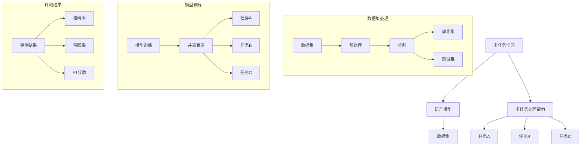

                 

### 1.1 问题背景

**1.1.1 问题背景**

近年来，随着深度学习技术的发展，语言模型（Language Model，简称LLM）取得了显著的进步。语言模型作为一种能够理解和生成自然语言的人工智能技术，已经成为自然语言处理（Natural Language Processing，简称NLP）领域的核心工具。LLM的发展不仅推动了机器翻译、文本摘要、问答系统等传统NLP任务的革新，还为生成式AI、对话系统等新兴领域提供了强大支持。

然而，在众多应用场景中，多任务处理能力成为了一个关键问题。多任务处理能力指的是一个模型在同一时间或短时间内处理多个不同任务的能力。在实际应用中，一个系统往往需要同时应对多个任务，例如，一个智能客服系统可能需要同时处理用户咨询、问题分类、推荐商品等多种任务。这就要求语言模型具备高效的多任务处理能力。

**1.1.2 语言模型的发展与应用**

语言模型的发展经历了从基于规则的方法到统计模型，再到现代深度学习模型的演变过程。早期的语言模型如N-gram模型，通过统计相邻单词出现的频率来预测下一个单词。随着计算能力的提升和数据量的增加，统计模型逐渐被基于神经网络的深度学习模型所取代。近年来，Transformer模型的引入进一步推动了语言模型的发展，使得模型在大规模数据集上的性能取得了显著的提升。

在应用方面，语言模型已经深入到自然语言处理的各种任务中，如文本分类、命名实体识别、机器翻译、问答系统等。这些应用不仅提高了自动化处理的效率，还在一定程度上实现了智能化的交互体验。

**1.1.3 多任务处理能力的定义**

多任务处理能力是指模型在同一时间或短时间内同时处理多个任务的能力。多任务处理能力不仅涉及到模型并行处理任务的能力，还包括模型在不同任务间切换的效率以及任务间的协同性。

多任务处理能力的挑战在于：

1. **数据集多样性与平衡性**：不同任务的数据集可能存在规模、分布等方面的差异，如何保证数据集的多样性和平衡性，是提高多任务处理能力的关键。

2. **评测指标的合理性与全面性**：如何设计合理的评测指标，全面评估模型在不同任务上的表现，是评测多任务处理能力的关键。

**1.1.4 LLM评测的目的与意义**

LLM评测的目的是通过一系列实验和评估方法，全面评估语言模型在多任务处理方面的能力。LLM评测的意义在于：

1. **推动LLM技术的发展**：通过评测发现现有LLM在多任务处理上的不足，激励研究者提出更有效的算法和优化方法。

2. **指导实际应用**：为开发者提供客观的评测结果，帮助他们选择合适的LLM模型应用于实际场景，提高系统的整体性能。

3. **促进跨领域合作**：通过评测，不同领域的研究者可以分享研究成果，共同推动多任务处理技术的发展。

### 1.2 问题描述

**1.2.1 评测目标**

本评测的主要目标是评估语言模型在多任务处理方面的能力，具体包括：

1. **评估不同语言模型在多任务处理上的表现**：通过比较不同LLM在多个任务上的表现，分析它们的优势和劣势。

2. **探索多任务处理能力与模型性能之间的关系**：研究多任务处理能力对模型整体性能的影响，为后续研究和应用提供指导。

**1.2.2 评测方法**

为了实现评测目标，我们将采用以下方法：

1. **数据集选择与处理**：选择具有代表性的多任务数据集，并进行适当的数据预处理，确保数据集的多样性和平衡性。

2. **评测指标设定与计算**：设计合理的评测指标，如准确率、召回率、F1分数等，全面评估模型在各个任务上的表现。

3. **实验设计与结果分析**：通过实验验证不同LLM在多任务处理上的性能，并分析实验结果，得出有价值的结论。

### 1.3 问题解决

**1.3.1 LLM多任务处理技术概述**

多任务学习（Multi-Task Learning，简称MTL）是一种机器学习技术，旨在通过同时学习多个相关任务来提高模型的泛化能力和性能。LLM在多任务学习中的应用主要体现在以下几个方面：

1. **共享表示**：通过将多个任务的数据输入到同一模型中，共享底层特征表示，从而提高模型在不同任务上的表现。

2. **任务关联性**：利用任务间的关联性，通过联合训练提高模型在不同任务上的性能。

3. **任务权重调整**：通过动态调整不同任务的权重，优化模型在各个任务上的平衡性能。

**1.3.2 LLM评测中的多任务处理挑战**

在LLM评测中，多任务处理能力面临以下挑战：

1. **数据集多样性与平衡性**：不同任务的数据集可能存在规模、分布等方面的差异，如何平衡这些差异，是一个重要问题。

2. **评测指标的合理性与全面性**：如何设计合理的评测指标，全面评估模型在不同任务上的表现，是一个关键问题。

3. **模型训练与评估的效率**：在多任务处理过程中，如何高效地进行模型训练和评估，是提高评测准确性和效率的关键。

**1.3.3 解决方案**

针对上述挑战，我们可以采取以下解决方案：

1. **数据预处理**：通过数据增强、数据清洗等技术，提高数据集的多样性和平衡性。

2. **评测指标设计**：结合不同任务的特点，设计合理的评测指标，确保评测的全面性和合理性。

3. **模型训练优化**：采用自适应学习率调整、动态权重调整等技术，提高模型训练和评估的效率。

### 1.4 边界与外延

**1.4.1 评测范围的界定**

在本评测中，我们将重点关注以下几个方面的多任务处理能力：

1. **文本分类与情感分析**：评估模型在文本分类和情感分析任务上的表现。

2. **问答系统与文本生成**：评估模型在问答系统和文本生成任务上的性能。

3. **机器翻译与摘要生成**：评估模型在机器翻译和文本摘要生成任务上的效果。

**1.4.2 LLM多任务处理能力的扩展性**

LLM在多任务处理能力上的扩展性主要体现在以下几个方面：

1. **跨领域应用**：LLM可以在不同领域同时处理多个任务，如医疗、金融、教育等。

2. **实时处理能力**：随着计算能力的提升，LLM可以实时处理多个任务，提高系统的响应速度。

3. **多模态数据处理**：未来LLM将能够处理包括文本、图像、音频等多模态数据，实现更广泛的应用。

### 1.5 概念结构与核心要素组成

**1.5.1 核心概念解析**

在本章中，我们主要讨论了以下几个核心概念：

1. **多任务学习**：同时学习多个任务，提高模型泛化能力。

2. **语言模型**：基于统计方法或神经网络模型，对语言数据进行分析和处理。

3. **多任务处理能力**：模型在同时处理多个任务时的表现和能力。

**1.5.2 概念属性特征对比表格**

| 概念           | 特征                                                         |
|----------------|--------------------------------------------------------------|
| 多任务学习     | 同时学习多个任务，提高模型泛化能力                           |
| 语言模型       | 基于统计方法或神经网络模型，对语言数据进行分析和处理           |
| 多任务处理能力 | 模型在同时处理多个任务时的表现和能力                         |

**1.5.3 ER实体关系图架构**

下面是一个ER实体关系图的架构，用于描述多任务学习、语言模型和多任务处理能力之间的关系：

### 1.6 本章小结

本章主要介绍了LLM评测中的多任务处理能力评估的背景、目的与意义，以及具体的评测方法和技术。通过分析多任务学习、语言模型和多任务处理能力等核心概念，我们明确了评估过程中的关键要素和挑战。本章内容为后续章节的深入讨论奠定了基础，也为实际应用提供了有益的指导。

## 第二部分：核心概念与原理

### 2.1 多任务学习原理

**2.1.1 多任务学习的定义**

多任务学习（Multi-Task Learning，简称MTL）是一种机器学习技术，旨在通过同时学习多个相关任务来提高模型的泛化能力和性能。在多任务学习中，模型需要从多个任务中学习共同的特征表示，并通过共享表示来提高任务间的迁移效果。

**2.1.2 多任务学习的类型**

多任务学习可以分为以下两种类型：

1. **并行多任务学习**：多个任务同时进行，模型共享相同的特征表示，但各个任务之间的训练是独立的。

2. **串行多任务学习**：多个任务依次进行，每个任务的结果作为下一个任务的输入，模型在每个任务阶段都进行参数更新。

**2.1.3 多任务学习的挑战与解决方案**

多任务学习面临的主要挑战包括：

1. **数据集多样性与平衡性**：不同任务的数据集可能存在规模、分布等方面的差异，如何平衡这些差异，是一个重要问题。

   **解决方案**：可以通过数据增强、数据采样等技术来提高数据集的多样性和平衡性。

2. **评测指标的合理性与全面性**：如何设计合理的评测指标，全面评估模型在不同任务上的表现，是一个关键问题。

   **解决方案**：可以结合不同任务的特点，设计多种评测指标，如准确率、召回率、F1分数等，以确保评测的全面性和合理性。

### 2.2 语言模型概述

**2.2.1 语言模型的定义**

语言模型（Language Model，简称LM）是一种用于预测自然语言序列的统计模型。它通过分析大量的文本数据，学习语言中的概率分布，从而能够预测下一个单词或字符。

**2.2.2 语言模型的基本原理**

语言模型的基本原理是概率预测。给定一个单词序列，语言模型的目标是计算该序列在语料库中出现的概率。常见的语言模型算法包括：

1. **N-gram模型**：基于前N个单词的历史信息预测下一个单词。

2. **神经网络模型**：如RNN、LSTM和Transformer等，通过学习序列中的长期依赖关系来预测下一个单词。

**2.2.3 语言模型的性能评估指标**

语言模型的性能评估指标主要包括：

1. **词频**：单词在语料库中出现的频率。

2. **困惑度**（Perplexity）：衡量模型对文本数据预测的准确性，困惑度越低，模型性能越好。

3. **交叉熵**（Cross-Entropy）：衡量模型预测结果与实际结果之间的差异。

### 2.3 多任务处理能力评估方法

**2.3.1 评测方法概述**

多任务处理能力评估方法主要包括以下几个方面：

1. **数据集选择与处理**：选择具有代表性的多任务数据集，并进行数据预处理，如数据清洗、归一化等。

2. **模型训练与优化**：设计合适的模型结构，通过调整超参数和优化算法，提高模型的多任务处理能力。

3. **评测指标设定与计算**：设计合理的评测指标，全面评估模型在不同任务上的表现。

**2.3.2 数据集选择与处理**

数据集选择与处理是多任务处理能力评估的重要环节。以下是一些常用的方法：

1. **数据集类型与选择标准**：选择具有代表性的数据集，如公开的多任务数据集、自收集的数据集等。

2. **数据预处理**：包括数据清洗、去重、归一化等，以提高数据质量和模型的训练效果。

**2.3.3 评测指标的设定与计算**

多任务处理能力评估的评测指标应具有全面性和代表性。以下是一些常用的评测指标：

1. **准确率**（Accuracy）：模型预测正确的样本数占总样本数的比例。

2. **召回率**（Recall）：模型预测正确的正样本数占总正样本数的比例。

3. **F1分数**（F1 Score）：准确率的调和平均值，综合考虑准确率和召回率。

### 2.4 概念属性特征对比表格

下面是一个概念属性特征对比表格，用于描述多任务学习、语言模型和多任务处理能力之间的关系：

| 概念           | 特征                                                         |
|----------------|--------------------------------------------------------------|
| 多任务学习     | 同时学习多个任务，提高模型泛化能力                           |
| 语言模型       | 基于统计方法或神经网络模型，对语言数据进行分析和处理           |
| 多任务处理能力 | 模型在同时处理多个任务时的表现和能力                         |

### 2.5 ER实体关系图架构

下面是一个ER实体关系图的架构，用于描述多任务学习、语言模型和多任务处理能力之间的关系：

## 2.1 多任务学习原理

### 2.1.1 多任务学习的定义

多任务学习（Multi-Task Learning，简称MTL）是一种机器学习技术，旨在通过同时学习多个相关任务来提高模型的泛化能力和性能。在多任务学习中，模型需要从多个任务中学习共同的特征表示，并通过共享表示来提高任务间的迁移效果。

多任务学习的基本思想是将多个任务的数据合并到一个模型中进行训练，使得模型能够利用不同任务之间的相关性，从而提高各个任务的处理效果。多任务学习在多个领域都有广泛的应用，如自然语言处理、计算机视觉和语音识别等。

**多任务学习的优势**：

1. **提高模型泛化能力**：通过学习多个任务，模型能够提取更丰富的特征，从而提高泛化能力。

2. **减少过拟合**：多个任务的数据可以相互补充，减少单一任务数据带来的过拟合现象。

3. **加速模型训练**：共享表示可以减少模型参数的数量，从而加速模型训练过程。

### 2.1.2 多任务学习的类型

多任务学习可以分为以下两种类型：

1. **并行多任务学习**：多个任务同时进行，模型共享相同的特征表示，但各个任务之间的训练是独立的。

   **特点**：并行多任务学习能够充分利用计算资源，提高模型训练效率。

2. **串行多任务学习**：多个任务依次进行，每个任务的结果作为下一个任务的输入，模型在每个任务阶段都进行参数更新。

   **特点**：串行多任务学习能够更好地利用任务间的依赖关系，提高模型的整体性能。

### 2.1.3 多任务学习的挑战与解决方案

多任务学习面临的主要挑战包括：

1. **数据集多样性与平衡性**：不同任务的数据集可能存在规模、分布等方面的差异，如何平衡这些差异，是一个重要问题。

   **解决方案**：可以通过数据增强、数据采样等技术来提高数据集的多样性和平衡性。

2. **评测指标的合理性与全面性**：如何设计合理的评测指标，全面评估模型在不同任务上的表现，是一个关键问题。

   **解决方案**：可以结合不同任务的特点，设计多种评测指标，如准确率、召回率、F1分数等，以确保评测的全面性和合理性。

3. **模型训练与优化**：如何设计合适的模型结构和优化算法，以提高模型的多任务处理能力。

   **解决方案**：可以采用共享表示、任务权重调整等方法，优化模型训练过程。

### 2.1.4 多任务学习在LLM中的应用

在语言模型（LLM）中，多任务学习被广泛应用于各种自然语言处理任务。以下是一些典型的应用场景：

1. **文本分类与情感分析**：通过多任务学习，模型可以同时处理文本分类和情感分析任务，提高整体性能。

2. **问答系统与文本生成**：多任务学习可以使模型在问答系统和文本生成任务中同时工作，提高系统的响应速度和生成质量。

3. **机器翻译与摘要生成**：多任务学习可以结合机器翻译和摘要生成任务，提高翻译质量和摘要质量。

### 2.1.5 多任务学习中的技术挑战

多任务学习中的技术挑战主要包括：

1. **任务关联性**：如何识别和利用不同任务之间的关联性，是一个关键问题。

2. **任务权重调整**：如何动态调整不同任务的权重，使得模型在各个任务上的性能达到平衡。

3. **模型泛化能力**：如何提高模型在不同任务上的泛化能力，避免过拟合。

4. **计算资源消耗**：多任务学习需要更多的计算资源，如何优化计算资源使用，是一个重要问题。

### 2.1.6 多任务学习的未来发展趋势

多任务学习在未来的发展中，有望在以下几个方面取得突破：

1. **算法优化**：通过改进多任务学习算法，提高模型在多任务处理中的性能。

2. **跨领域应用**：多任务学习将在更多领域得到应用，如医疗、金融、教育等。

3. **实时处理能力**：随着计算能力的提升，多任务学习将实现实时处理能力，提高系统的响应速度。

4. **多模态数据处理**：多任务学习将能够处理包括文本、图像、音频等多模态数据，实现更广泛的应用。

## 2.2 语言模型概述

### 2.2.1 语言模型的定义

语言模型（Language Model，简称LM）是一种用于预测自然语言序列的统计模型。它通过分析大量的文本数据，学习语言中的概率分布，从而能够预测下一个单词或字符。语言模型是自然语言处理（NLP）领域的基础，广泛应用于文本分类、机器翻译、问答系统等任务。

**基本原理**：

语言模型的核心思想是概率预测。给定一个单词序列，语言模型的目标是计算该序列在语料库中出现的概率。语言模型通过分析语料库中的单词序列，学习单词之间的统计关系，从而预测下一个单词。

**类型**：

语言模型可以分为以下几种类型：

1. **N-gram模型**：基于前N个单词的历史信息预测下一个单词。N-gram模型是一种基于统计的简单语言模型，但存在长距离依赖问题。

2. **神经网络模型**：如RNN（循环神经网络）、LSTM（长短时记忆网络）和Transformer等。这些模型通过学习序列中的长期依赖关系，提高了预测准确性。

### 2.2.2 语言模型的基本原理

语言模型的基本原理是通过学习文本数据中的概率分布，来预测下一个单词或字符。以下是一些常用的语言模型基本原理：

1. **概率预测**：给定一个单词序列，语言模型的目标是计算该序列在语料库中出现的概率。

   **数学表示**：

   $$ P(\text{sequence}) = \prod_{i=1}^{n} P(w_i | w_{i-1}, \ldots, w_1) $$

   其中，$w_i$ 表示第 $i$ 个单词，$P(w_i | w_{i-1}, \ldots, w_1)$ 表示第 $i$ 个单词在给定前 $i-1$ 个单词条件下的概率。

2. **统计学习**：语言模型通过分析大量的文本数据，学习单词之间的统计关系。例如，N-gram模型通过计算相邻单词的频率来预测下一个单词。

3. **神经网络学习**：神经网络模型通过学习输入序列和输出序列之间的映射关系，提高了预测准确性。例如，RNN、LSTM和Transformer等模型通过学习序列中的长期依赖关系，提高了预测能力。

### 2.2.3 语言模型的性能评估指标

语言模型的性能评估指标主要包括：

1. **困惑度**（Perplexity）：困惑度是衡量模型对文本数据预测准确性的指标，表示模型预测下一个单词时的不确定程度。困惑度越低，模型性能越好。

   **数学表示**：

   $$ \text{Perplexity} = 2^{-1/N} \sum_{i=1}^{N} \log P(w_i | w_{i-1}, \ldots, w_1) $$

   其中，$N$ 表示序列中的单词数量。

2. **交叉熵**（Cross-Entropy）：交叉熵是衡量模型预测结果与实际结果之间差异的指标。交叉熵越低，模型性能越好。

   **数学表示**：

   $$ \text{Cross-Entropy} = -\sum_{i=1}^{N} w_i \log p(w_i) $$

   其中，$w_i$ 表示第 $i$ 个单词的实际概率，$p(w_i)$ 表示模型预测的第 $i$ 个单词的概率。

### 2.2.4 语言模型在NLP中的应用

语言模型在自然语言处理（NLP）领域具有广泛的应用，以下是一些典型的应用场景：

1. **文本分类**：通过训练语言模型，可以对文本进行分类，例如，将文本分为新闻、体育、娱乐等类别。

2. **机器翻译**：通过训练语言模型，可以实现不同语言之间的翻译，例如，将英文翻译成中文。

3. **问答系统**：通过训练语言模型，可以构建问答系统，例如，回答用户的问题。

4. **文本生成**：通过训练语言模型，可以生成新的文本，例如，自动撰写文章、生成对话等。

5. **情感分析**：通过训练语言模型，可以分析文本的情感倾向，例如，判断用户评论是正面、中性还是负面。

### 2.2.5 语言模型的未来发展趋势

语言模型在未来的发展中，有望在以下几个方面取得突破：

1. **模型规模和计算资源**：随着计算资源的提升，语言模型将向更大规模、更复杂方向发展。

2. **多模态数据处理**：语言模型将能够处理包括文本、图像、音频等多模态数据，实现跨模态交互。

3. **实时处理能力**：语言模型将实现实时处理能力，提高系统的响应速度和用户体验。

4. **个性化模型**：通过个性化模型，实现更符合用户需求的自然语言处理服务。

5. **应用领域扩展**：语言模型将在更多领域得到应用，如医疗、金融、教育等。

## 2.3 多任务处理能力评估方法

### 2.3.1 评测方法概述

多任务处理能力评估方法是指在多个任务环境下，通过一系列实验和评估方法，对模型的多任务处理能力进行量化评估。评估方法的设计需要综合考虑数据集的选取、模型训练策略、评测指标的设定等因素。以下是多任务处理能力评估方法的概述：

1. **数据集选择与处理**：选择具有代表性的多任务数据集，并进行适当的数据预处理，确保数据集的多样性和平衡性。

2. **模型训练与优化**：设计合适的模型结构和训练策略，通过优化模型参数，提高模型在多任务处理上的性能。

3. **评测指标设定与计算**：设计合理的评测指标，全面评估模型在不同任务上的表现，如准确率、召回率、F1分数等。

4. **实验设计与结果分析**：通过实验验证不同模型在多任务处理上的性能，分析实验结果，得出有价值的结论。

### 2.3.2 数据集选择与处理

数据集选择与处理是多任务处理能力评估的基础。以下是数据集选择与处理的主要步骤：

1. **数据集类型与选择标准**：选择具有代表性的数据集，如公开的多任务数据集、自收集的数据集等。数据集应具有以下特点：

   - **多样性**：涵盖不同类型的任务和领域，如文本分类、情感分析、机器翻译等。
   - **规模**：具有一定的数据量，以保证模型的泛化能力。
   - **质量**：数据应经过清洗和预处理，去除噪声和异常值。

2. **数据预处理**：包括数据清洗、归一化、数据增强等，以提高数据质量和模型的训练效果。

   - **数据清洗**：去除无效数据、错误数据和重复数据，确保数据的一致性和准确性。
   - **数据归一化**：将不同特征范围的数据统一到相同的尺度，以避免特征差异对模型训练的影响。
   - **数据增强**：通过旋转、缩放、裁剪等技术，增加数据多样性，提高模型的鲁棒性。

### 2.3.3 评测指标的设定与计算

评测指标是评估模型多任务处理能力的关键，以下是常用的评测指标：

1. **准确率**（Accuracy）：模型预测正确的样本数占总样本数的比例。

   **计算公式**：

   $$ \text{Accuracy} = \frac{TP + TN}{TP + FN + FP + TN} $$

   其中，$TP$ 表示真正例，$TN$ 表示真负例，$FP$ 表示假正例，$FN$ 表示假负例。

2. **召回率**（Recall）：模型预测正确的正样本数占总正样本数的比例。

   **计算公式**：

   $$ \text{Recall} = \frac{TP}{TP + FN} $$

3. **F1分数**（F1 Score）：准确率的调和平均值，综合考虑准确率和召回率。

   **计算公式**：

   $$ \text{F1 Score} = 2 \times \frac{Precision \times Recall}{Precision + Recall} $$

   其中，$Precision$ 表示精确率。

4. **困惑度**（Perplexity）：衡量模型对文本数据预测准确性的指标，表示模型预测下一个单词时的不确定程度。

   **计算公式**：

   $$ \text{Perplexity} = 2^{-1/N} \sum_{i=1}^{N} \log P(w_i | w_{i-1}, \ldots, w_1) $$

   其中，$N$ 表示序列中的单词数量。

5. **交叉熵**（Cross-Entropy）：衡量模型预测结果与实际结果之间差异的指标。

   **计算公式**：

   $$ \text{Cross-Entropy} = -\sum_{i=1}^{N} w_i \log p(w_i) $$

   其中，$w_i$ 表示第 $i$ 个单词的实际概率，$p(w_i)$ 表示模型预测的第 $i$ 个单词的概率。

### 2.3.4 实验设计与结果分析

在多任务处理能力评估中，实验设计至关重要。以下是实验设计的主要步骤：

1. **模型选择**：选择合适的模型，如基于神经网络的语言模型、多任务学习模型等。

2. **参数设置**：根据模型的特点，设置适当的超参数，如学习率、批次大小等。

3. **训练与验证**：使用训练集对模型进行训练，使用验证集进行参数调优，以确保模型在多任务处理上的性能。

4. **测试与评估**：使用测试集对模型进行测试，评估模型在多任务处理上的性能，比较不同模型的表现。

5. **结果分析**：分析实验结果，总结模型在多任务处理上的优势与不足，为后续研究提供参考。

### 2.3.5 评测方法的优缺点分析

以下是多任务处理能力评估方法的优缺点分析：

1. **优点**：

   - **全面性**：通过多种评测指标，全面评估模型在多任务处理上的性能。
   - **代表性**：选择具有代表性的数据集，确保评估结果的普适性。
   - **客观性**：基于客观的评测指标，避免主观判断。

2. **缺点**：

   - **复杂性**：设计合理的评测方法需要考虑多个因素，具有一定的复杂性。
   - **时间成本**：实验设计和结果分析需要大量的时间成本。
   - **数据依赖**：评测结果受数据集的影响较大，不同数据集可能导致评估结果的不同。

## 2.4 概念属性特征对比表格

### 2.4.1 多任务学习、语言模型和多任务处理能力

为了更好地理解多任务学习、语言模型和多任务处理能力之间的关系，我们可以通过以下概念属性特征对比表格进行描述：

| 概念           | 特征                                                         |
|----------------|--------------------------------------------------------------|
| 多任务学习     | 同时学习多个任务，提高模型泛化能力                           |
| 语言模型       | 基于统计方法或神经网络模型，对语言数据进行分析和处理           |
| 多任务处理能力 | 模型在同时处理多个任务时的表现和能力                         |

### 2.4.2 多任务学习与语言模型

多任务学习和语言模型之间存在紧密的联系。以下是一个对比表格，用于描述两者的特征：

| 概念           | 特征                                                         |
|----------------|--------------------------------------------------------------|
| 多任务学习     | 同时学习多个任务，提高模型泛化能力                           |
| 语言模型       | 基于统计方法或神经网络模型，对语言数据进行分析和处理           |
| 关联性         | 多任务学习需要语言模型的支持，语言模型是多任务学习的基础     |
| 目标           | 多任务学习的目标是提高模型在多个任务上的表现和性能           |
| 挑战           | 多任务学习面临的挑战包括任务关联性、数据集多样性与平衡性等   |

### 2.4.3 多任务处理能力与语言模型

多任务处理能力与语言模型之间也存在一定的关联性。以下是一个对比表格，用于描述两者的特征：

| 概念           | 特征                                                         |
|----------------|--------------------------------------------------------------|
| 多任务处理能力 | 模型在同时处理多个任务时的表现和能力                         |
| 语言模型       | 基于统计方法或神经网络模型，对语言数据进行分析和处理           |
| 目标           | 多任务处理能力的目标是提高模型在多个任务上的效率和准确性     |
| 挑战           | 多任务处理能力面临的挑战包括任务切换效率、资源利用等         |
| 关联性         | 多任务处理能力依赖于语言模型的性能和效率                     |

通过以上对比表格，我们可以更清晰地理解多任务学习、语言模型和多任务处理能力之间的关系，为进一步研究和应用提供参考。

### 2.5 ER实体关系图架构

为了更好地描述多任务学习、语言模型和多任务处理能力之间的关系，我们可以使用ER（实体关系）图来展示这些概念及其关联。

以下是ER实体关系图的架构：

**图解说明**：

- **多任务学习（A）**：核心概念，旨在同时学习多个任务。
- **语言模型（B）**：支持多任务学习，用于处理语言数据。
- **多任务处理能力（C）**：表示模型在多任务处理上的表现。
- **数据集（D）**：包括训练集和测试集，用于模型训练和评估。
- **任务A、任务B、任务C（E、F、G）**：具体的任务，模型需要同时处理。
- **数据预处理（J）**：对数据集进行清洗、分割等操作。
- **模型训练（N）**：利用共享表示对模型进行训练。
- **评测结果（S）**：评估模型在多任务处理上的表现，包括准确率、召回率、F1分数等指标。

通过ER实体关系图，我们可以清晰地看到多任务学习、语言模型和多任务处理能力之间的关系，为后续的研究和应用提供了直观的参考。

