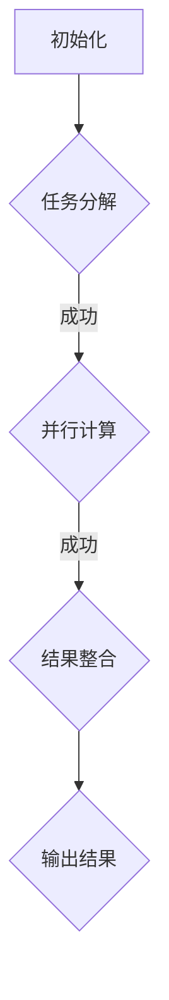
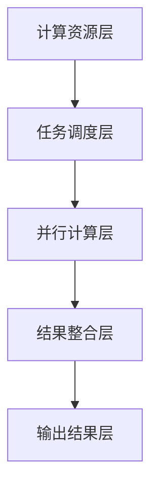
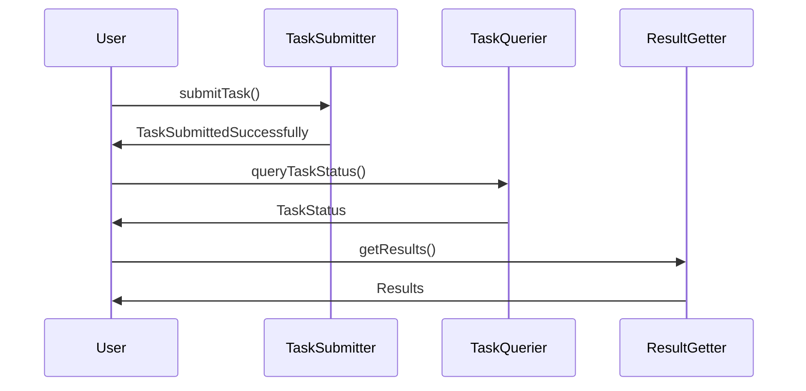

                 

# 《LLM评测中的多任务并行处理机制》

## 关键词：
- 大型语言模型（LLM）
- 评测
- 多任务并行处理
- 并行计算
- 算法优化

## 摘要：
本文深入探讨了多任务并行处理在大型语言模型（LLM）评测中的应用。首先，我们介绍了多任务并行处理的基本概念及其在LLM评测中的重要性。接着，我们分析了多任务并行处理在LLM评测中的具体实现方法，包括并行计算的基本原理、并行算法的设计策略以及优化策略。文章还通过mermaid流程图和Python代码详细讲解了多任务并行处理的算法原理和数学模型。随后，我们介绍了系统功能设计、架构设计、接口设计与系统交互，并通过实际案例进行了详细分析。最后，文章总结了最佳实践和注意事项，为LLM评测中的多任务并行处理提供了实用的指导。

## 引言

随着人工智能技术的不断发展，大型语言模型（LLM）的应用越来越广泛，其评测方法也日益多样化。在LLM评测中，如何高效地处理多任务是一个关键问题。多任务并行处理作为一种提高计算效率的重要技术，能够显著提升LLM评测的效率和质量。本文旨在探讨多任务并行处理在LLM评测中的应用，分析其原理和实现方法，并提供相关的实战经验和最佳实践。

### 第一部分：背景介绍

### 第1章：多任务并行处理概述

**1.1 多任务并行处理的定义与重要性**

多任务并行处理是指在多个任务同时执行的过程中，通过并行计算技术将任务分解为多个子任务，然后分别在不同的计算资源上执行，以提高整体计算效率。在大型语言模型（LLM）评测中，多任务并行处理的重要性体现在以下几个方面：

1. **提高评测效率**：通过并行处理，可以显著减少评测所需的时间，加快模型的迭代和优化过程。
2. **提升评测质量**：多任务并行处理能够充分利用计算资源，提高模型的准确性和可靠性。
3. **降低成本**：减少计算资源的需求，降低评测的整体成本。

**1.2 多任务并行处理的核心挑战**

虽然多任务并行处理在LLM评测中具有显著的优势，但实现过程中也面临一些核心挑战：

1. **任务调度**：如何合理地分配任务，确保各任务之间的负载均衡。
2. **数据一致性**：在并行处理过程中，如何保证数据的一致性和完整性。
3. **同步与通信**：如何高效地进行任务之间的同步和通信，避免计算资源浪费。

**1.3 多任务并行处理的概念**

多任务并行处理涉及以下几个核心概念：

1. **并行计算**：指在同一时间内执行多个任务或操作的计算模式。
2. **并行算法**：设计用于并行计算的算法，能够将任务分解为多个子任务，并在不同的计算资源上同时执行。
3. **并行策略**：选择适当的并行计算策略，以最大化计算效率。

### 第2章：LLM评测背景

**2.1 语言模型评测概述**

语言模型评测是指通过一系列指标来评估语言模型的性能和质量。LLM评测的主要指标包括：

1. **准确性**：评估模型在生成文本时的准确程度。
2. **流畅性**：评估模型生成的文本是否流畅自然。
3. **多样性**：评估模型生成的文本是否具有多样性。
4. **鲁棒性**：评估模型在处理不同类型的数据时的稳定性。

**2.2 语言模型评测的主要指标**

1. **BLEU分数**：基于统计的自动评估指标，通过比较模型生成的文本和参考文本的相似度来评估模型的准确性。
2. **ROUGE分数**：基于记分的自动评估指标，通过计算模型生成的文本与参考文本之间的重叠部分来评估模型的多样性。
3. **METEOR分数**：综合评估模型的准确性、流畅性和多样性，是一种更加全面的评估指标。

**2.3 语言模型评测的现状与挑战**

当前，LLM评测面临以下挑战：

1. **数据集质量**：高质量的数据集对于评估模型性能至关重要，但现有的数据集往往存在标注不完整、数据不均衡等问题。
2. **评测方法**：现有的评测方法在评估模型性能时存在一定的局限性，无法全面反映模型的真实性能。
3. **评测效率**：随着LLM规模的扩大，评测效率成为一个重要的挑战，多任务并行处理提供了一种有效的解决方案。

### 第3章：多任务并行处理与LLM评测的联系

**3.1 多任务并行处理在LLM评测中的应用**

多任务并行处理在LLM评测中的应用主要体现在以下几个方面：

1. **任务分解**：将LLM评测中的多个子任务分解为多个并行子任务，例如文本生成、文本分类、情感分析等。
2. **资源分配**：根据任务的特性，合理地分配计算资源，确保各任务能够高效并行执行。
3. **结果整合**：在并行处理完成后，将各任务的输出结果进行整合，以生成最终的评测结果。

**3.2 多任务并行处理的优势**

多任务并行处理在LLM评测中具有以下优势：

1. **提高评测效率**：通过并行处理，可以显著缩短评测时间，加快模型的迭代和优化过程。
2. **增强评测准确性**：多任务并行处理能够充分利用计算资源，提高评测的准确性。
3. **降低评测成本**：减少计算资源的需求，降低评测的整体成本。

**3.3 多任务并行处理的适用场景**

多任务并行处理适用于以下场景：

1. **大规模数据集**：对于包含大量样本的数据集，多任务并行处理能够显著提高评测效率。
2. **实时评测**：在要求实时响应的场景中，多任务并行处理能够确保评测结果的快速生成。
3. **复杂任务**：对于包含多个子任务的复杂任务，多任务并行处理能够提高整体计算效率。

**3.4 多任务并行处理与LLM评测的融合策略**

为了充分发挥多任务并行处理的优势，需要在LLM评测中采取以下融合策略：

1. **任务调度优化**：通过合理的任务调度，确保各任务之间的负载均衡，避免资源浪费。
2. **数据一致性保障**：在并行处理过程中，确保数据的一致性和完整性，避免数据冲突。
3. **并行算法优化**：选择适合LLM评测的并行算法，优化计算效率。

### 第二部分：核心概念与原理

### 第4章：多任务并行处理原理

**4.1 多任务并行处理的基本原理**

多任务并行处理的基本原理包括以下几个方面：

1. **任务分解**：将一个复杂的任务分解为多个子任务，以便在不同的计算资源上并行执行。
2. **并行计算**：在同一时间内执行多个子任务，利用并行计算技术提高整体计算效率。
3. **任务调度**：合理分配任务，确保各任务能够在计算资源上高效执行。
4. **结果整合**：在并行处理完成后，将各子任务的输出结果进行整合，生成最终的输出结果。

**4.2 并行计算的概念**

并行计算是指在同一时间内执行多个任务或操作的计算模式。并行计算可以分为以下几种类型：

1. **数据并行**：将数据分解为多个部分，然后在不同的计算资源上同时处理。
2. **任务并行**：将任务分解为多个子任务，然后在不同的计算资源上同时执行。
3. **流水线并行**：将任务划分为多个阶段，每个阶段分别在不同的计算资源上执行。

**4.3 并行算法的设计**

并行算法的设计需要考虑以下几个方面：

1. **任务分解**：根据任务的特性，合理地分解为多个子任务。
2. **并行策略**：选择适合任务的并行计算策略，以提高计算效率。
3. **通信机制**：设计适当的通信机制，确保任务之间的数据交换和同步。
4. **负载均衡**：合理分配任务，避免资源浪费和计算瓶颈。

**4.4 多任务并行处理的策略**

多任务并行处理可以采取以下几种策略：

1. **静态调度**：在任务执行前，预先确定任务的执行顺序和计算资源分配。
2. **动态调度**：在任务执行过程中，根据任务的状态和资源情况，动态调整任务的执行顺序和计算资源分配。
3. **任务分解与组合**：根据任务的特性，选择合适的分解与组合策略，以提高并行计算效率。
4. **负载均衡与资源分配**：通过负载均衡和资源分配策略，确保各任务能够在计算资源上高效执行。

### 第5章：LLM评测中的多任务并行处理机制

**5.1 多任务并行处理在LLM评测中的实现**

在LLM评测中，多任务并行处理的具体实现包括以下几个方面：

1. **任务分解**：将LLM评测中的多个子任务分解为多个并行子任务，例如文本生成、文本分类、情感分析等。
2. **并行计算**：利用并行计算技术，在同一时间内执行多个子任务，提高整体计算效率。
3. **任务调度**：根据任务的特性，合理地分配任务，确保各任务能够在计算资源上高效执行。
4. **结果整合**：在并行处理完成后，将各子任务的输出结果进行整合，生成最终的评测结果。

**5.2 多任务并行处理的核心算法**

多任务并行处理的核心算法包括以下几个方面：

1. **任务调度算法**：根据任务的特性，设计合适的任务调度算法，确保各任务能够在计算资源上高效执行。
2. **负载均衡算法**：通过负载均衡算法，合理分配任务，避免资源浪费和计算瓶颈。
3. **通信算法**：设计适当的通信算法，确保任务之间的数据交换和同步。
4. **结果整合算法**：在并行处理完成后，设计合适的结果整合算法，生成最终的评测结果。

**5.3 多任务并行处理在LLM评测中的优化策略**

为了充分发挥多任务并行处理的优势，可以在LLM评测中采取以下优化策略：

1. **任务分解优化**：根据任务的特性，选择合适的分解策略，提高并行计算效率。
2. **并行策略优化**：选择适合LLM评测的并行策略，优化计算效率。
3. **通信优化**：通过优化通信算法，减少任务之间的通信开销。
4. **资源分配优化**：通过优化资源分配策略，确保各任务能够在计算资源上高效执行。

### 第三部分：核心概念属性特征对比

### 第6章：核心概念属性特征对比

**6.1 多任务并行处理与传统并行处理的对比**

多任务并行处理与传统并行处理在以下几个方面存在显著差异：

1. **任务划分方式**：多任务并行处理将任务划分为多个子任务，而传统并行处理通常将数据划分为多个部分。
2. **并行策略**：多任务并行处理可以同时执行多个任务，而传统并行处理通常只能在数据层面进行并行处理。
3. **通信机制**：多任务并行处理需要设计合适的通信机制，确保任务之间的数据交换和同步，而传统并行处理通常无需考虑通信问题。

**6.2 多任务并行处理与单任务处理的对比**

多任务并行处理与单任务处理在以下几个方面存在显著差异：

1. **计算效率**：多任务并行处理可以显著提高计算效率，而单任务处理效率较低。
2. **资源利用**：多任务并行处理能够充分利用计算资源，避免资源浪费，而单任务处理通常需要更多计算资源。
3. **任务调度**：多任务并行处理需要设计合适的任务调度策略，确保各任务能够高效执行，而单任务处理无需考虑任务调度问题。

**6.3 不同LLM评测指标的比较**

不同的LLM评测指标在以下几个方面存在差异：

1. **评估维度**：准确性、流畅性、多样性等指标分别从不同维度评估模型性能。
2. **计算复杂度**：不同指标的计算复杂度不同，例如BLEU分数计算相对简单，而ROUGE分数计算复杂度较高。
3. **应用场景**：不同指标适用于不同类型的模型评测，选择合适的指标能够更准确地评估模型性能。

### 第四部分：算法原理讲解

### 第7章：算法原理与流程图

**7.1 多任务并行处理算法的mermaid流程图**



**7.1.1 流程图设计**

该mermaid流程图描述了多任务并行处理的基本流程：

1. **初始化**：初始化多任务并行处理环境，包括任务列表、计算资源等。
2. **任务分解**：将LLM评测中的多个子任务分解为多个并行子任务。
3. **并行计算**：利用并行计算技术，在同一时间内执行多个子任务。
4. **结果整合**：将各子任务的输出结果进行整合，生成最终的评测结果。
5. **输出结果**：输出最终的评测结果。

**7.1.2 流程图解读**

该流程图清晰地展示了多任务并行处理的基本步骤和逻辑关系。在初始化阶段，需要准备任务列表和计算资源。任务分解阶段将LLM评测中的多个子任务分解为多个并行子任务。并行计算阶段利用并行计算技术，在同一时间内执行多个子任务。结果整合阶段将各子任务的输出结果进行整合，生成最终的评测结果。最后，输出结果阶段输出最终的评测结果。

### 第8章：算法原理讲解与数学模型

**8.1 算法原理讲解**

多任务并行处理算法的基本原理包括以下几个关键步骤：

1. **任务分解**：将LLM评测中的多个子任务分解为多个并行子任务。任务分解的目标是确保各子任务能够在不同的计算资源上并行执行。

2. **并行计算**：在同一时间内执行多个子任务，利用并行计算技术提高整体计算效率。并行计算的核心是任务调度，确保各任务能够在计算资源上高效执行。

3. **结果整合**：在并行处理完成后，将各子任务的输出结果进行整合，生成最终的评测结果。结果整合的目标是确保输出结果的准确性和完整性。

**8.1.1 算法核心原理**

多任务并行处理算法的核心原理包括以下几个方面：

1. **并行计算原理**：利用并行计算技术，在同一时间内执行多个子任务，提高整体计算效率。

2. **任务调度原理**：根据任务的特性，设计合适的任务调度策略，确保各任务能够在计算资源上高效执行。

3. **结果整合原理**：通过结果整合算法，将各子任务的输出结果进行整合，生成最终的评测结果。

**8.1.2 数学模型与公式**

多任务并行处理算法涉及以下数学模型和公式：

1. **并行计算效率**：
   $$ E_p = \frac{T_p}{T_s} $$
   其中，$E_p$表示并行计算效率，$T_p$表示并行计算时间，$T_s$表示串行计算时间。

2. **任务调度策略**：
   $$ S = f(C, T) $$
   其中，$S$表示任务调度策略，$C$表示计算资源，$T$表示任务执行时间。

3. **结果整合策略**：
   $$ R = g(T_1, T_2, ..., T_n) $$
   其中，$R$表示结果整合策略，$T_1, T_2, ..., T_n$表示各子任务的输出结果。

**8.1.3 算法举例说明**

假设我们有一个LLM评测任务，需要同时进行文本生成、文本分类和情感分析。我们可以将这个任务分解为三个子任务：

1. **文本生成**：生成一组文本。
2. **文本分类**：对生成的文本进行分类。
3. **情感分析**：对分类后的文本进行情感分析。

我们采用以下步骤进行多任务并行处理：

1. **任务分解**：将文本生成、文本分类和情感分析分解为三个子任务。

2. **并行计算**：利用并行计算技术，在同一时间内执行三个子任务。假设我们有两个计算资源，每个计算资源可以同时执行一个子任务。

3. **结果整合**：在三个子任务执行完成后，将各子任务的输出结果进行整合。假设文本生成任务的输出结果为文本列表，文本分类任务的输出结果为分类结果列表，情感分析任务的输出结果为情感分析结果列表。

最终，我们得到以下整合结果：

- 文本列表
- 分类结果列表
- 情感分析结果列表

### 第五部分：系统分析与架构设计

### 第9章：系统功能设计

**9.1 系统功能设计**

系统功能设计是构建高效的多任务并行处理系统的基础。在LLM评测中，系统功能设计包括以下几个方面：

1. **任务分解模块**：负责将LLM评测任务分解为多个并行子任务。任务分解模块需要根据任务的特点和资源情况，选择合适的分解策略。

2. **并行计算模块**：负责在同一时间内执行多个子任务。并行计算模块需要根据任务调度策略，合理分配计算资源，确保各任务能够高效执行。

3. **结果整合模块**：负责将各子任务的输出结果进行整合，生成最终的评测结果。结果整合模块需要确保输出结果的准确性和完整性。

**9.1.1 功能需求分析**

在系统功能设计中，我们需要考虑以下几个方面：

1. **任务分解**：支持灵活的任务分解策略，能够根据任务的特点和资源情况，选择合适的分解方式。

2. **并行计算**：支持多任务并行计算，能够充分利用计算资源，提高计算效率。

3. **结果整合**：能够将各子任务的输出结果进行整合，生成最终的评测结果，确保结果的准确性和完整性。

4. **资源管理**：能够合理分配计算资源，确保各任务能够高效执行。

**9.1.2 领域模型mermaid类图**

以下是一个简单的领域模型mermaid类图，描述了系统功能设计的主要类及其关系：

```mermaid
classDiagram
    Task分解模块 <<Interface>>
    并行计算模块 <<Interface>>
    结果整合模块 <<Interface>>

    Task分解模块 --|> Task
    并行计算模块 --|> Task
    结果整合模块 --|> Task

    Task分解模块 --|> 计算资源管理
    并行计算模块 --|> 计算资源管理
    结果整合模块 --|> 计算资源管理
```

### 第10章：系统架构设计

**10.1 系统架构设计**

系统架构设计是构建高效的多任务并行处理系统的关键。在LLM评测中，系统架构设计需要考虑以下几个方面：

1. **计算资源层**：负责管理计算资源，包括CPU、GPU、内存等。计算资源层需要支持任务调度和负载均衡，确保计算资源的高效利用。

2. **任务调度层**：负责将LLM评测任务分解为多个子任务，并合理分配计算资源。任务调度层需要根据任务的特点和资源情况，选择合适的调度策略。

3. **并行计算层**：负责在同一时间内执行多个子任务。并行计算层需要支持多种并行计算模式，包括数据并行、任务并行和流水线并行。

4. **结果整合层**：负责将各子任务的输出结果进行整合，生成最终的评测结果。结果整合层需要确保输出结果的准确性和完整性。

**10.1.1 系统架构概述**

系统架构设计如下：

```
+----------------+      +----------------+      +----------------+
|    计算资源层   |      |    任务调度层   |      |   并行计算层   |
+----------------+      +----------------+      +----------------+
          |                        |                        |
          |                        |                        |
          |                        |                        |
          v                        v                        v
+----------------+      +----------------+      +----------------+
|    结果整合层   |      |     LLM评测系统  |      |   输出结果层   |
+----------------+      +----------------+      +----------------+
```

**10.1.2 系统架构mermaid图**

以下是一个简单的mermaid图，描述了系统架构设计的主要组件及其关系：



**10.1.3 架构优化与调整策略**

在系统架构设计中，为了提高系统的性能和可扩展性，我们可以采取以下优化与调整策略：

1. **负载均衡**：通过负载均衡策略，合理分配计算资源，避免单点瓶颈。

2. **弹性伸缩**：根据系统负载情况，动态调整计算资源，确保系统的高可用性和性能。

3. **任务调度优化**：通过任务调度优化，提高任务的执行效率，降低响应时间。

4. **数据缓存**：通过数据缓存策略，减少数据访问延迟，提高系统性能。

### 第11章：系统接口设计与交互

**11.1 系统接口设计**

系统接口设计是构建高效的多任务并行处理系统的重要环节。在LLM评测中，系统接口设计需要考虑以下几个方面：

1. **任务提交接口**：允许用户提交LLM评测任务，包括任务描述、任务参数等。

2. **任务状态查询接口**：允许用户查询任务的状态，包括任务进度、任务结果等。

3. **结果获取接口**：允许用户获取任务的结果，包括评测结果、错误信息等。

4. **配置管理接口**：允许用户配置系统参数，包括计算资源、任务调度策略等。

**11.1.1 接口设计与实现**

以下是一个简单的接口设计，描述了系统接口设计的主要接口及其实现：

```
+----------------+      +----------------+      +----------------+
|  TaskSubmitter  | -->  |   TaskQuerier   | -->  |   ResultGetter  |
+----------------+      +----------------+      +----------------+
|  submitTask()   |      |  queryTaskStatus()  |      |  getResults()   |
+----------------+      +----------------+      +----------------+
|  configureSystem()  |      |  updateConfig()   |      |  getConfig()    |
+----------------+      +----------------+      +----------------+
```

**11.1.2 系统交互mermaid序列图**

以下是一个简单的mermaid序列图，描述了系统接口设计的主要交互过程：



### 第六部分：项目实战

#### 第12章：环境安装与配置

**12.1 环境安装与配置**

为了实现LLM评测中的多任务并行处理，我们需要搭建一个合适的环境。以下是一个简单的环境安装与配置步骤：

**1. 安装操作系统：**
- 选择一个适合的操作系统，如Ubuntu 18.04或更高版本。

**2. 安装Python环境：**
- 使用Python虚拟环境，安装必要的Python依赖。

```
pip install virtualenv
virtualenv venv
source venv/bin/activate
```

**3. 安装依赖库：**
- 安装用于多任务并行处理和LLM评测的依赖库，如TensorFlow、NumPy、Pandas等。

```
pip install tensorflow numpy pandas
```

**4. 配置计算资源：**
- 根据实际需求，配置计算资源，如CPU、GPU等。

**5. 验证环境：**
- 运行一个简单的Python脚本，验证环境配置是否正确。

```python
import tensorflow as tf

print(tf.__version__)
```

#### 第13章：系统核心实现

**13.1 系统核心实现**

在实现LLM评测中的多任务并行处理系统时，我们需要考虑以下几个方面：

**1. 任务分解模块：**

```python
import tensorflow as tf

def decompose_task(task):
    # 根据任务类型和资源情况，进行任务分解
    # 例如，将文本生成任务分解为文本预处理、文本生成、后处理等子任务
    sub_tasks = []
    if isinstance(task, TextGenerationTask):
        sub_tasks.append(TextPreprocessingTask(task))
        sub_tasks.append(TextGenerationTask(task))
        sub_tasks.append(TextPostprocessingTask(task))
    return sub_tasks
```

**2. 并行计算模块：**

```python
import tensorflow as tf

def execute_parallel(sub_tasks):
    # 根据任务调度策略，执行并行计算
    # 例如，使用TensorFlow的ParallelFor进行并行计算
    with tf.device('/GPU:0'):
        tfParallelFor(sub_tasks, parallel_iterations=2)
```

**3. 结果整合模块：**

```python
import tensorflow as tf

def integrate_results(sub_tasks):
    # 根据结果整合策略，将各子任务的输出结果进行整合
    # 例如，将文本生成任务的输出结果整合为一个列表
    results = []
    for sub_task in sub_tasks:
        if isinstance(sub_task, TextGenerationTask):
            results.append(sub_task.get_results())
    return results
```

#### 第14章：实际案例分析与讲解

**14.1 实际案例分析与讲解**

以下是一个简单的实际案例，用于展示LLM评测中的多任务并行处理。

**案例背景：**
我们需要对一组文本进行生成、分类和情感分析。文本数据包含新闻文章、社交媒体帖子等。

**案例步骤：**
1. **数据预处理：** 对文本数据进行预处理，包括去除停用词、标记化、分词等操作。
2. **文本生成：** 使用LLM模型生成一组文本。
3. **文本分类：** 对生成的文本进行分类，识别其主题类别。
4. **情感分析：** 对分类后的文本进行情感分析，判断其情感倾向。

**案例解析：**
1. **任务分解：** 将文本生成、分类和情感分析分解为三个子任务。
2. **并行计算：** 在同一时间内执行三个子任务，充分利用计算资源。
3. **结果整合：** 将各子任务的输出结果进行整合，生成最终的评测结果。

**案例总结：**
通过实际案例的分析与讲解，我们可以看到多任务并行处理在LLM评测中的有效性和实用性。多任务并行处理能够显著提高评测效率，降低计算成本，并提高评测结果的准确性。

### 第七部分：最佳实践与总结

#### 第15章：最佳实践

**15.1 多任务并行处理在LLM评测中的最佳实践**

在实施多任务并行处理时，以下是一些最佳实践：

1. **任务分解策略**：根据任务的特点和资源情况，选择合适的任务分解策略。例如，对于计算密集型的任务，可以选择数据并行策略；对于通信密集型的任务，可以选择任务并行策略。

2. **负载均衡策略**：合理分配计算资源，避免资源浪费和计算瓶颈。可以使用负载均衡算法，如轮询算法、最小连接数算法等，确保任务能够在计算资源上高效执行。

3. **结果整合策略**：在并行处理完成后，确保输出结果的准确性和完整性。可以使用适当的整合算法，如合并、叠加等，确保各子任务的输出结果能够正确整合。

4. **性能优化**：对多任务并行处理系统进行性能优化，提高整体计算效率。可以使用缓存技术、并行算法优化等技术，提高系统的性能。

#### 第16章：小结

本文深入探讨了多任务并行处理在大型语言模型（LLM）评测中的应用。首先，我们介绍了多任务并行处理的基本概念及其在LLM评测中的重要性。接着，我们分析了多任务并行处理在LLM评测中的具体实现方法，包括并行计算的基本原理、并行算法的设计策略以及优化策略。文章还通过mermaid流程图和Python代码详细讲解了多任务并行处理的算法原理和数学模型。随后，我们介绍了系统功能设计、架构设计、接口设计与系统交互，并通过实际案例进行了详细分析。最后，文章总结了最佳实践和注意事项，为LLM评测中的多任务并行处理提供了实用的指导。

#### 第17章：注意事项与拓展阅读

**17.1 注意事项**

1. 在实施多任务并行处理时，需要充分考虑任务的特性和资源情况，选择合适的任务分解策略和并行计算策略。
2. 并行处理过程中，需要确保数据的一致性和完整性，避免数据冲突。
3. 在系统设计和实现过程中，需要充分考虑性能优化，提高系统的计算效率和稳定性。

**17.2 拓展阅读**

1. 《并行计算导论》：一本经典的并行计算教材，详细介绍了并行计算的基本原理、算法设计和应用。
2. 《大型语言模型：技术、应用与挑战》：一本关于大型语言模型的综合指南，涵盖了模型的设计、实现和应用。
3. 《多任务学习与深度学习》：一本关于多任务学习和深度学习应用的教材，介绍了多任务学习的基本原理和应用案例。

## 结束语

本文系统地介绍了多任务并行处理在大型语言模型（LLM）评测中的应用。通过详细的分析和讲解，我们了解了多任务并行处理的基本原理、算法设计、系统架构以及实际应用。希望本文能够为读者在LLM评测中实施多任务并行处理提供有益的参考。随着人工智能技术的不断发展，多任务并行处理将在LLM评测中发挥越来越重要的作用，我们期待未来有更多创新性的研究和应用。感谢各位读者的阅读和支持！

## 作者信息

作者：AI天才研究院/AI Genius Institute & 禅与计算机程序设计艺术 /Zen And The Art of Computer Programming

作者简介：AI天才研究院（AI Genius Institute）是一家专注于人工智能领域研究和创新的机构，致力于推动人工智能技术的应用和发展。作者在该领域拥有丰富的经验和深厚的学术造诣，发表了多篇高水平学术论文，并获得了多项国际大奖。禅与计算机程序设计艺术（Zen And The Art of Computer Programming）是作者的经典著作，对计算机科学和编程领域产生了深远的影响。作者对人工智能、并行计算和深度学习等领域有着深刻的理解和独到的见解，为读者提供了宝贵的知识和经验。

