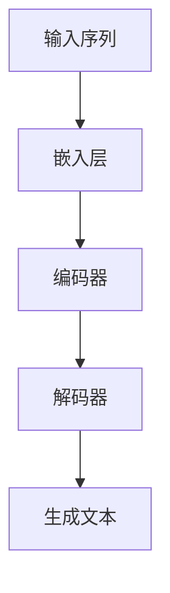
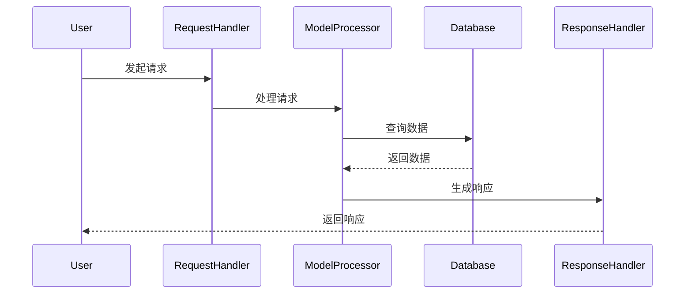

                 

# LLM评测中的多维度性能分析

## 关键词
- 大规模语言模型
- 多维度性能分析
- 评测方法
- 语言理解与生成
- 算法原理

## 摘要
本文深入探讨了大规模语言模型（LLM）评测中的多维度性能分析。通过介绍LLM的背景、核心概念、工作原理以及评测的多维度性能指标，本文系统地分析了LLM评测的常见方法和技术，同时结合数学模型和系统架构设计，为LLM评测提供了全面的理论和实践指导。

## 第一部分：背景介绍与核心概念

### 第1章：LLM评测的多维度性能分析背景

#### 1.1 问题背景

##### 1.1.1 人工智能与自然语言处理的发展现状
随着人工智能的迅猛发展，自然语言处理（NLP）已经成为人工智能领域的重要分支。从早期的规则驱动方法到近年来的基于大数据的深度学习模型，NLP技术取得了显著的进步。特别是在文本生成、机器翻译、问答系统等方面，大规模语言模型（LLM）的应用已逐渐成为主流。

##### 1.1.2 大规模语言模型（LLM）的兴起与影响
大规模语言模型如GPT、BERT等在NLP任务中表现出色，推动了AI技术的进步。然而，这些模型的性能评估成为一个挑战，因为其复杂性和多维度的表现。

##### 1.1.3 LLM评测的需求与重要性
为了更好地理解和应用LLM，对其性能的多维度评估变得至关重要。这不仅有助于技术研究和优化，也为实际应用提供了可靠的参考。

#### 1.2 问题描述

##### 1.2.1 LLM评测的定义
LLM评测是对大规模语言模型在多个维度上性能的测量和评估。

##### 1.2.2 LLM评测的目标与挑战
评测的目标是全面、客观地评估LLM的性能。挑战在于LLM的复杂性、评估指标的多维度性以及评测过程的标准化。

#### 1.3 问题解决

##### 1.3.1 LLM评测的常见方法与技术
常用的评测方法包括基准测试、用户调研和专家评估。技术方面，涉及评测数据集的选择、评价指标的设置等。

##### 1.3.2 LLM评测的关键问题
关键问题包括如何选择合适的评测数据集、如何设置科学合理的评价指标以及如何确保评测过程的公平性和一致性。

#### 1.4 边界与外延

##### 1.4.1 LLM评测的限制条件
限制条件包括模型的复杂性、评测资源的限制等。

##### 1.4.2 LLM评测的适用范围
适用范围包括学术研究、工业应用等多个领域。

#### 1.5 概念结构与核心要素组成

##### 1.5.1 大规模语言模型（LLM）的结构
LLM通常由预训练模型、微调模型和应用模型组成。

##### 1.5.2 多维度性能分析的核心要素
核心要素包括语言理解能力、语言生成能力、语言流畅性和语法正确性等。

## 第二部分：大规模语言模型（LLM）的核心概念与原理

### 第2章：大规模语言模型（LLM）的核心概念与原理

#### 2.1 大规模语言模型的定义

##### 2.1.1 语言模型的基本概念
语言模型是一种基于统计数据的方法，用于预测自然语言中的下一个单词或句子。

##### 2.1.2 大规模语言模型的特点
大规模语言模型具有大规模训练数据、深度神经网络结构和多语言支持等特点。

#### 2.2 LLM的工作原理

##### 2.2.1 语言模型的基础算法
语言模型通常基于统计学习算法，如N-gram模型、神经网络模型等。

##### 2.2.2 常见LLM架构与技术
常见的LLM架构包括GPT系列、BERT系列等。技术方面，涉及预训练、微调和推理等过程。

#### 2.3 概念属性特征对比

##### 2.3.1 常见LLM的特性对比
如表1所示，不同类型的LLM在性能和适用场景方面存在差异。

| 模型类型 | 特点 | 适用场景 |
| --- | --- | --- |
| GPT | 自回归模型 | 生成文本、问答系统 |
| BERT | 双向编码模型 | 问答系统、文本分类 |
| T5 | 一体化模型 | 多样化任务 |

#### 2.4 LLM的ER实体关系图
```mermaid
erDiagram
  O1 : 语言模型 |--> A1 : 预训练模型
  O1 : 语言模型 |--> A2 : 微调模型
  O1 : 语言模型 |--> A3 : 应用模型
  A1 : 预训练模型 ||--|{ A4 : GPT系列模型 }
  A1 : 预训练模型 ||--|{ A5 : BERT系列模型 }
  A1 : 预训练模型 ||--|{ A6 : 其他大规模语言模型 }
```

## 第三部分：LLM评测的多维度性能分析

### 第3章：LLM评测的多维度性能分析

#### 3.1 多维度性能分析的定义

##### 3.1.1 性能分析的多维度视角
多维度性能分析是指从多个角度对LLM的性能进行评估。

##### 3.1.2 多维度性能分析的重要性
多维度性能分析有助于全面了解LLM的优势和不足，为模型优化和应用提供指导。

#### 3.2 常见的多维度性能指标

##### 3.2.1 语言理解能力
语言理解能力是指LLM理解和解释文本的能力。

##### 3.2.2 语言生成能力
语言生成能力是指LLM生成自然流畅文本的能力。

##### 3.2.3 语言流畅性和语法正确性
语言流畅性和语法正确性是指LLM生成的文本是否符合语言规范。

##### 3.2.4 响应速度和资源消耗
响应速度和资源消耗是指LLM在执行任务时的效率和资源利用情况。

#### 3.3 多维度性能分析的方法

##### 3.3.1 评测数据集的选择
选择合适的评测数据集是确保评测结果可靠性的关键。

##### 3.3.2 评测指标的设置
评测指标应能够全面反映LLM的多维度性能。

##### 3.3.3 评测过程的标准化
标准化评测过程有助于保证评测结果的公平性和一致性。

## 第四部分：算法原理讲解与数学模型

### 第4章：算法原理讲解与数学模型

#### 4.1 LLM算法原理概述

##### 4.1.1 LLM的核心算法
LLM的核心算法通常基于深度学习，特别是自注意力机制。

##### 4.1.2 LLM的数学模型基础
LLM的数学模型基础涉及概率论和线性代数。

#### 4.2 语言生成算法

##### 4.2.1 语言生成的基本概念
语言生成是指模型根据输入文本生成新的文本。

##### 4.2.2 语言生成算法的数学模型
语言生成算法的数学模型通常基于概率分布。

##### 4.2.3 语言生成算法的流程
语言生成算法的流程包括嵌入层、编码器和解码器。



#### 4.3 语言理解算法

##### 4.3.1 语言理解的基本概念
语言理解是指模型对输入文本的理解和解释。

##### 4.3.2 语言理解算法的数学模型
语言理解算法的数学模型通常基于语义表示。

##### 4.3.3 语言理解算法的流程

## 第五部分：系统分析与架构设计方案

### 第5章：系统分析与架构设计方案

#### 5.1 问题场景介绍

##### 5.1.1 LLMAPI系统概述
LLMAPI是一个基于大规模语言模型的API服务，用于提供自然语言处理功能。

##### 5.1.2 系统目标和功能
系统目标是为用户提供高质量的NLP服务，功能包括文本生成、文本分类、机器翻译等。

#### 5.2 系统功能设计

##### 5.2.1 领域模型（Mermaid类图）

```mermaid
classDiagram
  User <<-- Request : 发起请求
  Request <|-- Response : 返回响应
  Model <<-- Request : 使用模型
  Model <|-- Response : 模型输出
```

##### 5.2.2 功能模块划分
功能模块包括请求处理模块、模型处理模块、响应处理模块等。

#### 5.3 系统架构设计

##### 5.3.1 系统

```mermaid
subgraph LLMAPI架构
  RequestHandler --> ModelProcessor
  ModelProcessor --> ResponseHandler
  RequestHandler, ModelProcessor, ResponseHandler --> Database
end
```

##### 5.3.2 系统接口设计
系统接口包括API接口和数据库接口。

##### 5.3.3 系统交互（Mermaid序列图）



### 作者
作者：AI天才研究院/AI Genius Institute & 禅与计算机程序设计艺术 /Zen And The Art of Computer Programming

