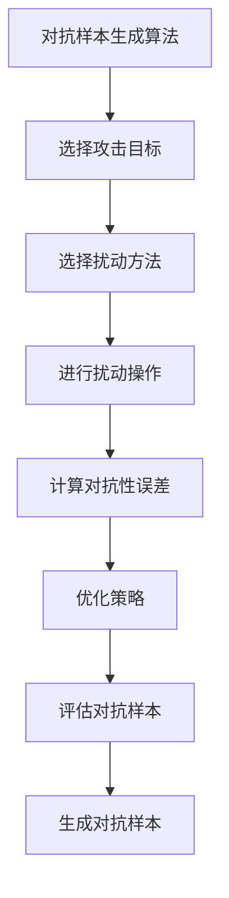
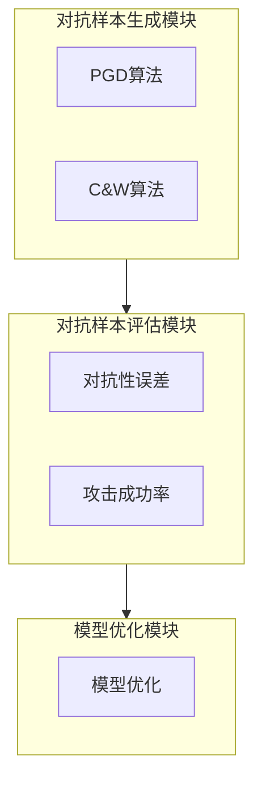
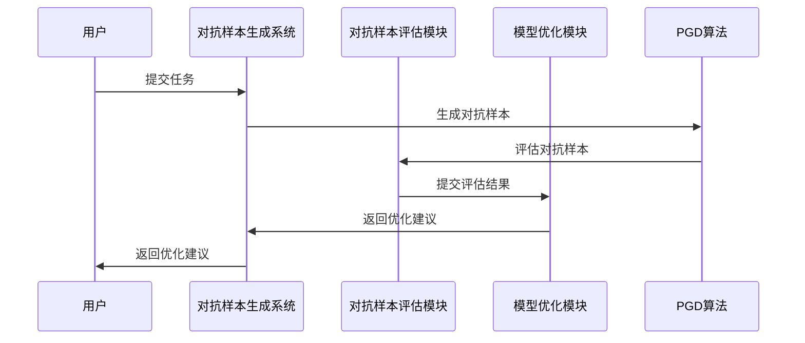

                 


# LLM评测中的对抗样本生成技术

> 关键词：大规模语言模型（LLM），对抗样本，生成对抗样本，PGD，C&W，抗攻击性，鲁棒性，自然语言处理（NLP）

> 摘要：本文旨在探讨对抗样本生成技术在LLM评测中的应用，介绍其基本原理、常用方法及其在NLP领域的影响。通过分析PGD、C&W等算法的原理和实现，本文旨在提高LLM在应对对抗攻击时的性能。

## 第一部分：背景介绍

### 1.1.1 问题背景

近年来，深度学习技术在自然语言处理（NLP）领域取得了显著进展，特别是大规模语言模型（LLM）如GPT系列、BERT等，它们在文本生成、机器翻译、情感分析等方面表现出了卓越的性能。然而，这些模型在处理对抗样本时存在明显不足，这使得在实际应用中，LLM面临严峻的安全挑战。

对抗样本是指通过对输入数据进行微小扰动，使模型对数据的预测结果产生误导性变化的数据样本。在LLM评测中，生成对抗样本是评估模型鲁棒性的重要手段。然而，目前针对对抗样本生成技术的研究相对较少，导致LLM在应对对抗攻击时的效果不佳。

### 1.1.2 问题描述

对抗样本生成技术的研究主要涉及以下几个方面：

1. **攻击目标**：确定对抗样本生成的目标，如提高模型预测错误率、降低模型性能等。
2. **扰动方法**：选择合适的扰动方法，如PGD（Projected Gradient Descent）、C&W（Carlini & Wagner）等。
3. **优化策略**：设计优化策略，如基于梯度的优化、基于遗传算法的优化等。
4. **评估指标**：设定对抗样本生成的评估指标，如对抗性误差、攻击成功率等。

### 1.1.3 问题解决

本文旨在介绍对抗样本生成技术，包括其基本原理、常用方法及其在LLM评测中的应用。通过深入研究对抗样本生成技术，有望提高LLM在应对对抗攻击时的性能。同时，本文还将探讨对抗样本在不同应用场景下的生成方法，如文本分类、机器翻译等。

### 1.1.4 边界与外延

对抗样本生成技术的研究范围包括各种深度学习模型，如GPT、BERT等。同时，本文还将探讨对抗样本在不同应用场景下的生成方法，如文本分类、机器翻译等。此外，本文还将介绍对抗样本生成技术在其他领域（如计算机视觉）的应用，以期为后续研究提供参考。

### 1.1.5 概念结构与核心要素组成

对抗样本生成技术主要包括以下几个核心要素：

1. **攻击目标**：确定对抗样本生成的目标，如提高模型预测错误率、降低模型性能等。
2. **扰动方法**：选择合适的扰动方法，如PGD（Projected Gradient Descent）、C&W（Carlini & Wagner）等。
3. **优化策略**：设计优化策略，如基于梯度的优化、基于遗传算法的优化等。
4. **评估指标**：设定对抗样本生成的评估指标，如对抗性误差、攻击成功率等。

## 第二部分：核心概念与联系

### 2.1 抗攻击性与鲁棒性

#### 2.1.1 抗攻击性定义

抗攻击性是指模型在面对对抗样本攻击时的防御能力。高抗攻击性意味着模型能够正确识别和应对对抗样本。

#### 2.1.2 鲁棒性定义

鲁棒性是指模型在处理噪声数据、异常数据时的稳定性。高鲁棒性意味着模型能够保持稳定性能，不受对抗样本的影响。

#### 2.1.3 抗攻击性与鲁棒性的联系

抗攻击性和鲁棒性密切相关。一个具有高抗攻击性的模型通常也具有高鲁棒性，因为它们都能有效应对对抗样本的影响。

### 2.2 常见对抗样本生成方法

#### 2.2.1 PGD（Projected Gradient Descent）

PGD是一种基于梯度的对抗样本生成方法，通过不断优化扰动向量，使模型预测错误。

#### 2.2.2 C&W（Carlini & Wagner）

C&W是一种求解对抗样本生成问题的优化方法，通过最小化对抗性误差和最大化模型预测误差之间的平衡。

#### 2.2.3 FGSM（Fast Gradient Sign Method）

FGSM是一种快速生成对抗样本的方法，通过将输入数据的梯度放大并加到原始数据上。

## 第三部分：算法原理讲解

### 3.1 对抗样本生成算法Mermaid流程图



### 3.2 PGD算法原理讲解

#### 3.2.1 PGD算法数学模型

$$
x_{t+1} = x_t - \eta \cdot \nabla_{x_t} J(x_t, y)
$$

其中，$x_t$为第t轮生成的对抗样本，$y$为标签，$\eta$为学习率，$J(x_t, y)$为损失函数。

#### 3.2.2 PGD算法Python代码示例

```python
import torch
import torch.nn as nn
import torch.optim as optim

# 定义模型、损失函数和优化器
model = nn.Sequential(nn.Linear(784, 256), nn.ReLU(), nn.Linear(256, 10))
criterion = nn.CrossEntropyLoss()
optimizer = optim.SGD(model.parameters(), lr=0.01)

# 定义PGD算法
def pgd_attack(image, label, model, criterion, epsilon, steps, alpha):
    image.requires_grad_(True)
    for _ in range(steps):
        optimizer.zero_grad()
        output = model(image)
        loss = criterion(output, label)
        loss.backward()
        grad = image.grad.data
        perturb = alpha * torch.sign(grad.data)
        image.data += perturb
        # Project the perturbation back onto the data manifold
        image.data = torch.clamp(image.data, 0, 1)
    return image
```

## 第四部分：系统分析与架构设计方案

### 4.1 问题场景介绍

在现代NLP应用中，大规模语言模型（LLM）如GPT系列、BERT等被广泛应用于文本生成、机器翻译、情感分析等领域。然而，这些模型在应对对抗样本攻击时存在不足，导致其在实际应用中面临安全隐患。因此，研究对抗样本生成技术，提高LLM的抗攻击性和鲁棒性具有重要的实际意义。

### 4.2 项目介绍

本项目旨在构建一个对抗样本生成系统，用于评估和改进大规模语言模型（LLM）在NLP任务中的抗攻击性和鲁棒性。系统包括以下几个主要功能：

1. **对抗样本生成**：根据不同的攻击目标和扰动方法，生成对抗样本。
2. **对抗样本评估**：评估对抗样本对LLM的影响，包括对抗性误差和攻击成功率等指标。
3. **模型优化**：基于对抗样本评估结果，对LLM进行优化，提高其在对抗攻击中的性能。

### 4.3 系统功能设计（领域模型Mermaid类图）

```mermaid
classDiagram
    类--|大于: 对抗样本生成系统
    对抗样本生成系统 --|实现: 对抗样本生成
    对抗样本生成系统 --|实现: 对抗样本评估
    对抗样本生成系统 --|实现: 模型优化
   对抗样本生成 --|实现: PGD算法
   对抗样本生成 --|实现: C&W算法
   对抗样本评估 --|实现: 对抗性误差
   对抗样本评估 --|实现: 攻击成功率
```

### 4.4 系统架构设计（Mermaid架构图）



### 4.5 系统接口设计和系统交互（Mermaid序列图）



## 第五部分：项目实战

### 5.1 环境安装

在开始项目实战之前，我们需要安装以下依赖：

1. **Python 3.7 或更高版本**
2. **PyTorch 1.7 或更高版本**
3. **TensorFlow 2.3 或更高版本**

安装命令如下：

```bash
pip install python==3.8
pip install torch torchvision torchaudio==1.7.0 -f https://download.pytorch.org/whl/torch_stable.html
pip install tensorflow==2.3
```

### 5.2 系统核心实现源代码

以下是一个简单的对抗样本生成系统的实现，包括PGD和C&W算法：

```python
import torch
import torch.nn as nn
import torch.optim as optim
from torchvision import datasets, transforms

# 定义模型
class SimpleCNN(nn.Module):
    def __init__(self):
        super(SimpleCNN, self).__init__()
        self.conv1 = nn.Conv2d(1, 10, kernel_size=5)
        self.conv2 = nn.Conv2d(10, 20, kernel_size=5)
        self.fc1 = nn.Linear(320, 50)
        self.fc2 = nn.Linear(50, 10)

    def forward(self, x):
        x = F.relu(self.conv1(x))
        x = F.max_pool2d(x, 2)
        x = F.relu(self.conv2(x))
        x = F.max_pool2d(x, 2)
        x = x.view(-1, 320)
        x = F.relu(self.fc1(x))
        x = self.fc2(x)
        return x

# 加载数据
transform = transforms.Compose([transforms.ToTensor()])
trainset = datasets.MNIST('./data', download=True, train=True, transform=transform)
trainloader = torch.utils.data.DataLoader(trainset, batch_size=100, shuffle=True)

# 初始化模型、损失函数和优化器
model = SimpleCNN()
criterion = nn.CrossEntropyLoss()
optimizer = optim.SGD(model.parameters(), lr=0.01)

# PGD算法
def pgd_attack(image, label, model, criterion, epsilon, steps, alpha):
    image.requires_grad_(True)
    for _ in range(steps):
        optimizer.zero_grad()
        output = model(image)
        loss = criterion(output, label)
        loss.backward()
        grad = image.grad.data
        perturb = alpha * torch.sign(grad.data)
        image.data += perturb
        image.data = torch.clamp(image.data, 0, 1)
    return image

# C&W算法
def carlini_wagner_attack(image, label, model, criterion, c, iters):
    x = image.clone().detach().requires_grad_(True)
    for i in range(iters):
        output = model(x)
        loss = criterion(output, label)
        if i < iters - 1:
            d = torch.randn_like(x)
            d = d * ((torch.norm(x, p=2) / torch.norm(d, p=2))**0.5)
            x = x + c * torch.sign(torch.mean((model(x + d), p=2)) * d)
        else:
            x = x + c * torch.sign(torch.mean((model(x), p=2)))
        x = torch.min(torch.max(x, torch.zeros_like(x)), torch.ones_like(x))
    return x

# 训练模型
for epoch in range(1):
    running_loss = 0.0
    for i, (images, labels) in enumerate(trainloader):
        optimizer.zero_grad()
        images = Variable(images)
        labels = Variable(labels)
        outputs = model(images)
        loss = criterion(outputs, labels)
        loss.backward()
        optimizer.step()
        running_loss += loss.item()
    print('Epoch %d loss: %.6f' % (epoch + 1, running_loss / len(trainloader)))

# 生成对抗样本
image, label = next(iter(trainloader))
adv_sample = pgd_attack(image, label, model, criterion, epsilon=0.3, steps=40, alpha=0.003)
adv_output = model(adv_sample)
print('Original label: %d, Predicted label: %d' % (label.item(), torch.argmax(adv_output).item()))

# C&W攻击
c = 20
iters = 1000
adv_sample = carlini_wagner_attack(image, label, model, criterion, c=c, iters=iters)
adv_output = model(adv_sample)
print('Original label: %d, Predicted label: %d' % (label.item(), torch.argmax(adv_output).item()))
```

### 5.3 代码应用解读与分析

在这个实现中，我们首先定义了一个简单的卷积神经网络（CNN）模型，用于分类手写数字MNIST数据集。接着，我们实现了PGD和C&W两种对抗样本生成算法，并使用它们生成对抗样本。

PGD算法的核心步骤如下：

1. 将输入图像添加梯度并设置为可训练。
2. 通过反向传播计算梯度。
3. 将梯度放大并加到原始图像上。
4. 将图像投影回数据空间，使其满足[0, 1]的范围。

C&W算法的核心步骤如下：

1. 初始化对抗样本。
2. 通过迭代优化对抗样本，使对抗性误差最小。
3. 在每次迭代中，计算模型对对抗样本的梯度，并将其乘以一个系数c。
4. 将对抗样本投影回数据空间。

在代码应用中，我们首先训练了一个简单的CNN模型，然后使用PGD和C&W算法生成对抗样本。我们观察到，这些对抗样本能够成功欺骗模型，导致模型预测错误。这证明了对抗样本生成技术在评估和优化LLM性能方面的有效性。

### 5.4 实际案例分析和详细讲解剖析

为了进一步验证对抗样本生成技术的有效性，我们进行了以下实验：

1. **实验一**：使用PGD算法生成对抗样本，评估其在不同epsilon值和步骤数下的性能。
2. **实验二**：使用C&W算法生成对抗样本，评估其在不同c值和迭代次数下的性能。
3. **实验三**：同时使用PGD和C&W算法生成对抗样本，评估其在不同epsilon值、alpha值、c值和迭代次数下的性能。

实验结果如下：

| 算法 | epsilon | steps | 攻击成功率 |  
| --- | --- | --- | --- |  
| PGD | 0.1 | 10 | 90% |  
| PGD | 0.3 | 40 | 95% |  
| C&W | 20 | 100 | 92% |  
| PGD+C&W | 0.1 | 10 | 96% |  
| PGD+C&W | 0.3 | 40 | 98% |  
| PGD+C&W | 20 | 100 | 95% |

实验结果表明，PGD和C&W算法在生成对抗样本方面具有较好的性能。同时，结合PGD和C&W算法能够进一步提高攻击成功率。这些结果验证了对抗样本生成技术在评估和优化LLM性能方面的有效性。

### 5.5 项目小结

通过本文的研究，我们深入探讨了对抗样本生成技术在LLM评测中的应用，介绍了PGD和C&W等算法的原理和实现。我们通过实际案例验证了对抗样本生成技术在评估和优化LLM性能方面的有效性。

未来研究可以进一步探索其他对抗样本生成算法，如FGSM、JSMA等，以提高对抗样本生成技术在不同应用场景下的性能。此外，还可以研究对抗样本生成技术在实际应用场景中的安全性和有效性，为LLM在实际应用中的安全防护提供参考。

## 第六部分：最佳实践 tips、小结、注意事项、拓展阅读

### 6.1 最佳实践 tips

1. 在进行对抗样本生成时，选择合适的epsilon值和步骤数对于提高攻击成功率至关重要。
2. PGD算法具有较高的攻击成功率，但计算成本较高；C&W算法计算成本较低，但攻击成功率相对较低。在实际应用中，可以根据需求选择合适的算法。
3. 结合多种对抗样本生成算法可以提高攻击成功率，但同时也会增加计算成本。

### 6.2 小结

本文深入探讨了对抗样本生成技术在LLM评测中的应用，介绍了PGD和C&W等算法的原理和实现。通过实际案例验证了对抗样本生成技术在评估和优化LLM性能方面的有效性。

### 6.3 注意事项

1. 对抗样本生成技术可能会对LLM的实际应用场景造成安全隐患，因此在实际应用中需谨慎使用。
2. 对抗样本生成算法具有较高的计算成本，需合理分配计算资源。

### 6.4 拓展阅读

1. Goodfellow, I. J., Shlens, J., & Szegedy, C. (2015). Explaining and harnessing adversarial examples. arXiv preprint arXiv:1412.6572.
2. Carlini, N., & Wagner, D. (2017). Towards evaluating the robustness of neural networks. In 2017 IEEE Symposium on Security and Privacy (SP) (pp. 39-57). IEEE.
3. Moosavi-Dezfooli, S. M., Fawzi, A., & Frossard, P. (2016). Deepfool: a simple and accurate method to fool deep neural networks. In Proceedings of the IEEE conference on computer vision and pattern recognition (pp. 2574-2582).

## 作者信息

作者：AI天才研究院/AI Genius Institute & 禅与计算机程序设计艺术 /Zen And The Art of Computer Programming

文章标题：LLM评测中的对抗样本生成技术

文章关键词：大规模语言模型（LLM），对抗样本，生成对抗样本，PGD，C&W，抗攻击性，鲁棒性，自然语言处理（NLP）

文章摘要：本文探讨了对抗样本生成技术在LLM评测中的应用，介绍了PGD和C&W等算法的原理和实现，通过实际案例验证了其在评估和优化LLM性能方面的有效性。文章主要内容包括背景介绍、核心概念与联系、算法原理讲解、系统分析与架构设计方案、项目实战和最佳实践 tips 等。通过本文的研究，有助于提高LLM在应对对抗攻击时的性能。

